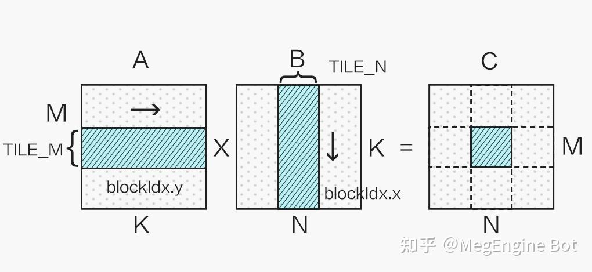

# CUDA 矩阵乘法终极优化指南

**Author:** MegEngine Bot

**Date:** 2021-09-14

**Link:** https://zhuanlan.zhihu.com/p/410278370

> 作者：
> 
> [@马骏](//www.zhihu.com/people/cc7c223731d793d7db2f715b53677110)
> 
> | 旷视 MegEngine 架构师

## 前言

单精度矩阵乘法（SGEMM）几乎是每一位学习 CUDA 的同学绕不开的案例，这个经典的计算密集型案例可以很好地展示 GPU 编程中常用的优化技巧，而能否写出高效率的 SGEMM Kernel，也是反映一位 CUDA 程序员对 GPU 体系结构的理解程度的优秀考题。本文将详细介绍 CUDA SGEMM 的优化手段，适合认真阅读过 [《CUDA C++ Programming Guide》](https://link.zhihu.com/?target=https%3A//docs.nvidia.com/cuda/cuda-c-programming-guide/)，具备一定 CUDA 编程基础的同学阅读，希望能给追求极致性能的同学们一些启发。

## CUDA 矩阵乘法优化手段详解

## Naive 实现的分析：到底差在哪里？

笔者面试过不少具有 CUDA 编程经验的校招同学，当提问使用 CUDA 编写一个 SGEMM Kernel 的时候，通常会获得这么一个答案：

```cpp
__global__ void matrixMul(const float *A, const float *B, float *C, 
                          int M, int N, int K) {
    int tx = blockIdx.x * blockDim.x + threadIdx.x;
    int ty = blockIdx.y * blockDim.y + threadIdx.y;
    if(ty < M && tx < N) {
        float c = 0;
        for(int i = 0; i < K; ++i){
            c += A[ty * K + i] * B[i * N + tx];
        }
        C[ty * N + tx] = c;
    }
}
```

这样一个 Naive 的 Kernel 当然不是笔者所期待的，因为这个 Kernel 的性能基本可以断定连 cublas 的 1/10 都不到，显然不符合我们追求高性能的需求。那么这个 Naive 的实现究竟差在哪呢？

分析代码我们可以看到，计算一次 FMA（乘累加）之前需要读一次 A 和读一次 B，众所周知，读取 Global Memory 的代价很大，通常都需要几百个 cycle（时钟周期），而计算一次 FMA 通常只需要几个 cycle，大量的时间被花费在了访存上。也许有思维活络的同学立马想到，可以将 A 和 B 矩阵先搬运到 [Shared Memory](https://zhida.zhihu.com/search?content_id=179303167&content_type=Article&match_order=1&q=Shared+Memory&zhida_source=entity)（SM 中低延迟的 on-chip memory，block 内线程共享，附 NVIDIA GPU 内存结构图）中降低访存的开销，这的确是一个很好的思路，但是这只能将访存代价从几百 cycle 降低到几十 cycle，并不改变问题的本质。问题的关键在于主体循环由两条 Load 指令与一条 FMA 指令构成，计算指令只占总体的 1/3，计算访存比过低，最终导致了访存延迟不能被隐藏，从而性能不理想。


让我们打开思路，若一个 thread 并不只计算一个结果，而是计算 4x4 个结果，并且使用 Shared Memory 优化，Hot Loop 会是什么样呢，伪代码如下所示：

```cpp
float c[4][4] = {{0}};
    float a_reg[4];
    float b_reg[4];
    for(int i = 0; i < K; i += TILE_K){
        __syncthreads();
        // transfer tile from global mem to shared mem
        load_gmem_tile_to_smem(A, i, smemA);
        load_gmem_tile_to_smem(B, i, smemB);
        __syncthreads();
    #pragma unroll
        for(int j = 0; j < TILE_K; ++j) {
            // load tile from shared mem to register 
            load_smem_tile_to_reg(smemA, j, a_reg);
            load_smem_tile_to_reg(smemB, j, b_reg);
            // compute matrix multiply accumulate 4x4
            mma4x4(a_reg, b_reg, c)；
        }
    }
```

分析可以得出从 smemA 读取到寄存器 a\_reg 中，需要进行 4 次访存操作，B 同理，那么主体的计算访存指令比例变成了 16/8，相对于之前的情况，计算指令的占比大大提高了。足够大的计算访存比能提升计算单元的利用率，并能起到隐藏访存延迟的作用。我们可以进一步提升计算访存比，从而使得 kernel 的性能接近理论峰值。

## 矩阵分块与资源分配

显然我们不能只使用一个 block 计算一个超大矩阵，这样会造成大量 SM（Streaming Multiprocessor）的闲置浪费，这就需要对矩阵进行分块计算，如下图所示：



不同的分块大小在不同 shape 的矩阵乘法应用上性能各有优劣，本文选取 128x128 的分块举例。

从上一小节我们可以看到，提升计算访存比有很大的好处，那么计算访存比可以无限提升吗，答案是否定的。因为要提升计算访存比，单个 thread 就需要计算一个更大的块，这就需要更多的寄存器，但寄存器的个数是有限的。以 [Turing 架构](https://zhida.zhihu.com/search?content_id=179303167&content_type=Article&match_order=1&q=Turing+%E6%9E%B6%E6%9E%84&zhida_source=entity)的 GPU 为例，单个 SM 的寄存器总量为 65536，因为指令编码的限制，单个 thread 能使用的最大寄存器个数为 255，并且寄存器个数并不是用得越多越好。这里需要引入一个 Occupancy（占用率）的概念，Occupancy 是指每个 SM 中活动线程束（Warp）数量与最大并发线程束数量的比值，高的 Occupancy 不一定意味着高性能，但可以通过切换执行 Warp 来起到一定隐藏延迟的作用。而每个 SM 中的 Active Warp 数量，取决于 block 使用的资源数量，具体为每个线程使用的寄存器个数与 Shared Memory 用量。Occupany 可通过 CUDA Toolkit 中提供的 CUDA\_Occupancy\_Calculator.xls 工具获得。

考虑一个 block 计算 128x128 的分块，若每个线程计算 128 个结果，需要的 block size 为 128，单个线程需要 128 个寄存器储存计算结果，加上所需的 Gmem to Smem，Smem to Reg 等一些所需的寄存器，大概共需要至少 180 多个，计算 Occupany 可知此时的 Active Warp 数只有 8，Occupany 为 25%；若设置 block size 为 256，则每个线程仅需计算 64 个结果，调整寄存器和 Shared Memory 的使用量并观察 Occupany，可知若每个线程只使用 128 个寄存器，block 内的 Shared Memory 使用量限制在 32K，Active Warp 数可以达到 16，是一个更优的选择：


并且此时的配置计算访存比可以达到 64/4（使用向量读取），已经足够隐藏访存延迟。

## 极致的访存优化

通常情况下，在选取了合适的 block 资源配置，利用 Shared Memory 降低访存延迟，做好循环展开之后，SGEMM Kernel 的性能已经能达到一个不错的水平（80% cublas），但这并不是我们旅程的终点。首先，我们可以使用向量读取指令`LDS.128`优化 Shared Memory 访问（对应 float4 数据类型），这能大幅减少访存指令的数量，进一步提升计算访存比，由此我们需要将 A 矩阵存入 smemA 之前做一次转置：


同时，我们的 kernel 为 256 个线程计算 128x128 的分块，为了能够合并访问 Shared Memory，我们将 256 个线程划为二维，令：

```cpp
int tx = threadIdx.x % 16;
    int ty = threadIdx.x / 16;
```

并按照如下方式向量读取 Shared Memory 中的数据：


最终单个线程计算 2x2 个 4x4 的结果，结果布局如图所示：


并且通过 micro benchmark 可以探测出，Turing(Tesla T4) 的 Global Memory 的访存延迟约 300 cycle，Shared Memory 的访存延迟在约 30 cycle，需要充分利用 **Prefetch** 的思想，隐藏 Global Memory 读入中间寄存器、将来自 Global Memory 的数据块写入 Shared Memory、从 Shared Memory 中读出数据块的访存延迟，以免计算单元因为 stall 而空闲太久，最终的伪代码如下所示：

```cpp
#define TILE_K 16
    __shared__ float4 smemA[2][TILE_K * 128 / 4];
    __shared__ float4 smemB[2][TILE_K * 128 / 4];
    float4 c[8][2] = {{make_float4(0.f, 0.f, 0.f, 0.f)}};
    float4 ldg_a_reg[2];
    float4 ldg_b_reg[2];
    float4 a_reg[2][2];
    float4 b_reg[2][2];

    // transfer first tile from global mem to shared mem
    load_gmem_tile_to_reg(A, 0, ldg_a_reg);
    load_gmem_tile_to_reg(B, 0, ldg_b_reg);

    store_reg_to_smem_tile_transpose(ldg_a_reg, 0, smemA[0]);
    store_reg_to_smem_tile(ldg_b_reg, 0, smemB[0]);
    __syncthreads();

    // load first tile from shared mem to register 
    load_smem_tile_to_reg(smemA[0], 0, a_reg[0]);
    load_smem_tile_to_reg(smemB[0], 0, b_reg[0]);

    int write_stage_idx = 1; //ping pong switch
    do {
        i += TILE_K;
        // load next tile from global mem
        load_gmem_tile_to_reg(A, i, ldg_a_reg);
        load_gmem_tile_to_reg(B, i, ldg_b_reg);

        int load_stage_idx = write_stage_idx ^ 1;

    #pragma unroll
        for(int j = 0; j < TILE_K - 1; ++j) {
            // load next tile from shared mem to register 
            load_smem_tile_to_reg(smemA[load_stage_idx], j + 1, a_reg[(j + 1) % 2]);
            load_smem_tile_to_reg(smemB[load_stage_idx], j + 1, b_reg[(j + 1) % 2]);
            // compute matrix multiply accumulate 8x8
            mma8x8(a_reg[j % 2], b_reg[j % 2], c)；
        }

        if(i < K) {
            // store next tile to shared mem
            store_reg_to_smem_tile_transpose(ldg_a_reg, 0, smemA[write_stage_idx]);
            store_reg_to_smem_tile(ldg_b_reg, 0, smemB[write_stage_idx]);
            // use double buffer, only need one sync
            __syncthreads();
            // switch
            write_stage_idx ^= 1;
        }

        // load first tile from shared mem to register of next iter
        load_smem_tile_to_reg(smemA[load_stage_idx ^ 1], 0, a_reg[0]);
        load_smem_tile_to_reg(smemB[load_stage_idx ^ 1], 0, b_reg[0]);
        // compute last tile mma 8x8
        mma8x8(a_reg[1], b_reg[1], c)；
    } while (i < K);

    store_c(c, C);
```

注：此处偷懒假设了 M、N、K 都是 4 的倍数，若非 4 的倍数则 Global Memory 不能使用 float4 进行读取，结果也不能用 float4 进行写回，而且为了合并写回，需要通过 Shared Memory 交换 warp 内的结果，保证每个 warp 执行一条 Store 指令能够写回一片连续的内存空间。

至此我们获得了一个充分优化的 SGEMM Kernel。另外 Ampere GPU 新增了`LDGSTS`指令，数据块从 Global Memory 到 Shared Memory 的过程不需要经过中间寄存器，可以进一步的优化 SGEMM 的性能。

## 性能对比

为了避免 cublas 选取到 split K 的 Kernel，我们将 K 固定为 1024，取 M, N = 2048, 4096, 8192 和 16384 作为测试用例，对比了上述 SGEMM Kernel 与 cublas 的性能（测试 GPU 为 Tesla T4，锁定核心频率为 1100）：


可以看到所实现的 SGEMM Kernel 达到了 cublas 平均 97.5% 的性能。

## 超越 cublas：使用 [SASS](https://zhida.zhihu.com/search?content_id=179303167&content_type=Article&match_order=1&q=SASS&zhida_source=entity) 调优 Kernel

到这里，可能有同学依然有一个疑问，我们似乎把所有能想到的优化手段都用上了，为什么写出来的 CUDA C Kernel 依然离 cublas 有一定的差距，答案是 cublas 所使用的 kernel 中有一大部分并不是通过 nvcc 编译的 CUDA Kernel，而是使用 NVIDIA GPU 的汇编语言（Shader Assembly，简称 SASS）编写的深度调优版本。尽管 nvcc 编译器在不断的进步，特别是 CUDA 11 中的 nvcc，所编译的 Kernel 与手工汇编优化版本之间的差距已大幅缩小，但仍然无法完全避免寄存器 Bank conflict 的影响以及充分利用寄存器的 Reuse Cache（这两个概念下面会进行详细的介绍），使得差距仍然存在。即使 PTX 这样的伪汇编语言，也无法精确控制寄存器的分配，和 CUDA C 面临着一样的困境。所以为了充分挖掘 GPU 的性能极限，需要对 GPU 指令和寄存器进行精确控制，就必须交由 GPU 原生汇编语言 SASS 完成。这方面已经有了很多研究，如出自 Citadel 的深入研究 NV GPU 架构的 [Dissecting the NVidia XXX GPU architecture via microbenchmarking](https://link.zhihu.com/?target=https%3A//arxiv.org/abs/1903.07486) 系列论文，这一系列文章对底层架构做了系统的测试、分析和总结，虽然其中某些结论可能并不准确，但总体来讲有很高的参考价值。同时催生了不少开源汇编器如 [KeplerAs](https://link.zhihu.com/?target=https%3A//github.com/xiuxiazhang/KeplerAs)、[maxas](https://link.zhihu.com/?target=https%3A//github.com/NervanaSystems/maxas)（最成熟，影响深远）、[turingas](https://link.zhihu.com/?target=https%3A//github.com/daadaada/turingas/) 和 [CuAssembler](https://link.zhihu.com/?target=https%3A//github.com/cloudcores/CuAssembler) 等一系列开源 SASS 汇编器，使得使用 SASS 编写高性能 Kernel 变成了可能。

## 寄存器 Bank conflict

我们知道 Shared Memory 有 Bank conflict，而寄存器的 Bank conflict 也是类似的概念。NVIDIA GPU 每个 SM 有独立的 Register File，而 Register File 被分为若干个 Bank，以 Maxwell 为例，若一条指令所需的源寄存器有 2 个以上来自于同一 Bank，则会产生 conflict，指令会相当于重发射，浪费一个 cycle。Maxwell/Pascal 的 Register File 的 Bank 数为 4，寄存器的`id%4`即为该寄存器的所属 bank（如 R0 属于 Bank 0，R5 属于 Bank 1），`FFMA R1, R0, R4, R1`这样的指令就回产生寄存器 Bank conflict。而 Turing 架构做了改进，Register File 被分为 2 个 Bank，每个 Bank 有 2 个 Port，若非三个源寄存器 id 同奇偶则不会产生冲突，大大缓解了寄存器 Bank conflict。

maxas 中的 Maxwell SGEMM SASS Kernel 为了缓解寄存器 Bank conflict，就对参与 FFMA 计算的寄存器做了精巧的分配（参考 [maxas 的 SGEMM 文档](https://link.zhihu.com/?target=https%3A//github.com/NervanaSystems/maxas/wiki/SGEMM)），如下图所示：


经过对 C 的巧妙排布，寄存器 Bank conflict 大大减少，但依然无法完全避免（如上图中黑框标识的部分，A/B 所使用的寄存器会产生 Bank conflict），这部分冲突就需要用到寄存器 Reuse 来消除。

## [Register Reuse](https://zhida.zhihu.com/search?content_id=179303167&content_type=Article&match_order=1&q=Register+Reuse&zhida_source=entity)

寄存器 Reuse 是 NVIDIA 为了缓解寄存器 Bank conflict 的问题，在 Maxwell 开始引入的一种机制，NVIDIA 在读取指令操作数的 Collector 单元加入了寄存器的 Reuse Cache。Reuse Cache 是只读的，指令获取 Operand 是否通过此 Cache 由该指令的 control code（[maxas 的 control code wiki](https://link.zhihu.com/?target=https%3A//github.com/NervanaSystems/maxas/wiki/Control-Codes) 中有详细的介绍）所指定，使用 cuobjdump 反汇编一些 Kernel 可以发现一些寄存器后有`.reuse`的 flag，即表示该寄存器从 Reuse Cache 而非 Register File 中取值，从而消除寄存器 Bank conflict：

```python
# Maxwell GPU
FFMA R2, R64.reuse, R73, R2; # R64 进入 Reuse Cache
FFMA R3, R64.reuse, R72, R3; # R64 从 Reuse Cache 中获取，避免与 R72 冲突
```

但是使用`.reuse`需要满足一定条件（寄存器将被改写前不能设置`.reuse`），胡乱设置 reuse flag 会有可能获取的是历史值，造成计算错误，根据笔者的理解，`.reuse`更像是使该寄存器的值在 Reuse Cache 中 hold 住的标识。nvcc 编译 CUDA Kernel 也会使用 Reuse Cache 去规避一些寄存器 Bank conflict，但是因为寄存器分配及指令排布的原因，Reuse 的利用率并不高，反汇编我们刚才写的 SGEMM Kernel，对主循环的所有 FFMA 指令做个统计，可以发现 Reuse Cache 仅达到 20%左右，而 maxas 的 SASS Kernel 通过设计使得 Reuse 的利用率可以达到 49%。

最终通过 SASS 精细调优的 SGEMM Kernel 的性能可以全面超越 cublas，感兴趣的同学们可以自行编译 maxas 中的 SGEMM Kernel 在 Maxwell 或者 Pascal GPU 上进行测试。最后，虽然使用 SASS 能充分挖掘 GPU 的性能，但面临有三大问题：1. 第三方 NV GPU 汇编器依赖于对 GPU 架构的逆向研究，可能因为没有探究到全部的硬件底层细节而存在未知的 BUG；2. 汇编 Kernel 难于开发，更难于调试；3. NV 每一代 GPU 的 ISA（指令集）都不尽相同，需要不断开发对应的汇编器和汇编 Kernel。正因为这几大问题的存在，使得使用 SASS 编写 Kernel 是个费时费力的工作，除非有追求极致性能的需求，否则不建议轻易尝试。

## GEMM 的延伸：优化卷积运算

我们都知道优化卷积运算可以通过 im2col 将卷积映射为矩阵乘法来实现，对于上述 SGEMM Kernel，只需要将 Global Memory 的数据搬运到 Shared Memory 这一过程稍作修改，由对应位置的映射变为 im2col 映射，SGEMM Kernel 就摇身一变成为了计算 Conv 的 Kernel，这即是 cudnn 卷积运算的 Implicit Gemm 算法。而在 im2col 过程中，若直接计算指针的偏移量的话，会引入大量的整数除法和取余运算，这是一笔不小的开销，所以可以将地址的偏移量在 host 端预先计算好，作为 param 传入 kernel 中，则可以在需要时从常量内存中读取，避免整数除法和取余，实现 Implicit Precomp Gemm，详细细节可以参看我们之前的文章 [MegEngine TensorCore 卷积算子实现原理](https://zhuanlan.zhihu.com/p/372973726)。在这一思路的指引下，我们基于 cutlass 实现了高效的 int8/int4 卷积运算（[MegEngine cutlass](https://link.zhihu.com/?target=https%3A//github.com/MegEngine/cutlass)），并且在持续的迭代中，欢迎大家试用。

## 总结

本文详细介绍了如何编写一个高效率的 CUDA SGEMM Kernel，并且介绍了使用 SASS 编程这一极限优化性能的手段，并稍稍延伸展开了通过 Implicit Gemm 优化卷积运算的思路，希望可以给予有志于极致挖掘硬件性能的同学们一定的启发。最后欢迎各位同学加入 MegEngine 团队，一起优化深度学习的训练和推理性能。

## 附：

GitHub：[MegEngine 天元](https://link.zhihu.com/?target=https%3A//github.com/MegEngine)

官网：[MegEngine-深度学习，简单开发](https://link.zhihu.com/?target=https%3A//megengine.org.cn/)

欢迎加入 MegEngine 技术交流 QQ 群：1029741705

> bot 说：文章都看完啦~ 是否有兴趣加入到深度学习框架开发中来？  
>   
> Megengine 团队现正火热招聘中！期待你的加入~  
> 简历投递或详细信息了解可添加微信：duoduo715495  
> 【框架开发工程师（C++）】  
> 职位描述:  
> 1\. 负责旷视核心深度框架 MegEngine 的设计，演进，实现，维护和优化  
> 2\. 优化 MegEngine 在各个计算平台（CUDA / Arm / x86 等）上的性能  
> 3\. 持续探索改进深度学习框架的先进优化方法（例如图优化，自动代码生成，超低 bit 量化，稀疏化等）  
> 技能要求:  
> 1\. 1-3 年的性能优化经验（X86，CUDA，ARM，OpenCL 等）  
> 2\. 有良好的数据结构与算法功底，能够熟练使用 C++ 语言编写较复杂的算法  
> 3\. 对深度学习和深度学习框架（Caffe，Tensorflow，PyTorch 等）有基本了解者优先  
> 4\. 有复杂系统设计经验者优先