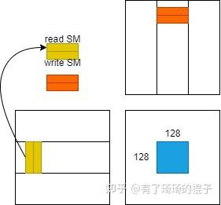

# 深入浅出GPU优化系列：GEMM优化（二）

**Author:** 有了琦琦的棍子

**Date:** 2022-03-27

**Link:** https://zhuanlan.zhihu.com/p/442930482

本篇是通用矩阵乘法（GEMM）优化的第二部分，主要来说说具体的代码，并做一个详细的解析。第一部分主要是讲了一些原理，如果没有看过的读者可以去看看，链接在下面。

[](https://zhuanlan.zhihu.com/p/435908830)

这篇文章的主要目的是让读者尽可能地理解GEMM优化的技巧，所以代码尽可能地**通俗易懂**。在兼顾易读性的同时，代码有**不错的性能表现**，在1024-4096的矩阵上平均能够达到**cublas 91%**的性能表现。

本篇文章主要分四部分进行讲述。第一部分是GEMM算法的概述，先让大家大概地了解代码在做什么事情。第二部分就是详细的代码解析，带着大家一行一行地来看。第三部分是实验结果，主要是和cublas的对比。第四部分是总结。

## 一、GEMM算法概述

这个章节里主要来说一下GEMM的一个计算流程，其实这一点已经在GEMM优化（一）中提及。但上一篇文章主要说得是原理，关于具体计算逻辑，还是不太直观，所以我们在这里再提一下。然后这个具体的计算逻辑分为两个阶段介绍，分别是不采用[数据预取](https://zhida.zhihu.com/search?content_id=186558675&content_type=Article&match_order=1&q=%E6%95%B0%E6%8D%AE%E9%A2%84%E5%8F%96&zhida_source=entity)和采用数据预取，这主要是考虑到直接说数据预取，有读者可能会看得云里雾里，比较难受，所以先把不采用数据预取这个内容说明白，然后再来讲这个数据预取。

### 1.1不采用数据预取

首先，我们先明确一下GEMM中的具体参数，也就是[GEMM优化（一）](https://zhuanlan.zhihu.com/p/435908830)中提到的bm、bn、bk、rm、rn。取bm=128,bn=128,bk=8,rm=8,rn=8。当这几个参数选定之后先来直观地感受一下这几个参数意义，假定给了三个矩阵，A，B，C，其维度都是2048×2048。要求解C=A×B。那么我们需要开启（2048/128）×（2048/128）=**256个block**，每个block里面有（128/8）×（128/8）=**256个线程**，每个线程需要负责计算C矩阵中8×8=64个元素的结果，每个block负责256×64=16384个元素的结果。对这几个数字的计算还不是很清楚的同学可以再看一下GEMM优化（一）来复习一下。**后面章节的所有内容都是默认这几个参数。**

明确了上面的参数之后，我们来仔细地观察其中一个block的计算逻辑。对于这个block而言，它需要进行2048/8=256次迭代，我们先把这个迭代称为**大迭代**，每一次大迭代都需要把A里面128×8=1024个元素和B里面8×128=1024个元素先放到[shared memory](https://zhida.zhihu.com/search?content_id=186558675&content_type=Article&match_order=1&q=shared+memory&zhida_source=entity)中。然后这个block中的256个线程把结果计算出来。计算完之后，再进入下一次大迭代。不断重复该过程，直至这个block负责的16384个元素的结果被求解出。大迭代示意图如下：


随后再具体看看每一个大迭代中，block中的线程的计算逻辑。在进行一个大迭代时，shared memory中有128×8=1024个A矩阵元素和8×128=1024个B矩阵元素。随后，每个线程需要进行8次迭代，我们把这个迭代成为**小迭代**。bk=8，所以有8次小迭代。每一次小迭代中，每个线程需要从shared memory中拿到A矩阵的一小列和B矩阵的一小行，即8个A的元素和8个B的元素。线程将这8+8=16个元素放置在[寄存器](https://zhida.zhihu.com/search?content_id=186558675&content_type=Article&match_order=1&q=%E5%AF%84%E5%AD%98%E5%99%A8&zhida_source=entity)中。每个线程需要负责8×8=64个元素的计算，一共会产生64条[FFMA指令](https://zhida.zhihu.com/search?content_id=186558675&content_type=Article&match_order=1&q=FFMA%E6%8C%87%E4%BB%A4&zhida_source=entity)。小迭代示意图如下：


以上就是不采用数据预取的GEMM算法计算逻辑。总的来说，**对于一个block而言，有256个大迭代，每个大迭代中又有8个小迭代**。这是后续内容的基础，如果还是不太清楚的话，可以再仔细看看，把这个过程完全搞清楚后，我们再继续接下来的内容，即采用数据预取后的GEMM算法计算逻辑。

### 1.2采用数据预取

采用数据预取的GEMM计算流程稍有差异。这个差异主要是体现在两个方面，第一个是开启的shared memory和寄存器数量，第二个是需要提前将一些数据放置到shared memory和寄存器中。下面来仔细说说这个流程。

为了实现数据预取，**需要开启两倍的shared memory和寄存器**。当然也可以将原来shared memory切分成两块，也就是将bm×bk和bk×bn的矩阵一分为二。以A中的小矩阵而言，变成了两个bm×bk/2。然后大迭代次数由原来的256变成了512。很多地方把这个技术叫做**双缓冲**，我感觉跟预取是同一个事情。无非是针对参数bk的大小换不同说法。所以在这里统一叫做数据预取。废话说得有点多。总之，我们还是开启两倍的shared memory和寄存器数据。在一个block中，原来在shared memory中需要存储的数据是bm×bk+bk×bn。现在变成了bm×bk×2+bk×bn×2。在一个thread中，为了存储A和B的数据，原来需要使用rm+rn个寄存器，现在需要使用2×(rm+rn)个寄存器。为了后续方便介绍，我们用**read SM**和**write SM**代表用来读写的两块共享内存，并用**read REG**和**write REG**来表示用来读写的两块寄存器。

把共享内存和寄存器的事情说明白之后，我们来看看具体的计算逻辑。在执行256次大迭代之前，我们需要提前将第0次大迭代的数据存到write SM中，并且将第0次小迭代的数据存到write REG中。在完成这一个预取过程之后，我们再来仔细地看看第0个大迭代。需要注意的是，**上一轮大迭代的write SM就是这一轮迭代的read SM。上一轮小迭代的write REG就是这一轮迭代的read REG**。所以在进行第0个大迭代时，上面write SM就变成了read SM。然后我们首先需要将下一轮大迭代的数据存到write SM中。由于从global memory中取数的时钟周期非常多。所以在等待数据取回的同时，对read SM中的数据进行计算。也就是我们在等待的同时，需要开启8次小迭代来进行计算。而小迭代中也存在着读写分离，在对read REG进行计算之前，需要先执行write REG的操作，通过这种方式来**掩盖访存的latency**。所以整体的计算逻辑如下：

```text
for k in 256 big_loop:
	prefetch next loop data to write_SM
	// compute in read_SM
	for iter in 8 small_loop:
		prefecth next loop data to write_REG
		compute in read_REG
```



以上就是采用数据预取的GEMM计算流程。其核心思想就是提前将下一轮迭代所需要的数据取出然后放置到更近的存储中，然后通过pipline的形式来减少访存的latency。

## 二、GEMM代码解析

在上一节中已经将GEMM算法的流程再次回顾了一遍，接下来进入到代码解析环节。代码主要参考了github上[Cjkkkk的代码](https://link.zhihu.com/?target=https%3A//github.com/Cjkkkk/CUDA_gemm)和旷视的博客-[CUDA乘法终极优化指南](https://zhuanlan.zhihu.com/p/410278370)。对于不采用数据预取的GEMM，Cjkkk已经说得比较明白了，我们这里主要是解析采用了数据预取的GEMM。由于将数据从global memroy中搬运到shared memory中还经过了寄存器，所以对prefetch过程进行了细化，这个跟前面的伪代码稍有差异。

### 2.1参数说明

首先需要说明的是**模板参数**，这也是后续**对GEMM性能进行调参的最主要参数**，往往不同的参数选择对最终的GEMM性能影响极大。后面的实验会展示在不同的参数下的性能比较。前三个参数，BLOCK\_SIZE\_M、BLOCK\_SIZE\_K、BLOCK\_SIZE\_N分别代表上文中的**bm、bk、bn**。中间两个参数，THREAD\_SIZE\_Y、THREAD\_SIZE\_X代表上文中的**rm、rn**。最后的参数ENABLE\_DOUBLE\_BUFFER代表是否采用双缓冲，即是否采用数据预取，在这里，我们只讨论采用数据预取，即开启双缓冲的情况。

```text
template <
    const int BLOCK_SIZE_M,  // height of block of C that each  block calculate
    const int BLOCK_SIZE_K,  // width of block of A that each  block load into shared memory
    const int BLOCK_SIZE_N,  // width of block of C that each  block calculate
    const int THREAD_SIZE_Y, // height of block of C that each thread calculate
    const int THREAD_SIZE_X,  // width of block of C that each thread calculate
    const bool ENABLE_DOUBLE_BUFFER // whether enable double buffering or not
    >
```

接下来是**线程类的参数**。整个计算流程需要开启256个block，这256个block按照二维形态排布。而一个block中开启了256个线程，这256个线程按照二维形态进行排布。**bx**代表横向的block坐标，**by**代表竖向的block坐标。而**tx**代表横向的线程坐标，**ty**代表竖向的线程坐标。这是CUDA的基础内容，看不明白的同学可以找一些博客多理解一下，务必搞清楚。**THREAD\_X\_PER\_BLOCK**代表在一个block中有多少个横向的线程，在这里等于16。**THREAD\_Y\_PER\_BLOCK**代表在一个block中有多少个竖向的线程，在这里等于16。**THREAD\_NUM\_PER\_BLOCK**代表在一个block中有多少个线程，在这里等于256。**tid**则代表当前线程在这256个线程中的id号。

```cuda
    // Block index
    int bx = blockIdx.x;
    int by = blockIdx.y;

    // Thread index
    int tx = threadIdx.x;
    int ty = threadIdx.y;
    
    // the threads number in Block of X,Y
    const int THREAD_X_PER_BLOCK = BLOCK_SIZE_N / THREAD_SIZE_X;
    const int THREAD_Y_PER_BLOCK = BLOCK_SIZE_M / THREAD_SIZE_Y;
    const int THREAD_NUM_PER_BLOCK = THREAD_X_PER_BLOCK * THREAD_Y_PER_BLOCK;

    // thread id in cur Block
    const int tid = ty * THREAD_X_PER_BLOCK + tx;
```

随后说明开启的**shared memory和register**数量。**As**代表为了存储A矩阵中的数据所需要开启的shared memory。在一轮迭代中需要使用bm×bk的数据，为了加快后续的访存，所以需要进行一次转置。并且为了预取，开了两倍的大小，一半用来读数据，一半用来写数据。所以一共需要2×BLOCK\_SIZE\_K×BLOCK\_SIZE\_M的空间。而**Bs**同理，但是载入数据时并不需要转置。**accum**用来临时存储C的计算结果。**frag\_a**用来加载**As**中的**rm**个数据，为了预取也开启了双倍的空间。**frag\_b**同理。**ldg\_num\_a**稍微有点费解，需要解释一下。为了将global memory的数据块搬运到shared memory中，需要先经过寄存器。也就是说，这个数据搬运过程其实是global memory->register->shared memory。所以为了临时存储A中的数据，需要开启一定量的寄存器。在一次大迭代中，我们总共需要搬运**BLOCK\_SIZE\_M × BLOCK\_SIZE\_K**个float数据，然后一个block中有**THREAD\_NUM\_PER\_BLOCK**个线程，采用float4进行取数，即一个线程一次取4个数。则一共需要BLOCK\_SIZE\_M × BLOCK\_SIZE\_K/(THREAD\_NUM\_PER\_BLOCK×4)次搬运就能把所有的数搬运到寄存器上。这个搬运次数用**ldg\_num\_a**表示。为了存储BLOCK\_SIZE\_M \* BLOCK\_SIZE\_K的数据块，每个线程需要额外开启**ldg\_a\_reg**个寄存器进行存储。

```text
// shared memory
    __shared__ float As[2][BLOCK_SIZE_K][BLOCK_SIZE_M];
    __shared__ float Bs[2][BLOCK_SIZE_K][BLOCK_SIZE_N];
    // registers for C
    float accum[THREAD_SIZE_Y][THREAD_SIZE_X] = {0};
    // registers for A and B
    float frag_a[2][THREAD_SIZE_Y];
    float frag_b[2][THREAD_SIZE_X];
    // registers load global memory
    const int ldg_num_a = BLOCK_SIZE_M * BLOCK_SIZE_K / (THREAD_NUM_PER_BLOCK * 4);
    const int ldg_num_b = BLOCK_SIZE_K * BLOCK_SIZE_N / (THREAD_NUM_PER_BLOCK * 4);
    float ldg_a_reg[4*ldg_num_a];
    float ldg_b_reg[4*ldg_num_b];
```

最后需要说明的参数是在global->shared memory阶段用到。我们开启了256个线程，在一次大迭代中需要将128×8个元素搬运到shared memory中。我们用下面的参数说明了这个搬运的逻辑。**A\_TILE\_THREAD\_PER\_ROW**代表把搬运一行数据需要使用多少个线程，为了搬运A的一行，需要使用2个线程。**A\_TILE\_ROW\_START**代表在这个维度为bm×bk的数据块中，当前线程需要搬运的数据的竖向坐标，而**A\_TILE\_COL**代表需要搬运的数据的横向坐标。对3号线程而言，由于它要搬运（1，1）号数据块中的4个元素。所以，A\_TILE\_ROW\_START是1，A\_TILE\_COL是4。**A\_TILE\_ROW\_STRIDE**代表在进行多次搬运时需要跨越的行。假设As是一块256×8的数据块（这个设置跟前面不一样），256个线程进行搬运，一次搬运4个数，所以要搬运两次。对于3号线程而言，分别搬运下图中的绿色数据块。


```text
// threads number in one row
    const int A_TILE_THREAD_PER_ROW = BLOCK_SIZE_K / 4;
    const int B_TILE_THREAD_PER_ROW = BLOCK_SIZE_N / 4;

    // row number and col number that needs to be loaded by this thread
    const int A_TILE_ROW_START = tid / A_TILE_THREAD_PER_ROW;
    const int B_TILE_ROW_START = tid / B_TILE_THREAD_PER_ROW;

    const int A_TILE_COL = tid % A_TILE_THREAD_PER_ROW * 4; 
    const int B_TILE_COL = tid % B_TILE_THREAD_PER_ROW * 4;

    // row stride that thread uses to load multiple rows of a tile
    const int A_TILE_ROW_STRIDE = THREAD_NUM_PER_BLOCK / A_TILE_THREAD_PER_ROW;
    const int B_TILE_ROW_STRIDE = THREAD_NUM_PER_BLOCK / B_TILE_THREAD_PER_ROW;
```

### 2.2大迭代前预取数据

在介绍完相关参数之后，我们来进入到具体的代码逻辑。为了代码简洁，用float4读取的过程用了两个宏，定义如下：

```text
#define OFFSET(row, col, ld) ((row) * (ld) + (col))
#define FETCH_FLOAT4(pointer) (reinterpret_cast<float4*>(&(pointer))[0])
```

迭代前预取数据分为**两个部分**，**第一个部分**是将第一个大迭代的数据从global 预取到shared memroy中。**第二个部分**是将shared memory上的数据预取到寄存器中。先来看看**第一个部分**。这里面分别是将第一个大迭代中需要的A、B数据预取到shared memroy中。对于A矩阵而言，这个for循环代表着block中的线程需要搬运多少次才能将globa中的数据放到shared memory中。由于A需要先进行一次转置，所以先将数据先放置在寄存器中。数据按行取，然后按列存。对于B矩阵而言，数据不用转置，直接按行取，按行存。当然，这个过程中间也要经过寄存器，但是没有写出来的必要了。

```text
// load A from global memory to shared memory
    #pragma unroll
    for ( int i = 0 ; i < BLOCK_SIZE_M ; i += A_TILE_ROW_STRIDE) {
        int ldg_index = i / A_TILE_ROW_STRIDE * 4;
        FETCH_FLOAT4(ldg_a_reg[ldg_index]) = FETCH_FLOAT4(A[OFFSET(
            BLOCK_SIZE_M * by + A_TILE_ROW_START + i, // row
            A_TILE_COL, // col
            K )]);
        As[0][A_TILE_COL][A_TILE_ROW_START + i]=ldg_a_reg[ldg_index];
        As[0][A_TILE_COL+1][A_TILE_ROW_START + i]=ldg_a_reg[ldg_index+1];
        As[0][A_TILE_COL+2][A_TILE_ROW_START + i]=ldg_a_reg[ldg_index+2];
        As[0][A_TILE_COL+3][A_TILE_ROW_START + i]=ldg_a_reg[ldg_index+3];
    }
    // load B from global memory to shared memory
    #pragma unroll
    for ( int i = 0 ; i < BLOCK_SIZE_K; i += B_TILE_ROW_STRIDE) {
        FETCH_FLOAT4(Bs[0][B_TILE_ROW_START + i][B_TILE_COL]) = FETCH_FLOAT4(B[OFFSET(
                B_TILE_ROW_START + i, // row
                B_TILE_COL + BLOCK_SIZE_N * bx, // col
                N )]);
    }
    __syncthreads();
```

然后就是**第二个部分**。将shared memory中的数据存到寄存器中。一共需要取THREAD\_SIZE\_Y个数，每次取4个数。这个倒没有什么好说的。

```text
// load A from shared memory to register
    #pragma unroll
    for (int thread_y = 0; thread_y < THREAD_SIZE_Y; thread_y += 4) {
        FETCH_FLOAT4(frag_a[0][thread_y]) = FETCH_FLOAT4(As[0][0][THREAD_SIZE_Y * ty + thread_y]);
    }
    // load B from shared memory to register
    #pragma unroll
    for (int thread_x = 0; thread_x < THREAD_SIZE_X; thread_x += 4) {
        FETCH_FLOAT4(frag_b[0][thread_x]) = FETCH_FLOAT4(Bs[0][0][THREAD_SIZE_X * tx + thread_x]);
    }
```

### 2.3大迭代逻辑

在完成上一步后，我们要进入到**大迭代**中，按照前面的参数，我们需要**进行256个大迭代**。先忽略这个迭代里面的具体代码，看看这个框架，如下所示。首先要说的是**write\_stage\_idx**这个参数。之前定义了\_\_shared\_\_ float As\[2\]\[BLOCK\_SIZE\_K\]\[BLOCK\_SIZE\_M\]。为了读写分离，给As开了两块空间。如果write\_stage\_idx=1，就对As\[1\]空间进行写操作，对As\[0\]空间进行读操作。因为我们之前将数据预取到了As\[0\]这个空间里，所以在第一个大迭代时，对As\[0\]进行读操作，对As\[1\]进行写操作，所以write\_stage\_idx=1。再来看看**tile\_idx**这个参数，这个代表大迭代时，在A矩阵的列号。每一次大迭代要读取BLOCK\_SIZE\_K列，直到完成大迭代，即tile\_idx=K为止。再看看循环里面的load\_stage\_idx，这个和write\_stage\_idx对应，两者保持二进制位相反即可。

```text
int write_stage_idx = 1;
int tile_idx = 0;
do{
    tile_idx += BLOCK_SIZE_K;
    int load_stage_idx = write_stage_idx ^ 1;
    // compute
    if(tile_idx < K){
        write_stage_idx ^= 1;
    }
}while(tile_idx< K);
```

### 2.4大迭代详细解析

我们在这里开始说明具体的大迭代。下面代码描述的是，如果还有下一个迭代，则将下一个迭代的数据块，搬运到寄存器上，这里面的for循环代表可能需要多次搬运。

```text
tile_idx += BLOCK_SIZE_K;
// load next tile from global mem
if(tile_idx< K){
    #pragma unroll
    for ( int i = 0 ; i < BLOCK_SIZE_M ; i += A_TILE_ROW_STRIDE) {
        int ldg_index = i / A_TILE_ROW_STRIDE * 4;
        FETCH_FLOAT4(ldg_a_reg[ldg_index]) = FETCH_FLOAT4(A[OFFSET(
            BLOCK_SIZE_M * by + A_TILE_ROW_START + i, // row
            A_TILE_COL + tile_idx, // col
            K )]);
    }
    #pragma unroll
    for ( int i = 0 ; i < BLOCK_SIZE_K; i += B_TILE_ROW_STRIDE) {
        int ldg_index = i / A_TILE_ROW_STRIDE * 4;
        FETCH_FLOAT4(ldg_b_reg[ldg_index]) = FETCH_FLOAT4(B[OFFSET(
            tile_idx + B_TILE_ROW_START + i, // row
            B_TILE_COL + BLOCK_SIZE_N * bx, // col
            N )]);
    }
}
```

随后进入到小迭代的计算逻辑之中，**load\_stage\_idx**参数代表需要从As的哪个空间进行读数。然后是**BLOCK\_SIZE\_K-1**次小迭代。按照前面的参数配置，即需要在这里完成**7次小迭代**。由于在小迭代中也采用了双缓冲的方式，需要将下一轮小迭代的数据提前写入到寄存器中，这个过程需要对shared memory访存，会稍微慢点。与此同时，线程需要计算更新**THREAD\_SIZE\_X x THREAD\_SIZE\_Y=8×8=64**个C矩阵元素的结果。

```cpp
int load_stage_idx = write_stage_idx ^ 1;
#pragma unroll
for(int j=0; j<BLOCK_SIZE_K-1; ++j){
    // load next tile from shared mem to register 
    // load A from shared memory to register
    #pragma unroll
    for (int thread_y = 0; thread_y < THREAD_SIZE_Y; thread_y += 4) {
        FETCH_FLOAT4(frag_a[(j+1)%2][thread_y]) = FETCH_FLOAT4(As[load_stage_idx][j+1][THREAD_SIZE_Y * ty + thread_y]);
    }
    // load B from shared memory to register
    #pragma unroll
    for (int thread_x = 0; thread_x < THREAD_SIZE_X; thread_x += 4) {
        FETCH_FLOAT4(frag_b[(j+1)%2][thread_x]) = FETCH_FLOAT4(Bs[load_stage_idx][j+1][THREAD_SIZE_X * tx + thread_x]);
    }
    // compute C THREAD_SIZE_X x THREAD_SIZE_Y
    #pragma unroll
    for (int thread_y = 0; thread_y < THREAD_SIZE_Y; ++thread_y) {
        #pragma unroll
        for (int thread_x = 0; thread_x < THREAD_SIZE_X; ++thread_x) {
            accum[thread_y][thread_x] += frag_a[j%2][thread_y] * frag_b[j%2][thread_x];
        }
    }
}
```

而后需要将存储在**临时寄存器**的数据搬运到shared memory中。由于A矩阵需要经过一次转置，所以和B矩阵有一点不一样。

```text
if(tile_idx < K){
    #pragma unroll
    for ( int i = 0 ; i < BLOCK_SIZE_M ; i += A_TILE_ROW_STRIDE) {
        int ldg_index = i / A_TILE_ROW_STRIDE * 4;
        As[write_stage_idx][A_TILE_COL][A_TILE_ROW_START + i]=ldg_a_reg[ldg_index];
        As[write_stage_idx][A_TILE_COL+1][A_TILE_ROW_START + i]=ldg_a_reg[ldg_index+1];
        As[write_stage_idx][A_TILE_COL+2][A_TILE_ROW_START + i]=ldg_a_reg[ldg_index+2];
        As[write_stage_idx][A_TILE_COL+3][A_TILE_ROW_START + i]=ldg_a_reg[ldg_index+3];
    }
    // load B from global memory to shared memory
    #pragma unroll
    for ( int i = 0 ; i < BLOCK_SIZE_K; i += B_TILE_ROW_STRIDE) {
        int ldg_index = i / A_TILE_ROW_STRIDE * 4;
        FETCH_FLOAT4(Bs[write_stage_idx][B_TILE_ROW_START + i][B_TILE_COL]) = FETCH_FLOAT4(ldg_b_reg[ldg_index]);
    }
    // use double buffer, only need one sync
    __syncthreads();
    // switch
    write_stage_idx ^= 1;
}
```

最后完成**寄存器的预取**，并将**最后一个小迭代完成**。

```text
// load A from shared memory to register
#pragma unroll
for (int thread_y = 0; thread_y < THREAD_SIZE_Y; thread_y += 4) {
    FETCH_FLOAT4(frag_a[0][thread_y]) = FETCH_FLOAT4(As[load_stage_idx^1][0][THREAD_SIZE_Y * ty + thread_y]);
}
// load B from shared memory to register
#pragma unroll
for (int thread_x = 0; thread_x < THREAD_SIZE_X; thread_x += 4) {
    FETCH_FLOAT4(frag_b[0][thread_x]) = FETCH_FLOAT4(Bs[load_stage_idx^1][0][THREAD_SIZE_X * tx + thread_x]);
}
//compute last tile mma THREAD_SIZE_X x THREAD_SIZE_Y
#pragma unroll
for (int thread_y = 0; thread_y < THREAD_SIZE_Y; ++thread_y) {
    #pragma unroll
    for (int thread_x = 0; thread_x < THREAD_SIZE_X; ++thread_x) {
        accum[thread_y][thread_x] += frag_a[1][thread_y] * frag_b[1][thread_x];
    }
}
```

### 2.5计算结果写回

此时，最后的计算结果已经被存储在`accum`寄存器中，需要将其写回到global memory中。这个代码比较简单，就没啥好说的了。

```text
// store back to C
    #pragma unroll
    for (int thread_y = 0; thread_y < THREAD_SIZE_Y; ++thread_y) {
        #pragma unroll
        for (int thread_x = 0; thread_x < THREAD_SIZE_X; thread_x+=4) {
            FETCH_FLOAT4(C[OFFSET(
                BLOCK_SIZE_M * by + ty * THREAD_SIZE_Y + thread_y,
                BLOCK_SIZE_N * bx + tx * THREAD_SIZE_X + thread_x,
                N)]) = FETCH_FLOAT4(accum[thread_y][thread_x]);
        }
    }
```

## 三、实验

针对GEMM性能优化，我做了一些实验，主要是想要说明这么两个问题：  
1.在**不采用任何汇编的情况**下，手写CUDA代码会比cublas差多少？  
2.bm、bn、bk、rm、rn等相关**参数对GEMM的性能表现**有多大影响？

**针对第一个问题**，固定了bm、bn、bk、rm、rn的取值为64、8、64、8、8。在V100上测试了不同维度的矩阵（设置M=N=K），并且对比了cublas，其性能结果如下图。横坐标是矩阵维度，纵坐标是GFLOPS。可以在图中看出，在大维度的矩阵下，我们手写的Sgemm大概能达到平均14TFLOPS，**性能表现达到cublas的 91%**。V100的单精度峰值性能是15.7TFLOPS，在**完全不使用汇编，并且有着较好的代码可读性的同时**，我们手写的Sgemm大概能达到**90%**的单精度峰值效率。当然，**如果不考虑代码可读性的话，这个性能可以进一步提高**。github上有一些代码，比如[Yujia Zhai](https://link.zhihu.com/?target=https%3A//github.com/yzhaiustc)同学的[sgemm](https://link.zhihu.com/?target=https%3A//github.com/yzhaiustc/Optimizing-SGEMM-on-NVIDIA-Turing-GPUs)。纯手写的CUDA能够达到cublas的**96.8%**。在这里可以得出结论，其实也是想消除大家的一个误解。**很多人觉得只有写汇编才能写出高性能的代码**。其实并不是这样，**性能优化中最重要的是并行算法和优化策略，单纯地将代码写成汇编并不会有多少性能提升。**


**针对第二个问题**，测试了在不同参数下的GEMM性能表现。主要就是在不同模板参数下的性能表现，结果如下表。其矩阵维度:M=N=K=4096。前五列对应的是参数设置，第六列是在V100的GFLOPS，第七列是和cublas的比较。可以从中看出，不同的参数性能差异巨大，同样的代码，最差的配置是56.2%，最好的配置是93.5%。针对不同shape，也会有不同的参数配置，这个需要大量的调优工作。

| bm | bk | bn | rm | rn | MyGEMM | MyGEMM/cublas |
| --- | --- | --- | --- | --- | --- | --- |
| 64 | 16 | 64 | 4 | 4 | 13036.2 | 86.0% |
| 64 | 32 | 64 | 4 | 4 | 11738.8 | 77.5% |
| 64 | 4 | 64 | 8 | 8 | 13065.6 | 86.2% |
| 64 | 8 | 64 | 8 | 8 | 13463.9 | 88.9% |
| 64 | 16 | 64 | 8 | 8 | 12682.8 | 83.7% |
| 64 | 32 | 64 | 8 | 8 | 8517.43 | 56.2% |
| 128 | 16 | 128 | 8 | 8 | 13506.8 | 89.1% |
| 128 | 8 | 128 | 8 | 8 | 14167.1 | 93.5% |

最后代码链接在下方：

[](https://link.zhihu.com/?target=https%3A//github.com/Liu-xiandong/How_to_optimize_in_GPU/tree/master/sgemm)

## 四、总结

在本篇文章里，我们实现了[GEMM（一）](https://zhuanlan.zhihu.com/p/435908830)所列举的三种优化技巧，主要是**做好分块和数据预取**。在不使用任何汇编的情况下，并且保持较好的代码可读性同时，我们手写的Sgemm平均性能能够达到cublas的91%，单精度浮点效率接近90%。文章中对每一行代码进行了详细的解析，希望大家能够通过本文深入地了解GEMM在GPU上的优化技巧。

最后，感谢大家看到这里。**关于GPU优化系列，还会持续更新**。将在下一篇文章，即GEMM（三）聊一聊怎么通过汇编器对GEMM进行最后的调优，以达到极致的性能。文章链接见下方。

[](https://zhuanlan.zhihu.com/p/481600052)

欢迎大家关注哈:)