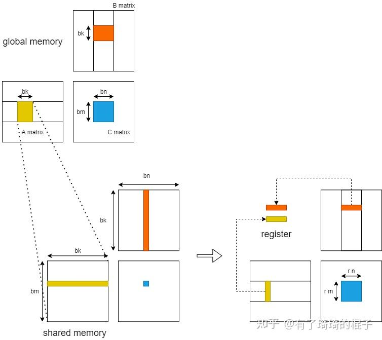

# 深入浅出GPU优化系列：GEMM优化（一）

**Author:** 有了琦琦的棍子

**Date:** 2022-09-01

**Link:** https://zhuanlan.zhihu.com/p/435908830

本篇文章是深入浅出GPU优化系列的第两个专题，主要是**介绍如何对GPU中的矩阵乘法（GEMM）进行优化**。目前针对GEMM的优化，网络上已经有非常多的教程和示例了。大部分的重要资料我都看了看。但总的来说，还是不够接地气，然后理解起来还是会比较费解。所以希望写这么一篇文章，尽可能地去把GPU的GEMM优化说清楚，说明白。然后让小白读者也能通过这么一两篇文章去更好地了解GEMM优化的相关技术。

不像上次的reduce优化一样，能一篇文章说完。这次的GEMM优化会分为三个部分。**第一个部分只说优化思路和分析**，没有任何代码，这么做考虑也是为了减轻读者的负担，看代码太累，**尽可能地让读者先明白原理，为什么要这么做**。**第二个部分是对代码的详细解析，这个里面就是一行一行地去分析代码**。因为之前的很多博客进行了分析，但是代码本身并没有开源，或者说开源了代码，但没有解析，看起来太累了。我希望提供一个尽可能详细的代码解析，读者看完之后能明白相关优化技巧，并且可以直接把代码拿去验证使用。**第三个部分主要涉及到汇编器**，最重要的是说明在NV的卡上，怎么去解决寄存器的[bank冲突](https://zhida.zhihu.com/search?content_id=184998115&content_type=Article&match_order=1&q=bank%E5%86%B2%E7%AA%81&zhida_source=entity)来获取极致的性能。

本篇文章是**GEMM优化的第一个部分**，在这篇文章中，只说**优化思路和分析**。

## 前言

在高性能领域，对于**矩阵乘（GEMM）的优化**是一个非常重要的课题。GEMM可以非常广泛地应用于航空航天、流体力学等科学计算领域，这也是之前HPC的主要应用场景。后来深度学习开展地如火如荼，由于对高算力的需要，也成为HPC的主要应用场景之一。这些年涌现了一系列的深度学习模型。模型里面最耗时的东西，包括卷积、全连接层、attention，都可以转换成GEMM操作。所以说，GEMM优化的重要性，怎么突出都不过分。

目前网上能找到的针对GEMM优化的资料主要有这么几个方面：  
**一、论文**，目前针对GPU进行GEMM优化的论文非常多，这里主要推荐[Understanding the GPU Microarchitecture](https://link.zhihu.com/?target=https%3A//dl.acm.org/doi/10.1145/3018743.3018755)和[Fast implementation of dgemm on fermi gpu](https://link.zhihu.com/?target=https%3A//ieeexplore.ieee.org/document/6114452)以及 [Dissecting the NVIDIA Volta GPU Architecture via Microbenchmarking](https://link.zhihu.com/?target=https%3A//arxiv.org/abs/1804.06826)。这几篇论文在业界都比较有影响力，就是代码开源方面做的不算太好。**二、官方博客**，主要是[CUTLASS](https://link.zhihu.com/?target=https%3A//developer.nvidia.com/blog/cutlass-linear-algebra-cuda/)和[NervanaSystems-SGEMM优化](https://link.zhihu.com/?target=https%3A//github.com/NervanaSystems/maxas/wiki/SGEMM)。还有前段时间旷视发的文章[CUDA矩阵乘法优化](https://zhuanlan.zhihu.com/p/410278370)，写的都很详细。**三、github**的一些demo，代码量不大，看起来比较舒服。我是看了这两个，

[](https://link.zhihu.com/?target=https%3A//github.com/Cjkkkk/CUDA_gemm)

[](https://link.zhihu.com/?target=https%3A//github.com/yzhaiustc/Optimizing-SGEMM-on-NVIDIA-Turing-GPUs)

demo1代码写的好理解一些，但是优化工作没做完全，没有做到[prefetch](https://zhida.zhihu.com/search?content_id=184998115&content_type=Article&match_order=1&q=prefetch&zhida_source=entity)。demo2是效果很好，11个优化技巧，不断逼近cublas。但是代码真的看起来比较难受，最重要的很多参数写死了，不好去调。

总而言之，目前列举的上述资料存在着这么两个问题：一、文档方面，读起来还是比较费劲，对于小白来说，还是不够简单不够傻，看起来太累了；二、代码方面，要么是没公开代码，要么是代码太多了，看不下去；还有的就是代码可读性很强，但是优化工作还不是特别深，或者就是代码优化做的很好，但是可读性差了。方方面面总是有点欠缺，所以希望能够写一篇尽可能地在文档上简单明了，在代码上详细且可读性好的文章。当然，这是一个逐步迭代的过程，所以这篇文章也会持续进行更新哈。

本篇文章主要是采纳了cutlass的行文思路，主要介绍GEMM中的数据分块和如何在多级存储进行数据搬运。这也是**HPC优化的核心思想，怎么样让数据放在更近的存储上来掩盖计算的延时，从而减少存储墙的影响**。文章分为四个方面进行叙述，首先介绍在global memory层面如何进行分块以及数据搬运，随后介绍在shared memory层面如何进行分块以及数据搬运，而后介绍在register层面如何进行分块以及避免bank冲突，最后介绍如何进行prefetch以更好地掩盖访存时延。

## 从global memory到shared memory

假设有矩阵A,B，需要计算矩阵A和B的乘，即矩阵C。A、B、C三个矩阵的维度分别为$m*k，k*n，m*n\$，且三个矩阵中的数据都是单精度浮点数。对于C中每一个元素，C\[i\]\[j\]，可以看作是A的一行和B的一列进行一次归约操作。采用最naive的GEMM算法，在GPU中，一共开启$m*n\$个线程，每个线程需要读取矩阵A的一行与矩阵B的一列，而后将计算结果写回至矩阵C中。因而，完成计算一共需要从global memory中进行 $ 2mnk\$次读操作和m\*n次写操作。大量的访存操作使得GEMM效率难以提高，因而考虑global memory中进行分块，并将矩阵块放置到shared memory中。其示意图如下：


对global memory进行分块的GEMM算法示意图见上图右侧。首先将A、B、C三个矩阵划分为多个维度为$bm*bk，bk*bn，bm*bn\$的小矩阵块。三个矩阵形成$M*K，K*N，M*N\$的小矩阵网格。其中，$M=m/bm，N=n/bn，K=k/bk\$。随后在GPU中开启$M*N\$个block，每个block负责C中一个维度为$bm*bn\$的小矩阵块的计算。计算中一共有K次迭代，每一次迭代都需要读取A中一个维度为$bm*bk\$的小矩阵块和B中一个维度为$bk*bn\$的小矩阵块，并将其放置在shared memory中。因而，完成C中所有元素的计算一共需要从global memory中读取$M*N*K*（bm*bk+bk*bn）\$，即$m*n*k（1/bm+1/bn）\$个单精度浮点数。相比于naive的GEMM算法，访存量减少为原来的 $ 1/2*(1/bm+1/bn)\$。通过global memory中分块算法极大地减少了对global memory的访存量。并且，相比于naive算法，对global进行分块可以更充分地利用数据局部性。在naive算法中，每一个线程都需要直接从global memory中取数，其时延非常长，计算性能非常差。而进行分块后，将维度为$bm*bk，bk*bn\$的小矩阵块先存储到shared memory之中。而后计算单元进行计算时可以直接从shared memory中取数，大大减少了访存所需要的时延。

## 从shared memory到register

随后，我们进一步考虑从shared memory到register的过程。在这里，只分析**一个block**中的计算。当进行K轮迭代中某一轮迭代时，GPU将维度为$bm*bk，bk*bn\$的小矩阵块存储到shared memory中，而后各个线程将shared memory中的数据存入register中进行计算。



在**不对shared memory分块**时，一个block中含有$bm*bn\$个线程，**每一个线程负责C中一个元素的计算**。则一个block一共需要对shared memory进行 $ 2*bm*bn*bk\$次读操作。而后**考虑对shared memory进行分块**，对$bm*bn\$的小矩阵进行再一次划分，将其划分为多个维度为$rm*rn\$的子矩阵。则一个block需要负责$X*Y\$个子矩阵。其中，$X=\frac{bm}{rm}\$，$Y=\frac{bn}{rn}\$。随后，在一个block中开启$X*Y\$个线程，**每个线程负责一个维度为$rm*rn\$的子矩阵的计算**。在计算中，一个block一共需要从shared memory读取$X*Y*(rm+rn)*bk\$，即$bm*bn*bk*(\frac{1}{rm}+\frac{1}{rn})\$个单精度浮点数。相比于未分块的算法，对于shared memory中的访存量减少为原来的 $ 1/2*(\frac{1}{rm}+\frac{1}{rn})\$。并且，由于将数据放入register中，可以直接对数据进行运算，减少了从shared memory中取数的时延。

## register分块

在这里，我们考虑最后一层，即register中的计算，并且只分析一个thread。在完成以上的过程后，对于一个线程而言，它现在拥有：$rm\$个A矩阵的寄存器值，$rn\$个B矩阵的寄存器值，以及$rm *rn\$个C矩阵的寄存器值。通过这些寄存器的值，需要计算$rm*rn\$个数。这需要$rm *rn\$条FFMA指令。

这个时候会涉及到寄存器的bank conflict。在NV的GPU中，每个SM不仅会产生shared memroy之间的bank 冲突，也会产生寄存器之间的bank冲突。这一点对于计算密集型的算子十分重要。像shared memory一样，寄存器的Register File也会被分为几个bank，如果一条指令的的源寄存器有2个以上来自同一bank，就会产生冲突。指令会重发射，浪费一个cycle。PS：这个地方是从[旷视的博客](https://zhuanlan.zhihu.com/p/410278370)中看的。然后对于maxwell架构的GPU而言，bank数为4，寄存器**id%4**即所属bank。

我们假设对这个thread来说，$rm=4,rn=4\$。并且计算C的寄存器以一种非常naive的情况分配，如下图左侧所示。则需要产生16条FFMA指令，列举如下：

```text
FFMA R0, R16, R20, R0
FFMA R1, R16, R21, R1
……
```


可以从中看出，这会产生大量的register bank冲突，所以需要对参与计算的寄存器重新进行分配和排布,如上图右侧所示。在有些地方，这种方式也可以叫做register分块。

## 数据的prefetch

最后，我们来讲讲如何通过对数据进行prefetch来减少访存的latency。我们再来回顾GEMM的过程，并且仔细地看看这个访存的latency到底是怎么导致的。**对于一个block而言**，需要计算一个$bm*bn\$的矩阵块，这个时候需要进行K次迭代，每次迭代都需要先将来自A和B的两个小块送到shared memory中再进行计算。而从global中访存实际上是非常慢的，所以导致了latency。虽然GPU中可以通过block的切换来掩盖这种latency，但是由于分配的shared memory比较多，活跃的block并不太多，这种延时很难被掩盖。**对于一个thread**，需要计算一个$rm*rn\$的小矩阵，但是必须先将数据从shared memory传到寄存器上，才能开始进行计算。所以导致了每进行一次迭代，计算单元就需要停下来等待，计算单元不能被喂饱。

为此，需要进行数据的Prefetch来尽可能地掩盖这种latency。思想也比较简单，需要多开一个buffer，进行读写分离。示意图如下。当block进行第2轮迭代时，需要对A2和B2进行计算，在计算单元进行计算的同时，我们将A3和B3提前放置到shared memory。而后，在进行第3轮迭代时，就可以直接对shared memory中的A3和B3进行计算，而不需要等待从global memory搬运到shared memory的时间。寄存器上的Prefetch也是同理。


## 总结

GEMM的优化思想，基本上就是这么几方面的内容。希望大家通过介绍能够对GEMM的优化有一个比较直观且具体的理解。（感觉写的还是有点乱，图也没画的太好，大家谅解）。当然，看完这些，要开始写代码的时候，大家还是会比较懵，也不知道这些东西应该怎么实现。现在写了详细的解析，也就是GEMM优化（二）。去实现了上述优化技巧和细致地分析每一行代码，大家可以看一看。

[](https://zhuanlan.zhihu.com/p/442930482)

第三部分中，更细粒度的CUDA C代码调优和关于汇编代码的调优，也已经给出。

[](https://zhuanlan.zhihu.com/p/481600052)

最后，**感谢大家看到这里，有什么问题欢迎跟我讨论哈**。关于GPU的优化，打算写一个系列，说说GPU优化的一些经典问题和优化技巧。不过最近工作也比较忙，更新估计很慢。之前已经写完了

[](https://zhuanlan.zhihu.com/p/426978026)

的内容。希望后面能坚持下去。

欢迎大家关注哈:)