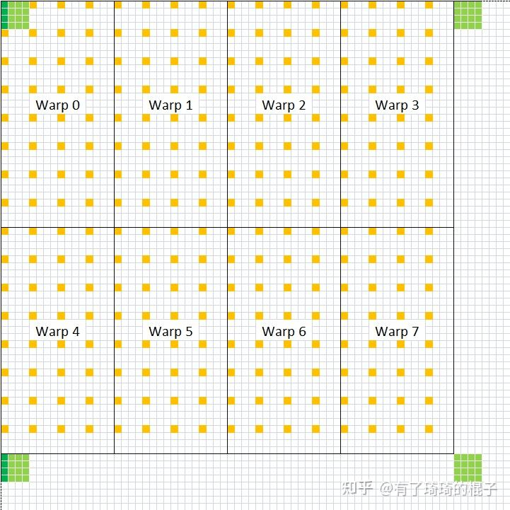
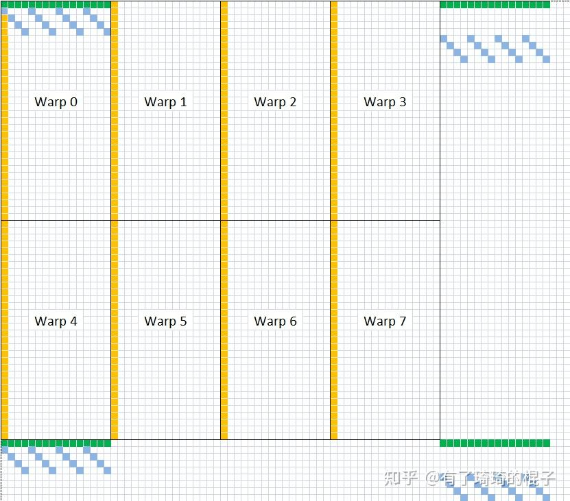
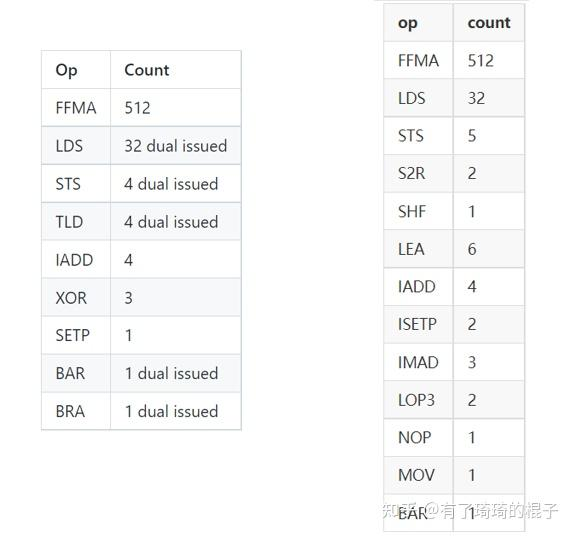
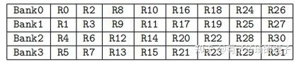
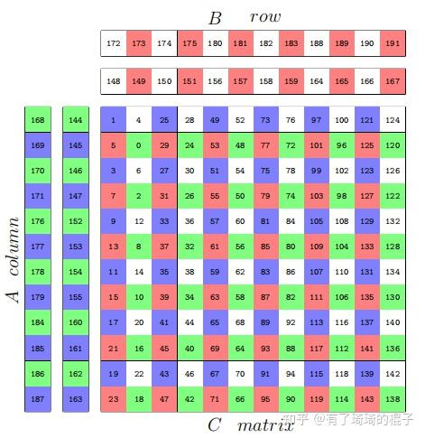
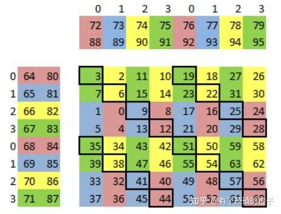
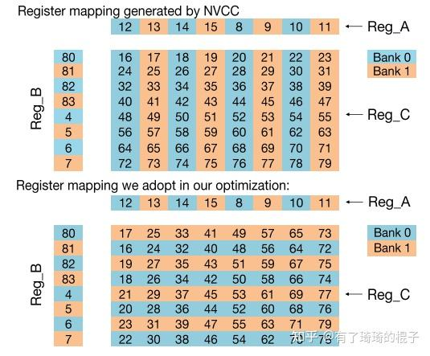
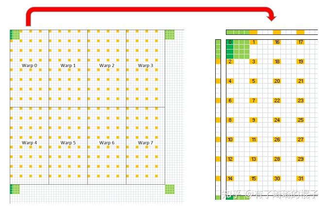

# 深入浅出GPU优化系列：GEMM优化（三）

**Author:** 有了琦琦的棍子

**Date:** 2022-09-01

**Link:** https://zhuanlan.zhihu.com/p/481600052

本篇是通用矩阵乘法（GEMM）优化的第三部分，主要说明**如何从汇编级别来分析代码性能**以及**如何调整汇编代码以获得更高的性能表现**。本篇的内容需要建立在[GEMM（一）](https://zhuanlan.zhihu.com/p/435908830)和[GEMM（二](https://zhuanlan.zhihu.com/p/442930482)）的基础上，如果没有看过前两篇文章的读者可以先花点时间再阅读一下。当然，如果对sgemm优化十分熟悉的话，也可以直接服用本篇文章。

本篇文章主要是分四部分进行讲述。第一部分是讲述如何在汇编代码的角度上来分析程序性能。第二部分是分析现有sgemm实现，搞清楚进一步优化的方向。第三部分是说明如何来调整汇编代码来获得更好的性能表现。第四部分是实验和总结。

**一、从汇编代码分析程序性能**

这个章节里面想说一说两个核心问题，**我们为什么要去看生成的汇编代码？**以及，**当我们在看汇编代码的时候，我们到底看的是什么东西？**

首先来说说**第一个问题，我们为什么要去看生成的汇编代码？**这主要是由于做完优化之后，我们需要有一个东西来判断机器是否能够真正地按照我们设想的模式运行。使用了float4之后，GPU是不是真的使用了向量化指令。采用循环展开之后，GPU是不是真的会进行展开？另外，[CUDA C](https://zhida.zhihu.com/search?content_id=195153778&content_type=Article&match_order=1&q=CUDA+C&zhida_source=entity)和汇编代码之间还隔着编译器。只有看最底层的汇编码，才能真正地理解我们所做的优化是在哪个地方起了作用，节省了哪个部分的耗时。

NV的GPU提供了ptx和sass两个层面的汇编码。Ptx本质上是一个伪汇编码，事实上机器真正能够识别的是sass码。Ptx还需要使用ptxas工具再转化成sass码才能被GPU识别。然后nv提供了cuobjdump和nvdisasm两个工具，我们可以通过这两个工具来看到最底层的汇编码，使用方法见链接：[cuobjdump和nvdisasm的使用](https://link.zhihu.com/?target=https%3A//docs.nvidia.com/cuda/cuda-binary-utilities/index.html)。

NV每一代机器的指令集都有所不同。关于指令集相关资料，NV官方只给出了非常有限的资料，见链接：[NV GPU指令集](https://link.zhihu.com/?target=https%3A//docs.nvidia.com/cuda/cuda-binary-utilities/index.html%23instruction-set-ref)。此外，NV的指令还有一个特别有意思的东西，那就是control code，后面直接用控制码表示。通过控制码将一些本来应该在硬件实现的逻辑软件化了，从而在同样大小的电路面积上塞下更大的计算单元。关于CUDA 指令集的资料可以详见cloudcore大佬的[相关文章](https://zhuanlan.zhihu.com/p/161624982)。

上面大概地介绍了一下CUDA 指令集的内容，接下来说一下**第二个问题，当我们在看汇编代码的时候，我们到底看的是什么东西。**这个话题可以分为两部分介绍，分别是访存密集型的kernel和计算密集型的kernel。

对于**访存密集型的kernel**，正常而言，我们需要关注的是：访问global memory的时候是不是合并访存了，访问shared memory的时候是不是有bank 冲突了。很不幸的是，在汇编代码中，这些东西其实不太能看得出来。我们主要关注的是有没有采用LDG.128的访存指令，以及计算指令的占比是不是太多，#pragma unroll是不是有效展开了。

对于**计算密集型的kernel**而言，我们重点关注计算指令的占比。这个一般跟并行策略会联系在一起。一般而言，如果并行策略不太行，那么计算指令的占比会很低，这样的话，访存所导致的latency很难被计算指令掩盖，计算效率会非常差。如果并行策略比较好，那么计算指令的占比也会非常地高。也只有当计算指令占比非常高的时候，才有可能地去逼近峰值性能。

**二、对于现有sgemm的代码分析及观察**

在分析之前，我们对目前已有的工作先做一个回顾。sgemm是hpc领域的经典问题，目前有大量的论文在针对不同硬件架构，不同矩阵特性进行研究。对于NV的GPU，关于sgemm最著名的工作是scott的[maxas](https://link.zhihu.com/?target=https%3A//github.com/NervanaSystems/maxas/wiki/SGEMM)。在[Maxwell架构](https://zhida.zhihu.com/search?content_id=195153778&content_type=Article&match_order=1&q=Maxwell%E6%9E%B6%E6%9E%84&zhida_source=entity)上的部分卡上能够达到98%的浮点性能，几乎到达极限。也就是从这个工作以后，针对NV的sgemm优化工作基本上就没法做了，关于针对大矩阵的sgemm优化，也没有太多的研究价值了。当然，针对不同硬件架构的sgemm优化还是层出不出，但基本上是一些follow的工作，然后做一些小修小补。

我们来分析一下scott的工作。在CUDA C层面，不涉及汇编的话，优化技巧主要有3个方面：

技巧1，global->shared memory，采用了texture内存，将线程划分，一半线程只读A，一半线程只读B。

技巧2，shared memory->register，将8×8的读取变成4个4×4的读取，从而避免bank冲突。



shared memory -&amp;amp;amp;amp;gt;register

技巧3，Store C矩阵的时候，为了合并访存，采用了一种非常奇怪的方式去store。



store C matrix

针对大矩阵的sgemm计算时。如果k维度足够大，global->shared memory以及store C的耗时占比会非常小，所以这两个优化技巧在大矩阵中并不能起到很大的作用。所以相对来说，**技巧2会更加具有借鉴意义**。

紧接着，我们来分析一下sgemm中最耗时的部分，也就是最内层的迭代部分。需要计算8×8×8=512次乘加运算。Scott的sgemm在maxwell产生的汇编代码如下图左，为了比较，我们将GEMM（二）中的代码sgemm\_v2最后生成的[SASS码](https://link.zhihu.com/?target=https%3A//github.com/Liu-xiandong/How_to_optimize_in_GPU/blob/master/sgemm/asm/sgemm_pre.sm_70.cuasm)放在一起用以比较。



SASS代码比较

可以从上面看到，512条FFMA和32条LDS指令，最核心的计算指令和访存指令都是一样的。但是GEMM（二）中用编译器产生的汇编码有更多的非计算指令存在。而且如果从上面的链接点进去的话，就会发现，[FFMA指令](https://zhida.zhihu.com/search?content_id=195153778&content_type=Article&match_order=1&q=FFMA%E6%8C%87%E4%BB%A4&zhida_source=entity)被划到2个代码块中，相对而言，中间会多一个跳转指令。另外一个需要注意的点是scott的代码是针对Maxwell架构，所以将可以用于双发射的指令进行了单独标记。而笔者写的代码是在[volta架构](https://zhida.zhihu.com/search?content_id=195153778&content_type=Article&match_order=1&q=volta%E6%9E%B6%E6%9E%84&zhida_source=entity)上编译运行的，volta架构取消了双发射。但是两个cycle发射一条FFMA指令就可以将所有的fp32 core填满。计算指令和访存指令占据不同的发射端口，计算和访存可以隔一个cycle发射。所以我的猜想是这样的，对于volta架构，t0 cycle的时候发射一条FFMA指令，t1 cycle的时候发射一条LDS指令，而后t2时刻再发射一条FFMA指令。这样的话，FFMA指令隔了2个cycle，中间还发射了一条LDS指令，但fp32的core依旧是被用满的状态。这样的话，即使没有了双发射，理论上也能将fp32 core打满。从volta架构编译出来的控制码中也可以看出一些端倪，如下，FFMA指令stall两个cycle，而LDS指令stall一个cycle。

```text
[R---:B------:R-:W-:-:S02]         /*0cd0*/                   FFMA R115, R39.reuse, R14, R115 ;
[----:B------:R-:W-:-:S02]         /*0ce0*/                   FFMA R114, R39, R15, R114 ;
[----:B------:R-:W1:-:S01]         /*0cf0*/                   LDS.U.128 R36, [R40+0x2410] ;
[R---:B------:R-:W-:-:S02]         /*0d00*/                   FFMA R113, R32.reuse, R12, R113 ;
```

然后总结一下这小节的内容，从CUDA C和SASS代码的角度分析了现有sgemm实现的不足。进一步的优化工作可以从两个方面进行：1、shared memory->register，将8×8的读取变成4个4×4的读取。2、尽可能地减少非必要指令的开销，但是这个在CUDA C层面很难控制，毕竟编译器也没那么听话。

**三、汇编级别代码调整**

好了，终于讲到了调汇编的地方。上面小节说了，优化的一个方式是尽可能地减少非必要指令的开销。但是，当我们开始调汇编的时候，还有一个更重要的事情需要做，也是在maxas、KeplerAs等一系列工作的核心，**减少FFMA指令所产生的register bank冲突**。这里面有两个优化技巧，一个是寄存器的重映射，另外一个是调整FFMA顺序，尽可能地在指令中使用.reuse标识以及提高双发射的效率。

**3.1 寄存器的重映射**

在这里面，由于每代架构中的硬件细节有所不同，所以register的remapping细节也有所不同。首先说一下这里面的硬件细节不同是指，不同的架构中，寄存器到bank的映射方式不同。kepler架构的映射比较奇怪，并不是很规则，如下：  



kepler register bank 映射

对于Maxwell架构而言，相对来说更加简单一些，bank index即reg\_index%4这么一个简单的关系。Pascal架构和Maxwell架构的寄存器bank映射关系一样。而volta架构又有一些不同，在volta之前都是4路的bank，而volta架构变成了2路的bank。

由于架构不一样，针对不同架构的register重映射方式也不一样。对于kepler架构，keplerAs的作者采用的映射方式如下：



kepler reg remapping

对于Maxwell架构，Scott采用的映射方式如下：



maxwell reg remapping

上图中间那些带黑框的数字代表不可避免的寄存器冲突，scott随后又使用了指令重排来减缓寄存器的冲突。

而volta架构的话，Dissecting the NVIDIA Volta GPU Architecture via Microbenchmarking作者采用的方式如下，作了一个转置，然后相邻两行进行一个交换。



volta reg remapping

3.2 指令重排

这里的指令重排主要是针对FFMA指令的重排。作用的话，其实有两个。在maxwell架构中，scott重排主要是为了尽可能地解决对角线那些元素的寄存器bank冲突。在这里插一嘴，因为部分读者对于这个重排可能理解不是很到位。举个例子吧，要计算C矩阵中1，2，3，4，5的元素的值，正常的顺序是调用FFMA指令先算1，再算2，再算3，等等。重排的话，就是可能先算2，再算1，再算3。从指令角度的话，就是FFMA指令的排列顺序有所不同，所以叫指令重排，这个是我的个人理解。

重排的目的是为了更好地使用reuse标识，这个地方可以看看旷视写的[矩阵乘终极优化指南](https://zhuanlan.zhihu.com/p/410278370)，当然，基本上也就是scott的sgemm介绍内容。读取指令的操作数的时候，有一个寄存器的reuse cache。在指令中使用这个标识就代表这个数被hold住了，下一条指令可以直接使用。这个地方，大家都是这么说的，NV也没有官方的说明，那就这么理解吧。具体示意代码如下：

```text
FFMA R2, R64.reuse, R73, R2; # R64 进入 Reuse Cache
FFMA R3, R64.reuse, R72, R3; # R64 从 Reuse Cache 中获取，避免与 R72 冲突
```

为了更好地利用这个reuse特性，scott给了一种非常奇怪的指令排列顺序，如下：

```text
 1,  0,  2,  3,  5,  4,  6,  7, 33, 32, 34, 35, 37, 36, 38, 39, 
45, 44, 46, 47, 41, 40, 42, 43, 13, 12, 14, 15,  9,  8, 10, 11,
17, 16, 18, 19, 21, 20, 22, 23, 49, 48, 50, 51, 53, 52, 54, 55, 
61, 60, 62, 63, 57, 56, 58, 59, 29, 28, 30, 31, 25, 24, 26, 27
```

通过CUDA C说的一系列优化手段，以及寄存器的remapping和指令重排，scott的sgemm在Maxwell架构的一些卡上能够达到98%的浮点计算效率，达到了优化的天花板。

扯远了，再说说指令重排，keplerAs的作者张秀霞针对kepler的双发射特性对FFMA指令进行了指令重排来提高性能。这个跟scott的工作又有一些不一样的地方，大家可以对比一下。

**四、实验与总结**

最后，我们来做一下实验。实验分成两个部分，第一个部分是CUDA C层面的再次优化，第二个部分是针对SASS代码的调优工作以及中间经历的一些波折。

**4.1 CUDA C 调优**

这个部分的内容主要是介绍一下怎么解决GEMM（二）所存在的shared memory bank冲突。其实scott的文章已经说了这一点，但是吧，实在是太费解了。首先，再来回顾一下这个思路。我们一个block有256个线程，8个warp，8个warp要去取shared memory中的半行元素，也就是128/2=64个元素。warp0和warp4取得是同样的16个元素。而warp里面，线程0、2、4、6、8、10、12、14是取得同样的4个元素。由于取得是同样的元素，同一个bank触发多播的机制，没有冲突。取多少元素说清楚了，就得说一下shared memory的索引了。scott给出的256线程版本索引是：

```text
readAs = ((tid128 >> 4) | ((tid >> 1) & 7)) << 4;
readBs  = (((tid & 0x70) >> 3) | (tid & 1)) << 4 + 4096;
```



shared memory详细解析

总之，这个索引给我整不会了。作为一个正常的人类，我实在是不太能直观地去理解这个位运算。思量许久，我决定用一种最简单粗暴的索引计算方式。我们本质上是要知道，每一个线程，对应到128个元素中的哪一个元素？这个是我们的核心问题。

我来说一下我的计算方法，以B矩阵对应的shared memory为例，首先，计算warp\_id，也就是当前线程属于哪个warp，由tid/32即可得。随后计算lane\_id，即当前线程属于这个warp上得哪个线程，由tid%32即可得。随后就是通过warp\_id和lane\_id来算出，对应128个元素得哪一个元素。先算(warp\_id%4)×16，假设是warp2，就是上图左侧的第2个（从0算）warp。前面有2个warp，跳过了2\*16=32个元素。然后再看看当前lane\_id。0-15在左半边，16-31在右半边。所以lane\_id/16，先看是左半边还是右半边。右半边的话，先跳过8个元素。最后再看lane\_id的奇偶数，如果奇数的话，就再跳一个四个元素。代码实现如下，这个就是正常人可以看懂的方式了。对A矩阵的映射关系同理。

```text
//load index of the tile
const int warp_id = tid / 32;
const int lane_id = tid % 32;
const int tile_index_b = (warp_id%4)*16 + (lane_id/16)*8 + (lane_id%2)*4;
const int tile_index_a = (warp_id/4)*32 + ((lane_id%16)/2)*4;
```

然后shared memory取数的代码更改就是下面这样，以B矩阵块为例：

```text
// 改变前
#pragma unroll
for (int thread_y = 0; thread_y < THREAD_SIZE_Y; thread_y += 4) {
     FETCH_FLOAT4(frag_b[(j+1)%2][thread_y]) = FETCH_FLOAT4(Bs[next_stage_flag][(j+1)%BLOCK_SIZE_K][THREAD_SIZE_Y * ty + thread_y]);
}
// 改变后
FETCH_FLOAT4(frag_b[(j+1)%2][0]) = FETCH_FLOAT4(Bs[next_stage_flag][(j+1)%BLOCK_SIZE_K][tile_index]);
FETCH_FLOAT4(frag_b[(j+1)%2][4]) = FETCH_FLOAT4(Bs[next_stage_flag][(j+1)%BLOCK_SIZE_K][tile_index + 64]);
```

当然，因为用来寄存C的64个元素对应的位置变化，所以最后的store C的过程也有代码变动。

在进行了这个修改之后，4096（M=N=K）的矩阵大概可以达到96-97%的cublas的性能。单精度峰值浮点效率达93%左右。再往下想要持平或者超越cublas的话，就只能动汇编了。

**4.2 汇编代码调优**

首先要说明的是，要动SASS汇编代码的话，需要有个汇编器。现有的汇编器都是针对不同的GPU架构，KeplerAs针对Kepler架构，MaxAs架构针对Maxwell架构，TuringAs针对的是Turing和Volta架构。而我只有V100能用，看上去只能用[TuringAs汇编器](https://link.zhihu.com/?target=https%3A//github.com/daadaada/turingas)。试了一下，直接放弃了，作者只放了极少数的代码出来，而且也不打算维护这个repo的样子。后面我又盯上了

[@cloudcore](//www.zhihu.com/people/7d26e1ac60ef3811417b7baa4c9bbdd9)

写的CuAssembler。

[](https://link.zhihu.com/?target=https%3A//github.com/cloudcores/CuAssembler)

文档和使用指南比TuringAs详细很多，感觉靠谱多了，就开始用CuAssembler调。当时遇到了**第一个问题**是CuAssembler还不支持Volta架构，cloudcore大佬也没有用volta架构测过。后面用的时候一直有问题。滞后了一段时间，后面想着turing架构和volta架构的指令集差不多，把CuAssembler中关于turing架构的配置文件拷贝一份当volta架构的配置使用就OK了。虽然不保证中间不会出啥问题，但是sgemm的结果对了，就达到目的了。

后面遇到的**第二个问题**是在做寄存器remapping的时候。我发现NVCC编译出来的代码是这个样子：

```text
FFMA R125, R52, R44, R72 ;
FFMA R122, R53, R44.reuse, R73 ;
FFMA R74, R54, R44.reuse, R74 ;
FFMA R75, R55, R44.reuse, R75 ;
```

看看第一条指令，做R125=R52×R44+R72，R72的值被拿出来，然后存到了R125上。编译出来的代码有一大堆这样的指令。而我希望所有的指令都满足第3条的样子，R74=R54×R44+R74，从R74取就放回R74才最好。如果不能保证这个形式的话，就意味着，我们不能让固定的寄存器来存储矩阵C中的固定的值。这玩意做remapping的话，就不能简简单单地改寄存器号。毕竟我也不能确定不同的寄存器对应到哪个具体的值了。

当时想了各种方式，调整CUDA C代码来让nvcc编译出我想要的FFMA格式，但是，这个尝试并不能实现。所以接下来，有两个方式，一个是头铁，搞清楚这个100多个寄存器在512条FFMA指令中对应的物理元素，然后做remapping，这个路线中间会遇到可以预想的无数的bug和计算问题。另一个是参考Maxas，把这玩意整合到汇编器上，定义好每个寄存器的对应元素和排列顺序。然后汇编器顺带着处理，如下：

```text
<REGISTER_MAPPING>

    // Temporary registers to calculate the state registers. Reuse the C output registers.
    // These can be dynamically allocated (~) in the available registger space to elimiate any register bank conflicts.
    0-63    ~ blk, ldx, ldx2, ldx4, k, tid1, tid4, tid7, tid31_4, xmad_t0, xmad_end, bxOrig, byOrig, loy

    // Aliases for the C registers we use for initializing C (used as vectors)
    0-63    : cz<00-63>

    // The offset we store our zero value for initializing C. Reuse a register from the second blocking registers
    80      : zOffset

    // 64 C maxtrix output registers.
    // Use special mapping to avoid register bank conflicts between these registers and the blocking registers.
     3, 2,11,10,19,18,27,26 : cx00y<00-03|64-67>
     7, 6,15,14,23,22,31,30 : cx01y<00-03|64-67>
     1, 0, 9, 8,17,16,25,24 : cx02y<00-03|64-67>
     5, 4,13,12,21,20,29,28 : cx03y<00-03|64-67>
    35,34,43,42,51,50,59,58 : cx64y<00-03|64-67>
    39,38,47,46,55,54,63,62 : cx65y<00-03|64-67>
    33,32,41,40,49,48,57,56 : cx66y<00-03|64-67>
    37,36,45,44,53,52,61,60 : cx67y<00-03|64-67>

    // Double buffered register blocking used in vector loads.
    // Any bank conflicts that we can't avoid in these registers we can hide with .reuse flags
    64-79   : j0Ax<00-03|64-67>, j0By<00-03|64-67>
    80-95   : j1Ax<00-03|64-67>, j1By<00-03|64-67>

    // Registers to load A or B
    96-103  : loadX<0-7>

    // Key global state registers for main loop and some we reuse for outputing C.
    // Note, tweaking the register banks of track<0|4>, tex, writeS, readBs, readAs impacts performance because of
    // delayed bank conflicts between memory operations and ffmas.
    // The array index bracket notation can be used to request a bank in a dynamically allocated range.
    104-127 ~ track<0|4>[0], tex[2], readAs[2], readBs[3], writeS[3], end, ldx8, tid, bx, by, tid31, tid96, tid128 //, clock, smId, nSMs

    // Registers to store the results back to global memory. Reuse any register not needed after the main loop.
    // Statically allocate cs0-7 because they're vector registers.
    64-71   : cs<0-7>

    // dynamically allocated C output registers(~)
    72-103  ~ cy<00|04|08|12>, Cy<00|04|08|12>, ldc, ldc1, ldc4, ldc8, ldc60, writeCs, readCs, cx, ci, alpha, xmad_ci //, xmad_D, D, blckDimX, gridDimX

</REGISTER_MAPPING>
```

然而，我只是想简简单单写个sgemm，我并不想把我有限的周末时间全部投进去，毕竟读者也没给我钱。然后想想指令重排，通过reuse标识也能解决一部分reg的bank冲突，那就整这个吧。

接着就是我遇到的**第三个问题**，就是指令重排。我把里面所有存在寄存器bank冲突的指令列了出来。在[comment版本里面](https://link.zhihu.com/?target=https%3A//github.com/Liu-xiandong/How_to_optimize_in_GPU/blob/master/sgemm/asm/sgemm_comment.sm_70.cuasm)。再来看看volta架构中的bank冲突，volta架构的寄存器有2路bank，奇数寄存器号代表bank0，偶数寄存器号代表bank1。如果FFMA指令的三个源寄存器的寄存器号都属于奇数或者偶数，那么就发生了bank冲突。

```text
//0    FFMA R74, R36, R62.reuse, R74 ;    
//1    FFMA R78, R34, R62.reuse, R78 ;
//2    FFMA R16, R35, R62, R54 ;
```

比如上面的代码，0号指令和1号三个源寄存器都是偶数，不考虑reuse标识的话，都有bank冲突，而2号指令就没有bank冲突。调整这3个的位置，变成：

```text
//2    FFMA R16, R35, R62.reuse, R54 ;   
//1    FFMA R78, R34, R62.reuse, R78 ; 
/ 0    FFMA R74, R36, R62.reuse, R74 ;
```

让指令2的R62放入reuse cache中，指令1和指令0继续使用这个数，从而减少bank冲突。更改前后的代码在我的[github repo](https://link.zhihu.com/?target=https%3A//github.com/Liu-xiandong/How_to_optimize_in_GPU/tree/master/sgemm/asm)中。但是改完之后，我发现性能提升并不是很明显，大概就是1%左右的性能提升。这可能是在sgemm\_v2的基础上改的原因，当时4.1所说的shared memory bank冲突还比较明显。总之，实验大概就是这样子。

**4.3 总结**

**一、关于代码可读性和代码性能**，做HPC的同学常常喜欢手工做循环展开和位运算优化，代码风格显得非常晦涩难懂。但实际上，这些工作其实交给编译器来做就行，简单易懂的代码也能够达到几乎极限的性能表现。参考我写的sgemm如下：

[](https://link.zhihu.com/?target=https%3A//github.com/Liu-xiandong/How_to_optimize_in_GPU/blob/master/sgemm/sgemm_v3.cu)

在保持可读性的同时，依旧能够达到CUDA C代码的极限性能。

**二、不要轻易去调汇编，但是能看懂汇编很重要**。搞hpc的同学会有一个误解，写汇编会更牛逼，能够达到更好的性能表现。但实际上，我们为什么要去调汇编代码，那是因为CUDA C层面的完备形不够，改CUDA C不能解决reg的bank冲突，所以我们才去手动调。但如果是一般访存型的算子，就不要想着去调汇编代码了，真没必要。总之，想要调汇编代码的时候，一定要问自己两个问题，写汇编是不是真的能有性能提高？为什么只有写汇编才能提高性能了？这两个问题没有搞明白，就暂时不要去调汇编代码。

最后，感谢大家看到这里。**GEMM优化系列到此结束**。针对sgemm调优的所有技巧都已经完整地进行了说明。当然，由于我的懒惰，还是有一些工作没有完全完成，但技术都已经说到了，后续详细的编译流程会更新在GitHub上。然后说明sgemm所有优化代码可以在我的Github上找到。

[](https://link.zhihu.com/?target=https%3A//github.com/Liu-xiandong/How_to_optimize_in_GPU)

**关于GPU优化系列，还会持续更新**。接下来说一点轻松的优化，关于elementwise。在深度学习中，主要的kernel类型就是elementwise类、reduce类、gemm类这三大类。说完了这三大类，针对dense tensor的GPU kernel优化也就差不多了。

这个深入浅出GPU优化系列会持续更新，欢迎大家关注哈:)