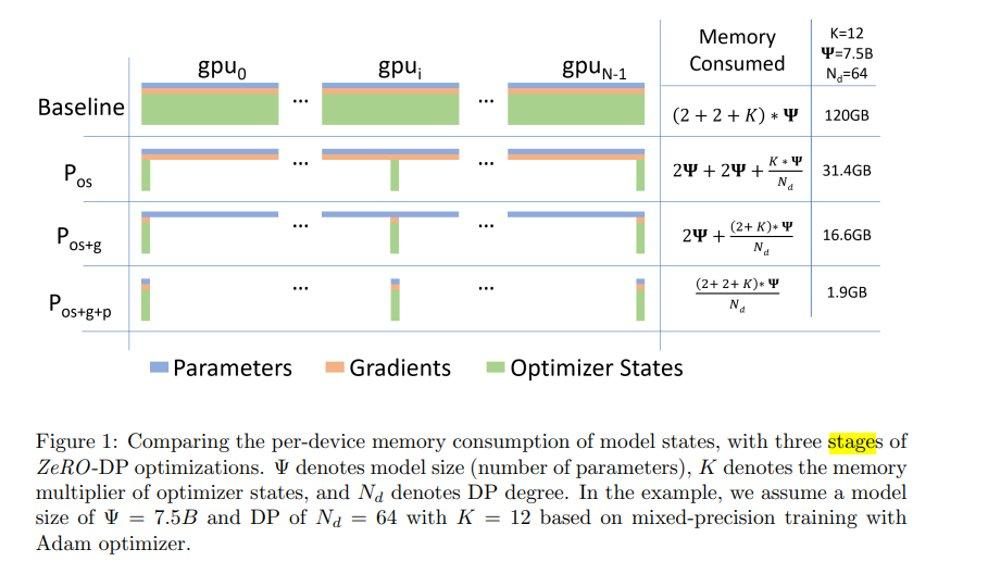
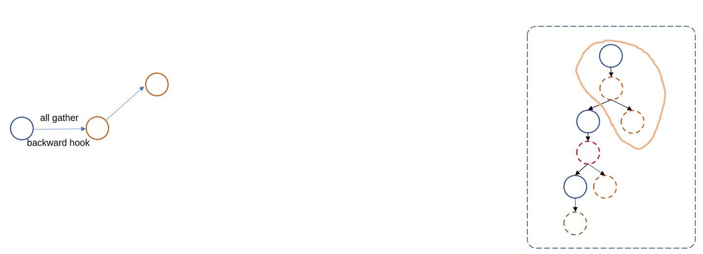
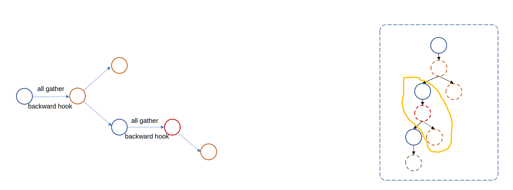
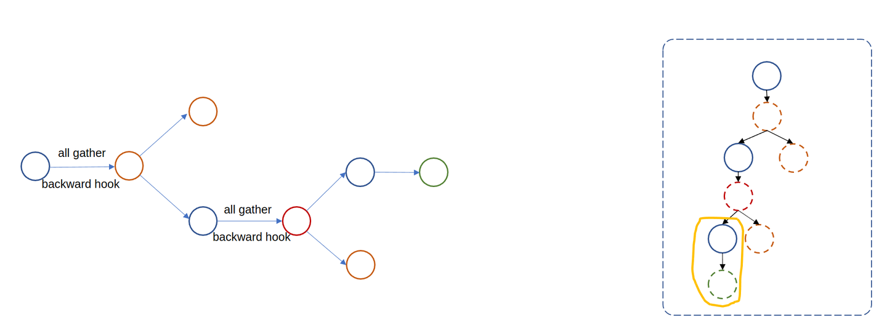
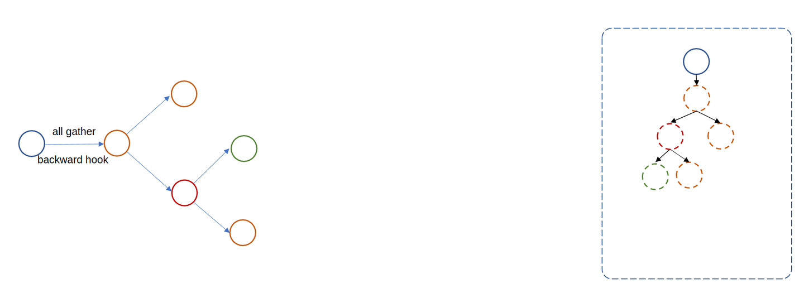

# FSDP 深度解析：2023 年了，大模型训练还要不要用 PyTorch 的 FSDP ？

**Author:** OpenMMLab

**Date:** 2023-08-01

**Link:** https://zhuanlan.zhihu.com/p/644133265

ChatGPT 掀起的大模型训练浪潮让不少同学都对训练大模型跃跃欲试，在找训练 baseline 的时候肯定发现大模型训练的 codebase 更倾向于用 [DeepSpeed](https://link.zhihu.com/?target=https%3A//www.deepspeed.ai/)（**[MMEngine v0.8.0](https://link.zhihu.com/?target=https%3A//github.com/open-mmlab/mmengine)** 也已经支持拉，一键切换，肥肠方便！） 、[ColossalAI](https://zhida.zhihu.com/search?content_id=231271490&content_type=Article&match_order=1&q=ColossalAI&zhida_source=entity) (MMEngine 下个版本也会支持！) 等大模型训练框架，而鲜有问津 PyTorch 原生的 [FSDP](https://link.zhihu.com/?target=https%3A//pytorch.org/blog/introducing-pytorch-fully-sharded-data-parallel-api/) (FullyShardedDataParallel)。这到底是为啥嘞？是 FSDP 不够节省显存？训练速度太慢？还是说不好用？请耐心看完这篇文章，相信一定会有所收获。

## FSDP 的前生今世

FSDP 的实现借鉴了 [FairScale](https://link.zhihu.com/?target=https%3A//fairscale.readthedocs.io/en/latest/)。PyTorch 在开发大型特性时一般会新建一个库来做一些验证性的支持，并收集用户发反馈，FairScale、[Dynamo](https://link.zhihu.com/?target=https%3A//github.com/pytorch/torchdynamo)（PyTorch 2.0 的基石）、[torchdistx](https://link.zhihu.com/?target=https%3A//github.com/pytorch/torchdistx) 均是如此。等到特性日益成熟后，（也许）就会合入到 PyTorch。相比于 PyTorch 官方在 Tutorial 里对 FSDP 简短的介绍，FairScale 显然做的更好，在正式开始介绍之前，贴一张 FairScale 的介绍，大家不妨思考一下，你真的需要 FSDP 么（其他大规模训练框架亦是如此）


## ZeRO 系列简介

看过上面这张图的同学肯定会发现，FairScale 把 FSDP 定义为 ZeRO3，考虑到有些小伙伴可能对 [ZeRO](https://link.zhihu.com/?target=https%3A//arxiv.org/abs/1910.02054) 系列的大模型优化策略不是很熟悉，这边做一个简短的介绍：



模型训练的时候，显存占用大体可以分成三部分，即激活值、**模型权重、模型梯度和优化器状态**。对于视觉模型而言，显存占比最大的是激活值，因此使用混合精度训练能够大幅度的降低激活值的显存占用（fp16）。然而对于大语言模型或者多模态模型而言，优化后三者的显存占用则显得更重要。

以 PyTorch 为例，当你使用 DistributedDataParallel 时，其实会在每个进程为模型参数、模型梯度、优化器状态分配内存，并在训练过程中同步地更新这些数据。这样的做法虽然能够通过数据并行以达到加速训练的目的，但是它在显存分配上的策略，显然是非常糟糕的。既然每个进行的参数都是一样的，为什么每个进程还需要保存完整的参数呢？所以 ZeRO 就主张每个进程只保存参数的一部分，用到的时候再 all gather 到各个进程。ZeRO 有三个阶段的优化策略，即：  

ZeRO1：只把优化器状态进行分片  
ZeRO2：对优化器状态 + 梯度进行分片  
ZeRO3：对优化器状态 + 梯度 + 模型参数进行分片  


以 7.5 B （φ）参数量的模型为例，先简单计算一下模型参数、模型梯度、优化器状态的显存占用情况：

**fp32 训练：**  
模型参数量为 φ，其梯度也为 φ，在使用 Adam 的情况下，优化器状态为 2φ。如果是普通的 fp32 训练，那么实际占用的内存就是 (1 + 1 + 2)φ \* 4：16 φ 字节 （4 为 fp32 数据占据的内存大小）；

**fp16 训练：**  
如果开启混合精度训练，为了保证参数更新的精度，优化器状态需要维持在 fp32 ，此外还需要额外保存一份 fp32 模型参数的拷贝，因此显存占用为 2φ(模型参数) + 2φ(模型梯度) + 8φ(优化器状态) + 4φ(模型参数 fp32 拷贝，deepspeed 实现存储在优化器)：16 φ 字节。

带入这样的视角，相信就能理解为什么上图中 7.5B 的模型显存占用可以高达 120B，以及为什么 ZeRO 系列为何如此有效。

## **FSDP - ZeRO3?**

言归正传，FairScale 说 FSDP 相当于 ZeRO3 的优化，那我们不妨通过一个简单的例子，来感受一下（例子中优化器选择 SGD，因为 PyTorch 的 Adam 做了非常多的优化，其显存实际占用会明显高于理论）。在正式测试之前，我们先来看一下单卡 fp32 训练、单卡 fp16 训练、DDP fp16 训练的测试：

###   
单卡 **fp16 + fp32**

```python
class Layer(nn.Module):
    def __init__(self):
        super().__init__()
        self.linear = nn.Sequential(
            *(nn.Linear(10000, 10000) for _ in range(10))
        )

    def forward(self, x):
        return self.linear(x)
    

def test_fp32():
    model = Layer().cuda()
    optimizer = SGD(model.parameters(), lr=0.1, momentum=0.9)
    data = torch.ones(10000).cuda()
    for i in range(10):
        optimizer.zero_grad()
        output = model(data)
        loss = output.sum()
        loss.backward()
        optimizer.step()
        memory = max_memory_allocated()
        print(f'step memory allocate: {memory / 1e9:.3f}G')

def test_fp16():
    torch.cuda.init()
    model = Layer().cuda()
    optimizer = SGD(model.parameters(), lr=0.1, momentum=0.9)
    data = torch.ones(10000).cuda()
    for _ in range(10):
        with autocast(device_type='cuda'):
            optimizer.zero_grad()
            output = model(data)
            loss = output.sum()
            loss.backward()
            optimizer.step()
        memory = max_memory_allocated()
        print(f'memory allocated: {memory / 1e9:.3f}G')
```


跑过代码后发现，显存占用如下：  
fp32: **12.035G**  
fp16: **14.035G**

啥？amp 显存占用还多了 2G？这是咋算的？这里就不得不提到 amp 的实现方式了。PyTorch 的 amp 不会改变模型权重的类型，即仍然以 fp32 存储，而选择在**[白名单](https://link.zhihu.com/?target=https%3A//pytorch.org/docs/stable/amp.html%23cuda-ops-that-can-autocast-to-float16)**算子的 forward backward 前后，把 fp32 的 weights 转换成 fp16，以计算出 fp16 的激活值和 fp16 的梯度，其中 fp16 的梯度还会进一步转换成 fp32，以保证参数更新的精度。但是既然权重和梯度仍然保留 fp32，优化器状态也理应保持不变，那为啥还多了 2G？原因在于 forward 和 backward 这份 fp16 的权重被缓存了，**这部分实现在 amp 的 C++ 代码里**。缓存的 fp16 梯度，就是多出来 2G 的源头。


要想节省这部分参数，需要给 autocast 传入 `cache_enabled=False`，

```python
def test_fp16():
    torch.cuda.init()
    model = Layer().cuda()
    optimizer = SGD(model.parameters(), lr=0.1, momentum=0.9)
    data = torch.ones(10000).cuda()
    for _ in range(10):
        with autocast(device_type='cuda', cache_enabled=False):
            optimizer.zero_grad()
            output = model(data)
            loss = output.sum()
            loss.backward()
            optimizer.step()
        memory = max_memory_allocated()
        print(f'memory allocated: {memory / 1e9:.3f}G')
```

这样一来，显存消耗为 **12.235G**，基本和 fp32 一致，也符合预期。

###   
**DDP 训练**

DDP 只是在每个进程创建模型，更新模型而已，显存占用应该还是 12G 吧？

```python
def _test_ddp_fp16():
    rank = dist.get_rank()
    model = DistributedDataParallel(Layer().cuda())
    optimizer = SGD(model.parameters(), lr=0.1, momentum=0.9)
    data = torch.ones(10000).cuda()
    for _ in range(10):
        with autocast(device_type='cuda', cache_enabled=False):
            optimizer.zero_grad()
            output = model(data)
            loss = output.sum()
            loss.backward()
            optimizer.step()
        memory = max_memory_allocated()
        if rank == 0:
            print(f'memory allocated: {memory / 1e9:.3f}G')
```


然而结果是：  
**16.036G**  

原理也很简单，ddp 执行 gradient computation 和 gradient synchronization 时需要有一个桶（bucket，具体介绍见[之前的 DDP 介绍](https://zhuanlan.zhihu.com/p/343951042)），桶会保留一份 gradient 的拷贝，因此会额外消耗 4G 左右的显存。

### **FSDP 训练**

我们在使用 FSDP 时，需要通过配置 `auto_wrap_policy` 参数来选择模型分片策略，不然显存优化只能达到 ZeRO-stage1 的水准。如何配置 auto\_wrap\_policy 以及其对应的原理会在后面的章节具体介绍。

```python
from torch.distributed.fsdp.wrap import _module_wrap_policy

def _test_fsdp_fp16():
    rank = dist.get_rank()
    fsdp_model = FullyShardedDataParallel(
        module=Layer(), device_id=rank,
        auto_wrap_policy=partial(
            _module_wrap_policy,
            module_classes=nn.Linear))
    optimizer = SGD(fsdp_model.parameters(), lr=0.1, momentum=0.9)
    data = torch.ones(10000).cuda()
    for _ in range(10):
        optimizer.zero_grad()
        output = fsdp_model(data)
        loss = output.sum()
        loss.backward()
        optimizer.step()
        memory = max_memory_allocated()
        if rank == 0:
            print(f'step memory allocate: {memory / 1e9:.3f}G')
        torch.cuda.reset_max_memory_allocated()
```

结果是 1.524G，显存占用基本等价于 ZeRO3 的优化效果。

之所以做了这些内存占用分析，是希望大家从 DDP 切换到 FSDP 时，能够理性的看待显存优化。  

## FSDP 分片策略

上一章我们提到，我们需要通过 `auto_wrap_policy` 来指定模型分片策略，那么这个参数是如何起作用的呢？以及为什么不配这个参数，其优化效果只能达到 ZeRO-stage1。

与 DistiributedDataParallel 类似，FSDP 也是通过一个 model wrapper： [FullyShardedDataParallel](https://link.zhihu.com/?target=https%3A//pytorch.org/docs/stable/fsdp.html%23module-torch.distributed.fsdp) 来实现参数切分的逻辑。被 wrap 的 model 会成为 root fsdp module，而 root fsdp module 在构建时，会根据用户定义的 auto\_wrap\_policy 递归地把 submodule wrap 成 child fsdp module：


以官方实现的 `_module_wrap_policy` 为例，其中关键参数 module\_classes 用于说明哪个类型的 submodule 应该被 wrap 成 child fsdp module

```python
def _module_wrap_policy(
    module: nn.Module,
    recurse: bool,
    nonwrapped_numel: int,
    module_classes: Set[Type[nn.Module]],
) -> bool:
    """
    This auto wrap policy wraps every module that is an instance of any type in
    ``module_classes`` as its own FSDP instance. The root module given by
    ``module`` is always wrapped as an FSDP instance regardless. Since the
    wrapping proceeds bottom up, each FSDP instance manages the parameters in
    its subtree excluding any already managed by a child FSDP instance.

    Args:
        module (nn.Module): Current module being considered.
        recurse (bool): If ``False``, then this function must decide whether
            ``module`` should be wrapped as an FSDP instance or not. If
            ``True``, then the function is still recursing down the module
            tree as a part of the DFS.
        nonwrapped_numel (int): Parameter numel not yet wrapped.
        module_classes (Set[Type[nn.Module]]): Set of module classes that are
            wrapped as FSDP instances.

    Returns:
        ``True`` if ``recurse=True``, and whether ``module`` should be wrapped
        if ``recurse=False``.
    """
    if recurse:
        return True  # always recurse
    if inspect.isclass(module_classes):
        module_classes = (module_classes, )
    return isinstance(module, tuple(module_classes))
```


在上一章中我们将其指定成 `nn.Linear`，也就是说每个 nn.Linear 都会被 wrap 成 child fsdp module。  
所有的 fsdp module 在 forward 过程中都会触发参数的 unshard (all gather) 和 shard。

1\. root fsdp module 的 forward，会在 pre-forward 阶段 all gather 不同进程的参数，并注册一些 prebackward-hook 和 post-backward-hook。然后在 post-forward 阶段释放不属于当前 rank 的参数。

其中 pre-backward-hook 会在执行 backward 之前再次 gather 参数，而 post-backward-hook 负责实现梯度的 reduce-scatter，即梯度同步 + 梯度分发。 需要注意的是，fsdp-module forward 时不会进一步 gather child fsdp module 的 parameter。

> 相比于 child fsdp module，root fsdp module 的 forward 还会额外做一些 cuda stream 初始化等工作，这里不做额外的展开。



2.child fsdp module 的 foward

主体逻辑基本同 root fsdp module





可见每次 fsdp module 只会 gather 部分参数，这样是符合我们预期的。那如果我们不设置 auto\_wrap\_policy 又会如何？那就是没有 child fsdp module




root fsdp module 在 forward 阶段，会直接 gather 所有的参数，也就意味着无法做到 ZeRO-stage3 中，通过对参数分片来实现节省显存。但是 ZeRO1 和 ZeRO2 里对梯度和优化器状态的分片，还是可以做到的。理由是 forward 阶段仍然会注册 post-backward-hook，因此 gradient reduce-scatter 的逻辑仍然会起作用。构建 Optimizer 时，传入的是 root fsdp module 的 parameters，因此优化器会直接更新分片后的参数、记录分片后参数的状态，因此优化器状态的分片的优化也是有效的。

auto\_wrap\_policy 需要遵循一定的接口规范即接受以下几个参数：


**module：**递归遍历 submodule 时，访问到的 module  
**recurse：**判断一个 submodule 为 child fsdp module 后，是否再进一步递归判断该 submodule 的 submodule 需要被 wrap 成 child fsdp module  
**nonwrapped\_numel：**这个参数的的含义是当前模块，不需要被分片的参数的参数量。什么是不需要被分片的参数呢？一般来说包含两部分，即**已经被分片的参数**和**用户指定的需要被忽略的参数（ignored\_params）**。基于这个参数可以实现 size-based wrap policy，例如官方实现的 `[size_based_auto_wrap_policy](https://link.zhihu.com/?target=https%3A//github.com/pytorch/pytorch/blob/6871cf6e1e97fb11f484b1674ce4a6c2ff8175ff/torch/distributed/fsdp/wrap.py%23L288)` 。  

FSDP 把 `auto_wrap_policy` 这个参数的配置权交给用户，扩展性固然是提升了，但是也无形的增加了 FSDP 的学习成本，比如 `auto_wrap_policy` 会起什么作用，它的几个入参的含义又是什么，刚使用 FSDP 的用户难免会为此感到一头雾水。

然而如果 FSDP 的使用成本仅限于此，我相信大家还是愿意去学习和使用的，然而一些隐性的约定和一些奇奇怪怪的报错，就非常劝退了。

## **FSDP 试错的血与泪**

### **替换 submodule 的风险**

上一章我们提到，fsdp 会把 submodule 替换成 wrap 之后的 child fsdp module，看到这你或许会奇怪，如果我 parent module 访问了 submodule 的一些属性或者方法，这个时候 submodule 被替换成 fsdp module，难道不会触发 attribute error 么？对于这种情况，FSDP 机智的重载 \_\_getattr\_\_ 方法：

```python
def __getattr__(self, name: str) -> Any:
"""Forward missing attributes to the wrapped module."""
try:
    return super().__getattr__(name) # defer to nn.Module's logic
except AttributeError:
    return getattr(self._fsdp_wrapped_module, name)
```


这样对于没有定义的属性，它就会从 submodule 里去找。然而这样做仍然会有风险。  

1.  如果你访问的属性恰巧和 child fsdp module 本身的属性重名，就出现拿错属性的情况
2.  如果你直接访问了 submodule 的 parameter，并对其做了一些操作。由于 parameter 是在 forward 阶段才会被 gather，那么此时你直接获取的是一个分片后的参数，大概率也会报错
3.  如果你恰巧没有直接调用 child fsdp module 的 `__call__` 方法，例如这种情况：  
    

```python
class Layer(nn.Module):
    def __init__(self, *args, **kwargs) -> None:
        super().__init__(*args, **kwargs)
        self.processor = nn.Linear(1, 1)
        self.linear1 = nn.Linear(1, 1)
        self.linear2 = nn.Linear(1, 1)

    def forward(self, x):
        return self.linear1(x) + self.linear2(x)

class ToyModel(nn.Module):
    def __init__(self, *args, **kwargs) -> None:
        super().__init__(*args, **kwargs)
        self.linear = nn.Linear(1, 1)
        self.layer = Layer()  # 会被 auto wrap policy 指定为 child fsdp module

    def forward(self, x):
        y = self.linear(self.layer.processor(x))
        return self.layer(y)
```

假设 Layer 被 wrap 成了 fsdp module，由于 `ToyModel.forward` 里，直接调用了 `self.layer.processor` 的 `forward`，此时由于 layer 的 forward 没有被触发，`layer.precessor` 里的参数仍然处于分配的状态，也会报错。

又例如这种情况：

```python
class A:
    ...
    def loss(self, inputs: torch.Tensor, data_samples: List[DataSample]) -> dict:
        feats = self.extract_feat(inputs)
        return self.head.loss(feats, data_samples)
    
class B:
    ...
    def loss(self, feats: Tuple[torch.Tensor], data_samples: List[DataSample],  **kwargs) -> dict:
        cls_score = self(feats)  # 没有走 FSDP 的 forward
        losses = self._get_loss(cls_score, data_samples, **kwargs)
        return losses
```


假如 class A 中的 `self.head` 类型为 class B，且被 wrap 成了 child fsdp module。那么在执行 self.head.loss 的时候，会通过 FSDP 的 \_\_getattr\_\_ 方法直接找到 class B 的 loss，此时的局部变量 self 已经是 class B 实例而并非 FSDP，因此在执行 `self(feats)` 时不会进入 FSDP 的 forward 触发参数 all gather，进一步引发错误。

###   
**多参数组的优化器**

PyTorch 的 optimizer 支持对 model 里的不同参数设置不同的学习率、动量等超参数。设置过程大概类似这样：

```python
param_groups = []
for module in model.modules():
    if isinstance(module, nn.BatchNorm2d):
        param_groups.append({'param': module.weight, lr=0.01})
        param_groups.append({'param': module.bias, lr=0.1})
    elif:
    
optimizer = SGD(param_groups, lr=0.1)
```

然而问题在于，**在 PyTorch 2.0 之前，**一旦 root fsdp module，child fsdp module 构建完成，它会删除原有的参数，例如 bn.weights，bn.bias，转而将 fsdp module 下所有未被切片的参数，转换成一个大的 flatten parameters。举个例子，如果上一章的 example 里，如果没有指定 `auto_wrap_policy`，那么就只会保留最外层的 root fsdp module。那么所有的 linear 层的 parameters 都会汇总成一个大的 flatten parameters，放在 root\_fsdp\_module 下：

```python
        rank = dist.get_rank()
        fsdp_model = FullyShardedDataParallel(
            module=Layer(), device_id=rank,
            # auto_wrap_policy=partial(
            #     _module_wrap_policy,
            #     module_classes=nn.Linear),
        )
        print(list(fsdp_model.parameters()))
```


此时每个 rank 只会打印出一个参数：

```python
[Parameter containing:
Parameter(FlatParameter([-4.6519e-05, -6.2861e-03,  3.9519e-03,  ..., -3.2763e-03,
                7.1111e-04, -8.2136e-03], device='cuda:3', requires_grad=True))]
```

因此在 PyTorch 2.0 之前，一旦使用了 FSDP，就很难对每个参数设置不同的学习率了，因为 fsdp wrap 之后多个参数会合并成一个参数。之后的 gradient 分片、参数更新也都是基于 flatten tensor 去实现的。  
由于参数更新也是基于 flatten tensor 实现的，因此 FSDP 要求，每个 fsdp module 下的参数，dtype 和 requires\_grad 属性都应该统一，否则无法 concat 成一个大的 flatten tensor。  

PyTorch 2.0 为 FSDP 添加了 use\_orig\_params 参数，开启这个参数的情况下，FSDP wrap 的过程中不会删除原有的参数，而会让原有参数的内存指向 flatten params 的某个区域。这是一个很棒的更新，在不引入额外显存消耗的情况下，让用户仍然能够访问到分片之前的参数，并为其设置不同的优化器超参。引入这个参数后，按理说 ，fsdp module 下所有参数 requires\_grad 属性统一的限制应该也解除了，但不幸的是，PyTorch 2.0 并没有调整这部分逻辑，不过在主分支上已经修复了这个问题，相信即将到来的 PyTorch 2.1 能够解决这个痛点。

### FSDP 的接口稳定性


尽管说早在 PyTorch 1.11，FSDP 就已经是一个 beta 版本的特性了，然而时至今日，FSDP 模块仍然处于高速迭代的状态。FSDP 的开发者也于 2023 年 2 月发起了一个 [discussion](https://link.zhihu.com/?target=https%3A//dev-discuss.pytorch.org/t/rethinking-pytorch-fully-sharded-data-parallel-fsdp-from-first-principles/1019)，介绍了一些设计理念，以及内部的重构。  
除此之外，FSDP 的外部接口更新的也比较快，打开 PyTorch FSDP 的 api 文档，你会发现不少接口都贴上了 deprecated 标签。不过总的来说，新接口确实比老接口要易用、灵活很多，[MMEngine](https://link.zhihu.com/?target=https%3A//github.com/open-mmlab/mmengine) 这次集成 FSDP，也都是基于新接口去开发的。

##   
**总结**  

FSDP 在显存节省方面，其效果确实与 ZeRO3 等价，但是需要注意的是，在开启混合精度训练（autocast）的情况下，需要把 `cache_enabled` 设置为 Flase。

FSDP 在易用性方面，上手成本比较高，用户需要理解 FSDP wrap module 的逻辑，auto\_wrap\_policy 的作用，以及一些限制。在不足够熟悉 FSDP 本身的逻辑和限制，足够了解 model 结构的情况下，容易出现报错，且触error message 和 error 真正的诱因没有太大关联，难以 debug。

PyTorch 2.0 通过 use\_ori\_params 参数大大提升了 FSDP 的易用性，但是对 requires\_grad 属性统一的限制仍然存在。要解决这个问题可以坐等 PyTorch 2.1 更新，并指定 `use_orig_params=True`。但如果想要临时解决的话需要在 `auto_wrap_policy` 做一些改动，由于是基于 FSDP 内部的协议做的修改，可能不是很稳定，在这就不做赘述。


总的来说，FSDP 在易用性方面确实差强人意，但是在灵活性方面，留给了用户更大的操作空间，不过相信随着 PyTorch 的不断迭代，相信 FSDP 也会逐渐变得和 DDP 一样好用。MMEngine 也会紧跟 FSDP 更新的动向，在保持灵活性的基础上，尽可能的降低大家的使用门槛，总结出一套简单、易配置的最佳实践。

如果大家感兴趣的话，可以多多催更，有机会的话我们可以进一步聊一聊 FSDP 的设计理念，flatten params 的构建逻辑，参数切片的规则，以及 FSDP 中梯度计算和梯度同步的并行方式。交流一下如何与 FSDP 抛出的 error 大战三百回合（希望 PyTorch 更新后可以少打几回合）。

啥，还想看看 DeepSpeed、ColossalAI、FSDP 的全面解析？MMEngine 在 v0.8.0 版本也同样支持了 DeepSpeed，我们下次也会带来对 DeepSpeed 的介绍。可以多多关注 MMEngine，点点 star，相信不久得将来就能几行代码实现 FSDP、DeepSpeed、ColossalAI 的自由切换，自行体验各种训练框架的优劣势。