# 再读VIT，还有多少细节是你不知道的

**Author:** 猛猿

**Date:** 2023-09-21

**Link:** https://zhuanlan.zhihu.com/p/657666107

​

目录

收起

一、模型架构

1.1 Bert架构

1.2 VIT模型架构

二、从patch到token

2.1 patch变token的过程

2.2 为什么要处理成patch

三、Emebdding

3.1 Token Emebdding

3.2 Position Embedding（位置向量）

四、模型架构的数学表达

五、微调（fine-tune）

5.1 VIT fine-tune: 2D插值位置编码

六、VIT效果

6.1 不同VIT模型的表示符号

6.2 VIT VS 卷积神经网络

6.3 VIT的Attention到底看到了什么

6.4 VIT的位置编码学到了什么

七、总结：VIT的意义何在

八、参考

最近配合代码又重新读了几次[VIT](https://zhida.zhihu.com/search?content_id=234276776&content_type=Article&match_order=1&q=VIT&zhida_source=entity)（**再夸一下这篇论文写的太好了，从模型本身的贡献，到实验方法，再到论文写作**），**挖出了很多之前没关注到的细节**。作为当前最热门的CV大模型backbone之一，我觉得单开一篇文章再写写它，非常有意义。

如果在阅读本文前，你对[Transformer](https://zhida.zhihu.com/search?content_id=234276776&content_type=Article&match_order=1&q=Transformer&zhida_source=entity)的结构还有所不了解的话，**可以参考下面这篇【技术文章导航】中的相关内容：**

[猛猿：【必看】历史技术文章汇总导航](https://zhuanlan.zhihu.com/p/654910335)

**【绘图与码字不易，如果觉得本文有帮助，麻烦点个小小的赞，可以让更多人看见文章，谢谢大家～❤️❤️】**

* * *

## 一、模型架构

  
提起一个新模型，我想大家最关心的事就是：它到底长什么样？输入输出是什么？我要怎么用？  
所以，我们先来看模型架构。

### 1.1 [Bert](https://zhida.zhihu.com/search?content_id=234276776&content_type=Article&match_order=1&q=Bert&zhida_source=entity)架构

  
前面说过，VIT几乎和Bert一致，我们来速扫一下Bert模型：  

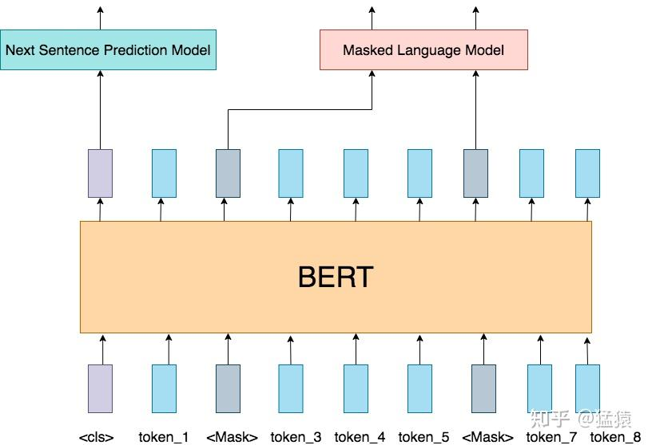

  

-   input：输入是一条文本。文本中的每个词（token）我们都通过embedding把它表示成了向量的形式。、
-   训练任务：在Bert中，我们同时做2个训练任务：  
    

-   **Next Sentence Prediction Model（下一句预测）**：input中会包含两个句子，这两个句子有50%的概率是真实相连的句子，50%的概率是随机组装在一起的句子。我们在每个input前面增加特殊符`<cls>`，这个位置所在的token将会在训练里不断学习整条文本蕴含的信息。最后它将作为“下一句预测”任务的输入向量，该任务是一个二分类模型，输出结果表示两个句子是否真实相连。
-   **Masked Language Model（遮蔽词猜测）**：在input中，我们会以一定概率随机遮盖掉一些token（`<mask>`)，以此来强迫模型通过Bert中的attention结构更好抽取上下文信息，然后在“遮蔽词猜测”任务重，准确地将被覆盖的词猜测出来。

  

-   Bert模型：Transformer的Encoder层。

关于Bert更详细的介绍，可以参考文章开头给出的链接文章。

  

### 1.2 VIT模型架构

  

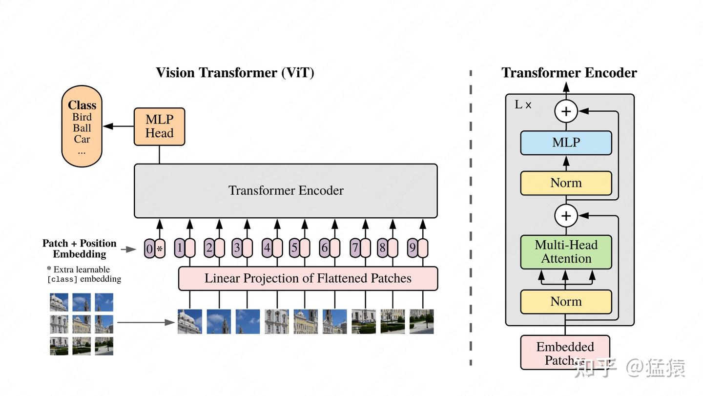

  
我们先来看左侧部分。  

-   **[Patch](https://zhida.zhihu.com/search?content_id=234276776&content_type=Article&match_order=1&q=Patch&zhida_source=entity)**：对于输入图片，首先将它分成几个patch（例如图中分为9个patch），每个patch就类似于NLP中的一个token（具体如何将patch转变为token向量，在下文会细说）。
-   **[Position Embedding](https://zhida.zhihu.com/search?content_id=234276776&content_type=Article&match_order=1&q=Position+Embedding&zhida_source=entity)**：每个patch的位置向量，用于指示对应patch在原始图片中的位置。和Bert一样，这个位置向量是learnable的，而并非原始Transformer中的函数式位置向量。同样，我们会在下文详细讲解这一块。
-   **Input:** 最终传入模型的Input = patching\_emebdding + position embedding，同样，在输入最开始，我们也加一个分类符`<cls>`，在bert中，这个分类符是作为“下一句预测”中的输入，来判断两个句子是否真实相连。**在VIT中，这个分类符作为分类任务的输入，来判断原始图片中物体的类别**。

右侧部分则详细刻画了Transformer Encoder层的架构，它由L块这样的架构组成。图片已刻画得很详细，这里不再赘述。  
**总结起来，VIT的训练其实就在做一件事**：把图片打成patch，送入Transformer Encoder，然后拿`<cls>`对应位置的向量，过一个简单的softmax多分类模型，去预测原始图片中描绘的物体类别即可。  
  
  
你可能会想：“这个分类任务只用一个简单的softmax，真得能分准吗？”其实，**这就是VIT的精华所在了：VIT的目的不是让这个softmax分类模型强大，而是让这个分类模型的输入强大。这个输入就是Transformer Encoder提炼出来的特征**。分类模型越简单，对特征的要求就越高。  
  
  
**所以为什么说Transformer开启了大一统模型的预训练大门呢？主要原因就在于它对特征的提炼能力——这样我们就可以拿这个特征去做更多有趣的任务了**。这也是VIT能成为后续多模态backbone的主要原因。

  

## 二、从patch到token

  
讲完了基本框架，我们现在来看细节。首先我们来看看，图片的patch是怎么变成token embedding的。

### 2.1 patch变token的过程

  

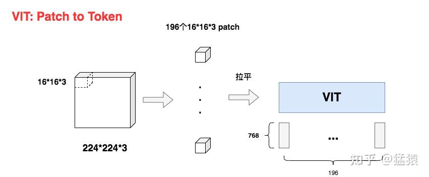

  
如图，假设原始图片尺寸大小为：`224*224*3` (H \* W \* C)。  
现在我们要把它切成小patch，**每个patch的尺寸设为16**（**P=16**），则每个patch下图片的大小为`16*16*3`。  
则容易计算出共有 $\frac{224*224}{16*16} = 196$ 个patch。  
不难看出每个patch对应着一个token，将每个patch展平，则得到输入矩阵X，其大小为`(196, 768)`，也就是每个token是768维。  
通过这样的方式，我们成功将图像数据处理成自然语言的向量表达方式。  
  
  
好，**那么现在问题来了，对于图中每一个`16*16*3`的小方块，我要怎么把它拉平成`1*768`维度的向量呢？**  
比如说，我先把第一个channel拉成一个向量，然后再往后依次接上第二个channel、第三个channel拉平的向量。但这种办法下，同一个pixel本来是三个channel的值共同表达的，现在变成竖直的向量之后，这三个值的距离反而远了。基于这个原因，你可能会想一些别的拉平方式，但归根究底它们都有一个共同的问题：太规则化，太主观。  
  
  
所以，**有办法利用模型来做更好的特征提取吗**？当然没问题。VIT中最终采用[CNN](https://zhida.zhihu.com/search?content_id=234276776&content_type=Article&match_order=1&q=CNN&zhida_source=entity)进行特征提取，具体方案如下：  

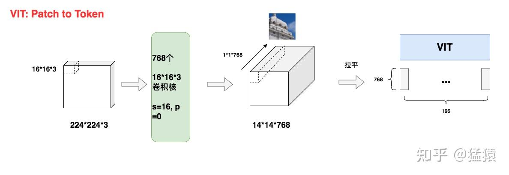

  
采用768个`16*16*3`尺寸的卷积核，stride=16，padding=0。这样我们就能得到`14*14*768`大小的特征图。如同所示，特征图中每一个`1*1*768`大小的子特征图，都是由卷积核对第一块patch做处理而来，因此它就能表示第一块patch的token向量。  
  
  
【**备注】：**  
你可能会问，**前面不是说VIT已经摆脱CNN了吗？这里怎么又用卷积了**？由于这一步只是输入预处理阶段，和主体模型没有关系，只要将其试为一致特征提取方法即可，并不影响我们之前的结论。

  

### 2.2 为什么要处理成patch

  
**你可能想问，为什么一定要先分patch，再从patch转token呢？**

  
**第一个原因，是为了减少模型计算量。**  
在Transformer中，假设输入的序列长度为N，那么经过attention时，计算复杂度就为 $O(N^{2})$ ，因为注意力机制下，每个token都要和包括自己在内的所有token做一次attention score计算。  
在VIT中， $O(N^{2})$ ，当patch尺寸P越小时，N越大，此时模型的计算量也就越大。因此，我们需要找到一个合适的P值，来减少计算压力。

  
**第二个原因，是图像数据带有较多的冗余信息。**  
和语言数据中蕴含的丰富语义不同，像素本身含有大量的冗余信息。比如，相邻的两个像素格子间的取值往往是相似的。因此我们并不需要特别精准的计算粒度（比如把P设为1）。这个特性也是之后MAE，MoCo之类的像素级预测模型能够成功的原因之一。

  

## 三、Emebdding

  
如下图，我们知道在Bert（及其它NLP任务中）：  
输入 = **token\_embedding**(将单个词转变为词向量) + **position\_embedding**(位置编码，用于表示token在输入序列中的位置) + **segment\_emebdding(**非必须，在bert中用于表示每个词属于哪个句子)。  
**在VIT中，同样存在token\_embedding和postion\_emebedding**。  

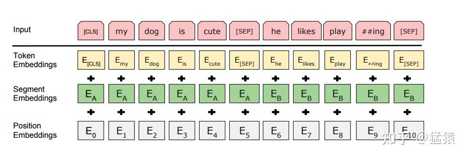

###   
3.1 Token Emebdding  

我们记token emebdding为 $E$ ，则 $E$ 是一个形状为`(768, 768)`的矩阵。

  
由前文知经过patch处理后输入$$$$的形状为`(196, 768)`，则输入X过toke\_embedding后的结果为：  
$X_{TE} = X * E = (196, 768) * (768 * 768) = (196, 768)$

  
**你可能想问，输入X本来就是一个`(196，768)`的矩阵啊，我为什么还要过一次embedding呢？**这个问题的关键不在于数据的维度，而在于embedding的含义。原始的X仅是由数据预处理而来，和主体模型毫无关系。而token\_embedding却参与了主体模型训练中的梯度更新，在使用它之后，能更好地表示出token向量。更进一步，E的维度可以表示成`(768, x)`的形式，也就是第二维不一定要是768，你可以自由设定词向量的维度。

  

### 3.2 Position Embedding（位置向量）

  
在NLP任务中，位置向量的目的是让模型学得token的位置信息。在VIT中也是同理，我们需要让模型知道每个patch的位置信息（参见1.2中架构图）。

  
我们记位置向量为 $E_{pos}$ ，则它是一个形状为`(196，768)`的矩阵，表示196个维度为768的向量，**每个向量表示对应token的位置信息**。

  
构造位置向量的方法有很多种，在VIT中，作者做了不同的消融实验，来验证不同方案的效果（论文附录D.4）部分，我们来详细看看，作者都曾尝试过哪些方案。

  
**方案一： 不添加任何位置信息**

  
将输入视为一堆无序的patch，不往其中添加任何位置向量。

  
**方案二：使用1-D绝对位置编码**

  
**也就是我们在上文介绍的方案，这也是VIT最终选定的方案。**  
1-D绝对位置编码又分为**函数式**（Transformer的三角函数编码，详情可参见[这篇文章](https://zhuanlan.zhihu.com/p/454482273)）和**可学习式**（Bert采用编码方式），VIT采用的是后者。之所以被称为“绝对位置编码”，是因为位置向量代表的是token的绝对位置信息（例如第1个token，第2个token之类）。

  
**方案三：使用2-D绝对位置编码**  

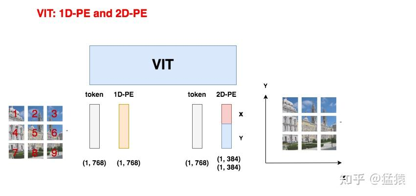

  
如图所示，因为图像数据的特殊性，在2-D位置编码中，认为按全局绝对位置信息来表示一个patch是不足够的（如左侧所示），一个patch在x轴和y轴上具有不同含义的位置信息（如右侧所示）。因此，2-D位置编码将原来的PE向量拆成两部分来分别训练。  
  
  
**方案四：相对位置编码（relative positional embeddings）**  

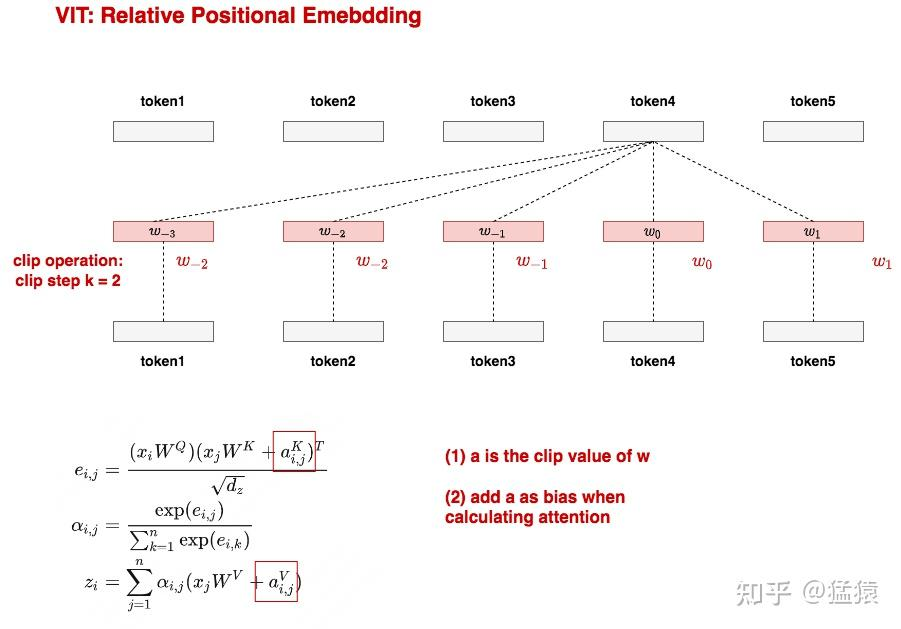

  
相对位置编码（RPE）的设计思想是：**我们不应该只关注patch的绝对位置信息，更应该关注patch间的相对位置信息**。如图所示，对于token4，它和其余每一个token间都存在相对位置关系，我们分别用 $w_{-3}, w_{-2}, ... w_{1}$ 这5个向量来表示这种位置关系。

那么接下来，**只要在正常计算attention的过程中，将这5个向量当作bias添加到计算过程中（如图公式所示），我们就可以正常训练这些相对位置向量了**。为了减少训练时的参数量，我们还可以做**clip操作**，在制定clip的步数k之后，在k范围之外的w我们都用固定的w表示。例如图中当k=2时，向token4的前方找，我们发现 $w_{-3}$ 已经在k=2步之外了，因此就可以用 $w_{-2}$ 来替代 $w_{-3}$ ，如果token1之前还有token，那么它们的w都可用 $w_{-2}$ 替代。向token4的后方找，发现大家都在k=2步之内，因此无需做任何替换操作。

  
关于相对位置编码的更多信息，可以阅读原始论文（[https://arxiv.org/pdf/1803.02155.pdf](https://link.zhihu.com/?target=https%3A//arxiv.org/pdf/1803.02155.pdf)）

  
**实验结果**

  
这四种位置编码方案的实验结果如下：  

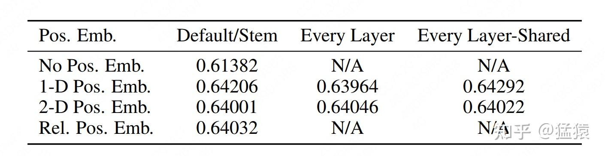

  
可以发现除了“不加任何位置编码”的效果显著低之外，其余三种方案的结果都差不多。所以作者们当然选择最快捷省力的1-D位置编码方案啦。当你在阅读VIT的论文中，会发现大量的消融实验细节（例如分类头`<cls>`要怎么加），**作者这样做的目的也很明确：“我们的方案是在诸多可行的方法中，逐一做实验比对出来的，是全面考虑后的结果。”**这也是我一直觉得这篇论文在技术之外值得借鉴和反复读的地方。

  

## 四、模型架构的数学表达

  
到这一步位置，我们已基本将VIT的模型架构部分讲完了。结合1.2中的模型架构图，我们来用数学语言简练写一下训练中的计算过程：  

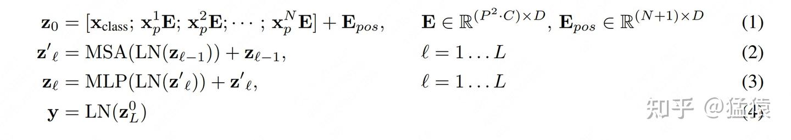

  
(1）即是我们说的图像预处理过程:  

-   $w_{-2}$ ：第i块patch
-   $E, E_{pos}$ ：Token Embedding，1-D Positional Embedding
-   $x_{class}$ ：和Bert类似，是额外加的一个分类头
-   $z_{0}$ ：最终VIT的输入

  
  
（2）即是计算multi-head attention的过程，（3）是计算MLP的过程。  
（4）是最终分类任务，LN表示是一个简单的线性分类模型， $z_{0}$ 则是`<cls>`对应的向量。

  

## 五、微调（fine-tune）

  
目前为止，按照一至五部分所说的内容，通过让模型做分类预测，我们可以**预训练（pretrain）**好一个VIT了。  
  
  
前面说过，预训练好的VIT模型是个有力的特征提取器，我们可以用它输出的特征，去做更多有趣的**下游任务（downstream task)**。例如拿它去做类型更丰富的分类，目标检测等事情。在做这些任务时，我们会喂给预训练模型一堆新的数据，同时尽量保证模型的主体架构不变（例如VIT整体参数不动，只在输出层后接一个新模型，再次训练时只对新模型做参数更新之类）。**这种既利用了已有模型的特征提取能力，又能让模型更好适应不同任务的操作，称为微调（fine-tune）。**  
  
  
在fine-tune的时候，我们用的图像大小可能和预训练时的并不一致，比如：  

-   预训练时用`224*224*3`大小的图片，fine-tune时为了效果更好，一般选择分辨率更高的图片，例如`1024*1024*3`
-   假设保持patch尺寸P=16不变，则预训练时产生的patch数有196个，fine-tune时产生的patch数有4096个（ $\frac{H*W}{P^{2}}$ ）
-   我们知道，Transformer主体架构理论上是可以处理任意长度的输入序列的（相关分析参见[这篇](https://www.zhihu.com/question/445895638/answer/2306274526)文章）。但是**可学习的（learnable）**位置编码不是，由于一个位置对应一条位置编码，它和输入序列长度密切相关。

  
  
那么多出来的patch，在fine-tune时要怎么给它们位置编码呢？如果统一都赋成0向量，然后在fine-tune的时候再去训练这些向量，看起来可以，但这样粗暴的赋值不仅增加了计算量，也浪费了已有的信息（例如，是否能从已有的位置编码粗略地初始化一些新的位置编码出来？）考虑到这一点，**VIT在fine-tune时，对预训练阶段的位置编码做了2D插值处理。**

###   
5.1 VIT fine-tune: 2D插值位置编码  

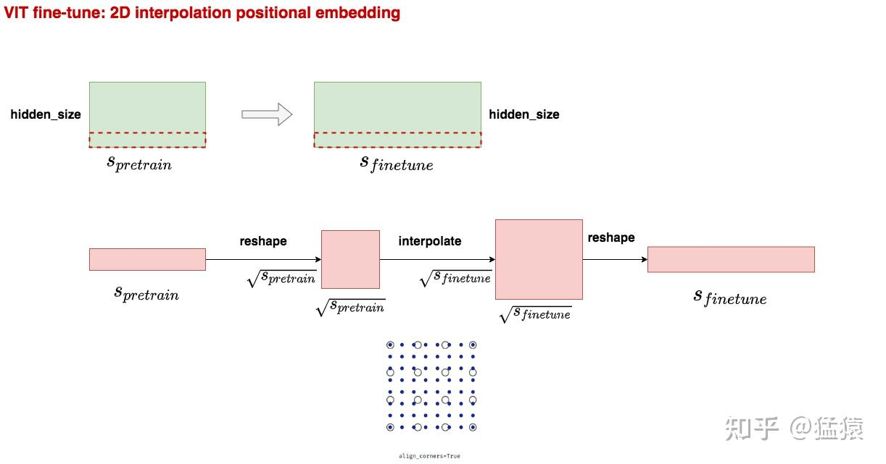

  
如图绿色部分所示，在fine-tune阶段要处理的patch/token数 $s_{finetune}$ 可能比预训练阶段要处理的 $\frac{H*W}{P^{2}}$ 要多。  
图中红色部分演示了如何通过插值方法将 $s_{pretrain}$ 扩展至 $s_{finetune}$ 。其中interpolate部分就是2D插值，这部分是重点，我们直接看下代码中的操作：

```python3
new_pos_embedding_img = nn.functional.interpolate(
            pos_embedding_img,
            size=new_seq_length_1d,
            mode=interpolation_mode,
            align_corners=True,
        )
```

  
可以发现这里用了pytorch内置的interpolate函数，mode表示具体的插值方法，在VIT中采用的是bicubic。`align_corners=True` 的意思是在固定原矩阵四角的情况下按mode进行插值，可以参加图中，白色圆圈表示原始的矩阵，蓝色点表示做完插值后的矩阵。插值后矩阵的四角保持不变，中间则按设置的方法做插值。关于插值位置编码更详细的讲解，可以参考[这篇](https://link.zhihu.com/?target=https%3A//blog.csdn.net/qq_44166630/article/details/127429697)文章。

  

## 六、VIT效果

  
到目前为止，我们已讲完了预训练和微调的内容。接下来，我们来看VIT的效果，及一些有趣的实验结果。

###   
6.1 不同VIT模型的表示符号  

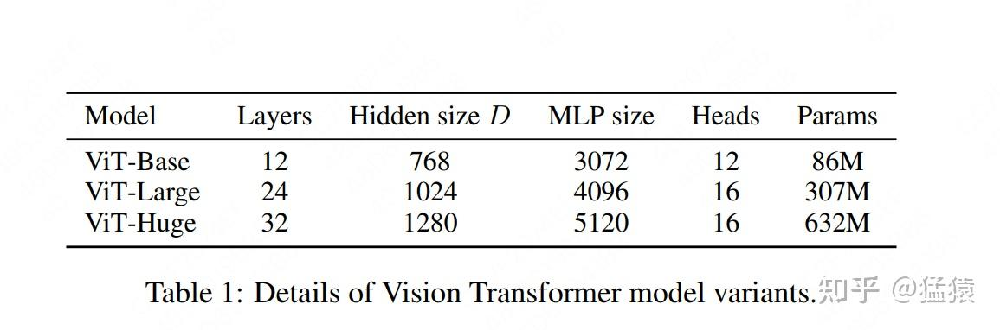

  
VIT预训练了三种不同参数规模的模型，分别是`VIT-Base` ，`VIT-Large`和`VIT-Huge`。其规模可具体见上图。  
在论文及实际使用中，我们常用`VIT-size/patch_size`的形式来表示该模型是在“什么规模”及“多大的patch尺寸”上预训练出来的。例如`VIT-H/14` 就表示该模型是在Huge规模上，用patch尺寸为14的数据做预训练的

  

### 6.2 VIT VS 卷积神经网络

  
既然VIT的目的是替换卷积神经网络，那么当然要比较一下它和目前SOTA的卷积网络间的性能了。  
作者选取了[ResNet](https://zhida.zhihu.com/search?content_id=234276776&content_type=Article&match_order=1&q=ResNet&zhida_source=entity)和[Noisy Student](https://zhida.zhihu.com/search?content_id=234276776&content_type=Article&match_order=1&q=Noisy+Student&zhida_source=entity)这两种经典高性能的卷积神经网络与VIT进行比较，比较内容为“**预测图片类别的准确性**”与“**训练时长**”，结果如下：  

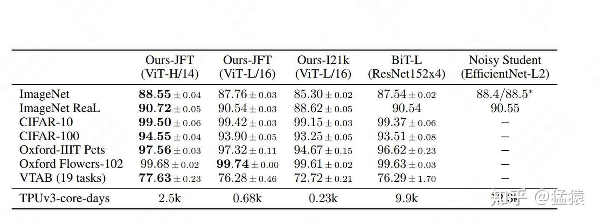

  
前三列Ours-JFT(VIT-H/14)，Ours-JFT(VIT-L/16)，Ours-I12K(VIT-L/16)表示三个VIT预训练模型，它们分别在不同规模和不同数据集（JFT, I12K）上预训练而来。后两列表示两个卷积神经网络模型。

  
纵向的ImageNet，ImageNet Real等表示不同的图像数据集，当我们的VIT模型和卷积模型预训练好后，我们就可以借助这些pretrain模型，在图像数据集上做fine-tune，而表格里给出的就是fine-tune后的准确率。  
观察表格，我们发现一个有趣的现象：**VIT和卷积神经网络相比，表现基本一致**。关于这一点，我们会在下文详细分析。

  
虽然准确率没有突出表现，但是训练时间上VIT的还是有亮点的，表格最后一行表示，假设用单块TPU训练模型，所需要的天数。**我们发现VIT最高也只需要2500核-天（当然其实这个值也不小啦），卷积网络要花至9900核-天以上。所以VIT的一个优势在于，训练没那么贵了。**关于这点，我的猜想是基于Transformer架构的VIT，和卷积神经网络相比，更适合做**切分均匀**的矩阵计算，这样我们就能把参数均匀切到不同卡上做分布式训练，更好利用GPU算力，平衡整个训练系统了。  
  
  
现在，我们回到刚才的问题，**为什么VIT相比卷积网络，在准确率上没有突出优势**？为了解答这个问题，我们先来看卷积神经网络的**归纳偏置（inductive biases）**  
  
  
**6.2.1 卷积神经网络的归纳偏置**

  
**归纳偏置用大白话来说，就是一种假设，或者说一种先验知识。有了这种先验，我们就能知道哪一种方法更适合解决哪一类任务。所以归纳偏置是一种统称，不同的任务其归纳偏置下包含的具体内容不一样。**  
对图像任务来说，它的归纳偏置有以下两点：  

-   **空间局部性（locality）**：假设一张图片中，相邻的区域是有相关特征的。比如太阳和天空就经常一起出现。
-   **平移等边性（translation equivariance）**： $f(g(x)) = g(f(x)), f=卷积, g=平$ 。假设一张图中，左上角有一个太阳，你对这张图正常做卷积得到特征图，则左上角的卷积可表示为 $f(x)$ ，做完卷积后，你想把左上角的特征图移动到右上角去，则你这一顿操作可以用 $g(f(x))$ 来表示。这一系列操作等同于，你先把左上角的太阳移动到右上角去( $g(x)$ )，然后再做卷积 $f(g(x))$ ，这就是图像的平移等边性。不论物体移动到哪里，只要给卷积核的输入不变，那么输出也是一致的。

在这两种先验假设下，CNN成为了图像任务最佳的方案之一。**卷积核能最大程度保持空间局部性（保存相关物体的位置信息）和平移等边性**，使得在训练过程中，最大限度学习和保留原始图片信息。  
  
  
好，那么现在，如果说VIT相比于卷积，在图像任务上没有显著优势，那大概率VIT对这两种先验的维护没有CNN做的好，具体来看：  

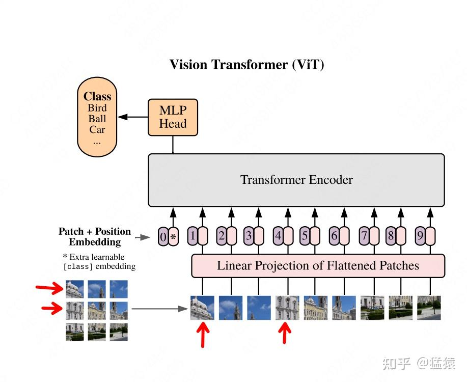

  
图中箭头所指的两部分都属于同一栋建筑。在卷积中，我们可以用大小适当的卷积核将它们圈在一起。但是在VIT中，它们之间的位置却拉远了，如果我把patch再切分细一些，它们的距离就更远了。虽然attention可以学习到向量间的想关系，但是VIT在**空间局部性**的维护上，确实没有卷积做的好。而在**平移等边性**上，由于VIT需要对patch的位置进行学习，所以对于一个patch，当它位置变幻时，它的输出结果也是不一样的。**所以，VIT的架构没有很好维护图像问题中的归纳偏置假设**。  
  
  
但是，这就意味着VIT没有翻盘的一天了吗？当然不是，**不要忘了，Transformer架构的模型都有一个广为人知的特性：大力出奇迹**。只要它见过的数据够多，它就能更好地学习像素块之间的关联性，当然也能抹去归纳偏置的问题。

  

**6.2.2 VIT：大力出奇迹**

  
作者当然也考虑到了这点，所以采用了不同数量的数据集，对VIT进行训练，效果如下：  

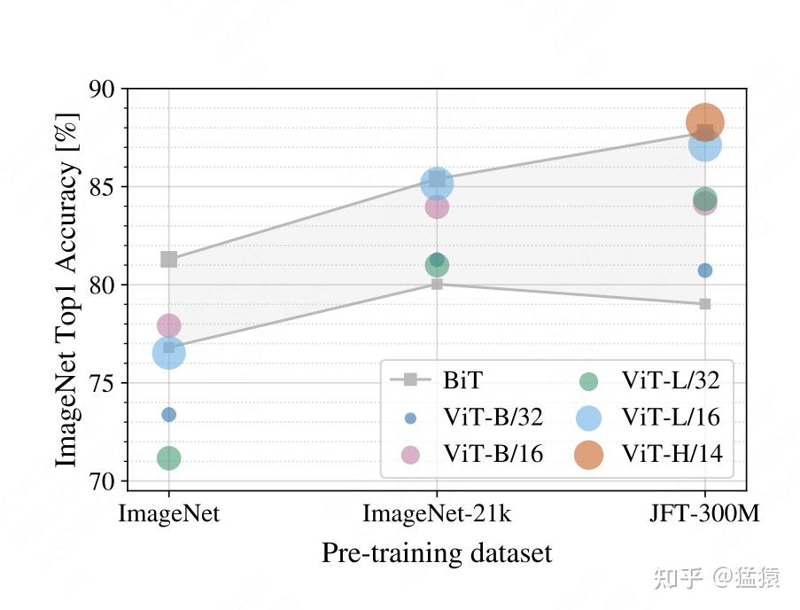

  
如图，横轴表示不同量级的数据集（越往右数据集越大），纵轴表示准确率。图中灰色阴影部分表示在相应数据集下，不同架构的卷积神经网络的准确率范围。**可以发现，当数据集较小时，VIT表现明显弱于卷积网络。但当数据量级大于21k时，VIT的能力就上来了**。

  

### 6.3 VIT的Attention到底看到了什么

  
讲完了VIT的整体效果，我们来探究下VIT具体学到了什么，才能帮助它达到这样的效果。我们首先来看attention层。  

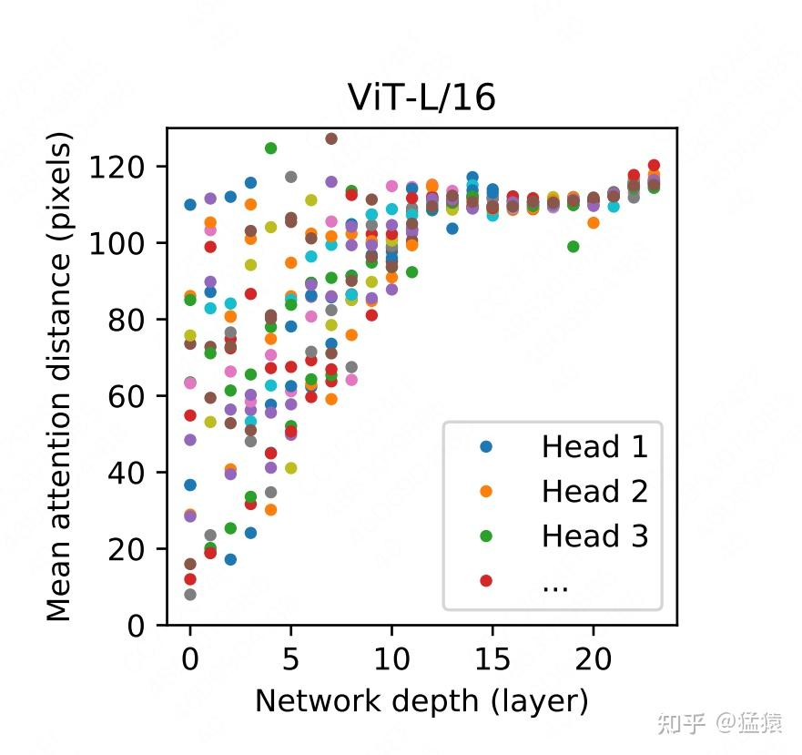

  
这张实验图刻画了VIT的16个multi-head attention学到的像素距离信息。横轴表示网络的深度，纵轴表示“平均注意力距离”，我们设第i个和第j个像素的平均注意力距离为 $d_{ij}$ ，真实像素距离为 $d_{ij}^{\prime}$ ，这两个像素所在patch某一个head上的attention score为 $a_{ij}$ ，则有： $d_{ij} = a_{ij} * d_{ij}^{\prime}$ 。当 $d_{ij}$ 越大时，说明VIT的attention机制能让它关注到距离较远的两个像素，类似于CNN中的“扩大感受野”。  
  
  
图中每一列上，都有16个彩色原点，它们分别表示16个head观测到的平均像素距离。由图可知，在浅层网络中，VIT还只能关注到距离较近的像素点，**随着网络加深，VIT逐渐学会去更远的像素点中寻找相关信息了。这个过程就和用在CNN中用卷积逐层去扩大感受野非常相似**。  
  
  
下图的左侧表示原始的输入图片，右侧表示VIT最后一层看到的图片信息，可以清楚看见，VIT在最后一层已经学到了将注意力放到关键的物体上了，这是非常有趣的结论：  

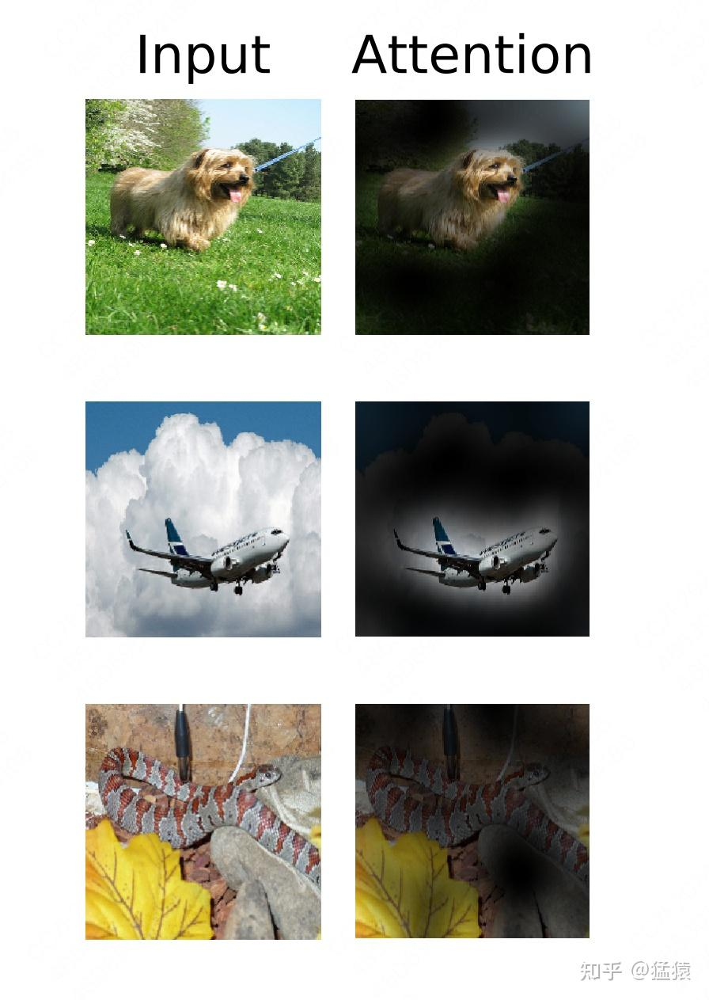

###   
6.4 VIT的位置编码学到了什么  

我们在上文讨论过图像的**空间局部性（locality）**，即有相关性的物体（例如太阳和天空）经常一起出现。CNN采用卷积框取特征的方式，极大程度上维护了这种特性。**其实，VIT也有维护这种特性的方法，上面所说的attention是一种，位置编码也是一种。**  
  
  
我们来看看VIT的位置编码学到了什么信息：  

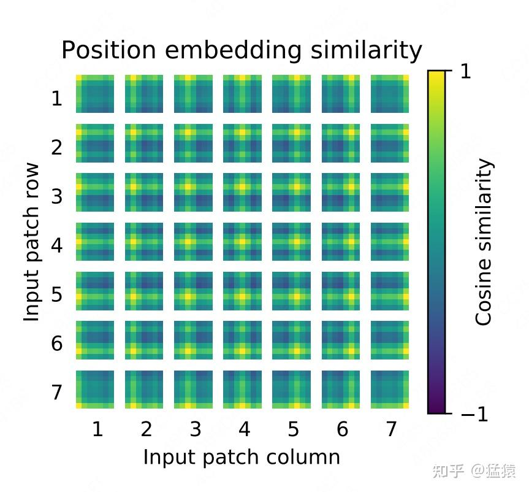

  
  
  
上图是`VIT-L/32`模型下的位置编码信息，图中每一个方框表示一个patch，图中共有7\*7个patch。而每个方框内，也有一个7\*7的矩阵，这个矩阵中的每一个值，表示当前patch的position embedding和其余对应位置的position embedding的余弦相似度。**颜色越黄，表示越相似，也即patch和对应位置间的patch密切相关**。  
注意到每个方框中，最黄的点总是当前patch所在位置，这个不难理解，因为自己和自己肯定是最相似的。除此以外**颜色较黄的部分都是当前patch所属的行和列，以及以当前patch为中心往外扩散的一小圈。这就说明VIT通过位置编码，已经学到了一定的空间局部性**。

  

## 七、总结：VIT的意义何在

  
到此为止，关于VIT模型，我们就介绍完毕了。一顿读下来，你可能有个印象：**如果训练数据量不够多的话，看起来VIT也没比CNN好多少呀，VIT的意义是什么呢？**  
这是个很好的问题，**因为在工业界，人们的标注数据量和算力都是有限的，因此CNN可能还是首要选择**。  
但是，VIT的出现，不仅是用模型效果来考量这么简单，今天再来看这个模型，发现它的意义在于：  

-   证明了一个统一框架在不同模态任务上的表现能力。在VIT之前，NLP的SOTA范式被认为是Transformer，而图像的SOTA范式依然是CNN。**VIT出现后，证明了用NLP领域的SOTA模型一样能解图像领域的问题，同时在论文中通过丰富的实验，证明了VIT对CNN的替代能力**，同时也论证了**大规模+大模型在图像领域的涌现能力**（论文中没有明确指出这是涌现能力，但通过实验展现了这种趋势）。这也为后续两年多模态任务的发展奠定了基石。
-   虽然VIT只是一个分类任务，但在它提出的几个月之后，立刻就有了用Transformer架构做检测（detection）和分割（segmentation）的模型。而不久之后，GPT式的无监督学习，也在CV届开始火热起来。
-   工业界上，对大部分企业来说，受到训练数据和算力的影响，预训练和微调一个VIT都是困难的，但是这不妨碍直接拿大厂训好的VIT特征做下游任务。同时，低成本的微调方案研究，在今天也层出不穷。长远来看，2年前的这个“庞然大物”，已经在逐步走进千家万户。

##   
  
八、参考

  
1、[https://arxiv.org/pdf/2010.11929.pdf](https://link.zhihu.com/?target=https%3A//arxiv.org/pdf/2010.11929.pdf)  
2、[https://www.bilibili.com/video/BV15P4y137jb/?spm\_id\_from=333.337.search-card.all.click](https://link.zhihu.com/?target=https%3A//www.bilibili.com/video/BV15P4y137jb/%3Fspm_id_from%3D333.337.search-card.all.click)  
3、[https://arxiv.org/pdf/1803.02155.pdf](https://link.zhihu.com/?target=https%3A//arxiv.org/pdf/1803.02155.pdf)  
4、[https://blog.csdn.net/qq\_44166630/article/details/127429697](https://link.zhihu.com/?target=https%3A//blog.csdn.net/qq_44166630/article/details/127429697)