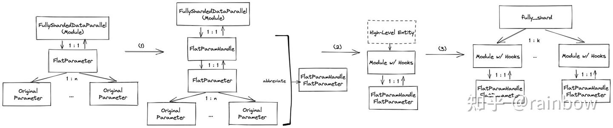

# PyTorch FSDP 设计解读

**Author:** Hongzhuzhu

**Date:** 2024-04-25

**Link:** https://zhuanlan.zhihu.com/p/694288870

​

目录

收起

FSDP 背景

What is FSDP?

FSDP vs. DeepSpeed ZeRO-DP

How FSDP works

FSDP design

初始化 （Initialization）

运行期（Runtime）

分片策略（Wrapping Policy）

计算和通信重叠（Computation and communication Overlapping）

混合精度（Mixed Precision）

总结：FSDP vs. DeepSpeed ZeRO-DP

References

这个topic 已经酝酿已久了。现在网上关于PyTorch FSDP design的介绍并不是很多，很多知识只能从PyTorch的源码和开发记录中获得。最近一段时间学习之后很有收获，这里想整体梳理一下，提供给大家一个参考，欢迎更多的小伙伴参与讨论。

注意本文主要探讨FSDP的设计方案，不涉及更多的源码解读，建议大家可以结合源码一起理解。如有错误之处，欢迎批评指正。

## FSDP 背景

Scaling Law 提示我们，模型的效果随着模型的size，数据size 增加；因此现在的模型越来越大，而日益增长的模型大小（从BERT的110M到GPT3 的1Tb)也带来了计算的挑战，单卡肯定是放不下了~~

那么多卡和多机并行就十分必要，现在的并行策略也越来越多，数据并行以[DDP](https://zhida.zhihu.com/search?content_id=242416550&content_type=Article&match_order=1&q=DDP&zhida_source=entity)，FSDP/ZeRo-DP为代表，还有模型并行（[tensor parallel](https://zhida.zhihu.com/search?content_id=242416550&content_type=Article&match_order=1&q=tensor+parallel&zhida_source=entity) (TP), [pipeline parallel](https://zhida.zhihu.com/search?content_id=242416550&content_type=Article&match_order=1&q=pipeline+parallel&zhida_source=entity) (PP)), 序列并行 （sequence parallel), 专家并行（[expert parallel](https://zhida.zhihu.com/search?content_id=242416550&content_type=Article&match_order=1&q=expert+parallel&zhida_source=entity))... 我们今天就主要介绍数据并行的FSDP。

一个易用可扩展的方法，需要具备以下几个方面的要求：

不局限于特定的模型结构，encoder, decoder 各种结构都适配；

用户友好，可以最少的code change就能够用起来；

高效和可靠。

基于上面的考虑，FSDP 应运而生，虽然FSDP 受到[ZeRO-DP](https://zhida.zhihu.com/search?content_id=242416550&content_type=Article&match_order=1&q=ZeRO-DP&zhida_source=entity)启发，但是PyTorch的design确实更加精炼，易用，直接和pytorch的核心组件co-design， 代码设计简洁高效。deepspeed 因为是架构在pytorch之上的框架，其接口也依赖于pytorch，灵活和稳定性肯定还是pytorch 原生的更好一些。

## What is FSDP?

FSDP 全称 **FullyShardedDataParallel， 是Meta 提出的一个针对LLM 训练的解决方案，它是一个数据并行的策略，通过对模型参数（parameters), 梯度（gradients) 和优化器状态（optimizer states) 在多gpu上点**切分实现并行。API十分简单易用，

```python3
fsdp_module = FullyShardedDataParallel(module)
```

详细用法直接参考pytorch doc [FullyShardedDataParallel — PyTorch 2.2 documentation](https://link.zhihu.com/?target=https%3A//pytorch.org/docs/stable/fsdp.html)

## FSDP vs. [DeepSpeed](https://zhida.zhihu.com/search?content_id=242416550&content_type=Article&match_order=1&q=DeepSpeed&zhida_source=entity) ZeRO-DP

FSDP受启发于DeepSpeed ZeRO-DP，并进行了进一步的延申和拓展。首先回顾一下ZeRO-DP，根据切分的model states不同，ZERO可以分成3个阶段：ZeRO1（只对optimizer states切分）；ZERO2 (对optimizer states和gradients切分），ZERO3（对optimizer states，gradients，parameters切分）；

相应的，FSDP包括了NO\_SGARD（等效于DDP)；SHARD\_GRAD\_OP（对标ZeRO2）；FULL\_SHARD （对标ZeRO3）；HYBRID\_SHARD（Node内shard，node间replicate，对标ZeRO++ stage3），同时还有\_HYBRID\_SHARD\_ZeRO2（node内ZeRO2 shard，node间replicate）。

FSDP提供的默认API是**fully\_shard**，这里我们也重点围绕其展开。

## How FSDP works


**Constructor**

对模型参数进行切片分发到每个rank上

**Forward pass**

1.  对每个FSDP unit，运行all\_gather收集所有rank上的模型参数切片，这样每个rank上拥有当前unit的全部参数 （这也是为什么FSDP 仍然属于数据并行的原因，虽然对模型参数进行了切分，但是计算的时候还是用原始的全部参数来计算的，而不是像tensor parallel那样只拿weight的分片计算）
2.  执行前向计算过程
3.  重新执行切片丢掉不属于当前rank的模型参数，释放memory

**Backward pass**

1.  对每个FSDP unit，运行all\_gather收集所有rank上的模型参数切片
2.  执行反向计算过程
3.  重新执行切片丢掉不属于当前rank的模型参数，释放memory
4.  执行reduce\_scatter在不同的rank间同步梯度

**Optimizer updates**

每个 rank 对属于自己的局部梯度的分片进行更新

## FSDP design

### 初始化 （Initialization）

上面FSDP的工作过程我们提到了前向和后向的计算过程都是以FSDP unit为规模执行的，那么这个unit是什么呢？通常来说，这个unit可以是模型的一个layer，一个stage，一组layer (nn.Module)，比如我们在Llama中常用的就是[LlamaDecoderLayer](https://zhida.zhihu.com/search?content_id=242416550&content_type=Article&match_order=1&q=LlamaDecoderLayer&zhida_source=entity)。这个unit的design，就是FSDP的核心，它决定了计算和通信的执行单元。

FSDP通过[FlatParameter](https://zhida.zhihu.com/search?content_id=242416550&content_type=Article&match_order=1&q=FlatParameter&zhida_source=entity)来表示这个unit，表示为一个1D的tensor，通过n个模型参数tensor展开拼接而成；举个栗子，如果unit是LlamaDecoderLayer，那么这个里面的所有weight，包括q\_proj, k\_proj, v\_proj, o\_proj, gate\_proj, up\_proj, down\_proj, layernorm的所有weight全部展平拼接为一个大的1D tensor。然后这个1D tensor 平均分配到每个rank上，如果不能整除，会对其先padding再切分，这样每个rank上维护一份shard tensor，称为local shard。注意，这个1D tensor和原始的模型参数是共享memory的，不会占用新的memory。 用图来解释：


**为什么要用1D tensor呢？**其中最主要的考量就是通信性能的约束。两方面的原因：1）首先，对于NCCL backend来说，FSDP 需要调用allgather和reduce\_scatter两个collective op，[all\_gather\_into\_tensor](https://link.zhihu.com/?target=https%3A//github.com/pytorch/pytorch/blob/bc843682dd2cc739ee5f6ed9502a598e8aa88a8f/torch/distributed/distributed_c10d.py%23L2435) 和[reduce\_scatter\_tensor](https://link.zhihu.com/?target=https%3A//github.com/pytorch/pytorch/blob/bc843682dd2cc739ee5f6ed9502a598e8aa88a8f/torch/distributed/distributed_c10d.py%23L2910) 是比[all\_gather](https://link.zhihu.com/?target=https%3A//github.com/pytorch/pytorch/blob/bc843682dd2cc739ee5f6ed9502a598e8aa88a8f/torch/distributed/distributed_c10d.py%23L2361) 和[reduce\_scatter](https://link.zhihu.com/?target=https%3A//github.com/pytorch/pytorch/blob/bc843682dd2cc739ee5f6ed9502a598e8aa88a8f/torch/distributed/distributed_c10d.py%23L2868) 的性能更好，而这两个op要求保证输入tensor size是均等的。2）tensor batch到一起也减少了issue collective call的次数，性能更好。

**这个1D的tensor是怎样构建的呢？**这里给出一个示意图，模型结构可以看成一个树状结构，每个节点是一个module，0为root module，FSDP的wrap 规则是递归式（recursive）/嵌套式（nested）wrap，从上到下遍历wrap。这里展示了4个unit module，0，1，3，7，红色的是FSDP直接wrap的root module，黄色的是间接wrap的子module。每个wrap的unit内的所有参数都会展平拼接为一个1D tensor，作为通信的unit。


**FlatParameter design的发展**：

首先，FlatParameter是直接管理原始parameter的，是1：n的关系，FullyShardedDataParallel直接1：1管理FlatParameter；这样带来的问题是，FullyShardedDataParallel wrapper和FlatParameter具有依赖关系，而实际上我们需要遵循的原则是，每个API能够保留module的原始结构，并且可以通过named\_parameters() （返回original fully-qualified names (FQNs)）进行遍历。这种依赖关系会破坏这个原则，所以需要引入更多的中间结构。

第一个就是增加了一个FlatParamHandle抽象，管理FlatParameter，作为middle layer, 其中定义了对FlatParameter的一些管理的逻辑；

进一步地，在逻辑上，又把FullyShardedDataParallel 以更高level的entity来替代，这样可以在module上注册Hooks；这个entity也就是fully\_shard，和modules是1：k的关系。



### 运行期（Runtime）

-   **runtime hook**

FSDP runtime 需要处理整个forward和backward计算和通信的流程，通过override nn.Module的forward，定义相应的逻辑。

首先我们来看整个的流程，forward阶段，首先pre\_forward阶段会通过allgather对parameter进行unshard，得到当前unit的Flat tensor；然后注册post\_backward\_hooks；进行forward的计算，post\_forward阶段，会对参数进行释放，也就是调用reshard，parameter回到sharded状态，此时还会注册pre\_backward hook;

backward阶段，触发pre\_backward hook，调用allgather收集parameter，进行执行backward计算grad，最后触发post\_backward\_hook调用reduce scatter完成grad 同步。

这些hook如何精准控制backward过程的通信呢？它们分别注册在不同的位置，比如注册在forward的输出tensor上的hook，就可以锚定activation的grad计算；注册在AccumulateGrad上的hook可以在grad 计算好的时候立即触发reducescatter；注册在backward()的hook可以保证communication完成之后再执行接下来的参数更新。


-   **runtime memory**

我们继续回顾一下整个流程，观察memory的动态变化。首先，memory是通过unshard和shard来进行memory分配和释放的。unshard会分配memory（size为当年unit所有param的size），执行allgather来收集当前unit的所有参数；reshard会根据rank和worldsize进行切分，得到每个rank上所需部分参数切片的start\_idx 和end\_idx，只保留自己所属部分的memory，其余rank的memory进行释放。

FSDP峰值memory占用：

我们假设有N 个flatParameters 其中每个对应的元素个数为 φ\_1, φ\_2,…, φ\_N，拆分到F个rank上，并且满足

$sum_{i=1}^{N}{\varphi}=\Phi$

那么峰值memory占用： $O(\sum_{i=1}^{N}{\frac{\varphi_{i}}{F}+max_{i=1}^{N}\varphi_{i}})$

主要包括两部分：1 是切分到每个rank上的sharded parameter size；2是allgather 收集parameter后最大的flatparameter的size。

注意：如果考虑没有被FSDP wrap的部分，这部分也会进行allgather，并且会一直keep在每个rank上，计算完也不会释放，所以真正的峰值还包括这个部分。

实际上，memory的占用和throughput是需要trade-off的关系，如果FSDP wrap的unit小，峰值memory占用也小，但是throughput也会相应低，因为会调用更多的通信。而FSDP unit大的话memory 峰值占用也高。这里就需要用户根据需求来控制。


### 分片策略（Wrapping Policy）

Wrapping policy是FSDP的核心。前面讲了FlatParameter的创建，也提到了wrap的策略，指的是我们如何把module的submodule组织起来形成一个个unit，也决定了计算和通信重叠的可能性，影响性能。那么我们有哪些方法来控制wrap的策略呢？

想实验各种策略可以直接参考pytorch的unit test:

[pytorch/test/distributed/fsdp/test\_wrap.py at main · pytorch/pytorch (github.com)](https://link.zhihu.com/?target=https%3A//github.com/pytorch/pytorch/blob/main/test/distributed/fsdp/test_wrap.py%23L22)

通常情况，我们是基于模型结构来wrap的，比如Llama2 7b，有32个decoder layer，最直观的方法就是每个DecoderLayer作为一个unit来wrap，也就是

```text
    def test_transformer_auto_wrap_policy(self):
        """Tests the ``transformer_auto_wrap_policy``."""
        auto_wrap_policy = functools.partial(
            transformer_auto_wrap_policy,
            transformer_layer_cls={TransformerDecoderLayer},
        )
```

另外我们还可以定义自己的warp policy，通过传入module，和wrap的条件，返回bool值，决定哪些module被wrap，是否要recurse wrap，哪些module不被wrap，还可以设置条件来决定最小wrap的module size。

```text
def custom_auto_wrap_policy(
     module: nn.Module,
     recurse: bool,
     nonwrapped_numel: int,
     # Additional custom arguments
     min_num_params: int = int(1e8),
 ) -> bool:
     return nonwrapped_numel >= min_num_params
 # Configure a custom `min_num_params`
 my_auto_wrap_policy = functools.partial(custom_auto_wrap_policy, min_num_params=int(1e5))
```

这里提一个实践中遇到的custom wrap的场景。比如说Partial Parameter Fine-tuning (PEFT)，其中LoRA的场景，也就是说保持model整体参数不变，frozen这些base weight，设置require\_grad为False；然后我们只对部分参数，比如Llama2的q\_proj 和v\_proj叠加的低秩矩阵进行更新。我们成为LoRA weight, 设置require\_grad为True。

Case1： 如果我们把base weight和LoRA视为一个整体，也就是还是对LlamaDecoderLayer作为unit wrap，那么通信的unit就是这个整体，尽管backward base weight不需要计算grad，但是它们作为一个整体还是要做reduce\_scatter进行通信，增加了communication的overhead。注意FSDP要求wrap的unit里面的parameter不能是frozen和non-frozen混合的（这里可能需要看下新的code是否支持了），所以需要设置use\_orig\_params为True。

Case2：实际上，我们只需要对LoRA计算梯度，通信同步梯度，参数就更新就可以了。所以理想情况应该是把LoRA weight单独进行warp。所以这里我们要定义自己的custom wrap policy，这里就是采用or\_policy，对LlamaDecoderLayer和LoRA weight都分别wrap，就可以实现上面的功能。

```text
    def lambda_policy_fn(module):
        if (
            len(list(module.named_children())) == 0
            and getattr(module, "weight", None) is not None
            and module.weight.requires_grad
        ):
            return True
        return False

    lambda_policy = functools.partial(lambda_auto_wrap_policy, lambda_fn=lambda_policy_fn)
    transformer_wrap_policy = functools.partial(
        transformer_auto_wrap_policy,
        transformer_layer_cls=(
            PrefixEncoder,
            PromptEncoder,
            PromptEmbedding,
            transformer_layer_name,
            # FullyShardedDataParallelPlugin.get_module_class_from_name(
            #     model, transformer_layer_name
            # ),
        ),
    )

    auto_wrap_policy = functools.partial(_or_policy, policies=[lambda_policy, transformer_wrap_policy])
```

| Wrapping Policy | Latency (s) | Peak Memory (GB) |
| --- | --- | --- |
| Case1: Whole decoder layer wrap | 0.941 | 16 |
| Case 2: Separate wrap | 1.229 | 19 |

明显看出，定义的custom separate wrap 策略在latency上和memory占用都更有优势。

### 计算和通信重叠（Computation and communication Overlapping）

这部分也是FSDP设计的精髓了。我们的wrap策略都是为了计算和通信overlap来设计的。FSDP通过multi-streams 来实现computation和communication的overlapping。直接上图。


gpu上的共有5个stream，其中最主要是computation stream，communication stream，dtype cast stream (mixed precision用）。

可以看出forward阶段，compute kernel和allgather是overlap的，backward过程compute kernel和allgather&reduce\_scatter overlap。这里先提一下dtype cast stream，比如混合精度训练fp16+fp32，我们需要把fp32转成fp16来计算，那么FSDP的design就是在runtime转换的，并且为了不影响performance，专门用了一个stream来做这个转换。

要想实现上面的overlap，我们还需要进行一些设置。

1.  Forward Prefetching (**forward\_prefetch** (_[bool](https://link.zhihu.com/?target=https%3A//docs.python.org/3/library/functions.html)_)): 也就是在当前forward computation计算之前prefetch下一次的allgather；其主要用在cpu-bound的场景。比如CPU thread如果不能提前issue下一次的allgather的话，可能NCCL通信stream不能用满，所以可以提前issue。注意该设置只能用在static graph，原因是prefetch需要follow第一个iteration的执行顺序。
2.  Backward Prefetching (**backward\_prefetch**(Optional\[_[BackwardPrefetch](https://link.zhihu.com/?target=https%3A//pytorch.org/docs/stable/fsdp.html)_\]): 在当前backward computation计算之前prefetch下一次的allgather。只有设置该config才能保证backward过程计算和通信的overlap。但是因为提前执行了allgather，所以在一定程度上增加了memory的占用，也就是说gpu上包括了当前FSDP unit的parameter，gradient，和allgather得到的下一个unit的parameter。

### 混合精度（Mixed Precision）

最后看一下混合精度（mixed precision）在FSDP中的设置。

1.  **基本工作原理：**首先回顾mixed precision的流程


简单来说，就是keep一份高精度的master weights，转成低精度f16 (fp16/bf16) 执行forward和backward的计算，然后grad转成f32，利用master weights来更新weight。

FSDP mixed precision的接口提供了很多具体的设置，包括对param\_dtype, reduce\_dtype, buffer\_dtype，以及是否在某个阶段做转换的控制，感兴趣可以去看API。这里我想提到的是，FSDP对于精度的转换首先是在runtime进行的，也就是我们在overlapping的过程看到的dtype cast的stream；它使用两个变量来保存weight，一个是Flat\_param.\_local\_shard，保存f32 weight，一个是临时变量Flat\_param.\_mp\_shard，保存转换后的f16 weight，这个mp\_shard在完成forward和backward计算后就会释放，所以一直是f32的weight keep在memory中。

对于gradient，在backward计算过程中，gradient是f16，在\_post\_backward\_hook的结尾，gradient会转成f32来保证用高精度做参数更新。

2\. **fp16 + fp32 场景**：低精度如果是fp16的话，我们需要进行loss scaling，也就是把loss转成fp32，乘以系数S做scaling来避免梯度下溢，然后做完backward计算之后，再把weight gradient转成fp32 去掉scaling，也就是乘以1/S。FSDP提供了ShardedGradScaler来做处理scaling。


3\. **与PyTorch AMP的兼容性**：二者是兼容的。torch.autocast 是在dispatcher level进行工作的，对特定的op 进行dtype的转换，它的优先级更高。需要注意的是，那些需要以fp32来计算的parameter需要单独wrap成FSDP的unit，这样也会带来更多的通信，增加延迟。

4\. **FSDP memory管理的limitation**。上面提到，FSDP会把高精度的local\_shard keep在memory中，free掉低精度的mp\_shard，这对于PEFT LoRA的场景，也就是说base weight不需要权重更新，只有LoRA weight需要权重更新，此时base weight只需要keep 低精度计算就可以了，但是如果keep高精度的话，可能会带来一些memory的浪费。比如Llama2 70b，如果是8个rank，fp32就是每张卡上70 \* 4byte / 8 = 35GB，而fp16/bf16只需要17.5GB，对于memory要求高的场景，还是不够efficient。

多提一句，deepspeed因为是initialization阶段做的精度转换，就没有这个问题，看起来deepspeed更加memory efficient。

## 总结：FSDP vs. DeepSpeed ZeRO-DP

既然FSDP对标DeepSpeed ZeRO-DP，我根据个人的理解（有不对的地方欢迎指正），大概做个简要的比较和总结：

|   |   |   |
| --- | --- | --- |
| 设计 | 由用户来定义wrap的规则，基本上在block level wrap，param的分片更加均匀，比如LlamaDecoderLayer的例子 | 在每个operator parameter level上进行分片，完全由deepspeed控制 |
| 灵活性 | 对PyTorch user更加灵活，API简洁，代码改动少，可控性强，但同时也对用户有模型结构和性能优化的背景要求 | 需要相对多一点code change，user不需要care wrap的策略，但同时可控性也差一些 |
| 内存管理 | 有一定的局限性，尤其是PEFT LoRA的case，不知道最新的有没有改进？ | PEFT case更加memory efficient |

## References

[PyTorch](https://link.zhihu.com/?target=https%3A//arxiv.org/pdf/2304.11277.pdf) [FSDP: Experiences on Scaling Fully Sharded Data Parallel](https://link.zhihu.com/?target=https%3A//arxiv.org/pdf/2304.11277.pdf)

[Fully Sharded Data Parallel: faster AI training with fewer GPUs Engineering at Meta - (fb.com)](https://link.zhihu.com/?target=https%3A//engineering.fb.com/2021/07/15/open-source/fsdp/)

[Introducing](https://link.zhihu.com/?target=https%3A//pytorch.org/blog/introducing-pytorch-fully-sharded-data-parallel-api/) [PyTorch](https://link.zhihu.com/?target=https%3A//pytorch.org/blog/introducing-pytorch-fully-sharded-data-parallel-api/) [Fully Sharded Data Parallel (FSDP) API |](https://link.zhihu.com/?target=https%3A//pytorch.org/blog/introducing-pytorch-fully-sharded-data-parallel-api/) [PyTorch](https://link.zhihu.com/?target=https%3A//pytorch.org/blog/introducing-pytorch-fully-sharded-data-parallel-api/)

[Efficient Large-Scale Training with](https://link.zhihu.com/?target=https%3A//pytorch.org/blog/efficient-large-scale-training-with-pytorch/) [Pytorch](https://link.zhihu.com/?target=https%3A//pytorch.org/blog/efficient-large-scale-training-with-pytorch/) [FSDP and AWS |](https://link.zhihu.com/?target=https%3A//pytorch.org/blog/efficient-large-scale-training-with-pytorch/) [PyTorch](https://link.zhihu.com/?target=https%3A//pytorch.org/blog/efficient-large-scale-training-with-pytorch/)

[Maximizing training throughput using](https://link.zhihu.com/?target=https%3A//pytorch.org/blog/maximizing-training/) [PyTorch](https://link.zhihu.com/?target=https%3A//pytorch.org/blog/maximizing-training/) [FSDP |](https://link.zhihu.com/?target=https%3A//pytorch.org/blog/maximizing-training/) [PyTorch](https://link.zhihu.com/?target=https%3A//pytorch.org/blog/maximizing-training/)

[Fully Sharded Data Parallel (huggingface.co)](https://link.zhihu.com/?target=https%3A//huggingface.co/docs/accelerate/usage_guides/fsdp)

[Train models with billions of parameters using FSDP —](https://link.zhihu.com/?target=https%3A//lightning.ai/docs/pytorch/stable/advanced/model_parallel/fsdp.html) [PyTorch](https://link.zhihu.com/?target=https%3A//lightning.ai/docs/pytorch/stable/advanced/model_parallel/fsdp.html) [Lightning 2.2.1 documentation](https://link.zhihu.com/?target=https%3A//lightning.ai/docs/pytorch/stable/advanced/model_parallel/fsdp.html)

[FSDP Full Shard compatibility with BF16 AMP · Issue #105348 ·](https://link.zhihu.com/?target=https%3A//github.com/pytorch/pytorch/issues/105348) [pytorch](https://link.zhihu.com/?target=https%3A//github.com/pytorch/pytorch/issues/105348)[/](https://link.zhihu.com/?target=https%3A//github.com/pytorch/pytorch/issues/105348)[pytorch](https://link.zhihu.com/?target=https%3A//github.com/pytorch/pytorch/issues/105348) [(github.com)](https://link.zhihu.com/?target=https%3A//github.com/pytorch/pytorch/issues/105348)

[\[FSDP\] Mixed precision enablement by](https://link.zhihu.com/?target=https%3A//github.com/pytorch/pytorch/pull/74452) [rohan-varma](https://link.zhihu.com/?target=https%3A//github.com/pytorch/pytorch/pull/74452) [· Pull Request #74452 ·](https://link.zhihu.com/?target=https%3A//github.com/pytorch/pytorch/pull/74452) [pytorch](https://link.zhihu.com/?target=https%3A//github.com/pytorch/pytorch/pull/74452)[/](https://link.zhihu.com/?target=https%3A//github.com/pytorch/pytorch/pull/74452)[pytorch](https://link.zhihu.com/?target=https%3A//github.com/pytorch/pytorch/pull/74452) [(github.com)](https://link.zhihu.com/?target=https%3A//github.com/pytorch/pytorch/pull/74452)