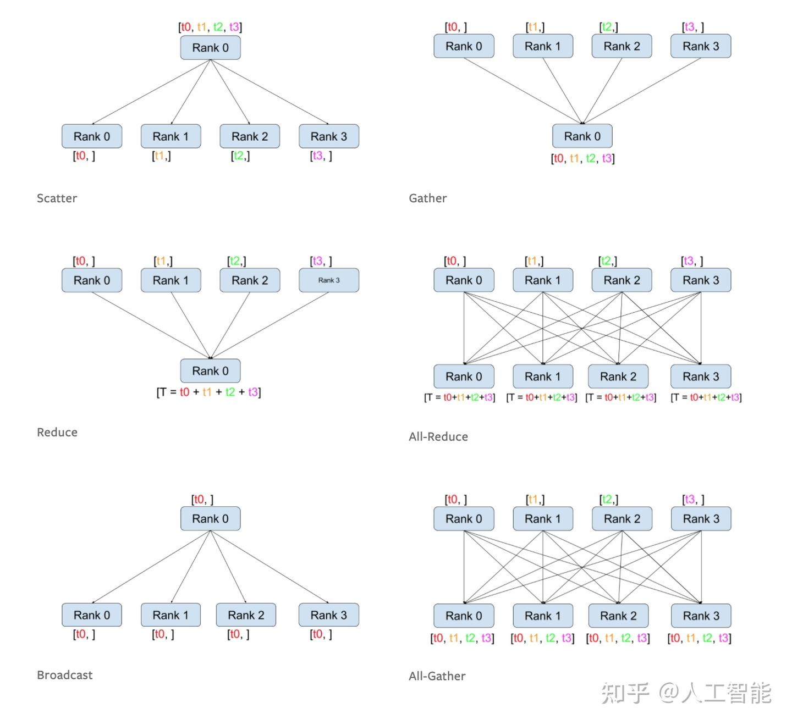
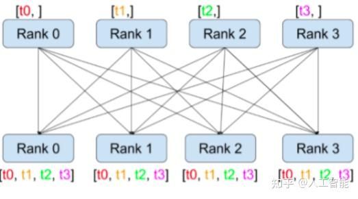
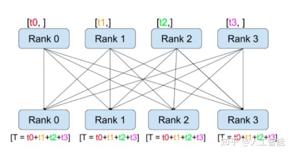

# 彻底搞清楚torch. distributed分布式数据通信all_gather、all_reduce

**Author:** 人工智能

**Date:** 2024-08-04

**Link:** https://zhuanlan.zhihu.com/p/712631827

​

目录

收起

文章简介

all\_gather

函数定义

函数功能

示例

all\_reduce

函数定义

函数功能

示例

## **文章简介**

这篇文章只详细介绍all\_gather和all\_reduce；gather、reduce、scatter方法原理大体相同，具体功能，可以参考下图



## all\_gather

### 函数定义

其中tensor\_list，是list，大小是word\_size，每个元素为了是gather后，保存每个rank的数据，所以初始化一般使用torch.empty；tensor代表各rank中的tensor数据，其中tensor\_list每个分量的维度要与对应的tensor参数中每个rank的维度相同。

API文档链接：[torch.distributed.distributed\_c10d - PyTorch 2.4 documentation](https://link.zhihu.com/?target=https%3A//pytorch.org/docs/stable/_modules/torch/distributed/distributed_c10d.html%23all_gather)

```python
[docs]@_exception_logger
def all_gather(tensor_list, tensor, group=None, async_op=False):
    """
    Gathers tensors from the whole group in a list.

    Complex tensors are supported.

    Args:
        tensor_list (list[Tensor]): Output list. It should contain
            correctly-sized tensors to be used for output of the collective.
        tensor (Tensor): Tensor to be broadcast from current process.
        group (ProcessGroup, optional): The process group to work on. If None,
            the default process group will be used.
        async_op (bool, optional): Whether this op should be an async op

    Returns:
        Async work handle, if async_op is set to True.
        None, if not async_op or if not part of the group
```

### 函数功能

将各个rank的tensor，融合到一起，并且，每个rank都保存了所有的数据，可以参考下图。

  



### 示例

最近在使用NPU，所以就用NPU举例，和GPU的方法是一样的。

**编写如下测试函数：test.py**

```text
import torch
import torch_npu
import os
import torch.distributed as dist
        
def all_gather_func():
    rank = int(os.getenv('LOCAL_RANK'))
    # torch.npu.set_device(rank)
    dist.init_process_group(backend='hccl', init_method='env://') #,world_size=2 rank=rank, world_size=2, 
    
    
    # rank = dist.get_rank()
    torch.npu.set_device(rank)
    word_size = dist.get_world_size()
    
    device="npu:{}".format(rank)
    
    weight = torch.randn((4),device=device)
    gather_list = [torch.empty_like(weight) for i in range(word_size)]

    
    print(f"weight={weight}, rank={rank},world_size={word_size}")

    dist.all_gather(gather_list,weight)
    print(f"after gather={gather_list}")
    
if __name__ == '__main__':
    all_gather_func()
```

**hostfile**

编写文件，文件内容是机器的ip地址，保证机器可以通过ssh连接。

```text
192.168.0.23
192.168.0.24
```

**启动脚本：run.sh**

这里设置了2个node，每个node是3个rank，所以world\_size是2\*3=6

```bash
#!/bin/bash

HOSTFILE=$1
NODEADDR=$(hostname -I | awk -F " " '{print$1}')
NODERANK=$(awk '{ranks[$ 1]=(FNR-1);}END{print ranks["'$NODEADDR'"];}' $HOSTFILE)
NNODES=$(cat $HOSTFILE | wc -l) # 计算机器的数量
NPU_PER_NODE=3 #$(( $(ls -l /dev/ | grep davinci | wc -l) - 1 )) # 计算每个机器的rank数量
MASTERADDR=$(head -n1 $HOSTFILE | awk '{print $1;}')
MASTERPORT=29501

cmd="torchrun --master_addr=$MASTERADDR --master_port=$MASTERPORT --nnodes=$NNODES --node_rank=$NODERANK --nproc_per_node=$NPU_PER_NODE test.py"
echo $cmd
eval $cmd
```

**执行步骤**

分别在两台机器，执行以下步骤，如果node设置为1，则只在单台机器执行则可，最终运行的命令如下注释内容。

```bash
bash run.sh hostfile |tee all_gather
# torchrun --master_addr=192.168.0.23 --master_port=29501 --nnodes=2 --node_rank=0 --nproc_per_node=2 test.py
```

**执行结果**

192.168.0.23

```text
weight=tensor([-0.4507, -0.8248,  0.4962, -1.8013], device='npu:1'), rank=1,world_size=6
weight=tensor([ 0.1697,  1.1252,  1.9084, -0.1981], device='npu:0'), rank=0,world_size=6
weight=tensor([-0.3324, -0.7647,  0.4681,  1.1544], device='npu:2'), rank=2,world_size=6
after gather=[tensor([ 0.1697,  1.1252,  1.9084, -0.1981], device='npu:2'), tensor([-0.4507, -0.8248,  0.4962, -1.8013], device='npu:2'), tensor([-0.3324, -0.7647,  0.4681,  1.1544], device='npu:2'), tensor([-1.3327,  0.3076, -1.0683, -1.4375], device='npu:2'), tensor([-0.9139,  0.4885,  0.1722, -0.1989], device='npu:2'), tensor([ 0.5774,  1.4462,  0.1082, -1.3113], device='npu:2')]
after gather=[tensor([ 0.1697,  1.1252,  1.9084, -0.1981], device='npu:1'), tensor([-0.4507, -0.8248,  0.4962, -1.8013], device='npu:1'), tensor([-0.3324, -0.7647,  0.4681,  1.1544], device='npu:1'), tensor([-1.3327,  0.3076, -1.0683, -1.4375], device='npu:1'), tensor([-0.9139,  0.4885,  0.1722, -0.1989], device='npu:1'), tensor([ 0.5774,  1.4462,  0.1082, -1.3113], device='npu:1')]
after gather=[tensor([ 0.1697,  1.1252,  1.9084, -0.1981], device='npu:0'), tensor([-0.4507, -0.8248,  0.4962, -1.8013], device='npu:0'), tensor([-0.3324, -0.7647,  0.4681,  1.1544], device='npu:0'), tensor([-1.3327,  0.3076, -1.0683, -1.4375], device='npu:0'), tensor([-0.9139,  0.4885,  0.1722, -0.1989], device='npu:0'), tensor([ 0.5774,  1.4462,  0.1082, -1.3113], device='npu:0')]
```

192.168.0.24

```text
weight=tensor([-0.9139,  0.4885,  0.1722, -0.1989], device='npu:1'), rank=1,world_size=6
weight=tensor([ 0.5774,  1.4462,  0.1082, -1.3113], device='npu:2'), rank=2,world_size=6
weight=tensor([-1.3327,  0.3076, -1.0683, -1.4375], device='npu:0'), rank=0,world_size=6
after gather=[tensor([ 0.1697,  1.1252,  1.9084, -0.1981], device='npu:0'), tensor([-0.4507, -0.8248,  0.4962, -1.8013], device='npu:0'), tensor([-0.3324, -0.7647,  0.4681,  1.1544], device='npu:0'), tensor([-1.3327,  0.3076, -1.0683, -1.4375], device='npu:0'), tensor([-0.9139,  0.4885,  0.1722, -0.1989], device='npu:0'), tensor([ 0.5774,  1.4462,  0.1082, -1.3113], device='npu:0')]
after gather=[tensor([ 0.1697,  1.1252,  1.9084, -0.1981], device='npu:2'), tensor([-0.4507, -0.8248,  0.4962, -1.8013], device='npu:2'), tensor([-0.3324, -0.7647,  0.4681,  1.1544], device='npu:2'), tensor([-1.3327,  0.3076, -1.0683, -1.4375], device='npu:2'), tensor([-0.9139,  0.4885,  0.1722, -0.1989], device='npu:2'), tensor([ 0.5774,  1.4462,  0.1082, -1.3113], device='npu:2')]
after gather=[tensor([ 0.1697,  1.1252,  1.9084, -0.1981], device='npu:1'), tensor([-0.4507, -0.8248,  0.4962, -1.8013], device='npu:1'), tensor([-0.3324, -0.7647,  0.4681,  1.1544], device='npu:1'), tensor([-1.3327,  0.3076, -1.0683, -1.4375], device='npu:1'), tensor([-0.9139,  0.4885,  0.1722, -0.1989], device='npu:1'), tensor([ 0.5774,  1.4462,  0.1082, -1.3113], device='npu:1')]
```

## all\_reduce

### 函数定义

tensor代表各rank中的tensor数据，op代表可以选择的操作，主要有:`SUM、PRODUCT、MIN`,`MAX、BAND、BOR、BXOR`、`PREMUL_SUM`.

API文档链接：[torch.distributed.distributed\_c10d - PyTorch 2.4 documentation](https://link.zhihu.com/?target=https%3A//pytorch.org/docs/stable/_modules/torch/distributed/distributed_c10d.html%23all_reduce)

```python
[docs]@_exception_logger
def all_reduce(tensor, op=ReduceOp.SUM, group=None, async_op=False):
    """
    Reduces the tensor data across all machines in a way that all get the final result.

    After the call ``tensor`` is going to be bitwise identical in all processes.

    Complex tensors are supported.

    Args:
        tensor (Tensor): Input and output of the collective. The function
            operates in-place.
        op (optional): One of the values from
            ``torch.distributed.ReduceOp``
            enum.  Specifies an operation used for element-wise reductions.
        group (ProcessGroup, optional): The process group to work on. If None,
            the default process group will be used.
        async_op (bool, optional): Whether this op should be an async op

    Returns:
        Async work handle, if async_op is set to True.
        None, if not async_op or if not part of the group
```

### 函数功能

将各个rank的tensor，求和，同时每个rank都保存了所有的数据，可以参考下图。



### 示例

最近在使用NPU，所以就用NPU举例，和GPU的方法是一样的。

**编写如下测试函数：test.py**

```text
import torch
import torch_npu
import os
import torch.distributed as dist
        
def all_reduce_func():
    # rank = int(os.getenv('LOCAL_RANK'))
    
    dist.init_process_group(backend='hccl', init_method='env://') #,world_size=2 rank=rank, world_size=2, 
    rank = dist.get_rank()
    torch.npu.set_device(rank)
    
    # device="npu:{}".format(rank)
    tensor = torch.tensor([2,3]).npu()+rank*2
    print("initial tensor={}, rank={}".format(tensor, rank))
    torch.distributed.all_reduce(tensor)
    print("after all_reduce tensor={}, rank={}".format(tensor, rank))
    
    
if __name__ == '__main__':
    all_reduce_func()
```

**hostfile**

编写文件，文件内容是机器的ip地址，保证机器可以通过ssh连接。

```text
192.168.0.23
192.168.0.24
```

**启动脚本：run.sh**

这里设置了2个node，每个node是3个rank，所以world\_size是2\*3=6

```bash
#!/bin/bash

HOSTFILE=$1
NODEADDR=$(hostname -I | awk -F " " '{print$1}')
NODERANK=$(awk '{ranks[$ 1]=(FNR-1);}END{print ranks["'$NODEADDR'"];}' $HOSTFILE)
NNODES=$(cat $HOSTFILE | wc -l) # 计算机器的数量
NPU_PER_NODE=3 #$(( $(ls -l /dev/ | grep davinci | wc -l) - 1 )) # 计算每个机器的rank数量
MASTERADDR=$(head -n1 $HOSTFILE | awk '{print $1;}')
MASTERPORT=29501

cmd="torchrun --master_addr=$MASTERADDR --master_port=$MASTERPORT --nnodes=$NNODES --node_rank=$NODERANK --nproc_per_node=$NPU_PER_NODE test.py"
echo $cmd
eval $cmd

```

**执行步骤**

分别在两台机器，执行以下步骤，如果node设置为1，则只在单台机器执行则可，最终运行的命令如下注释内容。

```bash
bash run.sh hostfile |tee all_gather
# torchrun --master_addr=192.168.0.23 --master_port=29501 --nnodes=2 --node_rank=0 --nproc_per_node=2 test.py
```

**执行结果**

通过结果可以发现，最终各rank的输出tensor，就是所有的rank上的tensor求和。

192.168.0.23

```bash
initial tensor=tensor([6, 7], device='npu:2'), rank=2
initial tensor=tensor([4, 5], device='npu:1'), rank=1
initial tensor=tensor([2, 3], device='npu:0'), rank=0
after all_reduce tensor=tensor([42, 48], device='npu:0'), rank=0
after all_reduce tensor=tensor([42, 48], device='npu:2'), rank=2
after all_reduce tensor=tensor([42, 48], device='npu:1'), rank=1
```

192.168.0.24

```bash
initial tensor=tensor([8, 9], device='npu:3'), rank=3
initial tensor=tensor([12, 13], device='npu:5'), rank=5
initial tensor=tensor([10, 11], device='npu:4'), rank=4
after all_reduce tensor=tensor([42, 48], device='npu:3'), rank=3
after all_reduce tensor=tensor([42, 48], device='npu:4'), rank=4
after all_reduce tensor=tensor([42, 48], device='npu:5'), rank=5
```