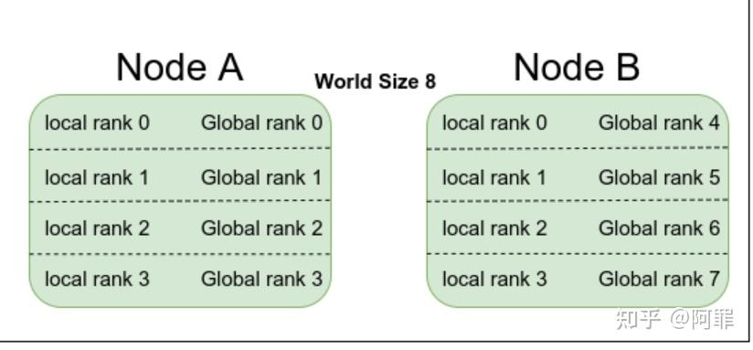
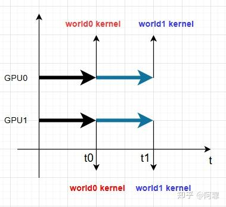
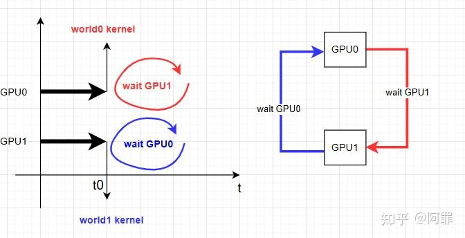

# NCCL浅谈之简介

**Author:** 阿罪

**Date:** 2024-11-19

**Link:** https://zhuanlan.zhihu.com/p/5795780627

​

目录

收起

1\. NCCL简介

2\. NCCL概念

3\. NCCL通信算法和协议

4\. NCCL 环境变量

## 1\. NCCL简介

NCCL官方文档[NVIDIA Collective Communication Library (NCCL) Documentation](https://link.zhihu.com/?target=https%3A//docs.nvidia.com/deeplearning/nccl/user-guide/docs/index.html)

NVIDIA 集体通信库（NCCL，发音为“Nickel”）是一个提供 GPU 间通信原语的库，可用于**多机多卡**进行GPU间的通信，支持了以下**collective communication** 原语，包含AllReduce、[Broadcast](https://zhida.zhihu.com/search?content_id=250181677&content_type=Article&match_order=1&q=Broadcast&zhida_source=entity)、Reduce、[AllGather](https://zhida.zhihu.com/search?content_id=250181677&content_type=Article&match_order=1&q=AllGather&zhida_source=entity)、[ReduceScatter](https://zhida.zhihu.com/search?content_id=250181677&content_type=Article&match_order=1&q=ReduceScatter&zhida_source=entity)。另外提供了**point-to-point send/receive communication**原语，进而通过send/recv去支持scatter, gather, or all-to-all 的操作。

NCCL支持不同的互联协议，包括[PCIe](https://zhida.zhihu.com/search?content_id=250181677&content_type=Article&match_order=1&q=PCIe&zhida_source=entity)，[NVLINK](https://zhida.zhihu.com/search?content_id=250181677&content_type=Article&match_order=1&q=NVLINK&zhida_source=entity)，[InfiniBand Verbs](https://zhida.zhihu.com/search?content_id=250181677&content_type=Article&match_order=1&q=InfiniBand+Verbs&zhida_source=entity), and [IP sockets](https://zhida.zhihu.com/search?content_id=250181677&content_type=Article&match_order=1&q=IP+sockets&zhida_source=entity)，另外NCCL可以兼容不同topology的机器，自动寻找最优的通信方案（P.S. 当然也会有不是最优的时候，因此NCCL提供了丰富的环境变量可进行调优）

## 2\. NCCL概念

**两个概念**：nccl Communicator和rank

**rank** : 下图是两台机器对应的locakrank、rank、node、world概念，node ：机器; rank : 一个通信组的编号；localRank：一个node内的编号。(P.S. 其实node在NCCL中未必对应一个真正的machine node，这里我们当成一个machine node即可)；world：参与通信的一组rank。

world、localrank、rank

**nccl Comm** : nccl的handle，每个nccl Communicator绑定一个cuda device，都会有自己在一个world域内的rank编号；创建nccl comm后，就能使用这个nccl comm去执行nccl的操作了。

**三种使用方式**：单进程控制多卡、多线程控制多卡、多进程控制多卡，其中多进程控制多卡的方式应该最为普遍，也最好理解，甚至最“近似”MPI通信。

NCCL api与[cuda stream](https://zhida.zhihu.com/search?content_id=250181677&content_type=Article&match_order=1&q=cuda+stream&zhida_source=entity) ：调用NCCL api时需要传递一个cuda stream（毕竟NCCL需要launch一个kernel，必然需要一个cuda stream参数）

**一个特殊的问题**需要关注下：

NCCL是多组GPU同时做通信的，NCCL的kernel是block的，也就是会存在GPUa去wait GPUb数据到来的情况。**注意一种特殊情况：Using multiple NCCL communicators concurrently，资源不够的情况下是会导致dead lock的。**[Creating a Communicator](https://link.zhihu.com/?target=https%3A//docs.nvidia.com/deeplearning/nccl/user-guide/docs/usage/communicators.html%23using-multiple-nccl-communicators-concurrently)

解释下，假设我们有两个GPU参与通信，同时一个GPU的资源只能同时launch一个kernel（当然视kernel占用资源的情况，实际上GPU是支持多个kernel并行的）。这时候我们做如下操作：

1.  启动了开启了两组nccl通信world0和world1，分别绑定到两组stream上；
2.  这两组world同时去做nccl通信

可能出现几种顺序

顺序1如下：GPU0 先launch了world0的kernel，再launch world1的kernel；同理GPU1也一样。那么能正常work。会先进行world0的通信操作，再执行通信1的操作。

顺序1，正常work

顺序2如下：

GPU0 先launch了world0的kernel，wait GPU1的world0的kernel

GPU1先launch了world1的kernel，wait GPU0的worl1的kernel

形成死锁

顺序2，deadlock

这种情况在pytorch doc中关于torch.distributed.new\_group中特别指出，如果需要安全的并发执行，一定需要保证多组通信的launch kernel的顺序才能避免死锁。

nccl issue的相关讨论：[https://github.com/NVIDIA/nccl/issues/217](https://link.zhihu.com/?target=https%3A//github.com/NVIDIA/nccl/issues/217)

## 3\. NCCL通信算法和协议

NCCL提供了不同的Algo和不同的通信proto。然后两两组合（并不是所有的两两组合都实现了）组成了NCCL通信的基础。

Algo：Tree,Ring,CollnetDirect,CollnetChain,NVLS,NVLSTree；Ring是最基础的算法、Tree也是早期NCCL实现多机通信的基础算法；Collnet相关的需要相应的插件（[GitHub - Mellanox/nccl-rdma-sharp-plugins: RDMA and SHARP plugins for nccl library](https://link.zhihu.com/?target=https%3A//github.com/Mellanox/nccl-rdma-sharp-plugins)），主要是多机间利用IB NIC + IB Switch SARHP的实现；NVLS相关需要NVSwitch（插在主板的芯片）或者NVlink Switch（交换机）。

SHARP：就是在固定硬件上实现all\_reduce等操作的一种实现方式，比如Mellanox的switch；nvswitch

Proto： Simple、LL、LL128；不同的proto能提供不同的通信带宽，其中Simple能提供100%的理论带宽，LL能提供50%的通信带宽，LL128能提供93.75%的通信带宽。一般来说更在乎latency的会选择LL，更在乎带宽的会选择Simple，至于LL128,可能只在特定的硬件架构上能支持，用到的情况可能不是很多。关于proto的解释可见[What is LL128 Protocol? · Issue #281 · NVIDIA/nccl](https://link.zhihu.com/?target=https%3A//github.com/NVIDIA/nccl/issues/281)

实际上NCCL会选择什么Algo + proto的组合是NCCL自己来决定的，当然我们也可以通过NCCL\_ALGO 和 NCCL\_PROTO来指定。

## 4\. NCCL 环境变量

NCCL是解决多机多卡之间的通信问题，对于bug或者性能调优都不是件容易事，因为不同的机器有不同的topo结构，因此NCCL提供了很多环境变量用来debug和调优。