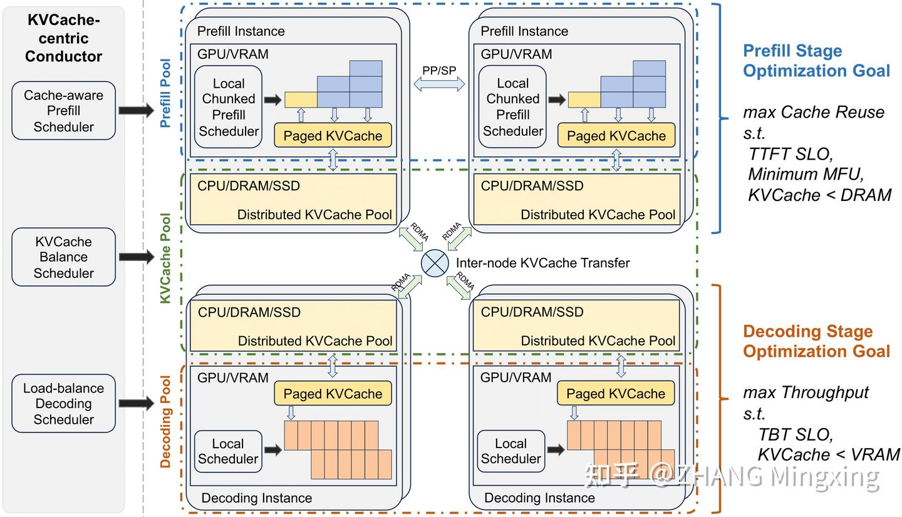

# Mooncake (1): 在月之暗面做月饼，Kimi 以 KVCache 为中心的分离式推理架构

**Author:** ZHANG Mingxing

**Date:** 2024-11-27

**Link:** https://zhuanlan.zhihu.com/p/705754254

> 作者：详细论文，作者列表，和本文中相关概念的引用见 [https://github.com/kvcache-ai/Mooncake](https://link.zhihu.com/?target=https%3A//github.com/kvcache-ai/Mooncake)

  
**Disclaimer：**和论文不同本文夹带过量私货个人观点，不代表本人单位更不代表 Moonshot，纯技术讨论。

## TL;DR

Mooncake 是由月之暗面创建的超人气智能助手 [Kimi](https://link.zhihu.com/?target=https%3A//kimi.ai/)的底层推理平台。

本系列则是对应[技术报告](https://link.zhihu.com/?target=https%3A//github.com/kvcache-ai/Mooncake)的<del/>插科打诨</del>浓缩版介绍。和强调 inclusion 四平八稳啥都讲一点的论文格式不同，这里更多的是想讨论一些当前还未形成共识的一些 design choice （私货警告）。特别的本篇主要讨论 Mooncake 的分离式架构，讨论点包括但不限于 [TBT](https://zhida.zhihu.com/search?content_id=244965348&content_type=Article&match_order=1&q=TBT&zhida_source=entity) or [TPOT](https://zhida.zhihu.com/search?content_id=244965348&content_type=Article&match_order=1&q=TPOT&zhida_source=entity)，Prefill 节点应不应当独立存在以及独立的话如何多节点并行处理，[KVCache](https://zhida.zhihu.com/search?content_id=244965348&content_type=Article&match_order=1&q=KVCache&zhida_source=entity) cache 全局调度的原理和调度策略，Decode 还能不能进一步分离等等。

后文传送门：

[关于 Mooncake 的碎碎念](https://zhuanlan.zhihu.com/p/705910725)

[Mooncake (2)：Kimi “泼天的流量”怎么接，分离架构下基于预测的调度策略](https://zhuanlan.zhihu.com/p/706204757)

[Mooncake (3): 开源数据集！以及一些感谢和碎碎念](https://zhuanlan.zhihu.com/p/707997501)

[Mooncake (4): 月饼的皮和馅是怎样制成的，Mooncake 传输引擎开源以及后续的计划](https://zhuanlan.zhihu.com/p/9461861451)

## 总体架构

Mooncake 的架构是非常典型的**分离式架构**，将单个同构 GPU 集群的资源打散并重新组织成三个可以独立弹性伸缩的资源池。其中 [Prefill Pool](https://zhida.zhihu.com/search?content_id=244965348&content_type=Article&match_order=1&q=Prefill+Pool&zhida_source=entity) 处理用户输入，主要对 Time To First Token (TTFT) 负责。同时因为 Prefill 相对计算密集，这一部分也承担着抬高整体资源利用率的任务。Prefill 处理完之后对应的 KVCache 会被送到 [Decode Pool](https://zhida.zhihu.com/search?content_id=244965348&content_type=Article&match_order=1&q=Decode+Pool&zhida_source=entity) 进行 autoregression 式的流式输出。虽然我们希望尽可能攒大的 batch 以提升 MFU，但这一部分主要需要对 Time Between Tokens (TBT) 负责。

  

Mooncake 架构

  

这里我们使用 TBT 而非另外一些工作中常用的 Time Per Output Token (TPOT) 的原因在于虽然其实本来这两者应该等价，但实际计算 TPOT 的时候经常会被简单地等价成计算 average TPOT。然后就直接用了吞吐的倒数或者说总生成时间除以总生成 token 数。TBT 的定义则更加明确的指定为两个 token 生成间的延迟，因此基于 TBT 上限设计 [Service Level Objective](https://zhida.zhihu.com/search?content_id=244965348&content_type=Article&match_order=1&q=Service+Level+Objective&zhida_source=entity) (SLO) 能更好的反映流式交互时的用户体验。直观的理解的话大家可以想象如果 GPT-4o 的语音回复是说一句停顿一段时间再说一句的说话方式的话，即便 average TPOT 能小一些体验还是不够好。

在 Prefill/Decode 之外我们还利用每台 [HGX 机器](https://zhida.zhihu.com/search?content_id=244965348&content_type=Article&match_order=1&q=HGX+%E6%9C%BA%E5%99%A8&zhida_source=entity)上组成了一个 KVCache Pool 来进行全局的 [Prefix Cache](https://zhida.zhihu.com/search?content_id=244965348&content_type=Article&match_order=1&q=Prefix+Cache&zhida_source=entity)。相比 [vLLM](https://zhida.zhihu.com/search?content_id=244965348&content_type=Article&match_order=1&q=vLLM&zhida_source=entity) 当前单机的 Prefix Cache 通过全局的调度能够大幅度提升复用率从而提升总吞吐。由此带来了一系列如何调度，分配，复制 KVCache 的问题，而且必须和 Prefill/Decode 的调度 co-design，因此我们把 Mooncake 的架构称之为以 KVCache 为中心。

  
在此基础上接下来我们分别讨论 Prefill/KVCache/Decode Pool 的关键 design choice。

## Prefill Pool

论文这一章我原本起了个“Prefill: To Separate or Not. Is it a Question?” 的名字。主要原因在于由于 [Chunked Prefill](https://zhida.zhihu.com/search?content_id=244965348&content_type=Article&match_order=1&q=Chunked+Prefill&zhida_source=entity) 的提出实际上 Prefill 和 Decode 节点的边界已经模糊了起来。不过除非是特别短的 prompt （可以直接一次性加入到 decode 的 continues batch 里提升 MFU 但不违反 TBT SLO 的那种）不然我们还是倾向于使用独立的 Prefill 节点。原因主要是两方面。

  
首先我们定义了一个 VRAM occupation cost 的概念，即 KVCache 大小乘以其在显存中留驻的时间。使用 chunked prefill 的话由于每个 chunk 还需要和其他 decode request batch 在一起处理因此是显著增加了对应 KVCache 在显存中留驻的时间的，因此等效的降低了宝贵显存空间的利用率。当然显存空出来了有没有地方用就是另外一个问题了。这里我们在论文 4.2 节中主要讨论了和未来 batch job 结合的可能性。

  
另外更重要的一个原因则主要是在于长文本场景下我们需要在 Prefill 集群中使用特殊的多节点分布式划分方法来压低 TTFT。这里我们讨论了相比现在被讨论的更多的 SP 策略直接使用 Chunked PP 策略在调度和减少通讯量方面的优越性，前者大幅度简化架构，后者则能够省出宝贵的传输带宽来搬运 KVCache。具体策略其实就是 [TeraPipe](https://zhida.zhihu.com/search?content_id=244965348&content_type=Article&match_order=1&q=TeraPipe&zhida_source=entity) 的推理简化版本，因为只有 forward 没有 backword 的话不需要啥动态规划来平衡每个 Chunk 的计算量，只要给每个 Chunk 设置一个最小的值就行。

##   
KVCache Pool

都 2024.6 了单节点的 Prefix Cache 已经不是什么新鲜东西了。这里主要讨论一下全局调度能够成立的底层原因：对于每 X byte 的 KVCache，其生成所需的算力正比于 X\*hd 再乘以一个较大的常数，这里 hd 对应模型的 hidden dimension。因此只要每卡算力比如 A100 的 220TFLOPS 和每卡通讯带宽比如 CX7 的 100Gbps 的比值小于 hd 乘以这个常数，那么从远端传输 KVCache 相比原地重算不仅仅减少了计算量还减少了 TTFT。又省钱用户体验还更好了自然是何乐而不为。

  
但是上述公式中具体的 hd，常数是和模型结构强相关的所以不是说一定可以，只能说原则上比较大的模型应该都行。另外虽然网卡有 100Gbps，但是如果因为比如 KVCache 下沉到慢速存储上去了，网络拥挤了之类的原因跑不到这么高那么自然也就不一定成立。所以还是需要以 KVCache 为中心针对不同请求的 TTFT SLO 分别去调度。  
在论文的 5.2 节中我们主要是提供了一种简单的基于 heuristic 的热点识别和复制方法。倒不是说有多么精妙，但重点是简单好实现，不用特别去预测未来的 KVCache 使用模式，而且在实际的使用中效果不错的方案。未来会尝试更多的调度算法不过这个可以作为一个 strong baseline 来使用。

  
顺带这里感慨一句，目前标准的 8 卡 HGX 服务器每台会配 9~10 张 100Gbps 乃至 200Gbps 的 RDMA 网卡，至少 2TB 的内存和一大堆的高速 SSD。假设一千台的话就是近万张网卡互连起来的数 PB 共享内存池。做 Disaggregated Memory 挺久了第一次见这样的富裕仗。可惜作为一个 bandwidth bound 场景在架构上能设计的东西没那么多特殊的<del/>奇淫</del>技巧可用，更多还是工程实现。

##   
Decode Pool

Decode Pool 本身业界的实践是最多的。特别是开源有极快速地在迭代的 vLLM，该有的不是已经有了也是在 roadmap 里。这里主要是夹带一下 future work 中讨论的增加面向大容量大带宽设计的高性价比设备，形成异构集群的私货。从去年开始就断断续续和很多人讨论这个话题，虽然听闻了很多的风声，不过实际正用上的设备目测还得有个两年。而且硬件毕竟迭代慢，出来了算法变了（比如 MLA）或者被老黄的大力出奇迹创飞了就很尴尬。

  
不过实际上我们<del/>几个月前就挂出但没多少人看</del>的[另一篇论文](https://link.zhihu.com/?target=https%3A//arxiv.org/abs/2405.01814)也提到，其实不需要等新的硬件，只要组合基于 GDDR 的设备其实就能将 Decode 部分进一步拆分成 attention 算子和 Linear 算子两个池子从而进一步提升整体性能。不过目前云上的 GDDR 设备一般不会和旗舰显卡集群放在一起，而且为了节省成本只会配很差的 CPU 和网卡，所以想要实际部署这一套方案还有很多挑战。而且当前设备毕竟不是专门为这个场景设计的，attention offload 策略性价比的提升的潜力没有办法充分发挥出来，为此进一步将架构复杂化而且增大一定的 TBT 不一定很合适。所以归根结底还是得看看有没有硬件厂商愿意赌一把了。

## 其它

恭喜若愚今天正式以优秀毕业生的身份毕业，本科就这么厉害博士记得带我起飞~