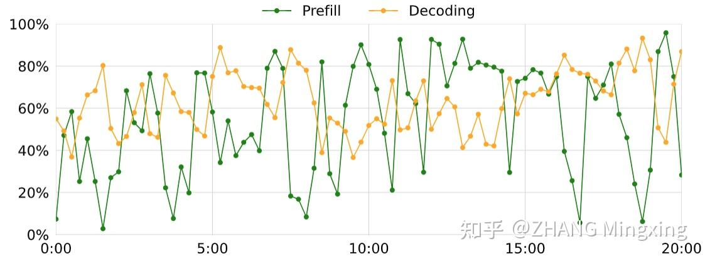
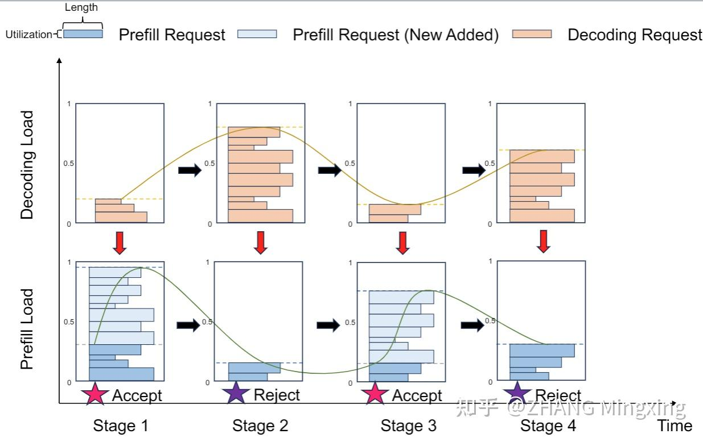
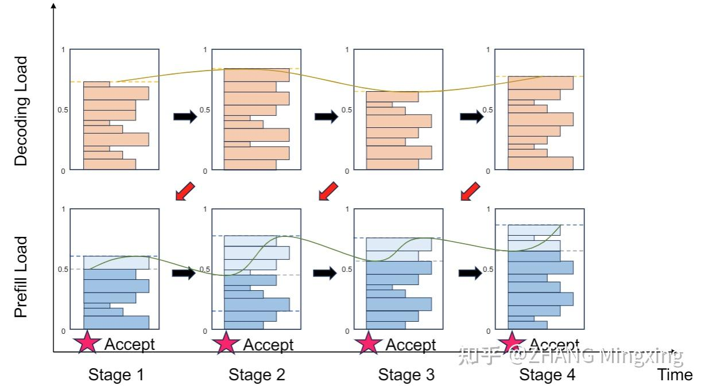

# Mooncake (2)：Kimi “泼天的流量”怎么接，分离架构下基于预测的调度策略

**Author:** ZHANG Mingxing

**Date:** 2024-11-27

**Link:** https://zhuanlan.zhihu.com/p/706204757

> 作者：详细论文，作者列表，和本文中相关概念的引用见 [https://github.com/kvcache-ai/Mooncake](https://link.zhihu.com/?target=https%3A//github.com/kvcache-ai/Mooncake)

**Disclaimer：**和论文不同本文夹带过量私货和个人观点，不代表本人单位更不代表 Moonshot，纯技术讨论。

## **TL;DR**

正如 [@许欣然](https://www.zhihu.com/people/ultimategeeker) 所说，本文公开的目的之一就是推动硬件厂商和云厂商向前篇提到的分离式，乃至未来异构分离的方向演化。作为我**个人已知范围内**承载了最大规模在线流量的分离式推理系统，Mooncake 也积攒了一些独特的实践经验。下篇这里主要是想要讨论其中非常关键的一项： Kimi 在承接急速增长的需求时，面向过载（Overload-oriented）场景的调度策略。

前后文传送门：

[关于 Mooncake 的碎碎念](https://zhuanlan.zhihu.com/p/705910725)

[Mooncake (1): 在月之暗面做月饼，Kimi 以 KVCache 为中心的分离式推理架构](https://zhuanlan.zhihu.com/p/705754254)

[Mooncake (3): 开源数据集！以及一些感谢和碎碎念](https://zhuanlan.zhihu.com/p/707997501)

[Mooncake (4): 月饼的皮和馅是怎样制成的，Mooncake 传输引擎开源以及后续的计划](https://zhuanlan.zhihu.com/p/9461861451)

## **Kimi 也会累**

和一般按照峰值容量规划，调度主要解决如何尽可能利用闲置资源的传统工作不同，Kimi 自从破圈之后面临的是完全不同的，如何在不断扩容还天天过载的情况下尽可能保障用户体验的问题。虽然是一个非常凡尔赛的甜蜜烦恼，同时 infra 也已经在最大程度避免，但在高峰期不可避免地还是需要偶尔向大家喊累。

这里主要是我们发现由于当前的负载情况已经无法按照 [SLO](https://zhida.zhihu.com/search?content_id=245065405&content_type=Article&match_order=1&q=SLO&zhida_source=entity) 提供响应，所以与其提供一个完全无保障的长时间排队（违反 [TTFT](https://zhida.zhihu.com/search?content_id=245065405&content_type=Article&match_order=1&q=TTFT&zhida_source=entity) SLO）或者一字一顿的慢速回答（违反 [TBT](https://zhida.zhihu.com/search?content_id=245065405&content_type=Article&match_order=1&q=TBT&zhida_source=entity) SLO）这样极大伤害体验的服务，不如先暂停一小部分服务。至于为什么是喊累而不是显示 429 Too Many Requests，当然是因为 Kimi 是大家的智能\*伙伴\*，伙伴累了要休息一下希望大家可以体谅。

## **分离式架构在过载场景下的挑战**

也正是在这样的环境下正式上线了 Mooncake。虽然 Mooncake 大幅提升了 Kimi 能够承载的总吞吐，但 [Prefill](https://zhida.zhihu.com/search?content_id=245065405&content_type=Article&match_order=1&q=Prefill&zhida_source=entity) 和 [Decode](https://zhida.zhihu.com/search?content_id=245065405&content_type=Article&match_order=1&q=Decode&zhida_source=entity) 分离的架构在过载调度上也的确引入了一些新的挑战。这里最重要的问题就是 Prefill 和 Decode 是分别对 TTFT 和 TBT 负责的，而且**有一个关键的时间差**。所以在坏的情况下 Prefill 前调度器觉得可以同时满足 TTFT 和 TBT，但是 Prefill 后由于 Decode 集群的过载 TBT 无法满足了。这样就进入了一个是违反 SLO 还是浪费已经花费了的 Prefill 资源的两难问题。

为了解决上述问题，一个自然的，也是被 Mooncake 采用的解决方案就是同时综合 Prefill 和 Decode 两个集群的情况，然后以两者中更高负载更危险的那个集群为去判定是否可以接受服务。由于会因为在 Prefill 集群有空闲的情况下由于未来 Decode 集群的负载问题提前拒绝一些服务，这样的策略被我们称之为 Early Reject。

看起来很直接，但实际部署之后我们观测到集群负载出现了奇怪的颠簸现象。可以看到 Prefill 和 Decode 集群的负载就和跷跷板一样一边上去一边下来，然后交替。

仔细分析之后发现的原因下图有一个很直观的展示。由于 Prefill 和 Decode 集群负载之间的时间差，如果简单的参考当前 Decode 集群负载去拒绝请求的话会导致 Decode 集群负载被消化的时候 Prefill 没有及时跟上，由此产生了跷跷板效应。

## **基于预测的调度**

为了解决上述的问题，我们进一步设计和上线了基于预测的调度策略。原理也很直观，能够预测未来（特别是新加入的请求完成 Prefill 阶段的时刻）Decode 集群负载的话自然就可以打消时间差的问题平滑整个系统的负载。

具体来说，对于未来的某个时刻 t，首先我们将现有的 Prefill 集群中 t 时已完成的请求加入 Decode 集群，这一点可以通过预测 Prefill 时间和排队时间来实现。然后，我们假设每个请求的 decode 时刻均为 t\_d，将 Decode 集群中 t 时已结束（即decode 时间超过 t\_d）的请求移除。这一步我们也在尝试通过预测每个请求实际会输出的 token 数做一个更精确的预测。最后，我们利用事先拟合的模型根据 Decode 集群中 t 时仍在处理的请求预测 TBT，作为 Decode 集群的预测负载并根据这个数据决定是否需要 Early Reject。

## **未来：调度会越来越复杂，也会越来越重要**

从目前的趋势来看，未来 LLM Serving 的负载会愈发的复杂和多元化。原本同等地位的请求会在厂商和用户的驱动下基于多种多样的诉求进一步分化。比如有些批处理请求可以完全不考虑 TTFT/TBT 仅仅需要保障 Job Completion Time ([JCT](https://zhida.zhihu.com/search?content_id=245065405&content_type=Article&match_order=1&q=JCT&zhida_source=entity)) SLO，有些高级/付费用户无疑需要保证更加可靠和更高的 SLO。另外外部基于 Agent 的任务也不仅仅看单个 request，而是看整个 Workflow 的综合 SLO，加上 Code Executor 等外部环境的交互后也会进一步复杂化整个系统。

在这些领域上我们也是刚刚起步，探索了一些，但是需要研究的更多，也希望借此机会和大家更多的探讨这一部分未来可能的优化空间。