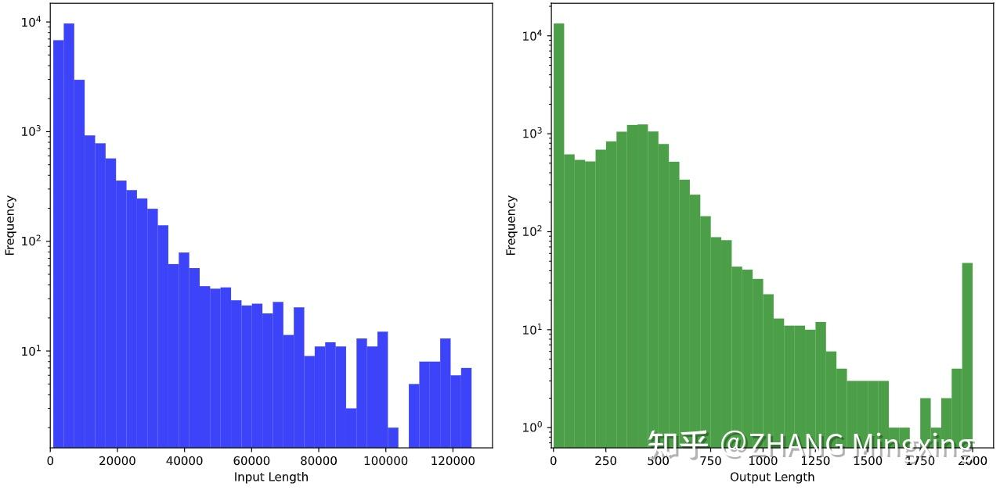
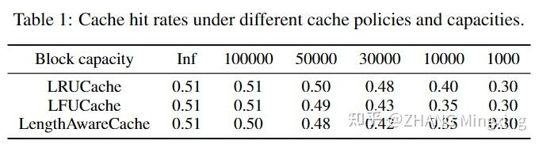

# Mooncake (3): 开源数据集！以及一些感谢和碎碎念

**Author:** ZHANG Mingxing

**Date:** 2024-11-27

**Link:** https://zhuanlan.zhihu.com/p/707997501

> 作者：详细论文，作者列表，和本文中相关概念的引用见 [https://github.com/kvcache-ai/Mooncake](https://link.zhihu.com/?target=https%3A//github.com/kvcache-ai/Mooncake)

**Disclaimer：**和论文不同本文夹带过量私货和个人观点，不代表本人单位更不代表 Moonshot，纯技术讨论。

## TL;DR

在经过讨论<del/>和与拖延症的搏斗</del>之后我们完成了公开数据集的整理。其中首次公开了以 512 token 为 block 的 [block hash](https://zhida.zhihu.com/search?content_id=245464521&content_type=Article&match_order=1&q=block+hash&zhida_source=entity)，可以用于后续 KVCache 复用的研究。具体地址在 github [https://github.com/kvcache-ai/Mooncake](https://link.zhihu.com/?target=https%3A//github.com/kvcache-ai/Mooncake)

  

前后文传送门：

[关于 Mooncake 的碎碎念](https://zhuanlan.zhihu.com/p/705910725)

[Mooncake (1): 在月之暗面做月饼，Kimi 以 KVCache 为中心的分离式推理架构](https://zhuanlan.zhihu.com/p/705754254)

[Mooncake (2)：Kimi “泼天的流量”怎么接，分离架构下基于预测的调度策略](https://zhuanlan.zhihu.com/p/706204757)

[Mooncake (4): 月饼的皮和馅是怎样制成的，Mooncake 传输引擎开源以及后续的计划](https://zhuanlan.zhihu.com/p/9461861451)

## 开源数据集

```json
{
    "timestamp": 27482,
    "input_length": 6955,
    "output_length": 52,
    "hash_ids": [46, 47, 48, 49, 50, 51, 52, 53, 54, 55, 56, 57, 2353, 2354]
}
{
    "timestamp": 30535,
    "input_length": 6472,
    "output_length": 26,
    "hash_ids": [46, 47, 48, 49, 50, 51, 52, 53, 54, 55, 56, 57, 2366]
}
```

以上就是我们公开数据集的两个样例。可以看到除了类似 splitwise 公开的时间戳和输入输出长度，本次额外公开了数据 block 的 hash。其中每一个 block 以 512 为粒度，给出的 hash\_id 是其自己和前继所有 token 的 hash 值再 remap 之后的结果，因此也不存在泄露客户隐私的问题。希望后续其他厂商公开 [trace](https://zhida.zhihu.com/search?content_id=245464521&content_type=Article&match_order=1&q=trace&zhida_source=entity) 的时候也能包含这一部分数据以便 KVCache 复用的研究。



输入输出分布

具体的格式介绍我们在 arxiv 上更新了一版论文 v3，可以详见论文第四章，其中也包含一些简单的数据统计分析。比如上图所示的 trace 中 input 和 output 的 token 数量分布统计。可以看到 Mooncake 承接的是典型的长输入短输出场景，因此如果当前业务不符合这个分布的话 Mooncake 论文中提到的结论不一定适用。



缓存命中率分析

我们还分析了一下不同大小的 KVCache Pool 和缓存替换策略对最终命中率的影响，可以看到在这个数据集上理论极限是 50% 左右的命中率。  
另外 trace 是某个集群某一小时的所有数据中通过某种均衡但**不公开具体参数**的 sample 算法采样出来的，所以大家也不用费劲去从 trace 反推 kimi 的业务数据了，反推的结果肯定都是错的。

## 感谢和碎碎念

Mooncake 公开以来获得了比预料还要更加广泛和热烈的讨论。线上有多位我之前经常拜读大作的知乎大佬们评论讨论甚至专门发文解读，线下则是各种原来有联系没联系的大模型、云、硬件厂商也都有来做专门的讨论和交流。 从中我学习到了很多，感谢大家！也希望这次公开的 trace 在大家后续进一步研究/画饼中能起到一点促进作用 Orz  
  
各种讨论的结论总结一下的话， [PD 分离](https://zhida.zhihu.com/search?content_id=245464521&content_type=Article&match_order=1&q=PD+%E5%88%86%E7%A6%BB&zhida_source=entity)和异构化演化的趋势在长文本的场景下大家还是有一些共识的。不过如果本身长文本没那么多、或者主要是短文的多轮对话场景的话是否需要 PD 分离的确也不一定。  
  
另外 KVCache 池化缓存这件事情应该可以成为一个共性的需求单独提出来。特别是如果可以不用相对昂贵的 [DRAM](https://zhida.zhihu.com/search?content_id=245464521&content_type=Article&match_order=1&q=DRAM&zhida_source=entity) 而是充分利用廉价存储的话原则上可以保存更长久的数据，甚至随着模型本身 long context 能力的扩展和 KVCache 压缩/稀疏化技术的成熟，终身存储也不是不可能。这一方面我们也在尝试综合多家的需求看看能不能定义一个通用的接口层标准、乃至解耦的开源参考实现出来，不过这个事情实际操作起来还挺复杂的，可能需要一定时间。