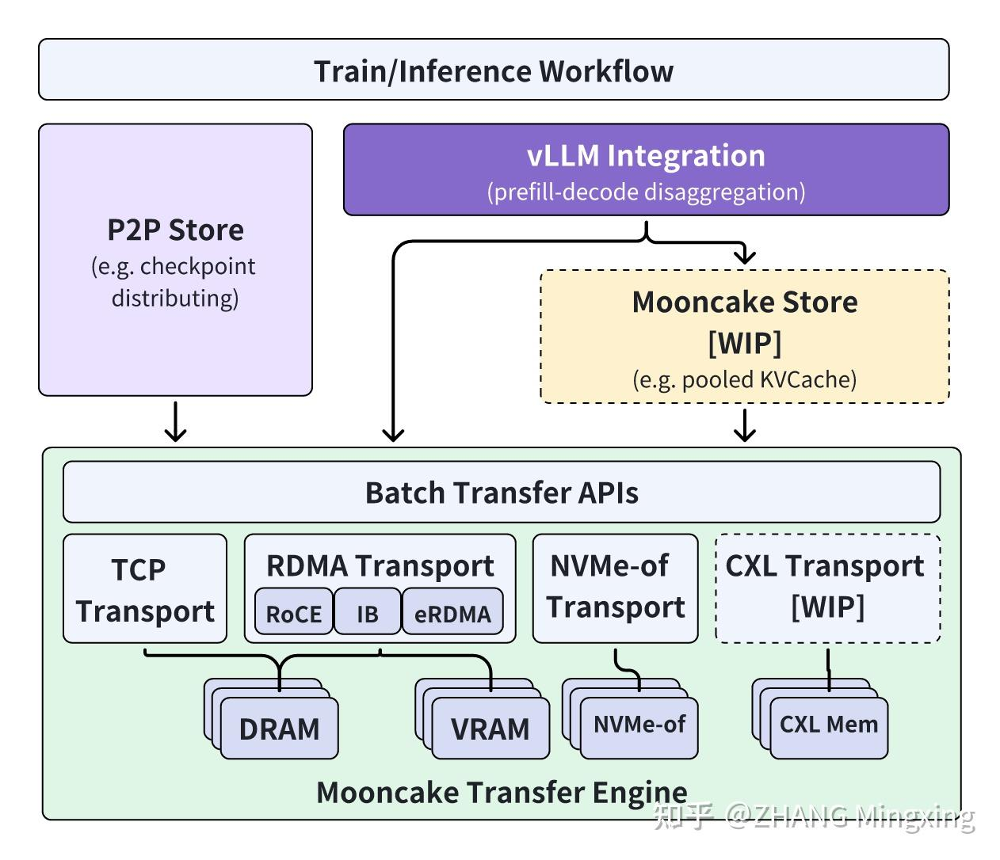
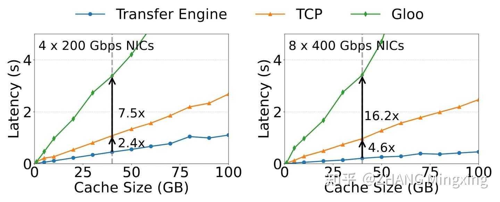
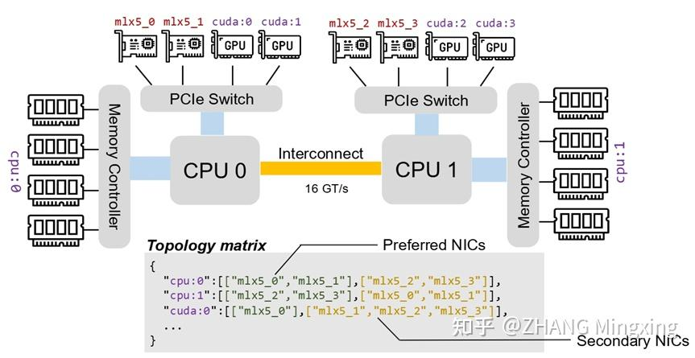

# Mooncake (4): 月饼的皮和馅是怎样制成的，Mooncake 传输引擎开源以及后续的计划

**Author:** ZHANG Mingxing

**Date:** 2024-11-27

**Link:** https://zhuanlan.zhihu.com/p/9461861451

> 作者：开源代码，和本文中相关概念的引用见 [https://github.com/kvcache-ai/Mooncake](https://link.zhihu.com/?target=https%3A//github.com/kvcache-ai/Mooncake)

**Disclaimer：**和论文不同本文夹带过量私货和个人观点，不代表本人单位更不代表 Moonshot，纯技术讨论。

## **TL;DR**

我们将在 Mooncake 原地址（[https://github.com/kvcache-ai/Mooncake](https://link.zhihu.com/?target=https%3A//github.com/kvcache-ai/Mooncake)）下逐步开源高性能 KVCache 多级缓存 Mooncake Store 的实现，同时针对各类推理引擎和底层存储/传输资源进行兼容。最终期望的目标是形成大模型时代下一类新型高性能内存语义存储的标准接口和参考实现。

本次开源在月之暗面 Kimi 和 MADSys 实验室之外进一步联合了 9#AISoft、阿里云、华为数据存储、面壁智能、趋境科技、以及数家暂时还不方便透露单位的朋友们的力量，非常感谢大家的投入，也期待未来能够更进一步的拓展更多的合作。

## **开源了什么以及为什么开源**

自 Mooncake 架构公开以来受到了非常广泛的关注。在和大家讨论的过程中我们也逐渐明确虽然上层的推理框架和模型各有不同，但在 KVCache 的存储、管理和传输一层面其实可以作为一个独立的公共组件抽象出来被大家所共享。甚至在大模型时代下这一类面向高速内存语义设计的存储有**可能可以成为继块存储、文件存储、对象存储以来一类新的通用标准存储系统的门类**。因此很多 Infra 厂商也非常希望能够将这一块的最佳实践尽可能地总结共享出来，为后续进一步的发展打一个基础。

不过由于原本的 Mooncake 是一个非常定制化且耦合的方案，一方面不太方便完整的开源，另一方面即便完整的开源其它单位其实也没法用。所以我们本次我们采用的是一种逐步逐层重新造一遍轮子，然后一边替换现有线上实现，一边分批开源的模式。在这个实现的过程中我们也联合了如上所述 9#AISoft、阿里云、华为数据存储、面壁智能、趋境科技等等多家产学研单位的力量一同面向更加未来和通用的场景进行设计和实现。

最后形成的架构如上图所示，其中传输引擎 Transfer Engine 部分现在已经在 GitHub 开源。除了 Transfer Engine 主体外，我们还提供了一个基于 Transfer Engine 实现的 P2P Store 库，支持在集群中的节点之间共享临时对象（例如 checkpoint 文件），同时避免了单台机器上的带宽瓶颈。此外，我们还修改了vLLM 并集成 Transfer Engine，通过高效利用 [RDMA](https://zhida.zhihu.com/search?content_id=250915184&content_type=Article&match_order=1&q=RDMA&zhida_source=entity) 设备，使得多机多卡 prefill-decode disaggregation 更加高效。未来，我们计划发布一个基于 Transfer Engine 实现的池化的 KVCache 系统，以实现更灵活的P/D解耦，敬请期待！

## **本次开源的 Transfer Engine 提供了什么？**

如 [Mooncake (1)](https://zhuanlan.zhihu.com/p/705754254) 讲的那样，Mooncake 是非常典型的分离式架构，不同节点上的 Distributed KVCache Pool 需要通过高速网络进行连接，这样才能在 P/D 分离的场景下实现 TTFT 的降低同时避免 GPU 空转导致的浪费。为了实现这一高速传输的目标，RDMA 是目前最主流的版本答案，但是直接使用 RDMA Verbs 写程序相当繁琐且有不少暗坑容易踩进去，而 nccl 在动态的环境中又不够灵活高效。因此， Mooncake 设计了专门的性能传输引擎 Transfer Engine，用于整个系统数据平面的传输。

在设计上 Transfer Engine 支持通过 TCP、RDMA、基于 NVIDIA [GPUDirect](https://zhida.zhihu.com/search?content_id=250915184&content_type=Article&match_order=1&q=GPUDirect&zhida_source=entity) 的 RDMA 以及 NVMe over Fabric（NVMe-of）协议进行快速、可靠和灵活的数据传输。主要特点如下：

• 支持多种介质：在大模型推理期间，KVCache 数据可能位于本地 DRAM、本地 GPU VRAM、远程 DRAM、远程 GPU VRAM，甚至还可以是远程 NVMe 设备上的某个文件（作为二级存储）。对于不同介质，Transfer Engine 内部必然采用不同的传输方式（这里还包括链路选择等），从而取得最好的性能。比如，如果一次传输是本地 DRAM 到本地 DRAM，显然 memcpy() 才是最高效的方式；大块数据的跨设备传输会尽量让多张网卡同时工作，提高聚合带宽；根据介质的硬件拓扑信息选择恰当的传输链路，减小 NUMA 对传输带宽的影响等。

• 提供统一抽象：Transfer Engine 提供 Segment 和 BatchTransfer 两个核心抽象对用户屏蔽了传输的相关细节（以 RDMA 为例，用户不再需要关心 QP 元数据交换等乱七八糟的细节了）。Segment 代表一段可被远程读写的连续地址空间（可以是 DRAM 或 VRAM 提供的非持久化存储，也可以是 NVMeof 提供的持久化存储）。BatchTransfer 封装了操作请求，负责将一个 Segment 中非连续的一组数据空间的数据和另外一组 Segment 的对应空间进行数据同步，支持 Read/Write 两种方向。可以参考 transfer\_engine\_bench.cpp 实现一个自己的应用。

• 性能表现佳：与分布式 PyTorch 使用的gloo和TCP相比，Transfer Engine 具有最低的I/O延迟。在 4×200 Gbps 和 8×400 Gbps RoCE 网络中，Transfer Engine 处理相当于 LLaMA3-70B 模型 128k tokens 生成的KVCache 大小的 40GB 数据时，能够提供高达 87 GB/s 和 190 GB/s 的带宽，相比 TCP 协议快约 2.4 倍和 4.6 倍。

## **Transfer Engine 高级功能举例**

### **拓扑感知路径选择（Topology Aware Path Selection）**

现代推理服务器通常由多个 CPU 插槽、DRAM、GPU 和 RDMA NIC 设备组成。尽管从技术上讲，使用任何RDMA NIC 将数据从本地 DRAM 或 VRAM 传输到远程位置是可能的，但这些传输可能会受到Ultra Path Interconnect (UPI) 或 PCIe 交换机带宽限制的制约。为了克服这些限制，Transfer Engine 实现了拓扑感知路径选择算法。在处理请求之前，每个服务器生成一个拓扑矩阵（Topology Matrix）并将其广播到整个集群。拓扑矩阵将网络接口卡（NIC）分类为各种类型的内存的“首选”和“次要”列表，这些类型在内存注册时指定。在正常情况下，选择首选列表中的NIC进行传输，便于在本地 NUMA 或仅通过本地 PCIe 交换机进行 GPU Direct RDMA 操作。在出现故障的情况下，两个列表中的所有 NIC 都可能被使用。上述过程包括根据内存地址识别适当的本地和目标 NIC，建立连接，并执行数据传输。

例如，如图所示，要将数据从本地节点分配给 cpu:0 的缓冲区0传输到目标节点分配给cpu:1的缓冲区1，引擎首先使用本地服务器的拓扑矩阵识别cpu:0的首选NIC，并选择一个，如mlx5\_1，作为本地NIC。同样，根据目标内存地址选择目标NIC，如mlx5\_3。这种设置允许建立从位于本地节点的mlx5\_1网卡到位于目标节点的mlx5\_3网卡的RDMA连接，以执行RDMA读写操作。

为了进一步最大化带宽利用率，如果单个请求的传输长度超过16KB，则其内部被划分为多个切片。每个切片可能使用不同的路径，使所有RDMA NIC能够协同工作。

### **端点管理**

Transfer Engine 使用一对端点来表示本地 RDMA NIC 和远程 RDMA NIC 之间的连接。实际上，每个端点包括一个或多个 RDMA QP 对象。 Transfer Engine 中的连接是按需建立的；端点在第一次请求之前保持未配对状态。 为了防止大量端点减慢请求处理速度，Transfer Engine 采用端点池，限制最大活动连接数。 Transfer Engine 使用 [SIEVE 算法](https://zhida.zhihu.com/search?content_id=250915184&content_type=Article&match_order=1&q=SIEVE+%E7%AE%97%E6%B3%95&zhida_source=entity)来管理端点的逐出。如果由于链路错误导致连接失败，它将从两端的端点池中移除，并在下一次数据传输尝试期间重新建立。

### **故障处理**

在多 NIC 环境中，一个常见的故障场景是特定 NIC 的暂时不可用，而其他路由仍然可以连接两个节点。Transfer Engine 旨在有效地管理这种暂时性故障。如果识别到连接不可用，Transfer Engine 会自动识别一个替代的、可达的路径，并将请求重新提交给不同的 RDMA NIC 设备。此外，Transfer Engine 能够检测到其他 RDMA 资源的问题，包括 RDMA 上下文和完成队列。它会暂时避免使用这些资源，直到问题得到解决。

## **示例应用**

虽然 Transfer Engine 的设计初衷是支撑后续即将开源的多级 KVCache 缓存的实现，但是它其实**也可以作为一个独立的通讯库在各种其它场景下使用**。以下是两个简单的例子：

### **vLLM 集成**

为了优化 LLM 推理，vLLM 社区正在努力支持[分解预填充（PR 8498）](https://link.zhihu.com/?target=https%3A//github.com/vllm-project/vllm/pull/8498)。该功能允许在不同进程中分离预填充阶段和解码阶段。我们基于 Transfer Engine 实现了 vLLM 集成 ([PR](https://link.zhihu.com/?target=https%3A//github.com/vllm-project/vllm/pull/10728))，支持节点间的 KVCache 传输。通过支持拓扑感知路径选择（Topology Aware Path Selection）和多卡带宽聚合（multi-card bandwidth aggregation），使用传输引擎的 vLLM 的 TTFT 比传统的基于 TCP 的传输低 33%。未来，我们计划在 Transfer Engine 的基础上构建 完整的 Mooncake Store 系统，并通过 GPUDirect RDMA 和零拷贝进一步提高 TTFT。

### **P2P Store**

我们在 Transfer Engine 的基础上用 Go 语言实现了 P2P Store（所以还附带了一个 Transfer Engine 的 Go 接口），支持在集群中的 peer 节点之间共享临时对象。比方说，在集群内分发一个 checkpoint 文件，集群中的节点会倾向从集群内其他拿到副本的节点（而不是原始文件所在的节点）处拿一个新的副本，这样可以避免单节点的_带宽饱和_问题。

  

前文传送门：

[关于 Mooncake 的碎碎念](https://zhuanlan.zhihu.com/p/705910725)

[Mooncake (1): 在月之暗面做月饼，Kimi 以 KVCache 为中心的分离式推理架构](https://zhuanlan.zhihu.com/p/705754254)

[Mooncake (2)：Kimi “泼天的流量”怎么接，分离架构下基于预测的调度策略](https://zhuanlan.zhihu.com/p/706204757)

[Mooncake (3): 开源数据集！以及一些感谢和碎碎念](https://zhuanlan.zhihu.com/p/707997501)