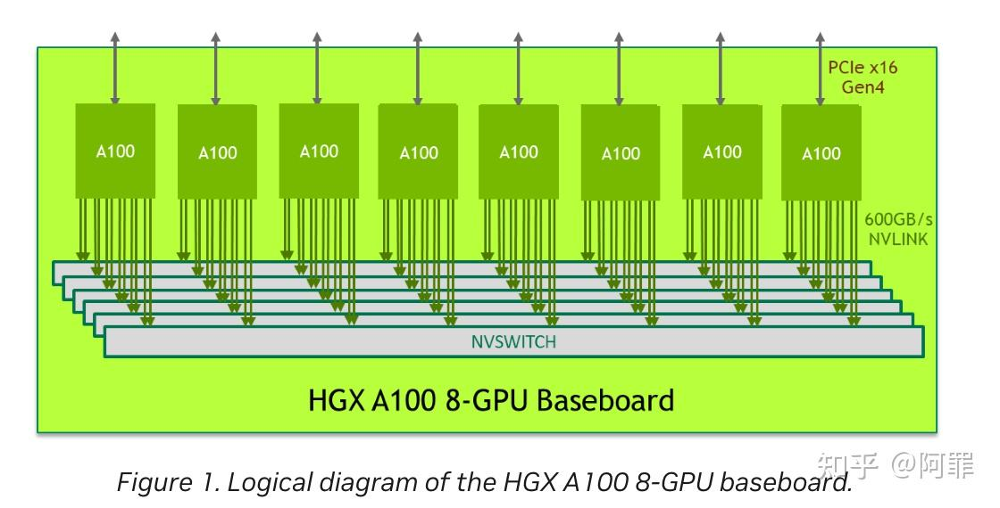

# NVLink的演变

**Author:** 阿罪

**Date:** 2025-01-02

**Link:** https://zhuanlan.zhihu.com/p/11173589156

​

目录

收起

1\. NVLink1.0

2\. NVLink2.0 and NVSwitch 1.0

3\. NVLink3.0 and NVSwitch 2.0

4\. NVLink4.0 and NVSwitch 3.0

5\. A100 256 Pod VS H100 256 Pod

简单梳理学习下各代nvlink的带宽以及NV的一些[DGX服务器](https://zhida.zhihu.com/search?content_id=251257655&content_type=Article&match_order=1&q=DGX%E6%9C%8D%E5%8A%A1%E5%99%A8&zhida_source=entity)是如何连接配置的，以及一些带宽的解释吧。

### 1\. NVLink1.0

1.  2014年 NVLink 1.0发布，在P100芯片中实现
2.  一个GPU有4个port（表述可能不专业，大概这个意思吧），能接4条nvlink，每条NVLink带宽是**双向40GB/s**
3.  两个GPU之间最大是 **4 \* 40 = 160GB/s的双向带宽。**

基于NVLink 1.0组成DGX-1 服务器，8个GPU形成相连形成 **8-GPU hybrid cube mesh** 结构吧。

DGX-1 with P100 ：

1.  每个GPU有4个nvlink1.0 的port与其他GPU相连
2.  8个GPU形成hybrid cube mesh结构；

DGX-1 with P100

### 2\. NVLink2.0 and NVSwitch 1.0

1.  2017年NVLink 2.0发布，在V100实现
2.  一个GPU有6个port，能接6条nvlink，每条NVLink带宽是**双向50GB/s**
3.  两个GPU之间最大是 6 \* 50 = **300GB/s的双向带宽**

DGX-1 with V100

1.  每个GPU有6个nvlink1.0 的port与其他GPU相连
2.  8个GPU形成hybrid cube mesh结构；

DGX-1 with V100

同时发布了**NVSwitch 1.0**：（NVSwitch is an NVLink switch **chip** with **18 ports** of NVLink per switch）

1.  NVSwitch是一个芯片，跟pci-e switch一样是在主板上的；而不是和网络交换机一样独立与主机外的；
2.  支持18个port

通过18个port可以实现16卡的全连接

16 GPU connect to NVSwitch chips

DGX-2 with V100

DGX-2 V100

1.  16 GPU + 6 NVSwitch组成全连接(full mesh，这么说对么？)
2.  每个GPU6条线连到对应board的6个NVSwitch上
3.  NVSwitch一共48个link（6个nvswitch，一个switch 8 个 link）双向通信；双向带宽 = 48 \* 50 GB/s = 2.4 TB/s

### 3\. NVLink3.0 and NVSwitch 2.0

1.  2020年，NVLink 3.0，在A100实现
2.  一个GPU有12个port，能接12条nvlink，每条NVLink带宽是**双向50GB/s**
3.  两个GPU之间的双向带宽是 12 \* 50 = **600GB/s的双向带宽**

**NVSwitch 2.0**

1.  支持36个port，每个port50GB/s

HGX A100 8-GPU

HGX-A100（or [DGX A100](https://zhida.zhihu.com/search?content_id=251257655&content_type=Article&match_order=1&q=DGX+A100&zhida_source=entity)）

1.  8GPU + 6 NVSwitch组成full mesh
2.  每个GPU接出12条nvlink到6个switch上，每个switch接每个GPU的两个nvlink
3.  总带宽，每个switch是8条link（16条link，双向 / 2 = 8），然后6个switch，双向带宽 = 48 \* 50 GB/s = 2.4 TB/s
4.  如果组成16GPU的话，理论上是能达到4.8TB/s的总带宽，不过没看见过这种机器的资料，这也是NV官网标明的NVSwitch3.0组成的总带宽为4.8TB/s的原因吧，我猜的。

NVLink spec

P.S.

1.  [https://developer.nvidia.com/blog/introducing-hgx-a100-most-powerful-accelerated-server-platform-for-ai-hpc/](https://link.zhihu.com/?target=https%3A//developer.nvidia.com/blog/introducing-hgx-a100-most-powerful-accelerated-server-platform-for-ai-hpc/) 文章有提到“Two baseboards can also be connected back-to-back using NVSwitch to NVLink, enabling 16 A100 GPUs to be fully connected”，也就是可以组成16卡A100的形态，当然
2.  可以看出DGX的命名，刚开始的V100, P100类似DGX-1 with P100，DGX-1 with V100，后续直接DGX A100，DGX H100 大致可以看出DGX-1或者DGX xxx是8卡系统；而只出现过一次的DGX-2 V100是16卡系统。

### 4\. NVLink4.0 and NVSwitch 3.0

1.  2022年， NVLink 4.0, H100上实现
2.  一个GPU有18个port，能接18条nvlink，每条NVLink带宽是**双向50GB/s**
3.  两个GPU之间能达到**900GB/s的双向带宽**
4.  集成了SHARP功能

**NVSwitch 3.0**

1.  支持64个port，每个port 50GB/s

DGX H100 图1

DGX H100 图2

DGX H100

1.  8GPU + 4NVSwitch 组成full mesh
2.  每个GPU接出18条nvlink到4个switch上，采用分层的方式

1.  每张卡向第1个NVSwitch 接入5条nvlink；
2.  每张卡向第2个NVSwitch接入4条nvlnik；
3.  每张卡向第3个NVSwitch接入4条nvlink；
4.  每张卡向第4个NVSwitch接入5条nvlink；

4.  8个GPU，每个GPU18条NVLink，双向50GB/s，因此系统的双向总带宽8 \* 18/2 50 GB/s = 3.6 TB/s；如果组成16卡的话，最大是7.2TB/s（和NV官网标的一致）

**[NVLink Switch](https://zhida.zhihu.com/search?content_id=251257655&content_type=Article&match_order=1&q=NVLink+Switch&zhida_source=entity)**

NVLink Switch是一个类似IB Switch的外部设备（不是在插在主板上的芯片），用于连接多个DGX H100 服务器，看下NVLink Switch的特性

1.  包含两个 NVLink4 NVSwitch 芯片
2.  支持128 个nvlink4 port，双向带宽 128 \* 50GB/s = 6.4TB/s

**DGX H100 SuperPod**

由32个DGX H100 组成的系统，主要特性如下：

1.  32 DGX H100 nodes + 18 NVLink Switches

1.  32 DGX H100 (每台DGX H100 向外通过(20 + 16 + 26 + 20)个NVLink Network port 连接到NVLink Swich（见DGX H100 图3）；共有18个NVLink Switch，32 台node，一个node向外72个port，一共是 32 \*72 = 2304个port，每个NVLink Switch提供128个port，因此需要2304 / 128 = 18个 NVLink Switch

3.  256 H100 GPU；32个nodes, 一个node 8个GPU，所以32 \* 8 = 256
4.  128 L1 NVLink4 NVSwitch chips + 36 L2 NVLink4 NVSwitch chips；

1.  128 L1是指主板上的NVSwitch芯片，一共有32个node，每个node有4个NVSwitch chips
2.  36 L2 NVLink4 NVSwitch chips是指的 18台NVLink Switch，每台有2个NVSwitch芯片，因此是36个NVSwitch chips

6.  57.6TB/s 双向NVLink带宽，一共有18台NVLink Switchs，18 \*128个port，所以双向就是18 \* 128 \* 50 / 2 = 57.6TB/s

DGX H100 图3

### 5\. A100 256 Pod VS H100 256 Pod

A100 256 Pod VS H100 256 Pod

主要参考文档：

1.  [Unveiling The Evolution of NVLink](https://link.zhihu.com/?target=https%3A//www.naddod.com/blog/unveiling-the-evolution-of-nvlink%3Fsrsltid%3DAfmBOoqmMNM9XaNTuxgzbvGQaQu1eUTVPOuEFRUgaIGO1EbaFN95gyfY)
2.  [THE NVLINK-NETWORK SWITCH: NVIDIA’S SWITCH CHIP FOR HIGH COMMUNICATION-BANDWIDTH SUPERPODS](https://link.zhihu.com/?target=https%3A//hc34.hotchips.org/assets/program/conference/day2/Network%2520and%2520Switches/NVSwitch%2520HotChips%25202022%2520r5.pdf)
3.  [An Overview of NVIDIA NVLink](https://link.zhihu.com/?target=https%3A//community.fs.com/article/an-overview-of-nvidia-nvlink.html)
4.  [THE NVLINK-NETWORK SWITCH](https://link.zhihu.com/?target=https%3A//hc34.hotchips.org/assets/program/conference/day2/Network%2520and%2520Switches/NVSwitch%2520HotChips%25202022%2520r5.pdf)