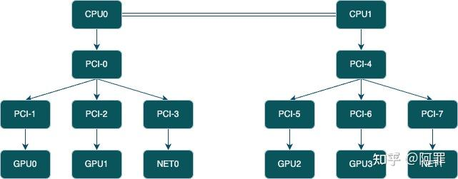
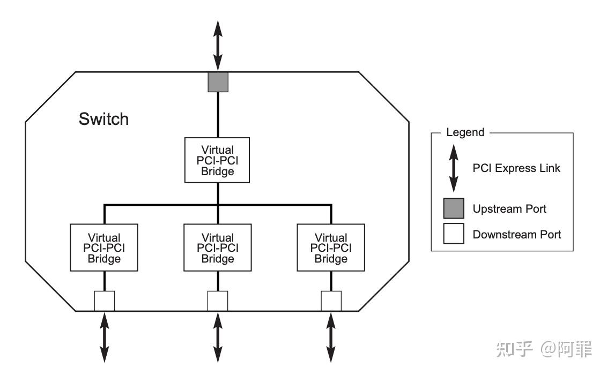
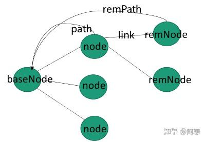

# NCCL初始化之系统topo图构建

**Author:** 阿罪

**Date:** 2025-01-06

**Link:** https://zhuanlan.zhihu.com/p/720954503


不同的机器有不同的cpu、gpu、net以及不同的连接方式(pci和nvlink)，这个我们称之为topo；因此[topo detection](https://zhida.zhihu.com/search?content_id=248342470&content_type=Article&match_order=1&q=topo+detection&zhida_source=entity)就是获取机器的cpu、gpu、net、pci、nvlink的个数和链接，并建立一个xml树的过程。（这里将pci和nvlink都表示为一个类型的node



图1-机器topo

  

## 1\. 自底向上建立xml树

如图1的topo图，如何建立一个xml树？这里采用的**自“底”向“上”**的过程。底部是GPU和NET node。因此我们一个代码如下

```text
  // Auto-detect GPUs if needed
  for (int r=0; r<comm->nRanks; r++) {
    if (comm->peerInfo[r].hostHash == comm->peerInfo[comm->rank].hostHash) {  // detect一台host主机上的GPU结构
      char busId[NVML_DEVICE_PCI_BUS_ID_BUFFER_SIZE];
      NCCLCHECK(int64ToBusId(comm->peerInfo[r].busId, busId));
      struct ncclXmlNode* node;
      NCCLCHECK(ncclTopoFillGpu(xml, busId, &node));
    }
  }

  // 探索NET结构
  for (int n=0; n<netDevCount; n++) {
    ncclNetProperties_t props;
    NCCLCHECK(ncclNetGetProperties(n, &props));
    struct ncclXmlNode* netNode;
    NCCLCHECK(ncclTopoFillNet(xml, props.pciPath, props.name, &netNode));
  }
```

先看**ncclTopoFillGpu，从本GPU node根据pci-e的pciPath开始一路自底向上建立pciNode直到rc（cpu/numa node）**，比如说GPU0 -> PCI-1 -> PCI-0 -> CPU0这样来建立节点；GPU node的busid(BDF)可以通过cudaDeviceGetPCIBusId来获取；对于ncclTopoFillNet也是一样的逻辑。至此上图的topo就建立成一个xml树了。

这里说明下，如何根据pciPath向上寻找建立PCI node；我们来看一个NV的busIdStr = /sys/devices/pci0000:00/0000:00:03.0/0000:03:00.0/0000:04:00.0/0000:05:00.0，其中GPU的PCI的BDF是04:00.0，代表此GPU是插在05:00.0这个pci插槽上，向上依次是04:00.0->03:00.0->00:03.0，每一个BDF都代表一个PCI Bridge，很明显这个path就显示出路径，这样我们就可以一路跟踪到rc。

nccl代码写的时候是会向上跳两级建立一个PCI NODE，实际就是跳到上一级的pci-e switch上。我们可以看下pci-e switch的结构如图2，switch由一个Upstream port + 多个Downstream port组成，因此就是向上跳两个bridge就是跳到上一个switch去。



图2 pci-e switch 结构

然后再看下如何建立nvlink节点的？建立nvlink的过程就在上面的`ncclTopoFillGpu`函数里。如果有nvlink节点的话，上图中的GPU node会有nvlink的subNode，包含两个属性count和target。count就是两个GPU之间有多少个nvlink连接，target就是此gpu node的peer端的busId，这些都可以通过nvml函数获取。值得注意的是nvlink的peer可能是另一个gpu node或者nv switch芯片或者cpu node（可通过其busId判断, nvlink直接节cpu node应该只有power系列的，不太常见）

我们来看一个xml树的示例

```json
<system version="1">
  <cpu numaid="0" affinity="03f03f" arch="x86_64" vendor="GenuineIntel" familyid="6" modelid="63">
    <pci busid="0000:03:00.0" class="0x030000" vendor="0x10de" device="0x2204" subsystem_vendor="0x1458" subsystem_device="0x403b" link_speed="8.0 GT/s PCIe" link_width="16">
      <gpu dev="0" sm="80" rank="0" gdr="0">
        <nvlink target="0000:83:00.0" count="4" tclass="0x030000"/>
      </gpu>
    </pci>
  </cpu>
  <cpu numaid="1" affinity="fc0fc0" arch="x86_64" vendor="GenuineIntel" familyid="6" modelid="63">
    <pci busid="0000:83:00.0" class="0x030000" vendor="0x10de" device="0x2204" subsystem_vendor="0x1458" subsystem_device="0x403b" link_speed="8.0 GT/s PCIe" link_width="16">
      <gpu dev="1" sm="80" rank="1" gdr="0">
        <nvlink target="0000:03:00.0" count="4" tclass="0x030000"/>
      </gpu>
    </pci>
    <pci busid="0000:81:00.1" class="0x020000" vendor="0x8086" device="0x1521" subsystem_vendor="0x15d9" subsystem_device="0x1521" link_speed="5.0 GT/s PCIe" link_width="4">
      <nic>
        <net name="eno2" dev="0" speed="1000" port="0" latency="0.000000" guid="0x0" maxconn="65536" gdr="0"/>
      </nic>
    </pci>
  </cpu>
</system>
```

## 2\. 自顶向下建立graph结构

### 2.1 数据结构

建立完xml树型结构后，需要再调用`ncclTopoGetSystemFromXml`转换为nccl内部的topo数据结构，这里主要看看`ncclTopoSystem` 的定义，一个topo系统中定义了6种节点。NIC节点下面挂NET节点（不清楚为何这么做？）

```text
#define NCCL_TOPO_NODE_TYPES 7
#define GPU 0
#define PCI 1
#define NVS 2
#define CPU 3 // Actually NUMA domains
#define NIC 4
#define NET 5

struct ncclTopoSystem {
  struct ncclTopoNodeSet nodes[NCCL_TOPO_NODE_TYPES];
  float maxWidth;
  float totalWidth;
};
```

每种类型节点set有多少个节点

```text
#define NCCL_TOPO_MAX_NODES 256
struct ncclTopoNodeSet {
  int count;
  struct ncclTopoNode nodes[NCCL_TOPO_MAX_NODES];
};
```

每个节点我们关注的属性、数据成员、links、路径等

```text
struct ncclTopoNode {
  int type;  // 什么类型的节点
  int64_t id;
  // Type specific data
  union {
    struct {
      int dev; // NVML dev number
      int rank;
      int cudaCompCap;
      int gdrSupport;
    }gpu;
    struct {
      uint64_t asic;
      int port;
      float width;
      float latency;
      int gdrSupport;
      int collSupport;
      int maxChannels;
    }net;
    struct {
      int arch;
      int vendor;
      int model;
      cpu_set_t affinity;
    }cpu;
    struct {
      uint64_t device;
    }pci;
  };
  int nlinks;
  struct ncclTopoLink links[NCCL_TOPO_MAX_LINKS];
  // Pre-computed paths to GPUs and NICs
  struct ncclTopoLinkList* paths[NCCL_TOPO_NODE_TYPES];
  // Used during search
  uint64_t used;
};
```

id对于CPU来说是numaId，对GPU/NIC来说是busId；**links**代表本node有几条相连接的link（比如说gpu0可以通过pci-e连接到pci-e的node，可以通过nvlink连接到另一个gpu1，gpu0的node就有2条link），我们看下link的数据结构，记录一条link对端的节点和本link的类型和width；

```text
struct ncclTopoLink {
  int type;
  float width;
  struct ncclTopoNode* remNode;
};
```

我们将link按照如下进行分类，可看到从0到8，按照越来越"差"的连接状况进行排序

```text
#define LINK_LOC 0
#define LINK_NVL 1
// Skipping 2 for PATH_NVB
#define LINK_PCI 3
// Skipping 4 for PATH_PXB
// Skipping 5 for PATH_PXN
// Skipping 6 for PATH_PHB
#define LINK_SYS 7
#define LINK_NET 8
```

NVL指GPU通过nvlink和其他类型node连接；PCI是两个node通过pci-e连接的；SYS其实是两个cpu node的连接; NET是NIC和NET节点的连接

paths主要是本node到其他不同类型node的路径，后续再说。

如此我们看到通过这些数据结构可以很好的描述整个topo系统，以及topo系统的连接方式，带宽，路径，这样是为了后续最优channel的寻找，从而建立channel通信。

### 2.2 自顶向下建立graph

将xml树转换为system，主要是**自顶而下**的方式建立，调用`ncclTopoAddCpu`从CPU节点一直向下建立到GPU/NET节点（主要创建node，设置node之间的links），然后再建立nvlink两端的连接以及cpu node之间的连接。代码如下

```text
ncclResult_t ncclTopoGetSystemFromXml(struct ncclXml* xml, struct ncclTopoSystem** topoSystem) {
  NCCLCHECK(ncclCalloc(topoSystem, 1));
  struct ncclXmlNode* topNode;
  NCCLCHECK(xmlFindTag(xml, "system", &topNode));
  for (int s=0; s<topNode->nSubs; s++) {
    struct ncclXmlNode* node = topNode->subs[s];
    if (strcmp(node->name, "cpu") == 0) NCCLCHECK(ncclTopoAddCpu(node, *topoSystem));
  }
  NCCLCHECK(ncclTopoAddNvLinks(topNode, *topoSystem, NULL));

  NCCLCHECK(ncclTopoFlattenBcmSwitches(*topoSystem));
  NCCLCHECK(ncclTopoConnectCpus(*topoSystem));
  NCCLCHECK(ncclTopoSortSystem(*topoSystem));

  return ncclSuccess;
}
```

值得说明的是，添加links时会按照link带宽的大小进行降序排序，所以link的顺序是nvlink再最前面，SYS在最后面，PCI的upLink在前面，downLink在最后面。

## 3\. 计算节点间的paths

### 3.1 主要流程

上面已经初步建立了topoSystem结构，调用`ncclTopoComputePaths`设置node间的path了。先看下path的数据结构，一个node有指向不同类型node的path，比如说paths\[GPU\]，代表指向GPU node的path，然后paths\[GPU\]也是一个指针，代表指向多个GPU node的path。每个path包含不同的link，以及link的count，type。

```text
struct ncclTopoNode {
  ...
  struct ncclTopoLinkList* paths[NCCL_TOPO_NODE_TYPES];
};

#define NCCL_TOPO_MAX_NODES 256
#define NCCL_TOPO_NODE_TYPES 7
#define NCCL_TOPO_MAX_HOPS (NCCL_TOPO_MAX_NODES*NCCL_TOPO_NODE_TYPES)
struct ncclTopoLinkList {
  struct ncclTopoLink* list[NCCL_TOPO_MAX_HOPS];
  int count;
  float width;
  int type;
};
```

然后看下path\_type的定义，注释的很清楚了

```text
// Local (myself)
#define PATH_LOC 0

// Connection traversing NVLink
#define PATH_NVL 1

// Connection through NVLink using an intermediate GPU
#define PATH_NVB 2

// Connection traversing at most a single PCIe bridge
#define PATH_PIX 3

// Connection traversing multiple PCIe bridges (without traversing the PCIe Host Bridge)
#define PATH_PXB 4

// Connection between a GPU and a NIC using an intermediate GPU. Used to enable rail-local, aggregated network send/recv operations.
#define PATH_PXN 5

// Connection traversing PCIe as well as a PCIe Host Bridge (typically the CPU)
#define PATH_PHB 6

// Connection traversing PCIe as well as the SMP interconnect between NUMA nodes (e.g., QPI/UPI)
#define PATH_SYS 7
#define PATH_DIS 7
```

1.  **首先设置所有node到所有cpu node的paths**（`ncclTopoSetPaths(baseNode, system)`设置整个system种所有node到baseNode的path），还是按照图1来说，就是设置所有node到cpu0/cpu1的paths。

```text
  // Set direct paths from/to CPUs. We need them in many cases.
  for (int c=0; c<system->nodes[CPU].count; c++) {
    NCCLCHECK(ncclTopoSetPaths(system->nodes[CPU].nodes+c, system));
  }
```

2\. 设置所有node到所有gpu node的path，然后根据一些条件改变一些path :

1） 调用`ncclTopoCheckP2p`判断两个gpu node之间"能否"p2p，如果不能p2p，则将这两个gpu之间的path中转到cpu node之间；如图1，拿gpu0和gpu1来说，先建立了gpu1到gpu0的path（gpu1->pci2->pci0->pic1->gpu0），然后判断出gpu1到gpu0"不能/不想"直接p2p，那么gpu1到gpu0的path就会通过cpu0进行中转，path会变成gpu1->pci2->pci0->cpu0->pci1->gpu0，同时更新此path的属性（width和pathType）

2） 如果两个gpu node之间不能p2p且也不能shm通信，则判断两个gpu可能在不同的容器内，因此需要移除掉这两个gpu之间的path

代码如下

```text
  // Set direct paths from/to GPUs.
  for (int g=0; g<system->nodes[GPU].count; g++) {
    // Compute paths to GPU g
    NCCLCHECK(ncclTopoSetPaths(system->nodes[GPU].nodes+g, system));

    // Update path when we don't want to / can't use GPU Direct P2P
    for (int p=0; p<system->nodes[GPU].count; p++) {
      int p2p;
      NCCLCHECK(ncclTopoCheckP2p(system, system->nodes[GPU].nodes[p].id, system->nodes[GPU].nodes[g].id, &p2p, NULL, NULL));
      if (p2p == 0) {
        // Divert all traffic through the CPU
        int cpu;
        NCCLCHECK(getLocalCpu(system, g, &cpu));
        NCCLCHECK(addInterStep(system, CPU, cpu, GPU, p, GPU, g));
      }
    }

    if (peerInfos == NULL) continue;
    // Remove GPUs we can't talk to because of containers.
    struct ncclPeerInfo* dstInfo = peerInfos+system->nodes[GPU].nodes[g].gpu.rank;
    for (int p=0; p<system->nodes[GPU].count; p++) {
      if (p == g) continue;
      struct ncclPeerInfo* srcInfo = peerInfos+system->nodes[GPU].nodes[p].gpu.rank;
      int shm;
      NCCLCHECK(ncclTransports[TRANSPORT_SHM].canConnect(&shm, system, NULL, srcInfo, dstInfo));
      int p2p;
      NCCLCHECK(ncclTransports[TRANSPORT_P2P].canConnect(&p2p, system, NULL, srcInfo, dstInfo));
      if (shm == 0 && p2p == 0) {
        // Mark this peer as inaccessible. We'll trim it later.
        system->nodes[GPU].nodes[p].paths[GPU][g].count = 0;
      }
    }
  }
```

这里看下`ncclTopoCheckP2p`的两个gpu之间**"想要/能否"p2p**的逻辑：

1）根据NCCL\_P2P\_LEVEL和两个gpu node之间的path->type判断，如果NCCL\_P2P\_LEVEL > path->type，则表示用户不想P2P，如果NCCL\_P2P\_LEVEL <= path->type，表示用户是想要进行p2p的

2）如果用户想要进行p2p，通过此前获取的nvml判断gpu node之间能否p2p，如果能就返回true，否则返回false。

NCCL\_P2P\_LEVEL 宏选项见 [https://docs.nvidia.com/deeplearning/nccl/user-guide/docs/env.html#nccl-p2p-level](https://link.zhihu.com/?target=https%3A//docs.nvidia.com/deeplearning/nccl/user-guide/docs/env.html%23nccl-p2p-level)

`shmCanConnect` 判断是否同一个host以及同一个containers，如果是则能通过SHM通信

3\. 设置所有node到所有nic node的path，然后根据遍历所有的gpu，根据一些条件改变path :

1）**PXN 相关的TODO**

2）调用`ncclTopoCheckGdr`判断gpu和nic之间能否use GPU Direct RDMA，如果不能则通过cpu进行中转

`ncclTopoCheckGdr` 的逻辑是判断net和gpu是否都支持gdrSupport，如果支持再根据NCCL\_NET\_GDR\_LEVEL和path->type进行比较来决定是否能否进行Gdr（PXN相关的TODO）

### 3.2 ncclTopoSetPaths设置到所有node到baseNode的path



BFS设置node到baseNode的path

˙主要就是利用BFS算法设置所有node到baseNode的path，设置path的type和width。

## 4\. 建立topo graph的流程

上面三个小节说完了每个步骤的流程，现在看下完整的流程code

```text
 // Topo detection / System graph creation
  NCCLCHECK(ncclTopoGetSystem(comm, &comm->topo));
  // Compute paths between GPUs and NICs
  NCCLCHECK(ncclTopoComputePaths(comm->topo, comm->peerInfo));
  // Remove inaccessible GPUs and unused NICs
  NCCLCHECK(ncclTopoTrimSystem(comm->topo, comm));
  // Recompute paths after trimming
  NCCLCHECK(ncclTopoComputePaths(comm->topo, comm->peerInfo));
  // Init search
  NCCLCHECK(ncclTopoSearchInit(comm->topo));
  // Print final topology
  NCCLCHECK(ncclTopoPrint(comm->topo));
```

其中`ncclTopoGetSystem` 包含xml树的建立和xml树向graph结构的转换，`ncclTopoComputePaths` 设置了node之间的path，然后`ncclTopoTrimSystem` 会移除掉一些不必要的NET节点，一些can talk的GPU节点，之后再次重新设置node间的path。

`ncclTopoSearchInit` 计算整个系统的maxWidth和totalWidth。如果是单机多卡的情况下，maxWidth是gpu node之间的最大width；多机的话，maxWidth是gpu与net之间的最大width。

`ncclTopoPrint` 打印整个系统的graph topo图，可以通过设置环境变量`NCCL_DEBUG=INFO NCCL_DEBUG_SUBSYS=GRAPH` 进行查看