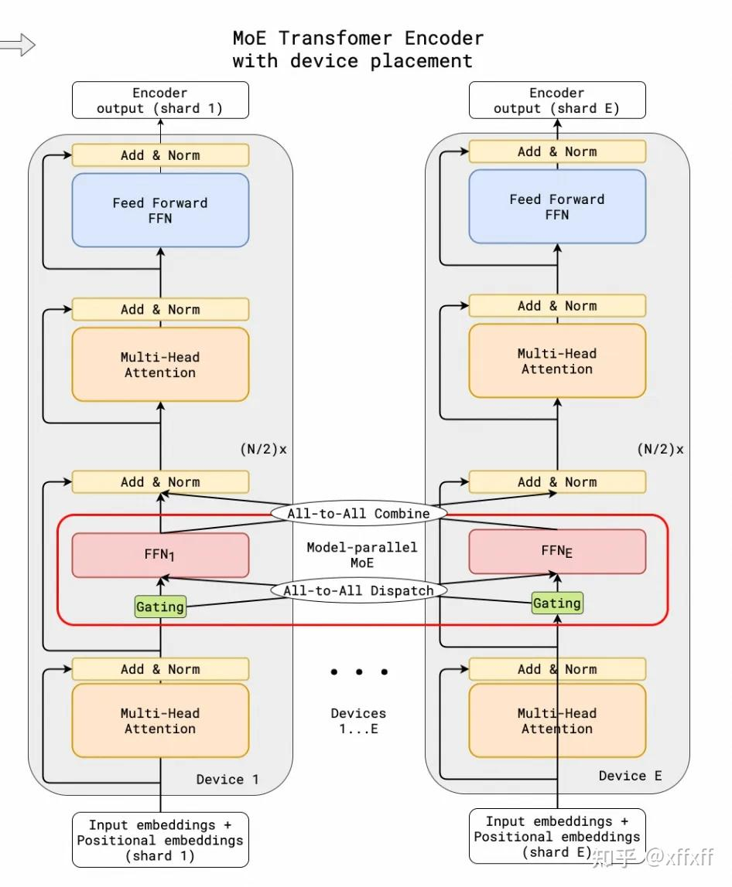
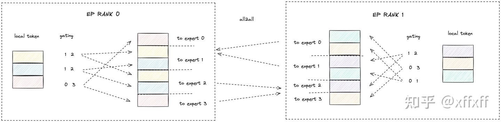
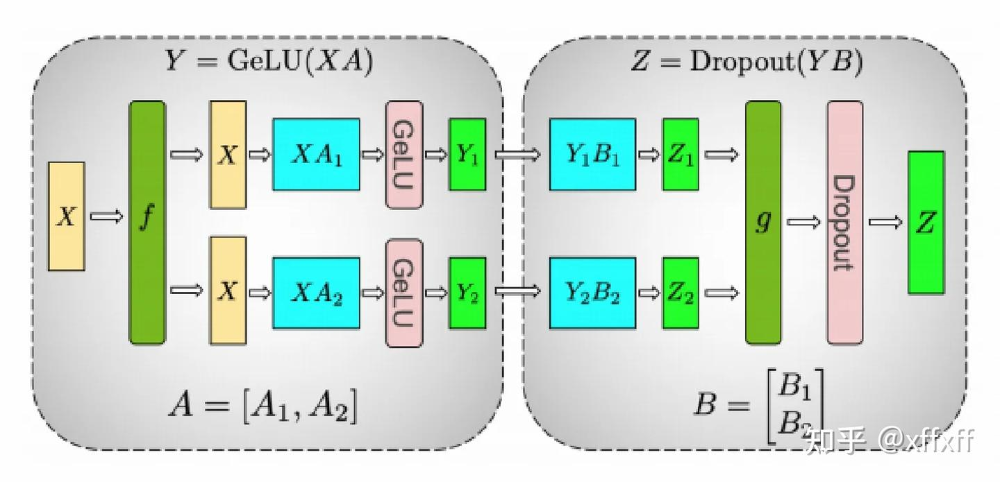
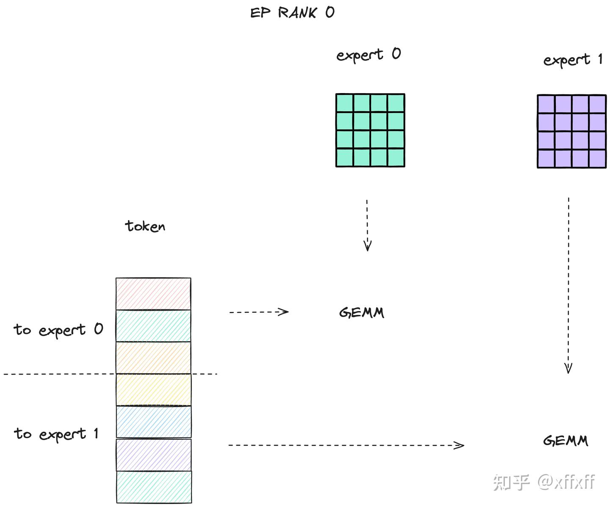
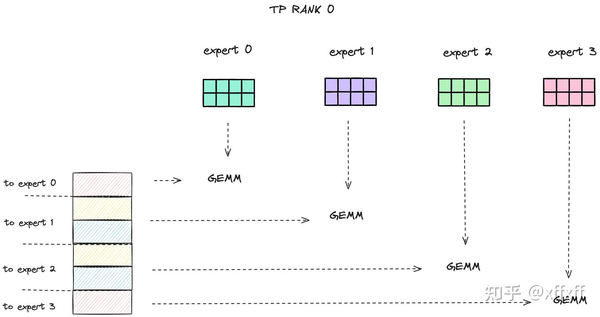
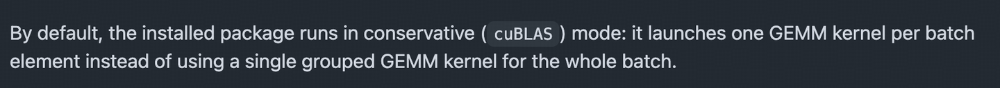
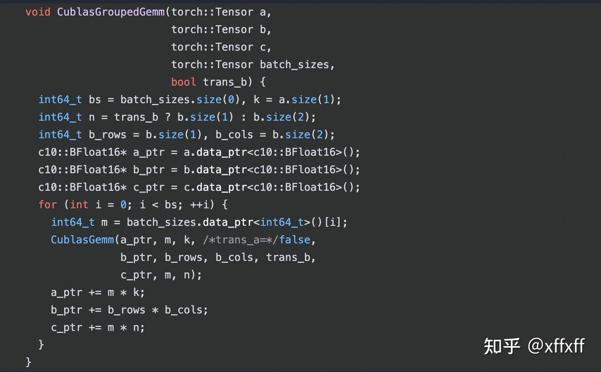

# MoE 训练到底是开 TP 还是 EP？

**Author:** xffxff

**Date:** 2025-01-10

**Link:** https://zhuanlan.zhihu.com/p/13997146226

最近面试中被问到：**为什么在 [MoE](https://zhida.zhihu.com/search?content_id=251822371&content_type=Article&match_order=1&q=MoE&zhida_source=entity) 训练中使用 [Expert Parallelism](https://zhida.zhihu.com/search?content_id=251822371&content_type=Article&match_order=1&q=Expert+Parallelism&zhida_source=entity) (EP) 而不是 [Tensor Parallelism](https://zhida.zhihu.com/search?content_id=251822371&content_type=Article&match_order=1&q=Tensor+Parallelism&zhida_source=entity) (TP)？**

我的回答是，使用 EP 不会减少数据并行 (DP) 的数量，因为每个 EP 处理不同的数据。而且，EP 和 TP 对通信的要求都很高，一般不会让 EP 和 TP 跨机。根据我们的实验结果，EP 的吞吐量比 TP 更高。当 EP 开启到 8 时，我们就不再使用 TP。

面试结束后，对这个问题进行了更深入的思考，觉得还有一些未考虑的细节值得分析。翻了下 [DeepSeek](https://zhida.zhihu.com/search?content_id=251822371&content_type=Article&match_order=1&q=DeepSeek&zhida_source=entity) 的技术报告。在 v1 中，他们使用了 PP、EP、TP 和 [Zero1](https://zhida.zhihu.com/search?content_id=251822371&content_type=Article&match_order=1&q=Zero1&zhida_source=entity)，而在 v2（236B 参数、21B 激活）中，配置为 8EP + 16PP（zero bubble）+ Zero1，没有使用 TP。

> 对于这个参数和激活规模，8EP + 8PP + Zero1 应该就足够了。不知道为什么用了 16PP，是因为真的能实现 zero bubble 吗？

* * *

## 通信开销对比

### EP 通信分析

Expert Parallelism 的逻辑如下图所示，每个 EP rank 上只包含一部分 expert，而每个 EP rank 上的 token（即 token 对应的 hidden state） 会根据 gating 结果分发到其他 EP rank 上的 expert。这个过程通过 **all-to-all** 通信完成。

### [All-to-All Dispatch](https://zhida.zhihu.com/search?content_id=251822371&content_type=Article&match_order=1&q=All-to-All+Dispatch&zhida_source=entity) 逻辑

以 4 个 expert、2 个 EP rank 和 topk=2 为例 ，下图中每个 EP rank 上有 3 个 token：

-   EP rank 0 的 token 分配如下：

-   Token 1 → Expert 1 和 Expert 2
-   Token 2 → Expert 1 和 Expert 2
-   Token 3 → Expert 0 和 Expert 3

在 all-to-all 通信前，需要对 local token 按照 gating 结果进行 **permute/group**，将发往同一 expert 的 token 分组。随后，这些 token 通过 all-to-all 通信发送到对应的 expert rank。

### 通信量计算

假设 local token 的形状为 $[b \times s, h]$ 。在分组后，形状变为 $[b \times s \times \text{topk}, h]$ 。若 token 分配完全均匀：

每个 EP rank 发送/接收的 token 数量为

$b \times s \times \text{topk} * (\text{ep_world_size} - 1) / \text{ep_world_size}$

近似为 $b \times s \times \text{topk}$

对于 half precision，为通信量近为：

$2 \times b \times s \times \text{topk} \times h \, \text{bytes}$

在 local experts 上计算结束后需要发送原本的 ep rank，是一个 all-to-all 的逆过程，对应上图中的 all-to-all combine，通信量和 all-to-all dispatch 一致，所以总的通信量为

$4 \times b \times s \times \text{topk} \times h \, \text{bytes}$

### TP 通信分析

在 Tensor Parallelism 中，MLP（或 expert）前向计算需要一次 **all-reduce** 操作

$Z_1 $ ​ 和 $Z_2$ 的形状为 $[b \times s, h]$

对于半 half precision，通信量为：

$2 \times b \times s \times h \times 2 \, \text{bytes}= 4\times b \times s \times h\, \text{bytes}$

最前面的 2 是由于 ring all-reduce 包含 reduce-scatter 和 all-gather 两个步骤，它们的通信量相等。

> 这里通信量的计算也是有近似的，实际上 reduce-scatter 只需要发送和接收 tp-1 次，而不是 tp 次，细节可以参考 [OneFlow：手把手推导Ring All-reduce的数学性质](https://zhuanlan.zhihu.com/p/504957661)  
> 类似地，Transformer 中的 attention 中的 linear 也会被切分，进一步增加 TP 的通信开销，但我们这里只考虑 mlp 部分。
> 
> [@Victarry](//www.zhihu.com/people/b8fd114b56b395d247744cee40056139)
> 
> 在评论区指出现在 [Megatron-LM](https://link.zhihu.com/?target=https%3A//github.com/NVIDIA/Megatron-LM/commit/7f22e210cddc3215adda25d9e16ea512dc32458c%23diff-73e7d423b1148fd2cd8ea5b51936ba2c4e857b6e55ad22fd8cf456137301a752) 支持 TP 和 EP 的解藕，即 attention 部分拆 TP，mlp 部分拆 EP

  

前向时，EP 每个 rank 需要发送 $4 \times b \times s \times \text{topk} \times h \, \text{bytes}$ ，TP 每个 rank 需要发送 $4\times b \times s \times h\, \text{bytes}$ ，所以得出结论 EP 的通信量比 TP 的大？

还有另外一个因素没有考虑，EP 是 DP 的 sub group，开 EP 不会影响 DP 数量，每个 EP rank 处理不同的数据。相比之下，同一个 TP group 中的所有 TP rank 处理相同的数据，在固定 world size 的情况下，开启 TP 会使 DP 变为原来的 1/TP。举例来说，当 world size 为 64 时，启用 EP 8 后 DP 仍为 64，但启用 TP 8 后 DP 就只有 8。这表明在总卡数相同的情况下，使用 EP 而非 TP 可以在每次 forward 中处理更多数据。当 global batch size 固定时，完成相同数量的数据需要更少的 GAS（gradient accumulation step）。

> 另外的一个间接影响：在有 [pipeline parallelism](https://zhida.zhihu.com/search?content_id=251822371&content_type=Article&match_order=1&q=+pipeline+parallelism&zhida_source=entity) 的情况下，较大的 DP 会导致 GAS 数变小，从而产生更大的 pipeline bubble

所以，同样的 parallel size，EP 一次 forward 消耗的 token 数是 TP 的 parallel size 倍。控制消耗相同 token，TP 的通信量需要再乘以 parallel size，即 $4\times parallel\_size \times b \times s \times h\, \text{bytes}$ 。所以当 topk 小于 parallel size 时，EP 的通信量小于 TP。

## 计算开销对比

### Expert 计算

对于 EP，完成 All-to-all dispatch 后，所有 token 都被分发到了对应目标 expert 所在的 EP rank，接着执行矩阵乘法运算

对于 TP，每个 TP rank 都包含所有 expert，但每个 expert 的参数只有 1/TP 份。由于包含所有 expert，无需将 token 发送到其他 rank，可以直接在本地完成计算。

EP 和 TP 在 expert 的 FLOPS 数相同，但 EP 的 expert 计算对硬件更友好。以上面两图为例，EP 执行两个大的矩阵乘法（因为 local rank 的 expert 参数量更大，且从其他 rank 上收到分配给 local expert 的 token），而 TP 则执行 4 个小的矩阵乘法。GPU 在大矩阵乘法上的效率更高。

> FLOPS 数并不一定重要，更应该考虑计算对硬件是否友好。例如 [Mamba1](https://zhida.zhihu.com/search?content_id=251822371&content_type=Article&match_order=1&q=Mamba1&zhida_source=entity)，尽管它的 FLOPS 数比 attention 少，且可以使用 parallel scan 并行训练，但由于 parallel scan 只能使用 CUDA core 而无法利用 tensor core，其速度反而比能够利用 tensor core 的 full attention 慢。不过，[Mamba2](https://zhida.zhihu.com/search?content_id=251822371&content_type=Article&match_order=1&q=Mamba2&zhida_source=entity) 已经解决了这个问题

除此之外，矩阵乘法的次数也不同。在一个 ep rank 上，矩阵乘法次数等于 local expert 的个数（total\_experts / ep\_world\_size）。而在一个 tp rank 上，矩阵乘法次数等于 total expert 的个数。这需要对 local expert 进行一次 for loop，执行 local expert 数量次 kernel launch。

> 比如 deepseek v2 160 个 expert，开启 EP 8，每个 ep rank 负责 20 个 expert 的计算，TP 8 则负责 160 个 expert 的计算，恐怖

总的来说，ep 在 expert 计算上比 tp 具有显著优势：一次 kernel launch 有更大的 workload，且 kernel launch 次数更少。这里都会使用 grouped gemm 来加速计算，本质也是减少 kernel launch，只需要一次 launch ，增加一次 kernel launch 的 workload

> 这样缓解了 wave quantization 的问题，感兴趣的可以看看 [How To Write A CUDA Program: The Ninja Edition](https://link.zhihu.com/?target=https%3A//www.nvidia.com/en-us/on-demand/session/gtc24-s62401/%25EF%25BC%2589%25EF%25BC%258C%25E5%25AF%25B9)。  
> 对 grouped gemm 感兴趣的可以看看 [Writing Grouped GEMMs in Triton Nvidia](https://link.zhihu.com/?target=https%3A//www.youtube.com/watch%3Fv%3D_rrhYbvNIx0%25EF%25BC%258C%25E4%25BB%25A5%25E5%258F%258A) 以及 [triton 官方 tutorial](https://link.zhihu.com/?target=https%3A//triton-lang.org/main/getting-started/tutorials/08-grouped-gemm.html)

但是实际生产中，[megablocks](https://link.zhihu.com/?target=https%3A//github.com/databricks/megablocks) 使用了[这个库](https://link.zhihu.com/?target=https%3A//github.com/tgale96/grouped_gemm/tree/main)，这个库默认是 for loop 的方式调用 cuBLAS 的 GEMM。根据[PR #14](https://link.zhihu.com/?target=https%3A//github.com/tgale96/grouped_gemm/pull/14%23issuecomment-2211362572)中的讨论，cutlass grouped gemm 在 api 兼容性上不足，以及在 H100 的速度比 cuBLAS 要慢。

https://github.com/tgale96/grouped\_gemm/tree/ebeae0bb3ded459886309b2a30410deb16937af4?tab=readme-ov-file#compiling-from-source

https://github.com/tgale96/grouped\_gemm/blob/ebeae0bb3ded459886309b2a30410deb16937af4/csrc/grouped\_gemm.cu#L396-L416

Megatron-LM [fork 了这个库](https://link.zhihu.com/?target=https%3A//github.com/fanshiqing/grouped_gemm)在此基础上支持了 multi stream，带来了一定加速。这种场景很适合 multi stream，因为每个 expert 的 gemm 都是相互独立的。

在计算效率这块来说，EP 比 TP 有显著优势

## 显存占用

TP 相比 EP 多切分了 attention 中的 linear 层，但由于 attention 在 MoE 架构中占比较低，这个优势并不显著。

在负载不均衡的情况下，某个 rank 上分配的 token 可能过多，导致显存使用激增，甚至出现 OOM。这种情况下，micro batch 中的 token 数量越多，不均衡分配带来的显存压力就越大。当 micro batch size 或 sequence length 增加时，单个 micro batch 中的 token 数也会相应增加。因此在长文本训练中，如果 EP 出现显存溢出，可以考虑使用 TP。

因此从显存角度看，TP 具有更大优势，它的显存占用更少且更稳定。

* * *

总结：EP 和 TP 各有优劣，其选择取决于具体的训练场景和需求：

1.  **计算效率**：EP 在 expert 的计算效率上具有优势，减少了 kernel launch 次数，增加了每次 launch 的 workload。（不使用 cutlass grouped gemm 的话）
2.  **通信开销**：在 topk < parallel size 的情况下，EP 比 TP 的通信量更小。
3.  **显存占用**：TP 的显存占用更低且更稳定，适合长序列训练或显存敏感的场景；而 EP 在不均衡分配时可能引发显存溢出问题。