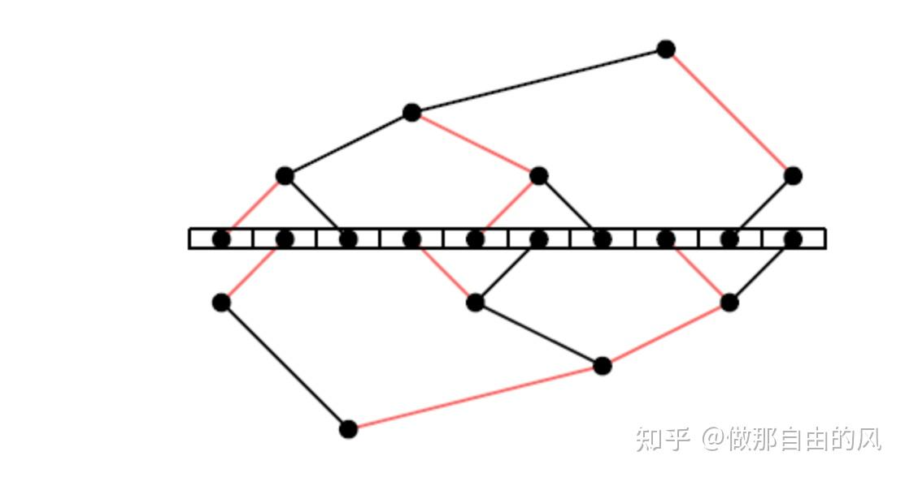

# 浅谈NCCL中nvls tree相关

**Author:** 做那自由的风

**Date:** 2025-01-20

**Link:** https://zhuanlan.zhihu.com/p/19643908346

最近一直在研究nccl(nvidia collective communication library)相关的内容，本节就简单讲讲nccl中的一些机制以及分享和NVLS TREE相关的一些内容。

本文详解nvls tree中的多步操作(以allreduce为例)如何转化为nccl中的send与Recv，并介绍了nvls tree中收发的结构。**NVLS tree本质上是机内采用NVLS，机间采用tree**。首先需要明确的是，nccl中，会为每一个rank节点(我们通常所指的GPU)分配两个proxy线程，proxyService负责进程初始化时的create和init等操作，而proxyProgress线程负责实际的send以及recv。

**本文中的部分图片来自互联网，在此不特别标注，侵权则删。**

## NVLS Tree中的多步操作如何转化为对应的send与recv

### NVLS save op

**ncclProxySaveOp**  
调用`SaveProxy`将nvls tree对应的op（**此处的op类型为ncclProxyOp\***)存入，以allreduce为例，其中操作分为  

-   从下向上的scatter中的，来自两个子节点的recv
-   从下向上的scatter中的，向父节点的send
-   从上向下的broadcast中的，向两个子节点的send
-   从上向下的broadcast中的，来自父节点的recv


  
**saveOp**  
在saveOp中，根据**不同的peer以及不同的type**(send/recv)，Op会被**放入不同的connecter**中  


  
通过调用`ncclLocalOpAppend`实现，获取ncclComm\* comm中的comm->proxyState->proxyOps中可用的OP，将传入op值赋值给其，并维持链表结构保证按序查询，其中**op->connection = connection**  

### proxyService获取op调用sendPoxyProgress/recvProxyProgress

ncclProxyProgress执行proxyProgress操作  
**ncclProxyProgress**  
通过在while循环中，`progressOps`函数执行添加的progress动作，而`ncclProxyGetPostedOps`是用来添加progress动作。（progress可理解为`sendProxyProgress`与`recvProxyProgress`的完整过程）  
注意，为了不因为频繁的导致调用`ncclProxyGetPostedOps`而出现问题，设置了计数变量proxyOpAppendCounter，当该值等于ncclParamProgressAppendOpFreq时，才执行一次`ncclProxyGetPostedOps`  
并且，当此时没有progress需要添加时，还会执行`sched_yield()`释放线程执行权。  


  
**progressOps**  
通过state判断op是否合法，若合法，则调用op->progress(...)执行，若返回结果无误，则直接另preOp = op，op = op->next，执行下一次操作(**此处op的类型为ncclProxyArgs\***)  


  
**ncclProxyGetPostedOp**  
将对应的op添加到progress中，本质上阻塞等待pool->nextOps字段被`ncclLocalOpAppend()`填充  
随后将该值赋值给state->nextOps，将其作为opIndex，通过struct ncclProxyOp\* peerOp = pool->ops+opIndex;获取当前对应的peerOp(同样由之前的saveOp填充)，调用`ProxyAppend(state, peerOp)`将op填充到state中，当填充完成后，归还该op至peer pool中(可在saveOp中被分配)  


  
该段代码用来阻塞等待pool->nextOps != -1，表明有progress  


  
该代码为将op添加到progress，其中，用added记录总共添加的op数量，for循环在此处的意义即不断从链表前向后添加op，最大一次性添加数量为ncclParamProxyAppendBatchSize()。  
**ProxyAppend**  
通过struct ncclProxyArgs\* args = \*connection->proxyAppendPtr;获取args(args对应着每一次连接，连接涉及发送双方以及type)，调用`ncclProxyOpToArgs(...)`将op转为ncclProxyArgs形式，**一个op对应着args中的一次sub**，若args为首次分配，则将其加入**state->active**链表中  


## 不同的args的执行顺序

为了研究在all\_reduce过程中，向上scatter的过程与向下broadcast过程的send/recv操作时间顺序，需要研究proxy中对于每一次args的执行顺序。

### progressOps详解

`progressOps`利用一个while循环实现，每次while循环执行时，会从state->active链表(即args链表)中，从前往后遍历，对于每一个args，执行一次其对应的`sendProxyProgress/recvProxyProgress`(注意，一次proxyProgress的执行并不意味着一次成功的send/recv)。同时，state->active链表会随着时间不断添加新的args进入，因而，所有的args的执行次数并不一致。当有args中的所有nsub均完成时，则调用`removeOp(...)`消除该args(更新链表)。  


  
以一次allreduce操作为例，在nvls tree pattern下，共调用了六次saveProxy函数，按照次序依次为，从两个子节点传来的recv，向父节点的一次send(向上的reduce\_scatter阶段)，向两个子节点的send，以及向父节点的recv，则，state->active链表构建大致示意图如下：  


  
当调用`progressOp`时，会按照次序从左往右分别执行一次proxyProgress，在send操作时，往往需要等待缓冲区准备完成才会执行`ncclIbSend`，而在recv中，往往会直接执行一次对应的`ncclIbIrecv`。因此，**虽然在broadcast阶段，三次操作的顺序为先向子节点send才向父节点recv，但实际的执行流程会是recv先于send进行。**  

## Double binary tree详解

### Double binary tree简述

在朴素Tree算法中，所有机器节点构成一棵二叉树，支持集合通信操作。假设root节点要broadcast一个消息M给所有节点，则root将M发送给子节点，其他所有节点收到M后再发送给子节点，叶节点因为没有子节点，则只会接收。朴素算法存在的问题在于叶节点只会接收，不会发送，浪费了一半带宽，因此，[double binary tree](https://zhida.zhihu.com/search?content_id=252951220&content_type=Article&match_order=1&q=double+binary+tree&zhida_source=entity)被提出，**构建两棵大小相同的树T1和T2，同时运行，各自负责消息一半**，则双向带宽均会被利用。类似图如下(10台**机器，机内仍然采用链式结构，机间采用tree**)：  



  
以四机32卡场景，我们以一次allreduce为例，可建出第一棵树T1大致如下，其中，节点间仍然为链式结构，机器间构建成tree，下图中的箭头表示向上的scatter过程  


  

### 建树过程

在`initTransportsRank(...)`中，设置pattern为NCCL\_TOPO\_PATTERN\_BALANCED\_TREE，执行`ncclTopoCompute(...)`搜索出对应的树，搜索过程暂略。  


  
随后执行`ncclTopoPreset`来进行tree连接初始化，赋值treeToParent、treeToChild0、treeToChild1，并在函数最后拷贝channel  


  
执行完preset以后，执行全局`bootstrapAllGather`同步所有节点信息，随后执行`ncclTopoPostSet`进行tree连接。  
在postset中，将所有节点的parent与child节点分别放入一个大一维数组中，第r个节点放入数组index为c\*nNodes + n。  


  
随后调用`connectTrees(...)`进行tree连接首先通过调用`ncclGetDtree(...)`建立double binary tree。ncclGetDtree首先通过ncclGetBtree获取T1的树结构，随后根据节点的个数通过shift和mirror获取T2，以四机为例，可获取类似如下图所示的double binary tree。**其中，每棵二叉树负责一半消息的收发，每个节点都能够利用双向带宽。**  


  
随后在connectTrees中，通过执行`setTreeUp(...)`和`setTreeDown(...)`建立实际的树。  
通过如下命令建立实际的nvls tree p2p连接，当前rank从treeDown接收数据，向treeUp发送数据，同时也可以从treeUp接收数据，向treeDown发送数据

```cpp
NCCLCHECKGOTO(ncclTransportP2pConnect(comm, c, NCCL_MAX_NVLS_TREE_ARITY, channel->nvls.treeDown, 1, &channel->nvls.treeUp, 2), ret, fail);
NCCLCHECKGOTO(ncclTransportP2pConnect(comm, c, 1, &channel->nvls.treeUp, NCCL_MAX_NVLS_TREE_ARITY, channel->nvls.treeDown, 2), ret, fail);
```

## NVLS详解

**机内**可以通过NVSwitch执行NVLink SHARP，简称为nvls。  
以allreduce为例，nvls主要目的在于，在broadcast阶段，将reduce后的数据写入mc buff中(multicast buffer)中，随后直接将该数据发送给NVSwitch，由NVSwitch广播到所有被添加mcHandle的device，大致示意图可如下：  


  
此处机内通信并不是我们关心的重点，故暂略。