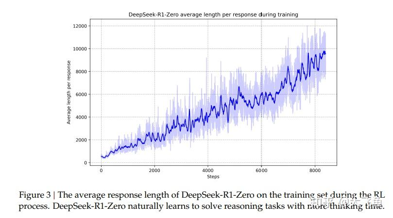
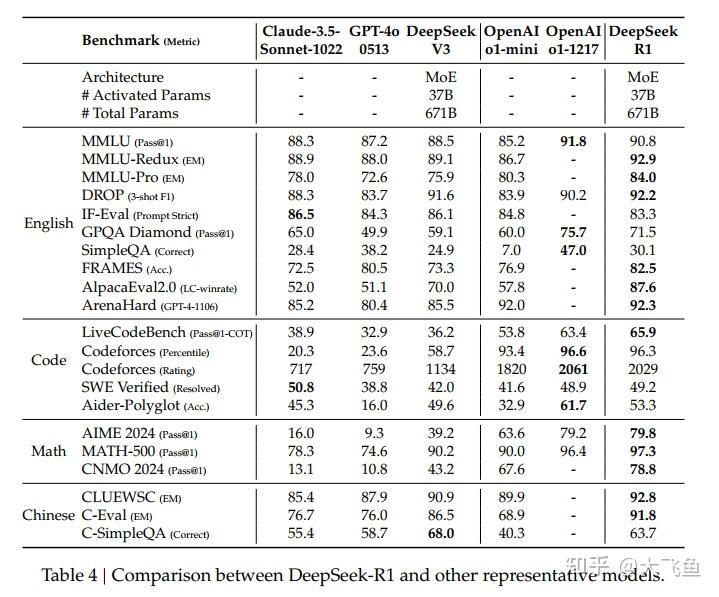

# DeepSeek-R1: Incentivizing Reasoning Capability in LLMs via Reinforcement Learning——技术报告详解

**Author:** 浮生梦晓

**Date:** 2025-01-22

**Link:** https://zhuanlan.zhihu.com/p/19787422168

论文（技术报告）地址：

[https://github.com/deepseek-ai/DeepSeek-R1/blob/main/DeepSeek\_R1.pdf​github.com/deepseek-ai/DeepSeek-R1/blob/main/DeepSeek\_R1.pdf](https://link.zhihu.com/?target=https%3A//github.com/deepseek-ai/DeepSeek-R1/blob/main/DeepSeek_R1.pdf)

上文介绍了kimi o1，但kimi没有开源，具体架构不清晰，DeepSeek-R1系列则开源了模型权重。  
kimi o1读后感：

[大飞鱼：KIMI K1.5:SCALING REINFORCEMENT LEARNING WITH LLMS——kimi o1技术报告读后感6 赞同 · 1 评论](https://zhuanlan.zhihu.com/p/19681209985) 文章

DeepSeek-R1系列:

[https://huggingface.co/deepseek-ai/DeepSeek-R1​huggingface.co/deepseek-ai/DeepSeek-R1](https://link.zhihu.com/?target=https%3A//huggingface.co/deepseek-ai/DeepSeek-R1)

## 摘要部分

主要介绍两个模型[DeepSeek-R1-Zero](https://zhida.zhihu.com/search?content_id=252979829&content_type=Article&match_order=1&q=DeepSeek-R1-Zero&zhida_source=entity)和DeepSeek-R1，区别在于Zero在进行Rl训练前没有经过监督微调。但是会存在语言混用、输出可读性差的问题。DeepSeek-R1是在RL训练之前经过了多阶段的训练及冷启动数据（冷却阶段）。同时还开源了6个基于[Qwen](https://zhida.zhihu.com/search?content_id=252979829&content_type=Article&match_order=1&q=Qwen&zhida_source=entity)和[Llama](https://zhida.zhihu.com/search?content_id=252979829&content_type=Article&match_order=1&q=Llama&zhida_source=entity)蒸馏出的密集模型（区别于V3的MOE稀疏模型）。

## 1\. 介绍

本部分强调了后训练在整个训练流程中的重要性很大，同时openai-o1的成功也证明inference-time scalling可以极大的提升模型在多种任务上的推理能力。但是o1没有开源，学术界尝试了很多方法，如强化学习训练、基于过程的奖励模型（[PRM](https://zhida.zhihu.com/search?content_id=252979829&content_type=Article&match_order=1&q=PRM&zhida_source=entity)）、蒙特卡洛树搜索以及束采样等，但以上方法都没办法达到openai-o1的水平。

这篇文章中，作者提到在后训练中会直接使用强化学习进行训练而不经过监督微调，目标就是在没有任何监督数据的情况下的探索LLM潜在的推理能力，没有监督数据可以让模型更集中在自身的推理能力上。实际中使用deepseek-V3-Base作为底座模型，使用GRPO作为RL训练框架。训练中DeepSeek-R1-Zero推理能力出色，经过数千次的RL迭代，DeepSeek-R1-Zero 在各reasoning的benchmarks上表现都好。

DeepSeek-R1-Zero缺点也很容易想到，没有经过监督微调，表达能力和语言规范性就差。为了平衡模型表达能力和推理能力，又训练了DeepSeek-R1，首先收集少量（数千）高质量数据来微调DeepSeek-V3-Base，然后进行强化学习训练推理能力（同Zero），在强化学习训练接近收敛时，对检查点进行拒绝采样得到一些监督微调数据，在混合DeepSeek-V3 的特定领域的监督微调数据一起重新监督训练DeepSeek-V3-Base 模型，训练完成后再进入一个新的强化学习训练流程，这个流程包含所有场景的提示词，最终效果接近[OpenAI-o1](https://zhida.zhihu.com/search?content_id=252979829&content_type=Article&match_order=1&q=OpenAI-o1&zhida_source=entity)\-1217。

同时本文还介绍了将DeepSeek-R1能力蒸馏到小的密集模型，主要是qwen以及llama，特别提到，蒸馏后的14B模型比qwen的qwq-32B效果要好。

### **1.1本文贡献**

贡献主要有两种，一种是后训练方法，另一种是蒸馏技术，贡献部分尊重作者，直接翻译，不加入个人理解了。

**后训练：基于Base模型的大规模强化学习训练**

-   我们直接将强化学习（RL）应用于基础模型，而**不依赖有监督微调（SFT）作为前置步骤**。这种方法使模型能够探索思维链（CoT）以解决复杂问题，从而开发出 DeepSeek - R1 - Zero。DeepSeek - R1 - Zero 展现出自我验证、反思以及生成较长思维链等能力，为研究界树立了一个重要的里程碑。值得注意的是，这是**首个通过验证表明大语言模型（LLMs）的推理能力可以纯粹通过强化学习来激发，而无需有监督微调的公开研究。**这一突破为该领域未来的发展铺平了道路。
-   我们介绍开发 DeepSeek - R1 的流程。该流程包含**两个强化学习阶段**，旨在发现更优的推理模式并与人类偏好保持一致；还包含**两个有监督微调阶段**，为模型的推理及非推理能力奠定基础。我们相信，这一流程将通过打造更出色的模型，为行业带来益处。

**知识蒸馏：小模型也能实力非凡**

-   我们证明了，**大模型的推理模式可以被提炼到小模型中，相较于小模型通过强化学习所发现的推理模式，这能带来更好的性能表现。**开源的 DeepSeek - R1 及其应用程序编程接口（API），将有助于研究界未来提炼出更出色的小模型。
-   我们利用 DeepSeek - R1 生成的推理数据，对研究界广泛使用的几个稠密模型进行了微调。评估结果表明，经过知识蒸馏的较小稠密模型在基准测试中表现卓越。DeepSeek - R1 - Distill - Qwen - 7B 在 2024 年美国数学邀请赛（AIME）上达到了 55.5% 的成绩，超过了 QwQ - 32B - Preview。此外，DeepSeek - R1 - Distill - Qwen - 32B 在 2024 年 AIME 上得分为 72.6%，在 MATH - 500 上得分为 94.3%，在 LiveCodeBench 上得分为 57.2%。这些成绩显著超越了以往的开源模型，与 o1 - mini 相当。我们向社区开源了基于 Qwen2.5 和 Llama3 系列的 15 亿、70 亿、80 亿、140 亿、320 亿和 700 亿参数规模的蒸馏模型检查点。

### 1.2 评估结果的总结

不细说了，效果很好

## 2\. 技术方法

### 2.1 总览

还是上面提到的，直接对预训练的模型进行大规模的强化学习训练，不经过监督微调，此外如果有少量高质量的监督微调数据会让最终效果更优。

### **2.2 DeepSeek-R1-Zero: 直接对Base模型进行强化学习训练**

**2.2.1 强化学习算法**

GRPO原论文：

**GRPO（Group Relative Policy OPtimization）**

图片引用自：https://arxiv.org/pdf/2402.03300

GRPO相比于[PPO](https://zhida.zhihu.com/search?content_id=252979829&content_type=Article&match_order=1&q=PPO&zhida_source=entity)少了Critic模型，节省了训练成本，通过群体得分来预估基线。

具体来说，对每一个输入 $q$ ,GRPO会基于旧策略 $\pi_{\theta_{old}}$ 会采样出一组输出 ${o_1,o_2,...o_G}$ ，之后被优化的策略模型 $\pi_{\theta}$ 目标函数为：

$\mathcal{J}_{GRPO}(\theta) = \mathbb{E}[q \sim P(Q), \{o_i\}_{i=1}^G \sim \pi_{\theta_{old}}(O|q)]  \frac{1}{G} \sum_{i=1}^G \left(\min\left(\frac{\pi_\theta(o_i|q)}{\pi_{\theta_{old}}(o_i|q)}A_i, \text{clip}\left(\frac{\pi_\theta(o_i|q)}{\pi_{\theta_{old}}(o_i|q)}, 1-\epsilon, 1+\epsilon\right)A_i\right) - \beta D_{KL}\left(\pi_\theta\|\pi_{ref}\right)\right)$

$\mathbb{D}_{KL}(\pi_\theta\|\pi_{ref}) = \frac{\pi_{ref}(o_i|q)}{\pi_\theta(o_i|q)} - \log\frac{\pi_{ref}(o_i|q)}{\pi_\theta(o_i|q)} - 1$

可以看出其和PPO区别在于Critic模型估计的Action Value上，PPO可以使用GAE进行多步估计，这里仅使用单步奖励，这里的 $A_i$ 使用一组{ $r_1,r_2,...r_G$ }表示：

$A_i = \frac{r_i - mean(\{r_1, r_2, \cdots, r_G\})}{std(\{r_1, r_2, \cdots, r_G\})}$

GRPO本身比较简单，是PPO的简单变体，不了解TRPO和PPO的可以去B站搜索张伟楠老师的[强化学习课程第10讲。](https://link.zhihu.com/?target=https%3A//www.bilibili.com/video/BV1jUHdePEUZ/%3Fspm_id_from%3D333.1387.upload.video_card.click)

Template for DeepSeek-R1-Zero提示词：

**2.2.2 奖励模型**

强化学习训练中没有了Critiv模型来预测Action Value，那么奖励模型就很重要了，训练过程中有两种类型的**基于规则的奖励模型**：

1.准确性奖励：评估回答是否正确。

2.格式奖励：强制模型将思考过程放在<think>和</think>之中。

值得一提是DeepSeek-R1在训练过程中没有用到之前很火的PRM（过程奖励）和ORM（结果奖励），一点是训练奖励模型很耗费资源，另一点是在RL训练过程中很容易遭遇奖励破解的问题。第一点都很清楚，需要人工标注数据再经过对比学习训练奖励模型，成本较高。第二点则表示奖励模型很容易出现错误奖励情况（毕竟不是规则模型）。

**2.2.3 训练格式**

**见上表1图**

**2.2.4 DeepSeek - R1 - Zero 的性能、自我进化过程与顿悟时刻**

**效果**

**DeepSeek-R1-Zero的自我进化过程**  
一般RL训练是没有经过监督微调喂数据（监督微调在强化学习广义上称为行为克隆，是奖励值为1的专家学习），所以RL训练过程也称为自我进化过程。

在图3（上图）中可以看到，随着RL训练迭代次数的增加，模型的回复长度也逐渐增加，意味着模型开始学到了反思与探索等推理思维链来解决复杂问题，作者表示这种行为是自发产生的，没有经过明确的编程设定（之前提到的奖励函数没有对长度的奖惩规则，只有对格式和最终结果的规则约束），的确amazing。

**DeepSeek-R1-Zero的顿悟时刻**

这个发现也是很有意思，在强化学习训练过程中，作者发现模型会有个“顿悟”时刻，即模型会自己重新评估初始解题思路，学会为某个问题分配更多的思考时间。

在这里插入一句题外话，之前绝大多数类o1模型都有一个通识，即先通过长思维链的监督微调让模型有一定的自我反思和问题分解能力，再使用蒙特卡洛树等搜索方法进行RL训练，但这里提到的“顿悟”是在强化学习之前根本没有进行任何监督微调，完全是模型自己学会的自我反思和问题推理能力，的确是个很震惊的发现。也进一步展示了强化学习才是实现AGI的根本（这句话是我自己说的）。

然后作者花了一段话来歌颂强化学习，直接翻译过来，大家一起来感受作者字里行间对于这个现象的震惊：

> 这一时刻不仅是模型的 “顿悟时刻”，对观察其行为的研究人员来说亦是如此。它凸显了强化学习的强大与美妙之处：我们并非直接教导模型如何解决问题，而只是给予其恰当激励，它便能自主形成先进的解题策略。“顿悟时刻” 有力地提醒我们，强化学习有潜力开启人工智能系统新的智能层级，为未来开发出更具自主性和适应性的模型铺平道路。

作者给出了一个例子，模型的“顿悟”，红色部分是模型用拟人化的口吻描述出自己“悟了”：

**DeepSeek-R1-Zero的缺点**

之前提到的，没有监督微调，虽然推理能力提升了很高，但是其他能力很差。

### 2.3 DeepSeek-R1：强化学习和冷启动

冷启动是什么后面会提，**可以理解成少量但高质量推理任务的监督微调数据**，主要是平衡Zero出色的推理能力和糟糕的表达能力。

**2.3.1 冷启动**

说白了冷启动对应到强化学习中就是在一开始训练时智能体策略决策能力很差，所以需要很长一段时间试错才能具有一定的决策能力，放到LLM训练中就是没有经过监督微调的LLM直接来进行RL训练会导致LLM在一开始的一段时间内推理能力很差，很容易造成训练过程的不稳定，所以需要给LLM稍微微的喂一点高质量的监督微调数据，让LLM在一开始就用有一定的推理能力，但是不要很多，因为本文核心就是感觉监督微调数据污染了模型本身的决策能力，所以才在预训练后直接进行强化学习训练的。

冷启动数据的优点：可读性和潜力，可读性就是模型输出人话了，不是乱七八糟的语言需要模型隐空间去理解的内容。潜力就是加入后模型效果更好了也就是R1比R1-Zero效果更好。

**2.3.2 面向推理的强化学习**

使用冷启动数据进行监督微调训练后再进行GRPO的强化学习训练，这里奖励模型中增加了语言一致性的奖励，模型性能有所下降，但是回复的内容可读了。

**2.3.3 拒绝采样和监督微调**

在2.3.2强化学习训练收敛之后会得到模型的checkpoint（检查点），通过这个检查点可以蒸馏出带推理能力的监督微调数据，再结合多领域的监督微调数据。

**Reasoning data**

推理数据从2.3.2强化学习训练收敛的模型检查点进行拒绝采样蒸馏获取，拒绝采样可以理解成一种下采样就行，蒸馏出的数据不局限在之前基于规则的奖励模型中，包含各领域的数据，使用DeepSeek-V3 作为奖励模型来进行判断。最终收集了60w与推理相关的数据集训练样本。

**Non-Reasoning data**

非推理数据集使用DeepSeek-V3的监督问题数据集，大概20w个样本。

一共80w样本对DeepSeek-V3-Base微调2个epoch。

**2.3.4 所有场景的强化学习**

使用2.3.3监督微调后的模型进行第二阶段的强化学习训练，对于推理数据集仍然使用基于规则的奖励模型，对于非推理数据集则使用基于神经网络的奖励模型（deepseek-V3）来对齐人类偏好。

整个R1的训练思路比较绕，文章中也没有给出对应的流程图，相对与Zero来说比较复杂，画了个图辅助理解（个人理解）：

综合以上的训练流程可以发现，R1的训练步骤与当前主流方案有着明显差别，而且第一次经过监督微调和强化学习训练的V3-Base模型只是做为蒸馏推理数据的功能（预感后期会有其他效率提升方案）。

谈一下个人对于以上R1训练流程这样设计的理解（个人理解，仅供参考）：

-   首先，R1的出现是为了平衡R1-Zero出色的推理能力和糟糕表达能力而训练的，那势必要加入监督微调数据来提升底座Base模型的表达能力。而且作者应该也发现不加入冷启动数据直接对Base模型进行RL训练最开始会有很长一段时间模型才能有提升，这也是强化学习训练一个共性，即智能体最开始RL训练需要很长时间去试错才能学到一些策略决策能力，所以才会选择加入冷启动数据后再进行强化学习训练，一是为了训练提效，二是为了后面拒绝采样的时候模型可以输出一些高质量推理数据。
-   其次，之前说过监督微调在强化学习中广义上可以看做行为克隆的专家数据，本质上来说就是用这些监督微调数据让模型可以预先有一定从策略决策能力（基于提示词分布选择next token的能力），再进行强化学习，所以在以往的各开源模型的训练范式都会先经过监督微调后再进行强化学习训练。虽然这里R1-Zero发现了不经过监督微调模型也可以出现“顿悟”的情况，但R1的训练又不可避免的回到了先监督微调再RL的路子上（图的后半部分）。
-   再一点，虽然R1训练也是先SFT再RL，但作者们其实刻意控制着SFT数据集的质量和数量，原因就是想保持R1-Zero中发现的模型在RL时所表现出的“顿悟”能力，避免低质量庞杂的SFT数据污染到模型本身从而失去“顿悟”能力。
-   拒绝采样获得推理数据应该很容易理解，就是想让第二阶段强化学习有一个比较高的推理能力起点，同时保持第一步RL时策略梯度的优化方向。加入非推理数据集是为了让模型有不错表达能力，因为加入了非推理数据就必须在RL时引入基于LLM的奖励模型来对其人类偏好。

### 2.4 蒸馏：将推理能力蒸馏到小模型中

用DeepSeek-R1生成80w样本来微调Qwen和Llama，蒸馏过程中只进行SFT，不进行RL训练，RL后肯定更好，但作者这里仅想看蒸馏的后SFT的效果。

## 3\. 实验

实现部分不再赘述，反正效果肯定很好，放几张图。

这里主要是拿蒸馏后小模型和QwQ-32B-Preview对比。

## 4.讨论

### 4.1 蒸馏和强化学习

从前面实验可以看到，蒸馏出的小模型表现效果也很好，作者又考虑到一个问题：不进行蒸馏，直接使用大规模强化学习训练能不能取得相近的效果，作者用Qwen-32B-Base模型仿照R1-Zero的RL训练过程训练出了DeepSeek-R1-Zero-Qwen-32B，可以发现，效果与QwQ-32B-Preview相似，但与蒸馏的32B模型相比较差，所以作者得出两个结论：首先，将更强大的模型蒸馏为较小的模型会产生出色的结果，而依赖本文所述大规模强化学习的较小模型需要巨大的计算能力，甚至可能无法达到蒸馏所能达到的性能。其次，虽然蒸馏策略既经济又有效，但要突破智能的边界可能仍然需要更强大的基础模型和更大规模的强化学习。

说白了强化学习训练是对更智能的模型才有效。

### 4.2 不成功的尝试

这部分比较有意思，在训练R1的时候也进行了热度比较高的PRM和[MCTS](https://zhida.zhihu.com/search?content_id=252979829&content_type=Article&match_order=1&q=MCTS&zhida_source=entity)尝试，但是效果不佳，这部分给出了一些实验中发现的问题。

首先是PRM（Process Reward Model），作者发现其存在3个局限性，首先，在一般推理中，要明确界定一个细粒度的步骤颇具挑战性。其次，判断当前中间步骤是否正确是一项艰巨的任务。使用模型进行自动标注可能无法产生令人满意的结果，而手动标注不利于大规模应用。第三，一旦引入基于模型的过程奖励模型PRM，就不可避免地会导致奖励操纵问题，并且重新训练奖励模型需要额外的训练资源，这会使整个训练流程变得更为复杂。

其次是蒙特卡洛树搜索MTCS（Monte Carlo Tree Search）,主要是token的搜索空间太大，如果进行约束会容易陷入局部最优解，而且细分粒度不好明确，这也是MTCS的一个通病。

个人理解来说，无论是PRM还是蒙特卡洛树搜索本身是一个特定领域优化方案，对于R1这种通用性的推理强化学习训练来说不具有普适性，很难进行区分问题推理粒度来构建搜索树或构建过程奖励，因此其他论文中针对二者的讨论很多局限在编码或数学领域特定问题上。

## 5.总结

略过了，前面都提到了。