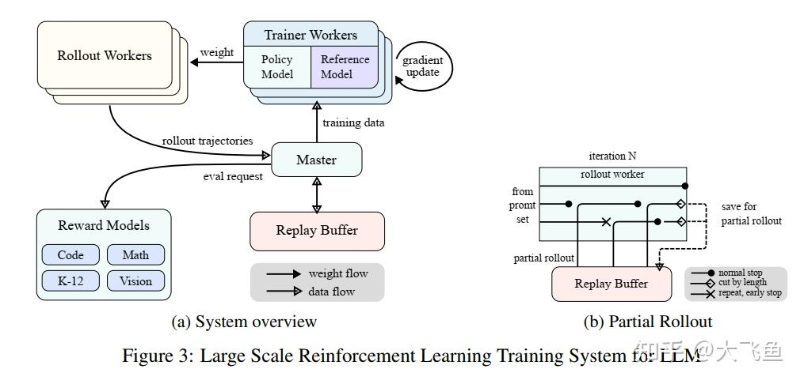
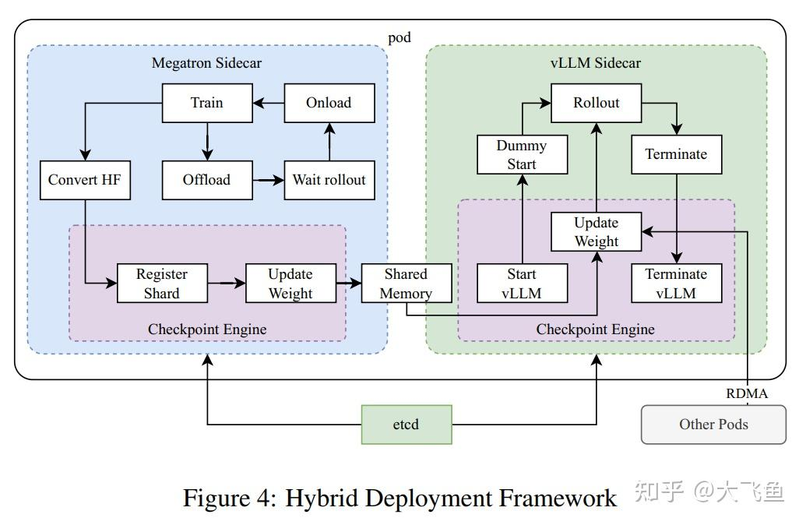
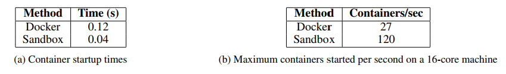
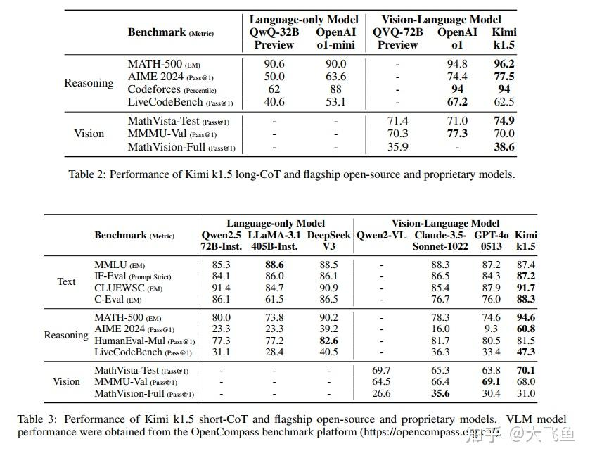
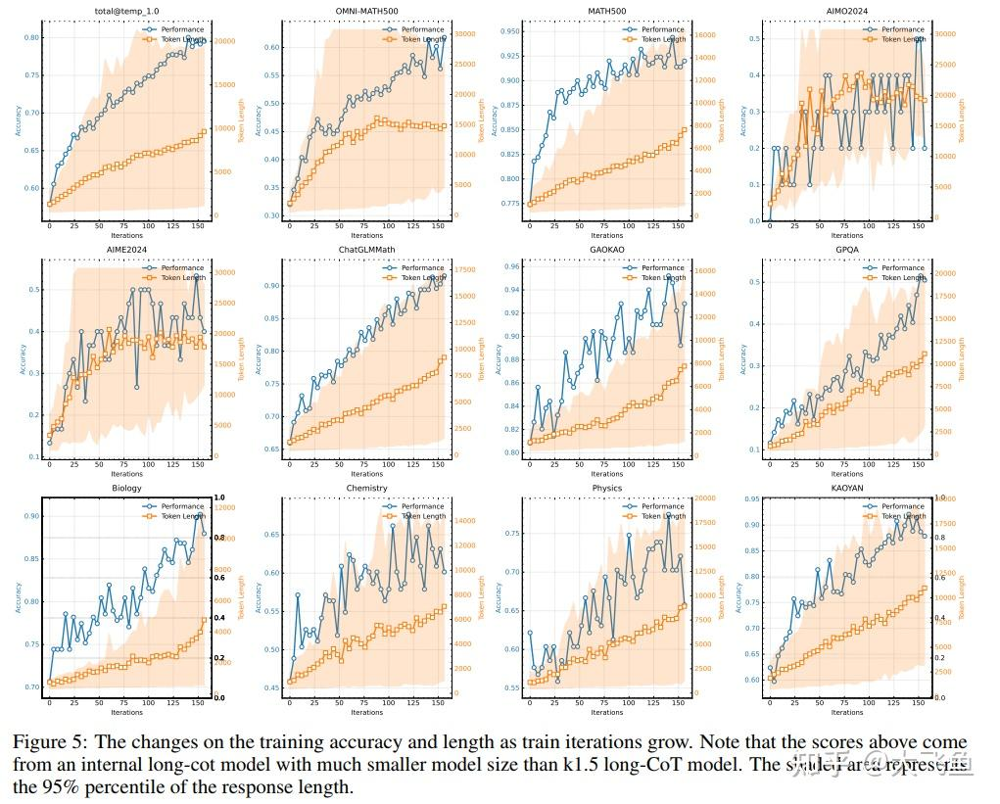
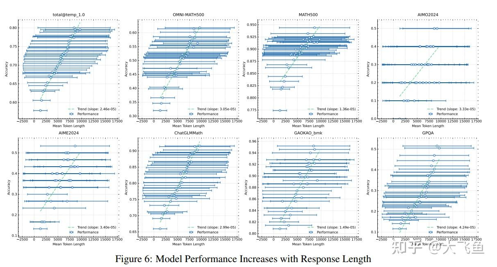
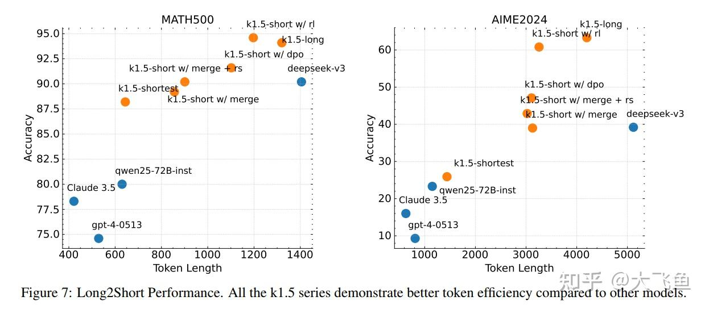

# KIMI K1.5:SCALING REINFORCEMENT LEARNING WITH LLMS——kimi o1技术报告详解

**Author:** 浮生梦晓

**Date:** 2025-01-22

**Link:** https://zhuanlan.zhihu.com/p/19681209985

### DeepSeek-R1读后感:

### 本文核心观点：

-   [多模态模型](https://zhida.zhihu.com/search?content_id=252958617&content_type=Article&match_order=1&q=%E5%A4%9A%E6%A8%A1%E6%80%81%E6%A8%A1%E5%9E%8B&zhida_source=entity)。
-   没有用花里胡哨的[蒙特卡洛树搜索](https://zhida.zhihu.com/search?content_id=252958617&content_type=Article&match_order=1&q=%E8%92%99%E7%89%B9%E5%8D%A1%E6%B4%9B%E6%A0%91%E6%90%9C%E7%B4%A2&zhida_source=entity)、价值函数或者PRM。
-   [长上下文](https://zhida.zhihu.com/search?content_id=252958617&content_type=Article&match_order=1&q=%E9%95%BF%E4%B8%8A%E4%B8%8B%E6%96%87&zhida_source=entity)是主导。
-   技术报告只集中在RL部分。  
    [论文地址](https://link.zhihu.com/?target=https%3A//github.com/MoonshotAI/kimi-k1.5)

## 1.引言

K1.5的设计和RL训练的关键要素：

-   长上下文扩展：将RL的上下文长度扩展到128K，这里用到的一个高效训练的设计方案是“[部分回滚](https://zhida.zhihu.com/search?content_id=252958617&content_type=Article&match_order=1&q=%E9%83%A8%E5%88%86%E5%9B%9E%E6%BB%9A&zhida_source=entity)”。
-   改进策略优化：推导出了一种结合长思维链的强化学习公式，采用一种[在线镜像下降法](https://zhida.zhihu.com/search?content_id=252958617&content_type=Article&match_order=1&q=%E5%9C%A8%E7%BA%BF%E9%95%9C%E5%83%8F%E4%B8%8B%E9%99%8D%E6%B3%95&zhida_source=entity)的变体来进行稳健的策略优化。通过我们有效的采样策略、长度惩罚以及数据配方优化，该算法得到了进一步改进。
-   简单化的框架：只要将上下文长度扩展到一定规模，可学习的思维链就可以展现出规划、反思、修正等特性。
-   多模态特性

文章中还提到一个重要方法：long2short，即使用长[CoT技术](https://zhida.zhihu.com/search?content_id=252958617&content_type=Article&match_order=1&q=CoT%E6%8A%80%E6%9C%AF&zhida_source=entity)来提高段CoT的模型能力，主要是模型融合以及长Cot激活值惩罚。

## 2.RL with LLMs

K1.5的训练阶段：预训练、普通监督微调、[长CoT监督微调](https://zhida.zhihu.com/search?content_id=252958617&content_type=Article&match_order=1&q=%E9%95%BFCoT%E7%9B%91%E7%9D%A3%E5%BE%AE%E8%B0%83&zhida_source=entity)以及RL，这篇技术报告集中在RL部分，其他部分篇幅较少。

### 2.1 强化学习提示集

强化学习的提示词对于强化学习训练至关重要，高质量的强化学习提示集具有三个特性：

-   覆盖领域多样；
-   均衡的困难度配比，包含容易、中等、困难的问题。
-   准确性评估：让模型正确推理，而不是瞎猜。

实现第一个特性就是领域数据配比，尽可能多领域数据。

实现第二个特性是通过让模型对提示词打分筛选难易度。

实现第三个特性是让模型在没有CoT情况下尝试N次推理，如果猜对了答案就删除这个样本。

### 2.2 长CoT监督微调

这部分数据集基于上面构建的RL数据集，类似于对上面数据集的拒绝采样，最终的CoT满足类人般思考：

-   planning
-   evaluation
-   reflection
-   exploration

### 2.3 RL

本文的核心内容部分，主要分为：问题设置、策略优化、长度惩罚、采样策略以及其他的训练技巧。

**1.问题设置**

思想：直接根据输入得到输出难度较大，但增加了思考后相当于通过输入以及思考去得到输出值，这样思考过程作为中间桥梁使得模型得到正确输出。

planning方法：显式构建一个思考过程的搜索树，使得模型能够探索思维过程的多种延续方式，或者在遇到死胡同时回溯，探索新的方向。

上面的显式构建搜索树就是蒙特卡洛树搜索的过程，本质上来说每一个树节点都是CoT的一部分，那么如果模型上下文足够长，根本无需显式构建树搜索，直接在推理空间中进行隐式搜索。

（这里的意思是在部署时不需要复杂的并行方案如[Beam Search](https://zhida.zhihu.com/search?content_id=252958617&content_type=Article&match_order=1&q=Beam+Search&zhida_source=entity)，[Best of N](https://zhida.zhihu.com/search?content_id=252958617&content_type=Article&match_order=1&q=Best+of+N&zhida_source=entity)，[Look ahead](https://zhida.zhihu.com/search?content_id=252958617&content_type=Article&match_order=1&q=Look+ahead&zhida_source=entity)等方法）

经过以上思考，论文提出了优化的策略目标：

$\max_{\theta} \mathbb{E}_{(x,y^*) \sim \mathcal{D}, (y,z) \sim \pi_\theta} [r(x,y,y^*)]$

其中：

$z \sim \pi_\theta(\cdot|x)$

$y \sim \pi_\theta(\cdot|x,z)$

$r(x,y,y^*) \in \{0,1\}$

  

**2.策略优化**

用到的强化学习方法是在线策略镜像优化的变体算法。

在线策略镜像优化算法：

$\max_{\theta} \mathbb{E}_{(x,y^*) \sim \mathcal{D}} [\mathbb{E}_{(y,z) \sim \pi_\theta} [r(x,y,y^*)] - \tau \text{KL}(\pi_\theta(x)\|\pi_{\theta_i}(x))]$  
上面算法存在一个闭式解：

$\pi^*(y,z|x) = \pi_{\theta_i}(y,z|x)\exp(r(x,y,y^*)/\tau)/Z$  

闭式解推理过程其实与[DPO](https://zhida.zhihu.com/search?content_id=252958617&content_type=Article&match_order=1&q=DPO&zhida_source=entity)中简化[PPO](https://zhida.zhihu.com/search?content_id=252958617&content_type=Article&match_order=1&q=PPO&zhida_source=entity)的过程一般无二。  
闭式解的推理过程（只写第一个中括号里的内容变化）：

$\mathbb{E}_{(y,z) \sim \pi_\theta} [r(x,y,y^*)] - \tau \text{KL}(\pi_\theta(x)\|\pi_{\theta_i}(x))$

$= \mathbb{E}_{(y,z) \sim \pi_\theta} [r(x,y,y^*) - \tau \log\frac{\pi_\theta(x)}{\pi_{\theta_i}(x)}]$

$= \mathbb{E}_{(y,z) \sim \pi_\theta} [\frac{1}{\tau}r(x,y,y^*) - \log\frac{\pi_\theta(x)}{\pi_{\theta_i}(x)}]$

$= -\mathbb{E}_{(y,z) \sim \pi_\theta} [\frac{\pi_\theta(x)}{\pi_{\theta_i}(x)}e^{r(x,y,y^*)/\tau}]$

在这里定义：

$\pi^*(y,z|x) = \pi_{\theta_i}(x)e^{r(x,y,y^*)/\tau}/Z$

$Z = \sum_{y',z'} \pi_{\theta_i}(y',z'|x)\exp(r(x,y',y^*)/\tau)$

代入上面推导式中：

$= -\mathbb{E}_{(y,z) \sim \pi_\theta} [\frac{\pi_\theta(x)}{\pi^*(y,z|x)}] - \log Z$  
$Z$ 是一个常数，

$= -\text{KL}(\pi_\theta(x)\|\pi^*(y,z|x))$

因此最初的：

$\max_{\theta} \mathbb{E}_{(x,y^*) \sim \mathcal{D}} [\mathbb{E}_{(y,z) \sim \pi_\theta} [r(x,y,y^*)] - \tau \text{KL}(\pi_\theta(x)\|\pi_{\theta_i}(x))]$

简化成了：  
$\min_{\theta} \mathbb{E}_{(x,y^*) \sim \mathcal{D}}[\text{KL}(\pi_\theta(x)\|\pi^*(y,z|x))]$

可以得到我们最终的目标就是找到最优策略 $\pi^*(y,z|x)$ 。  
由 $\pi^*(y,z|x) = \pi_{\theta_i}(x)e^{r(x,y,y^*)/\tau}/Z$ 可以推出：

$r(x,y,y^*) - \tau \log Z = \tau \log \frac{\pi^*(y,z|x)}{\pi_{\theta_i}(y,z|x)}$  
在最优的策略场景下应该满足以上的等式，所有可以使用最小二乘法进行逼近，因此可以获得一个新的目标函数：

$L(\theta) = \mathbb{E}_{(x,y^*) \sim \mathcal{D}}\left[\mathbb{E}_{(y,z) \sim \pi_{\theta_i}}\left[\left(r(x,y,y^*) - \tau \log Z - \tau \log \frac{\pi_\theta(y,z|x)}{\pi_{\theta_i}(y,z|x)}\right)^2\right]\right]$  
其梯度为：

$\frac{1}{k}\sum_{j=1}^k \left(\nabla_\theta \log \pi_\theta(y_j, z_j|x)(r(x, y_j, y^*) - \bar{r}) - \frac{\tau}{2}\nabla_\theta\left(\log \frac{\pi_\theta(y_j, z_j|x)}{\pi_{\theta_i}(y_j, z_j|x)}\right)^2\right)$

观察其梯度可以发现，后面一项是一个正则项约束，前面则为强化学习中策略梯度定理中引入优势后的变体。

对于难度越大的问题，其 $(r(x, y_j, y^*) - \bar{r})$ 一项越大，会使得梯度提升的更大。

**3.长度惩罚**

使用上面损失函数做RL训练时发现模型的输出长度会变得很长，因为思考过程较长，虽然最终结果较好 ，但是思考长度太长会让训练和推理变得很低效。因此引入了长度奖励，来约束模型生成长度。

假设在输入 $x$ 情况下有 $k$ 个生成，分别为 $y_1,y_2....y_k$ ，设 $min\_len = \min_i \text{len}(i)$ ， $max\_len = \max_i \text{len}(i)$ ，则长度奖励函数为：

$len\_reward(i) = \begin{cases}  \lambda & \text{If } r(x, y_i, y^*) = 1 \\ \min(0, \lambda) & \text{If } r(x, y_i, y^*) = 0 \end{cases}, \text{ where } \lambda = 0.5 - \frac{len(i) - min\_len}{max\_len - min\_len}$

可以看到，输出值正确但长度过长时也会收到一个惩罚值，输出值错误时会明确进行惩罚。

作者也提到长度惩罚在训练的初始阶段会减缓训练速度，为了缓解这个问题，作者在训练过程中逐步递进的加入长度惩罚。

**4.采样策略**

通过观察目标函数梯度可以发现一方面对于困难样本会大幅度提升梯度，增加效率训练，同时结合[TRPO](https://zhida.zhihu.com/search?content_id=252958617&content_type=Article&match_order=1&q=TRPO&zhida_source=entity)及PPO内容我们知道初始模型策略能力较差，过高的奖励很容易造成训练的坍塌，因此训练样本的采样十分重要。

本文中作者提到两种采样策略。

1.课程采样：样本从简单到困难，符合常识。

2.优先采样：重点关注模型表现能力较差的样本上，这部分是通过追踪样本成功率实现的，对于每个样本 $i$ ,采样多次生成多次后成功率为 $s_i$ ,则按照 $1-s_i$ 的正比采样，这样对于成功率低的问题有更高的采样概率。

**5.训练方法的更多细节**

1.编程测试用例生成：用[CYaRon1](https://zhida.zhihu.com/search?content_id=252958617&content_type=Article&match_order=1&q=CYaRon1&zhida_source=entity)生成了一些编程样例纳入了训练集。

2.数学的奖励模型，主要有两种：经典奖励模型（输出一个单一标量）、思维链奖励模型（有推理过程，性能超过经典奖励，输出为JSON格式）。

3.视觉数据来源有三个类别：真实世界数据、合成视觉推理数据（通过程序创建的图像和场景）和文本渲染数据（通过文本文档、代码片段和结构化数据等组成为图像）。

### 2.4 Long2Short：为短CoT模型进行的上下文压缩

长CoT模型表现很好，但是会消耗更多推理资源。作者提出了一些将长CoT转为短CoT的方法：模型融合、最短拒绝采样、DPO以及long2short RL。论文里写的也就是几句话（实际上也没啥好讲的，都是启发式方法），下面直接翻译过来。

1.模型融合 研究发现，模型融合有助于保持泛化能力。我们还发现，在融合长思维链模型和短思维链模型时，它对提高令牌效率很有效。这种方法将长思维链模型与短思维链模型相结合，无需训练即可得到一个新模型。具体来说，我们只需对两个模型的权重求平均，就能实现模型融合。

2.最短拒绝采样 我们观察到，对于同一个问题，我们的模型生成的回答长度差异很大。基于此，我们设计了最短拒绝采样方法。该方法对同一个问题采样 n 次（在我们的实验中，n = 8），然后选择最短的正确回答用于有监督微调。

3.直接偏好优化（DPO） 与最短拒绝采样类似，我们利用长思维链模型生成多个回答样本。选择最短的正确答案作为正样本，而较长的回答则被视为负样本，其中既包括错误的较长回答，也包括正确但长度超过所选正样本 1.5 倍的较长回答。这些正负样本对构成了用于直接偏好优化训练的成对偏好数据。

4.长到短强化学习 在标准的强化学习训练阶段之后，我们会挑选一个在性能和令牌效率之间达到最佳平衡的模型作为基础模型，然后开展一个单独的长到短强化学习训练阶段。在这个第二阶段中，我们采用 2.3.3 节中提到的长度惩罚机制，并大幅缩短最大展开长度，以进一步惩罚那些虽可能正确但超出期望长度的回答。

### 2.5 其他训练细节

**1.预训练**

语言数据领域：英语、中文、代码、数学推理和知识。

多模态数据：图像字幕、图文混合、光学字符识别、知识和QA数据集。

预训练过程的三个阶段：

1.  视觉-语言预训练：先建立坚实的语言基础，随后逐步进行多模态整合；
2.  冷却阶段：利用精心整理和合成的数据巩固模型能力，尤其针对推理和基于知识的任务；
3.  长上下文激活：将序列处理长度扩展到 131,072 个token；

**2.基本监督微调**

对于数学和编程任务使用规则或者奖励模型来验证后扩充到监督微调数据集，非推理任务则使用模型生成多个回答，人工排序优化。

训练分为两个阶段：

1.  第一阶段：32000token上下文，lr从2\*10-5衰减到2\*10-6（未说明调度器类型）。
2.  第二阶段：128000token上下文，lr从1_10-5衰减到2\*_10-6

### 2.6 RL架构

**1.LLM的大型RL训练系统**

如上图a所示，整体由一个中央控制器Master控制着强化学习训练中的数据采集、评估以及模型的训练。

**2.长思维链RL的部分展开**

这部分论文中没有写很清楚，仅几段文字，结合论文内容和个人分析（未必正确）。  
如上图b所示，[Replay Buffer](https://zhida.zhihu.com/search?content_id=252958617&content_type=Article&match_order=1&q=Replay+Buffer&zhida_source=entity)存在的意义肯定是复用之前的轨迹数据，对于第N次迭代来说属于off policy

, 但第N次迭代本身的数据是属于on policy的，单次训练不会只用本次迭代的这一点on policy数据，需要从Replay Buffer中提取部分轨迹来形成高效的复用。

另外一点，长上下文的强化学习训练十分占用系统资源，实际运行过程中肯定不是单个线程或进程运行，如上图b中可能存在3个进程同时处理长上下文，有的长度过长，而有的会短一些，为了系统资源合理运用会设置一个阈值，超过的长上下文会截断后放在Replay Buffer中，等下轮迭代时使用（还是涉及到了迭代推理），对于短上下文在处理完后为了高效性会从Replay Buffer中选择之前截断存储的轨迹数据（应该还复用对应的之前轨迹缓存）。

对于重复轨迹也会判断后提前停止，然后从Replay Buffer中选择之前截断存储的轨迹数据训练。

### 3.训练和推理的混合部署

RL训练过程，直接翻译：

**训练阶段：**最初，[Megatron](https://zhida.zhihu.com/search?content_id=252958617&content_type=Article&match_order=1&q=Megatron&zhida_source=entity)和 [vLLM](https://zhida.zhihu.com/search?content_id=252958617&content_type=Article&match_order=1&q=vLLM&zhida_source=entity)在单独的容器中执行，由一个名为检查点引擎的中间进程封装。Megatron 启动训练过程。训练完成后，Megatron 卸载 GPU 内存，并准备将当前权重传输给 vLLM。

**推理阶段：**在 Megatron 完成卸载后，vLLM 使用虚拟模型权重启动，并通过 Mooncake（用从 Megatron 传输过来的最新权重进行更新。部署完成后，检查点引擎会终止所有 vLLM 进程。

**后续训练阶段：**一旦释放分配给 vLLM 的内存，Megatron 就会重新加载内存并启动新一轮训练。

训练中的一些问题：

-   **复杂的并行策略**：Megatron 和 vLLM 可能采用不同的并行策略。Megatron 中分布在多个节点的训练权重，要与 vLLM 共享颇具挑战。
-   **最小化 GPU 资源闲置**：对于同策略强化学习（On - Policy RL），诸如 SGLang和 vLLM 等最新研究，在训练过程中可能会预留一些 GPU，这反而会导致训练所用的 GPU 闲置。若能在训练和推理过程中共享相同设备，效率会更高。
-   **动态扩展能力**：在某些情况下，在保持训练进程不变的同时增加推理节点数量，可显著提升速度。我们的系统能够在需要时有效利用闲置的 GPU 节点。

**4\. 代码沙盒**

主要特点：部署在Kuberbetes上，相关技术包括（直接翻译）：

・使用 Crun：我们使用 crun 替代 Docker 作为容器运行时，显著缩短了容器启动时间。

・Cgroup 复用：我们预先创建供容器使用的 cgroup，在高并发场景中，为每个容器创建和销毁 cgroup 可能成为瓶颈，此时这种做法至关重要。

・磁盘使用优化：使用将上层挂载为 tmpfs 的覆盖文件系统来控制磁盘写入，提供固定大小的高速存储空间。这种方法对临时工作负载很有帮助。

## 3.实验

可以看到，在多个任务上下文长度和表现称正相关。

图6中横坐标不清楚为什么会存在负值。

后面的实验结果不再赘述了。

附录阶段也没有啥太有用的信息，主要是一些预训练数据组合等。