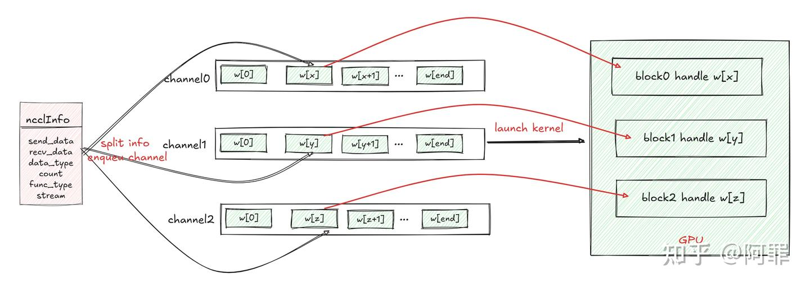
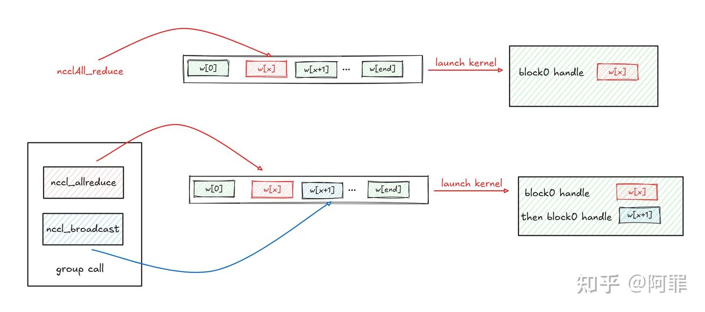
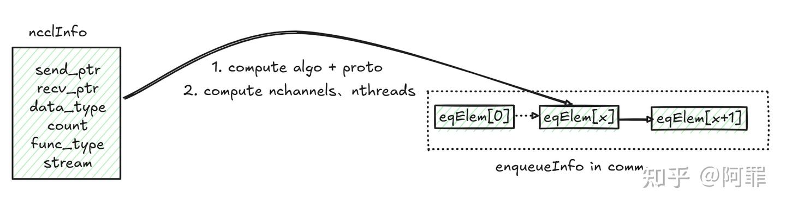
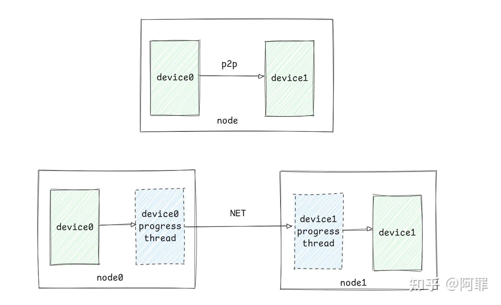
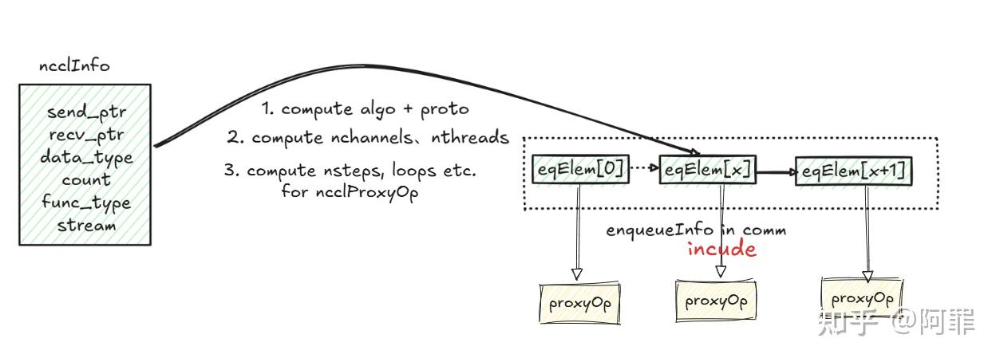
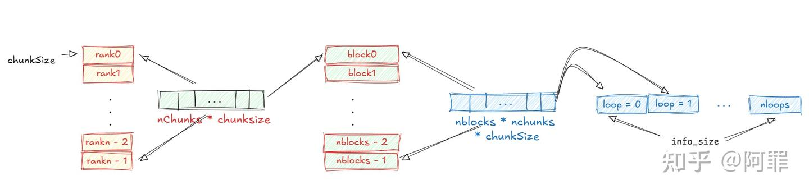
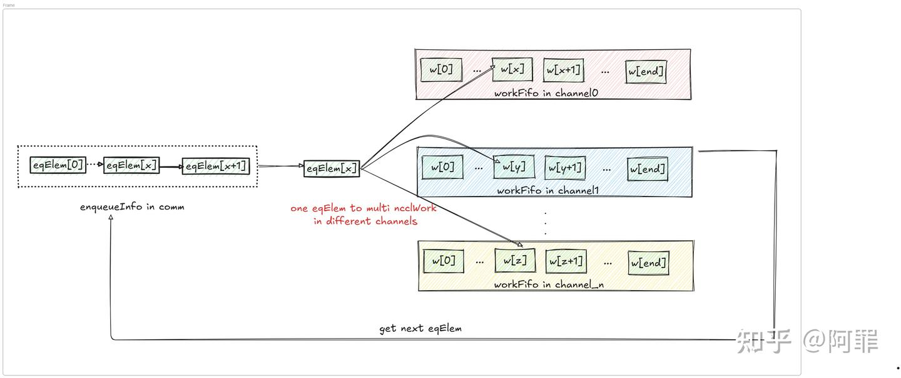
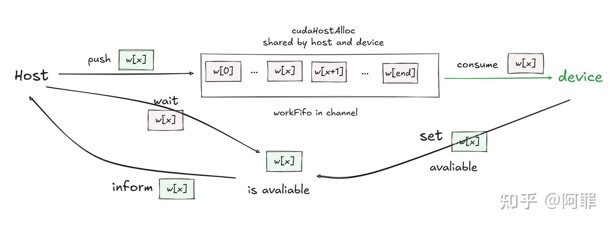
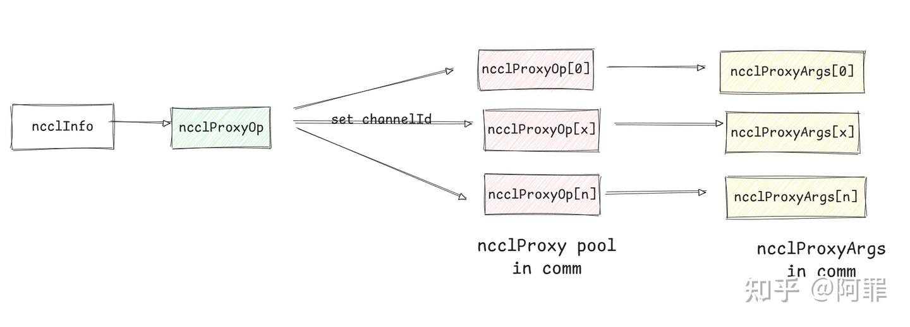
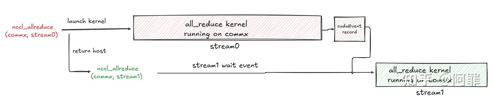

# NCCL all_reduce host调用流程

**Author:** 阿罪

**Date:** 2025-01-22

**Link:** https://zhuanlan.zhihu.com/p/17626627975

NCCL在调用不同collective op操作时，流程一致。以[all\_reduce](https://zhida.zhihu.com/search?content_id=252547307&content_type=Article&match_order=1&q=all_reduce&zhida_source=entity)为例说明，源码如下：

```cpp
ncclResult_t ncclAllReduce(const void* sendbuff, void* recvbuff, size_t count,
    ncclDataType_t datatype, ncclRedOp_t op, ncclComm* comm, cudaStream_t stream) {
  NVTX3_FUNC_RANGE_IN(nccl_domain);
  struct ncclInfo info = { ncclFuncAllReduce, "AllReduce",
    sendbuff, recvbuff, count, datatype, op, 0, comm, stream, /* Args */
    ALLREDUCE_CHUNKSTEPS, ALLREDUCE_SLICESTEPS };
  return ncclEnqueueCheck(&info);
}
```

主要流程如下：

1.  用户输入信息（collective op type, data, stream）封装成`ncclInfo` info
2.  根据info信息计算、转化到`comm->channel->workFifo`队列中，并决定kernel launch的参数
3.  launch kernel，kernel在workFifo队列中取data，然后做对应的操作



输入info，入队，launch kernel

用户调用nccl collective api就会launch对应的nccl kernel（先不考虑cuda graph和nccl Aggregated call），那很显然，就是需要设置kernel launch的参数（grid, block, kernel参数等）

lbnccl的kernel形式如下：：call就是将用户的多次nccl api call合并到一次kernel launch（相当于会有多个work，block会一个一个work的去处理），具体可见[Aggregated Operations](https://link.zhihu.com/?target=https%3A//docs.nvidia.com/deeplearning/nccl/user-guide/docs/usage/groups.html%23aggregated-operations-2-2-and-later)



aggregated call

nccl的kernel形式如下：

```cpp
__global__ void NCCL_KERN_NAME(func, algo, proto, devredop, type)(struct ncclDevComm* comm, struct ncclWorkElem first)
```

`ncclWorkElem` 是kernel操作的基本元素，保存collective op的所有信息、以及bid（由哪个blockId来处理这个work elment）；

`ncclDevComm` 主要包含`ncclChannel`，channel是nccl中第二重要的数据结构（第一是comm\_t,hhh）

1.  每个comm有固定数目的channel，每个channel由一个block来处理，多个block并行处理多个channel中的work element；
2.  channel中有一个workFifo，保存work element

先忽略掉`first`这个参数，所以launch nccl kernel前，就是需要将用户的输入信息转化、填充成不同channel中的`ncclWorkElem`。

## 1\. 用户输入到comm的enqueueInfo队列

流程如下：

1.  根据用户输入信息（send/recv data、collective op type、stream等）封装成`ncclInfo`
2.  根据`ncclInfo`计算、添加到comm的enqueueInfo队列

1.  计算选择的algorithm(ring、tree、collnet等)和proto(Simple、LL、LL128)
2.  计算nChannels、nThreads、funcIndex，即此次work需要的channels数量、每个block中threads的数量、device func index
3.  ncclInfo转换为enqueueInfo中的一个元素`ncclQueueElem`

**algorithm + proto**会决定使用什么device func，nccl只有一个kernel，在kernel中会拿到channel的`ncclWork`，然后根据device funx index去选择device func处理`ncclWork`；nccl自动计算出合适的algo + proto组合，也可以通过环境变量指定，如何计算暂且不表。

**nChannels**(nc)决定了lanuch kernel的block数量，nccl初始化时已确定nChannels的最大值；**nThreads**(nt)由algo + proto决定，algo + proto同样决定了**threadThreshold**(每个线程处理多少字节的数据)；然后根据输入处理的数据量（`info->nbytes`）来计算我们需要多少个nc（block）。



输入info + 一些data push到enuqeueInfo

\===========【多机的流程】============

先简单说下多机的实现实际上是会启一个proxy progress线程去和device kernel 交互（可以想象成插入一个虚拟的节点），比如说正常一个node两个gpu之间的收发是gpu0 数据在kernel里直接write peer 到gpu1; 而当这一过程涉及到两个不同node的gpu之间收发过程如下：

1.  gpu0在kernel里write data，通知host proxy progress thread 0 in node 0
2.  host proxy thread0 调用NET（一般是IB）去send data到host proxy progress thread1 in node1
3.  host proxy progress thread1 recv data，gpu1在kernel里read data



两个GPU单机通信和多机通信的区别

`ncclInfo`转化为`ncclQueueElem` 的同时会转化为一个`ncclProxyOp` （是eqElem的数据成员），`ncclProxyOp` 即是main thread和proxy progress线程交互的data，ncclProxyOp主要和info类似，不过会多一些loop、nstep算法相关的参数，所以扩充上面的图如下



输入info + compute data到enqueueInfo(include proxyOp)

重点解释下`ncclProxyOp`和size、loop相关的参数：

```cpp
int nLoops = (int)(DIVUP(info->nBytes, (((size_t)(info->nChannels))*info->nchunksPerLoop*chunkEffectiveSize)));
proxyOp->nsteps = info->nstepsPerLoop * nLoops; 
```

nstepsPerLoop : 一次loop通信几次，对于all\_gather来说，ring走一次，因此为`nranks - 1` ；对于all\_reduce来说，ring两次，因此为`2 * (nranks - 1)` ;

nchunksPerLoop ：一次loop分为几个chunk，这个是和算法相关，比如说ring，我们都知道，分为nranks个chunk；

chunkEffectiveSize ：就是chunk的size，其实也是一个step的size，nccl中的临时操作会读写到临时buffer，临时buffer分成了`NCCL_STEPS = 8`

因此对于输入nBytes的数据，一次loop处理`nChannels（block数） * nChunksPerLoop * chunkEffectiveSize` ，自然就算出nLoops和nsteps。



输入数据切片划分

\==========【多机的流程】============

## 2\. enqueueInfo队列转换到channel的work队列

1.  循环处理enqueueInfo中的元素eqElem，从eqElem取出`ncclWork`
2.  循环work的nChannels，设置bid，然后从`channel->workFifo`中取出`ncclWork` w

1.  workFifo = ncclWork\[NCCL\_MAX\_OPS\]，是cudaHostAlloc出来的memory，host和kernel都可以访问；可看出workFifo是一个host和kernel的共享队列，因此在host 取可用work的时候需要polling等待其可用，因为很可能出现之前的kernel还在处理你要取出赋值的work；

4.  将work `memcpy`到`channel->workFifo`的work中，这一步也就实现了host memory到device memory的拷贝



一个eqElem push到多个channel的workFifo队列中

可看到nccl使用了`cudaHostAlloc`分配的memory实现了一个host、device的共享队列，这样host作为生产者push work到队列中，device作为消费者从队列取work进行“消费”，避免了`cudaMemcpy`的开销

伪代码如下：

```cpp
struct ncclQueueElem* eqElem = eqInfo->elemList->begin();
while (eqElem != NULL) {
  struct ncclWork* work = &eqElem->work;
  for (int bid = 0; bid < work->nChannels; ++bid) {
    struct ncclChannel* channel = comm->channels+bid;
    // get work of channel
    int opIndex = channel->workFifoTail%NCCL_MAX_OPS;
    struct ncclWork* w = channel->workFifo+opIndex;
    // polling 等待可用
    while (typePtr[0] != ncclWorkTypeUnused) sched_yield();
    // set bid and memcpy
    work->bid = bid;
    memcpy(w, work, sizeof(ncclWork));
  }
  eqElem = eqInfo->elemList->getNext();
}
```



workFifo共享队列

\================【多机的流程】============

一个eqElem在被push到不同channel的同时，赋值`eqElem->proxyOp->channelId`，然后将`eqElem->proxyOp` push到comm的proxyOps里面去（comm有一个proxyOp的pool）**这样用户输入的一个info就转成了多个proxyOp了，每个proxyOp对应一个channel处理**；

在launchkernel前唤醒progress thread线程去处理proxyOp pool中的proxyOps；progress thread遍历proxyOps，将一个proxyOp转换为一个`ncclProxyArgs` ，最终progress thread会去处理不同的`ncclProxyArgs` 。



输入info到progress thread处理的multi ncclProxyArgs

  

\=================【多机的流程】================

## 3\. LaunchKernel

cudaLaunch的参数都准备好了，理论上就可以launch kernel了，这是没问题。不过考虑一个如下的场景

```cpp
ncclAllreduce(comm, stream0);
ncclAllreduce(comm, stream1);
```

针对统一个comm，分别在两个不同的stream上调用all reduce，由于stream是可以并行的；因此stream1调用all\_reduce时，stream0的all\_reduce kernel还在运行，那是有可能并行的，也就会出现两个kernel同时操作同一个comm，这样是会有问题的。

因此第二个stream1是需要等待第一个stream0的kernel运行完成后，再lanuch kernel的。因此利用cudaEvent实现不同stream之间的依赖。

```cpp
// last launch param
struct cudaLaunchParams* params = comm->myParams;
// wait last stream
if (comm->userStream != params->stream) {
  // Stream changed from last call, create dependency against last NCCL kernel launch
  cudaStreamWaitEvent(comm->userStream, comm->doneEvent, 0);
}
params->stream = comm->userStream;

// kernel launch
cudaLaunchKernel(comm->userStream);
// event record
cudaEventRecord(comm->doneEvent, params->stream)
```



不同stream在同一个comm之间的依赖处理