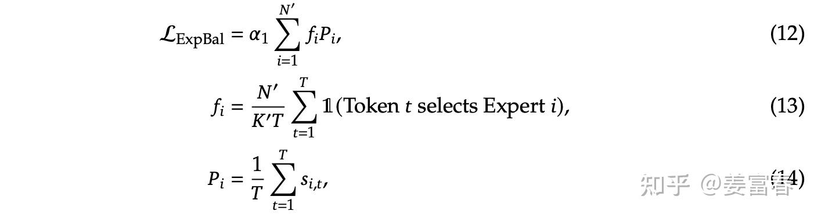

# deepseek技术解读(3)-MoE的演进之路

**Author:** 姜富春

**Date:** 2025-01-23

**Link:** https://zhuanlan.zhihu.com/p/18565423596


## 0\. 引言

本篇讲讲deepseek在MoE（Mixture-of-Experts）上的演进过程。DeepSeek是MoE稀疏模型的忠实玩家。主版本模型从DeepSeekMoE（V1） 到 DeepSeek V3，一直坚持走MoE的技术路线，并且持续做出一些创新。本文参考paper并结合源码阅读，理解MoE的演进过程和具体实现。

## 1.简述MoE的发展历程

首先我们简单回顾下MoE的发展历史，早在1991年一篇名为《[Adaptive Mixtures of Local Experts](https://link.zhihu.com/?target=https%3A//ieeexplore.ieee.org/abstract/document/6797059) 》的工作，最早提出了Mixture of Experts的原型框架，如图1，直至今日，MoE的框架依然保持这种形式。


图1、Adaptive Mixtures of Local Experts 框图


**MoE(Mixture of Experts)是一种网络层结构， 网络层主要包括三部分：**

-   **专家网络(Expert Network)**：是一个前馈网络，逻辑上一个专家网络擅长处理一类专项的子任务，所有专家都接受相同的输入，来做特定计算处理，产出不同的输出
-   **门控网络(Gating Network)**：跟专家网络接收一样的输入，负责产出专家偏好的权重。来指示对于一个输入，不同专家的重要程度。
-   **选择器(selector)**：是一种根据专家权重来做专家选择的策略。可以选择权重最高的Top1专家或选择TopK专家来融合得到最终的结果。

随后一段时间，主要是Google在主导着MoE的发展。进入Transformer时代后，2020年Google发表了的《[GShard](https://link.zhihu.com/?target=https%3A//arxiv.org/pdf/2006.16668)》，也把模型训到了600B的规模。GShard刻画了在Transformer上做MoE的经典设计。主要包括[Transformer MoE层](https://zhida.zhihu.com/search?content_id=252735413&content_type=Article&match_order=1&q=Transformer+MoE%E5%B1%82&zhida_source=entity)设计和辅助[负载均衡损失](https://zhida.zhihu.com/search?content_id=252735413&content_type=Article&match_order=1&q=%E8%B4%9F%E8%BD%BD%E5%9D%87%E8%A1%A1%E6%8D%9F%E5%A4%B1&zhida_source=entity)。

**Transformer MoE层**：MoE层替换Transformer的FFN层，计算逻辑：对于一个token 分别通过门控网络和专家网络计算门控值和专家输出，然后用门控值加权多个专家输出来产出最终结果。具体如下：

-   门控计算：

$$[g_{s,1}, g_{s,2},..., g_{s,E}] = softmax(w_g. x_s) \tag1$$

-   专家计算（专家就是FFN网络）

$$FFN_e(x_s) = W_{o_e} . ReLU(W_{i_e} . x_s) \tag2$$

多专家结果加权就和得到MoE的输出 
$$y_s = \sum_{e=1}^E g_{s,e} . FFN_e (x_s) \tag3$$

> 注：这里的专家是**token级专家**，而不是样本粒度，每个token都会做专家路由。此外专家是**稀疏激活**的，是根据门控值取topK个专家来融合计算最终的结果。GShard最多激活权重最高的2个专家。

**负载均衡-辅助损失**：引入负载均衡损失，目的是解决多专家token分布不均的问题。因为如果完全按门控权重选取topk专家，容易导致训练过程出现负载不均衡的问题。比如：大多数token被分配到少数几个专家，导致只有少数专家数据通信繁忙造成拥堵，从而减缓训练速度；也会导致其他专家得不到充分训练。为了解决这个问题，定义了一个辅助损失（aux\_loss）来降低负载不均衡问题。

那么怎么定义负载均衡的辅助损失？

考虑每个专家收到的token占总token的比例，分别为： $\frac{c_{1}} {S}, \frac{c_{2}}{S}, ..., \frac{c_{E}}{S}$ ，其中 $S$ 表示token的数量， $\{1, 2, ..., E\}$ 表示专家集合， $c_{e}$ 表示第 $e$ 个专家接受的token数量。如果是负载均衡的，那么每个专家收到的token一样多，token比例 $\frac{c_{i}} {S}$ 值一样。

我们可以用每个专家收到的token比例的平方和来描述负载均衡损失，如下公式 $(4)$ 所示。当所有专家收到token比例都相等时， $l_{aux}$ 取最小值。 
$$\mathcal{l}_{aux} = \frac{1} {E} \sum_{e=1}^E(\frac {c_{e}}{S})^2 \tag 4$$

但由于公式 $(1)$ 是参数无关的量，不可梯度更新。作者用每个专家的门控权重的均值 $m_e$ 作为 $\frac{c_{e}}{S}$ 的近似。如公式 $(5)$

$$m_{e} = \frac{1}{S} \sum _{s=1}^Sg_{s,e} \tag 5$$

其中 $g_{s,e} $ 为公式 $(1)$ 针对token $s$ 计算的专家 $e$ 的门控权重。

那么这里我们再弄清楚两个问题：

> 问题1：公式 $(5)$ 计算的 $m_{e} $ 为什么可以看作是 $\frac{c_{e}}{S}$ 的近似？  
> 答：直观理解，我们假设极端情况下每个token最多分配给1个专家，那么可以假设被激活的专家的权重可以是1，其他专家权重都是0，这样对于专家 $e$ 来说， 可以计算得到 $m_e = \frac{c_{e}}{S}$ 。另外从定义上 $m_{e} = \frac{1}{S} \sum _{s=1}^Sg_{s,e}$ 表示token集合 $S$ 分配给专家 $e$ 的token概率，如果不考虑token分配的完整性。这其实就是 $\frac{c_{e}}{S}$ 的定义。只不过 $m_e$ 是个soft的计算方式，而 $\frac{c_{e}}{S}$ 是取TopK的hard计算的。理解上可再参考下示例图，图示展示有6个专家，在6个token上计算，取Top1专家激活。左图每一行是多专家softmax的结果。左边按列加和计算 $ \sum _{s=1}^Sg_{s,e} = m_e \times S$ 其实是计算分配给专家 $e$ 的token数，是soft的计算，右边按列加和计算 $c_e$ 也是计算分配给专家 $i$ 的token数，是hard的计算。 $c_i$ 和 $m_e \times S$ 的值是近似的（四舍五入取整的结果），也就是 $c_e \approx m_e \times S$ ，所以$m_{e} $ 可以近似看作是 $ \frac{c_{e}}{S}$ 。


> 问题2：这样近似计算有什么好处？  
> 答：因为 $m_{e}$ 计算引入了门控 $g_{s,e}$ 项， $g_{s,e}$ 计算如公式(1)所示，包括的可学习参数 $w_g$ ，保证了这个一个可微的计算，可以做梯度更新。

我们用 $m_{e} $ 把公式 $(4)$ 改造下，将平方项的一个分量替换成 $m_{e} $ ，如公式 $(6)$ :

$$\mathcal{l}_{aux} = \frac{1} {E} \sum_{e=1}^E(\frac {c_{e}}{S}) \times m_{e} \tag6$$
公式 $(6)$ 就是我们经常看到的负载均衡loss形式。这里也要注意，**对于专家级的负载均衡的loss是加到每个MoE层的，每层都有一个** $l_{aux}$ **辅助损失。**

上面对MoE有了基本的认识，我们接下来看看DeepSeek在MoE方面的工作。

## 2.DeepSeek的工作

### 2.1. DeepSeek-moe(V1)

24年1月DeepSeek发布V1版MoE模型，作者指出当前方法存在两方面问题：

-   **知识混合性**：现有的MoE模型通常使用数量有限的专家（如8个或16个），由于token的知识是丰富多样的，将多样的知识分配给有限的专家，会导致特定专家的token很可能会涵盖多样化的知识，而使得专家变成一个杂糅多知识的专家，这样不能充分发挥专家的专业效果。
-   **知识冗余性**：分配给不同专家的token可能存在共同知识。因此，多个专家可能会在其各自的参数中学习到共享知识，从而导致专家参数存在冗余。这种问题也阻碍了现有MoE实践中专家的专业化，限制了MoE模型的理论上限性能。

针对上述问题，DeepSeek引入一种实现了专家专业化而设计的创新MoE架构。架构主要包含两方面优化：

-   **[细粒度专家分割](https://zhida.zhihu.com/search?content_id=252735413&content_type=Article&match_order=1&q=%E7%BB%86%E7%B2%92%E5%BA%A6%E4%B8%93%E5%AE%B6%E5%88%86%E5%89%B2&zhida_source=entity)（Fine-Grained Expert Segmentation）**：在保持参数数量不变的情况下，作者通过分割FFN中间隐藏维度来将专家分割成更细的粒度。相应地，在保持计算成本不变的情况下，可激活更多细粒度的专家，以实现激活专家组合的更高灵活性。细粒度专家分割使得多样化的知识能够被更细致地分解，并更精确地学习到不同的专家中，每个专家将保持更高的专业化水平。
-   **[共享专家隔离](https://zhida.zhihu.com/search?content_id=252735413&content_type=Article&match_order=1&q=%E5%85%B1%E4%BA%AB%E4%B8%93%E5%AE%B6%E9%9A%94%E7%A6%BB&zhida_source=entity)（Shared Expert Isolation）**：将某些专家隔离出来，作为始终激活的共享专家，旨在捕获不同上下文中的共同知识。通过将共同知识压缩到这些共享专家中，可以减轻其他路由专家之间的冗余，这可以提高参数效率，确保每个路由专家专注于不同方面而保持专业化。

如下图2所示。(b)是在(a)基础上，通过将隐层切分更细粒度，而形成细粒度专家，(c)又在(b)基础上隔离出来共享专家。DeepSeekMoE模型的演进过程，一直延续这两个创新的设置。


图2、DeepSeekMoE架构

DeepSeekMoE架构的公式形式：


图3、DeepSeekMoE计算公式

其中 $K_s$ 是共享专家数量， $mN - K_s$ 是路由专家数量， $u_t^l$ 是第 $l$ 层第 $t$ 个token的输入，计算 $h_t^l$ 的三个因子分别是：共享专家结果、路由专家结果、残差链接。 $e_i^l$ 是 $l$ 层专家 $i$ 可学习的参数。 $s_{i,t}$ 表示第 $t$ 个token在第 $i$ 个专家上的打分。 $g_{i,t}$ 表示取 $TopK$ 高的专家权重。

除了在模型架构上的改进，随着DeepSeek从V1 到 V3的演进，在负载均衡上，做了较多工作。首先看看 V1的负载均衡的优化，主要在计算负载均衡上做了优化，包括两个负载均衡的设置：

**1.专家级负载loss(Expert-Level Balance Loss)**

loss计算如下所示



图4、Expert-Level Balance Loss 计算

其中： $\alpha_1$ 是超参数，用来调节与主网络loss的权重； $T$ 是专家要处理的全部的token数；$N^{'} = mN - K_s$表示去掉共享专家后的路由专家的数量； $K^{'} = mK -K_s$ 表示激活路由专家的数量；$\Bbb  I$ 是指示函数。

我们仔细看下如上公式，针对上述公式 $(13)$ 的 $f_i$ 的计算，稍微有些不好理解。如果参照第一节公式(6)，计算 $f_i$ 应该如下：

$$f_i = \frac{1}{T}\sum _{t=1}^T\Bbb I(Token\quad t \quad selects \quad Expert \quad i) \tag{15}$$

公式 $(13)$ 相比公式 $(15)$ ，分子多乘了个路由专家数( $N^{'}$ )，分母上多除了个激活路由专家数（$K^{'}$ ）。

**我们看看为什么要乘以** $N^{'}$ **并除以个** $K^{'}$ **？**

**其实这里是为了保持计算损失的恒定，不随专家数量的变化而变化**。怎么理解呢？

当token分配均匀的情况下，也就是说 $T$ 个token，每个token激活 $K^{'}$ 个专家。共需要分配 $TK^{'}$ 个token，平均分配给了 $N^{'}$ 个专家。每个专家分配token数为 $TK^{'}/N^{'}$ ，那么，按公式 $(15)$ $f_i$ 计算的专家 $i$ 分配的token率为： $f_i = K^{'}/N^{'}$ ；

考虑 $P_i$ 计算，当token均匀分配，且 $s_{i,t} $ 计算 $softmax$ 保持将权重均匀分配给 $K^{'}$ 个激活的专家，也就是计算的权重类似于： $[0, 1/K^{'}, 0, 0, 1/K^{'}, ...] _{N^{'}}$ 。 $softmax$ 计算后的权重向量的维度是 $N^{'}$ ，其中有 $K^{'}$ 个位置为 $1/K^{'}$ ，其他位置都为 $0$ 。token均匀分配的情况下，每个专家有非零权重的token数为： $TK^{'}/N^{'}$ 。按 $P_i$ 公式计算有： $P_i = \frac {1}{T} \times  \frac{TK^{'}}{N^{'}} \times \frac {1} {K^{'}} = 1/N^{'}$

所以我们看看loss计算： $\mathcal L_{ExpBal} = \alpha_1 \sum_{i=1}^{N^{'}} (K^{'}/N^{'} \times 1/N^{'} ) = \alpha_1  \times K^{'}/N^{'}$ 。我们看到最终loss里面有个 $K^{'}/N^{'}$ 项，是随着路由专家数（ $N^{'}$ ）和激活路由专家数（ $K^{'}$ ）动态变化而变化的。为了去掉这个动态变化的项，让Loss维持一个恒定的量级，对辅助loss整体乘以 $N^{'} / K^{'}$ ，以保持loss计算是不随专家数变化而变化的。

> 解释这么多，那么我们为什么要保持Loss的计算不随专家的数量变化？这里我理解有两个好处  
> 第一：超参 $\alpha_1$ 的调整简单。超参 $\alpha_1$ 是平衡主loss和辅助loss的超参，既不能太大，也不能太小。太大会干扰主loss的收敛效果，太小会达不到负载平衡的目标。所以如果辅助loss随专家数变化，那么调整超参 $\alpha_1$ 会较复杂  
> 第二：做专家数对比消融实验时，如果loss不受专家数设置影响，那么loss收敛的绝对值是有可比性的。尤其在做细粒度专家效果对比时，不同实验的绝对loss值是有参考意义的，一组实验的loss的绝对值低，能说明效果是更好的。

**2.设备级负载loss(Device-Level Balance Loss)**

将专家分成 $D$ 组 $\{\mathcal E_1, \mathcal E_2, ..., \mathcal E_D\}$ ，每组专家放在一个设备上，为了保证设备间的计算负载均衡， 引入设备级负载loss。设备级负载loss 比专家级粒度更大，相当于在多组专家间做负载均衡，主要用来平衡不同设备的计算负载。如下图公式所示


图5、Device-Level Balance Loss 计算

V1版MoE的升级基本就描述完了。这里还有个问题：在公式中 $T$ 表示要处理的总token量，在实际模型训练中，模型是按Batch接受输入的，那这个 $T$ 总token量，到底是个什么口径？ 是实际样本总token量，还是随着Batch累加的量，亦或是每个Batch为一组的即时token量。

我们来看看V1的[源码](https://link.zhihu.com/?target=https%3A//huggingface.co/deepseek-ai/deepseek-moe-16b-base/blob/main/modeling_deepseek.py%23L361)，**从源码中看，是以每个Batch为一组token计算负载loss的，** $T$ **就是一个Batch的总token量**。核心代码

```python3
class MoEGate(nn.Module):
    def forward(self, hidden_states):
        bsz, seq_len, h = hidden_states.shape        
        ############################
        # 这里的hidden_states就是公式里的T，是一个Batch数据的全部token做计算，每个Batch会重新计算
        ############################
        hidden_states = hidden_states.view(-1, h)
        
        logits = F.linear(hidden_states, self.weight, None)
        scores_for_aux = logits.softmax(dim=-1)
        
        topk_weight, topk_idx = torch.topk(scores_for_aux, k=self.top_k, dim=-1, sorted=False)
        topk_idx_for_aux_loss = topk_idx.view(bsz, -1)
        mask_ce = F.one_hot(topk_idx_for_aux_loss.view(-1), num_classes=self.n_routed_experts)
        ce = mask_ce.float().mean(0)
        ############################
        # 计算Pi，fi 和 aux_loss。这里的计算并没有跨Batch累积，每个Batch单独计算
        ############################      
        Pi = scores_for_aux.mean(0)
        fi = ce * self.n_routed_experts
        aux_loss = (Pi * fi).sum() * self.alpha
```

### 2.2. DeepSeek V2 MoE升级

DeepSeek V2 相对于V1版，对MoE模块主要在负载均衡上做了三方面升级

**1.[设备受限的专家路由机制](https://zhida.zhihu.com/search?content_id=252735413&content_type=Article&match_order=1&q=%E8%AE%BE%E5%A4%87%E5%8F%97%E9%99%90%E7%9A%84%E4%B8%93%E5%AE%B6%E8%B7%AF%E7%94%B1%E6%9C%BA%E5%88%B6&zhida_source=entity)（_Device-Limited Routing_）**

随着LLM的size越来越大，对MoE模型的训练，一般要采用专家并行(expert parallelism)来分布式加载模型，也就是对于网络的一个MoE层的多个专家，分配到多个设备上，来并行训练。由于DeepSeek的MoE是做了细粒度专家的设计，通常专家会很多（V2模型的路由专家数有160个，激活专家6个）。我们知道在MoE层多专家的输入是一样的，由当前层的Self-Attention输出的隐层激活值作为MoE层的输入。如果被激活的专家分布在多个机器上，那么要把输入传输到多机器，势必会带来成倍的通讯成本。

为了解决这个问题，DeepSeekV2 引入了**设备受限的专家路由机制。**具体说就是保证每个token的激活专家，最多分布到 $M$ 个设备上（ $M$ 小于 $TopK$ ），这样来控制通信成本。具体做法分2步：

1.  对于每个token，首先选择门控分数(图3的公式11计算的 $s_{i,t}$ ）最高的专家所在的 $M$ 个设备，
2.  然后把 $M$ 个设备上的所有专家作为备选集合，选择 $TopK$ 个专家

DeepSeek实际验证出，当 $M \ge 3$ 的时候，这种受限的选 $TopK$ 的操作，与不受限的全局选 $TopK$ 的操作，模型效果上是大致相当的。所以在V2模型上，DeepSeek选择的 $TopK = 6$ ， $M = 3$ 。

**2\. 增加[通信负载均衡loss](https://zhida.zhihu.com/search?content_id=252735413&content_type=Article&match_order=1&q=%E9%80%9A%E4%BF%A1%E8%B4%9F%E8%BD%BD%E5%9D%87%E8%A1%A1loss&zhida_source=entity)（Communication Balance Loss ）**

通过上面设备受限的路由机制可以减轻从输入侧将数据分发到多设备，减少多扇出的通讯量。但是在设备接收侧可能还是会出现集中几个设备的专家被激活的问题，导致通信拥堵的问题。所以V2版模型，相对于V1版增加了个通信负载均衡的loss


图6 、通信复杂均衡loss 公式

其中， $\mathcal E_i$ 表示第 $i$ 个设备的一组专家， $D$ 是设备数， $M$ 是受限路由的设备数， $T$ 是一个Batch的token数， $a_3$ 是该辅助loss的超参。公式的计算过程与专家级负载均衡loss过程（如图4）基本类似。对于 $f_i^{''}$ 的计算，乘以 $D$ 和 除以 $M$ 也是为了保证loss不随设备的增减或限制路由配置而动态变化。

> 设备受限的专家路由机制和通信负载均衡loss，都是为了解决通信负载平衡的方法。不同的是：**设备受限的专家路由机制是在通信分发端确保分发的一个上限；而通信负载均衡loss是在通信接收端确保接收的平衡，鼓励每个设备接收等量的token。所以通过这两种方法，可以确保设备输入、输出的通信负载均衡。**

**3\. 设备级Token丢弃策略（_Token-Dropping Strategy_）**

虽然多个负载均衡的loss（包括专家，设备，通信）能引导模型做通信和计算的平衡，但并不能严格做到负载均衡。为了进一步做计算的负载均衡。引入了设备级的Token丢弃策略。具体做法：

1.  首先对于一个Batch输入token，算出每个设备的平均接收的token量，也就是设备的容量 $C$
2.  对于每个设备实际分配的token量 $T_d$ ，按照路由打分(图3的公式11计算的 $s_{i,t}$)降序排列
3.  如果 $T_d \gt C$ 则将超过容量 $C$ 的尾部token丢弃掉，不进行专家网络计算。

> 注：这里的丢弃Token，只是在单MoE层对token不做计算，但这个token会通过残差继续传入上层Transformer网络，参与计算。所以被丢弃的Token依然是有hidden\_state表征的，只是这个表征不是专家输出+残差merge的结果，而是只有残差部分的结果。而且多层Transformer MoE的专家是不耦合的，在某些层可能丢弃，在另外一些层参与专家计算。

作者为了保持推理和训练的一致性，在训练阶段也保持有10%的样本是不做Token丢弃的，来保证在推理阶段不做token丢弃的效果。

### 2.3. DeepSeek V3 MoE升级

首先在基本的MoE框架上，延续了细粒度专家（finer-grained experts）和 共享专家（Shared Expert Isolation）的设计。在门控网络和负载均衡方面都做了些改进。具体如下：

**1.MoE门控计算Softmax->Sigmoid**

V3版MoE的计算框架如图7所示，相对于前两版的计算框架，**主要是将门控网络从Softmax 升级到了 Sigmoid。**


图7. DeepSeek V3 MoE网络层计算框架

从实现门控的效果上看，Softmax和Sigmoid都能做实现筛选TopK的功能，也能做概率分布的归一化处理。

**但V3版的MoE为什么要做从Softmax -> Sigmoid的升级？**

要解释这个问题，我们看看V3版相对于V2版的专家设置发生了哪些变化。

> V2版：路由专家数： 160， 激活专家数： 6个， 模型总参数67B，激活参数21B  
> V3版：路由专家数： 256， 激活专家数： 8个， 模型总参数671B，激活参数37B

这里我个人理解：V3相对于V2的路由专家数增加了近100个，我们考虑在计算一个较大维度的softmax操作，softmax要在内部对所有维度的值做归一化处理，维度越大，会趋向于计算出的每个维度的值会越小，因为所有维度加和要等于1，所以维度越大，每个维度值理论上分配的值就越小。这样在选取 $TopK$ 个最大值时，对更小的小数位会敏感，会有数据区分度不高的问题，维度越大，问题越严重。而选择Sigmoid函数，它是对每个专家分别计算一个 $[0,1]$ 的打分，它并是不随专家维度变化而变化，理论上计算的打分值域更宽，区分度更高。所以V3版在配置更多路由专家的情况下，采用了值域更宽的Sigmoid的函数计算专家激活权重。

**2.无辅助损失负载均衡（Auxiliary-Loss-Free Load Balancing）**

DeepSeek在V1，V2版MoE模型中，增加了专家级，设备级和设备通信级等平衡负载辅助loss。这些辅助loss只是为了做计算、通讯的负载均衡，对模型的效果调优并没有帮助。甚至这些辅助loss增加过多，loss太大会对主模型造成影响，导致主模型的效果有损。为了减轻多辅助负载均衡的loss对主模型的影响，在V3版把多辅助loss都精简掉了，通过引入一个可动态调节的bias来做到负载均衡。

具体方法：V2版选择专家是通过专家的门控权重 $s_{i,t}$ 来取 $TopK$ ，V3版对每个专家维护一个可动态调节的bias( $b_i$ )，现在选择专家通过$s_{i,t} +b_i$ 来选择 $topK$ 个专家。当我们检测到专家是过载的状态时，我们减小该专家的 $b_i$ ，来降低门控权重，从而减少路由到该专家的token量；当我们检测到专家负载不足时，我们增加该专家的bias( $b_i$ )，来提升专家门控权重，从而增加路由到该专家的token量。

> 这里论文中有些描述是比较含糊的，比如用什么方式检测专家过载或负载不足的，是用专家的平均分配的token数作为参考吗。我本来想通过看V3的源码理解下细节（[Model源码](https://link.zhihu.com/?target=https%3A//huggingface.co/deepseek-ai/DeepSeek-V3-Base/blob/main/modeling_deepseek.py)），但没有找到... ，只看到对于每个专家的 $b_i$ 设置成了一个可学习的参数。这个跟论文中描述的增加和减少固定的 $\lambda$ 量也不一样。可能是我没找对位置，这块后面会再搜集些信息，理解下具体实现。

**3\. sequence粒度的负均衡损失（Complementary Sequence-Wise Auxiliary Loss）**

DeepSeek V3也增加了一个sequence粒度的负载均衡损失，来平衡单个sequence的token分配给每个专家。如下图公式所示


图8、Sequence-Wise Auxiliary Loss计算

相对于V1版的专家级辅助损失(Expert-Level Balance Loss)其实就是作用粒度不一样，Sequence-Wise的粒度是单条样本粒度的token做计算。Expert-Level Balance是一个Batch的多Sequence的token做计算。公式的计算形式并没有什么差异。

最后DeepSeekV3也强调通过上面的负载均衡的策略，能达到一个非常好的平衡效果，所以在V3版并没有Token被Drop掉。

## 3\. 总结

我们再来回顾下DeepSeek在MoE方面创新和演进过程

-   V1版为了兼顾对通用知识和细粒度领域知识的建模，引入了**共享专家（Shared Expert）和细粒度专家（Fine-Grained Expert）。**同时为了平衡各个专家的计算负载，引入了专家级负载loss （Expert-Level Balance Loss）和 设备级负载loss（Device-Level Balance Loss）。
-   V2版主要在通信负载上做了些优化，通过引入**设备受限的专家路由机制**和**通信负载均衡loss**确保设备输入、输出的通信负载均衡。
-   V3版考虑负载loss对主模型的优化会有影响，将辅助负载loss做了精简，通过在门控权重增加一个可调的bias来解决通信和计算的负载。也引入了一个更细粒度的sequence负载均衡loss。同时考虑随着路由专家增到256个，在门控权重计算上选择了值域更宽、打分差异更显著的sigmoid函数替换了原来的softmax函数。

整体演进过程，如下图所示：


DeepSeek MoE演进

## 4\. 参考文献

1.  [Adaptive Mixtures of Local Experts](https://link.zhihu.com/?target=https%3A//ieeexplore.ieee.org/abstract/document/6797059)
2.  [GShard: Scaling Giant Models with Conditional Computation and Automatic Sharding](https://link.zhihu.com/?target=https%3A//arxiv.org/pdf/2006.16668)
3.  [DeepSeekMoE: Towards Ultimate Expert Specialization in Mixture-of-Experts Language Models](https://link.zhihu.com/?target=https%3A//arxiv.org/pdf/2401.06066)
4.  [DeepSeek-V2: A Strong, Economical, and Efficient Mixture-of-Experts Language Model](https://link.zhihu.com/?target=https%3A//arxiv.org/pdf/2405.04434)
5.  [DeepSeek-V3 Technical Report](https://link.zhihu.com/?target=https%3A//arxiv.org/pdf/2412.19437)