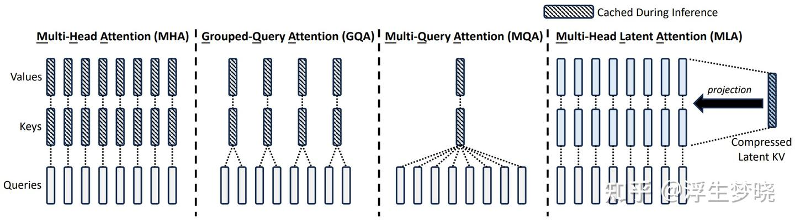
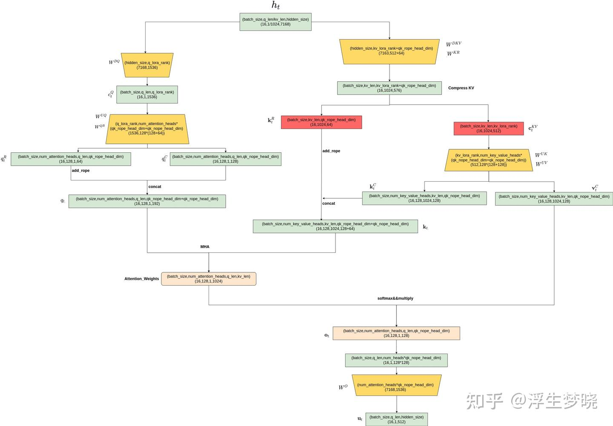
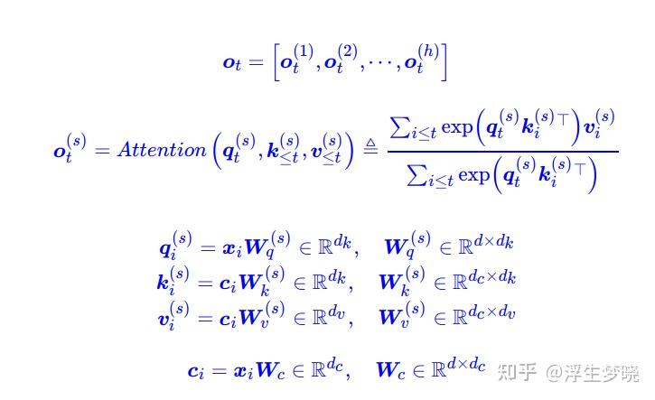
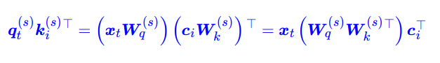
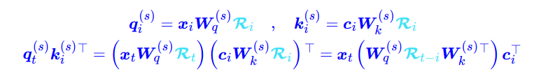
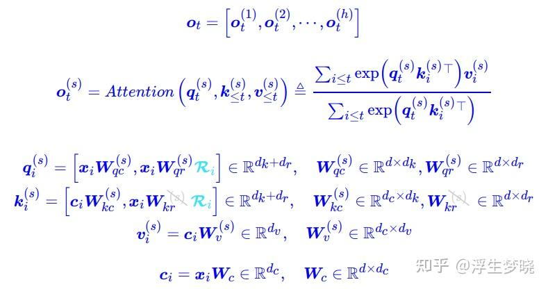
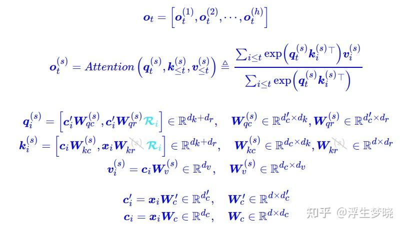
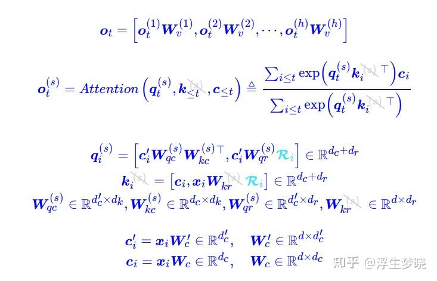
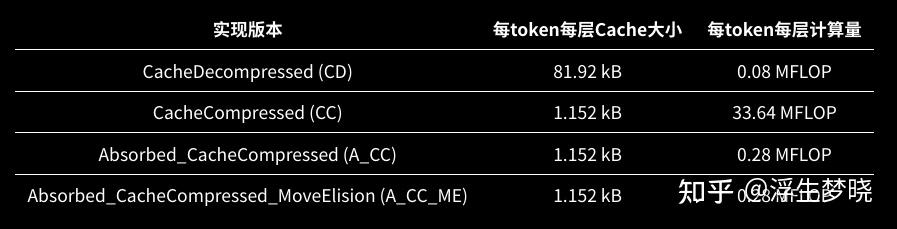
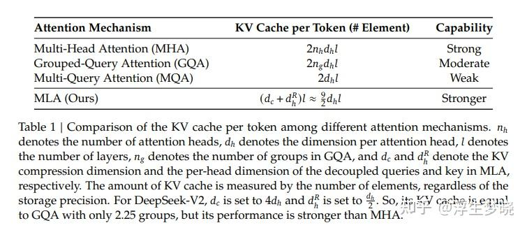

# MLA（Multi-Head Latent Attention）—DeepSeek-V2/V3 Attention方案

**Author:** 浮生梦晓

**Date:** 2025-01-30

**Link:** https://zhuanlan.zhihu.com/p/19945771293

MLA是当前DeekSeek V2及V3架构所采用的注意力模式，其官方论文表示其能力甚至强于[MHA](https://zhida.zhihu.com/search?content_id=253011578&content_type=Article&match_order=1&q=MHA&zhida_source=entity)，本文提供数学推理及代码逻辑解析对MLA进行解读。

为保证理解，首先声明一下参数：

$d$ ：嵌入维度

$n_h$ ：注意力头的数量

$d_h$ ：每个头的维度

$h_t \in \mathbb{R}^d$ ：第 $t$ 个token的注意力输入

**MLA的核心是对注意力的键值进行低秩联合压缩，来减少推理过程中的KV缓存。**

**要完整理解MLA需要结合DeepSeek-V2中细节：**

[https://arxiv.org/pdf/2405.04434​arxiv.org/pdf/2405.04434](https://link.zhihu.com/?target=https%3A//arxiv.org/pdf/2405.04434)



上图来源与V2中对于各主流注意力计算的示意，这里不再详细介绍MHA、[GQA](https://zhida.zhihu.com/search?content_id=253011578&content_type=Article&match_order=1&q=GQA&zhida_source=entity)、[MQA](https://zhida.zhihu.com/search?content_id=253011578&content_type=Article&match_order=1&q=MQA&zhida_source=entity)部分及[KV Cache](https://zhida.zhihu.com/search?content_id=253011578&content_type=Article&match_order=1&q=KV+Cache&zhida_source=entity)原理，只介绍MLA。

在此之前写一下标准的MHA计算流程做为对比：

**MHA:**

$h_t \in \mathbb{R}^d$

$q_t,k_t,v_t \in \mathbb{R}^{d_hn_h}$

$W^Q,W^k,W^v \in \mathbb{R}^{d_hn_h*d}$

其中：

$\mathbf{q}_t = W^Q\mathbf{h}_t, \\ \mathbf{k}_t = W^K\mathbf{h}_t, \\ \mathbf{v}_t = W^V\mathbf{h}_t,$

$q_t,k_t,v_t$ 在多头注意力计算时会被划分为 $n_h$ 进行计算：

$[q_{t,1}, q_{t,2}, ..., q_{t,n_h}] = \mathbf{q}_t$

$[k_{t,1}, k_{t,2}, ..., k_{t,n_h}] = \mathbf{k}_t$

$[v_{t,1}, v_{t,2}, ..., v_{t,n_h}] = \mathbf{v}_t$

$o_{t,i} = \sum_{j=1}^t \text{Softmax}_j(\frac{q_{t,i}^T k_{j,i}}{\sqrt{d_h}})v_{j,i}$

$u_t = W^O[o_{t,1}; o_{t,2}; ...; o_{t,n_h}]$

其中：

$q_{t,i},k_{t,i},v_{t,i} \in \mathbb{R}^{d_h}$ 表示第 $i$ 个注意力头的query，key和value；

$W^O \in \mathbb{R}^{d*d_hn_h}$ 代表输出映射矩阵；

在推理时，所有key和value需要被存储，所以MHA中每个token需要存储 $2n_hd_hl$ 个元素（ $l$ 代表层数）。

**MLA**

**下面公式不用尝试先理解，后面有个逻辑图，图中对于矩阵运算及中间合作激活张量进行了标注，推荐对照着逻辑图进行公式理解。**

**在MLA中注意力计算过程中query的压缩情况：**

$c_t^Q = W^{DQ}h_t$

$[q_{t,1}^C; q_{t,2}^C; ...; q_{t,n_t}^C] = q_t^C = W^{UQ}c_t^Q$

$[q_{t,1}^R; q_{t,2}^R; ...; q_{t,n_t}^R] = q_t^R = \text{RoPE}(W^{QR}c_t^Q)$

$q_{t,i} = [q_{t,i}^C; q_{t,i}^R]$

这里的 $c_i^Q \in \mathbb{R}^{d'}$ 是queries被压缩后的潜在向量；

$d'_i(\ll d_h n_h)$ 代表query的压缩维度；

$W^{DQ} \in \mathbb{R}^{d'_c \times d}, W^{UQ} \in \mathbb{R}^{d_h n_h \times d'_c}$ 代表queries的下投影和上投影矩阵；

$W^{QR} \in \mathbb{R}^{d^R_h n_h \times d'_h}$ 是用于生成承载旋转位置嵌入编码（RoPE）的解耦查询矩阵；

**在MLA中KV Ccache在推理时的压缩情况：**

$\mathbf{c}_t^{KV} = W^{DKV}\mathbf{h}_t$

$[\mathbf{k}_{t,1}^C, \mathbf{k}_{t,2}^C,...,\mathbf{k}_{t,n_h}^C] = \mathbf{k}_t^C = W^{UK}\mathbf{c}_t^{KV}$

$\mathbf{k}_t^R = \text{RoPE}(W^{KR}\mathbf{h}_t)$

$\mathbf{k}_{t,i} = [\mathbf{k}_{t,i}^C; \mathbf{k}_t^R]$

$[\mathbf{v}_{t,1}^C, \mathbf{v}_{t,2}^C,...,\mathbf{v}_{t,n_h}^C] = \mathbf{v}_t^C = W^{UV}\mathbf{c}_t^{KV}$

这里的 $\mathbf{c}_t^{KV} \in \mathbb{R}^{d_c}$ 是keys和values被压缩后的隐藏向量；

$d_c (\ll d_h n_h)$ 表示KV的压缩维度；

$W^{DKV} \in \mathbb{R}^{d_c \times d}$ 表示下投影矩阵；

$W^{UK}, W^{UV} \in \mathbb{R}^{d_h n_h \times d_c}$ 分别为key和value的上投影矩阵；  
$W^{KR} \in \mathbb{R}^{d_h^R \times d}$ 是用来生成承载旋转位置嵌入编码（RoPE）的解耦键矩阵；

$RoPE(·)$ 表示应用旋转位置嵌入矩阵的操作；

$[·; ·]$ 代表矩阵连接；

**在KV Cache计算时中只有** $\mathbf{c}_t^{KV}$ **和** $\mathbf{k}_t^R$ **需要生成过程中被缓存。**

结合KV cache和Query，对attention计算部分进行推导：

其中queries( $q_{t,i}$ ),keys( $k_{j,i}$ ),values( $v_{j,i}^C$ )，最终attention计算后的输出是 $u_t$ :

$\mathbf{o}_{t,i} = \sum_{j=1}^t \text{Softmax}_j(\frac{\mathbf{q}_h^T\mathbf{k}_{j,i}}{\sqrt{d_h + d_h^R}})\mathbf{v}_{j,i},\\ \mathbf{u}_t = W^O[\mathbf{o}_{t,1}; \mathbf{o}_{t,2}; ...; \mathbf{o}_{t,n_h}],$

其中 $W^O \in \mathbb{R}^{d \times d_h n_h}$ 表示输出 映射矩阵。

为更有效的理解MLA，即上面公式代表的含义，使用流程图进行，在此之前先看一些deepseek-v3的参数设置：

[](https://link.zhihu.com/?target=https%3A//huggingface.co/deepseek-ai/DeepSeek-V3/blob/main/config.json)

从V3的config.json中提取到与MLA相关的参数如下：

```text
"hidden_size": 7168
"kv_lora_rank": 512
"num_attention_heads": 128
"num_key_value_heads": 128
"q_lora_rank": 1536
"qk_nope_head_dim": 128
"qk_rope_head_dim": 64
"v_head_dim": 128
```

假设batch\_size = 16, kv\_len=1024,q\_len=1



图片如果看不清楚可以自行下载高清版：链接: [https://pan.baidu.com/s/1YKyGLZ1Afb0-iU2dzgM1xw?pwd=5vni](https://link.zhihu.com/?target=https%3A//pan.baidu.com/s/1YKyGLZ1Afb0-iU2dzgM1xw%3Fpwd%3D5vni) 提取码: 5vni。

从MLA的推理逻辑可以看到，红色部分为需要存储的被压缩后的KVCache，实际上存储的KV与Q进行计算已经类似于MHA的操作，即存储的KV不再有num\_attention\_heads的概念，所有的注意力头所共享。

  

关于nope和rope的问题可以参考苏剑林博客来详细了解其数学原理：

[](https://link.zhihu.com/?target=https%3A//kexue.fm/archives/10091)

在这里简单说明下（不要考虑上面的公式了，以下以苏神博客公式重新从数学角度捋一遍，直接粘贴其博客公式图片）：

首先分析下图内容：



使用一个 $c_i $ 来表示包含k和v信息的低秩张量，在通过线性变换获得真正去进行attention计算的k和v，这样在保存时只需要保存这个 $c_i$ 即可，而且可以关注到这里的 $W_c$ 是没有没有attention heads区分的，即所有的heads都共用同一个 $c_i$ ，实际中 $c_i$ 中维度 $d_c$ 要小于 $d_k$ + $d_v$的group\_nums倍（类比GQA） ,在V3中 $d_c$ 即kv\_lora\_rank设置的值是512。

可以理解为将本层中所有heads中的K和V中的共性内容进行了抽取，而差异性内容则存放在 $W_k$ 和 $Wv$ 中，这样KV Cache只存储保存所有heads中KV共性的内容，差异性内容在推理时进行计算，大大减少了KV缓存。但是会带来计算量的激增，主要增加的计算量肯定会集中在$W_k$ 和 $Wv$与 $c_i$ 的运算上，如何降低运算量，这里用到了矩阵“吸收”。

在计算attention weights时会进行q与k转置的乘，如下：



可以看到通过交换矩阵运算可以将两个矩阵合并成一个矩阵映射，这样合并后的 $W_q$ 和 $W_k^T$ 合并为q的映射矩阵（合并后维度可以缩减），这样整体计算量会下降很多。v也同理， $W_o$ 可以和 $W_v$ 进行矩阵“吸收”。

但是上面的矩阵“吸收”有一个明显的问题，即位置编码，q和k是需要增加位置编码的，而增加位置编码后便无法进行矩阵变换操作：



可以发现增加上RoPE位置编码后存在了相对位置依赖，无论是t还是i在实际进行计算时不是固定的。

最终MLA选择了一部分维度添加位置嵌入，另外一部分不添加位置嵌入，即维度包含nope\_dim和rope\_dim，在V3中qk\_nope\_head\_dim= 128， qk\_rope\_head\_dim=64。



通过对1/3的隐藏维度添加位置信息，剩余1/3的隐藏维度不添加，不添加的部分仍可以进行矩阵“吸收操作”来降低计算量。

最后，将q也进行了低秩运算，对应图中的左半部分上面，这部分优化与缓存没有任何关系，主要是为了降低训练时运算量，这里 $c_i’$ 的维度，在v3中为q\_lora\_rank为1536：



在推理时的矩阵吸收后公式：



可以看到，实际推理时不经过RoPE编码的q和k进行了矩阵融合计算，合并成了一个矩阵映射，即KV中存在的信息转移到了Q矩阵映射中。

实际中由于huggingface中[Transformer](https://zhida.zhihu.com/search?content_id=253011578&content_type=Article&match_order=1&q=Transformer&zhida_source=entity)本身KV Cache存储的限制，使用MLA官方代码时保存的并不是Compress KV，而是 $k_t $ 和 $v_t^C$ ,但这种保存对于减少KV缓存没有一点帮助，甚至还会在增加计算量基础上增加一定的KV Cache，这种方式叫做CD（[CacheDecompressed](https://link.zhihu.com/?target=https%3A//github.com/madsys-dev/deepseekv2-profile/blob/main/mla/impl/baseline.py%23L134-L188)）。

而保存Compress KV即 $k_t^R$ 和 $c_t^{KV}$ 的方式则称为CC（[CacheCompressed](https://link.zhihu.com/?target=https%3A//github.com/madsys-dev/deepseekv2-profile/blob/main/mla/impl/cache_compressed.py%23L145-L200)），这种方式会极大程度的减少KVCache，但不会较少计算量。

以上两种方式都没有进行矩阵“吸收”操作，实际在论文中矩阵“吸收”只有一句话的存在，下面矩阵吸收的实际对比是源于章明星老师团队做的测试结果及开源代码分析。

A\_CC（[Absorbed\_CacheCompressed](https://link.zhihu.com/?target=https%3A//github.com/madsys-dev/deepseekv2-profile/blob/main/mla/impl/absorbed_cache_compressed.py%23L143-L196)），即矩阵“吸收”将MLA中KV计算中的矩阵 $W^{UK}$ 与Q中的无RoPE矩阵 $W^{UQ}$ 进行融合，将KV计算中的矩阵 $W^{UV}$ 与最后的输出映射矩阵 $W^{O}$ 进行吸收融合。

还有一种优化操作**：**

A\_CC\_ME（[Absorbed\_CacheCompressed\_MoveElision](https://link.zhihu.com/?target=https%3A//github.com/madsys-dev/deepseekv2-profile/blob/main/mla/impl/absorbed_cache_compressed_move_elision.py%23L144-L188)）：A\_CC\_ME 与 A\_CC 的主要区别在于，A\_CC\_ME 将 RoPE 部分与 NoPE 部分进行拼接的操作，改为 NoPE 部分 Attention 和 RoPE 部分 Attention 两者结果相加，这样做的好处在于节省了内存搬运操作。

最终几种方式的效果如下，



代码不再分析，逻辑理清后代码实现并不复杂，具体请看仓库

[](https://link.zhihu.com/?target=https%3A//github.com/madsys-dev/deepseekv2-profile/blob/main/workspace/blog/optimizing-mla.md)

  
具体可查看章明星老师实验记录：

[](https://zhuanlan.zhihu.com/p/700214123)

最后给一下官方给出的不同Attention占用KVCache及能力效果对比。



综合来看MLA是一个潜力很强的方案，但其也存在一个问题，即缓存的KV类似于MQA，只有一份的存在，则天然不适合进行并行推理，实验也证明其在单卡上对KV的压缩效果十分亮眼，但多卡需要对KVCache进行复制，会损失一定的KV压缩率，节后会进行详细单卡及多卡并行测试。