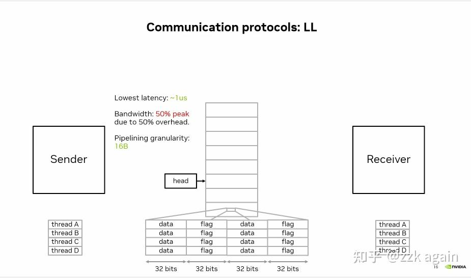
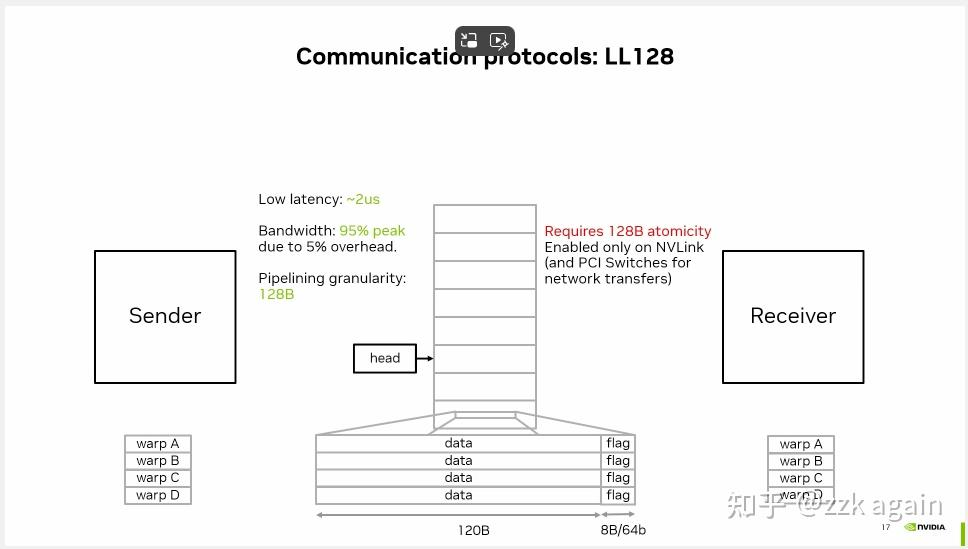
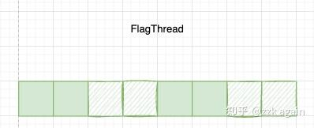
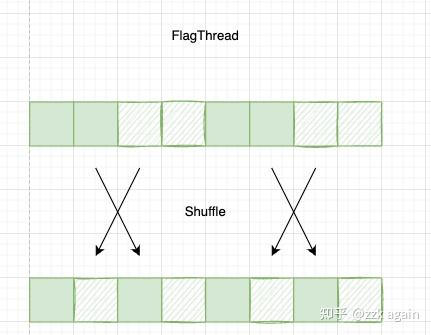

# 速通NCCL Protocol

**Author:** zzk again

**Date:** 2025-01-30

**Link:** https://zhuanlan.zhihu.com/p/699178659

NCCL通信协议一共有Simple, LL, LL128，本篇博客只关注后两种通信协议。

### L(ow)L(atency)协议

以往NCCL为了保证同步，会引入 memory fence，这就导致延迟比较大。

**而在小数据量下，往往打不满传输带宽，此时优化点在于同步带来的延迟。**

LL协议依赖前提是 [CUDA](https://zhida.zhihu.com/search?content_id=243503385&content_type=Article&match_order=1&q=CUDA&zhida_source=entity) 的memory 8Bytes大小的操作是atomic的，因此通信时会将数据排列组合成 4B Data + 4B Flag 进行传输。

而对端则会对Flag值进行校验，当达到预期值后，代表4B Data已经成功传输过来，便可进行下一步的操作。

一些相关代码实现在 `[prims_ll.h](https://zhida.zhihu.com/search?content_id=243503385&content_type=Article&match_order=1&q=prims_ll.h&zhida_source=entity)`

存储数据的代码为：

```text
__device__ void storeLL(union ncclLLFifoLine* dst, uint64_t val, uint32_t flag) {
    asm volatile("st.volatile.global.v4.u32 [%0], {%1,%2,%3,%4};" :: "l"(&dst->i4), "r"((uint32_t)val), "r"(flag), "r"((uint32_t)(val >> 32)), "r"(flag));
  }
```

读取远端数据的代码为：

```text
__device__ uint64_t readLL(int offset, int i) {
    union ncclLLFifoLine* src = recvPtr(i) + offset;
    uint32_t flag = recvFlag(i);
    uint32_t data1, flag1, data2, flag2;
    int spins = 0;
    do {
      asm("ld.volatile.global.v4.u32 {%0,%1,%2,%3}, [%4];" : "=r"(data1), "=r"(flag1), "=r"(data2), "=r"(flag2) : "l"(&src->i4));
      if (checkAbort(spins, 0)) break;
    } while ((flag1 != flag) || (flag2 != flag));
    uint64_t val64 = data1 + (((uint64_t)data2) << 32);
    return val64;
  }

```

-   使用volatile关键字来保证相关内存操作不会被编译器优化重排
-   CUDA支持向量化加载128bit数据，因此用的是 u32x4 指令
-   存储的时候，按照 DATA1 | FLAG1 | DATA2 | FLAG2 形式重排组合进128bit寄存器里
-   读取的时候，当flag1 和 flag2 为预期值后，将data1 和 data2 组合到一起，得到真正的数据

因为 Flag 占了整个数据包的一半，因此有效带宽是 50%，LL协议也因为这个不适用大数据量的传输



### L(ow)L(atency)128协议

该协议与LL特别像，**但是又依赖于一些特殊硬件**([NVLink](https://zhida.zhihu.com/search?content_id=243503385&content_type=Article&match_order=1&q=NVLink&zhida_source=entity))实现。

在NVLink下，memory operation 是以 128B 的粒度顺序可见的。考虑每个thread依旧是用128bit(16B)传输，那么128B这个粒度只需要每8个thread为一组，并且让最后一个thread承担flag校验的任务即可。

计算下来可以得到有效数据为：16B \* 7 + 8B = 120B

Flag校验位为：8B

有效带宽为：120B / 128B = 93.75%

LL128能够以较低的延迟达到较大的带宽率，NCCL会在带有NVLink的机器上默认使用该Protocol



相关代码位于 `[prims_ll128.h](https://zhida.zhihu.com/search?content_id=243503385&content_type=Article&match_order=1&q=prims_ll128.h&zhida_source=entity)` 头文件内

在类初始化的时候，会以每8个thread的最后一个thread作为FlagThread，只有该thread进行Flag位校验：

```text
bool flagThread; 

flagThread((tid%8)==7)
```

加载数据到寄存器代码为：

```text
template<int WordPerThread>
__device__ __forceinline__ void loadRegsBegin(uint64_t(&regs)[WordPerThread], T const *src, int eltN) {
  constexpr int EltPer16B = 16/sizeof(T);
  if(reinterpret_cast<uintptr_t>(src)%16 == 0) {
    /* We are aligned to 16 bytes, so load directly to registers no shmem.
     * Flag threads load half as much data which gets shuffled to the even
     * registers during Finish. The point of splitting into two phases is to
     * defer that shuffle, which incurs a dependency stall, until after other
     * memops are launched by the caller.
     */
    #pragma unroll
    for(int g=0; g < WordPerThread/2; g++) {
      int ix = g*WARP_SIZE - 4*(g/2) + wid - (g%2)*(wid/8); 
      if(!flagThread || g%2==0) {
        if(ix*EltPer16B < eltN)
          load128((uint64_t*)(src + ix*EltPer16B), regs[2*g+0], regs[2*g+1]);
      }
    }
  }
```

这里的ix为：0，32，60，92。对相邻的ix做差可得到 32， 28， 32。考虑到这是以Warp为单位操作，可得第一次加载32个线程都参与，第二次加载只有4\*(8-1)个线程参与，同理推第三次/第四次加载。

每个thread有 `uint64_t regs[8]` 寄存器，主要区别就在于flagThread加载逻辑，**第一次加载满，第二次不加载，第三次加载满，第四次不加载**，那么整个寄存器情况为：



在 `recvReduceSendCopy` 方法里，会调用一次 `loadRegsFinish` 完成整个寄存器加载：

```text
template<int WordPerThread>
  __device__ __forceinline__ void loadRegsFinish(uint64_t(&regs)[WordPerThread]) {
    // Move data out of flag registers into the vacant registers.
    #pragma unroll
    for (int g=1; g < WordPerThread/2; g+=2) {
      if (flagThread) regs[2*g] = regs[2*g-1];
    }
  }
```

其实就是交换了下，regs\[2\]/\[1\], regs\[6\]/\[5\], 得到：



作者在解释这里操作原因是为了避免shuffle数据依赖导致的stall

```text
The point of splitting into two phases is to
defer that shuffle, which incurs a dependency stall, until after other
memops are launched by the caller.
```

发送时候再填充Flag:

```text
store128(ptr+u*WARP_SIZE, v[u], flagThread ? flag : v[u+1]);
```

读取远端数据：

```text
if (RECV) {
  uint64_t* ptr = recvPtr(0)+ll128Offset;
  uint64_t flag = recvFlag(0);
  bool needReload;
  int spins = 0;
  do {
    needReload = false;
    #pragma unroll
    for (int u=0; u<ELEMS_PER_THREAD; u+=2) {
      load128(ptr+u*WARP_SIZE, vr[u], vr[u+1]);
      needReload |= flagThread && (vr[u+1] != flag);
    }
    needReload &= (0 == checkAbort(spins, 0, 0));
  } while (__any_sync(WARP_MASK, needReload));

  #pragma unroll
  for (int u=0; u<ELEMS_PER_THREAD; u+=2)
    load128(ptr+u*WARP_SIZE, vr[u], vr[u+1]);
}
```

-   一次性加载128bit，needReload配合while循环看flagThread里的flag是否为预期值，如果是则校验通过

存储寄存器的时候，我们需要把flagThread的寄存器再反shuffle回来：

```text
template<int WordPerThread>
  __device__ __forceinline__ void storeRegs(T *dst, uint64_t(&regs)[WordPerThread], int eltN) {
    constexpr int EltPer16B = 16/sizeof(T);
    // Reverse Finish() register permuatation.
    #pragma unroll
    for (int g=1; g < WordPerThread/2; g+=2) {
      if (flagThread) regs[2*g-1] = regs[2*g];
    }
    // ...
```

Reference: [What is LL128 Protocol?](https://link.zhihu.com/?target=https%3A//github.com/NVIDIA/nccl/issues/281)