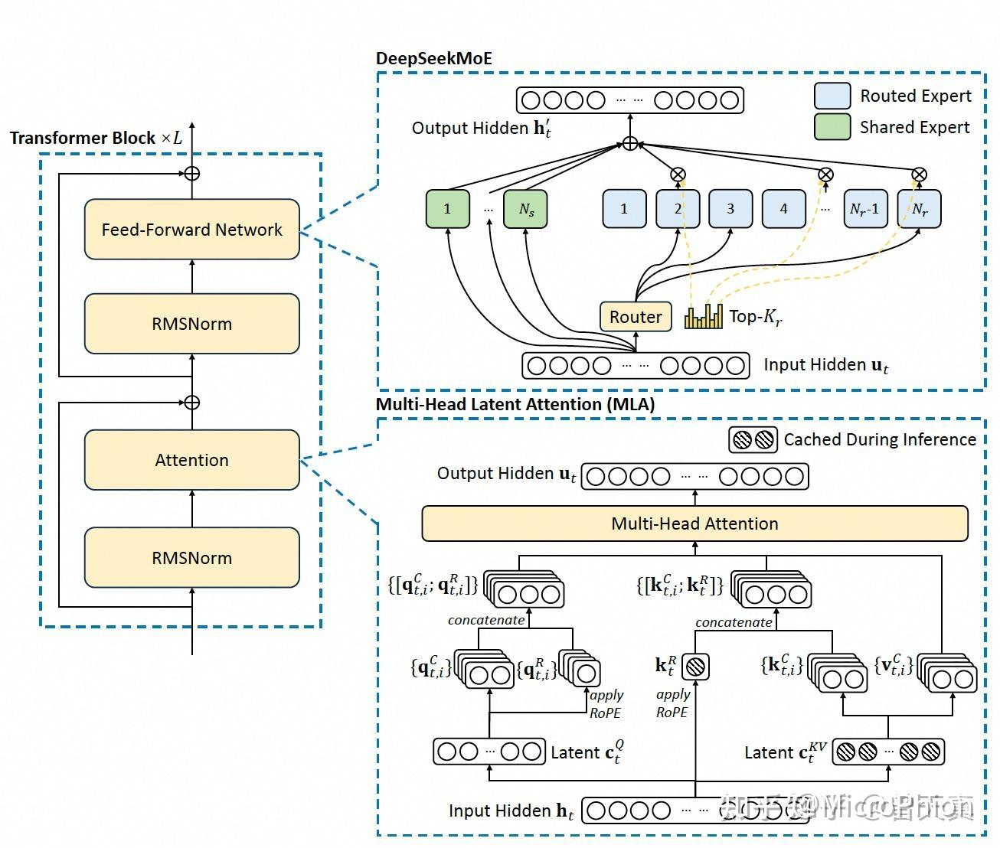

# DeepSeek V3的架构和代码

**Author:** MicroPhion

**Date:** 2025-02-01

**Link:** https://zhuanlan.zhihu.com/p/17781075074


[GitHub - deepseek-ai/DeepSeek-V3](https://link.zhihu.com/?target=https%3A//github.com/deepseek-ai/DeepSeek-V3)

[曾天真：DeepSeek-V3 关键点解读-架构篇](https://zhuanlan.zhihu.com/p/15057106396)



上面是[DeepSeek V3](https://zhida.zhihu.com/search?content_id=252578231&content_type=Article&match_order=1&q=DeepSeek+V3&zhida_source=entity)技术架构图。上面的架构图中核心主要是MLA和MoE，对着代码可以看的更清楚一些。

### 一、网络结构

```json
Transformer(
  (embed): ParallelEmbedding()
  (layers): ModuleList(
    (0): Block(
      (attn): MLA(
        (wq): ColumnParallelLinear()
        (wkv_a): Linear()
        (kv_norm): RMSNorm()
        (wkv_b): ColumnParallelLinear()
        (wo): RowParallelLinear()
      )
      (ffn): MLP(
        (w1): ColumnParallelLinear()
        (w2): RowParallelLinear()
        (w3): ColumnParallelLinear()
      )
      (attn_norm): RMSNorm()
      (ffn_norm): RMSNorm()
    )
    (1): Block(
      (attn): MLA(
        (wq): ColumnParallelLinear()
        (wkv_a): Linear()
        (kv_norm): RMSNorm()
        (wkv_b): ColumnParallelLinear()
        (wo): RowParallelLinear()
      )
      (ffn): MoE(
        (gate): Gate()
        (experts): ModuleList(
          (0-63): 64 x Expert(
            (w1): Linear()
            (w2): Linear()
            (w3): Linear()
          )
        )
        (shared_experts): MLP(
          (w1): ColumnParallelLinear()
          (w2): RowParallelLinear()
          (w3): ColumnParallelLinear()
        )
      )
      (attn_norm): RMSNorm()
      (ffn_norm): RMSNorm()
    )
  )
  (norm): RMSNorm()
  (head): ColumnParallelLinear()
)
```

### 二、关键函数

1、class MLA(nn.Module):

\# 这个 MLA 类实现了带有低秩适应（LoRA）和旋转位置编码（RoPE）的多头注意力机制（Multi-Head Attention）。具体来说：  
\# **低秩适应（LoRA）**: 通过引入低秩矩阵来减少模型参数数量，提高模型的可训练性和效率。  
\# **旋转位置编码（RoPE）**: 通过旋转位置编码来捕捉序列中的相对位置信息，增强模型对长距离依赖关系的理解。  
\# **多头注意力机制**: 通过多个独立的注意力头来捕捉不同子空间的信息，提高模型的表达能力。  
\# **分布式支持**: 通过 world\_size 和 rank 参数支持多进程分布式训练，确保每个进程只负责一部分头，提高了并行计算能力。  
\# **缓存机制**: 使用缓存存储键和值，加速推理过程，特别是在生成任务中。  
\# 通过这种方式，MLA 能够在大规模机器学习任务中高效地处理复杂的序列数据，提高模型的性能和泛化能力。  

2、class MoE(nn.Module):

\# 这个 MoE 类实现了混合专家网络（Mixture of Experts）的一部分功能，主要用于在大规模分布式训练环境中提高模型的效率和性能。具体来说：  
\# **高效性**: 通过稀疏激活机制，只有一小部分专家会被激活来处理每个输入样本的数据，从而减少了计算负担。  
\# **并行性**: 支持多进程分布式训练，确保每个进程只负责一部分专家，提高了并行计算能力。  
\# **扩展性**: 适用于大型神经网络模型，如Transformer模型，能够有效处理大量数据和复杂模式。  
\# **灵活性**: 结合专用专家和共享专家，既捕捉特定特征又保持一定的通用性。  
\# 通过这种方式，MoE 能够显著提高模型的表达能力和计算效率，在大规模机器学习任务中表现出色。  

### 三、代码注释

如果只是看到代码，可以将if world\_size > 1:部分忽略。

```python3
import math
from dataclasses import dataclass
from typing import Tuple, Optional, Literal

import torch
from torch import nn
import torch.nn.functional as F
import torch.distributed as dist

from kernel import act_quant, weight_dequant, fp8_gemm


world_size = 1
rank = 0
block_size = 128
gemm_impl: Literal["bf16", "fp8"] = "bf16"
attn_impl: Literal["naive", "absorb"] = "absorb"

@dataclass
class ModelArgs:
    max_batch_size: int = 8
    max_seq_len: int = 4096 * 4
    dtype: Literal["bf16", "fp8"] = "bf16"
    vocab_size: int = 1024
    dim: int = 2048
    inter_dim: int = 10944
    moe_inter_dim: int = 1408
    n_layers: int = 2
    n_dense_layers: int = 1
    n_heads: int = 16
    # moe
    n_routed_experts: int = 64
    n_shared_experts: int = 2
    n_activated_experts: int = 6
    n_expert_groups: int = 1
    n_limited_groups: int = 1
    score_func: Literal["softmax", "sigmoid"] = "softmax"
    route_scale: float = 1.
    # mla
    q_lora_rank: int = 0
    kv_lora_rank: int = 512
    qk_nope_head_dim: int = 128
    qk_rope_head_dim: int = 64
    v_head_dim: int = 128
    # yarn
    original_seq_len: int = 4096
    rope_theta: float = 10000.0
    rope_factor: float = 40
    beta_fast: int = 32
    beta_slow: int = 1
    mscale: float = 1.


class ParallelEmbedding(nn.Module):
    def __init__(self, vocab_size: int, dim: int):
        super().__init__()
        # 初始化词汇表大小和嵌入维度
        self.vocab_size = vocab_size 
        self.dim = dim
        # 确保词汇表大小能被设备数量整除，这是为了将词汇表均匀分配到各个设备上
        assert vocab_size % world_size == 0
        # 计算每个设备上的词汇表部分大小
        self.part_vocab_size = (vocab_size // world_size)

        # 确定当前设备负责的词汇表起始和结束索引
        self.vocab_start_idx = rank * self.part_vocab_size
        self.vocab_end_idx = self.vocab_start_idx + self.part_vocab_size
        # 初始化当前设备上的嵌入权重
        self.weight = nn.Parameter(torch.empty(self.part_vocab_size, self.dim))

    def forward(self, x: torch.Tensor) -> torch.Tensor:
        # 如果在分布式环境中（即world_size > 1）
        if world_size > 1:
            # 创建一个掩码，用于标记不在当前设备词汇表范围内的索引
            mask = (x < self.vocab_start_idx) | (x >= self.vocab_end_idx)
            # 将输入索引调整为当前设备词汇表的局部索引
            x = x - self.vocab_start_idx
            # 将超出当前设备词汇表范围的索引置为0（这些索引将不会参与嵌入查找）
            x[mask] = 0
        # 使用调整后的索引和当前设备的嵌入权重进行嵌入查找
        y = F.embedding(x, self.weight)
        # 如果在分布式环境中
        if world_size > 1:
            # 将超出当前设备词汇表范围的嵌入结果置为0（这些位置将接收来自其他设备的值）
            y[mask] = 0
            # 对所有设备的嵌入结果进行归约，以确保每个位置的嵌入都是全局正确的
            # 注意：这里假设已经正确设置了分布式通信后端和组
            dist.all_reduce(y)
        return y


def linear(x: torch.Tensor, weight: torch.Tensor, bias: Optional[torch.Tensor] = None) -> torch.Tensor:
    if weight.element_size() > 1:
        # 如果权重的元素大小大于1（即未量化或使用标准浮点类型），则直接使用PyTorch的线性变换函数
        return F.linear(x, weight, bias)
    elif gemm_impl == "bf16":
        # 对权重进行反量化（如果之前被量化）
        weight = weight_dequant(weight, weight.scale)
        return F.linear(x, weight, bias)
    else:
        # 对输入x进行量化，并获取量化比例scale
        x, scale = act_quant(x, block_size)
        y = fp8_gemm(x, scale, weight, weight.scale)
        if bias is not None:
            y += bias
        return y


class Linear(nn.Module):
    # 设置默认的权重数据类型为 bfloat16
    dtype = torch.bfloat16

    def __init__(self, in_features: int, out_features: int, bias: bool = False, dtype = None):
        super().__init__()
        self.in_features = in_features
        self.out_features = out_features
        # 初始化权重，如果未指定 dtype，则使用类的默认 dtype（bfloat16）
        self.weight = nn.Parameter(torch.empty(out_features, in_features, dtype=dtype or Linear.dtype))
        if self.weight.element_size() == 1:
            scale_out_features = (out_features + block_size - 1) // block_size
            scale_in_features = (in_features + block_size - 1) // block_size
            self.weight.scale = self.scale = nn.Parameter(torch.empty(scale_out_features, scale_in_features, dtype=torch.float32))
        else:
            self.register_parameter("scale", None)
        if bias:
            self.bias = nn.Parameter(torch.empty(self.part_out_features))
        else:
            self.register_parameter("bias", None)

    def forward(self, x: torch.Tensor) -> torch.Tensor:
        return linear(x, self.weight, self.bias)

# 继承自Linear 类, 类是一个线性层的并行实现，它将输出特征分割成多个部分，每个部分在不同的设备上计算。这通常用于分布式训练，以加速线性层的计算。
class ColumnParallelLinear(Linear):
    def __init__(self, in_features: int, out_features: int, bias: bool = False, dtype = None):
        assert out_features % world_size == 0
        self.part_out_features = out_features // world_size
        super().__init__(in_features, self.part_out_features, bias, dtype)

    def forward(self, x: torch.Tensor) -> torch.Tensor:
        y = linear(x, self.weight, self.bias)
        return y

# 继承自Linear 类, 类是一个线性层的并行实现，它将输入特征分割成多个部分，每个部分在不同的设备上计算。这通常用于分布式训练，以加速线性层的计算。
class RowParallelLinear(Linear):
    def __init__(self, in_features: int, out_features: int, bias: bool = False, dtype = None):
        assert in_features % world_size == 0
        self.part_in_features = in_features // world_size
        super().__init__(self.part_in_features, out_features, bias, dtype)

    def forward(self, x: torch.Tensor) -> torch.Tensor:
        y = linear(x, self.weight)
        if world_size > 1:
            dist.all_reduce(y)
        if self.bias is not None:
            y += self.bias
        return y


class RMSNorm(nn.Module):
    def __init__(self, dim: int, eps: float = 1e-6):
        super().__init__()
        self.dim = dim
        self.eps = eps
        self.weight = nn.Parameter(torch.ones(dim))

    def forward(self, x: torch.Tensor):
        # return F.rms_norm(x, (self.dim,), self.weight, self.eps)
        return x


def precompute_freqs_cis(args: ModelArgs) -> torch.Tensor:
    dim = args.qk_rope_head_dim
    seqlen = args.max_seq_len
    beta_fast = args.beta_fast
    beta_slow = args.beta_slow
    base = args.rope_theta
    factor = args.rope_factor

    def find_correction_dim(num_rotations, dim, base, max_seq_len):
        return dim * math.log(max_seq_len / (num_rotations * 2 * math.pi)) / (2 * math.log(base))

    def find_correction_range(low_rot, high_rot, dim, base, max_seq_len):
        low = math.floor(find_correction_dim(low_rot, dim, base, max_seq_len))
        high = math.ceil(find_correction_dim(high_rot, dim, base, max_seq_len))
        return max(low, 0), min(high, dim-1)

    def linear_ramp_factor(min, max, dim):
        if min == max:
            max += 0.001
        linear_func = (torch.arange(dim, dtype=torch.float32) - min) / (max - min)
        ramp_func = torch.clamp(linear_func, 0, 1)
        return ramp_func

    freqs = 1.0 / (base ** (torch.arange(0, dim, 2, dtype=torch.float32) / dim))
    if seqlen > args.original_seq_len:
        low, high = find_correction_range(beta_fast, beta_slow, dim, base, args.original_seq_len)
        smooth = 1 - linear_ramp_factor(low, high, dim // 2)
        freqs = freqs / factor * (1 - smooth) + freqs * smooth

    t = torch.arange(seqlen)
    freqs = torch.outer(t, freqs)
    freqs_cis = torch.polar(torch.ones_like(freqs), freqs)
    return freqs_cis


def apply_rotary_emb(x: torch.Tensor, freqs_cis: torch.Tensor) -> torch.Tensor:
    dtype = x.dtype
    x = torch.view_as_complex(x.float().view(*x.shape[:-1], -1, 2))
    freqs_cis = freqs_cis.view(1, x.size(1), 1, x.size(-1))
    y = torch.view_as_real(x * freqs_cis).flatten(3)
    return y.to(dtype)

# 这个 MLA 类实现了带有低秩适应（LoRA）和旋转位置编码（RoPE）的多头注意力机制（Multi-Head Attention）。
# 具体来说：

# 低秩适应（LoRA）: 通过引入低秩矩阵来减少模型参数数量，提高模型的可训练性和效率。
# 旋转位置编码（RoPE）: 通过旋转位置编码来捕捉序列中的相对位置信息，增强模型对长距离依赖关系的理解。
# 多头注意力机制: 通过多个独立的注意力头来捕捉不同子空间的信息，提高模型的表达能力。
# 分布式支持: 通过 world_size 和 rank 参数支持多进程分布式训练，确保每个进程只负责一部分头，提高了并行计算能力。
# 缓存机制: 使用缓存存储键和值，加速推理过程，特别是在生成任务中。
# 通过这种方式，MLA 能够在大规模机器学习任务中高效地处理复杂的序列数据，提高模型的性能和泛化能力。
class MLA(nn.Module):
    def __init__(self, args: ModelArgs):
        super().__init__()
        # 初始化参数
        self.dim = args.dim  # 输入数据的维度
        self.n_heads = args.n_heads  # 头的数量
        self.n_local_heads = args.n_heads // world_size  # 每个进程本地的头数量
        self.q_lora_rank = args.q_lora_rank  # 查询向量的LoRA秩
        self.kv_lora_rank = args.kv_lora_rank  # 键值对向量的LoRA秩
        self.qk_nope_head_dim = args.qk_nope_head_dim  # 查询和键值对中不含位置编码的部分维度
        self.qk_rope_head_dim = args.qk_rope_head_dim  # 查询和键值对中含有旋转位置编码的部分维度
        self.qk_head_dim = self.qk_nope_head_dim + self.qk_rope_head_dim  # 查询和键值对的总维度
        self.v_head_dim = args.v_head_dim  # 值向量的维度

        # 定义查询向量的线性变换层
        if self.q_lora_rank == 0:
            self.wq = ColumnParallelLinear(self.dim, self.n_heads * self.qk_head_dim)
        else:
            self.wq_a = Linear(self.dim, self.q_lora_rank)
            self.q_norm = RMSNorm(self.q_lora_rank)
            self.wq_b = ColumnParallelLinear(self.q_lora_rank, self.n_heads * self.qk_head_dim)

        # 定义键值对向量的线性变换层
        self.wkv_a = Linear(self.dim, self.kv_lora_rank + self.qk_rope_head_dim)
        self.kv_norm = RMSNorm(self.kv_lora_rank)
        self.wkv_b = ColumnParallelLinear(self.kv_lora_rank, self.n_heads * (self.qk_nope_head_dim + self.v_head_dim))

        # 定义输出线性变换层
        self.wo = RowParallelLinear(self.n_heads * self.v_head_dim, self.dim)

        # 计算softmax缩放因子
        self.softmax_scale = self.qk_head_dim ** -0.5
        if args.max_seq_len > args.original_seq_len:
            mscale = 0.1 * args.mscale * math.log(args.rope_factor) + 1.0
            self.softmax_scale = self.softmax_scale * mscale * mscale

        # 注册缓存缓冲区
        if attn_impl == "naive":
            self.register_buffer("k_cache", torch.zeros(args.max_batch_size, args.max_seq_len, self.n_local_heads, self.qk_head_dim), persistent=False)
            self.register_buffer("v_cache", torch.zeros(args.max_batch_size, args.max_seq_len, self.n_local_heads, self.v_head_dim), persistent=False)
        else:
            self.register_buffer("kv_cache", torch.zeros(args.max_batch_size, args.max_seq_len, self.kv_lora_rank), persistent=False)
            self.register_buffer("pe_cache", torch.zeros(args.max_batch_size, args.max_seq_len, self.qk_rope_head_dim), persistent=False)

    def forward(self, x: torch.Tensor, start_pos: int, freqs_cis: torch.Tensor, mask: Optional[torch.Tensor]):
        bsz, seqlen, _ = x.size()  # 获取批次大小、序列长度和隐藏维度
        end_pos = start_pos + seqlen  # 计算当前序列的结束位置

        # 计算查询向量 q
        if self.q_lora_rank == 0:
            q = self.wq(x)  # 直接进行线性变换
        else:
            q = self.wq_b(self.q_norm(self.wq_a(x)))  # 使用LoRA进行线性变换

        # 将查询向量 q 重塑为 (batch_size, sequence_length, local_heads, head_dimension)
        q = q.view(bsz, seqlen, self.n_local_heads, self.qk_head_dim)

        # 分离不含位置编码和含有旋转位置编码的部分
        q_nope, q_pe = torch.split(q, [self.qk_nope_head_dim, self.qk_rope_head_dim], dim=-1)

        # 应用旋转位置编码到 q_pe
        q_pe = apply_rotary_emb(q_pe, freqs_cis)

        # 计算键值对向量 kv
        kv = self.wkv_a(x)

        # 分离键值对向量中的键值部分和旋转位置编码部分
        kv, k_pe = torch.split(kv, [self.kv_lora_rank, self.qk_rope_head_dim], dim=-1)

        # 应用旋转位置编码到 k_pe
        k_pe = apply_rotary_emb(k_pe.unsqueeze(2), freqs_cis)

        # 根据不同的注意力实现方式处理键值对向量
        if attn_impl == "naive":
            q = torch.cat([q_nope, q_pe], dim=-1)  # 合并查询向量的不同部分
            kv = self.wkv_b(self.kv_norm(kv))  # 对键值对向量进行线性变换
            kv = kv.view(bsz, seqlen, self.n_local_heads, self.qk_nope_head_dim + self.v_head_dim)  # 重塑键值对向量

            # 分离键值对向量中的键和值部分
            k_nope, v = torch.split(kv, [self.qk_nope_head_dim, self.v_head_dim], dim=-1)

            # 合并键的不同部分
            k = torch.cat([k_nope, k_pe.expand(-1, -1, self.n_local_heads, -1)], dim=-1)

            # 更新键和值的缓存
            self.k_cache[:bsz, start_pos:end_pos] = k
            self.v_cache[:bsz, start_pos:end_pos] = v

            # 计算注意力分数
            scores = torch.einsum("bshd,bthd->bsht", q, self.k_cache[:bsz, :end_pos]) * self.softmax_scale
        else:
            wkv_b = self.wkv_b.weight if self.wkv_b.scale is None else weight_dequant(self.wkv_b.weight, self.wkv_b.scale, block_size) 
            wkv_b = wkv_b.view(self.n_local_heads, -1, self.kv_lora_rank)  # 重塑权重矩阵

            # 对查询向量的不同部分进行线性变换
            q_nope = torch.einsum("bshd,hdc->bshc", q_nope, wkv_b[:, :self.qk_nope_head_dim])

            # 更新键值对缓存
            self.kv_cache[:bsz, start_pos:end_pos] = self.kv_norm(kv)
            self.pe_cache[:bsz, start_pos:end_pos] = k_pe.squeeze(2)

            # 计算注意力分数
            scores = (torch.einsum("bshc,btc->bsht", q_nope, self.kv_cache[:bsz, :end_pos]) +
                      torch.einsum("bshr,btr->bsht", q_pe, self.pe_cache[:bsz, :end_pos])) * self.softmax_scale

        # 应用掩码（如果有）
        if mask is not None:
            scores += mask.unsqueeze(1)

        # 计算注意力权重
        scores = scores.softmax(dim=-1, dtype=torch.float32).type_as(x)

        # 计算加权求和结果
        if attn_impl == "naive":
            x = torch.einsum("bsht,bthd->bshd", scores, self.v_cache[:bsz, :end_pos])
        else:
            x = torch.einsum("bsht,btc->bshc", scores, self.kv_cache[:bsz, :end_pos])
            x = torch.einsum("bshc,hdc->bshd", x, wkv_b[:, -self.v_head_dim:])

        # 最终线性变换
        x = self.wo(x.flatten(2))
        return x


class MLP(nn.Module):
    def __init__(self, dim: int, inter_dim: int):
        super().__init__()
        self.w1 = ColumnParallelLinear(dim, inter_dim)
        self.w2 = RowParallelLinear(inter_dim, dim)
        self.w3 = ColumnParallelLinear(dim, inter_dim)

    def forward(self, x: torch.Tensor) -> torch.Tensor:
        return self.w2(F.silu(self.w1(x)) * self.w3(x))


class Gate(nn.Module):
    def __init__(self, args: ModelArgs):
        super().__init__()
        # 初始化参数
        self.dim = args.dim
        self.topk = args.n_activated_experts
        self.n_groups = args.n_expert_groups
        self.topk_groups = args.n_limited_groups
        self.score_func = args.score_func
        self.route_scale = args.route_scale

        # 定义权重参数
        self.weight = nn.Parameter(torch.empty(args.n_routed_experts, args.dim))
        self.bias = nn.Parameter(torch.empty(args.n_routed_experts)) if self.dim == 7168 else None

    def forward(self, x: torch.Tensor) -> Tuple[torch.Tensor, torch.Tensor]:
        # 计算初始得分
        scores = torch.matmul(x, self.weight.T)  # 线性变换
        
        # 应用分数计算函数
        if self.score_func == "softmax":
            scores = scores.softmax(dim=-1, dtype=torch.float32)  # 使用softmax函数
        else:
            scores = scores.sigmoid()  # 使用sigmoid函数
        
        # 保存原始得分以便后续使用
        original_scores = scores
        
        # 添加偏置（如果存在）
        if self.bias is not None:
            scores = scores + self.bias
        
        # 处理分组情况
        if self.n_groups > 1:
            # 将得分重塑为 (batch_size, n_groups, experts_per_group)
            scores = scores.view(x.size(0), self.n_groups, -1)
            
            # 计算每组的最大得分或前两个最大得分之和
            if self.bias is None:
                group_scores = scores.amax(dim=-1)  # 取每组的最大得分
            else:
                topk_values, _ = scores.topk(2, dim=-1)  # 取每组的前两个最大得分
                group_scores = topk_values.sum(dim=-1)  # 对前两个最大得分求和
            
            # 选择得分最高的topk_groups组
            indices = group_scores.topk(self.topk_groups, dim=-1)[1]
            
            # 创建掩码以保留选中的组
            mask = torch.zeros_like(scores[..., 0]).scatter_(1, indices, True)
            
            # 应用掩码过滤得分
            scores = (scores * mask.unsqueeze(-1)).flatten(1)
        
        # 选择得分最高的topk专家
        indices = scores.topk(self.topk, dim=-1)[1]
        
        # 根据索引从原始得分中提取对应的权重
        weights = original_scores.gather(1, indices)
        
        # 归一化权重（如果使用sigmoid函数）
        if self.score_func == "sigmoid":
            weights /= weights.sum(dim=-1, keepdim=True)
        
        # 缩放权重
        weights *= self.route_scale
        
        # 返回权重和索引
        return weights.type_as(x), indices


class Expert(nn.Module):
    def __init__(self, dim: int, inter_dim: int):
        super().__init__()
        self.w1 = Linear(dim, inter_dim)
        self.w2 = Linear(inter_dim, dim)
        self.w3 = Linear(dim, inter_dim)

    def forward(self, x: torch.Tensor) -> torch.Tensor:
        return self.w2(F.silu(self.w1(x)) * self.w3(x))

# 这个 MoE 类实现了混合专家网络（Mixture of Experts）的一部分功能，主要用于在大规模分布式训练环境中提高模型的效率和性能。
# 具体来说：
# 高效性: 通过稀疏激活机制，只有一小部分专家会被激活来处理每个输入样本的数据，从而减少了计算负担。
# 并行性: 支持多进程分布式训练，确保每个进程只负责一部分专家，提高了并行计算能力。
# 扩展性: 适用于大型神经网络模型，如Transformer模型，能够有效处理大量数据和复杂模式。
# 灵活性: 结合专用专家和共享专家，既捕捉特定特征又保持一定的通用性。
# 通过这种方式，MoE 能够显著提高模型的表达能力和计算效率，在大规模机器学习任务中表现出色。
class MoE(nn.Module):
    def __init__(self, args: ModelArgs):
        super().__init__()
        # 初始化参数
        self.dim = args.dim  # 输入数据的维度
        
        # 确保路由专家数量能被进程数整除
        assert args.n_routed_experts % world_size == 0
        self.n_routed_experts = args.n_routed_experts  # 总路由专家数量
        self.n_local_experts = args.n_routed_experts // world_size  # 每个进程本地的专家数量
        self.n_activated_experts = args.n_activated_experts  # 激活的专家数量
        
        # 计算当前进程管理的专家索引范围
        self.experts_start_idx = rank * self.n_local_experts  # 当前进程的起始专家索引
        self.experts_end_idx = self.experts_start_idx + self.n_local_experts  # 当前进程的结束专家索引
        
        # 定义门控机制
        self.gate = Gate(args)
        
        # 定义专家列表，只有当前进程负责的部分会被实例化
        self.experts = nn.ModuleList([
            Expert(args.dim, args.moe_inter_dim) if self.experts_start_idx <= i < self.experts_end_idx else None
            for i in range(self.n_routed_experts)
        ])
        
        # 定义共享专家
        self.shared_experts = MLP(args.dim, args.n_shared_experts * args.moe_inter_dim)

    def forward(self, x: torch.Tensor) -> torch.Tensor:
        # 获取输入张量的形状
        shape = x.size()
        
        # 将输入张量展平成二维张量 (batch_size * seq_len, dim)
        x = x.view(-1, self.dim)
        
        # 使用门控机制计算权重和索引
        weights, indices = self.gate(x)
        
        # 初始化输出张量 y 和计数器 counts
        y = torch.zeros_like(x)
        counts = torch.bincount(indices.flatten(), minlength=self.n_routed_experts).tolist()
        
        # 遍历当前进程负责的所有专家
        for i in range(self.experts_start_idx, self.experts_end_idx):
            if counts[i] == 0:
                continue  # 如果某个专家没有接收到任何数据，则跳过
            
            expert = self.experts[i]  # 获取当前专家
            idx, top = torch.where(indices == i)  # 提取该专家需要处理的数据和对应的权重
            
            # 使用专家对数据进行处理，并根据权重累加结果到输出张量 y 中
            y[idx] += expert(x[idx]) * weights[idx, top, None]
        
        # 计算共享专家的结果 z
        z = self.shared_experts(x)
        
        # 如果进程数大于1，则对 y 进行分布式同步
        if world_size > 1:
            dist.all_reduce(y)
        
        # 返回融合了专用专家和共享专家结果的输出张量，并恢复原始形状
        return (y + z).view(shape)

# 定义一个基于nn.Module的类Block，通常用于构建神经网络中的一层或一组特定功能的层。
class Block(nn.Module):
    def __init__(self, layer_id: int, args: ModelArgs):
        super().__init__()
        self.attn = MLA(args)
        # 根据layer_id决定是使用前馈神经网络（MLP）还是混合专家模型（MoE）。
        # 如果当前层ID小于args.n_dense_layers，则使用MLP；否则使用MoE。
        # MLP通常用于处理特征映射，而MoE用于提高模型的容量和泛化能力。
        self.ffn = MLP(args.dim, args.inter_dim) if layer_id < args.n_dense_layers else MoE(args)
        # 为注意力机制模块和前馈网络模块分别创建RMSNorm归一化层。RMSNorm是一种归一化方法，常用于稳定训练过程。
        self.attn_norm = RMSNorm(args.dim)
        self.ffn_norm = RMSNorm(args.dim)

    def forward(self, x: torch.Tensor, start_pos: int, freqs_cis: torch.Tensor, mask: Optional[torch.Tensor]) -> torch.Tensor:
        # 对输入x应用注意力机制模块，首先对x进行归一化，然后将结果加上原始输入x（残差连接）。
        # start_pos, freqs_cis, mask可能用于控制注意力机制的行为，如位置编码、频率编码和掩码。
        x = x + self.attn(self.attn_norm(x), start_pos, freqs_cis, mask)
        # 对注意力机制模块的输出再次应用归一化，并通过前馈网络模块（MLP或MoE），然后将结果加上输入（残差连接）。
        x = x + self.ffn(self.ffn_norm(x))
        return x


class Transformer(nn.Module):
    def __init__(self, args: ModelArgs):
        global world_size, rank
        world_size = dist.get_world_size() if dist.is_initialized() else 1
        rank = dist.get_rank() if dist.is_initialized() else 0
        Linear.dtype = torch.float8_e4m3fn if args.dtype == "fp8" else torch.bfloat16
        super().__init__()
        self.max_seq_len = args.max_seq_len
        self.embed = ParallelEmbedding(args.vocab_size, args.dim)
        self.layers = torch.nn.ModuleList()
        for layer_id in range(args.n_layers):
            self.layers.append(Block(layer_id, args))
        self.norm = RMSNorm(args.dim)
        self.head = ColumnParallelLinear(args.dim, args.vocab_size, dtype=torch.get_default_dtype())
        self.register_buffer("freqs_cis", precompute_freqs_cis(args), persistent=False)

    @torch.inference_mode()
    def forward(self, tokens: torch.Tensor, start_pos: int = 0):
        seqlen = tokens.size(1)
        h = self.embed(tokens)
        freqs_cis = self.freqs_cis[start_pos:start_pos+seqlen]
        mask = None
        if seqlen > 1:
            mask = torch.full((seqlen, seqlen), float("-inf"), device=tokens.device).triu_(1)
        for layer in self.layers:
            h = layer(h, start_pos, freqs_cis, mask)
        h = self.norm(h)[:, -1]
        logits = self.head(h)
        if world_size > 1:
            all_logits = [torch.empty_like(logits) for _ in range(world_size)]
            dist.all_gather(all_logits, logits)
            logits = torch.cat(all_logits, dim=-1)
        return logits


if __name__ == "__main__":
    torch.set_default_dtype(torch.bfloat16)
    torch.set_default_device("cuda")
    torch.manual_seed(0)
    args = ModelArgs()
    x = torch.randint(0, args.vocab_size, (2, 128))
    model = Transformer(args)
    print(model(x).size())
    print(model)
```

  

### 四、DeepSeek V3和llama3 训练成本的比较

  

DeepSeek V3 和 Llama 3 的训练成本有着显著的差异。以下是两者的具体对比：

**DeepSeek V3**

-   **参数量**: 6710 亿
-   **激活参数量**: 每处理一个词元激活 370 亿参数
-   **训练数据**: 14.8 万亿高质量 token
-   **训练时间**: 总训练时长为 278.8 万 GPU 小时
-   **训练成本**: 557.6 万美元
-   **训练硬件**: 使用了 2048 块 H800 GPU 的集群

**Llama 3**

-   **参数量**: 最高可达 4050 亿（目前公开的最大版本为 700 亿）
-   **训练数据**: 15 万亿 token
-   **训练时间**: 以 700 亿参数规模的 Llama 3-70B 为例，训练时长为 640 万个 GPU 小时
-   **训练成本**: 以 AWS 的 p4d.24xlarge 实例计算，按需付费的价格为 2621.6 万美元（假设 Meta 自己使用硬件，成本为 1300 多万美元，十分之一的话为 262 万美元）

**对比总结**

-   **参数量**: DeepSeek V3 的参数量更大，但激活参数量较少，通过 MoE（混合专家）架构实现高效训练。
-   **训练数据**: 两者使用的训练数据量相近，但 DeepSeek V3 强调数据质量。
-   **训练时间**: DeepSeek V3 的训练时间显著短于 Llama 3，仅为 278.8 万 GPU 小时，而 Llama 3-70B 需要 640 万个 GPU 小时。
-   **训练成本**: DeepSeek V3 的训练成本为 557.6 万美元，而 Llama 3-70B 的训练成本约为 2621.6 万美元（按需付费），即使是 Meta 自己使用硬件，成本也高达 1300 多万美元。

**结论**

DeepSeek V3 通过一系列技术创新和优化，显著降低了训练成本，使得训练一个参数量更大的模型变得更加经济。相比之下，Llama 3 尽管在某些方面表现优秀，但其训练成本明显更高。这表明在资源有限的情况下，通过优化算法和硬件配置，仍可以训练出性能优秀的大型语言模型。