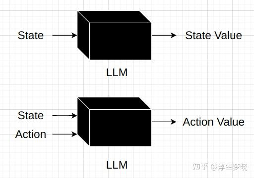
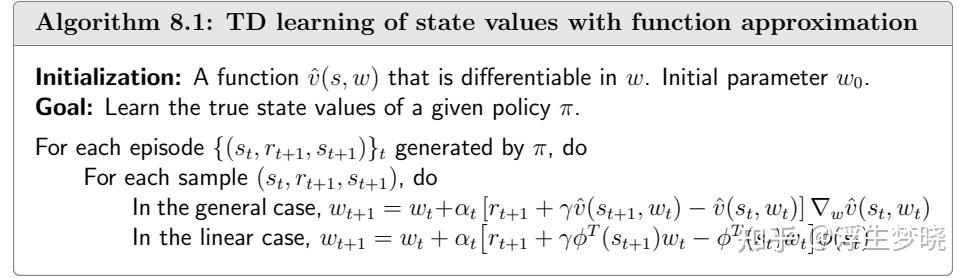
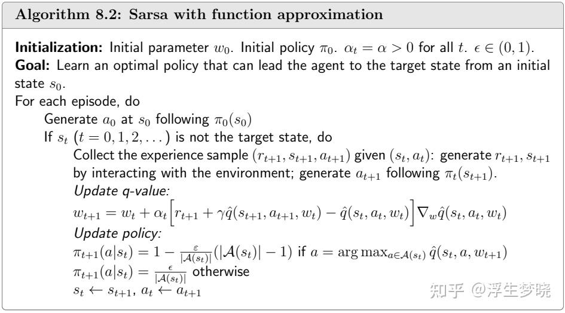
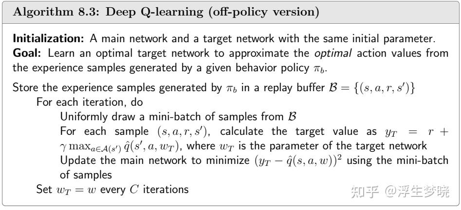
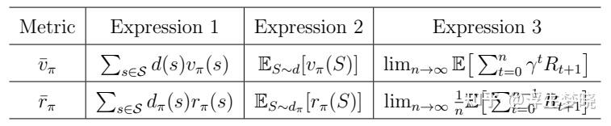

# 强化学习（RL）（从入门到PPO）（三、深度强化学习—基于价值/策略的深度强化学习算法）

**Author:** 浮生梦晓

**Date:** 2025-02-10

**Link:** https://zhuanlan.zhihu.com/p/22964990949

上文内容:

上文介绍的主要是一些基础且后续实用性强的算法，但实际中实用受限，因为状态和动作空间的动态性，因此强化学习与深度学习结合才真正发挥出上面这些算法的优势。

深度神经网络最大的优势是拟合数据分布，并对新数据进行预测，那我们完全可以使用神经网络来预测State Value和Action Value，比如下面示意：

**Value function**

$J(w)=\mathbb{E}[(v_\pi(S)-\hat{v}(S,w))^2],$

伪代码：

**Sarsa的深度神经网络形式。**

伪代码：

**深度神经网络在上面伪代码中扮演的作用是进行策略评估，公式中可以看到仅对中括号后面的q估计求导，这是因为设置目标函数时前面部分是看做实际的q值的，需要看做是具体的标量值，这里是需要注意的，训练时也不能计算梯度。原目标函数是两者相减的平方期望作为损失函数。**

DQN-Deep-Q-learning算法则直接在原始Q-Learning算法上进行优化，没有使用Deep Sarsa的目标函数方法来构建，DQN目前在LLM系统侧应用较少，不再介绍，但算法很巧妙，存在两个深度神经网络互相博弈，直接给出伪代码：

### **Policy Gradient**

上面方法是基于价值的方法，先求解出价值后再进行policy update来更新策略，为什么不能直接对策略更新，策略的本质就是一个函数。

我们的目标是找到最优策略，如果将策略看做是一个函数那么我们目标就是最大化这个函数的损失值，如果将策略参数话，对应的应该是**梯度上升算法**：

$\theta_{t+1}=\theta_t+\alpha\nabla_\theta J(\theta_t)$

如何定义损失函数，什么样的损失函数可以定义出策略的优劣，可以有多种方式：

**这里的d(s)代表每个状态的分布情况，一般是均匀分布，但有些情况下状态分布并不均匀，状态会集中在某几个状态下，因此设置了d(s)，d(s)可能依赖策略，也可能不依赖策略，如果不依赖策略则是固定向量。如果依赖策略，则需要在本策略下采样时在replay buffer中记录下state的分布情况做为当前策略的d(s)。**

第一种目标函数：每步的平均State Value：

$\bar{v}_\pi=\sum_{s\in\mathcal{S}}d(s)v_\pi(s)$

第二种目标函数：一步reward：

$\begin{gathered} \bar{r}_{\pi}\doteq\sum_{s\in\mathcal{S}}d_{\pi}(s)r_{\pi}(s) \\ =\mathbb{E}_{S\sim d_\pi}[r_\pi(S)], \end{gathered}$

其他表述形式：

**根据[策略梯度定理](https://zhida.zhihu.com/search?content_id=253615233&content_type=Article&match_order=1&q=%E7%AD%96%E7%95%A5%E6%A2%AF%E5%BA%A6%E5%AE%9A%E7%90%86&zhida_source=entity)可以求出，上面几种方式做损失函数在梯度上是等价的。**

策略梯度定理的证明：

最终策略梯度的统一范式： $\nabla_\theta J(\theta) \propto \sum_{s \in \mathcal{S}} \nu^{\pi_\theta}(s) \sum_{a \in \mathcal{A}} Q^{\pi_\theta}(s,a) \nabla_\theta \pi_\theta(a|s) \\[1em]  = \sum_{s \in \mathcal{S}} \nu^{\pi_\theta}(s) \sum_{a \in \mathcal{A}} \pi_\theta(a|s)Q^{\pi_\theta}(s,a) \frac{\nabla_\theta \pi_\theta(a|s)}{\pi_\theta(a|s)} \\[1em]  = \mathbb{E}_{\pi_\theta}[Q^{\pi_\theta}(s,a) \nabla_\theta \log \pi_\theta(a|s)]$

**补充一点：这里我们目标是最大化目标函数，因为目标函数是我们需要最优的策略，所以我们使用梯度上升算法来求解空间中的最大或极大值，不同于神经网络中的目标函数是最小化目标函数，在解空间中求最小或极小值。两者之间有个共性问题是目标函数的梯度越大，则往最大或最小目标解走的步长也就越大，整体函数也就越拟合使得当前梯度变大的数据。**

因此直观上理解上面策略梯度公式，当目前的Q(s,a)比较大时意味着梯度值变大，整体函数也会更拟合这个<s,a>pair（打个比喻就是吃了一家饭店觉得很好吃，以后再做选择更倾向于这家饭店），当Q(s,a)比较小甚至是负数时会不那么拟合这个<s,a>pair对。

还有个扩展理解，Q(s,a)是很多步reward的累加，再把上面公式拿过来：

$G_t = R_t + \gamma R_{t+1} + \gamma^2 R_{t+2} + \cdots = \sum_{k=0}^{\infty} \gamma^k R_{t+k} \\[1em]  Q^\pi(s,a) = \mathbb{E}_\pi[G_t|S_t = s, A_t = a]$

如果我只选择一步，即使用单步reward作为损失函数，也就是上面的第二种目标函数，也就是在单步的action下做策略的梯度更新，对比LLM自回归的预测下一个token，如果将LLM提示词当做State，vocab size作为action space，选择下一个token作为action，那么其梯度也是上面形式：

$策略梯度： \nabla J(\theta) = \mathbb{E}_{\pi_\theta}\left[\frac{\partial \log \pi_\theta(a|s)}{\partial \theta} Y_{sa}\right] \\[1em]  自回归： \nabla L(w) = \mathbb{E}_{(x,y)\sim p}\left[-\frac{\partial \log P_w(y|x)}{\partial w}\right]$

**我们策略** $\pi$ **的本质也是一个多分类函数，输出的是每个action在当前策略下的概率，LLM输出同样是一个多分类函数，输出是next token，本质上来说LLM就是一种策略函数，可以看到当我们预训练或者监督微调时每个token作为动作的奖励都是1，这意味着我们无条件信任给定的专家数据来进行LLM的梯度更新，也可以说是策略的更新。从这个观点来看，LLM监督微调或无监督预训练本质上都属于强化学习的一种，只不过奖励函数被隐藏掉了（因为都是1）。实际在强化学习中这种基于专家数据进行offline且off policy的方案称为模仿学习或者行为克隆，一般可以快速提升策略能力，降低强化学习整体的训练时间。**

之前提到的方法策略都是从随机状态出发开始迭代，其实可以使用一些专家数据直接对策略进行提升，在LLM中就是预训练和监督微调，本质上在强化学习框架中是先使用一些默认正确的数据将策略提升到比较好的水平，但是专家数据和真实世界是有gap的，所以强化学习还是需要做online and onpolicy的训练来尽可能弥补这个gap。这也是为什么LLM输出存在幻觉的主要原因，就是ood（out of distribution）训练的数据分布了。

**以上是深度神经网络的基础部分，目前前沿算法上也分为基于价值的深度强化学习以及基于策略的深度强化学习两个大的方向，由于PPO这一主线是基于策略的深度强化学习方案，下一篇会重点对[Actor-Critic](https://zhida.zhihu.com/search?content_id=253615233&content_type=Article&match_order=1&q=Actor-Critic&zhida_source=entity)以及其延伸出的[TRPO](https://zhida.zhihu.com/search?content_id=253615233&content_type=Article&match_order=1&q=TRPO&zhida_source=entity)、PPO算法进行解读。**

## 参考资料：

### 书籍：

-   蘑菇书：[https://datawhalechina.github.io/easy-rl/#/](https://link.zhihu.com/?target=https%3A//datawhalechina.github.io/easy-rl/%23/)
-   强化学习的数学原理：[https://github.com/MathFoundationRL/Book-Mathematical-Foundation-of-Reinforcement-Learning](https://link.zhihu.com/?target=https%3A//github.com/MathFoundationRL/Book-Mathematical-Foundation-of-Reinforcement-Learning)
-   动手学强化学习：[https://hrl.boyuai.com/](https://link.zhihu.com/?target=https%3A//hrl.boyuai.com/)

### 视频：

-   [台湾大学李宏毅教授——深度强化学习](https://link.zhihu.com/?target=https%3A//www.bilibili.com/video/BV1XP4y1d7Bk/%3Fspm_id_from%3D333.337.search-card.all.click)
-   [西湖大学赵世钰教授——强化学习的数学原理](https://link.zhihu.com/?target=https%3A//www.bilibili.com/video/BV1sd4y167NS/%3Fspm_id_from%3D333.337.search-card.all.click)
-   [上海交大张伟楠教授——强化学习课程](https://link.zhihu.com/?target=https%3A//www.bilibili.com/video/BV1jUHdePEUZ/%3Fspm_id_from%3D333.1387.upload.video_card.click)