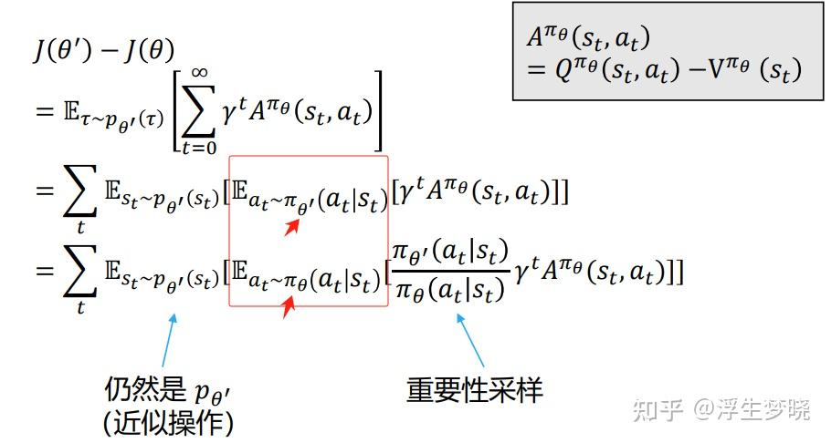

# 强化学习（RL）（从入门到PPO）（四、深度强化学习—Actor-Critic/TRPO/PPO/DPO）

**Author:** 浮生梦晓

**Date:** 2025-02-10

**Link:** https://zhuanlan.zhihu.com/p/22991320124

上文内容:

根据上文的[策略梯度定理](https://zhida.zhihu.com/search?content_id=253620429&content_type=Article&match_order=1&q=%E7%AD%96%E7%95%A5%E6%A2%AF%E5%BA%A6%E5%AE%9A%E7%90%86&zhida_source=entity)，我们可以知道策略梯度中的Q(s,a)并不是固定的，在多种形式上其实是等价的。

$\nabla_\theta J(\theta) \propto \sum_{s \in \mathcal{S}} \nu^{\pi_\theta}(s) \sum_{a \in \mathcal{A}} Q^{\pi_\theta}(s,a) \nabla_\theta \pi_\theta(a|s) \\[1em]  = \sum_{s \in \mathcal{S}} \nu^{\pi_\theta}(s) \sum_{a \in \mathcal{A}} \pi_\theta(a|s)Q^{\pi_\theta}(s,a) \frac{\nabla_\theta \pi_\theta(a|s)}{\pi_\theta(a|s)} \\[1em]  = \mathbb{E}_{\pi_\theta}[Q^{\pi_\theta}(s,a) \nabla_\theta \log \pi_\theta(a|s)]$

**[Actor-Critic架构](https://zhida.zhihu.com/search?content_id=253620429&content_type=Article&match_order=1&q=Actor-Critic%E6%9E%B6%E6%9E%84&zhida_source=entity)其实就是存在两个模型，Actor模型来作为策略生成数据，Critic模型就作为策略评估的模型，策略评估的方法只能是Value，要么是Action Value，要么是State Value。主观上理解Actor产生一系列<s,a>数据，Critic来评估Actor生成这些数据质量如何，也就是将Actor本身看做策略，Critic来评估Actor哪些地方做得好，哪些地方做的不好。就像一个运动员和教练一样，教练根据运动员的动作来指导，可能对运动员每一步或者每几步进行指导。**

**另一个视角来看Actor-Critic架构，其实隐含这对抗博弈的思想，Actor模型产生数据，Critic模型评估数据，评估的本身是找到策略提升点，或者说找Actor的不足，有一些对抗的因素存在，Critic找到策略提升点后会提升Actor能力，同时也会提升自身能力来继续寻找新策略下Actor的策略提升点，直到找不到策略提升点，那么Actor就已经到达了最优策略。**

梯度策略定理可以写成一个更统一的范式，这里的 $\psi$ 实际上代表了Critic模型的输出，也就是说梯度策略定理证明Critic可以有多种形式的输出，对于Actor模型的目标函数来说是等价的： $g = \mathbb{E}\left[\sum_{t=0}^T \psi_t \nabla_\theta \log \pi_\theta(a_t|s_t)\right] \\[1em]  \text{其中，}\psi_t\text{可以有很多种形式：} \\[1em]  1. \sum_{t'=0}^T \gamma^{t'} r_{t'} \text{：轨迹的总回报；} \\[1em]  2. \sum_{t'=t}^T \gamma^{t'-t} r_{t'} \text{：动作}a_t\text{之后的回报；} \\[1em]  3. \sum_{t'=t}^T \gamma^{t'-t} r_{t'} - b(s_t) \text{：基准线版本的改进；} \\[1em]  4. Q^{\pi_\theta}(s_t,a_t) \text{：动作价值函数；} \\[1em]  5. A^{\pi_\theta}(s_t,a_t) \text{：优势函数；} \\[1em]  6. r_t + \gamma V^{\pi_\theta}(s_{t+1}) - V^{\pi_\theta}(s_t) \text{：时序差分残差。}$

**实际中我们经常使用上图中的6，式子6的含义其实代表了当前策略下<s,a>的A(s,a)=Q(s,a)-V(s) 的一步TD（时序差分）形式（当然也可以是多步TD，在PPO中的[GAE](https://zhida.zhihu.com/search?content_id=253620429&content_type=Article&match_order=1&q=GAE&zhida_source=entity)方法），为什么不使用Q(s,a)而使用这个式子，直观上理解A(s,a)的含义是当前策略在这个State下执行动作a带来的Value值比这个State下所有动作带来Value值的均值高多少，如果动作a高于平均值则A(s,a)是正数，代表应该往这个方向走，反之为负数，代表减少这个动作。**

**A(s,a)=Q(s,a)-V(s)这个式子也被称为优势（Advantage），其最主要原因是有些情况下某个state所有的action的奖励值都是正数，那么我们很可能选择一个可能低于平均值的action去更新梯度，这样Actor模型梯度会指向错误的策略方向，因此引入一个基线V(s)来作为baseline，保证每个action有正有负，这样梯度还往目标函数方向收敛。**

**使用优势的Actor-Critic模型被叫做A2C，将Q(s,a)用A(s,a)=Q(s,a)-V(s)代替还有一个潜在优势，即如上面图中的式子6所示，只用State Value即可，不再需要Action Value，这样对于模型来说输出更加稳定，因为输入<s,a>产生一个Value和输入s产生Value在数据集构建、训练上都要容易很多。**

Actor模型的梯度：

$\begin{gathered} \theta_{t+1}=\theta_{t}+\alpha\mathbb{E}\left[\nabla_{\theta}\ln\pi(A|S,\theta_{t})[q_{\pi}(S,A)-v_{\pi}(S)]\right] \\ \doteq\theta_t+\alpha\mathbb{E}\left[\nabla_\theta\ln\pi(A|S,\theta_t)\delta_\pi(S,A)\right]. \\ \delta_\pi(S,A)\doteq q_\pi(S,A)-v_\pi(S) \end{gathered}$

Critic模型的目标函数：

$\mathcal{L}(\omega)=\frac{1}{2}(r+\gamma V_\omega(s_{t+1})-V_\omega(s_t))^2$

其梯度为：

$\nabla_\omega\mathcal{L}(\omega)=-(r+\gamma V_\omega(s_{t+1})-V_\omega(s_t))\nabla_\omega V_\omega(s_t)$

Actor-Critic 算法伪代码：

**还有一点在这里说一下：LLM训练中奖励值或者说对于当前数值的评估是个标量，且永远是正值，这就意味着我保证训练的方向是永远朝向目标的解的，哪怕中间存在一点震荡。但是策略梯度中r(s,a)或者Q(s,a)是由critic模型评估出来的，本身具备一定的不确定性，因为critic模型也是需要动态更新的，所以在Critic模型评估的不准确的时候很容易给出一个错误的Q(s,a)值，Actor模型(也就是我们选择策略梯度目标函数的模型)根据这个错误的Q(s,a)错误的觉得这是个策略提升点进行策略提升后，在下一个策略可能是毁灭性的错误（因为大模型中因为一个错误数据修改的参数可能会造成其他所有任务也错误），这样没办法让actor模型梯度朝着目标方向前进，就像[TRPO](https://zhida.zhihu.com/search?content_id=253620429&content_type=Article&match_order=1&q=TRPO&zhida_source=entity)中的这个图，由于一个错误的动作往前迈了一大步，结果跌回山下（求最大值相当于在爬山，对比神经网络求最小值时去谷底）。这里是提一个引子，后面TRPO和PPO会解决这个问题。**

关于策略梯度中的Q(s,a)如何获取，目前一般做法是使用llm做预估，也就是后面的Actor-Critic架构，还有个传统做法是蒙特卡洛采用，称为**[REINFORCE算法](https://zhida.zhihu.com/search?content_id=253620429&content_type=Article&match_order=1&q=REINFORCE%E7%AE%97%E6%B3%95&zhida_source=entity)**，算法过于简单，不再赘述。

### [重要性采样](https://zhida.zhihu.com/search?content_id=253620429&content_type=Article&match_order=1&q=%E9%87%8D%E8%A6%81%E6%80%A7%E9%87%87%E6%A0%B7&zhida_source=entity)

**在介绍TRPO之前介绍一下重要性采样，我们之前说个策略迭代中存在on policy和off policy，当采样（生成）数据的策略和需要提升的策略相同时是on policy，如果不同就是off policy。使用on policy没有任何问题，但是每次迭代都要根据当前策略采集（生成）数据，效率较慢。如果使用off policy，那么另一个策略生成的数据或者已经存在的专家经验在数据分布上是和当前需要提升的策略生成数据比较是有差异的，使用其他策略生成的数据来更新当前策略很可能会使得当前策略偏移到错误的方向上，但off policy方案在实际中是迫切需要的，一个解决方案就是重要性采样。**

假设存在两个数据分布，p0和p1，可以使用下面等式将两个分布的期望连接起来，里面红框的称为重要性权重，做为两个分布之间的修正项。

$\mathbb{E}_{X \sim p_0}[X] = \sum_{x \in \mathcal{X}} p_0(x)x = \sum_{x \in \mathcal{X}} p_1(x)\frac{p_0(x)}{p_1(x)}x = \mathbb{E}_{X \sim p_1}[f(X)]$

通过重要性权重的修正，在off policy方案中，需要提升的策略只需要在另一个策略的生成数据增加上这个重要性矩阵就可以用于策略提升了。

但重要性矩阵还存在一个问题：

重要性采样只是将两个分布在期望上进行了统一，并没有在方差上进行，根据公式：

## $\mathrm{Var}[X]=E \begin{bmatrix} X^2 \end{bmatrix}-(E[X])^2$

可以看出，虽然两个数据分布在期望上通过重要性权重达到相同，但在方差上仍存在差异。这也是造成训练不稳定的因素之一，在后面TRPO和PPO上有轻微改善。

## TRPO（Trust Region Policy Optimization）-信任区域策略优化

论文地址：

首先回顾一下策略梯度和AC算法，在策略梯度和AC算法中是存在一个目标函数的：

## $J(\theta)=\mathbb{E}_{s_0}[V^{\pi_\theta}(s_0)]=\mathbb{E}_{\pi_\theta}\left[\sum_{t=0}^\infty\gamma^tr(s_t,a_t)\right]$

我们的目标是更新目标函数的参数梯度，从而找到最优的参数使得策略达到最优策略：

$\theta^*=\arg\max_\theta J(\theta)$

因此我们采用的梯度更新的算法，不断沿着目标函数梯度方向去更新梯度，但上面分析可以知道梯度方向很容易走偏，一个重要原因就是前面提到的Critic模型预估不准确问题，很可能拟合到错误的<s,a>数据上从而偏离最优解，或者梯度增长过快很容易踏空。

**还有个更直观的理解，加入和LLM比较，LLM训练时如果学习率过大，也很容易错过最优解，所以梯度增长过大也是同样道理。但不同的是LLM训练目标的解空间基本是可以认为不变或者变化很小，因为给定的数据都是正确的。但强化学习目标函数的解空间在每一次梯度更新时都会发生变化，且变化很大，原因在于每个策略下面的最优解都不相同，解空间一直在变化。**

$\theta_{t+1} = \theta_t + \alpha\mathbb{E}\left[\nabla_\theta \ln \pi(A|S,\theta_t)[q_\pi(S,A) - v_\pi(S)]\right] \\[1em]  = \theta_t + \alpha\mathbb{E}\left[\nabla_\theta \ln \pi(A|S,\theta_t)\delta_\pi(S,A)\right]. \\[2em]  \delta_\pi(S,A) \doteq q_\pi(S,A) - v_\pi(S)$

TRPO的想法是考虑在每次梯度更新时有一个信任区域（trust reigon），在这个区域范围内的更新策略时可以保证梯度更新的安全性，因此叫做信任区域策略优化。

**正片开始：**

传统策略梯度及AC架构的目标函数：

$\begin{aligned}  & J(\theta)=\mathbb{E}_{\tau\sim p_{\theta}(\tau)}[\sum_{t}\gamma^{t}r(s_{t},a_{t})] \\  & J(\theta)=\mathbb{E}_{s_{0}\sim p_{\theta}(s_{0})}[V^{\pi_{\theta}}(s_{0})] \end{aligned}$

上面两种形式是等价的。

为了解决上面目标函数在梯度更新上的问题，首先定义出新旧策略下目标函数的差距：

上面推理过程不感兴趣不用深究，关注最终结果，可以看到最终结果上既有新策略下的分布，又有旧策略的值。

进一步对上图结果展开并使用重要性采样：

根据上图可以看到，我们将累加符号拿到最外面，将新策略下的轨迹展开为状态分布和动作分布两个期望，其中新策略下动作分布期望可以通过重要性采样修正成旧策略下的动作分布。

**注意一点：最外面的状态分布还是新策略下的分布，但是新旧策略下状态分布其实差距不大，所以可以近似到旧策略下的状态分布：**

$J(\theta^{\prime})-J(\theta)\approx\sum_{t}\mathbb{E}_{s_{t}\sim p_{\theta}(s_{t})}[\mathbb{E}_{a_{t}\sim\pi_{\theta}(a_{t}|s_{t})}[\frac{\pi_{\theta^{\prime}}(a_{t}|s_{t})}{\pi_{\theta}(a_{t}|s_{t})}\gamma^{t}A^{\pi_{\theta}}(s_{t},a_{t})]]$

为什么会认为新旧策略下两种的状态分布相差不大，可以参考下面内容，两者的差值会收敛到一个区间：

使用上面灰色区域的目标函数实际上就可以使用旧策略的数据来估计并优化新策略，但为了保险起见，需要尽可能的约束新旧两个策略尽可能接近，这是因为我们将新策略的状态分布近似成了旧状态的状态分布，如何对新旧两个状态进行约束呢？由于策略相当于一个多分类函数，其本身输出的是动作空间中每个动作的概率，所以是一个离散的数据分布，衡量离散数据分布的一个利器就是[KL散度](https://zhida.zhihu.com/search?content_id=253620429&content_type=Article&match_order=1&q=KL%E6%95%A3%E5%BA%A6&zhida_source=entity)(相对熵)，比较简单，不清楚可以自行google。

因此目标函数变成： $\theta' \leftarrow \arg\max_{\theta'} \sum_{t} \mathbb{E}_{s_t \sim p_\theta(s_t)}[\mathbb{E}_{a_t \sim \pi_\theta(a_t|s_t)}[\frac{\pi_{\theta'}(a_t|s_t)}{\pi_\theta(a_t|s_t)}\gamma^t \pi_\theta(s_t,a_t)]]  \text{ such that } \mathbb{E}_{s_t \sim p(s_t)}[D_{KL}(\pi_{\theta'}(a_t|s_t) \| \pi_\theta(a_t|s_t))] \leq \epsilon$

可以看到上面目标函数中实际中是用到了重要性采样，我们之前说off policy才会用重要性采样来修正数据分布之间的差异，那么GRPO是off policy吗？**实际上普遍认同TRPO以及PPO属于on policy**，原因在于增加了KL散度来约束新策略和旧策略，这样两个策略实际上差距很小，默认为数据分布其实相同，且只用到之前一轮的数据，**如果用之前很多轮的数据，就是off policy的。**

TRPO方法形象化展示：

从图中直观理解就是步子迈的小一些，充分考虑当前位置的曲率，每一步都走在信任的安全区域内。

**TRPO一个关键特性就是单调性，这一点也被PPO所继承，单调性保证了每次策略更新都是往更优的策略去更新。**

单调性示意：

## PPO（Proximal Policy Optimization Algorithms）-近端策略优化

论文：

PPO和TRPO都是一个作者——John Schulman，TRPO理论复杂，且实现起来复杂，PPO相对友好。

在TRPO中目标函数： $\theta' \leftarrow \arg\max_{\theta'} \sum_{t} \mathbb{E}_{s_t \sim p_\theta(s_t)}[\mathbb{E}_{a_t \sim \pi_\theta(a_t|s_t)}[\frac{\pi_{\theta'}(a_t|s_t)}{\pi_\theta(a_t|s_t)}\gamma^t A^{\pi_\theta}(s_t,a_t)]]  \text{ such that } \mathbb{E}_{s_t \sim p(s_t)}[D_{KL}(\pi_{\theta'}(a_t|s_t) \| \pi_\theta(a_t|s_t))] \leq \epsilon$

首先PPO中将约束项KL散度与主目标函数进行了合并，原因在于求解约束优化问题十分复杂，TRPO原论文中使用复杂泰勒展开与共轭梯度法来求解。

优化后： $\theta' \leftarrow \arg\max_{\theta'} \sum_{t} \mathbb{E}_{s_t \sim p_\theta(s_t)}[\mathbb{E}_{a_t \sim \pi_\theta(a_t|s_t)}[\frac{\pi_{\theta'}(a_t|s_t)}{\pi_\theta(a_t|s_t)}\gamma^t A^{\pi_\theta}(s_t,a_t)]] -\lambda(D_{KL}(\pi_{\theta'}(a_t|s_t) \| \pi_\theta(a_t|s_t)) - \epsilon)$

**除此之外PPO还做了两项策略优化：近端策略优化惩罚和近端策略优化裁剪。正因为这两项优化，加上KL散度使得两个策略非常近，所以论文名称叫近端策略优化。**

**近端策略惩罚：**

从图上看一目了然：

-   当KL散度小于设置值的1.5倍时，KL约束因子缩减一倍，即新旧策略距离过近时，目标函数更注重策略提升点。
-   当KL散度大于设置值的1.5倍时，KL约束因子增加一倍，即新旧策略距离过远时，增加KL散度约束，减少策略提升点带来的影响。

**近端策略裁剪：**

TRPO主函数：

$L^{CPI}(\theta)=\hat{\mathbb{E}}_t\left[\frac{\pi_\theta(a_t\mid s_t)}{\pi_{\theta_{\mathrm{old}}}(a_t\mid s_t)}\hat{A}_t\right]=\hat{\mathbb{E}}_t\left[r_t(\theta)\hat{A}_t\right]$

策略裁剪后目标函数：

$L^{CLIP}(\theta)=\hat{\mathbb{E}}_t\left[\min(r_t(\theta)\hat{A}_t,\operatorname{clip}(r_t(\theta),1-\epsilon,1+\epsilon)\hat{A}_t)\right]$

**裁剪的目的在于之前提到的重要性采样带来方差的问题，为了减弱重要性采样使得方差过大因此针对此项进行裁剪。**

由于我们是最大化目标函数，将裁剪后目标函数展开后为：

$\arg\max_{\theta}\mathbb{E}_{s\sim\nu^{\pi_k},a\sim\pi_k(\cdot|s)}\left[\min\left(\frac{\pi_\theta(a|s)}{\pi_{\theta_k}(a|s)}A^{\pi_{\theta_k}}(s,a), \text{clip}\left(\frac{\pi_\theta(a|s)}{\pi_{\theta_k}(a|s)}, 1-\epsilon, 1+\epsilon\right)A^{\pi_{\theta_k}}(s,a)\right)\right]$

为方便理解裁剪的作用，简单理解为：

$\operatorname{clip}(x,l,r):=\max(\min(x,r),l)$

也就是说重要性采样值被限制在了区间\[1-ε,1+ε\]中，超参数ε代表裁剪范围。

更通俗的理解：

**PPO还有一个优化点，即GAE (Generalized Advantage Estimation)-广义优势估计**

我们之前的优势都是基于一步时序差分的：

$\delta_t=r_t+\gamma V(s_{t+1})-V(s_t)$

**前面我们介绍[TD算法](https://zhida.zhihu.com/search?content_id=253620429&content_type=Article&match_order=1&q=TD%E7%AE%97%E6%B3%95&zhida_source=entity)时提到，一步TD会带来较小的方差（相比MC），但是数据本身的信息量很少，所以用于更新梯度的数据量就很少，甚至无法组成一个minibatch，同时虽然一步TD方差小，但由于当前Critic能力较差，会给出错误的Value，从而造成数据有偏，即偏差大，如何衡量偏差与方差，需要在一步TD与MC之间取值，也就是多步的TD算法，在论文里叫做GAE。**

**总结来说，PPO相比TRPO有以下改进点：**

1.  **将约束性KL散度加入到了Actor的主目标函数**
2.  **在KL散度上增加了一个动态的约束超参数**
3.  **对重要性采样增加截断区间**
4.  **将优势从1步TD扩展到了多步TD，平衡方差与偏差。**

**补充一点，前面主要的操作都是针对Actor的目标函数，那么Critic的目标函数呢？如果没有忘记Critic是什么，那么就会发现其就是GAE这一项的平方值，实现上和Value base的深度神经网络没有区别，实际中可能会增加clip等trick。**

## DPO(Direct Preference Optimization)-直接偏好微调

论文：

论文目标：解决rlhf-ppo框架中奖励模型训练困难问题，Critic模型一般和reward模型是同一个模型。

原始的对齐过程是先训练奖励模型，再进行对齐训练，在对齐训练阶段使用rlhf-ppo。

**rlhf面临一些问题：需要先训练奖励模型再根据奖励模型去训练PPO，训练PPO时更是用到了4个模型，整体流程复杂且训练很不稳定。**

**DPO出发点是直接绕过奖励模型，就像标题里提到的，你的语言模型就是一个奖励模型。**

因此DPO全篇都在做两件事情：

-   **绕过奖励模型**
-   **最大程度的简化ppo中的目标函数**

### LLM奖励模型训练

在开始讲解之前先介绍一下奖励模型的训练过程：

LLM的奖励模型是评判<x,y>的分值，其中x是提示词输入，y是LLM的输出内容，我们希望的奖励模型目标是相同x下好的y得分高，坏的y得分低，那么如何在目标函数中拉大好回答与坏回答之间的差距，主要分为两种情况：

**BT（Bradley-Terry）模型**

BT模型主要是应对<prompt, good answer, bad answer>这种区分两个回答的情况，损失函数是尽可能的拉大两者之间差距。

BT模型是个概率模型，假设输入x会产生y1和y2两个回答，r(x,y1)和r(x,y2)分别代表好的回答和坏的回答进入奖励模型后的分值，那么使用BT来表示好回答优于坏回答：

$P(y_1\succ y_2|x)=\frac{exp[r(x,y_1)]}{exp[r(x,y_1)]+exp[r(x,y_2)]}$

可以看到就是softmax求了个概率，我们让好的<x,y>奖励值概率尽可能的高。

加负号就是求最小：

$\begin{aligned} L_R(r_{\phi},D) & =-\mathbb{E}_{(x,y_w,y_l)\sim D}[logP(y_w\succ y_l|x)] \\  & =-\mathbb{E}_{(x,y_w,y_l)\sim D}[log\frac{exp[r(x,y_w)]}{exp[r(x,y_w)]+exp[r(x,y_l)]}] \\  & =-\mathbb{E}_{(x,y_w,y_l)\sim D}[log\frac{1}{1+\frac{exp[r(x,y_l)]}{exp[r(x,y_w)]}}] \\  & =-\mathbb{E}_{(x,y_w,y_l)\sim D}[log\frac{1}{1+exp^{-(r(x,y_w)-r(x,y_l))}}] \\  & =-\mathbb{E}_{(x,y_w,y_l)\sim D}[log\sigma[r(x,y_w)-r(x,y_l)]] \end{aligned}$

上图就是对一个输入的两个回答的奖励模型目标函数。

**PT模型（Plackett-Luce）**

针对多个回答排序，给定一个输入x，如果有一个列表\[y1,y2,y3,…..\]，其中y1最优，y2其次，以此类推。

使用PT模型可以构建成这样：

$P(\tau|y_1,\ldots,y_K,x)=\prod_{k=1}^K\frac{exp[r(x,y_{\tau(k)})]}{\sum_{j=k}^Kexp[r(x,y_{\tau(j)})]}$

还是softmax求概率，跟BT类似，不再赘述。

### DPO公式推导

在ppo中的**近似的**目标函数，之所以是近似，可以看到期望的分布变了：

$\max_{\pi_\theta}\mathbb{E}_{x\sim\mathcal{D},y\sim\pi_\theta(y|x)}\left[r_\phi(x,y)\right]-\beta\mathbb{D}_{\mathbf{KL}}\left[\pi_\theta(y\mid x)\mid|\pi_{\mathrm{ref}}(y\mid x)\right]$

DPO首先是化简rlhf-ppo损失函数，针对上面公式可以有下面的化简内容：

$\begin{gathered} \max_{\pi_{\theta}}\left\{\mathbb{E}_{x\sim\mathcal{D},y\sim\pi_\theta(y|x)}[r_\phi(x,y)]-\beta\mathbb{D}_{\mathrm{KL}}[\pi_\theta(y|x)||\pi_{\mathrm{ref}}(y|x)]\right\} \\ =\max_{\pi_\theta}\mathbb{E}_{x\sim\mathcal{D},y\sim\pi_\theta(y|x)}[r_\phi(x,y)-\beta\log\frac{\pi_\theta(y|x)}{\pi_\mathrm{ref}(y|x)}] \\ =\min_{\pi_\theta}\mathbb{E}_{x\sim\mathcal{D},y\sim\pi_\theta(y|x)}[\log\frac{\pi_\theta(y|x)}{\pi_{\mathrm{ref}}(y|x)}-\frac{1}{\beta}r_\phi(x,y)] \\ =\min_{\pi_\theta}\mathbb{E}_{x\sim\mathcal{D},y\sim\pi_\theta(y|x)}[\log\frac{\pi_\theta(y|x)}{\pi_{\mathrm{ref}}(y|x)e^{r_\phi(x,y)/\beta}}] \end{gathered}$

上面的化简内容十分简单，但到这里后有个逻辑点，就是作者自定义了一个值：

$Z(x)=\sum_y\pi_{\mathrm{ref}}(y|x)e^{r_\phi(x,y)/\beta}$

这里的Z(x)是一个常量，我们来看，首先x是输入，是确定的，每个y是不确定的，但是对y有个求和项，就是对参考模型所有可能y都进行计算，因为所有的y是固定的，也就是vocabsize，所以求和后的内容都可以计算出来，这样Z(x)就成了一个值。

因为我们的目标是绕过奖励模型去优化目标函数，那么就假设我们已经训练出来了一个最优的奖励模型，我们定义一个策略：

$\pi^*(y|x)=\pi_{\mathrm{ref}}(y|x)e^{r_\phi(x,y)/\beta}/Z(x)$

将这个新策略代入上面式子：

$\begin{aligned} \min_{\pi_\theta}\mathbb{E}_{x\sim\mathcal{D},y\sim\pi_\theta(y|x)}\left[\log\frac{\pi_\theta(y|x)}{\pi_{\text{ref}}(y|x)e^{r_\phi(x,y)/\beta}}\right] \\ &= \min_{\pi_\theta}\mathbb{E}_{x\sim\mathcal{D},y\sim\pi_\theta(y|x)}\left[\log\frac{\pi_\theta(y|x)}{\pi^*(y|x)} - \log Z(x)\right] \\ &= \min_{\pi_\theta}\mathbb{E}_{x\sim\mathcal{D},y\sim\pi_\theta(y|x)}\left[\log\frac{\pi_\theta(y|x)}{\pi^*(y|x)}\right] \\ &= \min_{\pi_\theta}\mathbb{E}_{x\sim\mathcal{D}}\left[D_{\text{KL}}(\pi_\theta(y|x)\|\pi^*(y|x))\right] \end{aligned}$

这里可以看到logZ(x)消失了，是因为我们是在求期望，常量值并不会影响目标函数。

经过上面的简化，PPO的目标函数就简化成了，又是一个KL散度，How old are you ！

## $\min_{\pi_\theta}\mathbb{E}_{x\sim\mathcal{D}}\mathbb{D}_{\mathrm{KL}}\left(\pi_\theta(y|x)||\pi^*(y|x)\right)$

所有对PPO目标函数就直接退化成了一个KL散度，目标就是去拟合π satr这个策略，最优的目标函数结果就是最终两个策略达到一致。

那我们目标就是找到这个π star策略。不要忘记我们的目标是绕过奖励函数，那我们是否将训练奖励模型那一步直接融合到训练π star，这样既可以达到训练奖励模型的作用又可以达到训练ppo目标函数的目的。答案是可以的。

根据公式：

$\pi^*(y|x)=\pi_{\mathrm{ref}}(y|x)e^{r_\phi(x,y)/\beta}/Z(x)$

可以得到：

$r_\phi(x,y)=\beta\log\frac{\pi^*(y|x)}{\pi_\mathrm{ref}(y|x)}+\beta\log Z(x)$

将这里的奖励值等式代入到我们前面通过BT和PT推理出来的奖励模型目标函数中：

$\max_{\pi^*}\left\{\mathbb{E}_{(x,y_{\mathrm{win}},y_{\mathrm{lose}})\sim\mathcal{D}}[\log\sigma(\beta\log\frac{\pi^*(y_{\mathrm{win}}|x)}{\pi_{\mathrm{ref}}(y_{\mathrm{win}}|x)}-\beta\log\frac{\pi^*(y_{\mathrm{lose}}|x)}{\pi_{\mathrm{ref}}(y_{\mathrm{lose}}|x)})]\right\}$

$\pi^*$ 是我们期望的最优策略，更换成需要训练的参数：

$\max_{\pi_\theta}\left\{\mathbb{E}_{(x,y_{\mathrm{win}},y_{\mathrm{lose}})\sim\mathcal{D}}[\log\sigma(\beta\log\frac{\pi_\theta(y_{\mathrm{win}}|x)}{\pi_{\mathrm{ref}}(y_{\mathrm{win}}|x)}-\beta\log\frac{\pi_\theta(y_{\mathrm{lose}}|x)}{\pi_{\mathrm{ref}}(y_{\mathrm{lose}}|x)})]\right\}$

这就是<x, y1, y2>这种格式数据的DPO损失函数，同理PT的DPO损失函数：

$\mathcal{L}_{\mathrm{DPO}}(\pi_{\theta},\pi_{\mathrm{ref}})=-\mathbb{E}_{\tau,y_{1},\ldots,y_{K},x\sim\mathcal{D}}\left[\log\prod_{k=1}^{K}\frac{\exp\left(\beta\log\frac{\pi_{\theta}(y_{\tau(k)}|x)}{\pi_{\mathrm{ref}}(y_{\tau(k)}|x)}\right)}{\sum_{j=k}^{K}\exp\left(\beta\log\frac{\pi_{\theta}(y_{\tau(j)}|x)}{\pi_{\mathrm{ref}}(y_{\tau(j)}|x)}\right)}\right]$

可以看到DPO实际上是将目标LLM既当做奖励模型来训练也当做PPO目标函数来训练。

OK，结束了，整理这些东西真费时间，但知识总是慢慢从脑子里溜走，只能一遍遍的复习。。。

## 参考资料：

### 书籍：

-   蘑菇书：[https://datawhalechina.github.io/easy-rl/#/](https://link.zhihu.com/?target=https%3A//datawhalechina.github.io/easy-rl/%23/)
-   强化学习的数学原理：[https://github.com/MathFoundationRL/Book-Mathematical-Foundation-of-Reinforcement-Learning](https://link.zhihu.com/?target=https%3A//github.com/MathFoundationRL/Book-Mathematical-Foundation-of-Reinforcement-Learning)
-   动手学强化学习：[https://hrl.boyuai.com/](https://link.zhihu.com/?target=https%3A//hrl.boyuai.com/)

### 视频：

-   [台湾大学李宏毅教授——深度强化学习](https://link.zhihu.com/?target=https%3A//www.bilibili.com/video/BV1XP4y1d7Bk/%3Fspm_id_from%3D333.337.search-card.all.click)
-   [西湖大学赵世钰教授——强化学习的数学原理](https://link.zhihu.com/?target=https%3A//www.bilibili.com/video/BV1sd4y167NS/%3Fspm_id_from%3D333.337.search-card.all.click)
-   [上海交大张伟楠教授——强化学习课程](https://link.zhihu.com/?target=https%3A//www.bilibili.com/video/BV1jUHdePEUZ/%3Fspm_id_from%3D333.1387.upload.video_card.click)