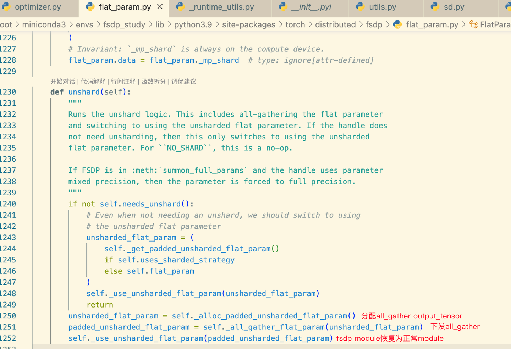
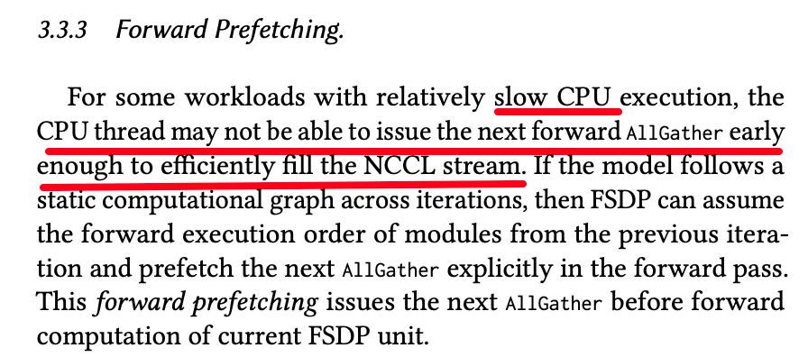
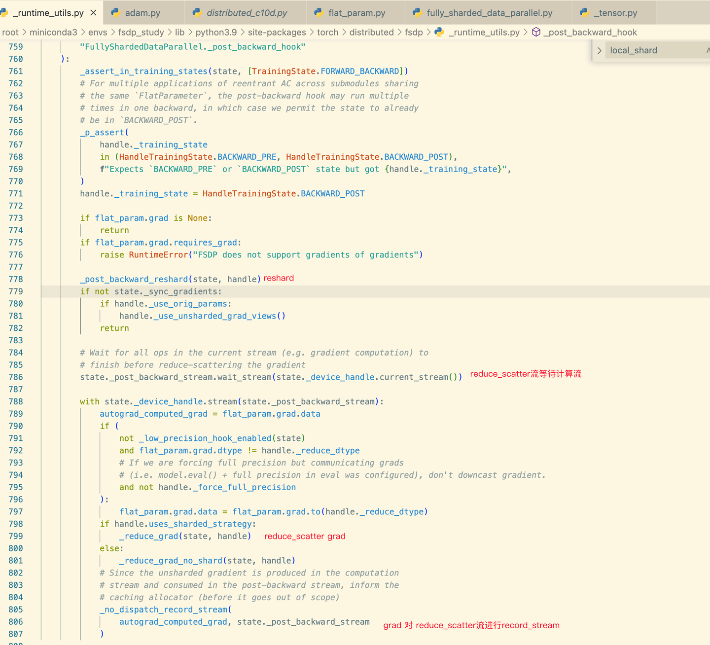

# PyTorch FSDP源码分析

**Author:** GeTLeft

**Date:** 2025-02-17

**Link:** https://zhuanlan.zhihu.com/p/19366919145

本文主要参考了PyTorch 2.1.2的FSDP的源码和[PyTorch FSDP论文](https://link.zhihu.com/?target=https%3A//arxiv.org/pdf/2304.11277)，论文中高屋建瓴的描述了FSDP的架构、设计动机，比如[EventQueue](https://zhida.zhihu.com/search?content_id=252895946&content_type=Article&match_order=1&q=EventQueue&zhida_source=entity)，反向为何需要Prefetch等等，推荐细读。

也推荐看看PyTorch官方的其他论文：

PyTorch2 Dynamo:

[https://pytorch.org/assets/pytorch2-2.pdf​pytorch.org/assets/pytorch2-2.pdf](https://link.zhihu.com/?target=https%3A//pytorch.org/assets/pytorch2-2.pdf)

PyTorch DDP:

[arXiv reCAPTCHA​arxiv.org/pdf/2006.15704](https://link.zhihu.com/?target=https%3A//arxiv.org/pdf/2006.15704)

TorchTitan:

[arXiv reCAPTCHA​arxiv.org/pdf/2410.06511](https://link.zhihu.com/?target=https%3A//arxiv.org/pdf/2410.06511)

## 什么是FSDP

首先翻译一下，什么是 FullyShardedDataParallel，第一次看到这个名字可能有点疑惑：

-   Sharded ：切分，比如zero1将优化器切分，可以翻译成 [Optimizer State Sharded](https://zhida.zhihu.com/search?content_id=252895946&content_type=Article&match_order=1&q=Optimizer+State+Sharded&zhida_source=entity)。
-   FullyShard: 所有都切分，包括optimizer state, grad, param

所以FullyShardedDataParallel就是PyTorch实现的zero3。

**那在许多第三方框架已经有了zero实现情况下，为啥torch要再实现一遍呢？**

1.  许多框架自己实现了fsdp，但是兼容性不好；比如torch升级了，可能DS的fsdp就失效了。
2.  许多框架的实现不是通用的，而是与某个网络类型绑定。torch基于此提出了wrap policy，后文会给出例子
3.  可以在torch自身之上，做一些第三方框架难以做到的优化，快速增加一些feature。

比如 Megatron DS 的DP部分都使用了 `expand_as().grad_fn.next_functions[0][0].register_hook()` 这种非常别扭的方式来注册gradient accumulate hook，而torch官方开发fsdp后，直接官方支持了这个feature：[https://github.com/pytorch/pytorch/pull/107063](https://link.zhihu.com/?target=https%3A//github.com/pytorch/pytorch/pull/107063)

4\. pytorch代码结构太庞大了、功能太多了、交织复杂，是一座有组织的屎山，想要让更多的pytorch特性也可以和zero3结合（比如dynamo，meta tensor, [DTensor](https://link.zhihu.com/?target=https%3A//pytorch.org/docs/stable/distributed.tensor.html)），以及非常多的corner case，除了torch下场支持，其他人没有这么大的动力和能力。比如FSDP2的从FlatParameter切换为了DTensor。

## FSDP 现状

还在持续开发 fsdp2 [https://github.com/pytorch/torchtitan/blob/main/docs/fsdp.md](https://link.zhihu.com/?target=https%3A//github.com/pytorch/torchtitan/blob/main/docs/fsdp.md)

纯python实现

代码量大：13664行 （2.1.2），接下来以PyTorch 2.1.2的源码**（FSDP1）**来分析。

## FSDP接口

```python
 torch.distributed.fsdp.FullyShardedDataParallel(module,
    process_group=None,
    sharding_strategy=None,
    cpu_offload=None,
    auto_wrap_policy=None,
    backward_prefetch=BackwardPrefetch.BACKWARD_PRE,
    mixed_precision=None,
    ignored_modules=None,
    param_init_fn=None,
    device_id=None,
    sync_module_states=False,
    forward_prefetch=False,
    limit_all_gathers=True,
    use_orig_params=False,
    ignored_states=None,
    device_mesh=None
)
```

  

常用参数如下：

ShardingStrategy

| 参数 |   | 备注 |
| --- | --- | --- |
| FULL_SHARD（默认） | Parameters, gradients, and optimizer states are sharded. For the parameters, this strategy unshards (via all-gather) before the forward, reshards after the forward, unshards before the backward computation, and reshards after the backward computation. For gradients, it synchronizes and shards them (via reduce-scatter) after the backward computation. The sharded optimizer states are updated locally per rank. | zero3 |
| SHARD_GRAD_OP | Gradients and optimizer states are sharded during computation, and additionally, parameters are sharded outside computation. For the parameters, this strategy unshards before the forward, does not reshard them after the forward, and only reshards them after the backward computation. The sharded optimizer states are updated locally per rank. Inside no_sync(), the parameters are not resharded after the backward computation. | 介于zero2 zero3之间与FULL_SHARD的区别是前向做完后，参数不reshard，而反向之后才reshard；节省了反向all gather的时间。 |
| NO_SHARD | Parameters, gradients, and optimizer states are not sharded but instead replicated across ranks similar to PyTorch’s DistributedDataParallel API. For gradients, this strategy synchronizes them (via all-reduce) after the backward computation. The unsharded optimizer states are updated locally per rank. | zero0 即 pytorchDDP |
| HYBRID_SHARD | Apply FULL_SHARD within a node, and replicate parameters across nodes. This results in reduced communication volume as expensive all-gathers and reduce-scatters are only done within a node, which can be more performant for medium -sized models. |   |
| _HYBRID_SHARD_ZERO2 | Apply SHARD_GRAD_OP within a node, and replicate parameters across nodes. This is like HYBRID_SHARD, except this may provide even higher throughput since the unsharded parameters are not freed after the forward pass, saving the all-gathers in the pre-backward. |   |

auto\_wrap\_policy：如何将model切分为多个fsdp module，需要用户指定

mixed\_precision: 混精方式

### 基本用法

```python
class Net(nn.Module):
    def __init__(self, H):
        super(Net, self).__init__()
        self.fc0 = nn.Linear(H, H, bias=False)
        self.fc1 = nn.Linear(H, H, bias=False)
        self.fc2 = nn.Linear(H, H, bias=False)
        self.fc3 = nn.Linear(H, H, bias=False)
        self.fc4 = nn.Linear(H, H, bias=False)


        
    def forward(self, x):
        x = self.fc0(x)
        x = self.fc1(x)
        x = self.fc2(x)
        x = self.fc3(x)
        x = self.fc4(x)
        return x
    
 def main():
    def lambda_fn(module: nn.Module):
        if isinstance(module, nn.Linear):
            return True
        else:
            return False
    policy = CustomPolicy(lambda_fn)
    
    fsdp_model = FSDP(
        model, device_id=torch.cuda.current_device(),
        sharding_strategy=ShardingStrategy.FULL_SHARD,
        auto_wrap_policy=policy
    )
    print(fsdp_model)
    
    optimizer = optim.Adam(fsdp_model.parameters())
    
    
    #...
    #和正常的模型一样去使用fsdp_model做训练
    
```

print(fsdp\_model)的结果如下：

```python
FullyShardedDataParallel(
  (_fsdp_wrapped_module): Net(
    (fc0): FullyShardedDataParallel(
      (_fsdp_wrapped_module): Linear(in_features=128, out_features=128, bias=False)
    )
    (fc1): FullyShardedDataParallel(
      (_fsdp_wrapped_module): Linear(in_features=128, out_features=128, bias=False)
    )
    (fc2): FullyShardedDataParallel(
      (_fsdp_wrapped_module): Linear(in_features=128, out_features=128, bias=False)
    )
    (fc3): FullyShardedDataParallel(
      (_fsdp_wrapped_module): Linear(in_features=128, out_features=128, bias=False)
    )
    (fc4): FullyShardedDataParallel(
      (_fsdp_wrapped_module): Linear(in_features=128, out_features=128, bias=False)
    )
  )
)
```

  

## FSDP 源码分析

这里暂时不考虑混精，只看一个fp32的模型在fsdp下的逻辑

### 回顾zero3算法

zero3对模型的优化器状态、梯度、参数进行了切分（shard），如下图所示：


抽象来讲，所有框架在实现zero3时，一般可以分为以下几个步骤：

1.  **初始化**：接受一个模型，将模型的参数(params)进行切分(shard)，每个rank得到切分过的参数(sharded params)。
2.  **前向**：每个rank读入各自的训练数据，将sharded params进行unshard(即all\_gather，AG)，并进行前向(fwd)计算，计算完成后，将unsharded params进行reshard。
3.  **反向**：将unsharded param进行AG，并进行反向计算(bwd)，反向计算完成后，将unsharded params进行reshard，并将梯度(grad)进行reduce scatter(RS)
4.  **优化器step**：基于shard param、reduce scatter的grad，得到updated shard param。

这是一个理论上的zero3的实现，具体pytorch如何实现上面这几个模块，将会在接下来介绍；值得特别注意的几点如下：

**问题0:**CPU需要尽量run ahead，持续下发任务，使得硬件队列总是满的；CPU、GPU的多个流之间如何同步？

**问题1:**all\_gather的parameter为什么在释放之前需要record\_stream，[CudaCachingAllocator](https://zhida.zhihu.com/search?content_id=252895946&content_type=Article&match_order=1&q=CudaCachingAllocator&zhida_source=entity)在多流场景如何使用？

**问题2**:如何使用EventQueue控制params的显存的占用

**问题3:**如何实现反向无侵入的fsdp

**问题4:**反向为何需要prefetch下一层的params

### 用到的流

流的名字有好几种叫法，fsdp至少会用到如下几个流：

device default stream : 默认流、计算流

\_unshard\_stream：all gather 流

\_post\_backward\_stream: reduce grad流、reduce scatter流

  

### 一些其他名词

shard: 对参数进行切分，得到每个rank sharded的参数

unshard: 将切分的参数allgather，得到完整的参数

reshard：将完整的参数释放，只保留每个rank的sharded的参数

sharded：切分后的参数

unsharded：完整的参数

CCA: CudaCachingAllocator

### 初始化

1.  根据auto\_wrap\_policy对root module进行划分，将root module划分成若干fsdp module。
2.  对于每个fsdp module进行初始化

1.  检查是否在cuda上，若不是，则`to.("cuda")`
2.  获得module的所有parameters
3.  `torch.cat(all_params).chunk(WORLD_SIZE)[rank].clone()` 由于chunk是view算子，所以需要clone；此时拿到了每个rank的1d flat\_param
4.  释放原始module的所有parameters

3\. 此时每个rank只持有原始模型的sharded params，如下图所示

注意到，所有初始化操作所有rank上都是完全一致的，这至少保证了一点好处，就是各个rank上的数据初始化，就好像在一个rank上初始化的一样。  


FSDP 初始化完成后的显存布局

  

  

### FSDP 前反向过程图解

在具体介绍前向、反向的过程前，先放一张图。


图比较大，可保存下来观看

##   
前向

前向可分为3个部分：1. pre\_foroward 2. forward 3. post\_forward

### pre\_forward

-   等待 i - 2层的all\_gathered params被释放(reshard)：

event.syncchronize()是CPU阻塞，这正是希望达到的效果；否则因为CCA的存在，分配第i层的all\_gather output\_tensor是一个纯CPU的操作，那么可能会使得模型的参数所占用的显存一下子被全部分配。


我们可以 通过nsys看到cpu 阻塞：


-   分配all\_gather\_base的output\_tensor的空间；一般经过warmup之后，分配空间会经过CudaCachingAllocator
-   下发all\_gather到\_unshard\_stream（又叫all\_gather stream）
-   用all\_gather得到的unshard params作为fsdp module的parameter，之后就可以像一个正常的pytorch module一样，调用fsdp module进行前向运算



-   计算流等待all\_gather流（CPU非阻塞）


上图红框中代码的功能是前向prefetch：在第i层pre\_forward时，提前将i+1层的参数的AllGather下发给GPU；而不是等到i+1层的pre\_forward时，才下发AllGather。

默认情况下，前向prefetch是关闭的：


一般而言，CPU下发kernel是远快于GPU执行的，所以GPU还在进行第i层的计算的时候，CPU已经将第i+1层的All Gather操作下发给GPU了。而计算流和AllGather流是两个Stream。所以第i+1层AllGather可以和第i层的计算并行执行。而当第i层的计算完成后，第i+1层的AllGather也大概率执行完毕了。

存在一种例外，当CPU下发操作的速度慢于GPU执行kernel的速度，此时需要打开forward prefetch:



FSDP论文

-   注册post backward hook（仅第一次前向），用于在backward完成后，进行reshard & reduce scatter。


### forward


### post\_forward

-   all\_gather的params在释放之前对计算流进行record\_stream。


这是由于发生了tensor的跨流分配 & 使用，在pre\_forward的时候 tensor在all gather上被分配；如果不进行record\_stream，那么上图1687行释放给CCA后，下一次all gather流申请memory的时候，大概率又被复用了，此时计算流还未完成。


-   释放all\_gather params的tensor（实际的释放和record\_stream完成的时机有关）
-   创建一个event记录当前计算流的task，并入队；第i+2层的unshard需要等待该event完成。


-   在module的output tensors通过register\_hooks上注册pre\_backward\_hooks，register\_hooks的调用时机是在output\_tensors的梯度计算好之后


（假如module有多个output tensor，那么每个都会注册，但是只有第一个hook会进行反向的unshard，这是通过`handle._ran_pre_backward_hook`这个flag实现的）

  

### 反向

由于我们前向的时候注册了hook，所以反向我们无需侵入式的修改pytorch的反向逻辑，等待hook被调用到即可。同前向一样，反向也分为pre\_backward, backward, post\_backward 3个阶段。

### pre\_backward\_hooks

1.  如果当前层没有被prefetch过，则进行unshard，逻辑大致同前向的1～5
2.  前向一般不进行prefetch，但反向一般会进行prefetch；原因如下：

假设不进行prefetch，那么CPU的执行顺序为 layer i-1 unshard(AG) -> layer i-1 compute -> layer i-1 reshard & RS -> layer i unshard(AG) -> layer i compute ....；尽管我们使用了AG和RS 2个流，似乎layer i unshard可以在layer i-1 RS之前做，接着layer i compute可以执行。但是由于NCCL内部维护了一个nccl 流，所有nccl操作都会按照调用nccl的顺序串行执行，所以layer i unshard必须等待 layer i-1 RS完成，而layer i-1 RS必须等待 layer i-1 compute 完成，通信和计算此时完全串行！！

所以反向必须prefetch。


### backward

autograd engine继续执行

### post\_backward\_hooks

当flat\_param的grad计算完成后，post\_backward\_hooks被调用

1.  reshard 类似post\_forward 1~3
2.  reduce scatter 等待计算流
3.  797行应该是bf16 grad to fp32?需要确认下
4.  调用nccl reduce scatter
5.  grad是在计算流上分配，在RS流上使用，需要record\_stream防止释放



### 优化器

直接做就行，做完也不用特殊处理，下一次fwd会把updated params all gather。优化器对于FSDP是无感知的。