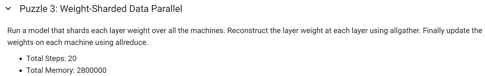
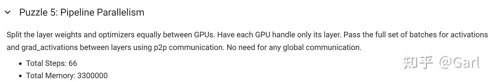
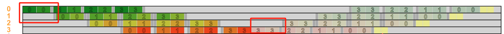
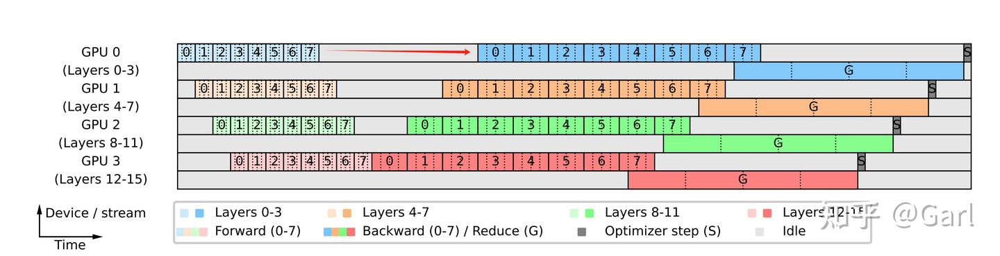

# LLM Training Puzzles - 寒假摸鱼 (2)

**Author:** Garl

**Date:** 2025-03-02

**Link:** https://zhuanlan.zhihu.com/p/20265169815

[Cornell Tech](https://zhida.zhihu.com/search?content_id=253075305&content_type=Article&match_order=1&q=Cornell+Tech&zhida_source=entity) 的 [Sasha Rush 教授](https://link.zhihu.com/?target=https%3A//rush-nlp.com/) 有7个puzzle (triton, llm training, transformer, etc.)。由于圣诞元旦假无聊，所以挑了

[GitHub - srush/LLM-Training-Puzzles: What would you do with 1000 H100s...​github.com/srush/LLM-Training-Puzzles.git](https://link.zhihu.com/?target=https%3A//github.com/srush/LLM-Training-Puzzles.git)

和 [Triton Puzzles](https://link.zhihu.com/?target=https%3A//github.com/srush/Triton-Puzzles/) 来学习（摸鱼）一下。

上一篇文章

[Garl：Triton Puzzles - 寒假摸鱼 (1)74 赞同 · 6 评论](https://zhuanlan.zhihu.com/p/20269643126) 文章

讲了讲Triton/摸了摸鱼，这一篇文章讲讲LLM Training Puzzles，我前后花了差不多6小时（最后一题3小时 ）解决。

  

[My-LLM-Training-Puzzles-Solution/My\_LLM\_training\_puzzles.ipynb at master · GarlGuo/My-LLM-Training-Puzzles-Solution​github.com/GarlGuo/My-LLM-Training-Puzzles-Solution/blob/master/My\_LLM\_training\_puzzles.ipynb](https://link.zhihu.com/?target=https%3A//github.com/GarlGuo/My-LLM-Training-Puzzles-Solution/blob/master/My_LLM_training_puzzles.ipynb)

[Colab Solution​colab.research.google.com/drive/1G\_6tSRaDexLNt3FFI3I85tjMpuk1AIQB?usp=sharing](https://link.zhihu.com/?target=https%3A//colab.research.google.com/drive/1G_6tSRaDexLNt3FFI3I85tjMpuk1AIQB%3Fusp%3Dsharing)

官方也有一个标准答案

  

这个puzzle的目标是设计大致的分布式训练下的具体步骤，然后我们希望减少 GPU idle/bubble time。每道题都给出了各个GPU时间/显存使用可视化界面（**注意这是模拟出来的**）。[LLM-Training-Puzzles/Distributed.ipynb at main · srush/LLM-Training-Puzzles](https://link.zhihu.com/?target=https%3A//github.com/srush/LLM-Training-Puzzles/blob/main/Distributed.ipynb)这个puzzle的目标是设计大致的分布式训练下的具体步骤，然后我们希望减少 GPU idle/bubble time。每道题都给出了各个GPU时间/显存使用可视化界面（**注意这是模拟出来的**）。

模拟的源码在

我当时是边对照这个边写puzzle的。

  

**注意:**

1\. 全部题目都是用上面 [lib.py](https://link.zhihu.com/?target=https%3A//github.com/srush/LLM-Training-Puzzles/blob/main/lib.py) 得出模拟的时间和空间。大致还是make sense，不过有一个特例：PyTorch distributed collective protocols 对于 all\_gather, all\_reduce, ... 一般支持定义一个 [ProcessGroup](https://zhida.zhihu.com/search?content_id=253075305&content_type=Article&match_order=1&q=ProcessGroup&zhida_source=entity)，使得不同的 ProcessGroup 还是能走相应的代码 [Distributed communication package - torch.distributed](https://link.zhihu.com/?target=https%3A//pytorch.org/docs/stable/distributed.html%23torch.distributed.all_gather) （假如我没记错的话），这里不行。

2\. forward & activation caching, backward, optimizer update的步骤都得显性地写出来。

  

在开始之前我们需要了解常见的 point-to-point & collective comm protocols:

-   Point-to-point:

-   send, receive
-   scatter, gather

-   Collective

-   all\_gather
-   all\_reduce
-   reduce\_scatter

详情见

[Point-to-point communication](https://link.zhihu.com/?target=https%3A//docs.nvidia.com/deeplearning/nccl/user-guide/docs/usage/p2p.html%23point-to-point)

[Collective Operations](https://link.zhihu.com/?target=https%3A//docs.nvidia.com/deeplearning/nccl/user-guide/docs/usage/collectives.html)

最重要的三个 collective comm: all\_reduce, all\_gather, scatter\_reduce 镇楼

注意 PyTorch 里面是叫 scatter\_reduce

每一道题都需要 **我们完整地 forward + backward + optimizer step 走完一步**

  

  

## **Puzzle 0**

### Solution

1.  拿到 input embeddings
2.  从 layer = 0 .. LAYERS - 1 我们逐层forward 并存好每一层的 activation ( $x_l$ )
3.  最后一层，算出loss，并得到 $dz_{L}$
4.  从 LAYERS - 1 到 0 我们逐层 backward。每次用这一层存好的 activation ( $x_l$ ) 和上一层的 grad activation ( $dz_{l + 1}$ ) 来算这一层的 grad weight ( $dw_l$ )
5.  用 grad weight 进行 optimizer step

我就不存 grad weight 了，因为我们可以 _动态地_ 算出梯度然后直接走 optimizer step

（fused optimizer step w. backward）

挺直观的

时间空间也合格

  

  

## Puzzle 1

把 minibatch 拆成若干个 microbatch，基操了。

### Solution

注意 因为microbatch的关系 我们不能再把 optimizer step 和 backward 融合到一起了

  

  

## Puzzle 2

[DDP](https://zhida.zhihu.com/search?content_id=253075305&content_type=Article&match_order=1&q=DDP&zhida_source=entity)也是我们的老朋友了。每个GPU跑自己本地的 microbatch，然后算出grad。**我们需要 all\_reduce grad** （真实的PyTorch代码 还要加上 ReducedOp.SUM 然后除以 # ranks）

### Solution

这里的 allreduce 模拟代码不要求 除以 # ranks，大家再用PyTorch的时候记得加上。

  

  

## Puzzle 3

我们这次要切分每一层的 model weights 到各个device上。注意我们在这里 同时切分了data。

PS: 切分 nn.Linear 很简单，给定 Y = X @ W.T 我们只要沿着 W row 来切就行。

### Solution

-   每一层的 forward 和 backward 之前 all\_gather weights。**使得每个client有全局weights做 forward/backward (Weight-sharded 基操）**
-   **同时算好grad weight后 all\_reduce (DDP 基操）**

weights 前加 all\_gather，grad\_weights后加 all\_reduce

WSDP看上去很优雅，但实际上有资源的浪费：

-   每个client的只有 sharded weight 和 sharded opt states，但我们通过 allreduce 拿到了全局的 grad weight，**但显然我们只要 sharded grad weight 就能完成 optimizer step on sharded weight**

**解决方案就是 allreduce 改成 scatter-reduce，也就是 Puzzle 4**

  

  

## Puzzle 4

和 Puzzle 3 唯一的区别：我们不再用 allreduce 而是用 scatter-reduce

### Solution

红色圈是唯一的改变，简单易懂

  

  

## Puzzle 5

沿着 层 切到各个device上，这时候我们需要 p2p 的交流了

### Solution

首先我们用 my\_layers 存好自己负责哪几层，然后使用正确的 p2p 传递 activations & grad\_activations 就行

forward部分 (1/2)

backward 部分 (2/2)

**注意我们 不能 把每个client的 optimizer step 和 backward 融合到一起，（我们必须得存好 grad weight）因为optimizer step 会让每个 client 的时间变长 \*\* 并连带着 下一个GPU的等待时间 变长 \*\*，结果如下图所示**

时空图（时间上，空间下）：红圈就是融合了 optimizer step 和 backward 的时长，黄色块代表 optimizer step，注意此时黄色块在灰色块（send-recv交流）之前，所以黄色块延长了下一个device的等待时间

**所以会分析 GPU Bubble Time 的来源很重要，下面是正确的结果，注意黄色块和下一层的 backward 重叠了**

这里的黄色块在灰色块/send-recv交流后，和下一个device的backward时间重叠，所以没造成阻塞。

  

  

## Puzzle 6

Puzzle 5 我们每次会前传反传整个minibatch，可以看到每层很长的forward/backward时间顺带增加了其他device的等待时间。我们这里需要把 minibatch 变成 microbatch，从而缩短 bubble time。

前传反传整个 |minibatch| = 4

  

我们希望变成这个效果。每次 快速地 前/反传一个microbatch就交给下一个device，尽可能缩短下一个device等待的时间

### Solution

每次前/反传一个 microbatch 的 activation/grad\_activation 就行，idea其实很简单。

  

  

## Puzzle 7

最后一个puzzle了。

我们把之前的 FSDP 加进来。每一层再切给 4个device。

思路很简单：我们每次前/反传在属于自己的层数时走 FSDP，再走完自己层数后最后来一次 P2P 交流给下一个device 当前的 activation/grad\_activation。

  

我当时卡了3个小时的主要原因是 [lib.py](https://link.zhihu.com/?target=https%3A//github.com/srush/LLM-Training-Puzzles/blob/main/lib.py) 里面模拟的 all\_\* 交流必须得全部rank参加，但很明显 pipeline 要求我们只用几层参加就行，然后我也没找到其他能绕过的方案。**后面看了官方参考答案 才知道官方也是全部rank参加沟通，不过不属于自己层的用一个空的 empty\_grad 代替，然后也会 all\_gather 传给互相所有 model weights（这里是和 pipeline 有点背道而行了）**

### My Solution

model forward (1/2)

model backward (2/2)

结果是正确的，但因为我手动实现的 layergroup\_all\_gather 和 layergroup\_scatter\_reduce 是底层用 P2P 实现的，所以时间很慢。

由于我手写的 layergroup\_\* 用多次P2P交流导致整体的 comm. time 过长。这里可以看到每次交流都有 若干个灰色块 叠在一起。

### Official Solution

  

但我并不认为官方的答案解决了本质问题：理想条件下，我们应该在每个 pipeline layers 开一个对应的 comm group，然后每个 comm group 内部走各自的 all\_gather & scatter\_gather。

  

差不多是我的 layergroup\_all\_gather, layergroup\_scatter\_reduce 用 collective comm. 实现。

之前提到 [PyTorch all\_gather](https://link.zhihu.com/?target=https%3A//pytorch.org/docs/stable/distributed.html%23torch.distributed.all_gather) 是支持 ProcessGroup 这个功能的，和我想的也比较接近。

并没有解决 pipeline layer 全局传输不必要信息的问题。理想条件下，我们应该在每个 pipeline layers 开一个对应的 comm group，然后每个 comm group 内部走各自的 all\_gather & scatter\_gather

不过官方的时空图接近理想条件:

理想条件下的灰色块也差不多长这样

  

  

## Bonus Question: [Breadth-First Pipeline Parallelism](https://zhida.zhihu.com/search?content_id=253075305&content_type=Article&match_order=1&q=Breadth-First+Pipeline+Parallelism&zhida_source=entity)

还有一个 bonus question 实现

后面有机会再写

Looped Pipeline, breadth-first schedule (https://arxiv.org/pdf/2211.05953 Figure 4)

LLM Training Puzzles 也全部解决了

  

  

上一篇摸鱼系列是 Triton Puzzles:

美好的摸鱼时光总是短暂的，后面有机会再更吧。

  

  

* * *

**摸鱼更新一下 bonus question: looped breadth-first schedule**

这里首先要实现 looped pipeline，

核心思想也很简单：

当层数很多的时候，最开始的层会一直干等。

GPipe Bubbles

我们可以让浅层在前/反传的过程中也尽可能地参与到计算中，所以我们**循环地做前反传。**

0 - rank-1 在不同的层之间循环。假设我们有16层4个rank，那么前传的时候走的rank是 0 1 2 3 0 1 2 3 0 1 2 3 0 1 2 3，反传就反过来。

  

接下来是 breadth-first vs. depth-first。

**breadth-first** 是每个 mircobatch 先尽可能地在自己层做完计算后再反传 **（AFAB 的 microbatch版本）**

AFAB 是 breadth-first

**depth-first** 是尽可能地让深层参与到计算过程中，所以完成一个/小几个 microbatch 就优先传给下一层**（1F1B 的 microbatch 版本）**

1F1B 是 depth-first

以上是来自 [https://huggingface.co/spaces/nanotron/ultrascale-playbook?section=pipeline\_parallelism](https://link.zhihu.com/?target=https%3A//huggingface.co/spaces/nanotron/ultrascale-playbook%3Fsection%3Dpipeline_parallelism) 这个资源笔者推荐一波~

  

**Solution**

GPipe + looped pipeline 就可以很轻松地实现了

  

**时空图（上面时间，下面空间）**

基于 layer = 8, rank = 4, looping stage = 2，minibatch = 4 的时空图

和官方的图还是很相似的，注意官方的 reduce 是包含了其他 DP（可以和 PP overlap）。我们这里没有其他的DP

  

其实还有更有意思的另一个实现，不过因为纸张大小不够就不写了（划掉）: 1F1B + looped pipeline，在原paper的 [https://arxiv.org/pdf/2211.05953](https://link.zhihu.com/?target=https%3A//arxiv.org/pdf/2211.05953) Figure 4, subfig 3

depth-first + looped pipeline，原paper figure 4 subfig 3

  

笔者更深入一点的思考：

depth-first 可以减少 bubble time，但是会推迟 looped pipeline 的 gradient reduce time（当需要和 DP 结合的时候）

breadth-first 会增加 bubble time，但是会提早 looped pipeline 的 gradient reduce time （当需要和 DP 结合的时候）

  

所以假如只有 PP 的时候，depth-first 一定比 breadth-first 要好。但需要 PP + DP 的时候，breadth-first 可以实现更早的 gradient reduce 以及更充分的 compute-communication overlap，这个时候 breadth-first 是个更优先的选项。

  

但是 depth-first 也有另一个好处：方便结合 weight gradient 和 output gradient / gradient activation 的解耦。而且可能现实中的 looped pipeline 没那么多？

图源 https://huggingface.co/spaces/nanotron/ultrascale-playbook?section=zero\_bubble\_and\_dualpipe

  

DualPipe 的这张图很明显没有 looped pipe，然后是 depth-first pipeline，也利用了 output gradient / gradient activation 的解耦

  

后面有时间再摸鱼研究一下