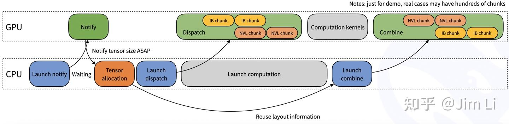

# DeepSeek AI Infra(3) - DeepEP的原理与代码剖析

**Author:** Jim Li

**Date:** 2025-03-03

**Link:** https://zhuanlan.zhihu.com/p/27777601573


## 什么是DeepEP

DeepEP 是一款专为混合专家（MoE）和专家并行（EP）设计的高性能通信库。它具有高效的全连接 GPU 内核（通常称为 MoE 分发和合并），能够实现出色的吞吐量和极低的延迟。此外，DeepEP 支持包括 FP8 在内的低精度计算，确保了深度学习工作负载的灵活性。

为了配合在 DeepSeek-V3 论文中引入的分组受限门控算法，DeepEP 提供了专门为非对称域带宽转发定制的内核。这些内核优化了不同硬件域（如 NVLink 和 [RDMA](https://zhida.zhihu.com/search?content_id=254578194&content_type=Article&match_order=1&q=RDMA&zhida_source=entity)）之间的数据传输，最大限度地提高了训练和推理预填充任务的吞吐量。此外，该库还包含用于管理流式多处理器（SM）使用情况的内置控制功能。

对于要求超低延迟的推理场景，尤其是在解码过程中，DeepEP 集成了一组专门的仅适用于 RDMA 的内核，以显著减少通信延迟。此外，它采用了一种创新的基于钩子的方法，使通信与计算重叠进行，且不消耗任何 SM 资源，从而确保了最佳效率。


在去年的时候DeepSeek已经开源了[DeepSeekMoE](https://zhida.zhihu.com/search?content_id=254578194&content_type=Article&match_order=1&q=DeepSeekMoE&zhida_source=entity)，里面主要是DeepSeekMoE 16B的模型与代码，这次是把其底层训练的专家并行库开源了出来。

## MoE简要回顾

MoE全称是Mixture of Expert, 它是训练超大模型的核心关键，从架构上是在[Transformer Block](https://zhida.zhihu.com/search?content_id=254578194&content_type=Article&match_order=1&q=Transformer+Block&zhida_source=entity)输出之前做最后的特性提取。如果没记错的话，应该最先是由OpenAI在[GPT4](https://zhida.zhihu.com/search?content_id=254578194&content_type=Article&match_order=1&q=GPT4&zhida_source=entity)中使用，而DeepSeek v3更是借助MoE技术把一个671B的超大模型实际计算量降低到37B。它的本质是通过一个门控逻辑让神经网络选择某一块Transformer激活，而不是全部，这样稀疏化的结构可以在运行时减少不必要的计算，同时保持了网络大参数量带来的高性能，是提高预训练效率与推理的神器，让Transformer架构具备非常好的可扩展性。从下图可以看到，在DeepSeek的MoE里面主要分为Routed Expert和Shared Expert 两个部分。这样设计的背后逻辑是将专家进行更细粒度的划分，以实现更高的专家专业化程度和更精准的知识获取；同时隔离一些共享专家，以减轻路由到的专家之间的知识冗余，效果远好于标准的GShard架构。


照例这里也贴一下DeepSeek MoE的公式


其中：

-   ut是FFN输入的第t个token
-   ht′ 是FFN的输出
-   and 分别代表共享专家和路由专家的数量
-   r 表示被激活的路由专家的数量
-   gi,t 是第 i 个专家的门控值
-   si,t 是token与专家之间的亲和度，DeepSeek v3是sigmoid，v2是softmax
-   ei 是该层中第i个路由专家的中心
-   Topk(., K)表示由t 个token与所有路由专家计算得出的亲和度分数中K个最高分数组成的集合。

为了避免细粒度的专家切分导致网络巨大，DeepSeek对MoE架构加了一层限制，让专家最多分布在M个设备中，在每次选择Topk之前，先对筛选出M个有着最高亲和性的设备。同时，研究表明，如果expert负载不均衡，会导致routing崩塌。通常的做法是增加一个auxiliary loss, deepseek则通入引入bias item来实现负载均衡与模型性能之间的平衡。


## Expert Parallelism 专家并行介绍

如果没有了解过各种并行策略，肯定会对这些各种各样的策略分不清楚，这里也贴几张各种并行策略的对比方便大家理解。Expert Parallelism专家并行是可以算是一种稠密版的剪枝算法，以前在卷积神经网络中，我们通常会把权重为0的参数手动去掉。而在MoE里面，则是由神经网络作为路由器进行智能筛选，当然这也会导致一些计算过程中有许多没有参与计算的网络参数占据了GPU显存，不过通常情况下显存都是用不满的，别问我为什么知道…


Source: [https://docs.nvidia.com/nemo-framework/user-guide/24.09/nemotoolkit/features/parallelisms.html](https://link.zhihu.com/?target=https%3A//docs.nvidia.com/nemo-framework/user-guide/24.09/nemotoolkit/features/parallelisms.html)

## 什么是all-to-all

这里也顺便提一下all-to-all这个重要的逻辑算子，它的目的是把让数据能够在每个GPU中流动并且进行相应的操作，在MoE中包含两个关键步骤“分发”与“结合”，也就是dispatch和combine。其中dispatch是把token根据路由信息发送到相应的专家设备中， combine是各个专家处理完分配给自己的令牌后，需要将处理结果合并起来，通常是求和或求平均。在大模型MoE的架构中，各个专家会被切分到各GPU中，每个token会根据门控网络的输出被路由到分布在不同GPU上的expert，由此可见all-to-all的通信效率是多么的重要。

在英伟达的NCCL库中，大部分通信都是要占据运算单元的，因为其本质就是一个个的kernel。而在deepep的实现中，是不会占据任何计算单元的。这又是如何实现的呢？

## DeepEP代码剖析

### 代码结构


### 第三方依赖

-   [\*\*GDRCopy](https://link.zhihu.com/?target=https%3A//github.com/NVIDIA/gdrcopy):\*\* 英伟达官方基于GPUDirect RDMA技术的低延迟显存数据拷贝库
-   [NVSHMEM](https://link.zhihu.com/?target=https%3A//docs.nvidia.com/nvshmem/release-notes-install-guide/install-guide/index.html): 英伟达官方提供的一个编程接口，它在一组 NVIDIA GPU 之间实现了分区全局地址空间（Partitioned Global Address Space，PGAS）模型。

### **inference decoding**使用示例

```python
import torch
import torch.distributed as dist
from typing import Tuple, Optional

from deep_ep import Buffer

# Communication buffer (will allocate at runtime)
# NOTES: there is no SM control API for the low-latency kernels
_buffer: Optional[Buffer] = None

# You may call this function at the framework initialization
def get_buffer(group: dist.ProcessGroup, num_max_dispatch_tokens_per_rank: int, hidden: int, num_experts: int) -> Buffer:
    # NOTES: the low-latency mode will consume much more space than the normal mode
    # So we recommend that `num_max_dispatch_tokens_per_rank` (the actual batch size in the decoding engine) should be less than 256
    global _buffer
    num_rdma_bytes = Buffer.get_low_latency_rdma_size_hint(num_max_dispatch_tokens_per_rank, hidden, group.size(), num_experts)

    # Allocate a buffer if not existed or not enough buffer size
    if _buffer is None or _buffer.group != group or not _buffer.low_latency_mode or _buffer.num_rdma_bytes < num_rdma_bytes:
        # NOTES: for best performance, the QP number **must** be equal to the number of the local experts
        assert num_experts % group.size() == 0
        _buffer = Buffer(group, 0, num_rdma_bytes, low_latency_mode=True, num_qps_per_rank=num_experts // group.size())
    return _buffer

def low_latency_dispatch(hidden_states: torch.Tensor, topk_idx: torch.Tensor, num_max_dispatch_tokens_per_rank: int, num_experts: int):
    global _buffer

    # Do MoE dispatch, compatible with CUDA graph (but you may restore some buffer status once you replay)
    recv_hidden_states, recv_expert_count, handle, event, hook = \
        _buffer.low_latency_dispatch(hidden_states, topk_idx, num_max_dispatch_tokens_per_rank, num_experts,
                                     async_finish=False, return_recv_hook=True)

    # NOTES: the actual tensor will not be received only if you call `hook()`,
    # it is useful for double-batch overlapping, but **without any SM occupation**
    # If you don't want to overlap, please set `return_recv_hook=False`
    # Later, you can use our GEMM library to do the computation with this specific format
    return recv_hidden_states, recv_expert_count, handle, event, hook

def low_latency_combine(hidden_states: torch.Tensor,
                        topk_idx: torch.Tensor, topk_weights: torch.Tensor, handle: Tuple):
    global _buffer

    # Do MoE combine, compatible with CUDA graph (but you may restore some buffer status once you replay)
    combined_hidden_states, event_overlap, hook = \
        _buffer.low_latency_combine(hidden_states, topk_idx, topk_weights, handle,
                                    async_finish=False, return_recv_hook=True)

    # NOTES: the same behavior as described in the dispatch kernel
    return combined_hidden_states, event_overlap, hook
```

### 关键代码

-   **`DeepEP/csrc/config.hpp` - `LowLatencyBuffer`**，该类主要用于管理低延迟模式下的 RDMA 缓冲区，包括发送、接收数据和计数等相关缓冲区，同时提供了一个清理元数据的函数。
-   **`DeepEP/csrc/deep_ep.cpp`**  
    


整体代码实现挺清晰的，主要是包含节点内的dispatch和combine操作，以及节点间的dispatch和combine操作。

由于里面设计到大量RDMA、[InfiniBand Virtual Lane](https://zhida.zhihu.com/search?content_id=254578194&content_type=Article&match_order=1&q=InfiniBand+Virtual+Lane&zhida_source=entity)、NVSHMEM的相关知识与代码，笔者也只能看懂个大概，还需要去补习一下，这里就不继续展开了，相信有了上述的理论基础，大家应该也基本能看懂吧。

### 核心技术点

-   在dispatch 里面是无法提前获知到当前rank会接收到有多少个token，因此在CPU侧设计了一个count signal.



-   多batch的情况下，相比于其他MoE的架构，DeepEP通过接收钩子接口，RDMA（远程直接内存访问）网络流量在后台进行，不会占用计算部分的任何 GPU 流式多处理器（SM）资源。


-   **[PTX](https://zhida.zhihu.com/search?content_id=254578194&content_type=Article&match_order=1&q=PTX&zhida_source=entity)优化**：为了实现极致的性能，DeepSeek发现并使用了一种具有未定义行为的 PTX（并行线程执行，Parallel Thread Execution）用法：使用只读的 PTX 指令 `ld.global.nc.L1::no_allocate.L2::256B` 来读取易变（volatile）数据。PTX 修饰符 `.nc` 表示使用了非一致性缓存。但在 Hopper 架构上，经测试证明使用 `.L1::no_allocate` 可以保证正确性，并且性能会好很多。猜测的原因可能是：非一致性缓存与 L1 缓存是统一的，并且 L1 修饰符不仅仅是一个提示，而是一个强选项，这样 L1 中没有脏数据就可以保证正确性。最初，由于 NVCC（NVIDIA CUDA 编译器）无法自动展开易变读取的 PTX 指令，尝试使用 `__ldg`（即 `ld.nc`）。即使与手动展开的易变读取相比，它的速度也明显更快（可能是由于额外的编译器优化）。然而，结果可能是不正确或有脏数据的。在查阅了 PTX 文档后，发现 Hopper 架构上 L1 缓存和非一致性缓存是统一的。推测 `.L1::no_allocate` 可能会解决这个问题，从而有了这个发现。

## 最后

DeepEP可以说是GPU极致优化的优秀代表作，整体代码量总共1万出头，包含RDMA/GDRC等一系列的先进技术。令人感觉震惊的是这帮充满好奇心的年轻人竟然在研究PTX的文档，只要能抓到一丝可能有优化空间的地方都不放过，respect!

## Reference

> DeepSeekMoE: Towards Ultimate Expert Specialization in Mixture-of-Experts Language Models  
> DeepSeek-V3 Technical Report  
> [https://github.com/deepseek-ai/DeepEP](https://link.zhihu.com/?target=https%3A//github.com/deepseek-ai/DeepEP)