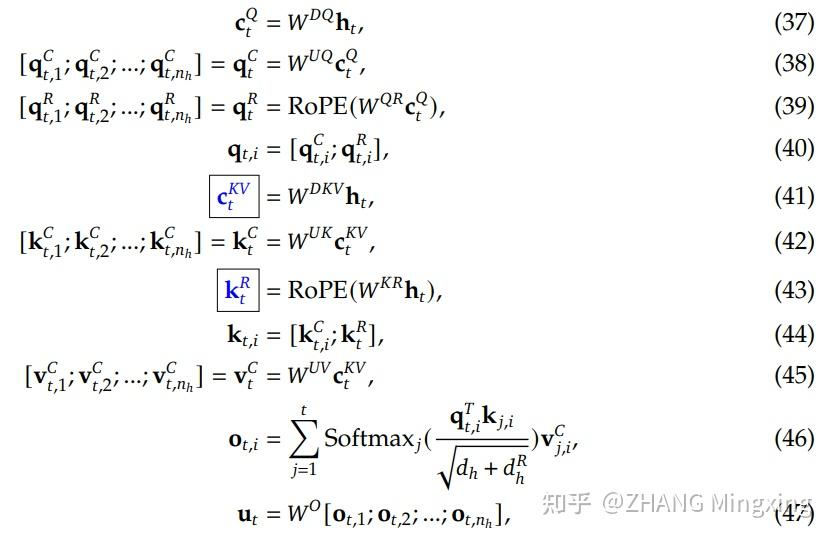
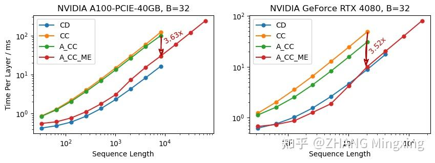

# DeepSeek-V2 高性能推理 (1)：通过矩阵吸收十倍提速 MLA 算子

**Author:** ZHANG Mingxing

**Date:** 2025-03-04

**Link:** https://zhuanlan.zhihu.com/p/700214123

> 作者：
> 
> [@陈劭源](//www.zhihu.com/people/183b6f9a35e28fab6f29e1ff6683ace0)
> 
> ,
> 
> [@ZHANG Mingxing](//www.zhihu.com/people/e737640d16feabedfd7fd87e25f4326f)
> 
> , [MadSys @ Tsinghua](https://link.zhihu.com/?target=https%3A//madsys.cs.tsinghua.edu.cn/)

Update： 已更新兼容 [transformers](https://zhida.zhihu.com/search?content_id=243733609&content_type=Article&match_order=1&q=transformers&zhida_source=entity) 库的 MLA 优化实现，相关 pull request 在 [https://huggingface.co/deepseek\-ai/DeepSeek-V2-Chat/discussions/12](https://link.zhihu.com/?target=https%3A//huggingface.co/deepseek-ai/DeepSeek-V2-Chat/discussions/12)

## TL;DR

之前在回答 [如何看待 DeepSeek 发布的 MoE 大模型 DeepSeek-V2？](https://www.zhihu.com/question/655172528/answer/3494532159) 中有提到，从系统的角度 MLA 是一个非常优秀的、能够充分利用显卡算力的设计。然而可惜的是可能是为了兼容现有生态，现有的开源代码是将 MLA 展开成 MHA 进行的计算，虽然数学等价但既不省显存也不增加计算强度，性能堪忧。

为了充分发挥 MLA 的优势，本文首先详细分析了现有的开源实现，并探索了一种简单易改的“矩阵吸收”技巧的实现方法。测试结果显示优化后的 [DeepseekV2Attention](https://zhida.zhihu.com/search?content_id=243733609&content_type=Article&match_order=1&q=DeepseekV2Attention&zhida_source=entity) 算子实现可以实现单算子十倍以上的提速。

相关测试代码开源在 [https://github.com/madsys-dev/deepseekv2-profile](https://link.zhihu.com/?target=https%3A//github.com/madsys-dev/deepseekv2-profile) 。本周稍晚我们会整理一个可以兼容 transformers 框架的修改版 modeling\_deepseek.py 开源到同一 repo。

## MLA 开源实现分析



Full Formulas of MLA from DeepSeek-V2 paper

上图为论文中给出的 MLA 完整公式，以下对应公式分析实际的开源实现 [modeling\_deepseek.py](https://link.zhihu.com/?target=https%3A//huggingface.co/deepseek-ai/DeepSeek-V2/blob/main/modeling_deepseek.py) 中非 flash attn 版本的 DeepseekV2Attention 算子实现。

### Q向量

在具体的实现过程中其输入为 hidden\_states 向量，对应公式中的 $h_t$。是一个大小为 \[batch\_Size, sequence\_length, hidden\_size\] 的矩阵，其中 hidden\_size 具体为 5120。

MLA 中对 Q 投影矩阵也做了一个低秩分解，对应生成 q\_a\_proj 和 q\_b\_proj 两个矩阵。

其中 q\_a\_proj 大小为 \[hidden\_size, q\_lora\_rank\] = \[5120, 1536\]，对应上述公式中的 $W^{DQ}$ 。

q\_b\_proj 大小为 \[q\_lora\_rank, num\_heads \* q\_head\_dim\] = \[q\_lora\_rank, num\_attention\_heads \* (qk\_nope\_head\_dim + qk\_rope\_head\_dim)\] = \[1536, 128\*(128+64)\] = \[1536, 24576\] 对应上述公式中的 $W^{UQ} $ 和 $W^{QR}$ 合并后的大矩阵

具体投影代码如下：

```text
    # 计算Q：对应公式中的 37-39 行，先降维再升维，好处是相比直接使用大小为 [5120, 24576] 的矩阵
    # [5120, 1536] * [1536, 24576] 这样的低秩分解在存储空间和计算量上都大幅度降低
    q = self.q_b_proj(self.q_a_layernorm(self.q_a_proj(hidden_states)))
    q = q.view(bsz, q_len, self.num_heads, self.q_head_dim).transpose(1, 2)
    # 切分 rope 和非 rope 部分，公式中 40 行反过来
    q_nope, q_pe = torch.split(
        q, [self.qk_nope_head_dim, self.qk_rope_head_dim], dim=-1
    )
```

这里值得注意的一个点是 DeepSeek-V2 有 128 个 heads，明显大于其它同等大小的模型，这个有可能是 MLA 效果比拟 MHA 的关键原因之一。

### KV向量

与Q向量类似，KV向量的生成也是先投影到一个低维的 compressed\_kv 向量（对应 $c_t^{KV}$）再升维展开。具体的代码涉及 kv\_a\_proj\_with\_mqa 和 kv\_b\_proj 两个参数矩阵。

其中 kv\_a\_proj\_with\_mqa 大小为 \[hidden\_size， kv\_lora\_rank + qk\_rope\_head\_dim\] = \[5120, 512 + 64\] = \[5120, 576\]，对应上述公式中的 $W^{DKV}$ 和 $W^{KR}$ 。

kv\_b\_proj 大小为 \[kv\_lora\_rank， num\_heads \* (q\_head\_dim - qk\_rope\_head\_dim + v\_head\_dim)\] = \[512, 128\*((128+64)-64+128)\] = \[512, 32768\]，对应上述公式中的 $W^{UK}$ 和 $W^{UV}$。由于 $W^{UK}$ 只涉及 non rope 的部分所以维度中把 qk\_rope\_head\_dim 去掉了。

具体的代码实现如下：

```python3
        # 对应公式中的 41 和 43 行只是还没有加 rope
        # 一个优化的 MLA KVCache 实现只需要缓存这个 compressed_kv 就行，不过后面实际上展开了
        compressed_kv = self.kv_a_proj_with_mqa(hidden_states)
        # 对应 44 行反过来
        compressed_kv, k_pe = torch.split(
            compressed_kv, [self.kv_lora_rank, self.qk_rope_head_dim], dim=-1
        )
        k_pe = k_pe.view(bsz, q_len, 1, self.qk_rope_head_dim).transpose(1, 2)
        # 对应公式中的 42 和 45 行，将 MLA 展开成标准 MHA 的形式
        kv = (
            self.kv_b_proj(self.kv_a_layernorm(compressed_kv))
            .view(bsz, q_len, self.num_heads, self.qk_nope_head_dim + self.v_head_dim)
            .transpose(1, 2)
        )
        # 因为 kv_b_proj 打包了 W^{UK} 和 W^{UV} 把他们分离出来
        k_nope, value_states = torch.split(
            kv, [self.qk_nope_head_dim, self.v_head_dim], dim=-1
        )
```

通过维度分析可以看到 kv\_lora\_rank 是 qk\_nope\_head\_dim 的 4 倍且 K 和 V 共享 latent state，qk\_rope\_head\_dim 只有 qk\_nope\_head\_dim 的一半，结合起来 4+1/2=9/2 正式下图中 MLA KVCache per Token 大小的来源


不过从代码中我们也可以看到在开源实现中是展开成 MHA 存储的 KVCache，所以没有拿到这部分的收益。

### MHA

在生成 QKV 向量之后后续的流程就基本上等同于标准的 MHA 计算了。唯一的区别在于只有 q\_pe, k\_pe 这两个部分给加上了 rope。

这部分也涉及一个标准的参数矩阵 o\_proj，大小 \[num\_heads \* v\_head\_dim, hidden\_size\] = \[128\*128， 5120\]

```python3
        # 给需要 rope 的部分加 rope
        q_pe, k_pe = apply_rotary_pos_emb(q_pe, k_pe, cos, sin, position_ids)
        
        # 更新和拼接历史 KVCache，可以看到这里存储的是展开后的 MHA KVCache
        # 其中 q_head_dim 等于 qk_nope_head_dim + qk_rope_head_dim
        query_states = k_pe.new_empty(bsz, self.num_heads, q_len, self.q_head_dim)
        query_states[:, :, :, : self.qk_nope_head_dim] = q_nope
        query_states[:, :, :, self.qk_nope_head_dim :] = q_pe
        key_states = k_pe.new_empty(bsz, self.num_heads, q_len, self.q_head_dim)
        key_states[:, :, :, : self.qk_nope_head_dim] = k_nope
        key_states[:, :, :, self.qk_nope_head_dim :] = k_pe
        if past_key_value is not None:
            cache_kwargs = {"sin": sin, "cos": cos}  # Specific to RoPE models
            key_states, value_states = past_key_value.update(
                key_states, value_states, self.layer_idx, cache_kwargs
            )
        
        # 后续就是标准的 MHA 代码 Q^T*K*V*O，不再赘述
        ....
        attn_weights = (
            torch.matmul(query_states, key_states.transpose(2, 3)) * self.softmax_scale
        )
        ....
        attn_weights = nn.functional.softmax(
            attn_weights, dim=-1, dtype=torch.float32
        ).to(query_states.dtype)
        attn_weights = nn.functional.dropout(
            attn_weights, p=self.attention_dropout, training=self.training
        )
        attn_output = torch.matmul(attn_weights, value_states)
        ....
        attn_output = self.o_proj(attn_output)
        ....
```

## 优化实现

优化上述实现的核心在于实现论文中简单提了一句的”矩阵吸收“


### $W^{UK}$ 吸收

比如对于 $W^{UK}$ 矩阵我们有

$atten\_weights = {q_t}^\top k_t = (W^{UQ} c_t^Q)^{\top} W^{UK} c_t^{KV} = {c_t^Q}^{\top}{W^{UQ}}^{\top} W^{UK} c_t^{KV} = ({c_t^Q}^{\top}{W^{UQ}}^{\top} W^{UK}) c_t^{KV} $

也就是说我们事实上不需要将低维的$c_t^{KV}$展开再计算，而是直接将 $W^{UK}$ 通过结合律先和左边做乘法。

对应的实现代码如下

```text
        # 以下和原本实现相同
        bsz, q_len, _ = hidden_states_q.size()
        q = self.q_b_proj(self.q_a_layernorm(self.q_a_proj(hidden_states_q)))
        q = q.view(bsz, q_len, self.num_heads, self.q_head_dim).transpose(1, 2)
        q_nope, q_pe = torch.split(
            q, [self.qk_nope_head_dim, self.qk_rope_head_dim], dim=-1
        )

        kv_seq_len = compressed_kv.size(1)
        compressed_kv, k_pe = torch.split(
            compressed_kv, [self.kv_lora_rank, self.qk_rope_head_dim], dim=-1
        )
        k_pe = k_pe.view(bsz, 1, kv_seq_len, self.qk_rope_head_dim)
        
        # 从 kv_b_proj 中分离的 W^{UK} 和 W^{UK} 两部分，他们要分别在不同的地方吸收
        kv_b_proj = self.kv_b_proj.weight.view(self.num_heads, -1, self.kv_lora_rank)
        q_absorb = kv_b_proj[:, :self.qk_nope_head_dim,:]
        out_absorb = kv_b_proj[:, self.qk_nope_head_dim:, :]
        
        cos, sin = self.rotary_emb(q_pe)
        q_pe = apply_rotary_pos_emb(q_pe, cos, sin, q_position_ids)
        # !!! 关键点，W^{UK} 即 q_absorb 被 q_nope 吸收
        q_nope = torch.einsum('hdc,bhqd->bhqc', q_absorb, q_nope) 
        # 吸收后 attn_weights 直接基于 compressed_kv 计算不用展开。
        attn_weights = torch.matmul(q_pe, k_pe.transpose(2, 3)) + torch.einsum('bhqc,blc->bhql', q_nope, compressed_kv)
        attn_weights *= self.softmax_scale
```

以上的实现主要复杂的地方就是两个 einsum 的维度梳理。

第一个 q\_nope = torch.einsum('hdc,bhqd->bhqc', q\_absorb, q\_nope) 中 q\_absorb 的维度是 \[head\_num, q\_head\_dim, kv\_lora\_rank\]，q\_nope 是 \[batch\_size, head\_num, q\_len, q\_head\_dim\]。相当于做了一个将每个 head 的维度从 q\_head\_dim 投影到 kv\_lora\_rank 的 BMM。

第二个 torch.einsum('bhqc,blc->bhql', q\_nope, compressed\_kv) 中更新后的 q\_nope 的维度是 \[batch\_size, head\_num, q\_len, kv\_lora\_rank\]，compressed\_kv 是 \[batch\_size, past\_len, kv\_lora\_rank\] 。

由于不同 head 的 q\_nope 部分 share 了共同的 compressed\_kv 部分，实际计算的是 batch\_size 个 \[head\_num \* q\_len, kv\_lora\_rank\] 和 \[past\_len, kv\_lora\_rank\] 的矩阵乘法。计算等价于一个 MQA 操作，计算强度正比于 head\_num 的也就是 128。因此相比 MHA，吸收后的 MLA 计算强度要大得多，因此也可以更加充分的利用 GPU 算力。

另外我们没有和原本的实现一样将加上了 rope 的 k\_pe 和没加 rope 的 q\_nope 拼接起来一起，而是分别计算 attn\_weights 再累和，这一技巧在后文中被称之为 [Move Elision](https://zhida.zhihu.com/search?content_id=243733609&content_type=Article&match_order=1&q=Move+Elision&zhida_source=entity)。

### $W^{UV}$ 吸收

对于V的吸收，情况稍微复杂。为表述的清楚性，我们采用Einstein求和约定描述该过程：

```text
v_t = einsum('hdc,blc->blhd', W_UV, c_t_KV) # (1)
o   = einsum('bqhl,blhd->bqhd', attn_weights, v_t)     # (2)
u   = einsum('hdD,bhqd->bhD', W_o, o)       # (3)

# 将上述三式合并，得到总的计算过程
u   = einsum('hdc,blc,bqhl,hdD->bhD', W_UV, c_t_KV, attn_weights, W_o)

# 利用结合律改变计算顺序
o_  = einsum('bhql,blc->bhqc', attn_weights, c_t_KV) # (4)
o   = einsum('bhqc,hdc->bhqd', o_, W_UV)  # (5)
u   = einsum('hdD,bhqd->bqD', W_o, o)     # (6)
```

### 实验结果

通过上述实现，我们实际上得到了三个版本的 算子实现，分别是原始的解压缩版本CacheDecompressed (CD)，吸收后直接使用 compressed\_kv 计算的 Absorbed\_CacheCompressed (A\_CC) 版本，和增加了 move elision 优化的最终版本 Absorbed\_CacheCompressed\_MoveElision (A\_CC\_ME)。

我们分别在 4080 单卡和 A100 单卡上测试了不同 batch size (B) 和不同 sequence length 情况下各实现的性能。




可以看到，随着 sequence length 的提升DeepseekV2Attention 算子中 MLA 的部分在总耗时中的占比不断增加，而这一部分正是受益于计算强度增加更加充分利用算力的部分。在 single query 推理（即 B=1）的情况下如果不考虑模型实际能够支撑的 context length 直接撑满显存的话最高可以有 26 倍的加速。

当然在实际的应用场景下 MLA 更大的作用还是显著降低 KVCache 的显存开销，从而大幅度提升单个 batch 可以容纳的并发数量。并发数量的提升将等比的增加所有 MLP 操作的计算强度，从而优化推理整体过程的算力利用率。这一部分我们计划修改当前的 modeling\_deepseek.py，仅用 kcache 来存储 latent states 实现对 transformers 框架的兼容。相关代码将会在本周稍晚更新至开源 repo。

更详细的分析可以参见 [https://github.com/madsys-dev/deepseekv2-profile/blob/main/workspace/blog/optimizing-mla.md](https://link.zhihu.com/?target=https%3A//github.com/madsys-dev/deepseekv2-profile/blob/main/workspace/blog/optimizing-mla.md)。

## 后续优化


目前上述的代码实现是基于矩阵乘法实现的，因此在计算过程中会需要完整的算出来 attention score 矩阵。如需进一步优化，可以考虑类似[FlashAttention](https://zhida.zhihu.com/search?content_id=243733609&content_type=Article&match_order=1&q=FlashAttention&zhida_source=entity)的做法，即一次性读入整个KV-pair进行计算。由于MLA的K和V是共享同一个压缩表示（实际上，上述优化过的MLA实现非常类似于满足 $K=V$ 的MQA），这样可以进一步减少显存读取，提高计算强度。