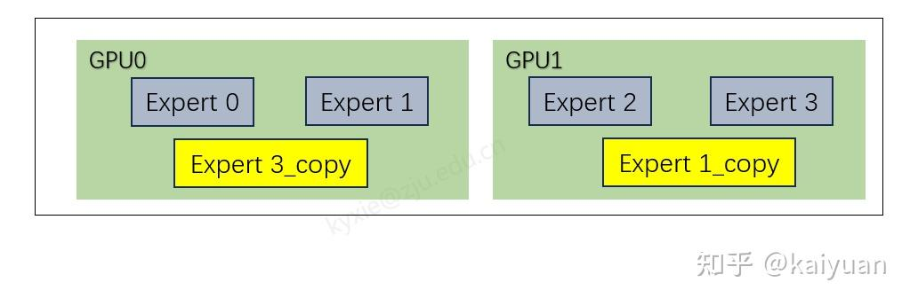
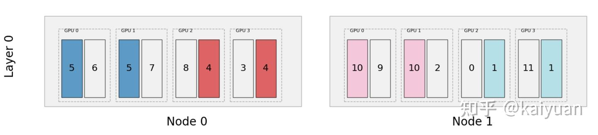

# MoE并行负载均衡：EPLB的深度解析与可视化

**Author:** kaiyuan

**Date:** 2025-03-14

**Link:** https://zhuanlan.zhihu.com/p/29963005584

最近[DeepSeek](https://zhida.zhihu.com/search?content_id=255014897&content_type=Article&match_order=1&q=DeepSeek&zhida_source=entity) 发布了 EPLB（Expert Parallelism Load Balancer），这是一种通过专家冗余来解决专家计算负载不均衡问题的方案，并且开源了一个代码仓库（[EPLB](https://link.zhihu.com/?target=https%3A//github.com/deepseek-ai/EPLB/tree/main)）。经过阅读发现这个仓库更像是一个概念展示，主要用于介绍算法原理。既然如此，我便在原基础上进行了一些升级，使其更易于运行，并增加了可视化功能。

[https://github.com/CalvinXKY/EPLB\_visualization​github.com/CalvinXKY/EPLB\_visualization](https://link.zhihu.com/?target=https%3A//github.com/CalvinXKY/EPLB_visualization)

可视化输入（专家状态）：


EP的组成以及权重状态

专家部署结构可视化：


本文主要分析EPLB的处理逻辑、设计思路。并帮助大家理解如下问题：

-   EPLB是用在训练过程还是推理过程？
-   专家动态调整是发生在什么时候？是每轮迭代吗？
-   调整过程需要重新加载权重吗？
-   均衡的策略怎么设计？

## EP计算平衡问题

在 [Mixture-of-Experts](https://zhida.zhihu.com/search?content_id=255014897&content_type=Article&match_order=1&q=Mixture-of-Experts&zhida_source=entity) (MoE) 架构中，不同专家所接收的输入（tokens）数量存在显著差异，这直接导致了专家计算负载的不均衡。当这些专家被分配到 GPU 上时，负载差异会引发设备间的计算不均衡问题。具体表现为部分 GPU 的算力被过度占用，而另一些 GPU 的算力则处于闲置状态。换句话说，热门专家所在的 GPU 会面临算力紧张的情况，而冷门专家所在的 GPU 则会出现算力浪费的现象。

以下是一个简单的示例，用于说明这一问题。假设模型中有四个专家，分别部署在两张 GPU 上。其中，GPU0 上分配的专家热度较高，需要处理 75% 的输入数据，而 GPU1 上的专家热度较低，仅需处理 25% 的数据


### 全局重排序方案

为了解决不平衡问题，一种解决方案是对专家重新排序，还是以上面示例为例，可以根据分配比例重新排序专家，并采用“高低搭配”的策略来平衡负载，如下所示将专家1和专家2进行位置交换，这样计算量变为：GPU0 45%，GPU1 55%。


### 冗余副本方案

另一种更直接的解决方案是冗余专家策略（[Redundant Experts Strategy](https://zhida.zhihu.com/search?content_id=255014897&content_type=Article&match_order=1&q=Redundant+Experts+Strategy&zhida_source=entity)）。其核心思想是在算力闲置的 GPU 上部署热门**专家的副本**，并将部分**输入分流**到副本上，从而实现负载的均衡。

还是上述例子，在GPU1上面创建一个专家1的副本，然后将25%的计算分到副本。这样计算量：GPU0 50%，GPU1 50%。


方案优缺点：

-   全局重排方案：能够让流量更加均匀，而且不需要消耗额外的内存，但需要调整全部的专家。
-   冗余副本方案：避免专家全局调整，但需要消耗额外内存空间。

EPLB的设计结合前面两种方案，设计前还需要考虑的几个问题：

1.  怎么才知道哪些专家热度高呢？
2.  对哪些专家创建冗余副本？
3.  冗余副本与原专家之间怎么组合？

-   问题1：在EPLB中并未给出详细介绍。可以通过统计历史数据，然后根据历史数据来预测专家的热度。
-   问题2：**简单排序法**：最直接的方式是根据热度对专家进行排序，并为热度最高的专家创建副本。**分组排序法**：根据不同场景的需求，可以先对专家进行分组，然后在每组内按热度排序，选取热度最高的专家创建副本。这种方法可以更灵活地适应不同规模和复杂度的模型。
-   问题3：专家并行计算，不仅要考虑计算、还需要考虑通信，应当尽量降低通信，避免大流量跨节点通信。

然后，搭建一个动态负载均衡系统。如下所示：


动态负载均衡闭环系统

关键要素：

预测器（Predictor）：采集历史数据，根据统计数据预测EP的权重；

平衡器（Balancer）：根据EP权重计算EP的理想分布，获得逻辑到物理EP的映射map；

执行器（Executer）：输入目标EP的部署形态，调整EP在集群中的部署。

执行器是[LLM](https://zhida.zhihu.com/search?content_id=255014897&content_type=Article&match_order=1&q=LLM&zhida_source=entity)运行的框架（如，[Ray](https://zhida.zhihu.com/search?content_id=255014897&content_type=Article&match_order=1&q=Ray&zhida_source=entity)/LLM/SGLang），预测器可设计在框架的调度器里面。系统设计需要考虑：存储多少历史数据，采用什么控制算法，以平衡**内存/算力消耗**与**预测准确度**之间的关系。

## EPLB的设计思路

当前EPLB代码库只包含平衡器的相关工作实现。涉及几个概念：原有专家（logical experts）、专家副本（replications/replica）、实际部署的专家（physical experts），

数量关系：physical experts = logical experts + replica experts

如下所示，physical experts ：6，logical experts ：4，replica experts：2



映射关系计算：获得logical EP到physical EP的映射图（map）。通过一个例子来分析这个计算过程，如下所示假设：physical experts=12，logical experts=8，可知replica experts=4。同时为了降低节点间的通信（图示中有两个节点），设置专家的group=2。


问题模型

**步骤1**：将专家分为2组，并找到每组中热度最高的2个：


分组+排序

**步骤2**：复制每组中热度最高专家副本。


创建副本

**步骤3**：然后按照高低搭配加载到GPU上面。


分配专家

ELBP代码库比较简单主要函数rebalance\_experts，其输入参数：

```text
        weight: [layers, num_logical_experts], the load statistics for all logical experts
        num_replicas: number of physical experts, must be a multiple of `num_gpus`
        num_groups: number of expert groups
        num_nodes: number of server nodes, where the intra-node network (e.g, NVLink) is faster
        num_gpus: number of GPUs, must be a multiple of `num_nodes`
```

-   weight 输入表示专家层数、每个专家的权重（热度）：
-   num\_replicas：物理专家数量
-   num\_groups：分组
-   num\_gpus：GPU总数。

组合与分配的关键代码：

```python
    # Step 1: pack groups to nodes
    tokens_per_group = weight.unflatten(-1, (num_groups, group_size)).sum(-1)
    group_pack_index, group_rank_in_pack = balanced_packing(tokens_per_group, num_nodes) 
    log2mlog = (((group_pack_index * groups_per_node + group_rank_in_pack) * group_size).unsqueeze(-1) + 
                torch.arange(group_size, dtype=torch.int64, device=group_pack_index.device)).flatten(-2)
    mlog2log = inverse(log2mlog)

    # Step 2: construct redundant experts within nodes
    # [num_layers * num_nodes, num_logical_experts // num_nodes]
    tokens_per_mlog = weight.gather(-1, mlog2log).view(-1, num_logical_experts // num_nodes)
    phy2mlog, phyrank, mlogcnt = replicate_experts(tokens_per_mlog, num_physical_experts // num_nodes)    

    # Step 3: pack physical_experts to GPUs
    # [num_layers * num_nodes, num_physical_experts // num_nodes]
    tokens_per_phy = (tokens_per_mlog / mlogcnt).gather(-1, phy2mlog)
    pack_index, rank_in_pack = balanced_packing(tokens_per_phy, num_gpus // num_nodes)
    phy2pphy = pack_index * phy_experts_per_gpu + rank_in_pack
    pphy2phy = inverse(phy2pphy)

    pphy2mlog = phy2mlog.gather(-1, pphy2phy) # [num_layers * num_nodes, num_log_per_nodes]
    pphy2mlog = (pphy2mlog.view(num_layers, num_nodes, -1) + 
                 torch.arange(0, num_logical_experts, num_logical_experts // num_nodes).view(1, -1, 1)).flatten(-2)
    pphy2log = mlog2log.gather(-1, pphy2mlog)
    pphyrank = phyrank.gather(-1, pphy2phy).view(num_layers, -1)
    logcnt = mlogcnt.view(num_layers, -1).gather(-1, log2mlog)
```

代码实现的是一种**局部排序+贪心算法**。

## EPLB可视化

为了更好观测输入输出的关系，将EPLB状态用图形绘制出来。做了如下工作：

1.  用numpy库代替torch库（降低了运行环境的要求）；
2.  增加绘制**输入热图**功能；
3.  增加绘制**部署示意图**的功能；

输入weight的例子：

```text
weight = torch.tensor([[ 90, 132,  40,  61, 104, 165,  39,   4,  73,  56, 183,  86],
                       [ 20, 107, 104,  64,  19, 197, 187, 157, 172,  86,  16,  27]])
```

输入可视化（专家序号+专家的权重）：


按照如下配置：

```text
num_replicas = 16
num_groups = 4
num_nodes = 2
num_gpus = 8
```

输出可视化如下所示：


这里只例举了一组，可以修改输入参数来观察更多的例子。有了可视化工具，看下另一个问题：推理D/P场景下组合策略的区别。

在Prefill阶段（小EP并行）通过分组让原专家和复制专家在一个group中；在Decoding阶段（大EP并行），对全局专家进行排序。

例，输入参数如下：

```text
weight = [[ 90, 132,  40,  61, 104, 165,  39,   4,  73,  56, 183,  86]]
num_replicas = 16
num_nodes = 2
num_gpus = 8
```

让num\_groups = 4模拟小EP场景，其输出如下，复制的专家不会出现跨组情况，当分组都在同一个节点时，不会出现原专家与副本分配到不同的节点情况。



让num\_groups = 1模拟大EP场景，其输出如下，原专家与副本可能会分配到不同的节点。


## 问题讨论：

1.  专家动态调整是发生在什么时候？是每轮迭代吗？

取决于预测算法的设计，频率可高可低。但，因为调整是有开销的，一般不会在每轮迭代中进行一次调整。

2\. 调整过程需要重新加载权重吗？

需要。如果是小EP，只涉及小EP范围内的设备，如果是大EP调整范围更大。所以这个调整策略应用在推理上面更合适，在PD分离中P与D的模块可单独的调整，降低了整个系统开销。

* * *

参考：

-   [https://github.com/CalvinXKY/EPLB\_visualization](https://link.zhihu.com/?target=https%3A//github.com/CalvinXKY/EPLB_visualization)
-   [https://arxiv.org/pdf/2412.19437](https://link.zhihu.com/?target=https%3A//arxiv.org/pdf/2412.19437)

**欢迎点赞、关注、讨论、不足之处请批评指正**