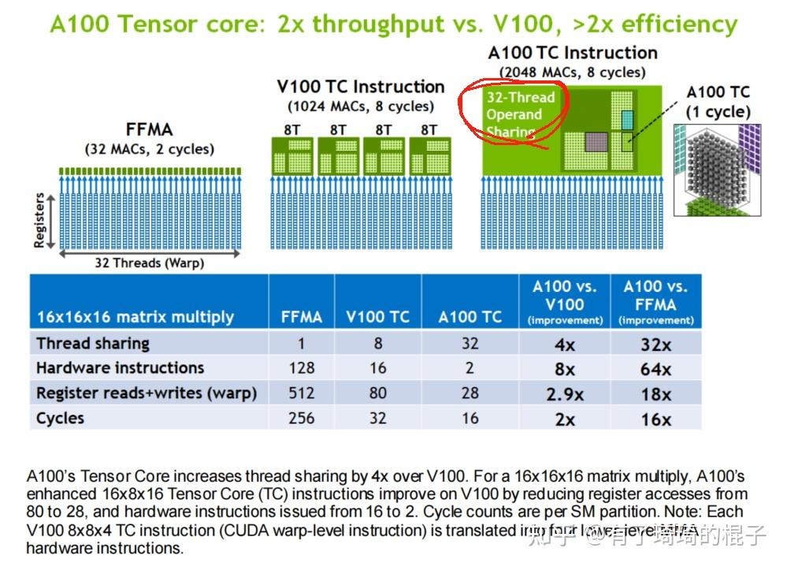

# 从Ampere架构到HGEMM

**Author:** 有了琦琦的棍子

**Date:** 2025-03-15

**Link:** https://zhuanlan.zhihu.com/p/30076930810

​

目录

收起

一、Ampere硬件特性

1.1 从全局内存到共享内存：cp.async

1.2 从共享内存到寄存器：ldmatrix

1.3 TensorCore的MMA指令：m16n8k16

二、HGEMM优化要点

2.1 并行与分块

2.2 解决共享内存中的Bank冲突

2.3 Block swizzle

2.4 Pipeline优化

三、总结

本篇文章用来介绍[Ampere架构](https://zhida.zhihu.com/search?content_id=255037662&content_type=Article&match_order=1&q=Ampere%E6%9E%B6%E6%9E%84&zhida_source=entity)以及针对Ampere架构的HGEMM优化。主要分为两部分，第一部分介绍一下Ampere架构的相关特性。第二部分介绍一下HGEMM优化的一些要点。

## 一、Ampere硬件特性

### 1.1 从全局内存到共享内存：cp.async

Ampere GPU包含一个新的异步拷贝指令，它直接从全局内存加载数据到SM共享内存中，消除了对中间寄存器文件（RF）使用的需要。异步拷贝减少了寄存器文件带宽，更有效地使用内存带宽，并降低了功耗。顾名思义，当SM正在执行其他计算时，可以同时执行异步拷贝过程。

具体的架构示意图如下：


具体的使用方式如下：


更详细的介绍可以看一下对应的白皮书和PTX文档。

### 1.2 从共享内存到寄存器：[ldmatrix](https://zhida.zhihu.com/search?content_id=255037662&content_type=Article&match_order=1&q=ldmatrix&zhida_source=entity)

严格来说，这并不是从Ampere开始有的特性，但是放在Ampere架构上说明也不是不行。ldmatrix指令是为了搭配tensor core的[MMA指令](https://zhida.zhihu.com/search?content_id=255037662&content_type=Article&match_order=1&q=MMA%E6%8C%87%E4%BB%A4&zhida_source=entity)，为了完成从共享内存到寄存器的高效数据搬运。其使用方式如下：


简单的来说，这条指令就是为了搬运共享内存中的若干个8x8的16-bit数据。以ldmatrix.sync.aligned.x4.m8n8.shared.b16这条指令为例，一共需要搬运8x8x4=256个half类型的数据。一个warp去完成这个操作。一共32个线程，那么每个线程需要搬运256/32=8个half类型数据，也就是128bit数据，可以理解成一个线程是搬运一个float4的数据。然后ptx指令中的smem\_ptr就是来指定每个线程需要访存的地址。OK，这个事情看起来比较简单，非常地SIMT。那么按照我们以往的经验，线程T0会拿到0-7号数据值，如下：


那实际上是不是这样呢？可以写个代码来验证一下，代码如下：

```text
#include <stdio.h>
#include <iostream>
#include "cublas_v2.h"

__global__ void GetMapping () {
  __shared__ half aTile[4*8*8];

  int tidx = threadIdx.x + blockDim.x * threadIdx.y;
  if (tidx == 0) {
    for (int i = 0; i < 4*8*8; ++i) {
        aTile[i] = i;
    }
  }
  __syncthreads();

  int aTile_index = tidx % 16 * 16 + tidx / 16 * 8;
  uint32_t reg[4];
  uint32_t smem = __cvta_generic_to_shared(aTile+aTile_index);
  asm("ldmatrix.sync.aligned.m8n8.x4.shared.b16 { %0, %1, %2, %3 }, [ %4 ];\n"
  : "=r"(reg[0]), "=r"(reg[1]), "=r"(reg[2]), "=r"(reg[3]) 
  : "r"(smem)
  );

  if (tidx == 0) {
    for (int i = 0; i < 4; i++) {
        half * tmp = (half*)(&(reg[i]));
        printf("%f\n", (float)(tmp[0]));
        printf("%f\n", (float)(tmp[1]));
    }
  }
}
int main() {
    uint3 block = {32,1,1};
    uint3 grid = {1,1,1};
    GetMapping <<<grid, block>>>();

    cudaDeviceReset();
    return 0;
}
```

可以看到0号线程的结果输出是0 1 8 9 128 129 136 137这8个数。再观察其他线程上的值，我们发现每个线程上的数据排布变成了下面这个样子。


事情开始变得有趣起来，看起来每个线程手上的数据发生了交换，看起来是硬件上有某种buffer可以实现线程数据的交互。从白皮书上也可以观察到这一点，如下：



虽然上面写的是在使用tensor core的MMA指令时，线程上的数据会进行交互，并且在ampere上一个线程可以和任意一个线程交换数据。但是依旧可以判断出不同线程的寄存器之间可以通过某种buffer进行数据交互。综合以上，我们可以将ldmatrix这条指令理解成两个步骤，第一个步骤中，每个线程各自去搬运128bit的数据，第二个步骤，线程之间进行数据的交换以满足特定的数据排布。

### 1.3 TensorCore的MMA指令：m16n8k16

Ampere架构上的TC可以支持FP16、BF16、TF32、FP64等多种数据类型。我们把目光聚焦在FP16上，其他的数据类型有所差异，但基本能触类旁通。先看对应的数据排布，如下图：


可以看到，A矩阵和C矩阵是按照行优先排布，B矩阵是按照列优先排布。所以实际为了做矩阵乘的话，A矩阵需要一条ldmatrix.sync.aligned.x4.m8n8.shared.b16指令，而B矩阵需要一条ldmatrix.sync.aligned.x2.trans.m8n8.shared.b16指令，额外做个transpose即可。然后可以观察到A矩阵的数据排布和C矩阵的数据排布是一样的。这意味着三个矩阵连续相乘的话，前两个矩阵相乘的中间结果，数据排布是满足MMA的要求，可以直接和第三个矩阵进行矩阵乘法，这也是Ampere架构上做Flash Attention的优化核心之一。

## 二、HGEMM优化要点

在介绍完Ampere架构的硬件特性之后，我们来看看怎么在上面完成一个高效的HGEMM。关于矩阵乘，在网上已经有非常多的博客，写得非常好，也非常详细。我们在这里再总结一下其中的优化要点。主要分为四个方面来进行介绍，首先介绍一下矩阵乘的并行和分块思路。然后介绍一下怎么通过swizzle的方式来解决共享内存中的bank冲突。接着介绍一下如何通过[block swizzle](https://zhida.zhihu.com/search?content_id=255037662&content_type=Article&match_order=1&q=block+swizzle&zhida_source=entity)来提高L2 cache的命中率。最后介绍一下软流水优化。

### 2.1 并行与分块

关于这部分内容，跟我以往写的sgemm博客基本上差不多。无非是通过sliceK的这种方式提高数据的复用性。这里再稍微提一嘴就行。对于Ampere的hgemm优化，我们假设一个block负责C矩阵128x128的数据块。使用4x4，一共16个warp，即512个线程来进行处理。一个warp负责32x32的数据块，按照16x8的tensor core维度做切分，那么就对应着8个MMA计算。示意图如下。


### 2.2 解决共享内存中的Bank冲突

在介绍完分块逻辑之后，接下来思考一下关于共享内存的问题。假设对于A矩阵，在共享内存上的分块是128x32。假设A矩阵是按照行优先排布，16个warp，那么每个warp需要搬运128/16=8行数据。对于每个线程来说，就是搬运8x32/32=8个half数据，那么一行数据就需要32/8=4个线程来进行搬运。对于一个warp而言，一条指令就可以搬完8x32个数据。在硬件上会拆成4个phase。在phase0中，T0-T7这8个线程将64个half，也就是128Byte的数据进行搬运。具体的示意图如下：


我们来分析一下从gmem（全局内存）搬运到smem（共享内存）这个阶段。线程是顺序访存，所以在写入smem的这个过程中，其实不会有bank冲突。然后来看看从smem到寄存器的过程。在读smem的时候，为了匹配tensor core的MMA指令，需要使用ldmatrix的指令。一个warp需要读16x16的数据，也就是smem的左半边或者右半边。以左半边为例。T0需要读原来的T0位置，T1需要读原来的T4位置，T7需要读原来的T28位置。以此类推。然后需要注意，T0-T7刚好拼成smem的32个bank。可以看出，T0和T8、T16、T24在一个bank上，会有严重的bank冲突，属于4路bank冲突，所以读smem的性能会比较差。所以会严重地影响hgemm的整体性能。示意图如下：


那怎么去解决这个问题？我们先给出答案，然后再来分析。有一种叫做[smem swizzle](https://zhida.zhihu.com/search?content_id=255037662&content_type=Article&match_order=1&q=smem+swizzle&zhida_source=entity)的方式可以比较好地解决这个问题，本质上就是通过一些位运算，调整实际在smem的位置，来避免bank冲突。我们先把注意力放到从gmem到smem的这个过程，在运用了swizzle之后，这个搬运过程会变成下面这个样子。


仔细观察一下，可以发现，T0-T7的数据跟之前一样，没有啥变化。但是T8-T15的数据，放在smem的位置有了一些改变。原来是T8 T9 T10 T11 T12 T13 T14 T15顺序排布，现在变成了T9 T8 T11 T10 T13 T12 T15 T14这种交错排开的顺序。这种排布有什么好处呢？我们再来看看在做ldmatrix的时候会有什么变化。主要分析T0-T7这8个线程，T0要读T0，T1要读T4，T2要读T8，这些要读的数据是不变的，但是在smem的位置却发生了变化。再将其展开到32个bank的维度上去看，可以看到每个线程取数都是在不同的bank上取数，完美地避开了smem的bank冲突。


前面已经看到了，通过一些特殊的排布可以很好地解决smem上的bank冲突，这种技术叫做swizzle，可以理解为对物理地址的一种重新映射，本质上就是找到一种映射逻辑。能够实现下面的这种对应关系。


我们再看如何去实现这种映射关系？可以通过一个异或的操作来完成。具体的代码示例如下：


通过这么一个简单变换就能够完成这种映射关系。非常nice！当然在实际运用上，需要根据数据类型啥的有一些变动，大家可以参考cute的代码理解。

### 2.3 Block swizzle

介绍完如何解决smem的bank冲突之后，接下来介绍怎么通过block swizzle来提高gmem到smem的搬运效率，也就是如何提高L2 cache的访存命中率。关于这个问题，目前网上也有比较多的讨论了，说得很好也非常详细，比如这个帖子，[https://zhuanlan.zhihu.com/p/6872421770](https://zhuanlan.zhihu.com/p/6872421770) 。

我们再来回顾和总结一下，先看问题是什么，看一下下面的示意图：


对于左边的图，当N远大于M和K的时候，如果block的发射顺序是从左到右，会导致B矩阵的访存局部性很差，L2 cache的命中率会非常低。对于右边的图，当M远大于N和K的时候，如果block的发射顺序是从上到下，会导致A矩阵的访存局部性很差，L2 cache的命中率也会非常低。看到这里，大家对于为什么要做block的swizzle有了一个比较感性的认识。接下来说一下实际上是怎么做得。

这里面其实涉及到两个核心问题，第一个是block的调度顺序，我们需要清楚block是以一种什么样的方式被映射到不同的SM上。第二个问题是如何提高SM上数据访问的局部性。

对于第一个核心问题，目前一个共性的认知是block发射顺序是按照x->y->z的顺序来发射的。假设当grid设置成(2, 4, 8)的时候，block的发射顺序是(0,0,0)->(0,0,1)->(...)->(0,0,7)->(0,1,0)->(...)->(0,3,7)->(...)->(1,3,7)。而对于block跟SM的映射关系，一般有两个阶段。在第一个阶段中，GPU会给每一个SM分配block，这是一个确定的映射关系。在第二个阶段中，随着部分block的结束，有SM可以容纳新的block，按照前面的发射顺序来选择一个block，但是SM和block的映射关系是不确定的，哪个SM先结束，哪个就能获得新的block。

对于第二个核心问题，如何提高SM上数据访问的局部性。主要是调整block的发射顺序，一般会有下面这些方案。


### 2.4 [Pipeline优化](https://zhida.zhihu.com/search?content_id=255037662&content_type=Article&match_order=1&q=Pipeline%E4%BC%98%E5%8C%96&zhida_source=entity)

对于pipeline优化，讨论的人也比较多了，本质上就是在K维度进行计算和访存的overlap，尽可能地将TensorCore打满。对应的示意图如下：


这个图比较久了，上面显示的还是cuda core。但是大家可以理解一下这个意思。关于Pipeline优化，有一个名词叫MultiStage。multi-stage=2的时候就是double buffer，这个技术已经说得比较多了，multi-stage更大的时候就是意味着有更多的buffer。在Ampere架构上一般会将multi-stage设置成4左右。这是因为算力相比带宽来说提升地太多了。计算单元算的快了很多，但是访存效率提升地不是很大，为了让计算单元能够打满，我们需要设置更多地buffer来保证计算的时候尽可能地不会被访存给拖累。

## 三、总结

在本篇博客中，介绍了Ampere架构上的一些硬件特性。形式上主要是对于三条ptx指令的一些解析。然后介绍了在Ampere架构上进行HGEMM优化的一些要点，比如基于TensorCore MMA指令的分块设置，通过SMEM swizzle来提高SMEM的访存效率，通过block swizzle来提高L2 cache的命中率，通过Pipeline技术来进行计算和访存的overlap。一些相应的资料也放上来。

[](https://link.zhihu.com/?target=https%3A//images.nvidia.com/aem-dam/en-zz/Solutions/data-center/nvidia-ampere-architecture-whitepaper.pdf)

[](https://link.zhihu.com/?target=https%3A//www.nvidia.com/en-us/on-demand/session/gtcspring21-s33322/)

[](https://link.zhihu.com/?target=https%3A//github.com/DefTruth/hgemm-mma)

[](https://link.zhihu.com/?target=https%3A//developer.download.nvidia.cn/video/gputechconf/gtc/2020/presentations/s21745-developing-cuda-kernels-to-push-tensor-cores-to-the-absolute-limit-on-nvidia-a100.pdf)