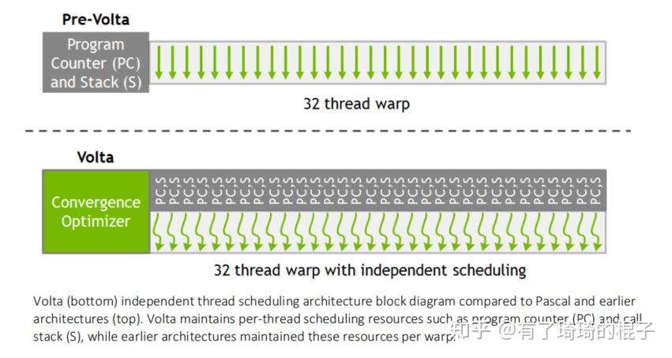

# 从Volta架构到HGEMM

**Author:** 有了琦琦的棍子

**Date:** 2025-03-15

**Link:** https://zhuanlan.zhihu.com/p/30058413999

​

目录

收起

一、Volta架构的硬件特性

1.1. L1与SMEM合体

1.2. FP32 INT32指令并行

1.3. 独立线程调度

1.4. Reg Bank问题

1.5. 指令编码问题

1.6. TensorCore

二、从TensorCore到HGEMM

2.1. 从MMA到WMMA

2.2. 可能的硬件结构

2.3. 在HGEMM中调用TC

2.4. 关于SMEM Bank冲突的处理

三、总结

本篇文章用来介绍[Volta架构](https://zhida.zhihu.com/search?content_id=255033935&content_type=Article&match_order=1&q=Volta%E6%9E%B6%E6%9E%84&zhida_source=entity)以及针对Volta架构的[HGEMM](https://zhida.zhihu.com/search?content_id=255033935&content_type=Article&match_order=1&q=HGEMM&zhida_source=entity)优化。主要分为两部分，第一部分介绍一下Volta架构的相关特性。第二部分介绍一下HGEMM优化的一些要点。

## 一、Volta架构的硬件特性

### 1.1. L1与SMEM合体

将原本分离的L1缓存和共享内存合并为128KB的统一存储块，共享同一物理存储资源。支持运行时配置比例（0-96KB共享内存+剩余部分L1缓存），例如可选96KB共享内存+32KB L1缓存。

### 1.2. FP32 INT32指令并行

Volta架构上每个SM配置独立FP32和INT32核心（参考GV100 SM含64个FP32核心+64个INT32核心）。FP32浮点单元与INT32整数单元物理分离，实现真正指令级并行。示意图如下。

FP32与INT32分离

### 1.3. 独立线程调度

从Volta开始有了独立线程调度机制，每个线程配备专用的寄存器和Stack。改变原来需要串行处理不同分支路径的特点。示意图如下：

### 1.4. Reg Bank问题

Volta架构的寄存器文件被划分为2个Bank，每个Bank的位宽为64比特。这与前代架构采用的4 Bank、32比特宽设计不同。更宽的寄存器存储体使编译器更容易生成无冲突代码。在Volta架构中，寄存器的Bank归属由其索引的模2运算结果决定。只有当“FFMA”指令中的所有三个32位源寄存器都在同一个Bank中时，才会发生冲突。这个部分也提过很多了，不再详细说明。

### 1.5. 指令编码问题

Volta架构采用128-bit来编码每条指令及其对应的control code，这与前代架构有明显变化——过往架构使用64-bit指令，另需独立64-bit编码与多条指令相关联的control code。举个例子：

其中control code各个部分的含义如下：

更细节的内容可以看相应的MicroBenchmark，文章末尾会有链接。

### 1.6. TensorCore

这是Volta架构里面最重要的特性，FP16性能飙升到125TFLOPs，从此开启了以TensorCore为核心的GPU架构。

## 二、从TensorCore到HGEMM

在简单地介绍完Volta架构的一些特性之后，我们再来深入地说一下volta架构的TC（TensorCore）。先来看对应的[MMA指令](https://zhida.zhihu.com/search?content_id=255033935&content_type=Article&match_order=1&q=MMA%E6%8C%87%E4%BB%A4&zhida_source=entity)和关于WMMA的封装，接下来讨论一下可能的硬件结构，这部分主要是出自论文《Modeling Deep Learning Accelerator Enabled GPUs》和《通用图形处理器设计-GPGPU编程模型与架构原理》那本书。然后来看看在HGEMM中怎么去调用上TC，最后来看看在HGEMM上的[SMEM Bank冲突](https://zhida.zhihu.com/search?content_id=255033935&content_type=Article&match_order=1&q=SMEM+Bank%E5%86%B2%E7%AA%81&zhida_source=entity)的处理。

### 2.1. 从MMA到WMMA

在Volta架构中，先对warp中的32个线程做一个切分，8个线程一组，每8个线程是一个Quad Pairs。具体的划分方式如下。

每个QP的指令粒度是884。每一个QP都可以完成(8,4)x(4,8)=(8,8)的小矩阵运算。而四个QP协同，就可以完成16x16x4的MMA运算，示例如下：

如果将4个16x16x4放在一起，那就是16x16x16，也就是一条完整的WMMA指令。  
然后再把视角看向一个QP所负责的884，8个线程在AB矩阵上拥有的寄存器映射关系如下：

一个线程在A矩阵上会拥有4个fp16，也就是2个fp16x2。在B矩阵上也是一样。再来看C矩阵上每个线程的寄存器排布，fp16的数据类型如下：

fp32的数据类型如下：

把MMA相关的内容搞清楚了之后，我们再来仔细看看WMMA，前面已经说到了将4个16x16x4拼在一起就可以完成一条16x16x16的WMMA运算。接下来围绕着WMMA再来看一下其他的API接口。

我们主要来看一下这个load\_matrix\_sync的过程。假设A矩阵行优先，B矩阵列优化，从SMEM上访存，具体的过程如下：

先将16x16x16的过程分成四个Set，每个Set只负责维度为4的部分。每个Set对应一次884的MMA操作。那么对于load\_matrix\_sync这个过程来说，对于A矩阵的访存，线程0是一次读一个Set，然后做一次884的MMA，还是一次读四个Set，然后做四次884的MMA呢？我们来分析一下这个过程，原则是尽可能地一次搬运多一点数据。一个线程最多可以搬运128bit，也就是4个float，或者8个half。那么16个half就要搬运2次，对应着两条LD.E.128指令。B矩阵同理，但是如果按照行优先排布的话，情况稍有些不同。

总结一下上面的信息，这个时候我们可以看出一些问题：

（1）存在着对于SMEM的重复访存。可以看出，QP0和QP2要访问同样的A矩阵数据，而QP0和QP1要访问同样的B矩阵数据。

（2）线程之间有某种硬件通路进行交互。再回顾一下从SMEM到REG，然后进TC的MMA过程。线程从SMEM搬运数据到寄存器上的时候，每个线程之间是没有交互的。但是在MMA的时候，线程0需要跟线程1-3以及线程16-19进行交互，得到对应的B矩阵数据才能完成矩阵乘计算。这意味着一个QP的8个线程肯定是有某种硬件通路。

### 2.2. 可能的硬件结构

前面介绍完MMA和WMMA之后，我们来看看Volta这一代TC上可能的硬件架构是怎么样。我对更底层的硬件细节不是那么熟悉，这部分的内容主要是参考《通用图形处理器设计-GPGPU编程模型与架构原理》那本书和《Modeling Deep Learning Accelerator Enabled GPUs》那篇论文。  
  
将一个QP，也就是8个线程，继续进行细分，4个线程为一组，称之为threadgroup。然后按照ABC矩阵都是行排列，16x16x16的WMMA中数据与threadgroup的对应关系如下：

可以从上图看到，T0-T3是threadgroup0，而同属QP0的T16-T19是threadgroup4。至于从threadgroup角度下的load\_matrix\_sync与之前同理，暂不累述。

再看WMMA，对应的PTX指令转换成SASS指令之后，会对应着16条HMMA指令，如下：

16条指令分成4个Set，每个Set分成4个Step。4个Set的过程无非是在K维度上遍历四次。这部分容易理解，示意图如下：

至于一个Set里面的4个Step，具体的计算过程如下所示：

每个step都完成C矩阵中一个2x4小块的计算，需要2x4的A矩阵和4x4的B矩阵进行配合。然后再回顾一下Volta上SM的结构，一个SM有四个处理子块。一个处理子块有2个TC，一个Warp在计算MMA的时候，可以用上2个TC。那么4个QP的话，相当于一个TC处理2个QP。一个QP上又有两个threadgroup。每个threadgroup在每个step需要完成2x4x4的计算。

假设以4x4的向量点积作为一次基本运算，称为4元素内积运算（Four-Element Dot Product，FEDP），那么每个threadgroup完成一个Step需要8个FEDP。然后相关测试发现，threadgroup基本上能在两个周期完成1个Step，那么每个threadgroup每个周期就需要4个FEDP。由此来推测TC内部计算资源的信息：每个TC负责2个QP，每个QP包含2个threadgroup，每个threadgroup需要4个FEDP。相当于每个线程配备一个FEDP，每个FEDP实际上是由4个乘法器加上3个加法器完成累加，再配置一个加法器来处理部分和的累加运算。所以一个处理子块内2个TC的粗略结构可能如下图所示。（注：这一段基本上是一模一样从《通用图形处理器设计-GPGPU编程模型与架构原理》上抄下来的。）

再考虑threadgroup之间的数据复用。矩阵B的数据需要两个threadgroup进行共享。然后分别需要对A和累加的C数据进行缓冲。3组操作数对应3组总线。3类缓冲对应5个缓冲单元。推测出来更细节的TC结构如下：

### 2.3. 在HGEMM中调用TC

关于HGEMM的优化，现在已经有了非常非常多的帖子，大家可以都去看一看。优化的思路基本趋向于一致，无非是分块、软流水、swizzle这些东西，但是结合不同的硬件架构、不同的数据类型、不同的shape又有更细节的东西需要再去琢磨琢磨。这里大概讲一下怎么在Volta架构的HGEMM中调用TC。

我们假设取BM=128，BN=256，BK=32，开256个线程，一共8个warp。那么一个warp负责64x64的C矩阵块，再根据TC的WMMA维度进一步切分，就会有4x4个小块，每个小块对应着一个16x16的维度，刚好一条WMMA。具体的示意图如下：

当然，这只是简单地调用WMMA，要是想直接用MMA获得更好的性能。可以参考一下cutlass的用法。先拼出一个32x32的尺寸。示意图如下：

### 2.4. 关于SMEM Bank冲突的处理

经过前面简单的介绍，对于怎么做HGEMM，读者应该有了一个大概的认知。接下来看看怎么处理SMEM Bank冲突。这个部分非常麻烦，但是也非常重要。但凡要把性能发挥到90%以上，这都是一个绕不过去的坎。当然简单处理的话，可以直接加一个pad，但是这会导致一些smem的浪费。一般还是建议用permute的方式去解决。

为了提高SMEM->REG这个过程的数据搬运，一半会使用4个mma.sync拼在一起的方式，前面也已经说了，这主要是为了使用128bit的向量化访存，这样能提高搬运的效率。示意图如下：

然后再看正常来看GMEM上的A矩阵数据排布，假设按照列优先排布，以一个warp的视角来看。需要取64行4列的数据，每一个线程取8个half，所以就是下面的这张图。

本来是瘦高型的矩阵块，图上是放倒了的视角，所以看起来会有点怪怪的。然后我们需要做一些操作，让它实际在SMEM上能够变成下面这个排布。

所以GMEM到SMEM的视角就是这个情况。

那么一个warp的访存会分成4个phase，每个phase搬运一行到SMEM上，具体每个线程搬运的数据如下：

其他三个phase不再贴图了，然后对应到代码上如何实现GMEM->SMEM的搬运，如下：

主要是通过一系列的位运算改变了行列号。在完成GMEM->SMEM的数据搬运之后，再来看SMEM->REG以及如何搭配着MMA使用，从而感受[Permute](https://zhida.zhihu.com/search?content_id=255033935&content_type=Article&match_order=1&q=Permute&zhida_source=entity)的威力。

我们来分析一下这个过程，在Permute之前，T0-T3线程需要取SMEM上同一列数据，会导致Bank冲突，在完成Permute之后，T0-T3需要取的数据连续放在了SMEM的一行上，可以直接连续访存，然后搬运到寄存器，而后就可以搭配TC一起使用。上面这个图是T0-T3的视角，再来看看T0-T7，涉及到两个QP的视角，如下：

也很合理，非常漂亮，一切都是刚刚好。通过Permute刚好避免了GMEM->SMEM的bank冲突，也避免了SMEM->REG的bank冲突，又刚好能搭配着MMA在TC上完成计算。

## 三、总结

在本篇博客中，介绍了Volta架构上的一些硬件特性，尤其是针对TC进行了比较深入的分析。然后介绍了在Volta架构上进行HGEMM优化的一些要点，尤其是避免SMEM Bank冲突的Permute方法。一些对应的资料也放上来。

