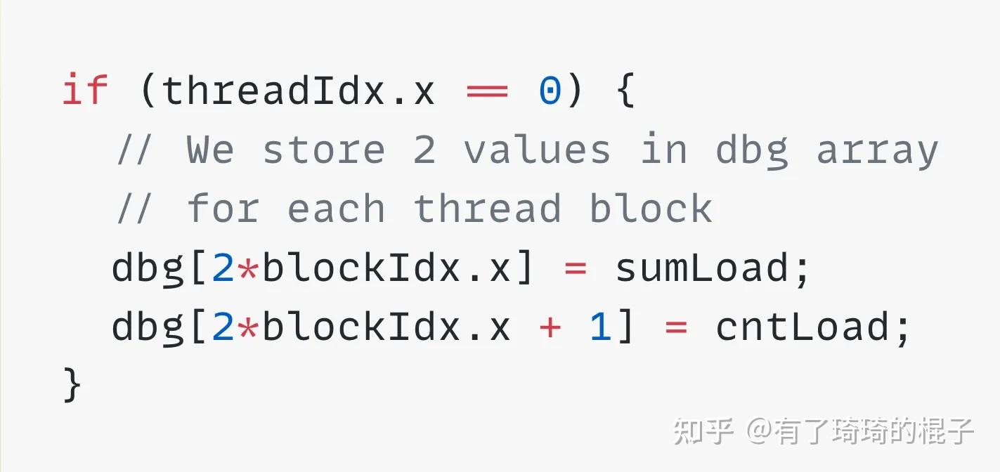

# 从Hopper架构到HGEMM

**Author:** 有了琦琦的棍子

**Date:** 2025-03-16

**Link:** https://zhuanlan.zhihu.com/p/30427909948

​

目录

收起

一、Hopper硬件特性及编程范式

1.1 WGMMA

1.2 TMA

1.3 Thread Block Clusters与DSMEM

1.4 Warp-Specialization

二、HGEMM优化

2.1 Kernel 1: HGEMM的朴素实现

2.2 Kernel 2: 使用Tensor Core指令

2.3 Kernel3：处理更大尺寸的输出分块

2.4 Kernel4：掩盖访存延迟

2.5 Kernel5：增大分块尺寸

2.6 Kernel6：掩盖写回延迟

2.7 Kernel7：更快的barriers

2.8 Kernel8：Thread Block Clusters

2.9 Kernel9：一些细微的优化

2.10 Kernel10：异步写回

2.11 Kernel11：Hilbert曲线

2.12 小结

三、总结

本篇文章用来介绍[Hopper架构](https://zhida.zhihu.com/search?content_id=255107853&content_type=Article&match_order=1&q=Hopper%E6%9E%B6%E6%9E%84&zhida_source=entity)以及针对Hopper架构的HGEMM优化。主要分为两部分，第一部分介绍一下Hopper架构的相关特性以及在编程范式上的一些更改。第二部分介绍一下在Hopper架构上做HGEMM优化的一些要点。

## 一、Hopper硬件特性及编程范式

### 1.1 WGMMA

WGMMA是NV为了适配Hopper系统的TensorCore所推出的[PTX指令](https://zhida.zhihu.com/search?content_id=255107853&content_type=Article&match_order=1&q=PTX%E6%8C%87%E4%BB%A4&zhida_source=entity)，NV明确说明Hopper下一代不兼容WGMMA，要PTX代码兼容就不要用WGMMA，改用WMMA。然而在Hopper上只有WGMMA才能达到最高的性能。Hopper架构上的TC与之前架构的TC存在着比较大的差异，主要体现在下面几点。

（1）矩阵乘size有明显的扩大，并且提出了[Warp Group](https://zhida.zhihu.com/search?content_id=255107853&content_type=Article&match_order=1&q=Warp+Group&zhida_source=entity)的概念。

以FP16为例，WGMMA指令支持m64nNk16的矩阵乘规模，其中N是8的倍数，最大可以支持m64n256k16。输入是FP16，输出FP32。为了支持这么大的矩阵乘规模，Hopper结构上推出了一个叫做Warp Group的概念。4个连续的Warp组成一个Warp Group，刚好对应着SM上的四个TensorCore。可以看出，在TC的使用上，跟以往有比较大的变化，在Hopper之前，TC的MMA指令一直是以warp为粒度。但是Hopper架构上却以Warp Group为粒度进行调度。我们可以来想想这个原因是啥。我们先假设还是以原来的Warp为粒度，为了在SM上支持m64n256k16，按照m维度切分成4份，那么每个warp需要支持m16n256k16的维度。为了存A矩阵，每个线程需要16x16/32=8个half寄存器，也就是4个uint32\_t的寄存器。为了存B矩阵，每个线程需要256x16/32=128个half寄存器，也就是64个uint32\_t寄存器。为了存C矩阵，每个线程需要16x256/32=128个float寄存器。可以算出，一共需要196个uint32\_t寄存器。

如果以WarpGroup为粒度再来计算一下寄存器的使用量，在SM上支持m64n256k16，为了存A矩阵，每个线程需要64x16/128=8个half寄存器，也就是4个uint32\_t的寄存器。以T0为例，这8个寄存器对应的数据位置如下图：


为了存B矩阵，每个线程需要256x16/128=32个half寄存器，也就是16个uint32\_t寄存器。

为了存C矩阵，每个线程需要64x256/128=128个float寄存器。以T0为例，这128个寄存器对应的数据位置如下图：


可以算出，总共148个uint32\_t寄存器。可以看出，将warp的粒度扩大成WarpGroup的粒度可以有效地减少寄存器的使用，尤其是减少存B矩阵的寄存器数量，从而支持更大size的矩阵乘规模。

（2）输入的AB矩阵在共享内存上。准确地点说，A矩阵可以是在SMEM或者寄存器上，但是B矩阵必须是在SMEM上，C矩阵则是在寄存器上。

由于输入在SMEM上，所以访存的时候并不能完全固定，WGMMA是一条异步的MMA指令。需要通过wgmma.fence wgmma.commit\_group wgmma.wait\_group这些指令来进行同步。  
接下来再介绍一下矩阵的共享内存上的数据排布。以FP16为例，AB矩阵在SMEM的排布需要满足下面这种方式。


A矩阵的排布是一个8x2的8x8矩阵小块，B矩阵同理。随后再来看A矩阵中这些小块所对应的数据，如下：


需要注意的是，这些8x8的矩阵小块在SMEM上是连续排布的。介绍完A矩阵的数据排布之后，再来介绍如何通过程序语言去描述这样的一个矩阵。英伟达的PTX文档上介绍了一种叫做Matrix Descriptor Format的东西。介绍之前再说一下A矩阵的Strides，由于每个8x8的核心小矩阵是连续排布的，所以为了描述SMEM的A矩阵，需要通过三个参数，分别是start address（简称叫SA吧）、Leading dimension byte offset（简称叫LOffset吧）以及Stride dimension byte offset（简称叫SOffset吧）。SA顾名思义，就是为了说明在SMEM上的首地址。通过这个参数就可以定位到第一个8x8数据块。LOffset是用来描述在K维度上相邻的两个8x8小矩阵距离，通过这个参数就可以定位到第二个8x8数据块，SA+LOffset即可。SOffset使用来描述在M或N维度上相邻的两个8x8小矩阵距离，通过这个参数就可以定位到第三个8x8数据块，SA+SOffset即可。通过这三个参数的组合理论上就可以定义到任意一个地址位置。好了，接下来终于可以介绍到Matrix Descriptor Format了。Matrix Descriptor Format的本质其实是提供一个64bit的大整数来描述A矩阵的所有信息，不同的位上表示了不同的参数信息，具体如下：


里面有两个地方需要注意，Matrix start address的位数只有14位，最多能表示16KB。在实际处理中，matrix descriptor 中的 start\_address 要把实际 shared memory 地址右移动 4-bit，实际上是 2\*\*18=256KB。（这里感谢

[@Titus](//www.zhihu.com/people/ca635abc9f0d3a6e5a74e6a041b5e167)

的提示）。另外Matrix Descriptor Format还有2个bit用来描述swizzle的模式，一共有3种swizzle的模式，分别是32-byte、64-byte以及128-byte的swizzle模式。没有swizzle的A矩阵数据排布，前面已经介绍过了。

我们先看看32-byte的swizzle模式。可以看到相邻的两个核心矩阵发生了数据的交错排布。


再来看看64-byte的swizzle模式。可以看到相邻的四个核心矩阵发生了数据的交错排布。


最后来看看128-byte的swizzle模式。可以看到相邻的八个核心矩阵发生了数据的交错排布。


至于为什么在不同的swizzle模式下会有这样的数据排布，暂时还没有研究明白。然后再来思考怎么样才能在SMEM上将数据排列成这种样子，如果是Hopper架构之前，从GMEM到SMEM的数据搬运需要多个线程协作，每个线程搬运一部分数据。在Hopper架构上，为了提高GMEM到SMEM的数据搬运，并且更好地搭配相应的WGMMA指令，尤其处理采用了swizzle模式的SMEM数据排布，Hopper架构上引入了新的部件，Tensor Memory Accelerator (TMA)。

### 1.2 TMA

为了帮助满足强大的新H100tensor core，张量内存加速器（TMA）提高了数据获取效率，它可以将大块数据和多维张量从全局内存传输到共享内存，反之亦然。TMA操作使用Copy descriptor启动，该描述符使用张量维度和块坐标而不是每个元素寻址指定数据传输。

主要支持的功能如下：

（1）大块的异步显存拷贝

（2）多维tensor的数据拷贝

（3）支持SMEM到GMEM的异步拷贝。

更具体的细节可以参考下面的链接

[](https://www.zhihu.com/question/662984685/answer/3583728294)

### 1.3 [Thread Block Cluster](https://zhida.zhihu.com/search?content_id=255107853&content_type=Article&match_order=1&q=Thread+Block+Cluster&zhida_source=entity)s与[DSMEM](https://zhida.zhihu.com/search?content_id=255107853&content_type=Article&match_order=1&q=DSMEM&zhida_source=entity)

CUDA 编程模型长期以来依赖于一种 GPU 计算架构，该架构使用包含多个block的grid来利用程序中的局部性。一个block包含多个线程，这些线程在单个流多处理器（SM）上并发运行，在block中，线程可以通过barrier进行同步，并使用 SM 的共享内存交换数据。然而，随着 GPU 的流多处理器数量增长到 100 个以上，并且计算程序变得更加复杂，仅以线程块作为编程模型中表达局部性的唯一单元，已不足以将执行效率最大化。

H100 引入了一种全新的Thread Block CLuster架构，该架构以大于单个SM上单个线程块的粒度，开放对局部性的控制。Thread Block CLuster扩展了CUDA编程模型，在GPU的物理编程层级体系中新增了一个层级，如今该体系包括线程、线程块、cluster以及grid。

一个cluster是一组block，确保这些block能被并发调度到一组 SM 上，目的是实现跨多个 SM 的线程高效协作。H100中的cluster在一个（GPC）内的多个SM上并发运行。GPC是硬件层级体系中的一组SM，它们在物理位置上总是紧密相邻。GPC内为SM专门构建的SM间网络，可实现集群内线程之间的快速数据共享。如下图所示，


在引入了Thread Block Cluster之后，CUDA编程模型改动如下：


在介绍完Cluster之后再来介绍DSMEM。借助cluster，所有线程都能够通过加载、存储和进行原子操作，直接访问其他SM的共享内存。这一特性被称为分布式共享内存（DSMEM），因为共享内存的虚拟地址空间在逻辑上分布于cluster内的所有线程块。DSMEM使SM之间的数据交换更高效，数据无需再写入全局内存并从中读取来传递。专为cluster设计的SM间网络确保了对远程DSMEM的快速、低延迟访问。与使用全局内存相比，DSMEM 将线程块之间的数据交换速度提升了约7倍。下图展示不同SM上的SMEM相互访问模式的变化。


介绍完DSMEM架构之后，我们再从软件的角度来看如何使用DSMEM。使用DSMEM的核心在于DSMEM的访问以及Cluster的同步。CUDA提供了Cooperative Groups模块。该模块给用户提供了访问DSMEM的接口。这里面主要有三个核心API接口。  
cg::this\_cluster()：获取当前 cluster。  
cluster.map\_shared\_rank(void \*smem, int rank)：  
cluster.sync()：负责整个 Thread Block Cluster 所有线程的同步操作。

除此以外，还需要注意TMA与DSMEM的联系，可以使用TMA将数据broadcast到DSMEM上。这可以有效地提高搬运效率。


### 1.4 Warp-Specialization

[WASP](https://zhida.zhihu.com/search?content_id=255107853&content_type=Article&match_order=1&q=WASP&zhida_source=entity)（Warp-Specialization）技术最早由2011年的CudaDMA论文提出。核心思想是将Warp进行分工，不同的warp承担不同的任务。Producer Warp负责G2S（Global memory to Shared memory），而Consumer Warp负责S2R（Shared memory to Register）或者Compute。

WASP最重要的一个优点是可以比较好地实现计算与访存重叠。通过细粒度的生产者-消费者同步机制，使负责计算的warp和负责访存的warp协同工作，从而提高整体性能。从Hopper架构之后，NVIDIA开始主推WASP的编程范式。大家可以想一想这个内在逻辑是什么。

还是以HGEMM为例，在进行矩阵乘的时候，整个计算流程可以分成三部分，分别是Prologue、Mainloop、Epilogue三个部分。其中Mainloop主要是采用TensorCore进行计算。示意图如下：


当TensorCore的计算性能越来越高，Mainloop的时间就会压得非常短，导致Prologue、Epilogue的时间占比过高，从而导致算力很难被发挥出来。所以隐藏Prologue、Epilogue的时间对于发挥算力变显得尤为重要。nvida采用了一种叫做[Persistent Warp Specialization](https://zhida.zhihu.com/search?content_id=255107853&content_type=Article&match_order=1&q=Persistent+Warp+Specialization&zhida_source=entity)的办法。在之前，用来隐藏latency的办法是在一个SM上运行多个block，通过warp的切换来掩盖访存的latency，然后每一个block都要进行Prologue、Mainloop、Epilogue三个阶段。Persistent Warp Specialization是指将一个block固定在一个SM上，让这个block负责多个输出块的计算。通过这种方式来均摊Prologue和Epilogue的开销。同时使用WASP来更好地对计算和访存做overlap。

自从Hopper架构主推WASP的编程范式之后，再加上TMA、DSMEM等各种特性的引入。Hopper上的Kernel代码已经像是一种全新的语言，SIMT已经被摈弃，感觉NVIDIA GPU已经彻底地DSA化。Hopper上的CUDA kernel代码充斥了各种PTX，已经很难说清楚是从头学一门芯片的DSL更痛苦，还是学习Hopper上的CUDA代码更困难。

## 二、HGEMM优化

在介绍完Hopper架构的硬件特性之后，我们来看看怎么在上面完成一个高效的HGEMM。这部分的内容主要是翻译[https://cudaforfun.substack.com/p/outperforming-cublas-on-h100-a-worklog](https://link.zhihu.com/?target=https%3A//cudaforfun.substack.com/p/outperforming-cublas-on-h100-a-worklog)这篇博客，知乎上已经有一些介绍了，可以看[H100上矩阵乘优化](https://zhuanlan.zhihu.com/p/14203823281)。大家可以对比着来看。我会加一些自己的理解，也和诸位一起探索。

### 2.1 Kernel 1: HGEMM的朴素实现

不使用TensorCore，简单地使用cuda core来实现GEMM，具体的示意图如下：


性能达到32TFLOPs。

### 2.2 Kernel 2: 使用Tensor Core指令

让一个block来负责一个C矩阵中的小块，然后一个block有128线程，刚好可以执行一条TC的WGMMA指令。并且设置WGMMA\_M=64, WGMMA\_N=64, WGMMA\_K=16。大概的代码结构如下：


这里面需要注意的一点是从GMEM到SMEM的数据搬运部分，因为WGMMA为了性能要求，所以需要将SMEM的数据进行特殊排布才能获得最优的性能，如下图所示。


但是如果自己去手动控制，将SMEM的数据进行排布，那么会非常复杂。Hopper架构提供了TMA供开发者使用，并且可以直接支持swizzle模式。TMA进行数据搬运的示意图如下：


此外，TMA只需要一个线程就可以完成数据搬运，所以对应的代码结构如下所示：


在完成计算之后，需要将寄存器上的数据写回到GMEM，这里需要搞清楚每个线程所负责的GMEM数据索引位置。对应的代码结构如下:


将TensorCore和TMA用起来之后，性能可以直接上涨到317TFLOPs。

### 2.3 Kernel3：处理更大尺寸的输出分块

之前将分块的尺寸设置为和tensor core的指令一样。然而，也可以使用更大尺寸的BM和BN。只需要像之前那样，将这个矩阵乘法分解为更小的矩阵乘法。然后对M、N、K 维度进行循环，并执行大小为 \[BM/WGMMA\_M, BK/WGMMA\_K\] \* \[BK/WGMMA\_K, BN/WGMMA\_N\] 的常规矩阵乘法即可。通过这种方式可以有效地提高TC的计算强度，从而获得更好的性能表现，对应的代码如下：


在 BM=128、BN=128、BK=64 且使用 m64n128k16 的 WGMMA 指令的情况下，这实现了423TFLOPs的性能。请注意，tensor core针对不同的 n 值提供了一系列指令。通常最好使用可用的最大指令，并将 BN 设置为 WGMMA\_N。在Hopper上，最大可用的N是256，但是目前我们只用到128，至于为啥不用256的原因，会在后面进行分析。

**Profiling：**

目前的kernel在运行期间主要有三项基本操作：数据加载、TC矩阵乘、数据存储。数据加载和TC矩阵乘运算会在K维度上进行循环。一旦完成计算，就将所有结果值存储到输出矩阵中。

接下来测量每个操作的时间占比，这对于后面的优化十分重要。通过下面的方式来记录线程在不同操作上的开销。


一旦完成所有操作，就在Kernel的最后将这些信息写到全局内存中。



随后将所有block的时间进行平均，可以得到下面的数据：

```text
Load: 1415
Tensor Core: 703
Store: 4572
```

可以从中发现，TC的矩阵乘操作比load数据快两倍，而结果写回慢6.4倍。但是与循环执行128次的Load和MMA运算相比，结果写回只需要操作一次。可以从中看到，影响kernel性能的主要原因是load数据太慢导致TC没有办法被打满，接下来思考如何掩盖访存的Latency。

### 2.4 Kernel4：掩盖访存延迟

如果我们让数据加载和TC矩阵乘并行执行，就有可能隐藏加载延迟。可以把这个阶段看成一个生产者 - 消费者问题。现在来按照这个思路将其解耦合并将其并行起来，如下图。


生产者会持续加载数据块，并将它们不断放入队列中。消费者会在数据项到达时持续从队列中取出并进行处理。如果生产者生成数据的速度足够快，队列还可以存储多个数据项。这样一来，生产者和消费者都不会受到彼此延迟的影响。

为了实现这一点，需要采用CUDA编程中的 “线程束专业化（Warp Specialization）” 技术。这会在一个线程块中启动两个线程束组。一个线程束组充当生产者，另一个则充当消费者。我们将使用barrier和循环缓冲区来实现共享队列。

现在来将数据结构初始化：


生产者会以循环的方式，从索引 0 开始不断将分块加载到共享缓冲区中。在加载分块之前，它会调用 empty\[i\].wait() 来检查共享缓冲区中的该索引位置是否可以进行填充。在填充完该索引位置后，它会调用 full\[i\].arrive() 来向消费者发出信号，表示该位置的数据已准备好可供处理。


类似地，消费者会调用 full\[i\].wait() 来等待，直到分块被加载到共享缓冲区的该索引位置。在处理完该分块后，它会调用 empty\[i\].arrive() 向生产者发出信号。需要注意的是，我们对barrier进行了初始化，使得在一开始生产者认为共享缓冲区是空的。


以下是一个使用大小为 2 的共享缓冲区的流程图。我们展示了每次与生产者 / 消费者交互后队列的状态。需要注意的是，生产者和消费者是并行运行的，并且它们的运行速度可能与这个示例不同。


通过这种方式，kernel性能达到了498TFLOPs，采用的分块大小是128x128并且这个QSIZE=5。

### 2.5 Kernel5：增大分块尺寸

到目前为止，我们一直使用的分块大小是 128×128。让我们看看能否将其提升到 128×256。这样做能让我们使用更大的 WGMMA 指令，还能复用内存加载操作。这里主要减少了对A矩阵块的加载。

增大分块大小的限制因素有：共享内存（SMEM）大小和寄存器大小。尝试增大分块大小，会出现下面的信息：

```text
ptxas info : (C7511) Potential Performance Loss: wgmma.mma_async instructions are serialized due to insufficient register resources for the wgmma pipeline in the function 

'_ZN2M413matmulKernel4ILi128ELi256ELi64ELi256ELi3ELb0EEEviiiP13__nv_bfloat16PK14CUtensorMap_stS5_Pi' 

Performance: 123 TFLOPs
```

我们看到编译器给出了 “寄存器资源不足” 的警告，并且性能下降了 5 倍。输出分块在block中使用了 128×256 = 32768 个寄存器，这仅占总寄存器使用量的 50%。这为Kernel用于存储变量的其他寄存器留出了足够的空间。显然，这不是问题所在。让我们转而查看每个线程的寄存器使用情况。

对于 128×256 的分块大小，在一个由 128 个线程组成的线程束组中，我们将需要 256 个输出寄存器。在 H100 上，256 已经是单个线程所能拥有的寄存器的最大数量。除此之外，Kernel还会使用更多的寄存器来存储变量。当一个线程达到寄存器使用上限时，它会在某些寄存器不需要使用时将其存储到内存中，之后在需要时再将它们加载回来。这被称为寄存器溢出，它会显著降低我们Kernel的运行速度。在我们的例子中，寄存器溢出发生在tensor core运算之间，这导致这些运算被串行化，无法进行批量处理。

通过上面的分析，我们知道现在是达到了每个线程的寄存器使用限制，而不是流式多处理器（SM）的整体寄存器使用限制。解决办法很简单，只需使用更多线程！我们将让两个线程束组协同工作来执行 WGMMA 运算。在加载分块后，我们把这个分块拆分成两个 64×256 的子分块，这样两个线程束组就可以分别计算每个子分块的输出。在保持整体寄存器使用量不变的情况下，每个线程的寄存器使用量将减半。


实现这一点比较简单。我们只需启动一个包含 128×3 个线程的Kernel。这样会有 3 个线程束组：一个生产者线程束组和两个消费者线程束组。需要注意的是，虽然两个消费者并行处理输出分块，但它们仍需等待生产者加载完整个数据块。两个消费者将使用相同的代码，只是处理已加载分块的不同部分。它们在相近的时间到达并等待在相同的屏障处。我们只需使用更高的Token计数来初始化屏障即可。


这使得kernel性能大幅提升至 610TFLOPs。更大的分块尺寸对共享内存（SMEM）的需求也更高，这迫使我们将 QSIZE 从 5 减小到 3。不过，我们仍看到了整体性能的提升。

分析显示，每个线程使用 168 个寄存器。3 个线程束组成的线程块中，寄存器的总使用量达到 64512 ，刚好低于 GPU 65536 个寄存器的限制。请注意，虽然消费者线程束组需要大量寄存器，但生产者线程并不需要这么多寄存器，因为它们不执行tensor core运算。通常，英伟达编译器会为每个线程分配相同数量的寄存器。不过，Hopper架构提供了一种方法，可通过并行线程执行（PTX）指定线程束组中每个线程的寄存器使用量。


使用这些数值后，我们的寄存器使用量仍保持在 64512（计算方式为 240×128×2 + 24×128），但将寄存器使用从生产者线程转移到了消费者线程。这使性能提升到了 631TFLOPs。性能提升固然很好，但是却很难解释其原因。

### 2.6 Kernel6：掩盖写回延迟

我们通过分离生产者和消费者成功隐藏了加载延迟。接下来，让我们看看如何隐藏写回延迟。


在整个Kernel执行期间，一个流式多处理器（SM）会处理多个输出分块。对于第一个分块，我们可以看到数据加载和tensor core运算实现了并行化。最后，我们会将所有计算得到的值存储到 C 矩阵中。在此期间，我们也可以开始为下一个输出分块加载数据块。需要注意的是，存储操作和加载操作并不共享任何资源。加载的数据会存放在共享内存（SMEM）中，而存储操作是从寄存器内存（RMEM）向全局内存（GMEM）进行的。

根据我们的性能分析，将结果存储到全局内存（GMEM）大约需要 4572 个周期。如果我们在此期间开始为下一个线程块加载数据块，那么我们可以加载 4572÷1415 = 3.2 个数据块。这意味着，当前线程块处理完成后，下一个线程块的消费者可以立即开始运行！

为了实现这一点，我们在启动Kernel时所使用的线程块数量与流式多处理器（SM）的数量相同 —— 对于 H100 显卡来说，这个数量是 132。


现在，我们需要确定将哪些分块分配给哪个流式多处理器（SM）。之前，我们为每个线程块分配一个分块，然后让 GPU 将这些线程块调度到不同的 SM 上。现在，我们需要自己进行这种调度。让我们遵循一个简单的调度逻辑，即把连续的输出分块分配给同一个 SM：


在不同分块之间实现存储和加载操作的重叠，我们并不需要太多额外的逻辑。当处理一个新分块时，我们会复用之前的屏障和共享队列，而不是重新对它们进行初始化。一旦生产者为一个分块完成了数据块的加载，它会立即开始为下一个分块加载数据块。消费者也能知道自己何时完成了一个分块的处理，并且可以从共享队列的下一个位置开始读取数据，以处理下一个分块。

采用这种策略后，Kernel的性能为 400TFLOPs，相比之前的 640TFLOPs有所下降！结果并不像我们预期的那样好。但是存储操作重叠逻辑看起来相当合理，再来看看是不是调度逻辑出了问题。

**Scheduling and L2 Cache**

我们先不关注单个流式多处理器（SM）处理哪些分块了，而是来看看各个SM 处理的第一个分块。这些分块会被同时处理。


我们发现，各个流式多处理器（SM）会同时处理相隔很远的分块。这意味着要同时从矩阵 A 和矩阵 B 中加载差异很大的数据块。如果能够让相邻的分块在同一时间被调度处理，那么它们加载的值中会有很多矩阵 A 和矩阵 B 的公共部分。这些公共部分会被缓存在 GPU 的二级缓存（L2 cache）中，这就意味着我们不必一直从全局内存（GMEM）中加载分块！下面来看看这种调度方案是怎样的：


需要注意的是，相同颜色的分块是被安排在同一时间处理的。这意味着在同一时间会对矩阵 A 和矩阵 B 有大量的公共访问操作，而这些操作都可以由二级缓存来满足！另外要注意的是，在图表中我们仅使用了 128 个流式多处理器（SM），因为这样可以方便地将其排列成 16×8 的布局。让所有参数都为 2 的幂次方会使调度逻辑简单很多。通过这种方式得到了660TFLOPs的性能。我们实现了 83% 的二级缓存（L2 cache）命中率，而同期 cuBLAS 库的二级缓存命中率仅为 70%。修改逻辑以使用全部 132 个流式多处理器（SM）并不难。我们仍然可以保持现有的布局方式，把下一组的一些分块分配给剩余的 SM。持续这样操作，直到遍历完所有分块组。而且，我们的分块布局不一定非得是 16×8，也可以采用像 2×2 这样更小的布局。在尝试了几种不同的分块组布局之后，我发现使用 132 个 SM 比使用 128 个 SM 时速度更慢（使用 132 个 SM 时性能为 655TFLOPs）。这是因为我们的分块数量能被 16×8 的区域整除，所以使用 128 个 SM 时能获得更好的二级缓存命中率。

### 2.7 Kernel7：更快的barriers

请注意，我们当前使用的屏障（barrier）实现方式是由 CUDA 编程指南推荐的。实际上，存在一种更快的barrier实现方式，它能显著提升我们Kernel的运行速度。这种实现方式仅在 PTX 指南中被提及，并没有对应的 CUDA API。下面我们把这两种barrier API 都列出来，然后开始使用新的那种！

CUDA Barrier API


PTX Barrier API


这两种API有两处不同：

（1）Phase variable: 我们需要手动跟踪Phase variable，它表示我们在屏障上调用 wait 函数的次数的奇偶性。这个Phase variable没有其他特殊含义。底层的API要求我们手动跟踪该变量，并将其作为参数传递给 API。这属于抽象层泄漏问题，可能是出于性能方面的考虑才这样设计。需要注意的是，在 wait 调用完成后，我们不需要重新初始化屏障。我们可以直接复用它，就好像它刚用之前的值完成初始化一样。由于我们会在共享队列中加载数百个分块，所以一个屏障通常会被复用数百次。

（2）Tokens: 另一个不同之处在于，这个API在 arrive 和 wait 调用中不使用任何Token。这使得实现方式更加简洁，并且让我们能够进一步优化同步操作。这意味着，并非所有执行 wait 操作的线程都需要先调用 arrive。我们可以将Token同步的次数从 257 次减少到 3 次（生产者和消费者各一次）。减少同步操作次数会让我们的代码运行得更快。


请注意，新的API需要用PTX汇编语言来实现。新的barrier API 带来了相当可观的性能提升，幅度达到 10%，使我们的性能达到了 704TFLOPS。目前，我们已经达到了 cuBLAS 库性能的 98%。后续的优化虽然带来的收益会变小，但会逐步让我们的性能达到并超越 cuBLAS 库。

### 2.8 Kernel8：Thread Block Clusters

在前面已经介绍了Cluster，Cluster中的多个SM可以进行同步，并协同获取和交换数据。  
要使用这一特性，我们需要在Kernel函数定义中进行声明：

```text
// This launches a kernel with 2 SMs in each cluster.

__global__ void  __cluster_dims__(2, 1, 1) kernel(...) {
  // ... kernel code
}
```

**TMA Multicast**

cluster中的多个SM可以使用张量内存加速器（TMA）广播操作来加载同一个分块。这比从二级缓存（L2 cache）加载两次分块的速度更快。相邻的分块会从输入矩阵中读取相同的数据块，这使得该特性非常实用。


上图展示了在同一cluster的不同SM上运行两个垂直相邻分块的情况。这两个分块需要从矩阵 A 中加载两个不同的数据块，但从矩阵 B 中加载相同的数据块。来自矩阵 B 的这个数据块可以通过多播的方式发送到cluster中的各个 SM。TMA可以支持这一功能。

TMA broadcast操作是一条PTX指令。和其他情况一样，这个操作本身并不复杂，但在CUDA里缺少封装好的包装函数。

```text
cp.async.bulk.tensor.2d.shared::cluster.global.tile.mbarrier::complete_tx::bytes.multicast::cluster
```

为了使用这一特性，我们还需要对cluster中不同SM之间的barrier进行同步。PTX barrier通过在 arrive 函数后附加 cluster 关键字来提供这一功能。采用这些优化后，我们的性能达到了 734 TFLOPs。现在我们的性能比 cuBLAS 库略好，达到了 cuBLAS 性能的 102%。需要注意的是，可以采用不同的方式对cluster进行分组（比如按水平方向对分块分组），甚至可以使用将 2×2 分块聚成一组、每组大小为 4 的cluster。我们的实现方案支持所有形状的cluster，但我们发现将两个分块进行垂直聚类是最快的方式。这种方式弥补了我们不均匀的分块尺寸（128×256）。使用更大的cluster规模会使速度大幅变慢，这可能是因为SM之间的同步开销过高。

### 2.9 Kernel9：一些细微的优化

接下来要做一些小优化来让kernel性能获得提升。

（1）对写回顺序的重排

我们将多个寄存器的值写入全局内存（GMEM）。我们可以对这些写入操作进行排序，使得连续的写入操作映射到相邻的内存位置。这样做能让性能稍有提升。以下是我们存储逻辑中的相关部分：


（2）写入时跳过L1/L2 cache

我们可以使用缓存hint，将数据值直接写入全局内存（GMEM），从而跳过一级缓存（L1 cache）和二级缓存（L2 cache），这样能为矩阵 A 和矩阵 B 稍微多腾出一些缓存空间。可以使用 CUDA 提供的 \_\_stwt() 方法来实现这一点。


（3）跳过将寄存器重置为 0

要知道，tensor core操作会对数值进行累加，所以在处理不同分块时，我们需要将相关寄存器重置为 0。如果我们查看TC的规格说明，就会发现可以设置一个标志来控制tensor core操作是否进行累加。这个标志可以让tensor core操作在 C = A \* B 和 C = A \* B + C 这两种模式之间切换。对于某个输出分块，我们在首次使用tensor core指令时设置这个标志。这样一来，在每次处理输出分块时，我们就无需将寄存器重置为 0 了。这些优化措施综合起来，使我们的性能从734 TFLOPs提升到了747 TFLOPs。我们已经开始发现优化带来的收益在逐渐减少，但这并不会让我们停下优化的脚步。

### 2.10 Kernel10：异步写回

我们已经花了一些时间对写回操作的性能进行优化，但还有另一种方法可以达到类似的效果。我们可以先将寄存器的值存储到SMEM中，然后使用TMA将这些值异步存储到GMEM上。唯一需要注意的是，这样一来，用于共享队列的SMEM空间就会变小。很难直接判断这种方法是否更好，让我们试试看会有什么结果！


采用这种方法后，kernel的性能达到了758 TFLOPs，又提升了2%。到这个阶段，一时想不出更多的优化点子了，所以让我们搬出一些 “重磅武器” 。

### 2.11 Kernel11：Hilbert曲线

让我们重新审视一下下图中输出分块在SM上的调度情况。我们会同时将相同颜色的分块调度到各个 SM 上。这次，我们按照分块在 SM 上的运行顺序对它们进行编号。请注意，在调度下一组分块之前，我们不会明确等待所有 SM 处理完它们所分配到的分块。由于我们假设各个 SM 处理分块所需的时间相近，这种等待会自然发生。


图示未按比例绘制，4×4 的分组对应128个分块（16×8）。我们再来仔细地看看这个图的意思，C矩阵维度是4096x4096，C矩阵上的BMxBN分块是128x256。那么需要32x16=512个Tile，H100上使用128个SM，那么每个SM需要使用512/128=4个Tile。好了，现在再来看上面的图，这个C矩阵被分成了4个子矩阵，每个子矩阵用一种颜色来进行表示。一个子矩阵代表SM要处理一个Tile，每个SM处理4个Tile，所以4个子矩阵。一个子矩阵里面有16x8个Tile。所以每种颜色应该是16x8的Tile，但是作者说明了没有按照等比例绘制，所以显示的是4x4，而不是16x8。

请注意，虽然我们发现在同一个分块组内有大量的二级缓存（L2 cache）命中情况，但我们在不同分块组之间的调度并非最优。我们按照蓝色、绿色、灰色、红色的顺序运行分块。绿色（#2）和灰色（#3）分块不会从矩阵 A 或矩阵 B 中共享任何共同的数据块。我们可以通过交换下面红色和灰色分块的调度顺序来解决这个问题：


为大型矩阵实现这种调度方式会变得非常复杂。值得庆幸的是，按空间顺序填充矩阵是一个已经被深入研究过的问题 —— 答案就是希尔伯特曲线。

希尔伯特曲线是一种空间填充曲线，它能够覆盖矩阵的所有单元格，同时确保它会连续访问 “相邻” 的单元格。如果截取它的任意一段，我们会发现所覆盖的所有单元格在空间上都是相邻的。这为我们提供了一种新的调度算法。在一个 \[M/BM, N/BN\] 矩阵上绘制一条希尔伯特曲线，然后按照这个顺序来调度分块。连续的分块将被同时调度。

以下是希尔伯特曲线在 8x8 矩阵上的示例展示。它从左上角开始，到右上角结束。


这使我们的性能提升了 1%，达到 764 TFLOPs。目前已经取得了巨大进步，达到了 cuBLAS 性能的 107%。

### 2.12 小结

这里有一张图表，展示了随着矩阵规模不断增大，最快的kernel与 cuBLAS 在性能上的对比情况：


我们的Kernel性能会随不同的 N 值而变化：  
当 N = 512 时，速度快 2%。  
当 N = 1024 时，速度快 17%。  
当 N = 2048 和 4096 时，速度快 7 - 8%。  
当 N = 8192 时，速度快 1.5%。

对于较小的 N 值，矩阵乘法Kernel受限于内存。这使得性能提升的空间很小。对于非常大的 N 值，矩阵乘法Kernel受限于功率！H100 GPU 的最大功率上限为 700 w，这不足以同时让所有张量核心满负荷运行。这就导致在 N 值非常大时，性能提升的效果逐渐减弱。

需要注意的是，我们并非在所有 N 值下都能实现更快的运算速度。我们发现，针对不同的 N 值，有时我们的Kernel速度较慢，有时则较快。不过，我认为通过对Kernel参数进行大量的自动调优，是有可能达到与 cuBLAS 相当的性能的。

此外，还可以通过调整 GPU 设置，将功率从二级缓存转移到张量核心，以此来提升性能。这应该能让 cuBLAS 和我们的Kernel都实现性能提升。

所有的代码都可以在后面的链接Repo上找到。

## 三、总结

在本篇博客中，介绍了Hopper的一些核心特性，包括新一代的tensor core、TMA以及DSMEM。为了匹配相应的硬件特性，Hopper在软件层也发生了巨大的改变。Thread Block Clusters被提出来，用来搭配DSMEM进行使用。并且开始主推WASP的编程范式。随后介绍了在Hopper架构上如何优化GEMM，可以看出来跟以往的SIMT已经有非常大的变化。并在GEMM的一步步优化中让我们更加深入地理解Hopper的硬件架构。一些相应的资料也放上来。

[](https://link.zhihu.com/?target=https%3A//www.advancedclustering.com/wp-content/uploads/2022/03/gtc22-whitepaper-hopper.pdf)

[](https://link.zhihu.com/?target=https%3A//cudaforfun.substack.com/p/outperforming-cublas-on-h100-a-worklog)

[](https://link.zhihu.com/?target=https%3A//github.com/pranjalssh/fast.cu)

[](https://link.zhihu.com/?target=https%3A//www.nvidia.com/en-us/on-demand/session/gtcspring23-s51413/)