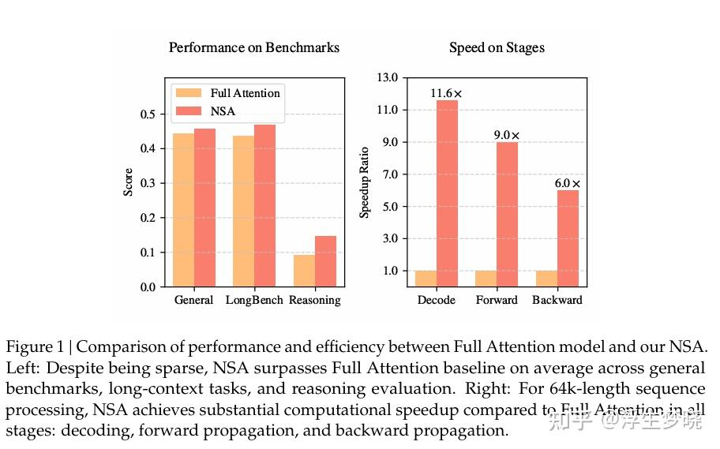
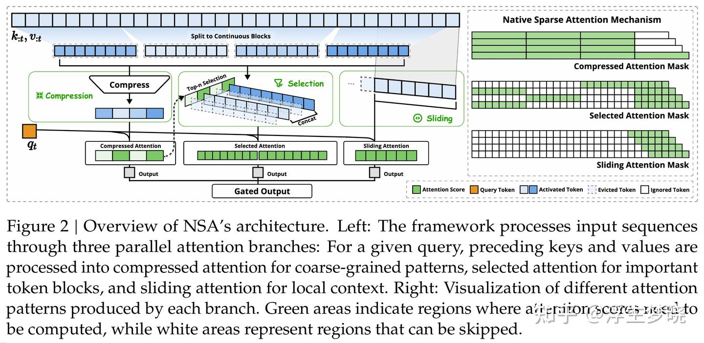
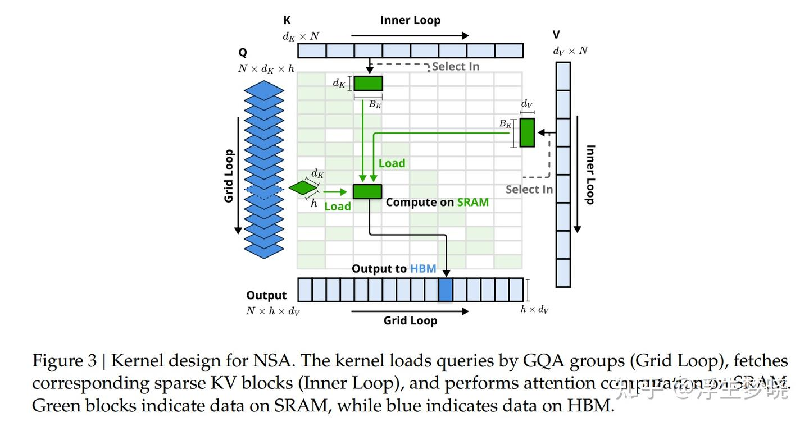
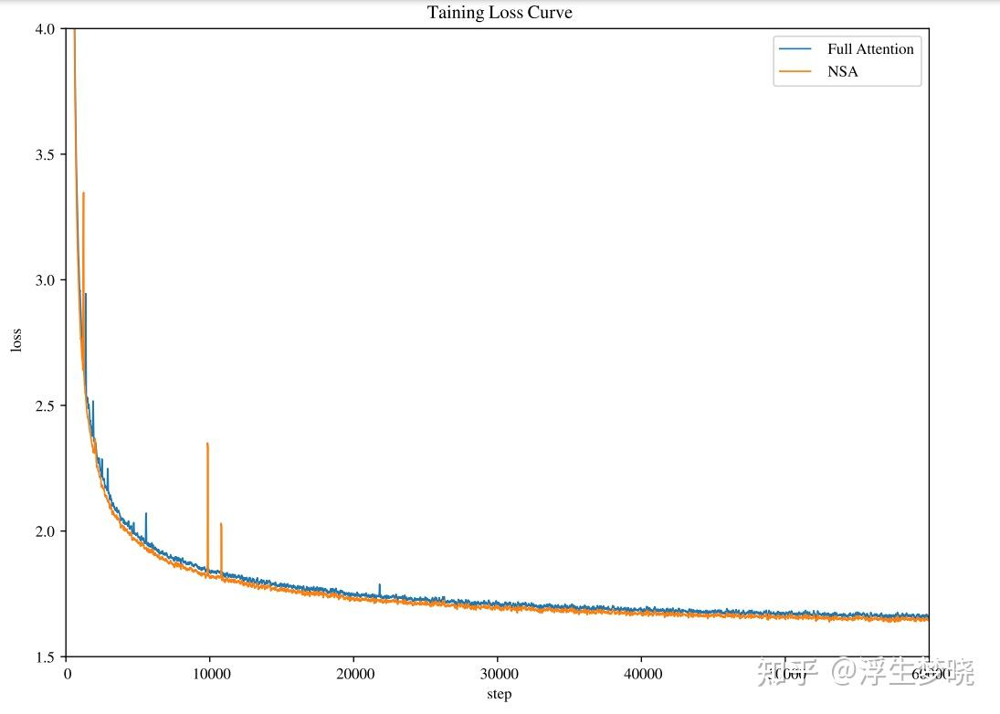
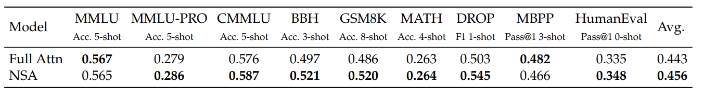
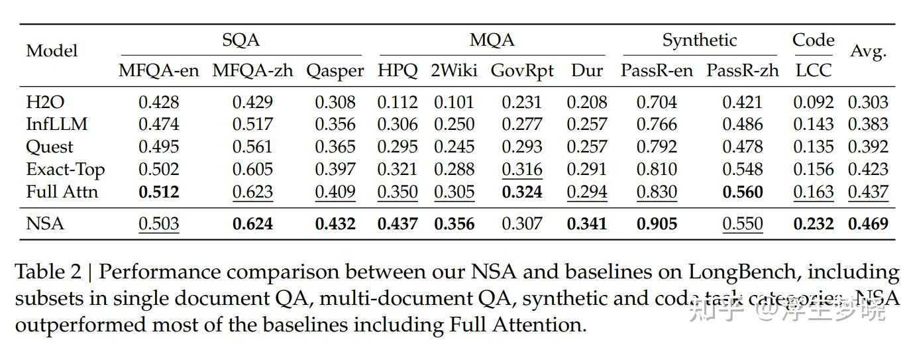
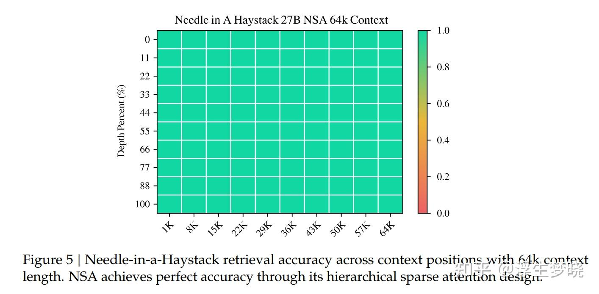
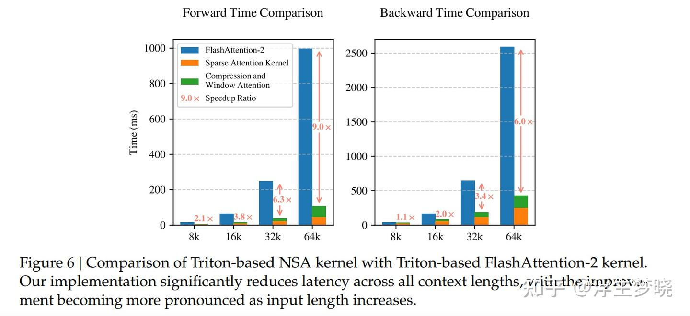

# DeepSeek-NSA——Native Sparse Attention: Hardware-Aligned and Natively  Trainable Sparse Attention

**Author:** 浮生梦晓

**Date:** 2025-03-17

**Link:** https://zhuanlan.zhihu.com/p/24632322448

本文的重心在论文名字中已经体现了，是对标准注意力的稀疏化，这类文章有非常多，基本上都会一定程度的降低模型的最终效果，但注意力稀疏化仍是一个热点的研究领域，原因也很简单，对于自回归的大模型来说，下一个token生成的logits是以来之前token的先验分布的，前向分布给的越明确则下一个token给的越准确，这也是带思维的模型产生的结果更加准确的原因之一（强化学习训练是让模型产生准确且合理思维链的原因），本质上带思维链推理的模型在生成答案时先验知识更加充分，因此生成的token也就越准确。而长上下文势必在注意力计算时带来存储和计算开销，且是呈平方增长的，因此注意力稀疏化工作是十分有必要的。

## 1.摘要部分

作者提出了[NSA](https://zhida.zhihu.com/search?content_id=253948465&content_type=Article&match_order=1&q=NSA&zhida_source=entity)（Natively trainable Sparse Attention），这个算法将算法创新与硬件对齐优化相结合，实现了高效的长文本建模。NSA采用了一种动态分层稀疏策略，将粗粒度的标记压缩与细粒度的标记选择相结合，以保留全局上下文感知能力和局部精确性。两个关键创新点：1、通过算术强度平衡的算法设计实现了显著的加速，并针对现代硬件进行了实现优化。2、实现了端到端的训练，减少了预训练的计算量，同时没有牺牲模型性能。

效果如下：

左图是在普通任务、长上下文认为以及推理任务上的评估效果，可以看到NSA比标准注意力要更优。

右图是在64K上下文长度序列任务上，在解码、前向传递和反向传播上NSA相对于标准注意力的速度提升。

## 2.介绍

这部分首先介绍了现有推理模型对于长上下文的需求，但随着上下文增加会造成注意力计算复杂度的飙升，作者理论分析在64K长度上下文的推理任务上，带softmax架构的注意力计算延迟站整体延迟的70-80%，因此继续更高效的注意力形式。

第二部分介绍了一些现有的注意力稀疏方案，主要是在计算softmax的K和v时只选择关键的token进行计算，但这些方法实际中效果并不好，而且绝大部分方法都集中在推理阶段，缺乏训练有效性来支持。

因此作者认为最有效的注意力稀疏方案应该解决两个关键挑战：1、硬件对齐的推理加速：将理论计算量的减少转化为实际的速度提升，需要在预填充和解码阶段进行硬件友好的算法设计，以缓解内存访问和硬件调度的瓶颈。2、训练感知的算法设计：通过可训练的算子实现端到端计算，以降低训练成本，同时保持模型性能。

相对应的，作者本篇论文提出的NSA也包含2个核心创新点：1、硬件对齐系统：针对 Tensor Core 的使用和内存访问优化块状[稀疏注意力](https://zhida.zhihu.com/search?content_id=253948465&content_type=Article&match_order=1&q=%E7%A8%80%E7%96%8F%E6%B3%A8%E6%84%8F%E5%8A%9B&zhida_source=entity)机制，确保算术强度的平衡。（2）训练感知设计：通过高效的算法和反向算子实现稳定的端到端训练。

NSA框架图总览：

在左图是多层次的token模式，分为三种，分别是粗粒度的token压缩，细粒度的重要token选择以及滑动窗口，从左图看到，当 $q_t$ 输入时，之前KVcache中的 $t-1$ 个缓存的Key和Value会进行提取划分，在图中是分成了4部分。

首先是压缩部分，将这四部分的Key和Value分别进行压缩后再拼接，拼接后的部分与Query进行注意力计算。

其次是选择部分，将这四组按照一定算法进行排序，选择出重要性较高的组（途中选择的是2组），将Query与选择出的2组token进行注意力计算。

最后是滑动窗口选择，设置一个滑动窗口大小，如512，选择当前token之前的512个token进行注意力计算（一般认为当前token主要和前面相邻的token注意力更相关）。

最后三个方法计算的注意力分数会被一个门控进行加权融合输出。

上面三种方案在实现上肯定要复杂，包括如何进行压缩、如何设置算法来选择重要性token、滑动窗口大小、门控权重系数等。

在右图中可以看到，三种方案会进行不同范围的Query-Key分值计算，一目了然，就不再细说，这种方案综合考虑高效性与模型最终效果，但又不必计算所有的q和k，同时作者实现了该算法的Kernel来最大化效率。最后是评估阶段，作者团队用260B tokens语料数据集训练了一个27B参数的模型来进行评估，最终效果上一张图已经展示过。

## 3\. 重新思考稀疏注意力的方法

当前的注意力稀疏方案都是针对推理时应用稀疏性而非训练时应用，这样会造成一种架构偏差，限制了充分发挥稀疏注意力优势的能力，从而带来一定的局限性，作者从两个视角分析了这些局限性。

### 1.高效推理的假象

首先大部分方法只关注在Prefill阶段或者只关注在decoding阶段，无法在推理的各个阶段都是先加速。

其次，当前很多方案无法适配主流的[GQA](https://zhida.zhihu.com/search?content_id=253948465&content_type=Article&match_order=1&q=GQA&zhida_source=entity)以及[MQA](https://zhida.zhihu.com/search?content_id=253948465&content_type=Article&match_order=1&q=MQA&zhida_source=entity)注意力方案。

### 2.可训练稀疏性的误区

作者之所以追求原生的可训练稀疏注意力，源于对之前训练后稀疏方案进行分析后的两个关键认识：

首先是之前训练后稀疏的工作会造成模型性能下降严重；其次是处于训练效率的需求，尤其是进行强化学习训练时对于长上下文的训练效率提升。

另外当前的稀疏策略会使得模型进行稀疏训练时出现不可求导的部分以及无法使用高效注意力计算方案，如flashattention等。

基于以上问题，作者针对推理效率和训练的可行性方面对系数注意力机制进行了根本性的重新设计，因此提出了NSA，一个原生稀疏注意力框架，既解决了计算效率问题、又满足了训练需求。

## 4.方法实现

前置符号：

$q_t$ ：查询的第 $t$ 个token的query

$k_{:t}$ ：缓存的 $0 ：t-1$ 个token的key

$v_{:t}$ ：缓存的 $0 ：t-1$ 个token的value

$a_{t,i}$ ：query和key计算后的注意力权重

$d_k$ ：key的隐藏层维度

$o_t$ ：注意力计算后的值

则标准的注意力计算公式为：

$\mathbf{o}_t=\mathrm{Attn}\left(\mathbf{q}_t,\mathbf{k}_{:t},\mathbf{v}_{:t}\right)$

$\mathrm{Attn}\left(\mathbf{q}_t,\mathbf{k}_{:t},\mathbf{v}_{:t}\right)=\sum_{i=1}^t\frac{\alpha_{t,i}\mathbf{v}_i}{\sum_{j=1}^t\alpha_{t,j}},\quad\alpha_{t,i}=e^{\frac{\mathbf{q}_t^\top\mathbf{k}_i}{\sqrt{d_k}}}$

作者在这里介绍了一下算数强度的概念，算术强度是计算操作次数与内存访问次数的比率。它从本质上影响着硬件上的算法优化。每个图形处理单元（GPU）都有一个关键算术强度，该强度由其峰值计算能力和内存带宽决定，计算方法是这两个硬件限制指标的比值。在实际中运算的计算强度高于这个阈值是计算密集型，也就是受限与GPU的计算能力。而如果计算确定低于这个阈值则属于内存密集型，一般情况下模型训练和推理时Prefill阶段属于计算密集型，而推理时自回归则属于内存密集型。

因此产生了两个优化目标——在训练和预填充阶段降低计算成本，在解码阶段减少内存访问。

### NSA总体框架

符号定义：

$\tilde{K}_t$ ： $k_{:t}$ 压缩后信息更密集的表示性KV对，根据当前 $q_t$ 及存储的key，value动态构建的。

$\tilde{V}_t $ ： $v_{:t}$ 压缩后信息更密集的表示性KV对，根据当前 $q_t$ 及存储的key，value动态构建的。

$\begin{equation} \begin{aligned} \tilde{K}_t &= f_K(\mathbf{q}_t, \mathbf{k}_{:t}, \mathbf{v}_{:t}), \\ \tilde{V}_t &= f_V(\mathbf{q}_t, \mathbf{k}_{:t}, \mathbf{v}_{:t}), \\ \mathbf{o}_t^* &= \text{Attn}(\mathbf{q}_t, \tilde{K}_t, \tilde{V}_t) \end{aligned} \end{equation}$

可以设计不同的策略使得不同映射后的key与value计算的注意力合并起来：

$\mathbf{o}_t^* = \sum_{c \in C} g_t^c \cdot \text{Attn}(\mathbf{q}_t, \tilde{K}_t^c, \tilde{V}_t^c)$

在上面图中可以看到，NSA中使用了3种映射策略 $\(C = \{cmp, slc, win\}\)$ ，分别对应对key和value进行压缩、选择以及滑动窗口操作。

$\(g_t^c\in[0, 1]\)$ 是对应策略 $c$ 的门控分数，通过多层感知机（MLP）和sigmoid激活函数输入特征中推导得出。

$N_t = \sum_{c \in C} \text{size}[\tilde{K}_t^c]$  
$N_t$ 代表重新设计后kv对的数量，其中：

$N_t\ll t$

### 算法设计

这部分着重介绍上面提到的映射方案， $f_K$ 与 $f_V$ ,token压缩、token选择和滑动窗口。

**1.token压缩**

前置符号：

$l$ ：块的长度

$d$ ：相邻两个块之间的滑动步长

$\varphi$ ：是一个可学习的多层感知机（MLP），它带有块内位置编码，用于将一个块中的键映射为单个压缩键。

$\tilde{K}_t^{\text{cmp}} \in \mathbb{R}^{d_k \times \left\lfloor\frac{t-l}{d}\right\rfloor}$ ：由压缩键组成的张量

$\tilde{K}_t^{\text{cmp}} = f_K^{\text{cmp}}(\mathbf{k}_{:t}) = \left\{\varphi(\mathbf{k}_{id+1:id+l}) \middle| 0 \leq i \leq \left\lfloor\frac{t-l}{d}\right\rfloor\right\}$

一般情况设置 $d<l$ 来减轻信息碎片化问题，实际上就是让两个块有重叠部分，这样两个块中信息不是突然断开的，类似CNN中卷积核移动。

token压缩后捕获更粗粒度的高层语义信息。

  

**2.token选择**

token的选择是基于query和key计算的重要性分数，而softmax是很耗计算的操作，这里作者使用token压缩时计算的注意力分值来推导：

$\mathbf{p}_t^{\text{cmp}} = \text{Softmax}\left(\mathbf{q}_t^T\tilde{K}_t^{\text{cmp}}\right)$

其中 $\mathbf{p}_t^{\text{cmp}} \in \mathbb{R}^{\left\lfloor\frac{t-l}{d}\right\rfloor+1}$ 是 ${q}_t^T$ 和 $\tilde{K}_t^{\text{cmp}}$ 计算得到的注意力分数。

$l'$ 代表选择块的大小

当压缩块和选择块使用相同的分块方案时，即 $\(l' = l = d\)$ ，可以直接通过 $p^{slc}_t=p^{cmp}_t$ 得到选择块的重要性分数 $p^{slc}_t$

当分块方案不同时，根据选择块的空间关系来**推导**它们重要性分数。在 $\(l\leq l'\)$ 、 $d$ 能整除 $l$ 且 $d$ 能整除 $\(l'\)$ 的条件下，有：

$\mathbf{p}_t^{\text{slc}}[j] = \sum_{m=0}^{\frac{l'}{d}-1} \sum_{n=0}^{\frac{l}{d}-1} \mathbf{p}_t^{\text{cmp}}\left[\frac{l'}{d}j - m - n\right]$

\[\]表示方位向量元素的索引运算符，对于采用通用查询注意力（GQA）或多头查询注意力（MQA）的模型，在这些模型中键值缓存是在各个查询头之间共享的，为了在解码过程中最小化键值（KV）缓存的加载量，必须确保这些查询头之间的分块选择是一致的。一组查询头之间共享的重要性分数的正式定义如下：

$\mathbf{p}_t^{\text{slc}'} = \sum_{h=1}^{H} \mathbf{p}_t^{\text{slc}(h)}$

$(h)$ 表示头索引

$H$ 表示每组中查询头的数量

这种聚合方式确保了同一组内各个查询头之间的分块选择是一致的。

  

通过上面的方法计算出key和value的注意力分数后要进行块选择了，按照分块重要性分数选择出排名前 $n$ 个稀疏分块token，公式如下：

$\mathcal{I}_t = \{i \mid \text{rank}(\mathbf{p}_t^{\text{slc}'}[i]) \leqslant n\}$

$\tilde{K}_t^{\text{slc}} = \text{Cat}\left[\{\mathbf{k}_{il'+1:(i+1)l'} \mid i \in \mathcal{I}_t\}\right]$

$rank()$ 表示按降序排列的排名位置，其中 $rank=1$ 对应最高分数。

$\mathcal{I}_t $ 表示被选择的块索引

$Cat$ 表示聚合连接操作

$\tilde{K}_t^{\text{slc}} \in \mathbb{R}^{d_k \times nl'}$ 表示压缩keys表示的张量

上面的公式也使用于 $\tilde{V}_t^{\text{slc}} $

**3.滑动窗口**

符号：

$w$：滑动窗口大小

$\tilde{K}_t^{\text{win}} = \mathbf{k}_{t-w:t}, \quad \tilde{V}_t^{\text{win}} = \mathbf{v}_{t-w:t}$

这部分相对简单

在获取了所有三类键和值 $(\tilde{K}_t^{\text{cmp}}, \tilde{V}_t^{\text{cmp}}; \tilde{K}_t^{\text{slc}}, \tilde{V}_t^{\text{slc}}; \text{ and } \tilde{K}_t^{\text{win}}, \tilde{V}_t^{\text{win}})$ 之后，我们按照上面的加权公式计算最终的注意力输出。结合上述的压缩、选择和滑动窗口机制，这构成了 NSA 完整的算法框架。

4.Kernel设计

实际上上面3种方案中，压缩注意力以及滑动窗口注意力可以很好的适配flash attention2，但稀疏选择注意力需要引入专门的内核设计：采用不同的查询分组策略，对于查询序列上的每个位置，将一个通用查询注意力（GQA）组内的所有查询头（共享相同的稀疏KV块）加载到SRAM中，以下是他们的前向传播方式。

这种内核设计具有以下关键特点：

1、以组为中心的数据加载。对于每个内循环，加载位置 $t$ 处组内所有头的查询 $\(Q\in\mathbb{R}^{[h, d_k]}\)$ ，以及它们共享的稀疏KV块索引 $\(I_t\)$ 。

2、获取共享KV。在内循环中，将由 $\(I_t\)$ 索引的连续KV块按顺序加载到静态随机存取存储器（SRAM）中，分别表示为 $\(K\in\mathbb{R}^{[B_k,d_k]}、V\in\mathbb{R}^{[B_k,d_v]}\)$ ，以尽量减少内存加载量，其中 $\(B_k\)$ 是内核块大小，且满足 $\(B_k\)$ 能整除 $\(l'\)$ 。

3、网格上的外循环。由于对于不同的查询块，内循环长度（与所选块的数量 $n$ 成比例）几乎保持相同，因此将查询 / 输出循环置于 Triton 的网格调度器中，以简化和优化内核。

这种设计通过以下两点实现了近乎最优的算术强度：（1）通过按组共享消除了冗余的键值（KV）传输；（2）在GPU的流式多处理器之间平衡了计算工作负载。

## 5.实验

作者从3个方面对NSA进行评估：（1）通用基准测试性能；（2）长上下文基准测试性能；（3）思维链推理性能

首先是训练阶段：

在各项指标上与标准注意力区别不大，loss下降曲线与标准注意力也拟合。

与其他稀疏方案比较：

NSA的注意力稀疏方案多数较优，部分benchmark略低于标准注意力。

在各种长度的大海捞针实验上，NSA表现均优。

NSA的Kernel使得其在前向，反向传递时均明显优于[flashattention2](https://zhida.zhihu.com/search?content_id=253948465&content_type=Article&match_order=1&q=flashattention2&zhida_source=entity)