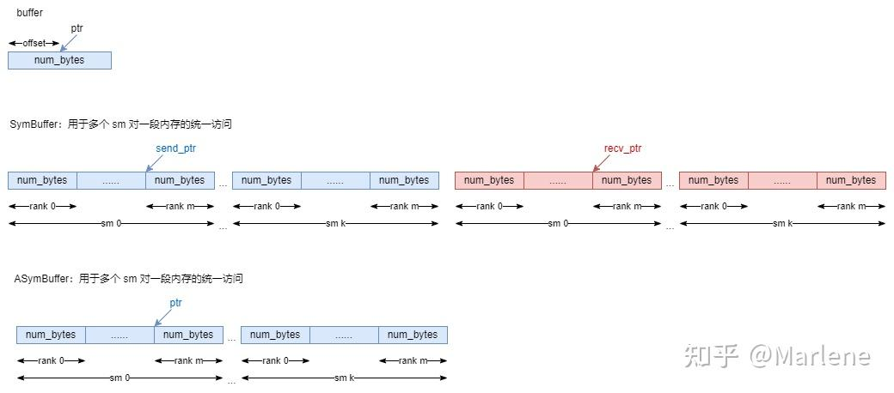
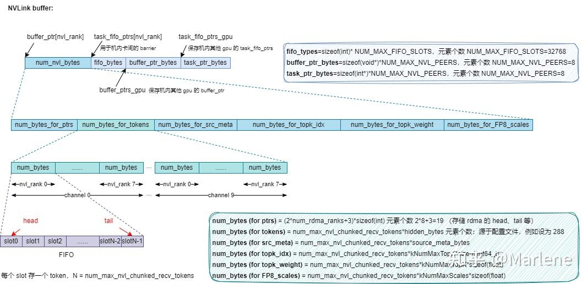
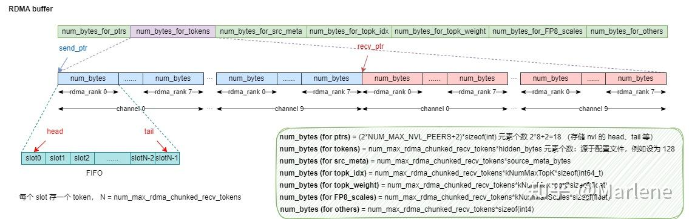
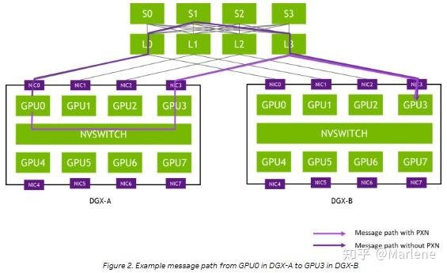
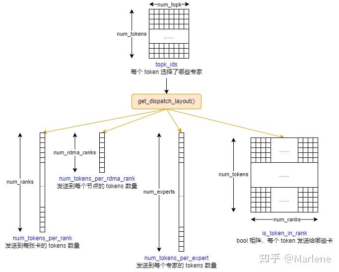
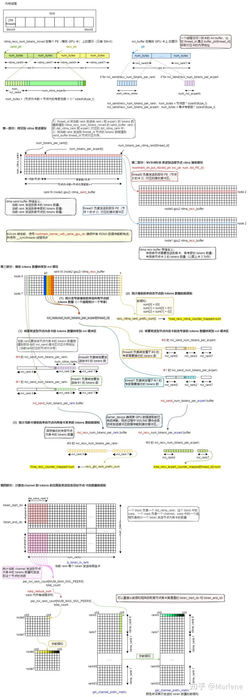
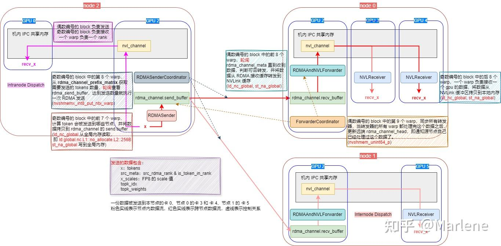
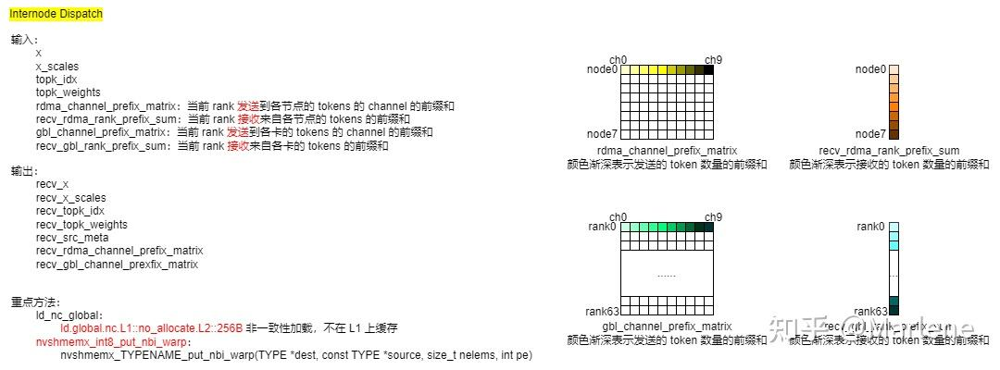
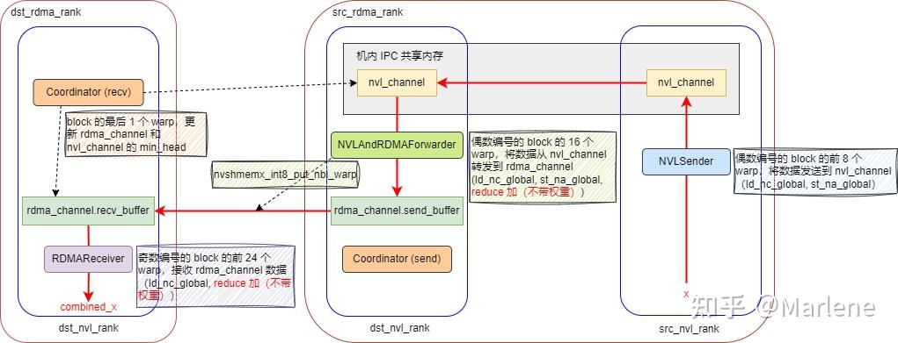

# DeepEP Dispatch/Combine 图示

**Author:** Marlene

**Date:** 2025-03-26

**Link:** https://zhuanlan.zhihu.com/p/29273768638

### 数据结构

[DeepEP](https://zhida.zhihu.com/search?content_id=254877141&content_type=Article&match_order=1&q=DeepEP&zhida_source=entity) 定义的三种缓冲区：

-   Buffer：管理单个缓冲区，支持基本的内存分配和访问；
-   [AsymBuffer](https://zhida.zhihu.com/search?content_id=254877141&content_type=Article&match_order=1&q=AsymBuffer&zhida_source=entity)：非对称缓存，用于 [NVLink](https://zhida.zhihu.com/search?content_id=254877141&content_type=Article&match_order=1&q=NVLink&zhida_source=entity) 缓存，管理多个缓冲区，支持多个 Rank；
-   [SymBuffer](https://zhida.zhihu.com/search?content_id=254877141&content_type=Article&match_order=1&q=SymBuffer&zhida_source=entity)：对称缓存，用于 [RDMA](https://zhida.zhihu.com/search?content_id=254877141&content_type=Article&match_order=1&q=RDMA&zhida_source=entity) 缓存，Decouple 模式分别设置`send_buffer`和`recv_buffer`，非解偶模式调用`buffer`。

三种 Buffer 示意图

nvl buffer 如图：

rdma buffer 如图：

### 组网背景

  

高性能 GPU 训练集群往往会采用轨道优化，同号 GPU 在一个 [Leaf Switch](https://zhida.zhihu.com/search?content_id=254877141&content_type=Article&match_order=1&q=Leaf+Switch&zhida_source=entity) 下，因此可以利用高速的 NVLink 来代替从 Leaf Switch 到 [Spine Switch](https://zhida.zhihu.com/search?content_id=254877141&content_type=Article&match_order=1&q=Spine+Switch&zhida_source=entity) 的流量，从而降低 [IB 通信](https://zhida.zhihu.com/search?content_id=254877141&content_type=Article&match_order=1&q=IB+%E9%80%9A%E4%BF%A1&zhida_source=entity)时延，并且减少 Leaf Switch 和 Spine Switch 之间的流量）。

### Normal [Dispatch](https://zhida.zhihu.com/search?content_id=254877141&content_type=Article&match_order=1&q=Dispatch&zhida_source=entity) 流程

**第一步**：get\_dispatch\_layout，根据 topk\_idx 来统计当前 rank 发送到每个专家、每张卡、每个计算节点的 token 数量，并标记每个 token 是否属于某张卡。

**第二步**：notify\_dispatch，获取当前 rank 需要发送和接收多少数据（按 channel 统计前缀和）。

其中，channel 是指收发数据时将 tokens 拆分成若干个连续的 tokens 组成的块，实际执行时使用 10 个 channel，每个 channel 由两个 SM 负责执行。

notify\_dispatch 流程如下：

**第三步**：执行 Dispatch，分为 Intranode Dispatch（节点内）和 Internode Dispatch（节点间）。

节点内，奇数 block 负责发送；偶数 block 负责接收。

节点间，每个 block 的每个 warp 都有自己的角色，分别负责发送、转发、协调。

intranode & internode dispatch

其中，internode\_dispatch 内核函数输入输出如下：

### Normal [Combine](https://zhida.zhihu.com/search?content_id=254877141&content_type=Article&match_order=1&q=Combine&zhida_source=entity) 流程

**第一步**：复用 Dispatch 的 layout 信息，调用 cache\_notify 加载。

**第二步**：执行 Combine，分为 Intranode Combine（节点内）和 Internode Combine（节点间）。

internode\_combine 示意图