# 理解DeepEP源码和节点通信逻辑

**Author:** 叶千树

**Date:** 2025-04-05

**Link:** https://zhuanlan.zhihu.com/p/1890067712996270654

​

目录

收起

准备阶段

构建数据

构建通信环境

notify\_dispatch

SM0 rdma通信和ipc通信

SM 1-8 计算节点各通道发送token数据到各rank和rdma组的情况

dispatch

kRDMASender， 填充rdma发送缓存

kRDMASenderCoordinator， 发送rdma信息

kRDMAAndNVLForwarder， 消费rdma接受缓存并存到ipc nvl缓存 。

kForwarderCoordinator， 确认rdma接受缓存被kRDMAAndNVLForwarder消费

kNVLReceivers， 使用nvl缓存填充recv\_x

总结

DeepSeek开源[DeepEP](https://link.zhihu.com/?target=https%3A//github.com/deepseek-ai/DeepEP)， DeepEP是用于[MOE模型](https://zhida.zhihu.com/search?content_id=255808525&content_type=Article&match_order=1&q=MOE%E6%A8%A1%E5%9E%8B&zhida_source=entity)专家并行模式下expert数据dispatch和combine的通信实现。 DeepEP提供了低延迟模式和标准模式。在低延迟模式下，token通过rdma直接发送到目标专家所在的显卡上。在标准模式下， 基于rdma通讯组token通过rdma发到目标专家所在的机器上所对应的rdma通讯组显卡，再经由该通讯组显卡发送到目标专家所对应的显卡上。

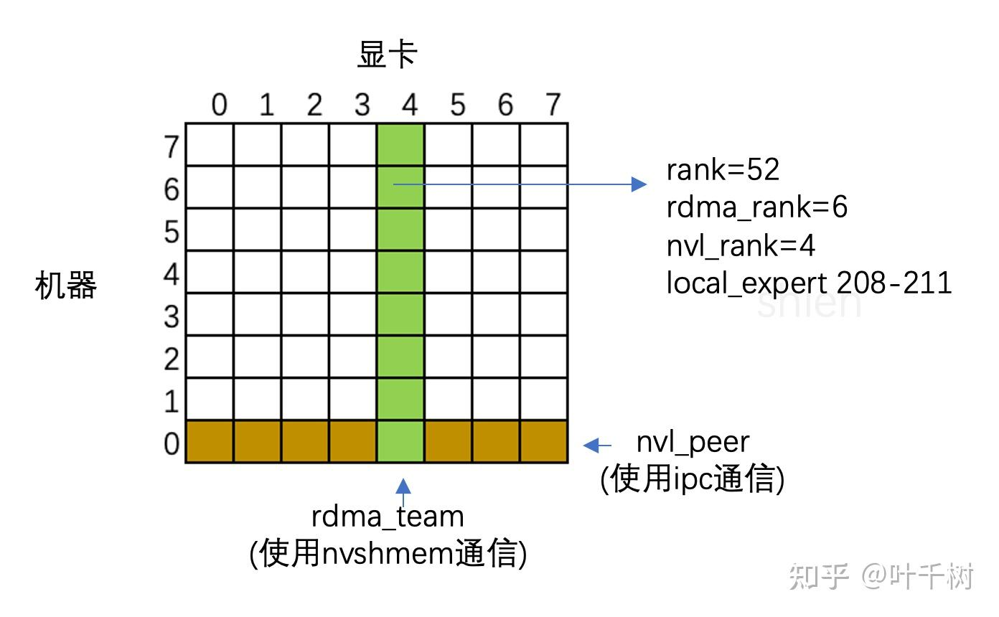

图1 64路专家并行机器/显卡通信结构

如图1所示，64路专家并行模式，8台机器，每台机器8张显卡，共64张显卡（world\_size=64）,共256个expert, 每张显卡分配4个expert 。 标准模式主要的考量是节点和节点之间通过[infiniband](https://zhida.zhihu.com/search?content_id=255808525&content_type=Article&match_order=1&q=infiniband&zhida_source=entity)通信， 通信带宽是50GB/s, 节点内显卡和显卡之间通过[nvlink](https://zhida.zhihu.com/search?content_id=255808525&content_type=Article&match_order=1&q=nvlink&zhida_source=entity)通信，通信带宽是160GB/s。一个token可能会发到一台机器上的多个专家上（一台机器上分配32个专家）， 为了减少数据传输降低infiniband带宽的压力，在传输过程中如果多个目标专家在一台机器上，发送给该台机器上的token数据只有一份， 而后由nvlink发到多个专家上。

DeepEP在节点之间通信采用了nvshmem机制, 在节点内通信则采用了[IPC机制](https://zhida.zhihu.com/search?content_id=255808525&content_type=Article&match_order=1&q=IPC%E6%9C%BA%E5%88%B6&zhida_source=entity)。不同于传统的 send/receive 和nccl 这类对称通信， nvshmem和IPC都属于是单向操作，以及为了提升通信效率，DeepEP使用了大量基于显存一致性的无锁同步机制，和大量的数据结构来支持通信过程中的数据交互，再加上[cuda](https://zhida.zhihu.com/search?content_id=255808525&content_type=Article&match_order=1&q=cuda&zhida_source=entity)代码天然并发， 导致DeepEP的理解成本较高。本文主要聚焦在DeepEP internode\_dispatch的相关代码逻辑，期望通过本文的分析，能够对[deepseek v3技术文档](https://link.zhihu.com/?target=https%3A//arxiv.org/pdf/2412.19437) 中提到的诸如分配20个sm用于通信，为了减小延迟会在rdma收到信息后马上通过nvlink发送到对应的专家上，以及使用了[ptx指令](https://zhida.zhihu.com/search?content_id=255808525&content_type=Article&match_order=1&q=ptx%E6%8C%87%E4%BB%A4&zhida_source=entity)来穿透L2缓存使用等技巧有所理解，对cuda和ptx的编程特性有所了解。

## 准备阶段

### 构建数据

在tests/test\_internode.py test\_main函数中 line-16

```text
num_tokens, hidden, num_topk_groups, num_topk, num_experts = 4096, 7168, min(num_nodes, 4), 8, (256 // num_ranks) * num_ranks
```

后续基于如下参数讨论

```text
num_tokens=4096 # (token数量), 
hidden=7168 #（隐层大小）, 
num_topk_groups=4 #（token发给4台机器， Deepseek V3技术文档中提到为了减小通信，token只会发送到最多4台机器上）, 
num_topk = 8 #（发送给4台机器中的top 8 专家）, 
num_experts=256 #（专家个数256）

num_sms=20 #(使用的streaming processor数量)
num_ranks=64 (world size)
num_nodes=8 (节点个数)

node=  (当前节点是第几个节点 0-7)
local_rank= (当前主机第几块显卡， 由torch.multiprocessing.spawn 的隐式入参决定，0 - 7 )
rank= node*8 + local_rank (当前显卡在64张显卡的位置)
```

line 22 - 37 是每个rank上要dispatch的信息（x, x\_scale, score，topk\_idx, rank\_idx, rdma\_idx ...）， 参考相应注释，在注释中标注了各个tensor的维度信息和含义。

```text
x = torch.ones((num_tokens, hidden), dtype=torch.bfloat16, device='cuda') * rank 
#[4096, 7168] bfloat16

x_pure_rand = torch.randn((num_tokens, hidden), dtype=torch.bfloat16, device='cuda')
#[4096, 7168] bfloat16

x_e4m3 = per_token_cast_to_fp8(x)
# ([4096, 7168] float8 e4m3, [4096, 56] float32)

scores = torch.randn((num_tokens, num_experts), dtype=torch.float32, device='cuda').abs() + 1
#[4096, 256] float32

group_scores = scores.view(num_tokens, num_nodes, -1).amax(dim=-1)
#[4096, 8] score在每台机器上最大值

group_idx = torch.topk(group_scores, k=num_topk_groups, dim=-1, sorted=False).indices
#[4096, 4] top4 group所对应的index （发送token去的top 4 机器）

masked_scores = create_grouped_scores(scores, group_idx, num_nodes)
#[4096, 256],  不在top4 group中的score被mask成0

topk_idx = torch.topk(masked_scores, num_topk, dim=-1, largest=True, sorted=False)[1]
#[4096, 8], top8 expert所对应的index （发送token去的top 8 专家）

topk_weights = torch.ones((num_tokens, num_topk), dtype=torch.float32, device='cuda') * rank
#[4096, 8], top8 expert所对应的权重 

topk_weights_pure_rand = torch.randn((num_tokens, num_topk), dtype=torch.float32, device='cuda')
#[4096, 8], top8 expert所对应的权重 

rank_idx = topk_idx // (num_experts // num_ranks)
#[4096, 8], 发送token去的expert所对应的rank, 等价是 topk_idx//4

rank_idx.masked_fill_(topk_idx == -1, -1)
inplace_unique(rank_idx, num_ranks)
#rank_idx[4096, 8] top8 专家对应的去重rank, 
#如果某个显卡由多个expert, 则rank会重复，inplace_unique是去重了rank, 剩余位置补 -1

rdma_rank_idx = rank_idx // num_local_ranks
rdma_rank_idx.masked_fill_(rank_idx == -1, -1)
inplace_unique(rdma_rank_idx, num_nodes)
#[4096, 8] 去重rank_idx//8, 对应的第几台机器
#如果会发送同一台机器上的多个显卡上，则rdma_rank 会重复，inplace_unique去重了rdma_rank,剩余位置补 -1
 
# RDMA dispatch counts
rdma_idx = topk_idx // (num_experts // num_nodes)
#[4096, 8], topk_idx//32
rdma_idx.masked_fill_(topk_idx == -1, -1)
inplace_unique(rdma_idx, num_nodes)
#去重的需要发到对应机器上的索引
num_rdma_token_sent = rdma_idx.ne(-1).sum().item()
#总计需要发送的token数（累计全部token需要发送到多少台机器上）

```

一些dispatch对应的统计信息

```text
# Expert meta
num_tokens_per_expert = torch.zeros((num_experts, ), dtype=torch.int, device='cuda') #[256]
for i in range(num_experts):
    num_tokens_per_expert[i] = (topk_idx == i).sum() #计算要发到每个expert的token数
gbl_num_tokens_per_expert = num_tokens_per_expert.clone()
dist.all_reduce(gbl_num_tokens_per_expert, group=group) #计算整个world需要发送到各expert的token数


# Rank layout meta
num_tokens_per_rank = torch.empty((num_ranks, ), dtype=torch.int, device='cuda') #[64]
num_tokens_per_rdma_rank = torch.empty((num_nodes, ), dtype=torch.int, device='cuda') #[8]
token_idx_in_rank = torch.full((num_ranks, num_tokens), -1, dtype=torch.long, device='cuda') #[64, 4096]
for i in range(num_ranks):
    num_tokens_per_rank[i] = (rank_idx == i).sum() #计算发送到rank_i的token数
    token_sel = (rank_idx == i).max(dim=-1)[0] #[4096] 0-1, 0代表不发送到该rank, 1代表发送到该rank
    count = token_sel.sum().item() #发送到rank_i的token数
    tokens = torch.sort(token_sel.to(torch.int), descending=True)[1] 
    #[4096] 排序的对应的token index, 排序的依据是token_sel的值（0-1），此时token index本身无序
    tokens[:count] = torch.sort(tokens[:count])[0] #[count] # 基于token index排序， 从小到大排
    token_idx_in_rank[i][tokens[:count]] = torch.arange(count, dtype=torch.long, device='cuda')
    # token_idx_in_rank[rank][token_index] = 发送给token_idx_in_rank[rank]第N个token(N 在 0 ~ count-1, 如果是-1则不发送给该rank)

for i in range(num_nodes):
    num_tokens_per_rdma_rank[i] = (rdma_rank_idx == i).sum()
    # 发送给第 rdma_rank 机器的token数量

token_idx_in_rank = token_idx_in_rank.T.contiguous().to(torch.int) # [4096, 64]
is_token_in_rank = token_idx_in_rank >= 0 #[4096, 64] bool值， 发送到rank为1， 不发送为0
gbl_num_tokens_per_rank = num_tokens_per_rank.clone() #[64]
dist.all_reduce(gbl_num_tokens_per_rank, group=group) #计算整个world需要发送到各rank的token数
```

简单的来看，是可以通过score得到token要发送到哪里（expert, rank, rdma\_rank）， 发送量由多少。 而后通过这些信息，做下全局同步，就可以得到每个显卡会收到多少token, 来自哪里这些基础信息，方便后续分配显存接受数据和计算。

### 构建通信环境

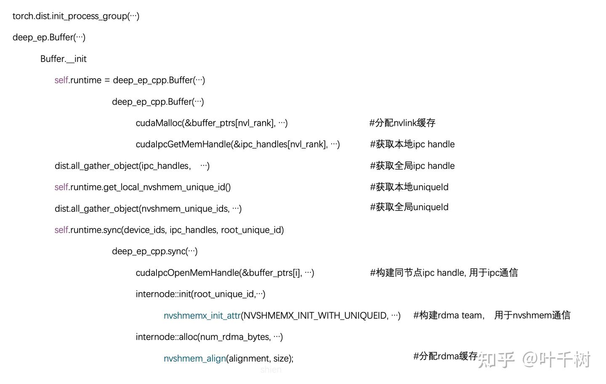

图2 初始化ipc通信和nvshmem通信环境

图2描述构建ipc通信和nvshmem通信环境的代码流程。

在tests/test\_internode.py test\_loop函数line 223

```text
rank, num_ranks, group = init_dist(local_rank, num_local_ranks)
```

首先是通过torch.dist.init\_process\_group构建了通信组，这个通信组主要是维持全局信息。 从而得到当前显卡对应的rank值， world size(num\_ranks=64), 以及用于表征通信组的group

而后在line 228 调用 deep\_ep.Buffer

```text
buffer = deep_ep.Buffer(group, int(1e9), int(1e9), low_latency_mode=test_ll_compatibility,
                            num_qps_per_rank=(ll_num_experts // num_ranks if test_ll_compatibility else 1))
```

deep\_ep.Buffer 在deep\_ep/buffer.py line32 \_\_init\_\_ 函数。在其函数内，在line 55进入到c++代码

```text
self.runtime = deep_ep_cpp.Buffer(self.rank, self.group_size, num_nvl_bytes, num_rdma_bytes, low_latency_mode)
```

deep\_ep\_cpp.Buffer 在 csrc/deep\_ep.cpp line 16 Buffer::Buffer 构造函数。 在python 代码中，通过self.runtime来调用相应的c++函数。

在Buffer::Buffer中，主要是构造了用来节点内通信的buffer\_ptrs（通过ipc通信）， 以及用来记录接受token数量的一些变量。在line 43 - 55.

```text
if (num_nvl_bytes > 0) {
    // Local IPC: alloc local memory and set local IPC handle
    //buffer_ptrs是一个数组，buffer_ptrs[nvl_rank]指向自身显卡的显存，
    //其它buffer_ptrs[id]通过ipc机制指向机器内其他显卡的显存
    CUDA_CHECK(cudaMalloc(&buffer_ptrs[nvl_rank], num_nvl_bytes + fifo_bytes + buffer_ptr_bytes + task_ptr_bytes));  
    CUDA_CHECK(cudaIpcGetMemHandle(&ipc_handles[nvl_rank], buffer_ptrs[nvl_rank]));
    buffer_ptrs_gpu = reinterpret_cast<void**>(reinterpret_cast<uint8_t*>(buffer_ptrs[nvl_rank]) + num_nvl_bytes + fifo_bytes);

    // Set task fifo
    EP_HOST_ASSERT(NUM_MAX_FIFO_SLOTS % num_nvl_ranks == 0);
    //task_fifo_ptrs是buffer_ptrs的一部分， 指向buffer_ptrs[nvl_rank][num_nvl_bytes]
    task_fifo_ptrs[nvl_rank] = reinterpret_cast<int*>(reinterpret_cast<uint8_t*>(buffer_ptrs[nvl_rank]) + num_nvl_bytes);
    task_fifo_ptrs_gpu = reinterpret_cast<int**>(reinterpret_cast<uint8_t*>(buffer_ptrs[nvl_rank]) + num_nvl_bytes + fifo_bytes + buffer_ptr_bytes);

    // No need to synchronize, will do a full device sync during `sync`
    CUDA_CHECK(cudaMemsetAsync(task_fifo_ptrs[nvl_rank], 0, fifo_bytes, comm_stream));
}
```

在python代码deep\_ep/buffer.py \_\_init\_\_ 函数内 line 94 调用了self.runtime.sync完成ipc显存指向和rdma显存的分配

```text
self.runtime.sync(device_ids, ipc_handles, root_unique_id)
```

在c++代码 csrc/deep\_ep.cpp line 163 Buffer::sync 完成了ipc显存映射， 和建立rdma组，分配rdma显存的操作。 后续notify\_dispatch 和 dispatch都是基于ipc显存，rdma显存操作来完成token传输。

line 169 -189 完成ipc显存映射

```text
// Sync IPC handles
if (num_nvl_bytes > 0) {
    EP_HOST_ASSERT(num_ranks == device_ids.size());
    EP_HOST_ASSERT(device_ids.size() == all_gathered_handles.size());
    for (int i = 0, offset = rdma_rank * num_nvl_ranks; i < num_nvl_ranks; ++ i) {
        EP_HOST_ASSERT(all_gathered_handles[offset + i].has_value());
        auto handle_str = std::string(all_gathered_handles[offset + i].value());
        EP_HOST_ASSERT(handle_str.size() == CUDA_IPC_HANDLE_SIZE);
        if (offset + i != rank) {
            std::memcpy(ipc_handles[i].reserved, handle_str.c_str(), CUDA_IPC_HANDLE_SIZE);
            // &buffer_ptrs[i] 指向 ipc_handles[i]
            CUDA_CHECK(cudaIpcOpenMemHandle(&buffer_ptrs[i], ipc_handles[i], cudaIpcMemLazyEnablePeerAccess));
            task_fifo_ptrs[i] = reinterpret_cast<int*>(reinterpret_cast<uint8_t*>(buffer_ptrs[i]) + num_nvl_bytes);
        } else {
           // &buffer_ptrs[rank] 指向 显卡自身
           EP_HOST_ASSERT(std::memcmp(ipc_handles[i].reserved, handle_str.c_str(), CUDA_IPC_HANDLE_SIZE) == 0);
        }
    }

    // Copy all buffer and task pointers to GPU
    // 把host内存值复制到buffer_ptrs_gpu和task_fifo_ptrs_gpu上， 完成内存自引用
    CUDA_CHECK(cudaMemcpy(buffer_ptrs_gpu, buffer_ptrs, sizeof(void*) * NUM_MAX_NVL_PEERS, cudaMemcpyHostToDevice));
    CUDA_CHECK(cudaMemcpy(task_fifo_ptrs_gpu, task_fifo_ptrs, sizeof(int*) * NUM_MAX_NVL_PEERS, cudaMemcpyHostToDevice));
    CUDA_CHECK(cudaDeviceSynchronize());
}
```

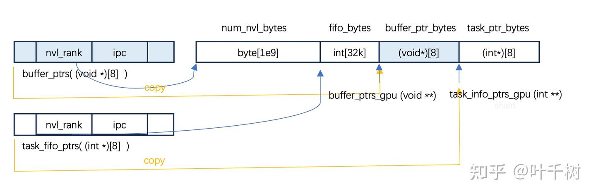

图3 ipc显存分布

如图3所示，在分配构建ipc显存后，将buffer\_ptrs值复制到buffer\_ptr\_bytes, task\_fifo\_ptrs值复制到task\_info\_ptrs\_gpu, 之后在显卡代码可以通过这个数据结构buffer\_ptr\_bytes\[nvl\_rank\]访问自身显存以及buffer\_ptr\_bytes\[i\]访问ipc显存。

在line192 -212完成rdma组构建和rdma显存分配

```text
// Sync NVSHMEM handles and allocate memory
if (num_rdma_bytes > 0) {
    // Initialize NVSHMEM
    EP_HOST_ASSERT(root_unique_id_opt.has_value());
    std::vector<uint8_t> root_unique_id(root_unique_id_opt->size());
    auto root_unique_id_str = root_unique_id_opt->cast<std::string>();
    std::memcpy(root_unique_id.data(), root_unique_id_str.c_str(), root_unique_id_opt->size());
    auto nvshmem_rank = low_latency_mode ? rank : rdma_rank;
    auto num_nvshmem_ranks = low_latency_mode ? num_ranks : num_rdma_ranks;
    // 建立 rdma组
    EP_HOST_ASSERT(nvshmem_rank == internode::init(root_unique_id, nvshmem_rank, num_nvshmem_ranks, low_latency_mode));
    internode::barrier();

    // Allocate
    // 分配rdma显存
    rdma_buffer_ptr = internode::alloc(num_rdma_bytes, NUM_BUFFER_ALIGNMENT_BYTES);

    // Clean buffer (mainly for low-latency mode)
    CUDA_CHECK(cudaMemset(rdma_buffer_ptr, 0, num_rdma_bytes));

    // Barrier
    internode::barrier();
    CUDA_CHECK(cudaDeviceSynchronize());
}
```

internode::init 在 csrc/kernel/runtime.cu line 65 init 函数， 主要代码是在line 66 - 70

```text
nvshmemx_uniqueid_t root_unique_id;
nvshmemx_init_attr_t attr;
std::memcpy(&root_unique_id, root_unique_id_val.data(), sizeof(nvshmemx_uniqueid_t));
nvshmemx_set_attr_uniqueid_args(rank, num_ranks, &root_unique_id, &attr);
nvshmemx_init_attr(NVSHMEMX_INIT_WITH_UNIQUEID, &attr);
```

通过root\_unique\_id来构建nvshmem的通信组。root\_unique\_id 是rdma\_rank为0的8张显卡会各自产生unique id, 然后每台机器上的显卡使用rdma\_group = rank % 8 来获取rdma\_rank为0的8个显卡对应的第rdma\_group显卡的unique id,而后通过nvshmemx\_init\_attr(NVSHMEMX\_INIT\_WITH\_UNIQUEID, &attr)完成网络组构建。

完成的rdma网络组如图1所示，会有8个rdma group,每个group包含8张显卡（节点）。

internode::alloc在 csrc/kernel/runtime.cu line 98.

```text
nvshmem_align(alignment, size);
```

代码很简单，就是通过 nvshmem\_align 分配了一块显存，需要注意的是，需要所有的nvshmem节点都调用这个方法，并且使用相同的参数，这样这块显存可以通过nvshmem的api远程读（将远端节点显存内容复制到自身节点）或者远程写（将自身节点内容写入到远端节点）， 读和写不需要对方操作。 这种显存叫做symmetry memory, 对称显存）， 这种读写方式叫做单向操作（区别于send/receive这种对称操作）。

  

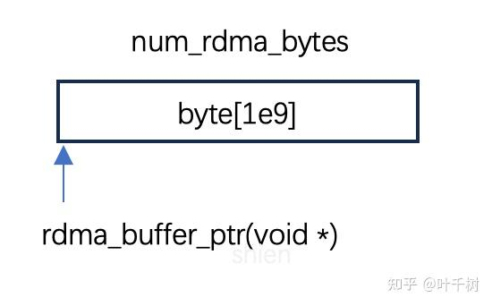

图4 rdma显存分布

如图4， 每个rank节点会分配一块显存用于nvshmem通信, 如上文所提到， 在一个rdma group内， 可以通过nvshmem api访问远端的rdma\_buffer。

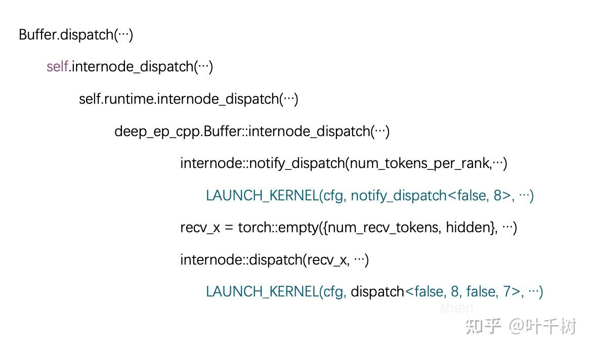

图5 internode dispatch流程代码链路

图5描述了internode token分发的主要代码逻辑，大概的流程是nofify\_dispatch, 分配接受显存，dispatch。 notify\_dispatch和dispatch都进入到cuda kernel代码在gpu上完成。 c++侧代码主要是统计一些辅助信息和分配一些显存用于通信，主要通信逻辑封装在 notify\_dispatch<> 和 dispatch<> 两个kernel函数中。 nofiy\_dispatch在统计全局的token分发， dispatch是真正的用rdma发送token和消费转发远端发送来的token。 后续主要介绍这两个函数的相关逻辑。

## notify\_dispatch

在csrc/kernels/internode.cu line 201, 各参数含义参见注释

```text
notify_dispatch(
const int* num_tokens_per_rank,  #(int)[64] 在第一步构建数据时统计了要发到各rank的token数量
int* moe_recv_counter_mapped, #(int)[1] 该节点最终会收到的token数，用于分配 recv_x 显存
int num_ranks, #64, world size
const int* num_tokens_per_rdma_rank, #（int）[8], 发送到rdma节点的token数
int* moe_recv_rdma_counter_mapped, #(int)[1], 从rdma收到的token数
const int* num_tokens_per_expert, #（int)[256], 发送到各expert的token数
int* moe_recv_expert_counter_mapped, #[1024], 只会用头部的4个，统计当前rank各expert收到的token数
int num_experts, #256
const bool* is_token_in_rank, #[4096, 64]
int num_tokens, # 4096
int num_channels, # 10
int expert_alignment, #1
const int rdma_clean_offset,  # rdma_clean_meta.first, 83686400, 0.0836864e9
const int rdma_num_int_clean, # rdma_clean_meta.second, 6400
const int nvl_clean_offset,   # nvl_clean_meta.first, 85985280, 0.08598528e9
const int nvl_num_int_clean,  # nvl_clean_meta.second,2880 
int* rdma_channel_prefix_matrix, #[num_rdma_ranks, num_channels], [8,10]
int* recv_rdma_rank_prefix_sum, #[num_rdma_ranks], [8]
int* gbl_channel_prefix_matrix, #[num_ranks, num_channels], [64, 10]
int* recv_gbl_rank_prefix_sum, #[num_ranks], [64]
void* rdma_buffer_ptr,#rdma cache, rdma_buffer_ptr, (byte)[1e9]
void** buffer_ptrs, #nvlink cache, buffer_ptrs
int** task_fifo_ptrs, #task buffer, 在 buffer_ptrs 上，（int*)[8], 指向自己和ipc task_fifo
int head, # 0
int rank, # 对应自己的rank
const nvshmem_team_t rdma_team # nvshmem 组，用来rdma通信
) 
```

以及对应的一些cuda配置kernel启动配置

```text
num_ranks: world size, 64
使用SMs: 1 + 8 (0用来交换远端信息)
每个SM使用256个线程， 8个warp
rdma_rank: 第几台机器 （0-7）
nvl_rank:  机器中第几块显卡 (0-7)
num_rdma_experts: 单个rdma（某台机器）上的的expert个数， 32
num_nvl_experts: 单个显卡上的expert个数， 4
```

### SM0 rdma通信和ipc通信

SM0 利用rdma通信和ipc通信， 获取各rank发送到自身的token数据， 和发送到当前节点各expert的token数

sm0用于远端通信， 在line 224-225, 使用 第0个sm的第32个线程（warp1）来做全局nvshemem同步， 只有rdma 组的8个成员都到达才会继续往下执行。

```text
if (thread_id == 32) # line 224, 
   nvshmem_barrier_with_same_gpu_idx<kLowLatencyMode>(rdma_team); // rdma team同步
```

在line 226 使用线程0-7做本机同步 barrier\_device函数 使用了ipc操作，参见注释。

```text
barrier_device<NUM_MAX_NVL_PEERS>(task_fifo_ptrs, head, nvl_rank); #line 226

__device__ void
barrier_device(int **task_fifo_ptrs, int head, int rank, int tag = 0) {
    auto thread_id = static_cast<int>(threadIdx.x); 
    EP_DEVICE_ASSERT(kNumRanks <= 32);

    if (thread_id < kNumRanks) { //线程0-7
        //task_fifo_ptrs[nvl_rank]操作自己显卡的上的内容
        atomicAdd_system(task_fifo_ptrs[rank] + head + thread_id, FINISHED_SUM_TAG); 
        memory_fence();
        //task_fifo_ptrs[thread_id]通过ipc操作本机上所有显卡的上的内容
        atomicSub_system(task_fifo_ptrs[thread_id] + head + rank, FINISHED_SUM_TAG);
    }
    //通过原子 加-减 理论上值归为0，因此等待值归0
    timeout_check<kNumRanks>(task_fifo_ptrs, head, rank, 0, tag); #nvl_peers 同步
}
```

line 228 同步sm 0下的所有线程， 256个线程都到达后才会继续往下执行

```text
__syncthreads() ; #line 228, block threads 同步 
```

line232 构建了一个symBuffer用于rdma通信

```text
auto rdma_recv_num_tokens_mixed = SymBuffer<int>(rdma_buffer_ptr, NUM_MAX_NVL_PEERS + num_rdma_experts + 1, kNumRDMARanks);
```

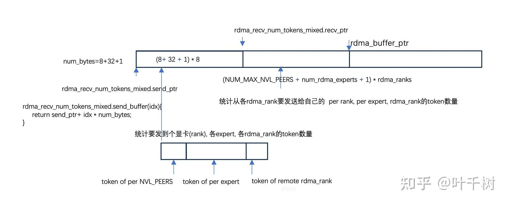

图6 用于统计rdma收发信息的对称缓存

该symBuffer如图6所示，rdma\_recv\_num\_tokens\_mixed.send\_ptr用于统计自己会往远端rdma节点发送token的统计信息（发送给远端rdma节点对应的8个nvl\_peer, 32个expert, 一个rdma累计）。 rdma\_recv\_num\_tokens\_mixed.recv\_ptr用于接受从别的rdma节点发送过来的token统计信息（远端节点会发送过来的本rdma节点的8个nvl\_peer, 32个expert, 一个rdma累计）。

在line 242 ~ 248 就是统计send\_ptr的信息(64个rank, 256个expert, 8个rdma\_rank)

```text
for (int i = thread_id; i < num_ranks; i += num_threads) #line 242 ， num_ranks=64
    rdma_recv_num_tokens_mixed.send_buffer(i / NUM_MAX_NVL_PEERS)[i % NUM_MAX_NVL_PEERS] = num_tokens_per_rank[i];
    // i / NUM_MAX_NVL_PEERS 对应的rdma_rank, i % NUM_MAX_NVL_PEERS对应的nvl_rank
#pragma unroll
for (int i = thread_id; i < num_experts; i += num_threads) // num_experts = 256
    rdma_recv_num_tokens_mixed.send_buffer(i / num_rdma_experts)[NUM_MAX_NVL_PEERS + i % num_rdma_experts] = num_tokens_per_expert[i];

if (thread_id < kNumRDMARanks) // kNumRDMARanks=8
    rdma_recv_num_tokens_mixed.send_buffer(thread_id)[NUM_MAX_NVL_PEERS + num_rdma_experts] = num_tokens_per_rdma_rank[thread_id];
```

在line 254 ~ 255 将本节点的信息发送到远端rdma 0 ~ 7

```text
if (thread_id < kNumRDMARanks) { #line 254 thread 0 - 7
            nvshmem_int_put_nbi(rdma_recv_num_tokens_mixed.recv_buffer(rdma_rank), rdma_recv_num_tokens_mixed.send_buffer(thread_id),
                                NUM_MAX_NVL_PEERS + num_rdma_experts + 1,
                                translate_dst_rdma_rank<kLowLatencyMode>(thread_id, nvl_rank));
}
```

值得注意的是nvshmem\_int\_put\_nbi的接受方是由 translate\_dst\_rdma\_rank<kLowLatencyMode>(thread\_id, nvl\_rank)参数值决定，在非低延迟下，该值为thread\_id, 也就是远端的 0-7 （包括自己）

而后在 line 261通过 nvshmem\_barrier 等待nvshmem通信完成

```text
if (thread_id == 0)
    nvshmem_barrier_with_same_gpu_idx<kLowLatencyMode>(rdma_team); #line 261
__syncthreads();
```

  

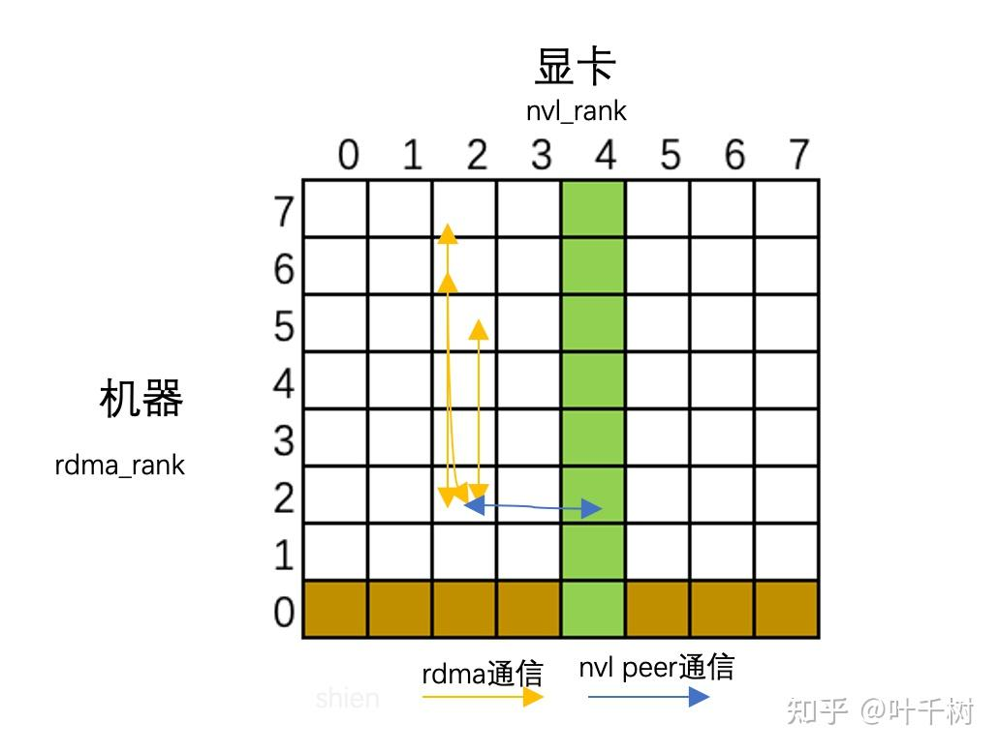

图7 双向rdma通信和nvl通信

如图7所示， 在rdma组通信中，每个rank只收到了同rdma\_team的8个节点信息，剩余56个节点信息，则是通过ipc操作从同rdma\_rank上的节点上获取。 而且所有的通信都是双向的，通过这种形式，一个节点借此获取全局发送给自己token相关数据。

在line265 - 271构建了用于nvl 通信的数据结构， 数据结构如图8所示。

```text
// NVL buffers
// thread_id 0-7 对应本rdma_rank上的8个nvl_rank
auto nvl_send_buffer = thread_id < NUM_MAX_NVL_PEERS ? buffer_ptrs[thread_id] : nullptr; #line 265
// 当前节点上的nvl 缓存
auto nvl_recv_buffer = buffer_ptrs[nvl_rank];
auto nvl_reduced_num_tokens_per_expert = Buffer<int>(nvl_recv_buffer, num_rdma_experts).advance_also(nvl_send_buffer);
auto nvl_send_num_tokens_per_rank = AsymBuffer<int>(nvl_send_buffer, kNumRDMARanks, NUM_MAX_NVL_PEERS);
auto nvl_send_num_tokens_per_expert = AsymBuffer<int>(nvl_send_buffer, num_nvl_experts, NUM_MAX_NVL_PEERS);
auto nvl_recv_num_tokens_per_rank = AsymBuffer<int>(nvl_recv_buffer, kNumRDMARanks, NUM_MAX_NVL_PEERS);
auto nvl_recv_num_tokens_per_expert = AsymBuffer<int>(nvl_recv_buffer, num_nvl_experts, NUM_MAX_NVL_PEERS);
```

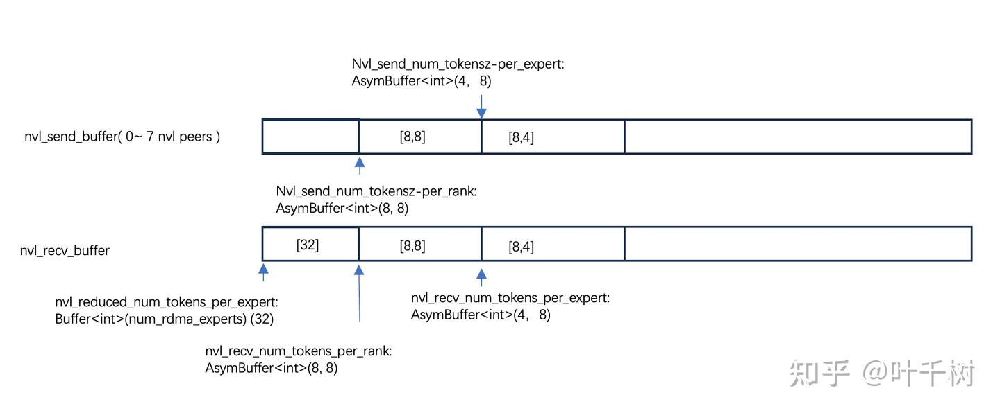

图8 用于nvl通信的数据结构

  

在line 284 - 290, 统计本rank节点中要发送给本节点rdma\_rank 32 个expert的数据。

```text
if (thread_id < num_rdma_experts) { # line 284, thread id 0-31
    int sum = 0;
    #pragma unroll
    for (int i = 0; i < kNumRDMARanks; ++ i)
        sum += rdma_recv_num_tokens_mixed.recv_buffer(i)[NUM_MAX_NVL_PEERS + thread_id];
    nvl_reduced_num_tokens_per_expert[thread_id] = sum; //本节点发送给对应expert的数据量
} 
```

在line294 - 303中，统计累加各rdma发送到本rdma\_rank的数据量， 存储在recv\_rdma\_rank\_prefix\_sum中（(int)\[8\]）, 总量写入moe\_recv\_rdma\_counter\_mapped （mapped memory, cpu/gpu代码都可以访问）

```text
if (thread_id == 0) { #line 294
    int sum = 0;
    #pragma unroll
    for (int i = 0; i < kNumRDMARanks; ++ i) {
        sum += rdma_recv_num_tokens_mixed.recv_buffer(i)[NUM_MAX_NVL_PEERS + num_rdma_experts];
        recv_rdma_rank_prefix_sum[i] = sum;
    }
    while (ld_volatile_global(moe_recv_rdma_counter_mapped) != -1);
    *moe_recv_rdma_counter_mapped = sum;
}
```

在line 307 - 314 中， 通过ipc，写入 nvl\_send\_num\_tokens\_per\_rank 从nvl\_rank(本节点) 所对应的rdma\_rank 要发送到目标rank节点上的token数, 写入 nvl\_send\_num\_tokens\_per\_expert从nvl\_rank(本节点）所对应的rdma\_rank 要发送到目标rank节点expert的token数。

```text
if (thread_id < NUM_MAX_NVL_PEERS) { #line 307 thread 0 - 7
    #pragma unroll
    for (int i = 0; i < kNumRDMARanks; ++ i)
        nvl_send_num_tokens_per_rank.buffer(nvl_rank)[i] = rdma_recv_num_tokens_mixed.recv_buffer(i)[thread_id];
        // ipc通信， 从nvl_rank(本节点) 所对应的rdma_rank 要发送到目标rank节点上的token数
    #pragma unroll
    for (int i = 0; i < num_nvl_experts; ++ i)  
        nvl_send_num_tokens_per_expert.buffer(nvl_rank)[i] = nvl_reduced_num_tokens_per_expert[thread_id * num_nvl_experts + i];
       // ipc通信， 从nvl_rank(本节点）所对应的rdma_rank 要发送到目标rank节点expert的token数
}
```

同时需要注意，在写nvl\_send\_num\_tokens\_per\_rank， nvl\_send\_num\_tokens\_per\_expert， 对应的本节点的 nvl\_recv\_num\_tokens\_per\_rank， nvl\_recv\_num\_tokens\_per\_expert也被更新。再通过同步机制使得 nvl\_recv\_num\_tokens\_per\_rank， nvl\_recv\_num\_tokens\_per\_expert更新可见。

在line 323 - 332 汇总统计world rank 发送给自己节点的token数，并将总量存入到moe\_recv\_counter\_mapped（供后续 recv\_x分配内存）

```text
if (thread_id == 0) {
    int sum = 0;
    #pragma unroll
    for (int i = 0; i < num_ranks; ++ i) { #num_ranks = 64
        int src_rdma_rank = i / NUM_MAX_NVL_PEERS, src_nvl_rank = i % NUM_MAX_NVL_PEERS;
        sum += nvl_recv_num_tokens_per_rank.buffer(src_nvl_rank)[src_rdma_rank];
        recv_gbl_rank_prefix_sum[i] = sum; //各rank的累加值
    }
    while (ld_volatile_global(moe_recv_counter_mapped) != -1);
    *moe_recv_counter_mapped = sum; //最终累加值存入到moe_recv_counter_mapped， 可在cpu代码读取
}
```

在line 334-342 统计发送到各expert的数据量

```text
if (thread_id < num_nvl_experts) {  #num_nvl_experts = 4
    int sum = 0;
    #pragma unroll
    for (int i = 0; i < NUM_MAX_NVL_PEERS; ++ i)
        sum += nvl_recv_num_tokens_per_expert.buffer(i)[thread_id]; 
    sum = (sum + expert_alignment - 1) / expert_alignment * expert_alignment;
    while (ld_volatile_global(moe_recv_expert_counter_mapped + thread_id) != -1);
    moe_recv_expert_counter_mapped[thread_id] = sum; 
    //总值存入到moe_recv_expert_counter_mapped， moe_recv_expert_counter_mapped可以被cpu读取
}
```

至此， sm0的主要通信/信息统计工作完成，会有一些收尾的同步工作。

接着分析sm1-sm8的相关工作

### SM 1-8 计算节点各通道发送token数据到各rank和rdma组的情况

在notify\_dispatch中启用了9个 SM block计算, SM 0用rdma通信和ipc通信来统计要接受和发送的信息。sm 1- 8则统计channel（通道）粒度的内容。

在internode\_dispatch使用20个SM， 分成10个channel。 此时将待发送tokens顺序切分成10份，计算每份（通道）发送到远端rank, rdma\_rank的token数量。

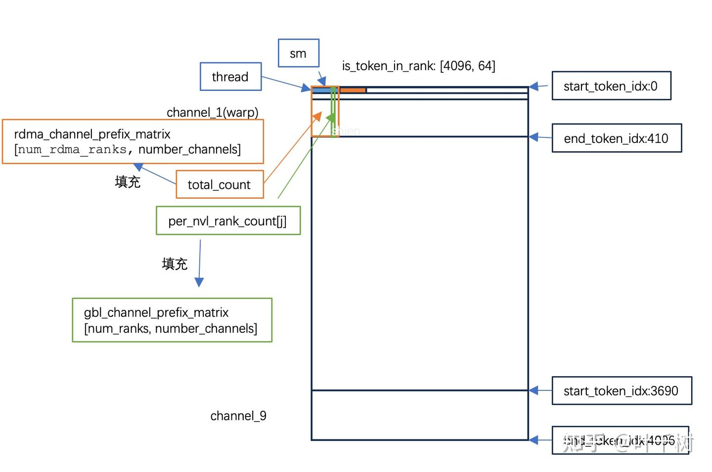

图9 统计通道发送到远端rank/rdma\_rank的token数量

图9描述了统计通道发送信息的逻辑。 使用8个sm block，每个sm block使用8个warp, 256个线程, 统计10个通道的发送信息，最终填充到rdma\_channel\_prefix\_matrix， gbl\_channel\_prefix\_matrix两个矩阵中。

line 352做了简单处理，将sm\_id从1-8映射到0-7

```text
int dst_rdma_rank = sm_id - 1;  //line 352
```

line 353 - 382 是将token切分成10个通道，每个通道统计发送到远端rank和rdma\_rank的数据量， 为了简洁性，做了代码缩减, 代码逻辑参见注释。

```text
for (int channel_id = warp_id; channel_id < num_channels; channel_id += num_warps) { # line 353
    //每个warp处理一个channel
    ...
    get_channel_task_range(num_tokens, num_channels, channel_id, token_start_idx, token_end_idx);
    //获取到当前warp需要处理token的[起始地址, 结束地址)

    // Iterate over tokens
    int total_count = 0, per_nvl_rank_count[NUM_MAX_NVL_PEERS] = {0};
    for (int64_t i = token_start_idx + lane_id; i < token_end_idx; i += 32) {
        //每个线程处理一个token, 
        EP_STATIC_ASSERT(NUM_MAX_NVL_PEERS * sizeof(bool) == sizeof(uint64_t), "Invalid number of NVL peers");
        auto is_token_in_rank_uint64 = *reinterpret_cast<const uint64_t*>(is_token_in_rank + i * num_ranks + dst_rdma_rank * NUM_MAX_NVL_PEERS);
        //每个sm处理一个rdma_rank
        auto is_token_in_rank_values = reinterpret_cast<const bool*>(&is_token_in_rank_uint64);
        #pragma unroll
        for (int j = 0; j < NUM_MAX_NVL_PEERS; ++ j)
            per_nvl_rank_count[j] += is_token_in_rank_values[j];
        total_count += (is_token_in_rank_uint64 != 0);
        //获取当前线程处理的发送到rank, 和rdma_rank的信息
    }

    // Warp reduce
    total_count = warp_reduce_sum(total_count);
    // warp/channel 数据汇总发到rdma_rank的信息
    #pragma unroll
    for (int i = 0; i < NUM_MAX_NVL_PEERS; ++ i)
        per_nvl_rank_count[i] = warp_reduce_sum(per_nvl_rank_count[i]);
    // warp/channel 数据汇总发到rank的信息

    // Write into channel matrix
    if (lane_id == 0) {
        #pragma unroll
        for (int i = 0; i < NUM_MAX_NVL_PEERS; ++ i)
            gbl_channel_prefix_matrix[(dst_rdma_rank * NUM_MAX_NVL_PEERS + i) * num_channels + channel_id] = per_nvl_rank_count[i];
        rdma_channel_prefix_matrix[dst_rdma_rank * num_channels + channel_id] = total_count;
    }
}
```

rdma\_channel\_prefix\_matrix矩阵大小\[8, 10\], gbl\_channel\_prefix\_matrix矩阵大小是\[64, 10\]

line 387 - 400 是rdma\_channel\_prefix\_matrix和gbl\_channel\_prefix\_matrix按channel维度累加的数据，代表了channel信息在远端的结束地址。

```text
if (thread_id == 0) { #line387, 这行代码早期是有问题的，后面在repo中被修正了
    //rdma_channel_prefix_matrix[8,10], 每个sm处理一行
    auto prefix_row = rdma_channel_prefix_matrix + dst_rdma_rank * num_channels;
    #pragma unroll
    for (int i = 1; i < num_channels; ++ i)
        prefix_row[i] += prefix_row[i - 1];
}

EP_STATIC_ASSERT(NUM_MAX_NVL_PEERS <= 32, "Invalid number of NVL peers");
if (thread_id < NUM_MAX_NVL_PEERS) {
    //gbl_channel_prefix_matrix[64, 10], 8个sm, 每个sm处理8行，每个thread处理一行
    auto prefix_row = gbl_channel_prefix_matrix + (dst_rdma_rank * NUM_MAX_NVL_PEERS + thread_id) * num_channels;
    #pragma unroll
    for (int i = 1; i < num_channels; ++ i)
        prefix_row[i] += prefix_row[i - 1];
}
```

到此， notify\_dispatch的工作完成， 在host cpu侧代码会基于 mapping内存moe\_recv\_counter得到节点接受的token数量，然后基于这个token数量分配recv\_x的内存, 而后开始internode\_dispatch工作。 从上面代码逻辑来看， notify就是在登记各种token的发送/接受信息， 是一个比较轻量级的任务。

## dispatch

在 csrc/kernels/internode.cu line 457 dispatch函数进入到对应的gpu代码。需要注意的是dispatch 函数使用了 \_\_launch\_bounds\_\_(16 \* 32, 1)修饰

```text
__global__ void __launch_bounds__(((kNumDispatchRDMASenderWarps + 1 + NUM_MAX_NVL_PEERS) * 32), 1)
dispatch(...)
```

\_\_launch\_bounds\_\_第一个参数16\* 32 是说对应的kernel启动时，线程数不超过该值， 也就是16个warp, 512个线程。

\_\_launch\_bounds\_\_第二个参数是对应的sm上启动的block数最少是多少个。一般而已，一个物理的sm上会留存多个软件抽象block。 通过\_\_launch\_bounds\_\_这个属性达到在一个物理sm留存一个软件block的目的。

在加上在lauch kernel的时候，使用了20个block,从而达到分配20个物理sm用于通信的目的。

line 1066 启动时block=20, threads=512

```text
SETUP_LAUNCH_CONFIG(num_channels * 2, (kNumDispatchRDMASenderWarps + 1 + NUM_MAX_NVL_PEERS) * 32, stream); 
```

在line 457 - 467 对应的参数含义如下

```text
dispatch(
   int4* recv_x,  // [m, 7168]，用于接受发送到本节点的token, 给后续的expert层计算, m来自由notify_dispatch moe_recv_counter
   float* recv_x_scales,  // [m,56]
   int64_t* recv_topk_idx, // [m,8]
   float* recv_topk_weights, // [m, 8]
   SourceMeta* recv_src_meta, //[m, 8] （8byte, 2int, src_rdma_rank, is_token_in_nvl_rank_bits）
   const int4* x, // [4096, 7168], 用于本节点发送出去的token
   const float* x_scales, //[4096,56]
   const int64_t* topk_idx, //[4096, 8]
   const float* topk_weights, //[4096,8 ]
   int* send_rdma_head, //[m, 8]
   int* send_nvl_head,  //[m, 8]
   int* recv_rdma_channel_prefix_matrix, //[8, 10] 远端rdma_rank发送给自己的信息
   int* recv_gbl_channel_prefix_matrix, //[64, 10], 远端rank各通道发送给自己的信息
   const int* rdma_channel_prefix_matrix, //[8, 10] 通道发送给rdma的累加信息
   const int* recv_rdma_rank_prefix_sum, //[8] 远端 rdma发送给自己的累加信息
   const int* gbl_channel_prefix_matrix,  //[64, 10] 通道发送给rank的累加信息
   const int* recv_gbl_rank_prefix_sum, //[64], 远端rank发送给自己的累加信息
   int num_tokens, // 4096
   int hidden_int4, // 448
   int num_scales, // 56
   int num_topk, // 8
   int num_experts, // 256
   const bool* is_token_in_rank, //[4096, 64]
   void* rdma_buffer_ptr, //用于rdma通信的缓存 1e9 byte
   int num_max_rdma_chunked_send_tokens, //28
   int num_max_rdma_chunked_recv_tokens, //140
   void** buffer_ptrs, // 用于ipc通信的缓存 1e9 byte
   int num_max_nvl_chunked_send_tokens, //20
   int num_max_nvl_chunked_recv_tokens, //288
   int rank, //节点号
   int num_ranks //64
)
```

在dispatch中一些kernal相关的参数为

```text
num_threads=512
num_warps=16
num_channels=10
```

  

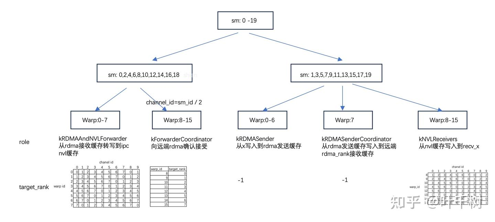

图10 sm/warp功能划分

在20个sm/block中，按照sm\_id, channel\_id,warp\_id做了功能切分，用于填充rdma发送缓存, 发送到远端rdma, 转发rdma接受缓存到nvl缓存，使用nvl缓存填充recv\_x, 如图10所示。

一个token需要传输的字节数为7472

```text
token: 7168
scale: 7168 / 128 * 4 = 224
topk_idx: 8 * 4 = 32
topk_weight: 8 * 4 = 32
元信息sourceMeta: 8
对齐16byte后为 7472 byte
```

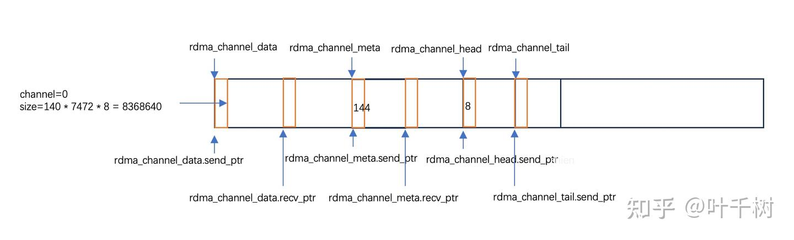

图11 构建rdma数据结构

line 508-512 构建了rdma的数据结构，用来后续的rdma写入和通信

```text
auto rdma_channel_data = SymBuffer<int8_t>(rdma_buffer_ptr, num_max_rdma_chunked_recv_tokens * num_bytes_per_rdma_token, kNumRDMARanks, channel_id, num_channels);
auto rdma_channel_meta = SymBuffer<int>(rdma_buffer_ptr, NUM_MAX_NVL_PEERS * 2 + 2, kNumRDMARanks, channel_id, num_channels);
auto rdma_channel_head = SymBuffer<uint64_t, false>(rdma_buffer_ptr, 1, kNumRDMARanks, channel_id, num_channels);
auto rdma_channel_tail = SymBuffer<uint64_t, false>(rdma_buffer_ptr, 1, kNumRDMARanks, channel_id, num_channels);
```

在line 516-521 基于wapr的角色（参考图10）是kRDMAAndNVLForwarder（从rdma接受缓存写入到nvl缓存）， kNVLReceivers（从nvl缓存写入到recv\_x中）决定 rs\_wr\_buffer\_ptr 以及 ws\_rr\_buffer\_ptr指向的是自己节点的缓存还是ipc的缓存。

```text
 void *rs_wr_buffer_ptr = nullptr, *ws_rr_buffer_ptr = nullptr;
 int rs_wr_rank = 0, ws_rr_rank = 0;
 if (warp_role == WarpRole::kRDMAAndNVLForwarder)
     rs_wr_buffer_ptr = buffer_ptrs[nvl_rank], ws_rr_buffer_ptr = buffer_ptrs[target_rank], rs_wr_rank = nvl_rank, ws_rr_rank = target_rank;
 if (warp_role == WarpRole::kNVLReceivers)
     rs_wr_buffer_ptr = buffer_ptrs[target_rank], ws_rr_buffer_ptr = buffer_ptrs[nvl_rank], rs_wr_rank = target_rank, ws_rr_rank = nvl_rank;
```

在line523-532 分配了缓存的数据结构供后续缓存操作代码使用

```text
// Allocate buffers
auto nvl_channel_x = AsymBuffer<int4>(ws_rr_buffer_ptr, num_max_nvl_chunked_recv_tokens * hidden_int4, NUM_MAX_NVL_PEERS, channel_id, num_channels, rs_wr_rank).advance_also(rs_wr_buffer_ptr);
auto nvl_channel_src_meta = AsymBuffer<SourceMeta>(ws_rr_buffer_ptr, num_max_nvl_chunked_recv_tokens, NUM_MAX_NVL_PEERS, channel_id, num_channels, rs_wr_rank).advance_also(rs_wr_buffer_ptr);
auto nvl_channel_x_scales = AsymBuffer<float>(ws_rr_buffer_ptr, num_max_nvl_chunked_recv_tokens * num_scales, NUM_MAX_NVL_PEERS, channel_id, num_channels, rs_wr_rank).advance_also(rs_wr_buffer_ptr);
auto nvl_channel_topk_idx = AsymBuffer<int>(ws_rr_buffer_ptr, num_max_nvl_chunked_recv_tokens * num_topk, NUM_MAX_NVL_PEERS, channel_id, num_channels, rs_wr_rank).advance_also(rs_wr_buffer_ptr);
auto nvl_channel_topk_weights = AsymBuffer<float>(ws_rr_buffer_ptr, num_max_nvl_chunked_recv_tokens * num_topk, NUM_MAX_NVL_PEERS, channel_id, num_channels, rs_wr_rank).advance_also(rs_wr_buffer_ptr);
auto nvl_channel_prefix_start = AsymBuffer<int>(ws_rr_buffer_ptr, kNumRDMARanks, NUM_MAX_NVL_PEERS, channel_id, num_channels, rs_wr_rank).advance_also(rs_wr_buffer_ptr);
auto nvl_channel_prefix_end = AsymBuffer<int>(ws_rr_buffer_ptr, kNumRDMARanks, NUM_MAX_NVL_PEERS, channel_id, num_channels, rs_wr_rank).advance_also(rs_wr_buffer_ptr);
auto nvl_channel_head = AsymBuffer<int>(rs_wr_buffer_ptr, 1, NUM_MAX_NVL_PEERS, channel_id, num_channels, ws_rr_rank).advance_also(ws_rr_buffer_ptr);
auto nvl_channel_tail = AsymBuffer<int>(ws_rr_buffer_ptr, 1, NUM_MAX_NVL_PEERS, channel_id, num_channels, rs_wr_rank).advance_also(rs_wr_buffer_ptr);
```

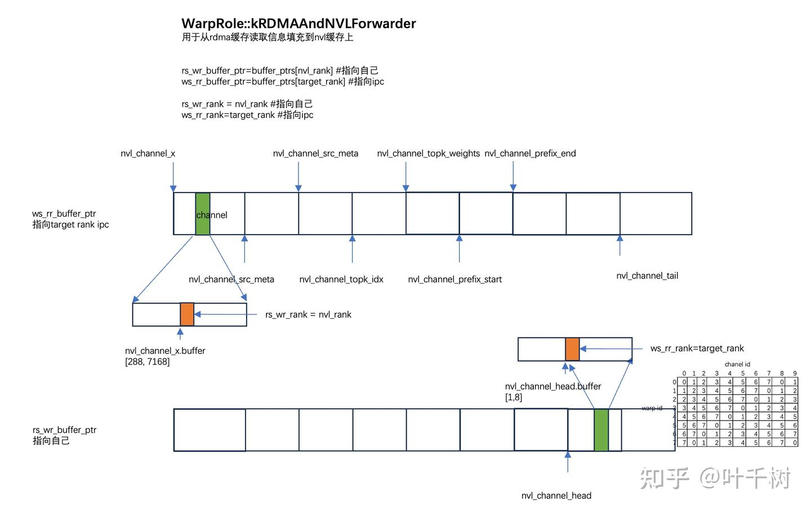

图12 kRDMAAndNVLForwarder的nvl缓存数据结构

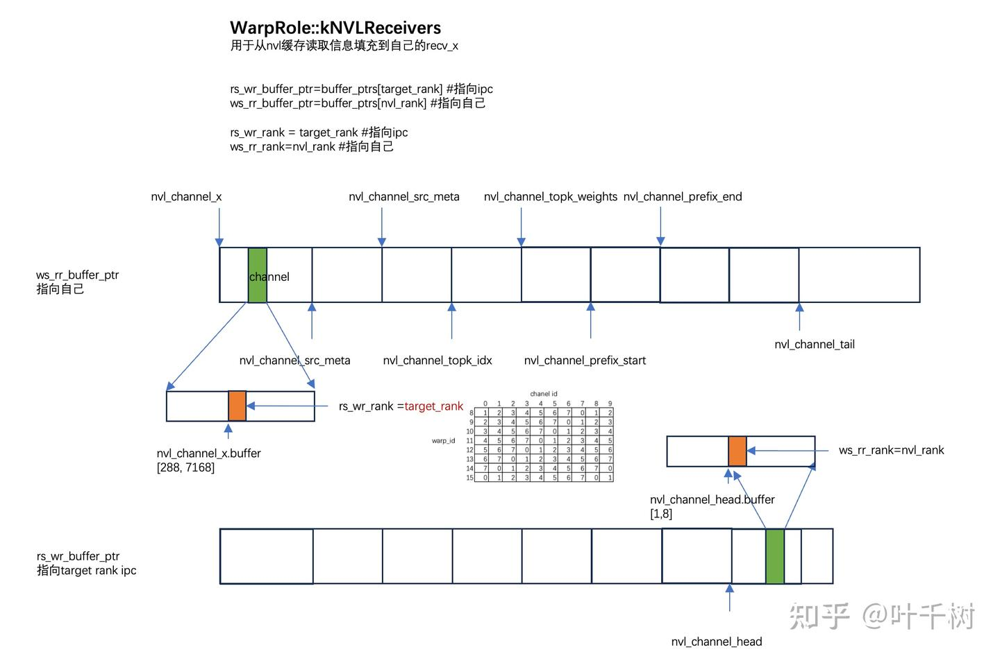

图13 kNVLReceivers的nvl缓存数据结构

如图12和图13所示，操作待后续对照代码解释。

### kRDMASender， 填充rdma发送缓存

在line 547- 548， 主要是获取当前通道（sm）要处理的数据的起始地址和结束地址

```text
int token_start_idx, token_end_idx; #line547
get_channel_task_range(num_tokens, num_channels, channel_id, token_start_idx, token_end_idx);
```

line 552-554, 是共享变量初始化用于后续数据填充，只用了warp 0 来操作。

```text
(warp_id == 0 and lane_id == 0) ? (rdma_send_next_token_idx = token_start_idx) : 0;
//rdma_send_channel_tail[7]
(warp_id == 0 and lane_id < kNumRDMARanks) ? (rdma_send_channel_tail[lane_id] = 0) : 0;
//rdma_send_channel_next_tail[7]
(warp_id == 0 and lane_id < kNumRDMARanks) ? (rdma_send_channel_next_tail[lane_id] = 0) : 0;
```

在line 558 - 567中， 用于填充rdma\_channel\_meta.send\_buffer本节点发送到远端rank, rdma\_rank的起始index和结束index。

```text
for (int dst_rdma_rank = warp_id; dst_rdma_rank < kNumRDMARanks; dst_rdma_rank += kNumDispatchRDMASenderWarps) {
   if (lane_id < NUM_MAX_NVL_PEERS) {
       rdma_channel_meta.send_buffer(dst_rdma_rank)[lane_id] = -(channel_id == 0 ? 0 : gbl_channel_prefix_matrix[(dst_rdma_rank * NUM_MAX_NVL_PEERS + lane_id) * num_channels + channel_id - 1]) - 1;
   } else if (lane_id < NUM_MAX_NVL_PEERS * 2) {
       rdma_channel_meta.send_buffer(dst_rdma_rank)[lane_id] = -gbl_channel_prefix_matrix[(dst_rdma_rank * NUM_MAX_NVL_PEERS + lane_id - NUM_MAX_NVL_PEERS) * num_channels + channel_id] - 1;
   } else if (lane_id == NUM_MAX_NVL_PEERS * 2) {
       rdma_channel_meta.send_buffer(dst_rdma_rank)[lane_id] = -(channel_id == 0 ? 0 : rdma_channel_prefix_matrix[dst_rdma_rank * num_channels + channel_id - 1]) - 1;
   } else if (lane_id == NUM_MAX_NVL_PEERS * 2 + 1) {
       rdma_channel_meta.send_buffer(dst_rdma_rank)[lane_id] = -rdma_channel_prefix_matrix[dst_rdma_rank * num_channels + channel_id] - 1;
   }
...
}
```

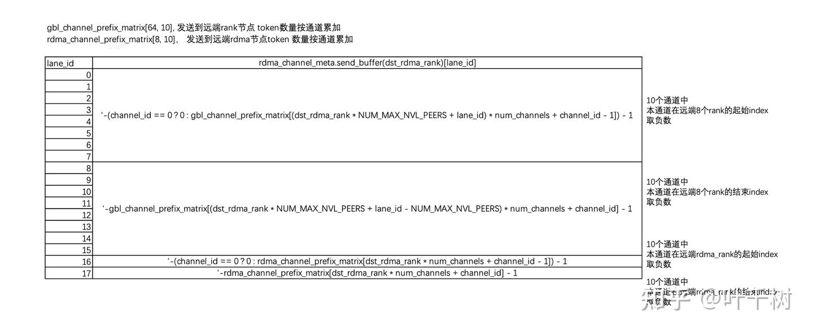

图14 rdma\_channel\_meta.send\_buffer数据含义

rdma\_channel\_meta.send\_buffer的含义如图所示，一共有8个warp, 每个warp处理一个远端rdma\_rank, 8个远端rank。 分别对应当前通道在远端rank/rdma\_rank的起始地址和结束地址。

line 568 通过nvshmem发送send\_buffer到远端rdma\_rank节点

```text
nvshmemx_int_put_nbi_warp(rdma_channel_meta.recv_buffer(rdma_rank), #远端rdma_rank接受
rdma_channel_meta.send_buffer(dst_rdma_rank), #当前节点发送
NUM_MAX_NVL_PEERS * 2 + 2, # 发送字节数                                     
translate_dst_rdma_rank<kLowLatencyMode>(dst_rdma_rank, nvl_rank)); #远端rdma_rank值
```

nvshmemx\_int\_put\_nbi\_warp是一个warp级别函数，需要当前warp全部线程参与

line 572 用于同步 kRDMASender和kRDMASenderCoordinator

```text
sync_rdma_sender_smem();# 需要8个warp 256个线程都参与后开始下一步
```

line 577设定填充的send buffer, 如果是给节点本身，则直接设置recv\_buffer为send\_buffer

```text
auto send_buffer = lane_id == rdma_rank ? rdma_channel_data.recv_buffer(lane_id) : rdma_channel_data.send_buffer(lane_id);
```

在line 508-604是逐条处理要发送的token, 填充到rdma的发送缓存，**使用自旋锁来同步warp直间的顺序操作**

```text
for (token_idx = token_start_idx + warp_id; token_idx < token_end_idx; token_idx += kNumDispatchRDMASenderWarps) {
   // 依序每个warp处理一条数据
   // Read RDMA rank existence
   uint64_t is_token_in_rank_uint64 = 0;
   if (lane_id < kNumRDMARanks)
       is_token_in_rank_uint64 = *reinterpret_cast<const uint64_t*>(is_token_in_rank + token_idx * num_ranks + lane_id * NUM_MAX_NVL_PEERS);

   // Acquire sequential lock
   while (lane_id == 0 and rdma_send_next_token_idx != token_idx); // line 585
   //获得处理数据的自旋锁，获得锁后才会处理一些数据信息
   __syncwarp(); // warp同步
...
   // Release sequential lock
   lane_id == 0 ? (rdma_send_next_token_idx += 1) : 0;
   //释放锁，下一个warp马上获得line 585的锁
   //开始搬移x数据到rdma的发送缓存
...
}
```

在这一步，rdma\_send\_next\_token\_idx是一个shared（共享） 变量，被初始化成了token\_start\_idx， for循环是warp依次处理一个token, 首先通过 rdma\_send\_next\_token\_idx == token\_idx 来获得锁，不然就一直等待。 获得锁后可以处理登记处理其他共享变量， 处理完后通过rdma\_send\_next\_token\_idx += 1释放下一个warp处理，然后当前warp才真正开始处理数据的搬移工作。

在获得锁期间，**当前warp还和远端的rdma\_rank节点kForwarderCoordinator做了一次同步**。

在line 588 - 595 是

```text
// Acquire next tail
int rdma_tail_idx = -1;
if (is_token_in_rank_uint64 != 0) {
    rdma_tail_idx = rdma_send_channel_next_tail[lane_id] ++;
    while (rdma_tail_idx - cached_rdma_channel_head >= num_max_rdma_chunked_recv_tokens)
        cached_rdma_channel_head = static_cast<int>(ld_volatile_global(rdma_channel_head.buffer(lane_id)));
}
__syncwarp();
```

ld\_volatile\_global(rdma\_channel\_head.buffer(lane\_id)) 对应的ptx指令为 ld.volatile.global.s32，是从全局显存直接读取，

这个值是在 kForwarderCoordinator代码 line929 - 931 通过rdma消息更改，kForwarderCoordinator在kRDMAAndNVLForwarder消费rdma接受缓存后通知远端rdma发送方。

```text
if (min_head != std::numeric_limits<int>::max() and min_head > last_head and lane_id < kNumRDMARanks)
    nvshmem_uint64_p(rdma_channel_head.buffer(rdma_rank), last_head = min_head,
        translate_dst_rdma_rank<kLowLatencyMode>(lane_id, nvl_rank));
```

这个同步没有使用nvshmem同步机制，而是使用类似自旋锁的机制， 通过禁用缓存ld.volatile.global.s32读取全局显存来更新。这个同步机制控制了填充速度。

cached\_rdma\_channel\_head是一个寄存器变量，只有当 rdma\_tail\_idx - cached\_rdma\_channel\_head>= num\_max\_rdma\_chunked\_recv\_tokens（num\_max\_rdma\_chunked\_recv\_tokens是最大接受缓存，值为140）时才需要更新读取显存，不需要频繁读取。

同时 rdma\_send\_channel\_next\_tail是长度为8的数组，对应了8个远端的rdma\_rank，只有当前token需要发送给远端rdma\_rank时才会进入该逻辑，也就是只有线程0-7会进入到这段代码逻辑。

如果当前token要发送给lane\_id代表的远端rdma\_rank节点， 则rdma\_send\_channel\_next\_tail\[lane\_id\] 自增1. rdma\_tail\_idx还是rdma\_send\_channel\_next\_tail\[lane\_id\] 自增之前的值，会被用作后续rdma send 的index,也就是在rdma send预留了一个位置用于当前token的填充。

在line 602-604还有一个同步， **用于kRDMASender和kRDMASenderCoordinator内存同步**

```text
// Update last token tail
if (last_rdma_tail_idx >= 0)
    st_release_cta(const_cast<const int *>(rdma_send_channel_tail + lane_id), last_rdma_tail_idx + 1);
last_rdma_tail_idx = rdma_tail_idx;
```

st\_release\_cta对应的ptx指令为st.release.cta.s32，将本次操作操作级之前的内存操作可以被sm内的其他warp可见，通过这个操作，kRDMASenderCoordinator可以看到之前填充的信息。

因为线程0-7所获取到的rdma\_tail\_idx有差异（有些有需要发，有些不需要发），在后续从x复制数据到rdma send时候是整个warp参与，因此需要一种将0-7rdma\_tail\_idx同步到整个warp的逻辑。line610 - 622 实现将rdma\_tail\_idx转换成slot idx并且同步到整个warp的逻辑。

```text
SourceMeta src_meta;
int num_topk_ranks = 0, topk_ranks[kNumTopkRDMARanks];
void* dst_send_buffers[kNumTopkRDMARanks];
for (int i = 0, slot_idx; i < kNumRDMARanks; ++ i) if ((slot_idx = __shfl_sync(0xffffffff, rdma_tail_idx, i)) >= 0) {
    //warp 所有线程参与，rdma_tail_idx默认为-1， 只有对应rdma rank需要发送时， rdma_tail_idx才会>=0
    slot_idx = slot_idx % num_max_rdma_chunked_recv_tokens;
    //循环buff
    topk_ranks[num_topk_ranks] = i;
    auto recv_is_token_in_rank_uint64 = broadcast(is_token_in_rank_uint64, i);
    auto recv_is_token_in_rank_values = reinterpret_cast<const bool*>(&recv_is_token_in_rank_uint64);
    if (lane_id == num_topk_ranks)
        src_meta = SourceMeta(rdma_rank, recv_is_token_in_rank_values);
    dst_send_buffers[num_topk_ranks ++] = reinterpret_cast<uint8_t*>(broadcast(send_buffer, i)) + slot_idx * num_bytes_per_rdma_token;
    //获取到发送地址， num_topk_ranks-1 是需要发送的ranks数

}
```

在line 626 - 663开始填充token及相关元素。 line626-line 631 填充x到rdma

```text
auto st_broadcast = [=](const int key, const int4& value) {
#pragma unroll
for (int j = 0; j < num_topk_ranks; ++ j)
  st_na_global(reinterpret_cast<int4*>(dst_send_buffers[j]) + key, value);
};
UNROLLED_WARP_COPY(5, lane_id, hidden_int4, 0, x + token_idx * hidden_int4, ld_nc_global, st_broadcast);
```

ld\_nc\_global对应的ptx指令为 ld.global.nc.L1::no\_allocate.L2::256B， st\_broadcast对应的ptx指令为 st.global.L1::no\_allocate，这两个指令主要是为了减少L1, L2的使用。代码主要是从显存（x）直接穿透到寄存器，然后由寄存器直接写入到rdma send缓存。此外warp所有线程会参与进来，每次读写16个byte来提升复制效率

line633-653 是更新写入指针，写入meta, x\_scale, topk\_idx, topk\_weight，参见中文注释

```text
for (int i = 0; i < num_topk_ranks; ++ i) // line633
    dst_send_buffers[i] = reinterpret_cast<int4*>(dst_send_buffers[i]) + hidden_int4;//更新写入指针


// Copy source metadata into symmetric send buffer
if (lane_id < num_topk_ranks)
    st_na_global(reinterpret_cast<SourceMeta*>(dst_send_buffers[lane_id]), src_meta);//写入meta

#pragma unroll
for (int i = 0; i < num_topk_ranks; ++ i)
    dst_send_buffers[i] = reinterpret_cast<SourceMeta*>(dst_send_buffers[i]) + 1; //更新写入指针

// Copy `x_scales` into symmetric send buffer
#pragma unroll
for (int i = lane_id; i < num_scales; i += 32) {
    auto value = ld_nc_global(x_scales + token_idx * num_scales + i);
    #pragma unroll
    for (int j = 0; j < num_topk_ranks; ++ j)
        st_na_global(reinterpret_cast<float*>(dst_send_buffers[j]) + i, value); //写入x_scale
}
#pragma unroll
for (int i = 0; i < num_topk_ranks; ++ i)
    dst_send_buffers[i] = reinterpret_cast<float*>(dst_send_buffers[i]) + num_scales; //更新写入指针

// Copy `topk_idx` and `topk_weights` into symmetric send buffer
#pragma unroll
for (int i = lane_id; i < num_topk * num_topk_ranks; i += 32) { //写入topk_idx, topk_weight
    auto rank_idx = i / num_topk, copy_idx = i % num_topk;
    auto idx_value = static_cast<int>(ld_nc_global(topk_idx + token_idx * num_topk + copy_idx));
    auto weight_value = ld_nc_global(topk_weights + token_idx * num_topk + copy_idx);
    st_na_global(reinterpret_cast<int*>(dst_send_buffers[rank_idx]) + copy_idx, idx_value);
    st_na_global(reinterpret_cast<float*>(dst_send_buffers[rank_idx]) + num_topk + copy_idx, weight_value);
}
```

至此， kRDMASender主要工作完成。**kRDMASender主要目的是将发送信息x， x\_scale，source\_meta, topk\_idx, topk\_weight等信息填充进入rdma发送缓存，期间要同步warp直接对token的依序操作，以及和kForwarderCoordinator, kRDMASenderCoordinator内存同步。同时在复制操作时， 使用ld.global.nc.L1::no\_allocate.L2::256B， st.global.L1::no\_allocate减少L1/L2缓存使用。**

### kRDMASenderCoordinator， 发送rdma信息

kRDMASenderCoordinator主要工作是通过nvshmem将kRDMASender在rdma缓存区填充好的内容发送到远端rdma rank节点去。kRDMASenderCoordinator 和 kRDMASender 分布在同一批sm上。 每个sm上的kRDMASenderCoordinator负责同sm上的kRDMASender的信息发送。kRDMASenderCoordinator起一个warp, 32个线程。32个线程都会参与nvshmem信息发送，主要的信息记录在0-7线程上。

```text
// Synchronize shared memory
sync_rdma_sender_smem(); //line 682
```

line 682 是 和同sm 的kRDMASender同步，在kRDMASender通过nvshmem发送完每个channel的对应rdma的起始地址和结束地址后，同步， 而后kRDMASender开始填充数据， kRDMASenderCoordinator发送填充的信息。

```text
int num_tokens_to_send = 0; //line 685
if (lane_id < kNumRDMARanks) { // 8 个线程
   num_tokens_to_send = rdma_channel_prefix_matrix[lane_id * num_channels + channel_id];
   if (channel_id > 0) //rdma_channel_prefix_matrix是累加，num = C_k -C_(k-1)
       num_tokens_to_send -= rdma_channel_prefix_matrix[lane_id * num_channels + channel_id - 1];
}
```

line685是获得发送到各rdma rank的token数， 有8个rdma节点，使用线程 0 - 7来记录。rdma\_channel\_prefix\_matrix是累加，所以除了channel 0之外，其他通道 都是 $num = C_k - C_{k-1}$ 来计算。

line 694- 733开始数据发送

```text
while (__any_sync(0xffffffff, num_tokens_to_send > 0)) {
     for (int i = 0, synced_num_tokens_to_send; i < kNumRDMARanks; ++ i) {
...
}
```

这是一个两层循环，外层循环是只要8个rdma\_rank还有需要发送token, 就继续，内层循环是依次处理8个rdma rank. 需要注意的是32个线程都会参与处理。

line 696 - 699 是如果当前循环对应的远端rdma rank数据已发送完，则继续下一个rdma rank.

```text
int dst_rdma_rank = (i + channel_id) % kNumRDMARanks; // line 696
synced_num_tokens_to_send = __shfl_sync(0xffffffff, num_tokens_to_send, dst_rdma_rank);
if (synced_num_tokens_to_send == 0)
  continue;
```

line 702-706是在当前的远端rdma rank, 如果需要发送的token大于发送值（num\_max\_rdma\_chunked\_send\_tokens=28）或者需要发送的token数虽然小于28， 但是已经是发送完之后就整体发送结束，则进入发射流程。不然则等待待发送token数累积超过28。为了提升nvshemem的发送效率，减少nvshmem的发送频率，发送的token数需要累积到一定数量才发送。

```text
auto synced_last_issued_tail = __shfl_sync(0xffffffff, last_issued_tail, dst_rdma_rank);//line 702
auto processed_tail = ld_acquire_cta(const_cast<const int*>(rdma_send_channel_tail + dst_rdma_rank));
auto num_tokens_processed = processed_tail - synced_last_issued_tail;
if (num_tokens_processed != synced_num_tokens_to_send and num_tokens_processed < num_max_rdma_chunked_send_tokens)
  continue;
```

ld\_acquire\_cta对应的ptx指令为 ld.acquire.cta.s32， 这个指令是一个轻量级的内存一致性操作， 保证该指令及之后的指令能看到同sm上其他节点在st.release.cta.s32之前的内存操作。

line 709 - 722开始发送，一次发送最多发送28条

```text
auto num_tokens_to_issue = min(num_tokens_processed, num_max_rdma_chunked_send_tokens);//line709
EP_DEVICE_ASSERT(num_tokens_to_issue >= 0 and num_tokens_to_issue <= synced_num_tokens_to_send);
if (dst_rdma_rank != rdma_rank) {
  auto dst_slot_idx = synced_last_issued_tail % num_max_rdma_chunked_recv_tokens;
  EP_DEVICE_ASSERT(dst_slot_idx + num_tokens_to_issue <= num_max_rdma_chunked_recv_tokens);
  nvshmemx_int8_put_nbi_warp(rdma_channel_data.recv_buffer(rdma_rank) + dst_slot_idx * num_bytes_per_rdma_token,
                             rdma_channel_data.send_buffer(dst_rdma_rank) + dst_slot_idx * num_bytes_per_rdma_token,
                             num_bytes_per_rdma_token * num_tokens_to_issue,
                             translate_dst_rdma_rank<kLowLatencyMode>(dst_rdma_rank, nvl_rank));
  nvshmem_fence();
} else {
  // Lighter fence for local RDMA rank
  memory_fence();
}  
```

需要注意两点，首先是一次发送最多28条，rdma\_channel\_data.recv\_buffer是长度为140的循环buffer, 28保证对应的slot\_id计算不会超过140的限制 ， 其次是nvshmemx\_int8\_put\_nbi\_warp是一个warp级别函数，整个warp参与发送

在line 726 - 731做了信息记录

```text
if (lane_id == dst_rdma_rank) {
  last_issued_tail += num_tokens_to_issue;
  num_tokens_to_send -= num_tokens_to_issue;
  nvshmemx_signal_op(rdma_channel_tail.buffer(rdma_rank), num_tokens_to_issue, NVSHMEM_SIGNAL_ADD,
                     translate_dst_rdma_rank<kLowLatencyMode>(dst_rdma_rank, nvl_rank));
}
```

nvshmemx\_signal\_op是一个原子操作，用于更新远端rdma 己方已发送的token数，用于做发送信息同步。

```text
nvshmemx_int8_put_nbi_warp(...) ; // 发送信息
nvshmem_fence(); // 内存一致性，保证nvshmemx_int8_put_nbi_warp发生在nvshmemx_signal_op之前
nvshmemx_signal_op（...);//原子更新
```

三个nvshmem的一次操作，通过内存一致性来获取信息同步，避免了nvshmem同步函数的需求， 可以提升网络的通信使用率。

至此， kRDMASenderCoordinator完成其信息发送的功能。**kRDMASenderCoordinator使用了同sm内存一致性（ld.acquire.cta.s32）， nvshmem内存一致性（nvshmem\_fence）和原子操作（nvshmemx\_signal\_op），减少硬同步，提升整体效率。**

### kRDMAAndNVLForwarder， 消费rdma接受缓存并存到ipc nvl缓存 。

kRDMAAndNVLForwarder是读取接受的rdma.recv\_buffer，存到ipc nvl缓存中。kRDMAAndNVLForwarder使用了10个sm, 分辨处理远端rdma rank发送到本节点的10个通道数据。 每个sm 8个warp, 分别负责将数据分到对应的8个nvl peer。首先，warp的0-7线程读取对应rdma rank要发送过来的 token 数量num\_tokens\_to\_recv\_from\_rdma，每消费一个token, num\_tokens\_to\_recv\_from\_rdma-=1, 直到8个rdma\_rank的num\_tokens\_to\_recv\_from\_rdma都归0，才结束整体流程。

在从rdma.recv\_buffer读取token存到ipc nvl 缓存后，kRDMAAndNVLForwarder通过sm shared buffer同步信息到 kForwarderCoordinator，kForwarderCoordinator会将当前节点的消费进展通过nvshmem发送rdma消息到 kRDMASender rdma\_channel\_head.buffer， 通过这种形式控制kRDMASender的填充速度。

line734 - 739 设定warp对应处理的nvl peer节点。

```text
const auto dst_nvl_rank = target_rank; //line 736
const auto dst_rank = rdma_rank * NUM_MAX_NVL_PEERS + dst_nvl_rank;
const auto dst_rank_expert_begin = dst_rank * (num_experts / num_ranks);
const auto dst_rank_expert_end = dst_rank_expert_begin + (num_experts / num_ranks);
```

target rank在图12 kRDMAAndNVLForwarder的nvl缓存数据结构有详细描述，每个warp会负责处理对应的nvl peer.

在line 747-766 读取从远端rdma rank 发送过来的token统计信息，rdma\_channel\_meta.recv\_buffer信息是在kRDMASender通过rdma发送过来的该节点起始地址和结束地址信息

```text
auto meta_0 = ld_volatile_global(rdma_channel_meta.recv_buffer(lane_id) + dst_nvl_rank);
auto meta_1 = ld_volatile_global(rdma_channel_meta.recv_buffer(lane_id) + NUM_MAX_NVL_PEERS + dst_nvl_rank);
auto meta_2 = ld_volatile_global(rdma_channel_meta.recv_buffer(lane_id) + NUM_MAX_NVL_PEERS * 2);
auto meta_3 = ld_volatile_global(rdma_channel_meta.recv_buffer(lane_id) + NUM_MAX_NVL_PEERS * 2 + 1);
```

meta\_0 是nvl节点的起始地址，meta\_1是nvl节点的结束地址， meta\_2是本rdma节点的起始地址，meta\_3是本节点的结束地址。发送过来的值都取负并-1，所以后续处理也都取负-1来得到正确的起始和结束地址。 线程0-7对应远端rdma rank节点0-7. 远端rank信息存储在线程0-7中。 rdma\_channel\_meta.recv\_buffer值在notify\_dispatch函数中清0， 如果meta\_0到meta\_3都是负值，判断为读到的是正确的值。ld\_volatile\_global对应的ptx指令为 ld.volatile.global.s32， 避免了 L1, L2 cache的影响。

line 753 - 764 为统计相应信息，计算会接受到的token数量。

```text
int start_sum = -meta_0 - 1, end_sum = -meta_1 - 1; //line 753
EP_DEVICE_ASSERT(start_sum >= 0 and end_sum >= 0 and end_sum >= start_sum);
// 填充信息到nvl_channel_prefix_start，  relax信息可以在后续acquire中可见， 
// nvl_channel_prefix_start信息在 kNVLReceivers 中被用到
st_relaxed_sys_global(nvl_channel_prefix_start.buffer() + lane_id, -start_sum - 1);
st_relaxed_sys_global(nvl_channel_prefix_end.buffer() + lane_id, -end_sum - 1);

// Save RDMA channel received token count
src_rdma_channel_prefix = -meta_2 - 1;
auto src_rdma_channel_prefix_1 = -meta_3 - 1;
num_tokens_to_recv_from_rdma = src_rdma_channel_prefix_1 - src_rdma_channel_prefix;
if (not kCachedMode)
   recv_rdma_channel_prefix_matrix[lane_id * num_channels + channel_id] = src_rdma_channel_prefix_1;
src_rdma_channel_prefix += lane_id == 0 ? 0 : recv_rdma_rank_prefix_sum[lane_id - 1];
```

num\_tokens\_to\_recv\_from\_rdma是远端 $rdma\_rank_i$ 会发送给当前节点的token数量， src\_rdma\_channel\_prefix是对应的远端 $rdma\_rank_i$ 的起始index, 存在线程0之中.

line 790 开始准备处理接受数据，直到所有的数据接受完成。

```text
while (__any_sync(0xffffffff, num_tokens_to_recv_from_rdma > 0)) { //line 790
   ...
   while (lane_id == 0) {
       int num_used_slots = cached_nvl_channel_tail - cached_nvl_channel_head;
       if (num_max_nvl_chunked_recv_tokens - num_used_slots >= num_max_nvl_chunked_send_tokens) // line 795
           break;
       cached_nvl_channel_head = ld_volatile_global(nvl_channel_head.buffer());

       ...
   }
   ...
}
```

num\_tokens\_to\_recv\_from\_rdma维护在线程0-7之中，在处理token时，会自减。num\_max\_nvl\_chunked\_recv\_tokens - num\_used\_slots >= num\_max\_nvl\_chunked\_send\_tokens是控制缓存填充速度，只有有可用的num\_max\_nvl\_chunked\_send\_tokens，才会消费rmda缓存开始填充ipc nvl缓存。

line810-817 位依次寻找有可消耗rdma接受缓存的信息， 详情参见注释。

```text
while (true) { //line 810
    src_rdma_rank = (src_rdma_rank + 1) % kNumRDMARanks; //下一个rdma rank
    //还有token待接受
    if (__shfl_sync(0xffffffff, num_tokens_to_recv_from_rdma, src_rdma_rank) > 0) { 
         // 只有src_rdma_rank对应的线程才会获取rdma_channel_tail.buffer，
         // 这个信息是kRDMASenderCoordinator通过原子操作更新
        if (lane_id == src_rdma_rank and cached_rdma_channel_head == cached_rdma_channel_tail)
            cached_rdma_channel_tail = static_cast<int>(ld_acquire_sys_global(rdma_channel_tail.buffer(src_rdma_rank)));
        // 如果tail 大于 head, 则有数据可消耗
        if (__shfl_sync(0xffffffff, cached_rdma_channel_tail > cached_rdma_channel_head, src_rdma_rank))
            break;
    }
    ...
}
```

ld\_acquire\_sys\_global，对应的ptx指令为ld.acquire.sys.global.s32，基于全局显存一致性读取数据。 使用的是kRDMASenderCoordinator使用原子操作更新的rdma\_channel\_tail.buffer, 在获取可用数据的情况下进入填充nvl 缓存的流程。

  

line 830-line 885填充这一个批次的可用数据。首先基于读取到的SourceMeta， 判断token是否会发送给nvl peer is\_in\_dst\_nvl\_rank， 如果不在目标范围，则跳过当前token处理下一条token. 如果在目标范围，则依序复制x,x\_scale, topk\_idx, topk\_weight等信息。填充逻辑在kRDMASender有过讨论，使用整个warp来填充。

```text
for (int i = src_rdma_head, num_tokens_sent = 0; i < src_rdma_tail; ++ i) { // line 830
    auto rdma_slot_idx = i % num_max_rdma_chunked_recv_tokens;
    void* shifted = rdma_channel_data.recv_buffer(src_rdma_rank) + rdma_slot_idx * num_bytes_per_rdma_token;
    //首先读取SourceMeta
    auto src_meta = ld_nc_global(reinterpret_cast<SourceMeta*>(reinterpret_cast<int8_t*>(shifted) + hidden_bytes));
    lane_id == src_rdma_rank ? (num_tokens_to_recv_from_rdma -= 1) : 0;
    bool is_in_dst_nvl_rank = src_meta.is_token_in_nvl_rank(dst_nvl_rank); //判断目标nvl peer是否需要填充
    if (lane_id == src_rdma_rank) {
        auto cached_head = is_in_dst_nvl_rank ? rdma_nvl_token_idx : -1; 
        rdma_nvl_token_idx += is_in_dst_nvl_rank;
        if (not kCachedMode)
            send_nvl_head[i * NUM_MAX_NVL_PEERS] = cached_head;
    }
    if (not is_in_dst_nvl_rank)
        continue;

    // Get an empty slot
    int dst_slot_idx = (cached_nvl_channel_tail ++) % num_max_nvl_chunked_recv_tokens;
    ...
    //复制代码在kRDMASender有讨论
}
```

在处理完这个批次后， line 889更新共享缓存forward\_channel\_head用于后续kForwarderCoordinator更新， line 894更新全局显存nvl\_channel\_tail用于后续kNVLReceivers消费。 forward\_channel\_head和nvl\_channel\_tail存储的差异导致他们使用内存一致性上指令的差异。

```text
if (lane_id == src_rdma_rank)//line 888
    forward_channel_head[dst_nvl_rank][src_rdma_rank] = (cached_rdma_channel_head = src_rdma_tail);
// forward_channel_head 是共享缓存
// Move tail index
__syncwarp();
//nvl_channel_tail是全局显存
if (lane_id == 0) // 893
    st_release_sys_global(nvl_channel_tail.buffer(), cached_nvl_channel_tail);
```

至此kRDMAAndNVLForwarder的功能完成。**kRDMAAndNVLForwarder在有可用ipc nvl 缓存slot的情况下，会立刻消费， 填充速度受到kNVLReceivers消费速度的限制**。

### kForwarderCoordinator， 确认rdma接受缓存被kRDMAAndNVLForwarder消费

line 901-935完成kForwarderCoordinator功能，kForwarderCoordinator的主要功能是基于kRDMAAndNVLForwarder的消费进度，通过rdma消息通知/控制kRDMASender的填充速度。

kRDMAAndNVLForwarder的target\_rank在图10 sm/warp功能划分有描述。target rank 大于0的会马上推出，因此只有warp 8 会保留下来， warp9-warp15马上退出

```text
if (target_rank > 0) //line 903
   return;
```

这是 sync\_forwarder\_smem 只有 9 \* 32 个线程参与的原因，8个warp用于kRDMAAndNVLForwarder， 一个warp用于 kForwarderCoordinator。

kForwarderCoordinator在kRDMAAndNVLForwarder没有结束的情况下，汇报更新kRDMAAndNVLForwarder的消费进展。

line 912-916初始化共享缓存。

```text
for (int i = lane_id; i < kNumRDMARanks * NUM_MAX_NVL_PEERS; i += 32) //只有一个warp
   forward_channel_head[i % NUM_MAX_NVL_PEERS][i / NUM_MAX_NVL_PEERS] = 0; //消费进展
if (lane_id < NUM_MAX_NVL_PEERS)
   forward_channel_retired[lane_id] = false; //kRDMAAndNVLForwarder是否退出
sync_forwarder_smem();
```

line 923 - 931 更新信息。 forward\_channel\_head会被kRDMAAndNVLForwarder更新，并且只有线程0-7参与信息更新。

```text
for (int i = 0; i < NUM_MAX_NVL_PEERS; ++ i) if (not forward_channel_retired[i])
    min_head = min(min_head, forward_channel_head[i][target_rdma]);
if (__all_sync(0xffffffff, min_head == std::numeric_limits<int>::max()))
    break;

// Update remote head
if (min_head != std::numeric_limits<int>::max() and min_head > last_head and lane_id < kNumRDMARanks)
    nvshmem_uint64_p(rdma_channel_head.buffer(rdma_rank), last_head = min_head,
                     translate_dst_rdma_rank<kLowLatencyMode>(lane_id, nvl_rank));
```

至此，kForwarderCoordinator完成主要功能，**kForwarderCoordinator主要就在于通过nvshmem\_uint64\_p通知远端kRDMASender消费进度。**

### kNVLReceivers， 使用nvl缓存填充recv\_x

line939 - 1037完成kNVLReceivers功能， kNVLReceivers主要是从nvl 缓存中读取数据填充到recv\_x中去。

line 941 - 962 用来记录从各rdma rank接受的信息

```text
while (lane_id < kNumRDMARanks) { //line 941
   start_offset = ld_volatile_global(nvl_channel_prefix_start.buffer() + lane_id);
   end_offset = ld_volatile_global(nvl_channel_prefix_end.buffer() + lane_id);
   if (start_offset < 0 and end_offset < 0) {
       start_offset = -start_offset - 1, end_offset = -end_offset - 1;
       total_offset += start_offset;
       break;
   }
...
}
```

在line 963 得到总共要接受的token数

```text
num_tokens_to_recv = warp_reduce_sum(end_offset - start_offset);
```

line 971 - 1027 是填充num\_tokens\_to\_recv个token

line 973 - 977是等待nvl缓存有数据

```text
while (lane_id == 0) {
    // Ready to copy
    if (cached_channel_head_idx != cached_channel_tail_idx)
        break;
    cached_channel_tail_idx = ld_acquire_sys_global(nvl_channel_tail.buffer());
```

line 993开始填充可用的 nvl buffer 块

```text
for (int chunk_idx = 0; chunk_idx < num_recv_tokens; ++ chunk_idx, -- num_tokens_to_recv) {
    int token_idx_in_buffer = (cached_channel_head_idx ++) % num_max_nvl_chunked_recv_tokens;
    auto meta = ld_nc_global(nvl_channel_src_meta.buffer() + token_idx_in_buffer);
    int64_t recv_token_idx = __shfl_sync(0xffffffff, total_offset, meta.src_rdma_rank);
    (lane_id == meta.src_rdma_rank) ? (total_offset += 1) : 0;
    ...
}
```

line 1026 -1027 是更新nvl缓存消费情况

```text
if (lane_id == 0)
  st_relaxed_sys_global(nvl_channel_head.buffer(), cached_channel_head_idx);
```

至此， kNVLReceivers完成其主要功能。 **kNVLReceivers主要在于从nvl缓存复制数据到recv\_x上。**kNVLReceivers相对来说比较简单，所用到的同步/索引技巧在上文有阐述，主要复杂度反而是对数据结构的操作。 因为数据结构在上文也有较多描述，因此在本节点中主要描述其主要功能逻辑。

## 总结

本文主要描述了deepep中internode dispatch的代码逻辑。internode dispatch用到了ipc memory和nvshmem通信机制。这两种单向通信机制的使用，因为减少了节点之间的同步需求， 某种程度上带来了更高的通信效率，但同时也带来了更高的理解成本。代码中构建了大量的数据结构用于维持token，通信进展，控制缓存填充速度， 再加上叠加了cuda的并发特性，应用了ptx指令用于内存一致性和穿透cache， 使得整个代码成本较高。本文开始提出的分配20个sm用于通信，为了减小延迟会在rdma收到信息后马上通过nvlink发送到对应的专家上，以及使用了ptx指令来穿透L2缓存这些技巧，以及过程中的数据结构，同步逻辑在本文梳理过程中有一定解释。

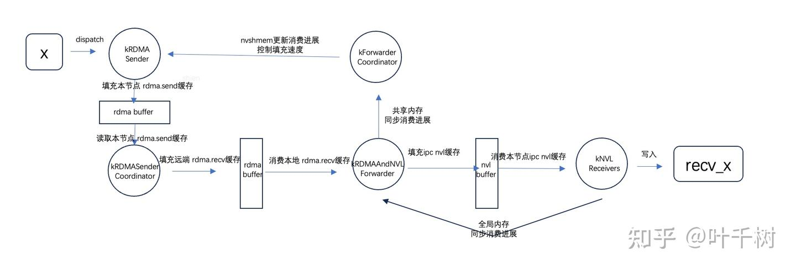

图14 填充rdma缓存，发送rdma消息，填充nvl缓存，消费nvl缓存之间的联系

图14是填充rdma缓存，发送rdma消息，填充nvl缓存，消费nvl缓存之间的简要关系。期望工作本文的介绍，有一个从顶向下的理解，能够清楚sm/warp功能划分，各功能之间的一个关系。 虽然DeepEP代码逻辑很复杂，但是DeepEP的高内聚性和高性能，非常适合作为一种最佳实践来了解学习高性能计算的通信技术。

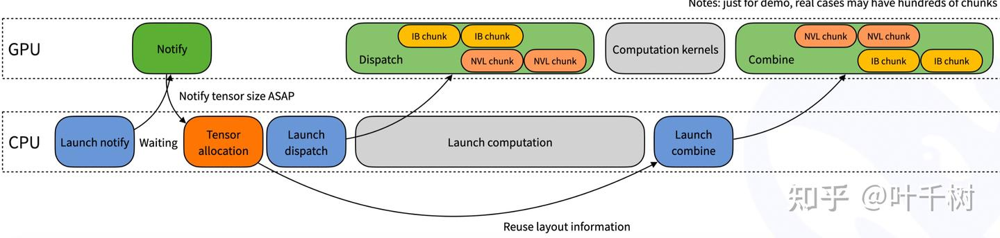

图15 overlap dispatch和compute

图15来自DeepseekEP，期望通过本文的梳理，能够理解notify和dispatch的工作机制，对于overlap通信和计算有直感上的理解。