# 陈巍：DeepSeek V3/R1的架构与训练技术2万字长文分析（上）（收录于：DeepSeek技术详解系列）

**Author:** 陈巍 博士

**Date:** 2025-04-13

**Link:** https://zhuanlan.zhihu.com/p/21208287743

放松一下

DeepSeek的最新模型DeepSeek-V3和DeepSeek-R1都属于MoE（混合专家）架构，并在开源世界产生了较大的影响力。特别是2025 年 1 月开源的DeepSeek-R1，模型性能可挑战 OpenAI 闭源的 o1 模型。

随着热度的提升，DeepSeek也被大模型行业之外的各路媒体不断提起，“打破CUDA垄断”，“挖了[NVLink](https://zhida.zhihu.com/search?content_id=253264090&content_type=Article&match_order=1&q=NVLink&zhida_source=entity)的墙角”，“引发英伟达市值大跌”，“证明大模型算力建设浪费”，“算力霸权转移”，“国运级的创新”，**似乎有用皮衣卡住老黄脖子的架势**。

那么，从技术和架构的角度深入最新的V3和R1模型，是否真的有“国运级的创新”，又有哪些误传？

下面我们从V3与R1的架构分析开始，分层解读DeepSeek的创新。

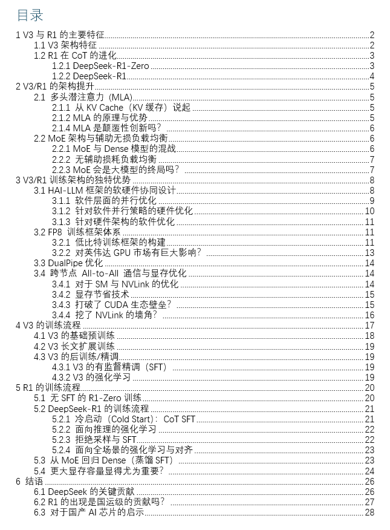

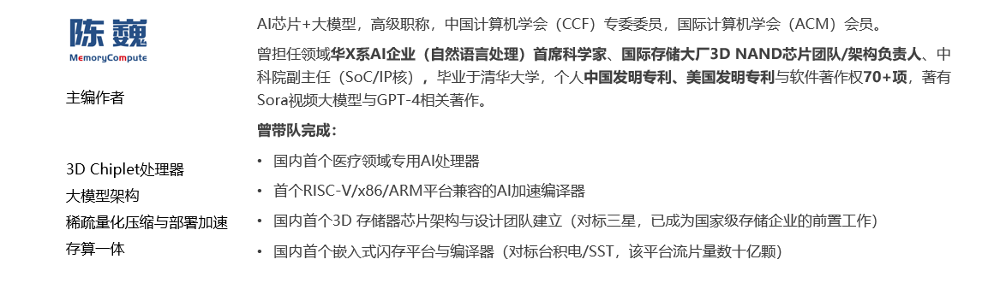

## 1 V3与R1的主要特征

DeepSeek-R1的模型架构来自于V3，甚至可以说R1是具有推理（Reasoning）能力的V3。下面先分别分析V3和R1的架构特征。

### 1.1 V3/R1架构特征

DeepSeek-V3 是一个混合专家 (MoE)语言模型，具有 6710 亿(671B)参数，其中每个Token（词元）的计算约激活 370 亿（37B）参数。这个模型参数量与GPT-4大致在同一数量级。

| ‌MoE（Mixture of Experts）是组合多个专家模型提升深度学习模型性能和效率的架构。‌其核心思想是通过引入多个专家模型（Experts），每个输入数据只选择和激活其中的一部分专家模型进行处理，从而减少计算量，提高训练和推理速度。‌MoE的概念在1991年就已提出，训练不容易收敛是其在大模型领域应用的主要障碍。 |
| --- |

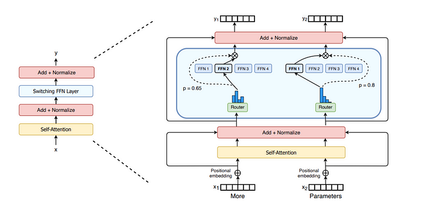

MoE模型基本结构示意（来源：网络）

DeepSeek-V3 采用了多头潜注意力 ([MLA](https://zhida.zhihu.com/search?content_id=253264090&content_type=Article&match_order=1&q=MLA&zhida_source=entity)，对传统多头注意力机制的改进) 和 [DeepSeekMoE](https://zhida.zhihu.com/search?content_id=253264090&content_type=Article&match_order=1&q=DeepSeekMoE&zhida_source=entity) 架构（对传统MoE架构的改进），无辅助损失的负载平衡策略等创新技术，基于 14.8 万亿Token的数据进行训练，在代码生成、分析等任务中表现出色。

其中多头潜注意力 (MLA) 机制和DeepSeekMoE是V3和R1模型提高计算效率，减少算力浪费的关键。其中MLA大概贡献了2-4倍的计算效率提升，MoE大概贡献了4倍以上的计算效率提升。

**1）MLA（Multi-Head Latent Attention）**

在“All you need is attention”的背景下，传统的多头注意力（MHA，Multi-Head Attention）的键值（KV）缓存机制事实上对计算效率形成了较大阻碍。缩小KV缓存（KV Cache）大小，并提高性能，在之前的模型架构中并未很好的解决。DeepSeek引入了MLA，一种通过低秩键值联合压缩的注意力机制，在显著减小KV缓存的同时提高计算效率。低秩近似是快速矩阵计算的常用方法，在MLA之前很少用于大模型计算。在这里我们可以看到DeepSeek团队的量化金融基因在发挥关键作用。当然实现潜空间表征不止低秩近似一条路，预计后面会有更精准高效的方法。

从大模型架构的演进情况来看，Prefill和KV Cache容量瓶颈的问题正一步步被新的模型架构攻克，巨大的KV Cache正逐渐成为历史。（事实上在2024年6月发布DeepSeek-V2的时候就已经很好的降低了KV Cache的大小）

**2）DeepSeekMoE**

为了让1991年就提出的MoE架构更好的融入大模型体系，克服传统MoE模型的训练难题。DeepSeek采用了细粒度专家+通才专家的思路，不再使用少数大专家的结构，而是使用大量极小的专家结构。这个思路的本质在于将知识空间进行离散细化，以更好的逼近连续的多维知识空间，是一个非常好的方法。

无辅助损失的负载平衡策略可在不依赖辅助损失函数的情况下平衡分配计算/训练负载，更好的提高训练稳定性。

基于以上关键的改进，V3实现了更高的训练效率，比性能类似的 Llama 3.1 405B 少了大约 10 倍的训练计算量。

### 1.2 R1在CoT的进化

广义上的DeepSeek-R1 不是一个单一的模型，还包括了R1的初始阶段模型DeepSeek-[R1-Zero](https://zhida.zhihu.com/search?content_id=253264090&content_type=Article&match_order=1&q=R1-Zero&zhida_source=entity)，以及几个基于R1蒸馏的较小的大模型。在这里我们主要讨论R1-Zero和R1。

### 1.2.1 DeepSeek-R1-Zero

DeepSeek-R1-Zero最大的特点在于，该模型仅使用强化学习进行的训练，通过各种思维链（CoT，Chain of Thought）数据特别是Long CoT数据来激活模型的推理能力。

DeepSeek-R1-Zero 是一个独特的通过大规模强化学习 (RL，Reinforcement Learning) 训练的模型，无需有监督微调 ([SFT](https://zhida.zhihu.com/search?content_id=253264090&content_type=Article&match_order=1&q=SFT&zhida_source=entity)，Supervised Fine-Tuning) ，具备较强的推理（Reasoning）能力。

| ‌首先要区分两个容易混淆的概念：Reasoning（推理）‌：通过对事实的考虑和分析来得出结论的过程。推理强调的是思考和决策的过程，比“推断”具有更多的逻辑和分析过程。 ‌‌Inference‌（推断）：基于已有信息或数据推导出新的信息或结论的过程。推断侧重于通过既定的算法或模型来实现，与“推理”相比，更强调形式化和计算过程。‌ |
| --- |

R1-Zero展示出自我验证、反思和长链思维推理能力，甚至在推理方面得分略微超过R1。虽然R1-Zero有一些明显的局限性，特别是在输出可读性和语言一致性方面，仍需要解决可读性差和语言混合等问题。

这大概是第一个公开验证大模型的推理（Reasoning）能力可以仅通过 强化学习来完成训练。在我们看来，R1-Zero的价值远超R1。按照NLP领域对语言的理解，人类的自然语言并不是最完美的推理语言。在R1-Zero的进一步进化过程中，或许可以构建出更适合推理的混合语言IR，建立更高效的推演体系。

### 1.2.2 DeepSeek-R1

相比之下，DeepSeek-R1采用了多阶段训练方法，加入了SFT，而不是采用纯粹的强化学习，R1从一小组精心挑选的示例数据（称为“冷启动数据”）进行有监督微调（SFT），再进入强化学习。这种方法改善了 DeepSeek-R1-Zero 的语言可读性和连贯性，同时在推理之外的测试中实现了更好的性能。

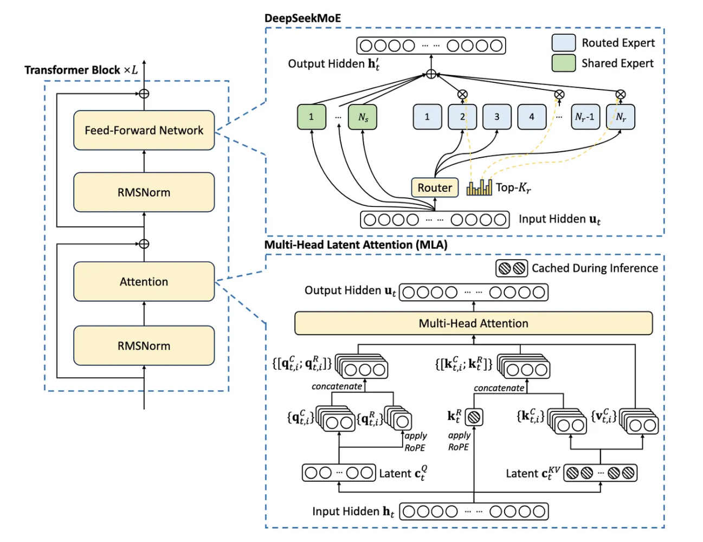

DeepSeek-V3整体架构（来源：DeepSeek）

## 2 V3/R1的架构提升

### 2.1 多头潜注意力 (MLA)

### 2.1.1 从KV Cache（KV缓存）说起

当使用传统 Transformer 在推断（Inference）过程中计算并生成 Token（词元）时，模型需要读入所有过去 Token 的上下文，以决定接下来输出什么Token。最直观的方法就是简单的再次进行一次包括所有过去 Token 的前向传播（计算）。

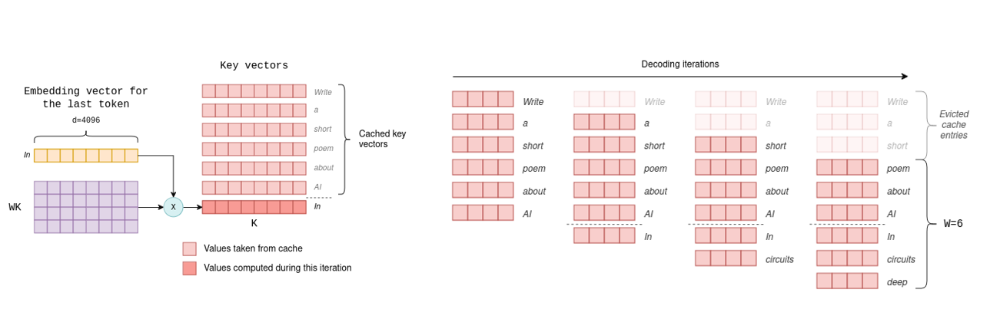

KV Cache（来源：互联网）

传统的基于 Transformer 的模型在推理过程中会计算每个键值 (KV) 对，但事实上这种方法效率并不高，因为大部分过去的 Token 已经在上一次计算中处理过了，重复计算会产生大量的浪费。

目前常用的方法是缓存所有过去 Token 的相关内部状态，主要是注意力机制中的键（Key）和值（Value）向量。这也是键值缓存（简称 KV 缓存）名称的由来。

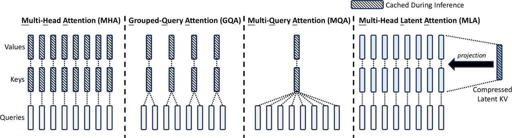

不同注意力机制的对比（来源：DeepSeek V2）

目前开源大模型中的主流方法是分组查询注意力（Grouped-Query Attention）机制。在这种机制中，为每对键和值头分配多个查询头，将查询头有效的分组在一起。在 Llama 3.3 70B 和 Mistral Large 2 等模型中，仅分组查询注意力机制就将 KV 缓存大小减少了大约一个数量级。

### 2.1.2 MLA的原理与优势

DeepSeek使用的Multi-Head Latent Attention技术可大大节省KV缓存，从而显著降低了计算成本。

MLA的本质是对KV的有损压缩，提高存储信息密度的同时尽可能保留关键细节。该技术首次在 DeepSeek-V2 中引入，与分组查询和多查询注意力等方法相比，MLA是目前开源模型里显著减小 KV 缓存大小的最佳方法。

MLA的方法是将KV矩阵转换为低秩形式：将原矩阵表示为两个较小矩阵（相当于潜向量）的乘积，在推断过程中，仅缓存潜向量，而不缓存完整的键KV。这规避了分组查询注意力和多查询注意力的查询的信息损失，从而在降低KV缓存的前提下获得更好的性能。

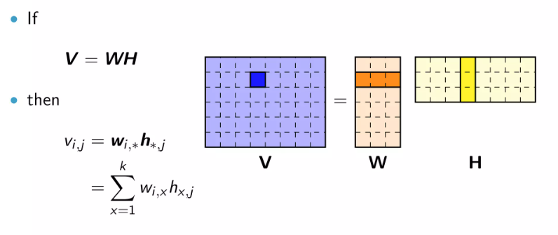

矩阵的低秩近似（来源：互联网）

另外为了与MLA技术的低秩KV压缩兼容，DeepSeek也将编码方式RoPE 进行了改进，使V2/V3/R1获得了长上下文的外延能力。

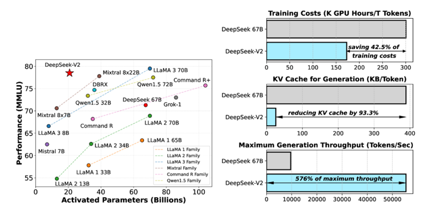

MLA方法有效降低KV Cache和训练成本（来源：DeepSeek）

### 2.1.4 MLA是颠覆性创新吗？

我们认为MLA是个非常有趣且先进的创新，这一工作建立在对注意力机制深度理解的之上，并且需要进行大胆谨慎的验证。限于算力条件和个人ROI，能够独立完成这一创新的团队并不多。能做出MLA这样的工作，确实是达到国际一线架构水平了。换一个角度看，MLA也是建立在DeepSeek团队的量化金融基因之上，不禁让我们联想到优秀的量化码农对每个矩阵计算的FPGA底层优化。

MLA之外的KV Cache优化方法（来源：武汉大学）

我们认为，MLA之后，应该还会有QMLA（量化MLA）或者CMLA（压缩MLA），甚至是超越现有Attention模式的技术出现，而用了很多年的Transformer也将经历大的变革。真正的颠覆创新可能，正摆在DeepSeek和国内其他大模型团队的面前。

### 2.2 MoE架构与辅助无损负载均衡

### 2.2.1 MoE与Dense模型的混战

目前的主流的大模型架构可以分为Dense（稠密）架构和MoE架构。

| ‌Dense模型‌在深度学习中通常指的是一种全部神经元都参与计算的网络结构。这种结构使得模型能够充分利用数据特征，并且训练过程中参数共享，减少了计算量和过拟合的风险。 |
| --- |

一般来说，Dense模型可以视为仅有一个专家的MoE模型。在大模型领域，Dense模型和MoE各有各的应用场景和优势，MoE还无法代替Dense模型的行业应用。

|   | Dense模型 | MoE模型 |
| --- | --- | --- |
| 优势 | 在专业领域计算参数量更少，更节省计算资源 | 在通用计算领域激活的参数少，更节省计算资源 |
| 劣势 | 在通用领域需要激活更多的参数，计算资源消耗大 | 在专业领域无需多位专家，容易产生大量参数冗余，浪费资源 |

相比Dense模型，MoE主要增加了专家路由，通过门控（开或关）的方法，负责将数据流引向不同的专家模块。专家路由事实上引入了一个不连续的门控函数（对梯度计算不友好），这导致梯度下降优化方法在 MoE 训练中表现不佳，甚至出现“路由崩溃”，即模型容易陷入始终为每个 Token 激活相同的少数专家的窘境，而不是将计算合理的传播到所有的可用专家。这也是MoE模型训练的难点。

### 2.2.2 无辅助损耗负载均衡

传统的规避路由崩溃的方法是强制“平衡路由”，即通过训练策略让每个专家在足够大的训练批次中被激活的次数大致相等。这一策略也就是“辅助损失”。但这种强制性的辅助损失会由于训练数据的结构不均衡特征，导致同领域的专家能力分散到不同的专家模块之中，极度损害MoE模型的性能。理想的 MoE 应该有一些经常访问高频通用信息，并具备其他访问较少的专业领域专家。如果强制平衡路由，将失去实现此类路由设置的能力，并且必须在不同的专家之间冗余地复制信息。

DeekSeek采用了“增加共享专家+无辅助损耗负载平衡”的方法解决这一问题。

DeepSeek将专家分为两类：共享专家和路由专家。共享专家始终会被路由，在训练中重点确保路由专家的路由均衡。

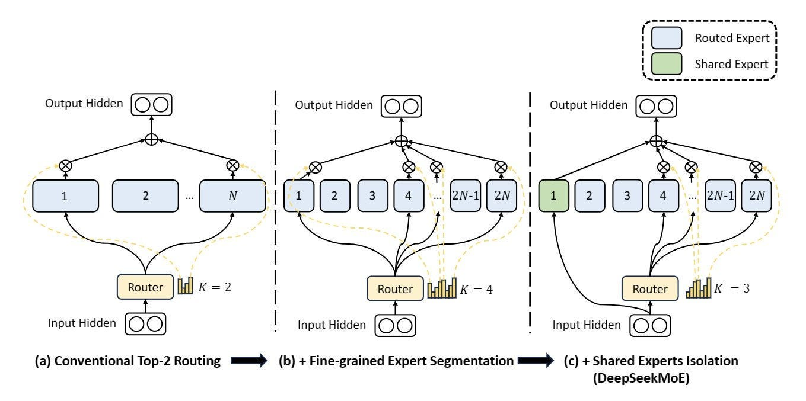

DeepSeekMoE与传统的多路由和细粒度专家MoE对比（来源：DeepSeek）

无辅助损耗负载均衡（Auxiliary-Loss-Free Load Balancing）方法是将特定于专家的偏差项添加到路由机制和专家亲和力中。偏差项不会通过梯度下降进行更新，而是在整个训练过程中持续监控并进行调整以确保负载平衡。如果训练中某个专家没有获得合理的命中次数，可以在每个梯度步骤中微调偏差项增加命中概率。

通过动态调整，DeepSeek-V3 在训练过程中获得了比有辅助损失均衡模型更好的性能。

从模型架构分析看，我们认为这种分配策略可能还不是理论最优的，但该方法已经比强制辅助损失有了显著的改进。

### 2.2.3 MoE会是大模型的终局吗？

MoE架构自1991年提出后，就一直在与Dense架构共生发展。

DeepSeek R1的推出确实大大推动了开源MoE大模型的发展，并为MoE的落地应用提供了更多可能。但是我们也应看到，MoE模型与应用领域高度和TOC（Total Owning Cost，总拥有成本）密切相关，很多场景MoE未必比Dense模型好。

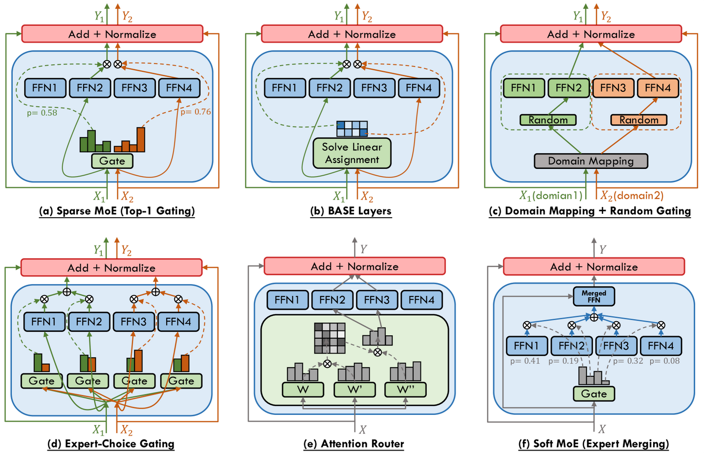

不同的MoE架构（来源：香港科技大学）

另外，MoE模型也有不同的细分架构类型。不是所有的MoE的参数量都远大于计算带宽要求。

MoE架构的本质是模型参数分布式存储，MoE减少计算量的代价可能是不同专家模型的参数重复和总参数量增加，这往往也意味着更大更贵的HBM成本。外界传言的MoE模型可以更小，其实是指的MoE模型蒸馏的Dense模型可以兼顾参数量和推理（Reasoning）性能。

不同应用场景对Dense和MoE模型的需求

|   | To B计算场景 | To C云计算场景 | To C边缘/端侧计算场景 |
| --- | --- | --- | --- |
| 特点 | 专业领域应用多，对RAG高度依赖，不需要多专家 | 通用领域多，对检索和训练数据更新时间敏感，需要多专家 | 通用领域多，可不需要高性能/精度回答，不需要多专家 |
| 主力架构 | 行业大模型，主要是Dense架构 | 通用基础模型，主要是MoE或MoA架构 | 限于成本，主要是Dense架构 |
| 占有率 | 较高 | 较低 | 目前较低 |

按照上表的分析，基于成本考虑，目前只有To C云计算场景（类似OpenAI的网页版服务）才会真正用上MoE这种多专家的模型架构。

## 3 V3/R1训练架构的独特优势

DeepSeek 的优势不仅仅来自于其模型架构。从低比特 [FP8](https://zhida.zhihu.com/search?content_id=253264090&content_type=Article&match_order=1&q=FP8&zhida_source=entity) 训练到All-to-All通信优化，其专用训练框架旨在尽可能提高训练的速度，以最高效率在解空间中找到较优的MoE参数集。

国内很多人在看DeepSeek团队时，更多关注了他们做Training的能力，但实际上DeekSeek的AI Infra能力，特别时软硬件协同优化能力，才是他们超越国内其他大模型团队的关键。

这一架构的核心优势包括：

1）引入了FP8混合精度训练框架，并首次在超大规模大模型训练上验证了这一框架的有效性。通过对FP8低比特计算和存储的支持，实现了训练的加速和GPU内存使用的减少。

2）设计了DualPipe算法来实现更高效的流水线并行，并通过计算-通信重叠隐藏了大模型训练过程中的大部分通信开销。

3）开发了高效的跨节点All-to-All通信内核，以充分利用[InfiniBand](https://zhida.zhihu.com/search?content_id=253264090&content_type=Article&match_order=1&q=InfiniBand&zhida_source=entity)（IB）和NVLink带宽；对显存使用进行了优化，无需使用昂贵的张量并行即可训练DeepSeek-V3。

### 3.1 [HAI-LLM](https://zhida.zhihu.com/search?content_id=253264090&content_type=Article&match_order=1&q=HAI-LLM&zhida_source=entity)框架的软硬件协同设计

V3 的训练基于DeepSeek自研的HAI-LLM 框架。HAI-LLM是一个高效、轻量级的训练框架，其设计充分考虑了多种并行策略，包括DP、PP、TP、EP和FSDP的并行模式。

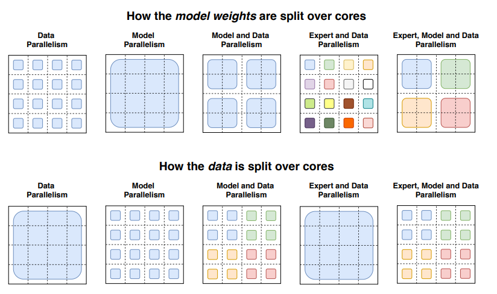

并行模式对比（来源：互联网）

### 3.1.1 软件层面的并行优化

HAI-LLM框架所作的并行改进

| 缩写 | 简介 | DeepSeek所做的工作或优化 |
| --- | --- | --- |
| TP | 张量并行 （Tensor Parallelism）：将模型层放置在并行执行计算的多个设备（计算芯片）上，包括逐行和逐列并行， | 将 NVLink Bridge 集成到系统中，在每对 GPU之间建立了 600GB/s 的带宽，增加TP效率 |
| PP | 流水线并行 （Pipeline Parallelism）：每个设备（计算芯片）都包含一部分模型层，每个训练批次分为串行的小批次以进行流水线执行 | 通过配置数据并行排队，规避单个节点（服务器）8个GPU共享一个 IB NIC流水线并行 （PP） 期间出现的网络带宽竞争，实现GPU的交替通信和91%的并行效率 |
| FSDP | 全共享数据并行 （Fully Sharded Data Parallel） 基于 ZeRO Stage 3 算法，对模型的参数、优化器状态和梯度分布到不同的设备（计算芯片）上。在正向传播期间，FSDP 执行 allgather作来组装完整的参数，并正向传播完成后释放；反向传播期间，FSDP 执行 allgather获取完整参数，并进行反向梯度计算，然后执行 reduce-scatter以同步所有设备之间的梯度，每个设备只保留部分梯度、参数和优化器更新 | 基于 ZeRO Stage-3 算法实现FSDP。将 allgather 和 reduce-scatter 通信与前向和反向传播计算重叠，拆分反向传播步骤以增强重叠，减少通信量。与 PyTorch 的 FSDP 相比，HAI-LLM 的 FSDP 将训练时间缩短了近一半 |
| DP | 数据并行 （Data Parallelism）：模型和优化器的状态在多个设备（计算芯片）之间复制，数据均匀分布给所有设备进行并行计算 | 对PCIe进行工程优化，提升DP |
| EP | 专家并行 （Expert Parallelism）：在MoE 训练期间，MoE 模型的不同专家分布在不同的设备（计算芯片）上，由门控单元将输入的Token分配给不同的专家 | 对PCIe进行工程优化，提升EP |

根据DeepSeek的论文，V3 应用了 16 路流水线并行 （PP）、跨越 8 个（服务器）节点的 64 路专家并行 （EP）和 ZeRO-1 数据并行 （DP）。

### 3.1.2 针对软件并行策略的硬件优化

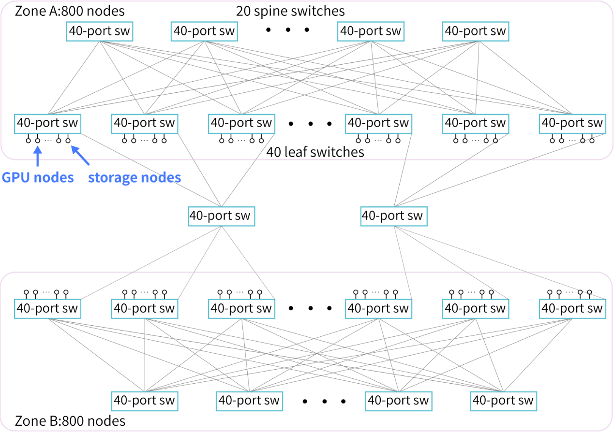

低成本的万卡集群架构（来源：DeepSeek）

为了配合HAI-LLM训练框架（软件），DeepSeek采用两层Fat-Tree拓扑+ InfiniBand （IB）作为集群架构（硬件）。这一集群架构的核心思路是减少互连层次，降低训练的综合成本。相对DGX-A100 的标准万卡集群三层Fat-Tree的1320个交换机，DeepSeek的同规模集群仅仅需要122台交换机，至少节省了40%的互连成本。

### 3.1.3 针对硬件架构的软件优化

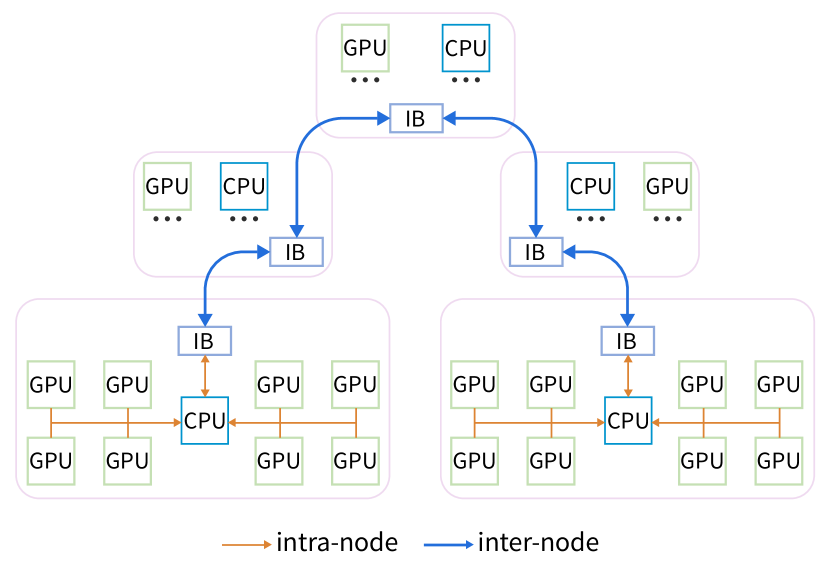

针对硬件架构优化的HFReduce（来源：DeepSeek）

针对所采用的硬件架构特点，DeekSeek开发了HFReduce（针对不使用NVLink的方案），以执行高效的 allreduce操作。 HFReduce会首先执行节点内 reduce，然后通过 CPU 执行节点间 allreduce，最后将 reduced 数据传输到 GPU 。这样的优化需要DeepSeek团队对硬件互连有非常深刻的理解。

当然DeepSeek团队也开发了基于NVLink的HFReduce with NVLink，在将梯度传递给 CPU 之前，先在NVLink 互连的GPU 之间执reduce减作；当 CPU 返回结果时，会将数据切分并分别返回给 NVLink 连接的配对 GPU，再通过 NVLink 执行allgather。

### 3.2 FP8 训练框架体系

### 3.2.1 低比特训练框架的构建

FP8与其他数据格式占据空间对比（来源：互联网）

通常的大模型训练会采用BF16（16位浮点）或FP32/TF32（32位浮点）精度作为数据计算和存储的格式，来确保较高的训练精度。相比之下，FP8占用的数据位宽仅为FP32的1/4，可以有力的提升计算速度，降低对存储的消耗。当然，FP8也存在精度不高，容易导致训练失败的潜在问题。

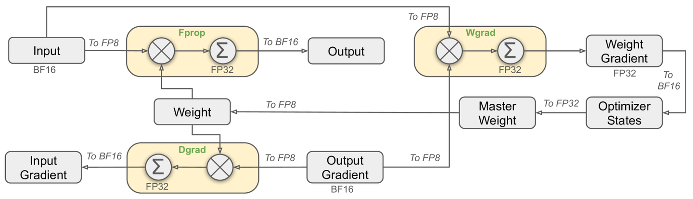

FP8训练框架局部方案（来源：DeepSeek）

DeepSeek-V3 使用 FP8（8 位浮点数）来提高计算速度并减少训练期间的显存使用量。为了让FP8更好的完成训练，DeepSeek专门设计了针对FP8的训练框架体系。当然，就在撰写本文的时候，微软已经跑通了FP4（4位浮点数）的完整模型训练。

使用FP8框架进行训练的主要挑战在于精度与误差的处理。

DeepSeek为其FP8低比特训练框架做了以下优化：

**1）细粒度量化**

将数据分解成更小的组，每个组都使用特定乘数进行调整以保持高精度。这一方法类似于Tile-Wise或Block-Wise。对于激活，在 1x128 大小的基础上对计算数据进行分组和缩放;对于权重， 以128x128 大小对计算数据进行分组和缩放。该方法可以根据最大或最小数据调整缩放系数，来更好的适应计算中的异常值。

**2）在线量化**

为了提高精度并简化框架，该框架在线计算每个 1x128 激活块或 128x128 权重块的最大绝对值，在线推算缩放因子，然后将激活或权重在线转化为 FP8 格式，而不是采用静态的历史数据。相对静态的量化方法，该方法可以获得更高的转换精度，减小误差的累积。

**3）提高累加精度**

FP8在大量累加时会累积出现随机误差。例如FP8 GEMM在英伟达 H800 GPU 上的累加精度保留 14 位左右，明显低于 FP32 累加精度。以 K = 4096 的两个随机矩阵的 GEMM 运算为例，Tensor Core 中的有限累加精度可导致最大相对误差接近 2%。

DeepSeek将中间结果储存计算升级为 FP32（32位浮点），实行高精度累加，然后再转换回 FP8，以降低大量微小误差累加带来的训练偏差。

**4）低精度/混合精度存储与通信**

为了进一步减少 MoE 训练中的显存和通信开销，该框架基于FP8 进行数据/参数缓存和处理激活，以节省显存与缓存空间并提升性能，并在 BF16（16位浮点数）中存储低精度优化器状态。

该框架中以下组件保持原始精度（例如 BF16 或 FP32）：嵌入模块、MoE 门控模块、归一化算子和注意力算子，以确保模型的动态稳定训练。为保证数值稳定性，以高精度存储主要权重、权重梯度和优化器状态。

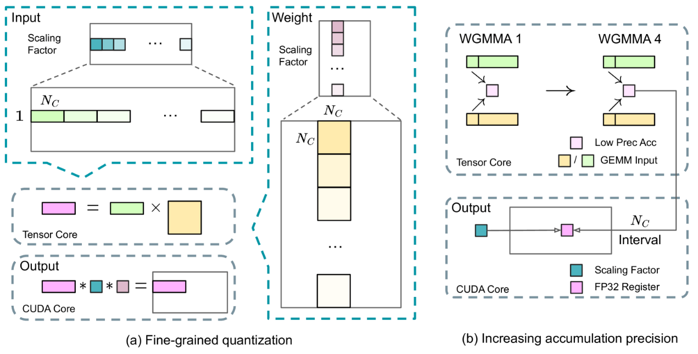

细粒度量化与提高累加精度（来源：DeepSeek）

以上这些针对FP8训练的优化设计，都是精雕细作的工作，需要框架设计人员对GPU硬件架构和训练误差具有很强的整合分析能力。从DeepSeek的FP8训练框架来看，这个团队具有很强的技术和工程整合能力，已经不是单纯的大模型算法或AI Infra团队。

### 3.2.2 对英伟达GPU市场有巨大影响？

2025年1月27日，英伟达股价暴跌近17%，市值蒸发近6000亿美元，创下美国历史上单日最大市值跌幅纪录。AI领域的明星公司普遍遭受重创：博通（Broadcom）下跌17.4%，AMD下跌6.4%。微软下跌2.1%。此外，AI产业链的衍生板块也未能幸免，电力供应商Constellation Energy下跌近21%，Vistra下跌28%。国内很多媒体认为这是DeepSeek的崛起，引起投资者对于英伟达等半导体企业估值过高的担忧。

英伟达估值是否过高不好说，毕竟MoE架构的发展已经展现出“存力重要性优于算力+对存储带宽瓶颈下降”的倾向。但从技术角度看，DeepSeek的大模型目前依然存在对英伟达GPU的路径依赖。

1）目前英伟达仍在低比特计算方面领先。包括DeepSeek使用的FP8和微软使用的FP4，都是由英伟达率先产品化并推向市场的。FP8训练最早也是在英伟达内部开始验证的。英伟达之外，暂时还没有企业有这样的生态推动力和落实能力。

2）MoE模型仍属于大模型演进的常规路径，并不会因为MoE模型的路径切换导致GPU应用不及预期。目前主要的MoE模型依然是基于英伟达生态构建的，在算力单价昂贵、模型性能仍需提升的现在，MoE的应用事实上是基于有限的算力成本，进一步提升通用大模型（以to C为主）性能的有效路径。这个路线早已有之，不管DeepSeek的影响力是否扩大，目前通用大模型都在朝着这个方向发展。过于夸大DeepSeek对AI产业的影响，只会加速美国商务部对DeepSeek的封禁速度，对DeepSeek自身反而不利。

3）DeepSeek使用的一些训练成本优化技术属于定制化技术，其他竞品企业未必有类似的定制能力。例如前面提到的混合精度存储/计算，与模型本身的特征高度绑定，迁移起来并不简单，属于DeepSeek内部的定制化技术，与量化交易中的FPGA优化有原理类似之处。这类定制化技术一般难以简单的复制，其他企业短期内难以复盘，进行规模化成本降低的概率不高。有这个AI Infra能力的早就已经做了，没有这个能力也不会冒着成本不可控的风险冒然进入。

我们认为DeepSeek的V3/R1模型事实上为英伟达GPU开拓了除Llama开源系列Dense模型之外的MoE开源模型新大陆，等同于为苹果的IOS市场增加了新的免费Killer App。

DeepSeek本身对英伟达的股价影响，看起来更像是骆驼背上的最后一根稻草，大概不会超过以下几个因素：

1）美国贸易关税风险。

2）B200/5090不达市场预期的风险。

3）大陆高成本GPU（主要是H100）算力过剩的风险。

4）对大陆禁运加强的风险。

### 3.3 DualPipe优化

V3/R1的训练框架中引入DualPipe算法以实现高效的流水线并行性。

与现有的流水线并行（PP）方法相比，DualPipe具备以下优势：

1）DualPipe的流水线气泡更少，信道使用效率更高。

2）DualPipe将前向和后向传播中的计算和通信重叠，解决了跨节点专家并行（EP）带来的繁重通信开销问题.

3）在确保计算与通信比例恒定的情况下，具有很好的Scale-out能力。

DualPipe算法将每个数据块分为四个部分：attention（图中ATTN）、all-to-all dispatch（图中DISPATCH）、MLP 和 all-to-all combine（图中COMBINE）。对于后向块，attention和 MLP 都进一步分为后向输入、后向权重。对于一对前向和后向块，针对通信和计算的过程和瓶颈进行优化。DualPipe采用双向流水线调度，同时从流水线发送前向和后向数据，尽可能提高使用率。

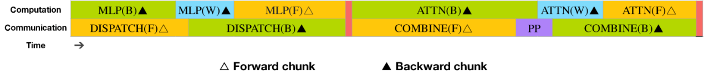

DualPipe的流水线（来源：DeepSeek）

### 3.4 跨节点 All-to-All 通信与显存优化

V3/R1的训练框架还定制了高效的跨节点All-to-All通信内核，以充分利用IB 和 NVLink 带宽，并节约流式多处理器 （SM，(Stream Multiprocessor）。DeepSeek还优化了显存分配，以在不使用或少使用张量并行 （TP） 的情况下训练 V3/R1。

### 3.4.1 对于SM与NVLink的优化

为了保证 DualPipe的计算性能不被通信影响，DeepSeek定制了高效的跨节点 All-to-All 通信内核（包括 dispatching 和 combining），以节省专用于通信的 SM数量。

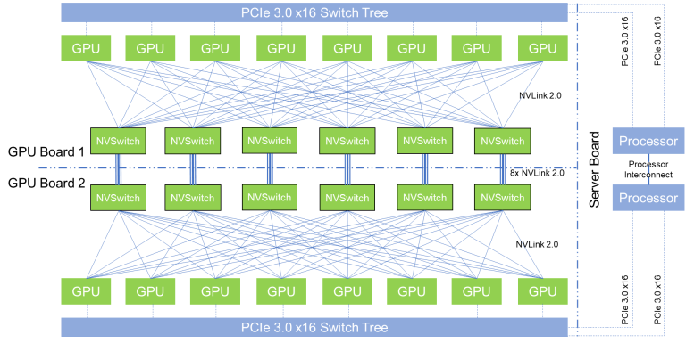

传统的基于NVSwitch的All-to-All通信结构（来源：互联网）

通信内核（通信SM控制代码）的实现与MoE 门控算法和集群网络拓扑是按照软硬件协同的思路来进行设计的。具体来说，在集群中，跨节点 GPU与 IB 完全互连，节点内（单台服务器内）通信通过NVLink完成。NVLink 提供 160 GB/s 的带宽，约是 IB 的 3.2 倍 （50 GB/s）。

为了有效利用IB 和NVLink的不同带宽，DeepSeek将每个Token（词元）的分发限制为最多4 个节点，从而减少IB流量限制的影响。 对于每个Token，在做节点间路由决策时，先通过IB传输到目标节点上具有相同节点内索引的GPU；到达目标节点后，再通过NVLink 转发到托管目标专家的特定GPU。通过这种方式，通过IB和NVLink的通信重叠，平均每个Token可以在每个节点选择3.2名专家，而不会产生额外的NVLink开销。

实际算法中，V3/R1只通过路由选择了8个专家，但在保持相同通信成本的情况下，该架构可以扩展到最多13 个专家（4 个节点x3.2个专家/节点）。

DeepSeek还采用了warp（线程束）专用化技术，将20个SM划分为10个通信信道。

1）在调度过程中，（a）IB 发送、（b）IB 到NVLink 转发、（c） NVLink 接收由相应的warp处理。分配给每个通信任务的warp数量会根据所有SM的实际工作负载动态调整。

2）在合并过程中，（a） NVLink 发送、（b）NVLink到IB的转发和累积、（c）IB接收和累积也由动态调整的warp处理。

3）dispatching 和combining kernel都与计算流重叠，采用定制的PTX（Parallel Thread Execution）指令以自动调整通信块大小，减少了对L2缓存的使用和对其他 SM 的干扰。

### 3.4.2 显存节省技术

为了减少训练期间的内存占用，V3/R1还采用了以下技术节省显存：

DeepSeek采用的显存节省技术

| 技术 | 方法说明 | 优势 |
| --- | --- | --- |
| RMSNorm 和MLA Up-Projection 的重新计算 | 在反向传播期间重新计算所有MSNorm操作和MLA Up-Projection，无需持久存储其输出激活 | 以算代存，充分利用GPU内算力充沛但缓存不足的特点 |
| 在CPU内存中保存指数平均数指标（EMA） | 在CPU 内存中保存EMA，并在每个训练步骤后异步更新 | 把EMA从GPU显存占用改为CPU内存占用，释放动态存储空间 |
| 在多标记预测（MTP）中共享嵌入和输出头 | 使用DualPipe 策略，将模型最浅的层（包括嵌入层）和最深的层（包括输出头）部署在相同的PP等级上 | 允许MTP模块和主模型之间物理共享参数、梯度、嵌入和输出头，提升显存效率 |

### 3.4.3 打破了CUDA生态壁垒？

网上很多人，看到DeepSeek使用了PTX指令，而没有直接使用CUDA进行SM编程，就认为DeepSeek打破了CUDA生态的垄断。

但实际上，

1）PTX指令集也是CUDA生态的一环，是CUDA生态的基础。

2）PTX指令比CUDA更底层，与英伟达的绑定比CUDA更深。

3）CUDA是以PTX指令集为基础构建的，是PTX的外壳和泛化。

4）PTX的移植比CUDA移植挑战更大，难以在国产GPU上直接移植。

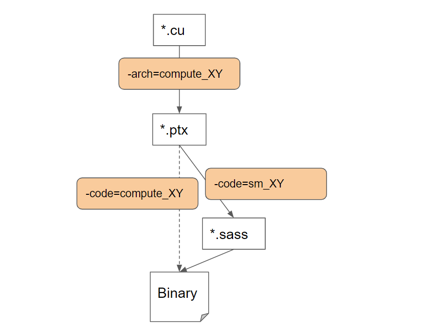

CUDA与PTX、SASS的层次关系（来源：互联网）

如果把CUDA理解为C语言的话，PTX相当于CUDA的高级汇编语言，可以在不同的GPU上运行。另一种更加底层的指令集是Streaming Assembly（SASS），与GPU的型号深度帮绑定。无论PTX还是SASS都是英伟达的根基，其他GPU厂家很难插手。

DeepSeek在训练过程中使用PTX，感觉就是量化码农用C语言写交易代码，发现优化效率不够，那么就尝试在C语言中嵌入汇编语言来提高硬件调度效率。难道这就等于打破了C语言的江湖地位？

### 3.4.4 挖了NVLink的墙角？

有传言说DeepSeek主要使用Infiniband，以EP（专家并行）代替TP（张量并行），挖了NVLink的墙角，从而坚定的认为以PCIe（节点内互连）+IB（节点间互连）就足以进行大模型的训练。

在这里面，NVLink主要负责芯片间（C2C）的通信，而Infiniband负责节点间（服务器间）通信。如果使用PCIe进行C2C通信，带宽远不如NVLink。

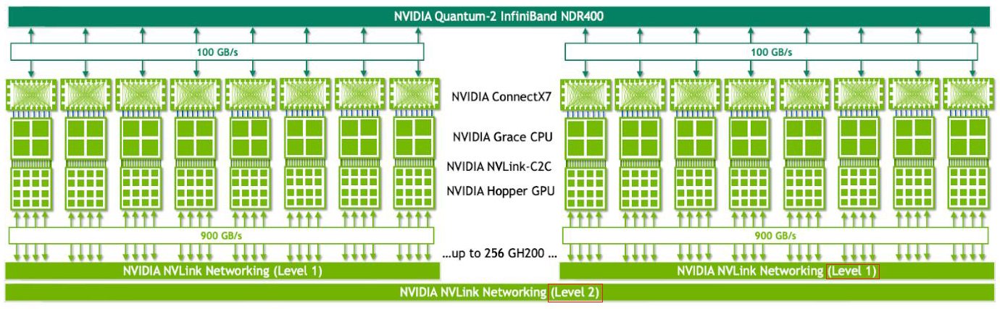

NVLink+Infinband互连（来源：英伟达）

规避NVLink的想法很美好，但现实很骨感。按照DeepSeek发表的论文描述，只是在早期没有加入NVSwitch的时候用过PCIe+InfiniBand实现HFReduce，当具备NVSwitch后就立刻增加了HFReduce with NVLink。特别是在V3的论文中，明确写了针对NVLink信道加入了定制PTX优化，好让更多的有效SM参与计算。

这就好比学校的教学高楼里没有大电梯，怕楼梯上孩子太多出危险，就先用“算法+楼梯”代替，拿到“算法许可”的小孩才能到不同楼层去报道。但不能说这样就挖了“电梯”的墙角，卡住了“电梯”的脖子。一个高效的训练系统，依然需要大量的C2C或D2D互连实现更优的拓扑结构。咱不能因为玄奘法师能克服艰难险阻走到古印度取到真经，就认为需要反思火车飞机的重要性。

## 放松一下

我让DeepSeek-R1分析下一级市场对大模型的投资策略，并且参考本文作者的文章。发现DeepSeek进行互联网检索后的Reasoning能力确实表现的不错，但是并未能够识别出本文信息的要点（例如MLA、训练架构等），反而是跟不太重要的MoE较劲。这是否也说明传统的KV Cache信息保留过多，反而无法提取关键的潜空间信息？也许MLA依然是有大量冗余信息的，比GQA和MLA更小更有效的KV Cache减小方法依然未被确认。

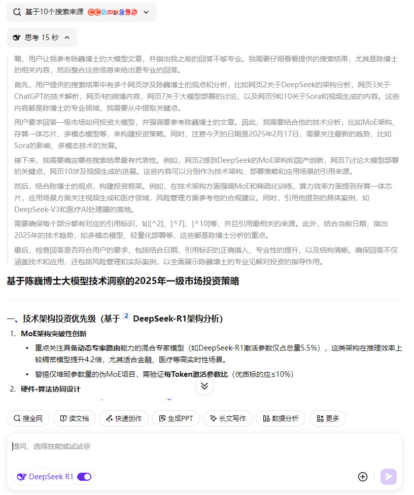

下篇请看：

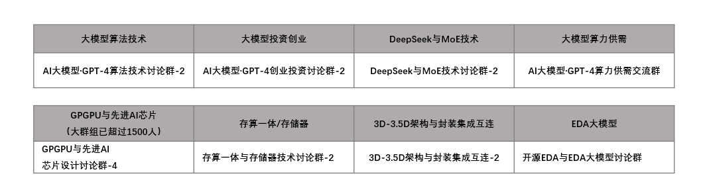

参与DeepSeek与MoE讨论：

参与DeepSeek与MoE讨论（如果已满），或其他技术讨论：

DeepSeek资源汇总：

