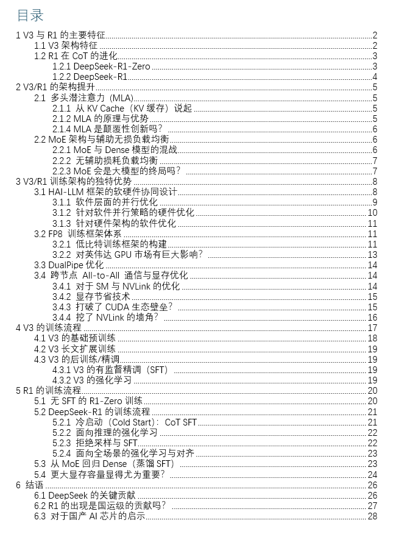
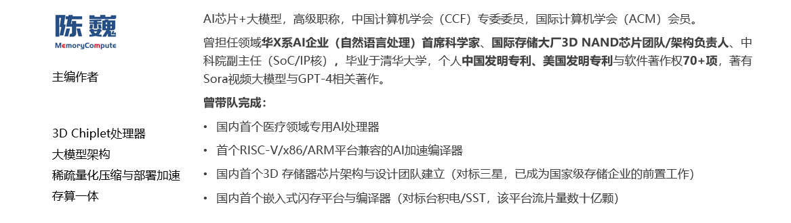

# 陈巍：DeepSeek V3/R1的架构与训练技术2万字长文分析（下）（收录于：DeepSeek技术详解系列）

**Author:** 陈巍 博士

**Date:** 2025-04-13

**Link:** https://zhuanlan.zhihu.com/p/21755758234

​

目录

收起

4 V3的训练流程

4.1 V3的基础预训练

4.2 V3长文扩展训练

4.3 V3的后训练/精调

4.3.1 V3的有监督精调（SFT）

4.3.2 V3的强化学习

5 R1的训练流程

5.1 无SFT的R1-Zero训练

5.2 DeepSeek-R1的训练流程

5.2.1 冷启动（Cold Start）：CoT SFT

5.2.2 面向推理的强化学习

5.2.3 拒绝采样与SFT

5.2.4 面向全场景的强化学习与对齐

5.3 从MoE回归Dense（蒸馏SFT）

5.4 更大显存容量显得尤为重要？

6 结语

6.1 DeepSeek的关键贡献

6.2 R1的出现是国运级的贡献吗？

6.3 对于国产AI芯片的启示

“打破[CUDA](https://zhida.zhihu.com/search?content_id=253373233&content_type=Article&match_order=1&q=CUDA&zhida_source=entity)垄断”？“挖了[NVLink](https://zhida.zhihu.com/search?content_id=253373233&content_type=Article&match_order=1&q=NVLink&zhida_source=entity)的墙角”？“引发[英伟达](https://zhida.zhihu.com/search?content_id=253373233&content_type=Article&match_order=1&q=%E8%8B%B1%E4%BC%9F%E8%BE%BE&zhida_source=entity)市值大跌”？“证明大模型算力建设浪费”？“算力霸权转移”？“国运级的创新”？这些说法**是否属实？**

本文是从V3到R1的架构创新与误传的万字长文分析的下篇。下面我们继续分析V3与R1的训练和蒸馏，分层解读DeepSeek的创新。

## 4 V3的训练流程

DeepSeek的R1是以V3为基础构建的（冷启动）。如果想深入理解R1的训练，就要先看V3的训练流程。V3的训练包括预训练（含基础预训练和上下文长度扩展）、后训练三个阶段。

在预训练阶段后，对[DeepSeek-V3](https://zhida.zhihu.com/search?content_id=253373233&content_type=Article&match_order=1&q=DeepSeek-V3&zhida_source=entity) 进行了两次上下文长度扩展，第一阶段将最大上下文长度扩展到32K，第二阶段进一步扩展到128K。然后在 DeepSeek-V3的基础模型上进行包括有监督精调 ([SFT](https://zhida.zhihu.com/search?content_id=253373233&content_type=Article&match_order=1&q=SFT&zhida_source=entity)) 和强化学习(RL)在内的后训练，使其更贴近人类的偏好。

DeepSeek-V3训练流程

### 4.1 V3的基础预训练

DeepSeek-V3 总共包含 671B参数，其中每个Token激活了37B。在路由专家中，每个Token激活8个专家，并确保每个Token最多发送到4个节点，以减小通信资源的浪费。多Token预测（MTP）深度设置为1，即除了下一个 Token之外，每个Token还将预测一个额外的Token。

在14.8T预训练数据集结构上，V3采用了以下策略：

1）提高数学和编程样本的比例来优化预训练语料库，以提升推理能力。

2）基于中国互联网可用的语料库整合了更多的中文数据。（这也是V3能玩中文梗的关键）

3）将多语言覆盖范围扩展到英文和中文之外。

4）优化数据处理/过滤算法，在保持语料库多样性的同时最大限度减少信息冗余。

过滤掉有争议的内容，减少特定区域文化引入的数据偏差

5）通过文档打包，减少在短文本块的训练浪费，同时在训练过程中没有使用交叉样本注意力屏蔽。

高质量的数据结构与数据投喂顺序，其实是大模型性能提升的关键。可惜DeepSeek并没有给出预训练数据更具体的构建方法。

Fill-in-Middle方法（来源：互联网）

V3的训练采用前缀-后缀-中间（PSM）框架来构建FIM训练数据。Fill-in-Middle（FIM，中间补全）是一种针对代码补全能力的预训练方式，模型在训练过程中学习使用上下文的语境来预测文段中间缺失的部分。FIM策略不会损害下一Token预测（NTP）能力，同时可使模型能够根据上下文线索准确预测中间文本。

V3使用 AdamW 优化器来预训练，同时避免过度拟合。

### 4.2 V3长文扩展训练

在基础预训练后，V3使用YARN技术将上下文长度，按照两阶段训练扩展到128K，每个阶段包括1000步。在第一阶段，使用32K的序列长度和1920的批量来执行1000步训练。在第二阶段，采用128K的序列长度和480个序列的批量大小执行1000步训练。

### 4.3 V3的后训练/精调

### 4.3.1 V3的有监督精调（SFT）

V3的有监督精调做了以下这些事：

1）梳理指令精调（instruction-tuning）数据集。该数据集包括1.5M个实例，跨多个域，每个域都量身定制的不同的数据合成方法。

2）利用[DeepSeek-R1](https://zhida.zhihu.com/search?content_id=253373233&content_type=Article&match_order=1&q=DeepSeek-R1&zhida_source=entity) 模型合成与推理（Reasoning）相关的SFT数据集。这里很有意思，基于R1来SFT V3，再基于V3冷启动R1。感觉上这里有关键的训练信息没有透露，DeepSeek应该还是留了一手。

3）为特定领域（例如代码、数学或一般推理）构建量身定制的专家模型数据合成器。使用复合有监督精调和强化学习训练该专家模型。训练过程中为每个实例生成两种不同类型的 SFT样本：第一种将问题与其原始响应耦合，格式为<problem, original response>，而第二种将系统提示与问题和R1响应合并，格式为<system prompt, problem, R1 response>。

4）建立高质量提示（Prompt）体系，引导模型形成自身的反馈与验证机制。同时整合了来自R1合成的数据，通过强化学习加强这一能力。

5）对于非推理数据（例如创意写作、角色扮演和简单的问答），利用 DeepSeek-V2.5生成数据，并通过人工注释验证数据的准确性。

### 4.3.2 V3的强化学习

V3的强化学习包括奖励模型与组相对策略优化（[GRPO](https://zhida.zhihu.com/search?content_id=253373233&content_type=Article&match_order=1&q=GRPO&zhida_source=entity)）。

与GPT-4类似，V3中奖励模型包括：

1）基于规则的奖励模型

对于可以使用特定规则验证的问题，采用基于规则的奖励模型来提供训练反馈。例如，对于 LeetCode 问题，可以利用编译器根据测试用例生成反馈。基于规则的模型验证，可以确保更高的生成可靠性。

2）基于模型的奖励模型

对于不具有收敛性的问题，依靠模型判断来确进行强化学习。V3训练中构建了特殊的偏好数据，该数据同时包括提供最终奖励结果和形成奖励的思维链，以降低特定任务中的奖励破解攻击风险。

大模型的训练通常用无监督或有监督进行预训练，然后通过有监督精调（SFT）进一步学习。然而SFT有时难以将人类的偏好显式地整合进去，这时就需要强化学习来进行精调。在以往的大模型训练中一般使用[PPO](https://zhida.zhihu.com/search?content_id=253373233&content_type=Article&match_order=1&q=PPO&zhida_source=entity)（Proximal Policy Optimization）来形成梯度策略。PPO的代价在于需要维护较大的价值网络（也是一个神经网络），需要占用较大的显存与计算资源。

GRPO与PPO对比（来源：DeepSeek）

V3中则采用了DeepSeek提出的GRPO（Group Relative Policy Optimization）策略，只需要在一个分组内进行多个采样输出的比较，再根据比较结果选择较优的策略。GRPO中不再需要一个显式的价值网络，从而降低了显存占用并提高了训练速度。

GRPO的计算流程包括：

1）采样一组输出并计算每个输出的奖励。

2）对组内奖励进行归一化处理。

3）使用归一化后的奖励计算优势函数。

4）通过最大化目标函数更新策略模型。

5）迭代训练，逐步优化策略模型。

## 5 R1的训练流程

### 5.1 无SFT的R1-Zero训练

DeepSeek-R1 建立在其基础模型DeepSeek-V3的混合专家（MoE）架构之上，采用专家并行方式，对于任意输入，只有部分参数处于活跃状态。

作为R1的无SFT版本，R1-Zero使用 DeepSeek-V3-Base 作为基础模型，直接使用 GRPO进行强化学习来提升模型的推理（Reasoning）性能, 根据准确度和格式进行训练奖励。

R1-Zero的训练过程具有重要意义：

1）在大模型训练领域，SFT 需要高质量的人工标注数据（标注过程一般需要很长周期、成本高，且可能因标记者的偏好而引入潜在偏差）。

2）复杂的推理任务可能超出了普通人类的能力。无SFT的纯强化学习方法也许可以使模型能够涌现出超越传统人类思维上限的超级推理能力。

3）无SFT的纯强化学习不依赖于显式标注，允许模型使用非自然语言表征方法进行“思考”，从而具有超越自然语言进行逻辑推理的潜力。

奖励的计算方式在很大程度上决定了强化学习训练的效果。DeepSeek-R1-Zero 的基于规则的奖励系统包括：

1）准确度奖励（Accuracy rewards）。评估响应是否正确。

2）格式奖励（Format rewards）。奖励模型将其思考过程置于“<think>”和“</think>”标签之间。

DeepSeek的准确度奖励与格式奖励（来源：互联网）

通过强化学习训练，R1-Zero 形成了复杂的推理能力，包括反思（模型重新审视并重新评估其先前的回答）以及探索解决问题的替代方法。这些能力并非通过常规编程或提示工程实现的，而是大模型在强化学习环境中自发产生的能力。

根据R1的论文，强化学习训练中R1-Zero形成的另一个关键特征是顿悟时刻（Aha Moment）。R1-Zero 通过重新评估其初始方法学会为问题分配更多的思考时间（更长的推理）。无需明确的教模型如何解决问题，只需为其提供适当的激励，模型就会自主形成解决问题的策略。这也说明强化学习有潜力解锁新的智能水平，为未来更自主、更具适应性的模型铺平道路，提供了形成超级智能的可能路线。

与OpenAI的GPT-4 相比，DeepSeek-R1-Zero在推理任务上表现出了显著的改进。例如，在AIME 2024 基准（推理能力测试）上，DeepSeek-R1-Zero的性能从15.6%跃升至71.0%，这表明R1-Zero的无SFT推理训练方法是有效的。

### 5.2 DeepSeek-R1的训练流程

DeepSeek-R1 的训练过程分为4个阶段，包括使用数千高质量CoT示例进行SFT的冷启动，面向推理的强化学习，通过拒绝抽样的SFT，面向全场景任务的强化学习与对齐。

两个SFT阶段进行推理和非推理能力的能力植入，两个强化学习阶段旨在泛化学习推理模式并与人类偏好保持一致。

DeepSeek-R1训练流程

### 5.2.1 冷启动（Cold Start）：CoT SFT

与R1-Zero不同，R1首先基于DeepSeek-V3-Base进行有监督精调（SFT），以克服强化学习的早期不稳定。DeekSeek认为这种基于人类先验知识冷启动并进行迭代训练的方式更适合推理模型。

由于这一训练阶段主要采用CoT数据，我们更喜欢将其称为CoT SFT。

为构建少量的长CoT数据，DeepSeek探索了几种合成方法：使用长CoT 的few-shot提示作为示例，直接提示模型通过反思和验证生成详细回答，以可读格式收集DeepSeek-R1-Zero 输出，并通过人工标注员的后处理来完善结果。在此步骤中收集了数千个冷启动样本以进行精调。

其中可读模式指为每个回答在末尾包含一个摘要，并过滤掉不易阅读的部分。其输出格式为 |special\_token|<reasoning\_process>|special\_token|
。

### 5.2.2 面向推理的强化学习

在基于冷启动数据对V3-Base 精调后，采用与R1-Zero相当的强化学习训练流程，基于GRPO进行强化学习，根据准确度和格式进行训练奖励。为了解决语言混杂问题，还在强化学习训练中引入了语言一致性奖励，该奖励以CoT中目标语言单词的比例计算。

此阶段主要提升模型的推理（Reasoning）性能，特别是在编码、数学、科学和逻辑推理等推理密集型任务，这些任务涉及定义明确且解决方案明确的问题。

### 5.2.3 拒绝采样与SFT

这是另一个使用标记数据的有监督精调 (SFT)训练阶段，分批进行了两个epoch的精调，样本量为800k。800k中包括600k推理数据和200k非推理数据。

与主要侧重于推理的冷启动数据不同，此阶段结合了来自其他领域的数据，以增强模型在写作、角色扮演和其他通用任务中的能力。

拒绝采样（Rejection Sampling）提供了一种桥梁，使用易于采样的分布来近似训练真正感兴趣的复杂分布。目标响应（ground-truth）从一组生成的回答经过拒绝采样生成，其分数由奖励系统确定。

| 拒绝采样（Rejection Sampling）是一种蒙特卡洛方法，和重要性采样一样，都是在原始分布难以采样时，用一个易于采样的建议分布进行采样，通过拒绝原始分布之外的采样数据来获得采样结果。拒绝采样只是为了解决目标分布采样困难问题，该方法需要原始分布是已知的。 |
| --- |

拒绝采样示意（来源：互联网）

**600k推理数据的生成：**

1）通过从上一轮强化学习训练的检查点进行拒绝抽样，整理推理提示并生成推理轨迹（Reasoning Trajectories）。

2）除基于规则奖励进行评估的数据外，还包括了基于奖励模型的V3判断生成数据。

3）过滤掉了混合语言、长段落和代码块的思路链数据。

4）对于每个提示（Prompt），会生成多个回答，然后并仅保留正确的响应。

**200k非推理数据的生成（如写作、事实问答、自我认知和翻译等）：**

1）采用DeepSeek-V3流程并复用V3 的部分 SFT 数据集。

2）可调用V3生成潜在的思路链，再通过提示回答。

3）对于更简单的查询（例如“你好”），不提供CoT回答。

### 5.2.4 面向全场景的强化学习与对齐

最后，再次进行面向全场景的强化学习和人类偏好对齐，以提高模型的有用性和无害性，并完善推理能力。此阶段还整合了来自不同管道的数据，将奖励信号与不同的提示分布相结合。

1）使用奖励信号和多种提示分布（Diverse Prompt Distributions）的组合来训练模型。

2）对于推理数据，利用基于规则的奖励来指导数学、代码和逻辑推理领域的训练过程。

3）对于一般数据，采用奖励模型来捕捉复杂微妙场景中的人类偏好。即参考DeepSeek-V3 管训练流程，采用类似的偏好对和训练提示分布。

4）对于有用性，只关注最终摘要，以确保重点响应对用户的实用性和相关性，最大限度减少对底层推理过程的干扰。

5）对于无害性，评估模型的整个响应，包括推理过程和摘要，以识别和减轻生成过程中可能出现的潜在风险、偏见或有害内容。

至此已完成R1的完整训练过程，获得了具备全场景推理能力的通用MoE模型，上下文长度均为128K。

| Model | #Total Params | #Activated Params | Context Length |
| --- | --- | --- | --- |
| DeepSeek-R1-Zero | 671B | 37B | 128K |
| DeepSeek-R1 | 671B | 37B | 128K |

### 5.3 从MoE回归Dense（蒸馏SFT）

尽管[MoE架构](https://zhida.zhihu.com/search?content_id=253373233&content_type=Article&match_order=1&q=MoE%E6%9E%B6%E6%9E%84&zhida_source=entity)有各种优点，特别是在通用的to C领域具备低成本的优势。但是MoE的架构特点使得其可能不太适用于专业应用场景（例如单一专家场景）和资源限制场景（例如端侧推理）。

| 蒸馏是将复杂的大型神经网络压缩为更小、更简单的神经网络，同时尽可能多的保留结果模型的性能的过程。此过程涉及训练较小的“学生“神经网络，通过其预测或内部表示的精调来学习模拟更大、更复杂的“教师”网络的行为。 |
| --- |

模型蒸馏方法（来源：互联网）

为了能够将推理能力迁移到MoE架构不适合的场景，DeepSeek选择[Llama](https://zhida.zhihu.com/search?content_id=253373233&content_type=Article&match_order=1&q=Llama&zhida_source=entity)和[Qwen系列](https://zhida.zhihu.com/search?content_id=253373233&content_type=Article&match_order=1&q=Qwen%E7%B3%BB%E5%88%97&zhida_source=entity)开源大模型进行蒸馏，使相应的Dense模型也能获得推理能力。与使用强化学习相比，直接SFT更适合较小的大模型，蒸馏完成的Dense模型推理能力明显好于原开源模型。

DeepSeek-R1-Distill模型（来源：DeepSeek）

| Model | Base Model |
| --- | --- |
| DeepSeek-R1-Distill-Qwen-1.5B | Qwen2.5-Math-1.5B |
| DeepSeek-R1-Distill-Qwen-7B | Qwen2.5-Math-7B |
| DeepSeek-R1-Distill-Llama-8B | Llama-3.1-8B |
| DeepSeek-R1-Distill-Qwen-14B | Qwen2.5-14B |
| DeepSeek-R1-Distill-Qwen-32B | Qwen2.5-32B |
| DeepSeek-R1-Distill-Llama-70B | Llama-3.3-70B-Instruct |

### 5.4 更大显存容量显得尤为重要？

随着MoE架构大模型的快速推广，产业界也有看法认为在单块GPU上集成更大的超过对等算力的显存或扩展存储显得尤为重要。

我们对此持不同看法，首先要看产品应用场景占有率，其次要看实际的部署方案，最后要看成本比较：

1）根据前面分析，目前主力的专业行业应用仍是使用Dense模型，能部署MoE模型的通用AI巨头早已下场完成部署，从目前的应用比例来看，使用Dense模型的依然占据应用主体。对于Dense模型（实际上是单专家的特例），超过对等算力的单卡大显存或扩展存储容易形成浪费。

同样模型性能下MoE模型需要更大的显存（来源：Meta）

2）根据从厂商和V3论文获得的实际部署方案，为保证MoE部分不同专家之间的负载均衡，会将共享专家和高负载的细粒度专家在集群的不同GPU做多个复制，让GPU把更多的热数据（发给共享专家的）跑起来，V3部署中每个GPU大概托管9个专家。如果考虑这9个专家中有一个是参数最多的共享专家，那么事实上每块GPU上的空闲细粒度专家占据的参数总和可能不超过单块GPU上总参数量的1/3。

MoE的跨GPU部署模式（来源：微软）

3）从成本上看，可能把一部分专家放到CPU上更划算。我们认为MoE上的专家可以分为高频专家、中频专家，低频专家。高频专家和中频专家搭配部署在GPU上比较合适，低频专家调度很少，更适合放在服务器上已有的闲置CPU的内存上（CPU上的标准内存比GPU的HBM便宜很多，扩展性更好），以充分利用全服务器的算力降低综合成本。

MoE模型的GPU+CPU混合部署（来源：Meta）

另外，R1自己都做Dense模型的蒸馏版本了，我们为何还要纠结于高于对等算力带宽的超大显存？

## 6 结语

### 6.1 DeepSeek的关键贡献

DeepSeek由梁文锋于2023 年5月创立，公司独立运营，并由[幻方](https://zhida.zhihu.com/search?content_id=253373233&content_type=Article&match_order=1&q=%E5%B9%BB%E6%96%B9&zhida_source=entity)支持研发资金。这种独特的模式使DeepSeek能够在没有外部投资者压力的情况下开展跨越式的人工智能研发，优先考虑长期研发和价值。

成立6个月后，DeepSeek于2023年11月发布的DeepSeek Coder，随后是 DeepSeek LLM 67B，DeepSeek逐渐踏上了基础大模型的竞争赛道。2024年5月推出的DeepSeek-V2就呈现出MLA和AI Infra技术的明显领先优势，极具性价比，引发了中国大模型市场的价格跳水和血拼。

在V2发布后，我们就已经关注到DeepSeek在算法-硬件协同优化方面的出色表现。主编作者在2024年6月，为前来咨询的投资人推荐DeepSeek的高性价比路线。

V3和R1发布并开源后，DeepSeek进一步巩固了其在MoE性价比和AI Infra的地位，并以开源模型中几乎最出色的推理性能，赢得社会的广泛关注。

对于R1/V3的主要创新，可以参考下表：

DeepSeek-R1/V3的主要创新

| R1/V3的优化 | R1/V3的创新与价值（实现了与 OpenAI-o1-1217 相当的性能） | 其他开源大模型（相当于Llama3.3的性能） |
| --- | --- | --- |
| 软硬件结合，提高模型计算效率降低成本 | 提出MLA，通过将键值 (KV) 缓存显著压缩为潜在向量来保证高效推理 | 采用GQA或MHA，占用KV缓存比MLA大一个数量级 |
| 减少冗余，提高模型计算效率降低成本 | 提出DeepSeekMoE，采用细粒度专家分割和共享专家隔离，减少冗余的专家参数 | 采用粗粒度专家，模型参数冗余大 |
| 改进算法，提高训练效率 | 提出无辅助损失策略 ，改善MoE模型训练 | 采用常规辅助损失策略，容易训练失败 |
| 简化算法，提高训练效率 | 采用GRPO进一步使模型与人类偏好对齐，提高训练效率 | 采用PPO，训练效率不高 |
| 软硬件结合，提高训练效率 | 基于开源代码开发自有的FP8混合精度训练框架，提升训练效率 | 传统开源训练框架，以BF16或FP32为主，显存占用超过FP8，训练速度较慢 |
| 软硬件结合，提高训练效率 | DualPipe算法来实现高效的流水线并行 | 默认流水线并行算法，气泡较多 |
| 软硬件结合，提高训练效率 | 跨节点All-to-All通信内核，使用PTX编程以充分利用InfiniBand（IB）和NVLink带宽 | 默认通信内核， |
| 改进数据，提高模型性能 | 使用长思维链(CoT)数据进行模型训练，提升模型能力 | 几乎无长思维链训练 |

我们经过分析，认为DeepSeek的算法架构能力已经达到国际一线水平（例如MLA和GRPO算法），而其AI Infra团队的软硬件协同设计水平（例如FP8训练框架和基于PTX进行All-to-All通信内核优化）和自由探索，可能已暂时超越大部分国际大模型企业。基本上DeepSeek团队对GPU的性能使用率已接近技术上限，实现了在现有GPU体系内的软件Sacle-up。

如果有这样超越其他大厂一个数量级的训练效率提升，估计很多大模型炼丹师梦里都要乐开花了。

### 6.2 R1的出现是国运级的贡献吗？

有人提出DeepSeek所作的工作可能是一种国运级别的科技成果。

作为本文的主编作者，我个人只在小时候看过一点点梅花易数的介绍，对于推算国运的太乙神数一直没有机会了解和获得传承，不好随意讲这是不是国运级的成果。

我对最近DeekSeek的影响力传播看法如下：

1）对DeepSeek的成果，特别是V3/R1开源，应有产业的高度肯定。但过度褒扬对DeekSeek大概率是不利的甚至是极为有害的，会导致专心做事的人要疲于应付各种俗务，也大概率导致DeepSeek招致美国商务部的打压。

2）梁文锋本人一贯低调，在创立幻方后那么多年，几乎没有出来宣传或炒作。媒体和社会如能参考DeepSeek创始人的个人行事风格，给更多类似DeepSeek的本土人才和企业予以支持，会更有利于国运。

3）脱离实际技术分析的对DeepSeek的评判多数是雾里看花，少一些人与亦云的评判，多一些实干，对所有心怀理想的人都是好事。

4）会有比R1更颠覆性的先进大模型出现。如同前几年的热炒OpenAI和Kimi，技术总会不断进步，对于DeepSeek来说，还有更加重要的目标和星辰大海，R1仅仅是海边新发现的璀璨贝壳。

5）是否是对OpenAI模型的蒸馏根本不重要。学习和参考是人类社会进步的阶梯，开源更是对大模型技术进步的头号贡献。一两家闭源巨头大概率没有足够的资源储备来推动人类AGI的颠覆式发展，只有更多的DeepSeek这样的力量贡献到开源社区，才能形成合力实现超级人工智能。

### 6.3 对于国产AI芯片的启示

DeepSeek的进步和成果，也给国产AI芯片的发展提供了一些启示。

一方面，一级市场需要升级投资逻辑，不用再崇洋媚外。事实证明纯本土的研发团队，甚至是纯本土新人团队，完全由能力做出有国际影响力的成果和产品。国内算法不再死跟着老美屁股后面，国内的AI芯片也大可不必死跟着英伟达做传统GPU。新的架构AI芯片，新的GPU架构，跨领域的技术融合，正形成新的产业窗口。

另一方面，DeepSeek的技术成果，事实也凸显出算力对模型进步的重要性。DeepSeek的算法进步速度之快，与其算力使用效率比其他团队高约一个数量级有非常密切的关系。（当然DeepSeek可使用的算力总量也不低）在这样的一个算法大发展契机，尽快发展新架构AI芯片，发展3D封装集成，发展高速互连，发展开源编译生态，抢占MoE模型发展期的技术红利，对中国的芯片产业就显得尤为重要。

上篇请看：

参与DeepSeek与MoE讨论：

参与DeepSeek与MoE讨论（如果已满），或其他技术讨论：

DeepSeek资源汇总：

