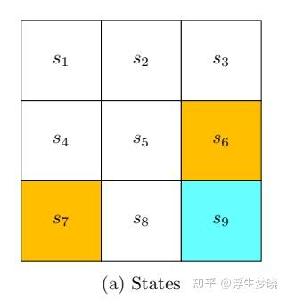
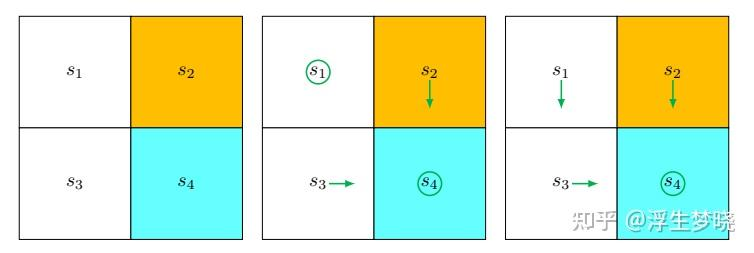
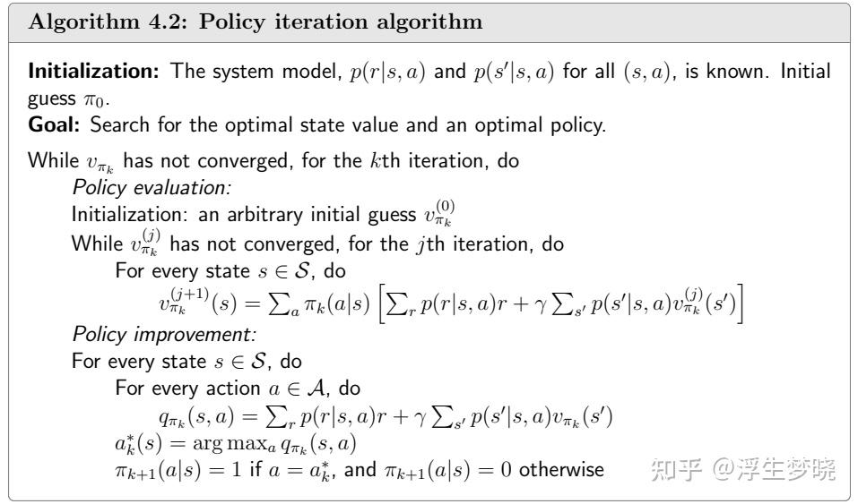

# 强化学习（RL）（从入门到PPO）（一、基础部分）

**Author:** 浮生梦晓

**Date:** 2025-04-22

**Link:** https://zhuanlan.zhihu.com/p/22925478480

## 开始前的碎碎念

强化学习的内容也是对之前学习强化学习课程所记录的笔记进行的归纳总结，由于内容较多，整体分为多个篇章，强化学习涉及到的理论比较抽象，以下所涉及到的内容来源为李宏毅、赵世钰、张伟楠三位教授的课程以及对应的书籍，对应的网页链接放置在文末的参考文献部分。由于本篇内容主要是强化学习笔记的总结部分，不会对每个公式都进行讲解，主要是梳理强化学习学习的脉络，如果需要系统的学习，还是推荐上面提到的三位教授的课程，由于本人是从事LLM方向，所以内容上会侧重RL在LLM训练上的应用，主体脉络也是这个方向。

## 感性认识

首先在学习之前写一下对强化学习的感性认知，主要是有个感性认识：

-   强化学习可以理解为强化和学习，其中学习就代表这训练，从真实实践或者自己或者专家经验中来学习，强化代表行为策略的强化，通过学习不断强化在某个状态下选择合适行为策略。
-   强化学习是个很抽象的系统内容，有on policy和off policy，online和offline，model base和model free等多种分类方式，有些学者认为特定条件下的学习属于强化学习，也有学者认为强化学习范围十分宽泛，包括目前神经网络的训练也属于强化学习，后面会展开讨论。
-   强化学习在LLM中应用越来越大，最早是RLHF的训练，也叫做基于人类反馈的强化学习，之所以带上HF是因为其对齐目标是人类价值观，人类价值观是很难通过一个特定规则的监督模型来给出奖惩值，因此通过人来标注反馈数据去训练一个奖励模型，但随着LLM发展，openai发布了o1和o3模型，其中下游任务中直接使用强化学习进行训练，也叫做RFT或者RLFT（强化学习微调），之所以不需要HF（human feedback）是因为在代码或者逻辑数学运算，再或者其他下游任务下天然是存在奖励模型的，如生成的代码是否可以运行，数学运算结果是否正确，Agent任务是否执行成功等等，在这些任务上是不需要人类反馈去训练奖励模型的。
-   LLM预训练和监督微调可以看做是单步的off line 和 off policy的强化学习，o1的长思维链及agent的长action提示词可以看做是多步的off line 和 off policy的强化学习。在强化学习中只进行offline训练没有进行on line和on policy训练会造agent拟合到数据经验中从而形成与真实世界的GAP，这也是LLM为什么经常出现幻觉的原因。

## 直观认识

### 示意图：

智能体有3种关键要素，即感知、决策和奖励

-   感知。智能体在某种程度上感知环境的状态，从而知道自己所处的现状。例如，下围棋的智能体感知当前的棋盘情况；无人车感知周围道路的车辆、行人和红绿灯等情况；机器狗通过摄像头感知面前的图像，通过脚底的力学传感器来感知地面的摩擦功率和倾斜度等情况。
-   智能体根据当前的状态计算出达到目标需要采取的动作的过程叫作决策。例如，针对当前的棋盘决定下一颗落子的位置；针对当前的路况，无人车计算出方向盘的角度和刹车、油门的力度；针对当前收集到的视觉和力觉信号，机器狗给出4条腿的齿轮的角速度。策略是智能体最终体现出的智能形式，是不同智能体之间的核心区别。
-   奖励。环境根据状态和智能体采取的动作，产生一个标量信号作为奖励反馈。这个标量信号衡量智能体这一轮动作的好坏。例如，围棋博弈是否胜利；无人车是否安全、平稳且快速地行驶；机器狗是否在前进而没有摔倒。最大化累积奖励期望是智能体提升策略的目标，也是衡量智能体策略好坏的关键指标。

**强化学习的目标：在当前状态下找到一个最优策略到达目标状态。**

## [马尔科夫决策过程](https://zhida.zhihu.com/search?content_id=253607342&content_type=Article&match_order=1&q=%E9%A9%AC%E5%B0%94%E7%A7%91%E5%A4%AB%E5%86%B3%E7%AD%96%E8%BF%87%E7%A8%8B&zhida_source=entity)

### State

智能体当前所处的状态

### Action

智能体在某个状态下可能执行的动作

### State transition

智能体在某个状态下执行某个动作会进入到新的状态

表格形式描述状态转移矩阵：

状态转移概率（总和为1），示意：

$\begin{gathered} p(s_{1}|s_{1},a_{2})=0, \\ p(s_{2}|s_{1},a_{2})=1, \\ p(s_{3}|s_{1},a_{2})=0, \\ p(s_{4}|s_{1},a_{2})=0, \\ p(s_{5}|s_{1},a_{2})=0, \end{gathered}$

### Policy

智能体在每个状态下所有可能执行的动作的概率，一般分为确定性的策略和不确定性策略

-   确定性策略

## $\begin{gathered} \pi(a_1|s_1)=0, \\ \pi(a_{2}|s_{1})=1, \\ \pi(a_{3}|s_{1})=0, \\ \pi(a_{4}|s_{1})=0, \\ \pi(a_{5}|s_{1})=0, \end{gathered}$

-   不确定性策略

表格形式：

### Reward

智能体在某个状态下执行动作的奖惩值

表格形式：

## Trajectories, returns, and episodes

-   trajectory：智能体在某一初始状态开始进行状态转移，最终到达target状态的路径。
-   returns(回报)：智能体在trajectory上所有的reward总和。
-   episodes：trajectory的一部分。

**马尔科夫链描述trajectory：**

$s_1\xrightarrow{a_2}s_2\xrightarrow{a_3}s_5\xrightarrow{a_3}s_8\xrightarrow{a_2}s_9.$

**returns：**

$\mathrm{return}=0+0+0+1=1.$

**即时收益：**

当前状态执行某个动作马上会获得的收益（奖惩值）

**未来收益：**

当前状态执行某个动作后进入了新的状态，新的状态之后的收益总和

## $s_1\overset{a_2}{\operatorname*{\longrightarrow}}s_2\overset{a_3}{\operatorname*{\longrightarrow}}s_5\overset{a_3}{\operatorname*{\longrightarrow}}s_8\overset{a_2}{\operatorname*{\longrightarrow}}s_9\overset{a_5}{\operatorname*{\longrightarrow}}s_9\overset{a_5}{\operatorname*{\longrightarrow}}s_9\ldots$

> s1状态执行动作a2后即时收益是0，未来收益是s2之后的收益

trajectory可能是无限长或者很长的，这样return会非常大，但未来收益相对于即时收益来说重要性要小一些，因此引入一个超参数γ作为衰减因子，γ ∈ (0, 1)。

**引入衰减因子的return叫做disconted return。**

$\mathrm{return}=0+0+0+1+1+1+\cdots=\infty,$

$\text{discounted return}=0+\gamma0+\gamma^20+\gamma^31+\gamma^41+\gamma^51+\ldots,$

$\text{discounted return}=\gamma^3(1+\gamma+\gamma^2+\ldots)=\gamma^3\frac{1}{1-\gamma}.$

**注：当衰减因子越接近于1越关注未来收益，越接近于0越关注当前收益。**

### State Space

状态空间：所有可能的状态，一个集合，可能无穷

### **Action Space**

动作空间：依赖于状态，某个状态下所有的动作，也是一个集合，可能无穷

**注意：动作空间依赖于状态，每个状态下动作空间不一定相同**

### 马尔科夫决策过程

**符号描述**

-   集合：

-   S：状态空间，大写，集合
-   A(s)：状态S下的动作空间，A大写，s小写，A是集合
-   R(s, a)：状态S下执行动作a的奖励，R大写，s，a小写，R是集合

-   模型：

-   状态转移概率：

$\begin{aligned}  & p(s^{\prime}|s,a) \\  & \sum_{s^{\prime}\in\mathcal{S}}p(s^{\prime}|s,a)=1\text{ for any }(s,a). \end{aligned}$

-   奖励概率：

$\begin{aligned}  & p(r|s,a) \\  & \sum_{r\in\mathcal{R}(s,a)}p(r|s,a)=1\text{ for any }(s,a). \end{aligned}$

-   策略：

-   在s状态下执行a的概率

$\begin{aligned} \pi(a|s) \\ \sum_{a\in\mathcal{A}(s)}\pi(a|s) & =1\text{ for any }s\in\mathcal{S}. \end{aligned}$

**马尔科夫决策过程：**

马尔可夫决策过程由元组(S,A,P,r,γ)组成

$s_1\xrightarrow{a_2}s_2\xrightarrow{a_3}s_5\xrightarrow{a_3}s_8\xrightarrow{a_2}s_9\xrightarrow{a_5}s_9\xrightarrow{a_5}s_9\ldots$

马尔科夫奖励过程/马尔科夫过程：

$s_1 \xrightarrow[r=0]{a_2} s_2 \xrightarrow[r=0]{a_3} s_5 \xrightarrow[r=0]{a_3} s_8 \xrightarrow[r=1]{a_2} s_9 \xrightarrow[r=1]{a_5} s_9 \xrightarrow[r=1]{a_5} s_9 \ldots$

**未来的状态和收益只依赖于当前状态和动作，与以前的动作和状态无关。**

### [价值函数](https://zhida.zhihu.com/search?content_id=253607342&content_type=Article&match_order=1&q=%E4%BB%B7%E5%80%BC%E5%87%BD%E6%95%B0&zhida_source=entity)

**价值函数分为两种：状态价值以及动作价值**

**状态价值：**从当前状态到目标状态的所有trajectory的return的期望。

**动作价值：**当前状态及动作之后所有trajectory的return的期望。

**回顾returns：**

$G_t=R_t+\gamma R_{t+1}+\gamma^2R_{t+2}+\cdots=\sum_{k=0}^\infty\gamma^kR_{t+k}$

**价值函数的数学符号的展开表示：**

## $\begin{aligned} V(s) & =\mathbb{E}[G_t|S_t=s] \\  & =\mathbb{E}[R_t+\gamma R_{t+1}+\gamma^2R_{t+2}+\ldots|S_t=s] \\  & =\mathbb{E}[R_t+\gamma(R_{t+1}+\gamma R_{t+2}+\ldots)|S_t=s] \\  & =\mathbb{E}[R_t+\gamma G_{t+1}|S_t=s] \\  & =\mathbb{E}[R_t+\gamma V(S_{t+1})|S_t=s] \end{aligned}$

**价值函数的转移概率形式：**

## $V(s)=r(s)+\gamma\sum_{s^{\prime}\in S}p(s^{\prime}|s)V(s^{\prime})$

**价值函数的矩阵展开形式：**

$\begin{aligned} \mathcal{V}=\mathcal{R}+\gamma\mathcal{PV} \\ \begin{bmatrix} V(s_1) \\ V(s_2) \\ \cdots \\ V(s_n) \end{bmatrix}= \begin{bmatrix} r(s_1) \\ r(s_2) \\ \cdots \\ r(s_n) \end{bmatrix}+\gamma \begin{bmatrix} P(s_1|s_1) & p(s_2|s_1) & \ldots & P(s_n|s_1) \\ P(s_1|s_2) & P(s_2|s_2) & \ldots & P(s_n|s_2) \\ \cdots \\ P(s_1|s_n) & P(s_2|s_n) & \ldots & P(s_n|s_n) \end{bmatrix} \begin{bmatrix} V(s_1) \\ V(s_2) \\ \cdots \\ V(s_n) \end{bmatrix} \end{aligned}$

**以上都是[贝尔曼公式](https://zhida.zhihu.com/search?content_id=253607342&content_type=Article&match_order=1&q=%E8%B4%9D%E5%B0%94%E6%9B%BC%E5%85%AC%E5%BC%8F&zhida_source=entity)**

**注意：**

-   **贝尔曼公式不是唯一的，存在非常多种表现形式**
-   **贝尔曼公式不是针对单独状态的，每个状态都存在一个贝尔曼公式**

### 状态价值函数

基于某个策略的价值函数：

$V^\pi(s)=\mathbb{E}_\pi[G_t|S_t=s]$

### 动作价值函数

在一个状态下执行动作a的期望价值函数：

$Q^\pi(s,a)=\mathbb{E}_\pi[G_t|S_t=s,A_t=a]$

### 状态价值与动作价值之间的关系

数学上表示：

直观理解：**当前状态的状态价值是动作价值的期望**

**注意：状态价值是一个期望，动作价值中当前收益是常数，后面的其他状态的状态价值是一个期望。**

$V^\pi(s) = \sum_{a \in A} \pi(a|s)Q^\pi(s,a)$

$Q^\pi(s,a) = r(s,a) + \gamma \sum_{s' \in S} P(s'|s,a)V^\pi(s')$

带策略的贝尔曼方程：

$V^\pi(s) = \mathbb{E}_\pi[R_t + \gamma V^\pi(S_{t+1})|S_t = s] \\ = \sum_{a \in A} \pi(a|s) \left(r(s,a) + \gamma \sum_{s' \in S} p(s'|s,a)V^\pi(s')\right) \\ Q^\pi(s,a) = \mathbb{E}_\pi[R_t + \gamma Q^\pi(S_{t+1}, A_{t+1})|S_t = s, A_t = a] \\ = r(s,a) + \gamma \sum_{s' \in S} p(s'|s,a) \sum_{a' \in A} \pi(a'|s')Q^\pi(s',a')$

**注意：**

-   **状态价值函数的作用是对当前策略进行评估。动作价值函数的作用可以看做对于当前状态执行某个动作的评估。**
-   **强化学习的目标是找到一个最优策略，这是一个迭代的过程，如何评估策略每次更好了一些，就通过状态价值函数来体现。**
-   **我们的目标是在当前策略下根据贝尔曼公式求得所有状态的状态价值，根据状态价值来找到策略提升点从而更新一个新的策略，在这个新的策略下再次计算状态价值，不断迭代，直到状态价值收敛。**
-   **最终的最优策略是状态价值收敛，注意最优策略不是唯一的。**

  

下面：如何更新策略，或者如何计算贝尔曼公式

## 计算贝尔曼公式

**直接对矩阵求逆，实际使用起来不现实，这里不展示**

**实际中是使用迭代算法进行求解，分为两种，[值迭代](https://zhida.zhihu.com/search?content_id=253607342&content_type=Article&match_order=1&q=%E5%80%BC%E8%BF%AD%E4%BB%A3&zhida_source=entity)和[策略迭代](https://zhida.zhihu.com/search?content_id=253607342&content_type=Article&match_order=1&q=%E7%AD%96%E7%95%A5%E8%BF%AD%E4%BB%A3&zhida_source=entity)**

**迭代算法有个基础直观认识：只要不断的提升State Value，最终会收敛到最优的State Value**

在此之前介绍贝尔曼最优公式： $\text{For every } s \in \mathcal{S}, \text{ the elementwise expression of the BOE is} \\ v(s) = \max_{\pi(s) \in \Pi(s)} \sum_{a \in A} \pi(a|s) \left(\sum_{r \in \mathcal{R}} p(r|s,a)r + \gamma \sum_{s' \in \mathcal{S}} p(s'|s,a)v(s')\right) \\ = \max_{\pi(s) \in \Pi(s)} \sum_{a \in A} \pi(a|s)q(s,a)$

**贝尔曼最优公式的作用：寻找策略提升点**

直观理解：当前s有n个动作，每个动作都有自己的q(s,a)，如何选择a可以使得v(s)最大【我们的目标就是最大化v】，毫无疑问是all in最大的a，所有最优贝尔曼公式多了max。

**注意：上面迭代公式在数学上通过不动点理论及收敛定理可以求得是存在唯一解，也就是最优的s是存在的，即存在最优的状态价值，但策略不一定唯一。**

如何迭代的去求解出最优的s，即最优的状态价值，可以通过值迭代和策略迭代两种方法。

**以下两种迭代算法介绍都是model base的，即站在了上帝视角，知道所有状态及每个状态执行每个动作会进入哪个状态，同时也知道在某个状态下执行某个动作得到的奖励值。在现实中基本上不存在model base的场景。**

### 值迭代

直观理解：**为每个状态初始化一个Value，一般均设置为0，迭代计算出每个状态的State Value，通过当前所有动作的即时收益获取到最优的Action Value并使用贝尔曼最优公式进行更新，循环迭代，直到每个状态的State Value收敛。**

伪代码：

值迭代示例：

## $\diamond \; k = 0: \\ \text{Without loss of generality, select the initial values as } v_0(s_1) = v_0(s_2) = v_0(s_3) = v_0(s_4) = 0. \\[1em]  v_1(s_1) = 0, \quad v_1(s_2) = 1, \quad v_1(s_3) = 1, \quad v_1(s_4) = 1. \\[1em]  \diamond \; k = 1: \\ \textit{q-value calculation}: \text{ Substituting } v_1(s_i) \text{ into Table 4.1 yields the q-values shown in Table 4.3.} \\[0.5em]  \textit{Policy update}: \pi_2 \text{ is obtained by selecting the greatest q-values:} \\[0.5em]  \pi_2(a_3|s_1) = 1, \quad \pi_2(a_3|s_2) = 1, \quad \pi_2(a_2|s_3) = 1, \quad \pi_2(a_5|s_4) = 1. \\[0.5em]  \text{This policy is visualized in Figure 4.2 (the right subfigure).} \\[0.5em]  \textit{Value update}: v_2 \text{ is obtained by updating the v-value to the greatest q-value for each state:} \\[0.5em]  v_2(s_1) = \gamma1, \quad v_2(s_2) = 1 + \gamma1, \quad v_2(s_3) = 1 + \gamma1, \quad v_2(s_4) = 1 + \gamma1. \\[1em]  \diamond \; k = 2,3,4,\ldots$

### 策略迭代

策略迭代分为两个部分：策略评估和策略提升

**直观上：首先初始化一个策略和State Value，计算当前策略下所有策略最优State Value，贪心选择最优的Action Value，得到新的策略，重复执行，不断迭代…。**

策略评估是计算一个策略的状态价值函数

策略提升是选择每个状态在当前策略下即时收益最大的Action Value

**注：策略提升是找到了策略提升点，即保证更新后的State Value不低于旧策略的State Value**

**策略提升定理的证明：**

$V^\pi(s) \leq Q^\pi(s,\pi'(s)) \\ = \mathbb{E}_{\pi'}[R_t + \gamma V^\pi(S_{t+1})|S_t = s] \\ \leq \mathbb{E}_{\pi'}[R_t + \gamma Q^\pi(S_{t+1},\pi'(S_{t+1}))|S_t = s] \\ = \mathbb{E}_{\pi'}[R_t + \gamma R_{t+1} + \gamma^2 V^\pi(S_{t+2})|S_t = s] \\ \leq \mathbb{E}_{\pi'}[R_t + \gamma R_{t+1} + \gamma^2 R_{t+2} + \gamma^3 V^\pi(S_{t+3})|S_t = s] \\ \vdots \\ \leq \mathbb{E}_{\pi'}[R_t + \gamma R_{t+1} + \gamma^2 R_{t+2} + \gamma^3 R_{t+3} + \cdots|S_t = s] \\ = V^{\pi'}(s)$

策略提升定理保证了新策略的State Value一定优于旧策略，则不断的进行策略提升最终会得到最优策略。

直观步骤示意：

$\pi^0 \xrightarrow[\text{策略评估}]{} V^{\pi^0} \xrightarrow[\text{策略提升}]{} \pi^1 \xrightarrow[\text{策略评估}]{} V^{\pi^1} \xrightarrow[\text{策略提升}]{} \pi^2 \xrightarrow[\text{策略评估}]{} \cdots \xrightarrow[\text{策略提升}]{} \pi^*$

策略迭代伪代码：

策略迭代简单示例：

初始条件：

1.策略评估：

2.策略提升：

**注意：实际上值迭代是策略迭代的一种特殊情况，由此还会引申出介于2者之间的迭代方法，不再赘述。**

**上面两种算法本质上是[动态规划算法](https://zhida.zhihu.com/search?content_id=253607342&content_type=Article&match_order=1&q=%E5%8A%A8%E6%80%81%E8%A7%84%E5%88%92%E7%AE%97%E6%B3%95&zhida_source=entity)**

### 值迭代与策略迭代来更新策略的最终获得最优策略的方法是建立在存在环境状态转移模型基础上，说人话就是开了挂，站在了上帝视角，即目前知道有多少个状态，目标状态是什么，每个状态执行一个动作后会进入哪种新的状态。并且知道每个状态有多少动作。在贝尔曼公式中p(s’|s)是未知的。

$V(s)=r(s)+\gamma\sum_{s^{\prime}\in S}p(s^{\prime}|s)V(s^{\prime})$

在实际场景应用中，会存在以下问题：

-   环境有多少状态未知
-   当前状态执行某个动作进入每种状态的概率未知
-   状态可能是无穷的
-   动作可能是无穷的
-   迭代更新策略是离散的，但某些场景是连续的。
-   等等，一大堆

一般来说model base的值迭代和策略迭代方案在实际需求中是无法使用的，根本原因在于状态转移概率的不确定性，但如果使用世界模型来代替实际环境，世界模型可以预测出所有的状态转移情况，值迭代和策略迭代也是很高效方案，缺点在于世界模型作为环境模型会造成误差，这种误差会随时间步逐渐增大，最终训练失败。

以上内容是RL的最基础的部分，熟悉每个术语是读懂后续高阶RL算法的前提，本文中介绍的值迭代和策略迭代进行策略更新的方案都是基于model base的，但实际场景中很少存在model base的情况，因此下一章节开始介绍model free。

## 参考资料：

### 书籍：

-   蘑菇书：[https://datawhalechina.github.io/easy-rl/#/](https://link.zhihu.com/?target=https%3A//datawhalechina.github.io/easy-rl/%23/)
-   强化学习的数学原理：[https://github.com/MathFoundationRL/Book-Mathematical-Foundation-of-Reinforcement-Learning](https://link.zhihu.com/?target=https%3A//github.com/MathFoundationRL/Book-Mathematical-Foundation-of-Reinforcement-Learning)
-   动手学强化学习：[https://hrl.boyuai.com/](https://link.zhihu.com/?target=https%3A//hrl.boyuai.com/)

### 视频：

-   [台湾大学李宏毅教授——深度强化学习](https://link.zhihu.com/?target=https%3A//www.bilibili.com/video/BV1XP4y1d7Bk/%3Fspm_id_from%3D333.337.search-card.all.click)
-   [西湖大学赵世钰教授——强化学习的数学原理](https://link.zhihu.com/?target=https%3A//www.bilibili.com/video/BV1sd4y167NS/%3Fspm_id_from%3D333.337.search-card.all.click)
-   [上海交大张伟楠教授——强化学习课程](https://link.zhihu.com/?target=https%3A//www.bilibili.com/video/BV1jUHdePEUZ/%3Fspm_id_from%3D333.1387.upload.video_card.click)