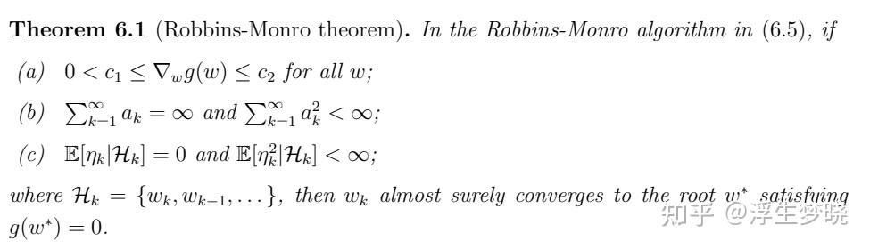

# 强化学习（RL）（从入门到PPO）（二、蒙特卡洛与时序差分）

**Author:** 浮生梦晓

**Date:** 2025-04-22

**Link:** https://zhuanlan.zhihu.com/p/22954360836

书接上文：

### MODEL FREE

首先介绍两个重要方法来处理model free的场景，model free就是上面说的不知道模型转移矩阵的情况。一种是[蒙特卡洛方法](https://zhida.zhihu.com/search?content_id=253613156&content_type=Article&match_order=1&q=%E8%92%99%E7%89%B9%E5%8D%A1%E6%B4%9B%E6%96%B9%E6%B3%95&zhida_source=entity)，另一种是[时序差分方法](https://zhida.zhihu.com/search?content_id=253613156&content_type=Article&match_order=1&q=%E6%97%B6%E5%BA%8F%E5%B7%AE%E5%88%86%E6%96%B9%E6%B3%95&zhida_source=entity)。

**两者思想是一致的：[贝尔曼公式](https://zhida.zhihu.com/search?content_id=253613156&content_type=Article&match_order=1&q=%E8%B4%9D%E5%B0%94%E6%9B%BC%E5%85%AC%E5%BC%8F&zhida_source=entity)是为了计算State Value，State Value本质上是对某一状态开始所有的discounted returns的期望，既然是model free的，那么就按照黑盒处理，求解黑盒问题最本质的方法就是采样，只要采样足够多，根据大数定理，采样到的数值的平均值就是期望(大模型梯度下降也是这个思路)。**

**基本思想：没有环境模型就要有数据，没有数据就要有环境模型，两者都没有是没办法进行强化学习训练的。**

### 蒙特卡洛算法（Monte Carlo）

蒙特卡洛是一种近似估计方法，在多个领域都有很广泛的应用，强化学习中的MC算法只是一种应用。

举个例子，使用蒙特卡洛来计算圆的面积：

蒙特卡洛在RL上的应用，首先确定的是State Value是从某一个状态出发所有discounted returns 或者 returns的期望，我们在不知道环境模型的情况下完全可以进行采样：

$V^\pi(s)=\mathbb{E}_\pi[G_t|S_t=s]\approx\frac{1}{N}\sum_{i=1}^NG_t^{(i)}$

当采样足够多时我们就具备了从每个State 执行每个Action的Action Value，可以进行策略的迭代更新，策略更新后重复的进行蒙特卡洛采样。

**但上面的蒙特卡洛方法有些问题：**

1.  我们使用什么样的采样方法，从多个状态出发还是从一个状态出发，如何尽可能全的采样到所有的<s,a>
2.  每次进行策略更新需要全部采样完成之后才能执行，需要等待采样的时间会很长。
3.  策略迭代中的策略更新是贪心的更新方法(即每次选择Q(s,a)最大的进行策略更新)，这样持续下来策略的探索性不足（没办法更好的采样到当前策略下Q(s,a)值比较低的动作，但当前策略下Action Value低不代表最优策略下Action Value低）
4.  MC算法采样到的数据是无偏的（根据大数定理），但是方差是随着抽样样本的步数的增加一直增大的，很可能是爆炸性增长。

**直接说结论：**

1.  **针对采样方案，普遍采用的方案从一个状态出发进行十分长的episode采样，这样会出现多个相同的<s,a>，对出现的次数和Value进行累加，最后求均值。（这个方案叫every-visit，如果只记录第一次遇见的<s,a>则为first-visit）**  
    下面是every-visit MC算法伪代码：  
    

2\. 对于MC采样时间过长的问题，可以使用增量式的更新方案。

$\begin{aligned}  & \bullet N(s)\leftarrow N(s)+1 \\  & \bullet V(s)\leftarrow V(s)+\frac{1}{N(s)}(G-V(S)) \end{aligned}$

增量证明过程：

3.针对策略更新每次贪心选择Action Value最大的<s,a>的情况，做出调整，普遍使用ε-Greedy，还有softmax等其他方案。

Greedy公式：

$\pi_{k+1}(a|s)=\left\{ \begin{array} {ll}1, & a=a_k^*(s), \\ 0, & a\neq a_k^*(s). \end{array}\right.$

ε-Greedy公式：

$(s_t, a_t, r_{t+1}, s_{t+1}, a_{t+1}) \\[1em]  \pi(a|s) = \begin{cases} 1 - \frac{\epsilon}{|\mathcal{A}(s)|}(|\mathcal{A}(s)| - 1), & \text{for the greedy action}, \\[1em] \frac{\epsilon}{|\mathcal{A}(s)|}, & \text{for the other } |\mathcal{A}(s)| - 1 \text{ actions}, \end{cases}$

从上面对比出就可以看出，ε-Greedy不再贪心的在策略更新时选择Action Value最大的Action，而是给了其他Action一定选择的概率，ε范围是\[0,1\]，当ε越大，策略收敛的越慢，**ε平衡xploitation（利用）和Exploration（探索）**。

**在对策略进行数据采样中尤其注重Exploitation（利用）和Exploration（探索），利用是指已经知道一个action会带来较高reward时会尽可能的选择。探索是指如果只选择固定的几个action就不会知道除此之外其他action会不会有更高的reward，需要多尝试选择其他action，增加选择性。**

**4.针对MC采样出来的数据是无偏的，但随着MDP的增长会做每一步都会叠加上方差，使得数据方差越来越大，解决方案是采样不走那么多步的数据，也就不是MC采样，使用时序差分算法或者多步时序差分算法。**

下面介绍时序差分算法

### 时序差分算法（temporal difference，TD）

时序差分算法本质上是蒙特卡洛的一种形式，上面增量式的MC算法中：

$\begin{aligned}  & \bullet N(s)\leftarrow N(s)+1 \\  & \bullet V(s)\leftarrow V(s)+\frac{1}{N(s)}(G-V(S)) \end{aligned}$

对V(s)更换一种表达方式：

$V(s_t)\leftarrow V(s_t)+\alpha[G_t-V(s_t)]$

使用a替换掉1/N(s)来做为一个超参数，G是一个discounted returns，其形式为：

$G_t=R_t+\gamma R_{t+1}+\gamma^2R_{t+2}+\cdots=\sum_{k=0}^\infty\gamma^kR_{t+k}$

每次计算G需要计算很多步保证期望值无偏，但造成数据方差偏离严重，其实可以走1步，具体来说，时序差分算法用当前获得的奖励加上下一个状态的价值估计来作为在当前状态会获得的回报，即：

$V(s_t)\leftarrow V(s_t)+\alpha[r_t+\gamma V(s_{t+1})-V(s_t)]$

上面式子中括号内的内容称为时序差分误差（[TD error](https://zhida.zhihu.com/search?content_id=253613156&content_type=Article&match_order=1&q=TD+error&zhida_source=entity)）。

为什么可以代替Gt，原因在于：

$\begin{aligned} V_{\pi}(s) & =\mathbb{E}_\pi[G_t|S_t=s] \\  & =\mathbb{E}_\pi[\sum_{k=0}^\infty\gamma^kR_{t+k}|S_t=s] \\  & =\mathbb{E}_\pi[R_t+\gamma\sum_{k=0}^\infty\gamma^kR_{t+k+1}|S_t=s] \\  & =\mathbb{E}_\pi[R_t+\gamma V_\pi(S_{t+1})|S_t=s] \end{aligned}$

**之所以叫时序差分算法的原因就是使用 t+1 步的Value来估计 t 步的Value**

**MC算法和TD算法是后面算法的基础，十分重要**

关于TD算法为什么有效的原因实际上是有数学公式的严格证明。

**Robbins-Monro算法简介：**

当面对一个函数g(w) = 0时，一个的解决方案使用数据采样的方案，随机初始化一个w，然后不断迭代求得最终符合等式要求的w。

对于模型：

$g(w)=0,$

假设我们观察的值存在一定噪声：

$\tilde{g}(w,\eta)=g(w)+\eta,$

只通过w和观察到的值来解决：

使用上面不断迭代的方案可以求解出w。

举个例子：

$g(w)=\tanh(w-1)$

如果使得g(w)=0，w应该为1才对，我们可以初始化：

$w_1=3\mathrm{~and~}a_k=1/k$

可以在图中看到，初始化的参数在使用迭代算法后最终会收敛到1。

但是迭代算法也是有一定要求束缚的：

我们重点看第二条，就是超参数a不能为0,但是最终又要收敛到0。

综合RM算法再来看TD算法，TD算法的公式是：

$V(s_t)\leftarrow V(s_t)+\alpha[r_t+\gamma V(s_{t+1})-V(s_t)]$

我们期望的是中括号内的内容需要相同，这样在一个策略下初始化Value，使用TD算法最终还是会收敛到该策略下符合中括号内容的Value，即代表该测量下所有状态的State Value收敛。

**扩展一下：** **之所以要提到RM算法还有一个很重要的原因是随机梯度下降算法也是由RM算法推导而来。**

**直观上理解：在深度神经网络中我们的目标是最小化或者最大化损失函数，而最小化或者最大化一个函数的充分条件是其梯度为0的参数位置（梯度为0的参数值可能是局部最小或最大值，这也是神经网络训练容易陷入局部最优的原因之一）。而我们对目标函数的梯度使用RM算法实际上就是梯度下降的公式，存在Batch GD、mini Batch GD以及SGD。**

$w_{k+1} = w_k - \alpha_k \frac{1}{n} \sum_{i=1}^n \nabla_w f(w_k, x_i), \quad \text{(BGD)} \\[1em]  w_{k+1} = w_k - \alpha_k \frac{1}{m} \sum_{j \in \mathcal{I}_k} \nabla_w f(w_k, x_j), \quad \text{(MBGD)} \\[1em]  w_{k+1} = w_k - \alpha_k \nabla_w f(w_k, x_k). \quad \text{(SGD)}$

对于BGD是我们真正优化的目标，但对于训练样本过大情况无法直接训练，SGD是单个样本来做为迭代数据，这样会造成梯度方向不稳定，因此我们普遍采用minibatch GD方案。

**TD算法的详细公式：**

TD error反应了两个时间步之间的差异，我们迭代的目标是使得TD error为0。

**需要重点说明的一点：不管是MC算法还是TD算法，其作用都是来estimate价值函数，包括状态价值(State Value)和动作价值(Action Value)。动作价值的估计实际上已经完成了策略迭代中的策略评估部分。**

前面提到的TD算法是在评估状态价值(State Value)，其实可以直接来评估动作价值(Action Value)

### **[Sarsa算法](https://zhida.zhihu.com/search?content_id=253613156&content_type=Article&match_order=1&q=Sarsa%E7%AE%97%E6%B3%95&zhida_source=entity)：**

### $q_{t+1}(s_t, a_t) = q_t(s_t, a_t) - \alpha_t(s_t, a_t)\left[q_t(s_t, a_t) - (r_{t+1} + \gamma q_t(s_{t+1}, a_{t+1}))\right], \\[1em]  q_{t+1}(s, a) = q_t(s, a), \quad \text{for all } (s,a) \neq (s_t, a_t),$

为什么叫Sarsa，是因为上面公式中需要很多这样的序列：

$(s_t,a_t,r_{t+1},s_{t+1},a_{t+1})$

当使用Sarsa算法计算出当前策略下每个<s,a>对的Action Value后，即完成了策略迭代中的策略评估部分之后，直接使用greedy或ε-Greedy来进行策略更新。

**Sarsa伪代码：**

再次强调一下，MC算法是无偏的，但是方差比较大，TD算法是有偏的（下一时刻的State Value预估的），但是方差比较小（因为只有一步的状态转移）。如何平衡两者？可以使用多步TD算法。也叫做n-steps Sarsa： $\text{Sarsa} \leftarrow \quad G_t^{(1)} = R_{t+1} + \gamma q_\pi(S_{t+1}, A_{t+1}), \\[0.5em]  \quad G_t^{(2)} = R_{t+1} + \gamma R_{t+2} + \gamma^2 q_\pi(S_{t+2}, A_{t+2}), \\[0.5em]  \quad \vdots \\[0.5em]  n\text{-step Sarsa} \leftarrow \quad G_t^{(n)} = R_{t+1} + \gamma R_{t+2} + \cdots + \gamma^n q_\pi(S_{t+n}, A_{t+n}), \\[0.5em]  \quad \vdots \\[0.5em]  \text{MC} \leftarrow \quad G_t^{(\infty)} = R_{t+1} + \gamma R_{t+2} + \gamma^2 R_{t+3} + \gamma^3 R_{t+4} \cdots$

**总结下：原始TD算法是预估State Value，根据当前State Value可以使用值迭代更新或者计算出Action Value来进行策略更新，Sarsa则直接预估Action Value完成策略迭代中的策略评估阶段，再进行策略更新。MC既可以预估State Value也可以预估Action Value，以上都是针对贝尔曼公式开展迭代的。为什么不能直接对最优贝尔曼进行迭代，即直接完成策略更新，也就是预估出当前策略下最优的Action Value，这就是[Q-learning](https://zhida.zhihu.com/search?content_id=253613156&content_type=Article&match_order=1&q=Q-learning&zhida_source=entity)思路。**

### Q-learning算法 $q_{t+1}(s_t, a_t) = q_t(s_t, a_t) - \alpha_t(s_t, a_t)\left[q_t(s_t, a_t) - \left(r_{t+1} + \gamma \max_{a \in \mathcal{A}(s_{t+1})} q_t(s_{t+1}, a)\right)\right], \\[1em]  q_{t+1}(s, a) = q_t(s, a), \quad \text{for all } (s,a) \neq (s_t, a_t),$

Q-learning既有[on-policy](https://zhida.zhihu.com/search?content_id=253613156&content_type=Article&match_order=1&q=on-policy&zhida_source=entity)版本也有[off-policy](https://zhida.zhihu.com/search?content_id=253613156&content_type=Article&match_order=1&q=off-policy&zhida_source=entity)版本

### ON-POLICY AND OFF-POLICY

**在上面介绍的所有model-free算法中，不管是蒙特卡洛还是时序差分中的Sarsa、Q-learning，其都是使用策略迭代方案，首先要进行策略评估，其次进行策略更新，在策略评估阶段首先需要在当前策略下去生成数据，然后根据生成的数据来进行策略评估，最后进行策略更新，其流程中主要有两个策略部分：1、一个策略生成数据。2、根据生成的数据来进行策略评估（策略评估是计算价值函数，不涉及到策略本身）。生成数据的策略称为行为策略，需要更新的策略称为目标策略。这两个策略如果是同一个则属于on-policy，这两个策略如果不是同一个则属于off-policy。**

**online and offline**

**在这里顺便提一下online和offline的概念，online的意思是说rl的训练是基于真实环境的，这样训练的数据与真实环境的数据是无偏的，通过online方式训练的智能体在真实世界执行是没有gap的。offline的意思是在非真实环境中进行训练，很可能在真实环境中采样困难，如无人驾驶等，真实环境中试错昂贵，因此可能会在模拟环境中进行训练，offline方案在真实环境中评估时可能会存在gap。**

**MC和Sarsa属于on-policy**

**Q-learning既可以是on-policy也可以是off-policy**

直观来理解：比如你在打英雄联盟游戏，on-policy相当于你每执行一步或几步动作旁边都会有一个教练在指导你下一步如何走的更好。off-policy相当于拿出一些职业选手比赛视频和黑铁选手比赛视频，让你自己去看，多学习职业选手操作，别学习黑铁选手。

**一般来说，on-policy是策略自身产生数据然后提升自己，其最终效果会优于off-policy，但每次都要自己去产生数据，且产生的数据一般会比较局部，可能会遗漏一些重要的<s,a>导致陷入局部最优。**

**off-policy是由其他策略产生，可以存储在buffer中，数据分布更加global，可以是专家数据，但是其与实际目标策略的数据分布存在差异，需要使用重要性采样等技术来弥补，且与真实环境数据存在差异，使得最终模型泛化性能较差。**

## 参考资料：

### 书籍：

-   蘑菇书：[https://datawhalechina.github.io/easy-rl/#/](https://link.zhihu.com/?target=https%3A//datawhalechina.github.io/easy-rl/%23/)
-   强化学习的数学原理：[https://github.com/MathFoundationRL/Book-Mathematical-Foundation-of-Reinforcement-Learning](https://link.zhihu.com/?target=https%3A//github.com/MathFoundationRL/Book-Mathematical-Foundation-of-Reinforcement-Learning)
-   动手学强化学习：[https://hrl.boyuai.com/](https://link.zhihu.com/?target=https%3A//hrl.boyuai.com/)

### 视频：

-   [台湾大学李宏毅教授——深度强化学习](https://link.zhihu.com/?target=https%3A//www.bilibili.com/video/BV1XP4y1d7Bk/%3Fspm_id_from%3D333.337.search-card.all.click)
-   [西湖大学赵世钰教授——强化学习的数学原理](https://link.zhihu.com/?target=https%3A//www.bilibili.com/video/BV1sd4y167NS/%3Fspm_id_from%3D333.337.search-card.all.click)
-   [上海交大张伟楠教授——强化学习课程](https://link.zhihu.com/?target=https%3A//www.bilibili.com/video/BV1jUHdePEUZ/%3Fspm_id_from%3D333.1387.upload.video_card.click)