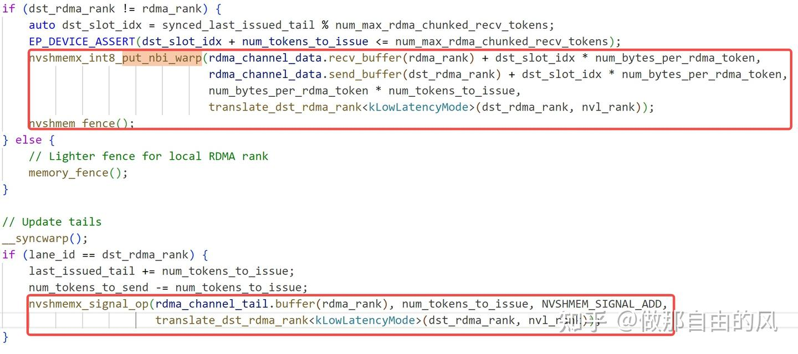

# 谈谈deepEP中的NVSHMEM

**Author:** 做那自由的风

**Date:** 2025-04-22

**Link:** https://zhuanlan.zhihu.com/p/1898141047164507218

### **引言**

从deepseek大火到现在也已经有段时间了，笔者在三月份的时候也为了研究deepseek开源的专为MoE设计的通信库[deepEP](https://zhida.zhihu.com/search?content_id=256825569&content_type=Article&match_order=1&q=deepEP&zhida_source=entity)搞得焦头烂额过一段时间，当时也在各个网上搜过nvshmem对应的源码解析，感觉缺少一篇和deepEP关系紧密的nvshmem介绍的文章。笔者也是终于抽出时间，理了一下自己这一个多月来对于nvshmem的理解，顺便也留了点坑希望有懂行的朋友可以解答，如有错误，请大家见谅！

注：**本篇中对于nvshmem的介绍针对的是ibrc的收发模式**，与最火的ibgda是两套不同的底层通信方式，想了解ibgda的朋友可以注意下，以免引起混淆。

### **deepEP中的nvshmem**

在详细介绍之前，先简单介绍下nvshmem具体在deepEP中做了什么。nvshmem本质上起到的作用，是替代了nccl负责底层网络通信。虽然大致上，整体流程与NCCL类似，包含建链、收发等部分。然而，NVSHMEM比起NCCL存在很大的不同，在NCCL中，通信实际上实现的是send\\recv操作，通过在两边收发时维护类似transmitted、done等指针，来实现收发端的同步，其中，send端下发的wr一定会和recv端的一个wr一一对应。然而在NVSHMEM里，则完全不一样，收发完全是单边操作，由发送端直接往接收端执行put，或由接收端直接执行get，在deepEP中，收发端的同步，则是由一个额外的atomic操作来实现，这也是为什么在ibrc传输模式下，**nvshmem原生只能用单个qp进行收发**，详细逻辑介绍在下文中。

### **nvshmem ibrc概述**

在介绍deepEP是如何调用nvshmem前，先详细介绍下nvshmem内部ibrc模式是如何实现的。

### **nvshmem ibrc建链**

在ibrc中，提供了qp建链的对应接口，例如ep\_create(...)与ep\_count(...)等等，此处的ep也就是我们常说的qp。在函数nvshmemt\_ibrc\_connect\_endpoints(...)进行具体的nvshmem的pe(processing element，等价于nccl中的rank)的建链。

需要注意的是，**原生NVSHMEM只支持使用单个qp**，这点很重要，具体的原因会在下文介绍，此处可以先记下来。在nvshmemt\_ibrc\_connect\_endpoint(...)中，首先会选择上层传下来的，选取的selected\_dev\_id（具体如何选取网卡的，可以自行查看src/host/transport/transport.cpp中的nvshmemi\_setup\_connections(...)，此处不加以赘述)，在其上根据pes的数量以及设定的ep\_count数量建立qp(**虽然建立了多个，但其实只用一个，nvshmem的代码写的真的很奇怪，好多的宏甚至重定义加不使用。。。**)

```cpp
// src/modules/transport/ibrc/ibrc.cpp:nvshmemt_ibrc_connect_endpoints(...)
​
int nvshmemt_ibrc_connect_endpoints(nvshmem_transport_t t, int *selected_dev_ids,
                                    int num_selected_devs) {
    // ... ...
  
    if (num_selected_devs > 1) {
        INFO(ibrc_state->log_level,
             "IBRC only supports One NIC / PE. All other NICs will be ignored.");
    }
    
    // ... ...
    
    for (int j = 0; j < n_pes; j++) {
        for (int k = 0; k < ep_count; k++) {
            nvshmemt_ibrc_ep_create(&ibrc_state->ep[j * ep_count + k], ibrc_state->selected_dev_id,
                                    t, ibrc_state);
            NVSHMEMI_NZ_ERROR_JMP(status, NVSHMEMX_ERROR_INTERNAL, out,
                                  "transport create ep failed \n");
            status = nvshmemt_ibrc_ep_get_handle(&local_ep_handles[j * ep_count + k],
                                                 ibrc_state->ep[j * ep_count + k]);
            NVSHMEMI_NZ_ERROR_JMP(status, NVSHMEMX_ERROR_INTERNAL, out,
                                  "transport get ep handle failed \n");
        }
    }
    
    // ... ...
}
```

随后，通过bootstrap网络进行一次alltoall，获取其余的pe建立的qp对应的handle，其中包含对应建链所需的信息，为了后续执行connect服务

```cpp
    status = t->boot_handle->alltoall((void *)local_ep_handles, (void *)ep_handles,
                                      sizeof(struct ibrc_ep_handle) * ep_count, t->boot_handle);
    NVSHMEMI_NZ_ERROR_JMP(status, NVSHMEMX_ERROR_INTERNAL, out,
                          "allgather of ep handles failed \n");
```

在交换得到了其他pe对应的ep信息后，执行connect操作，随后，ep建链正式完成

```cpp
// src/modules/transport/ibrc/ibrc.cpp:nvshmemt_ibrc_connect_endpoints(...)
​
int nvshmemt_ibrc_connect_endpoints(nvshmem_transport_t t, int *selected_dev_ids,
                                    int num_selected_devs) {    
    // ... ...
    for (int j = 0; j < n_pes; j++) {
        for (int k = 0; k < ep_count; k++) {
            status = nvshmemt_ibrc_ep_connect(ibrc_state->ep[j * ep_count + k],
                                              &ep_handles[j * ep_count + k]);
            NVSHMEMI_NZ_ERROR_JMP(status, NVSHMEMX_ERROR_INTERNAL, out,
                                  "transport create connect failed \n");
        }
    }
    // ... ...
}
```

### **nvshmem ibrc rma(rdma put & get)**

nvshmem中的rdma传输，直接实现了rdma的put与get，不需要对端的参与，在收发时，根据是否启用proxy，选取ep，填充wr信息，根据上层传入的verb类型决定对应的wr type为IBV\_WR\_RDMA\_WRITE或IBV\_WR\_RDMA\_READ，随后调用ibv\_post\_send(...)进行发送。整体逻辑与NCCL的ncclIbIsend并无区别，在此不进行赘述。

### **nvshmem ibrc amo(rdma atomic)**

nvshmem中的amo操作，在我看来，起到的是nvshmem ibrc收发中的核心，如上所示，nvshmem中，对应的收发不做任何的同步，完全是单边操作，因此，便引入了amo操作来做所谓的同步机制。

amo代码如下，其中选取了与rma操作中相同的同一个qp，根据上层传入的verb类型，填充wr信息，将其下发到qp中，本质amo操作往往起到的作用是类似累加某个具体的index，用来同步收发端收发位置。**为什么原生nvshmem只支持单个qp的原因也是在于，需要确保amo操作执行时，前面的rma操作已经全部完成，若使用多个qp，则执行amo操作时，不能保证之前的rma操作以及全部完成，则会出现数据出错的问题！**

```cpp
int nvshmemt_ibrc_amo(struct nvshmem_transport *tcurr, int pe, void *curetptr, amo_verb_t verb,
                      amo_memdesc_t *remote, amo_bytesdesc_t bytesdesc, int is_proxy) {
    int status = 0;
    transport_ibrc_state_t *ibrc_state = (transport_ibrc_state_t *)tcurr->state;
    struct ibrc_ep *ep;
    struct ibv_send_wr *sr, **bad_sr;
    struct ibv_sge *sge;
    int op_id;
    struct ibrc_atomic_op op;
​
    if (is_proxy) {
        ep = ibrc_state->ep[(ibrc_state->ep_count * pe + ibrc_state->proxy_ep_idx)];
    } else {
        ep = ibrc_state->ep[(ibrc_state->ep_count * pe)];
    }
​
    status = check_poll_avail(ep, WAIT_ANY);
    NVSHMEMI_NZ_ERROR_JMP(status, NVSHMEMX_ERROR_INTERNAL, out, "check_poll failed \n");
​
    op_id = ep->head_op_id & IBRC_REQUEST_QUEUE_MASK;  // ep->head_op_id % ibrc_qp_depth
    sr = &(ep->req + op_id)->sr;
    bad_sr = &(ep->req + op_id)->bad_sr;
    sge = &(ep->req + op_id)->sge;
​
    memset(sr, 0, sizeof(ibv_send_wr));
    memset(sge, 0, sizeof(ibv_sge));
​
    sr->num_sge = 1;
    sr->sg_list = sge;
    sr->wr_id = NVSHMEMI_OP_AMO;
    sr->next = NULL;
​
    if (use_ib_native_atomics) {
        if (verb.desc == NVSHMEMI_AMO_SIGNAL_ADD) {
            if (bytesdesc.elembytes == 8) {
                sr->opcode = IBV_WR_ATOMIC_FETCH_AND_ADD;
                sr->send_flags = IBV_SEND_SIGNALED;
​
                sr->wr.atomic.remote_addr = (uint64_t)remote->remote_memdesc.ptr;
                assert(remote->remote_memdesc.handle);
                sr->wr.atomic.rkey =
                    ((struct nvshmemt_ib_common_mem_handle *)remote->remote_memdesc.handle)->rkey;
                sr->wr.atomic.compare_add = remote->val;
​
                sge->length = bytesdesc.elembytes;
                sge->addr = (uintptr_t)dummy_local_mem->ptr;
                sge->lkey = dummy_local_mem->mr->lkey;
                goto post_op;
            }
        }
    }
​
#ifdef NVSHMEM_USE_GDRCOPY
    // if gdrcopy is available, use it for all atomics to guarantee
    // atomicity across different ops
    if (use_gdrcopy) {
        ibrc_mem_handle_info_t *mem_handle_info;
​
        // assuming GDRCopy availability is uniform on all nodes
        op.op = verb.desc;
        op.addr = remote->remote_memdesc.ptr;
        op.retaddr = remote->retptr;
        op.retflag = remote->retflag;
        op.compare = remote->cmp;
        op.swap_add = remote->val;
        op.elembytes = bytesdesc.elembytes;
​
        // send rkey info
        if (verb.desc > NVSHMEMI_AMO_END_OF_NONFETCH) {
            mem_handle_info = get_mem_handle_info(tcurr, remote->retptr);
            op.retrkey = mem_handle_info->mr->rkey;
        }
​
        sr->opcode = IBV_WR_SEND;
        sr->send_flags = IBV_SEND_SIGNALED | IBV_SEND_INLINE;
        sge->length = sizeof(struct ibrc_atomic_op);
        assert(sge->length <= IBRC_BUF_SIZE);
        sge->addr = (uintptr_t)&op;
        sge->lkey = 0;
​
        atomics_issued++;
        TRACE(ibrc_state->log_level, "[%d] atomic issued : %lu \n", getpid(), atomics_issued);
        goto post_op;
    }
#endif
​
    if (use_ib_native_atomics) {
        if (verb.desc == NVSHMEMI_AMO_ADD) {
            if (bytesdesc.elembytes == 8) {
                sr->opcode = IBV_WR_ATOMIC_FETCH_AND_ADD;
                sr->send_flags = IBV_SEND_SIGNALED;
​
                sr->wr.atomic.remote_addr = (uint64_t)remote->remote_memdesc.ptr;
                assert(remote->remote_memdesc.handle);
                sr->wr.atomic.rkey =
                    ((struct nvshmemt_ib_common_mem_handle *)remote->remote_memdesc.handle)->rkey;
                sr->wr.atomic.compare_add = remote->val;
​
                sge->length = bytesdesc.elembytes;
                sge->addr = (uintptr_t)dummy_local_mem->ptr;
                sge->lkey = dummy_local_mem->mr->lkey;
                goto post_op;
            }
        } else if (verb.desc == NVSHMEMI_AMO_SIGNAL || verb.desc == NVSHMEMI_AMO_SIGNAL_SET) {
            sr->opcode = IBV_WR_RDMA_WRITE;
            sr->send_flags = IBV_SEND_SIGNALED;
            sr->send_flags |= IBV_SEND_INLINE;
​
            sr->wr.rdma.remote_addr = (uint64_t)remote->remote_memdesc.ptr;
            assert(remote->remote_memdesc.handle);
            sr->wr.rdma.rkey =
                ((struct nvshmemt_ib_common_mem_handle *)remote->remote_memdesc.handle)->rkey;
​
            sge->length = bytesdesc.elembytes;
            sge->addr = (uintptr_t)&remote->val;
            sge->lkey = 0;
            goto post_op;
        }
    }
​
    NVSHMEMI_ERROR_EXIT("RMA/AMO verb %d not implemented\n", verb.desc);
​
post_op:
    status = ibv_post_send(ep->qp, sr, bad_sr);
    NVSHMEMI_NZ_ERROR_JMP(status, NVSHMEMX_ERROR_INTERNAL, out, "ibv_post_send failed \n");
​
    ep->head_op_id++;
​
out:
    return status;
}
```

### **deepEP与nvshmem**

很多人可能会好奇，在deepEP中，是如何通过调用接口，转到执行nvshmem中对应的rma与amo操作的。在deepEP中，主要通过调用如下的两个函数实现：

  



  

其中，nvshmemx\_int8\_put\_nbi\_warp(...)即rma操作的上层接口，nvshmemx\_signal\_op(...)即amo操作的上层接口，可以看到，**在deepEP中，先调用rma操作，随后调用amo操作进行同步**。

下面我将详细介绍对应这两个接口如何在nvshmem内部调用实现rma与amo操作。

### **nvshmemx\_int8\_put\_nbi\_warp**

nvshmemx\_int8\_put\_nbi\_warp的声明与定义如下所示，可以看到，nvshmemx\_int8\_put\_nbi\_warp(...)本质上是调用nvshmemi\_put\_nbi\_threadgroup(...)实现

```c
// declaration
#define NVSHMEMX_DECL_TYPE_PUT_NBI_THREADGROUP(NAME, TYPE)                                         \
    __device__ void nvshmemx_##NAME##_put_nbi_warp(TYPE *dest, const TYPE *source, size_t nelems,  \
                                                   int pe);                        \
    __device__ void nvshmemx_##NAME##_put_nbi_block(TYPE *dest, const TYPE *source, size_t nelems, \
                                                    int pe);
​
NVSHMEMI_REPT_FOR_STANDARD_RMA_TYPES(NVSHMEMX_DECL_TYPE_PUT_NBI_THREADGROUP)
#undef NVSHMEMX_DECL_TYPE_PUT_NBI_THREADGROUP
​
// definition
#define NVSHMEM_TYPE_PUT_NBI_THREADGROUP(Name, Type, Group)                                      \
    NVSHMEMI_DEVICE_PREFIX NVSHMEMI_DEVICE_ALWAYS_INLINE void nvshmemx_##Name##_put_nbi_##Group( \
        Type *dest, const Type *source, size_t nelems, int pe) {                  \
        nvshmemi_put_nbi_threadgroup<Type, nvshmemi_threadgroup_##Group>(dest, source, nelems,   \
                                                                         pe);         \
    }
```

nvshmemi\_put\_nbi\_threadgroup(...)则直接通过调用nvshmemii\_put\_nbi\_threadgroup(...)实现。在nvshmemii\_put\_nbi\_threadgroup(...)中，则调用nvshmemi\_transfer\_rma\_nbi(...)去生成对应的rma请求。在nvshmemi\_transer\_rma\_nbi(...)中，直接调用nvshmemi\_proxy\_rma\_nbi(...)来使用线程生成对应的rma请求，需要注意的是，与ibgda不同，在其中，**仅threadgroup(warp/block)中的第一个thread来执行该操作**，这也是由于ibrc模式的传输本质使用proxy线程进行控制，不需要像ibgda一样使warp中的所有thread各司其职，因此，仅需要一个thread生成rma request即可。

```cpp
template <threadgroup_t SCOPE, nvshmemi_op_t channel_op>
NVSHMEMI_TRANSFER_STATIC __device__ NVSHMEMI_TRANSFER_INLINE void nvshmemi_transfer_rma_nbi(
    void *rptr, void *lptr, size_t bytes, int pe) {
#ifdef NVSHMEM_IBGDA_SUPPORT
    ... ...
#endif
    {
        int myIdx = nvshmemi_thread_id_in_threadgroup<SCOPE>();
        if (!myIdx) nvshmemi_proxy_rma_nbi(rptr, lptr, bytes, pe, channel_op);
    }
}
```

nvshmemi\_proxy\_rma\_nbi(...)直接调用transfer\_dma(...)下发rma请求。在transfer\_dma(...)中，我们生成了四个request，将这些request存入proxy\_channels\_buff(一个可理解为环式buff），这些request中存放对应的rma所需的信息，以在proxy中获取，对应四个requests存放内容如下：

```cpp
NVSHMEMI_STATIC NVSHMEMI_DEVICE_ALWAYS_FORCE_INLINE __device__ void transfer_dma(
    void *rptr, void *lptr, size_t bytes, int pe, int channel_op) {
    // ... ...
    void *buf_ptr = nvshmemi_device_state_d.proxy_channels_buf;
    // ... ...
​
    req = (uint64_t *)((uint8_t *)buf_ptr + (idx & (CHANNEL_BUF_SIZE - 1)));
    uint64_t curr_flag = !((idx >> nvshmemi_device_state_d.proxy_channel_buf_logsize) & 1);
    // ... ...
​
    /* base_request_t
     * 32 | 8 | 8 | 8 | 8
     * roffset_high | roffset_low | op | group_size | flag */
    // ... ... 
​
    /* put_dma_request_0
     * 56 | 8
     * laddr_high | flag */
    // ... ... 
​
    /* put_dma_request_1
     * 32 | 16 | 8 | 8
     * size_high | size_low | laddr_low | flag */
    // ... ...
​
    /* put_dma_request_2
     * 32 | 16 | 8 | 8
     * recv2 | pe | resv1 | flag */
    // ... ...
}
```

而当对应的requests存入buff中后，我们可以在proxy progrss中，通过progress\_channels(...)中获取的channel\_req\[i\]->op类型，调用process\_channel\_dma(...)操作来真正执行rma操作，process\_channel\_dma(...)函数则通过类似transfer\_dma(...)存取request的方式，依次拿到四个requests，调用nvshmemi\_process\_multisend\_rma(...)函数，在其中执行status = tcurr->host\_ops.rma(...)，也即ibrc中真正的rma，至此，deepEP中的put\_nbi\_warp到nvshmem中的rma的完整调用链已经介绍完成。

```cpp
static inline void nvshmemi_process_multisend_rma(struct nvshmem_transport *tcurr, int transport_id,
                                                  int pe, rma_verb_t verb, void *rptr, void *lptr,
                                                  size_t size, bool is_proxy) {
    // ... ...
​
    while (size_remaining) {
        // ... ...
        status = tcurr->host_ops.rma(tcurr, pe, verb, &remotedesc, &localdesc, bytes, is_proxy);
        if (unlikely(status)) {
            NVSHMEMI_ERROR_PRINT("aborting due to error in process_channel_dma\n");
            exit(-1);
        }
        size_remaining -= chunk_size;
        lptr = (char *)lptr + chunk_size;
        rptr = (char *)rptr + chunk_size;
    }
}
```

### **nvshmemx\_signal\_op**

nvshmemx\_signal\_op(...)的实现相比put\_nbi\_warp(...)更为简洁，具体来说，nvshmemx\_signal\_op(...)直接调用nvshmemi\_signal\_op(...)实现，而nvshmemi\_signal\_op(...)则直接调用nvshmemi\_transfer\_amo\_nonfetch(...)，随后进一步调用nvshmemi\_proxy\_amo\_nonfetch(...)函数，在该函数里，直接调用amo(...)函数

```cpp
NVSHMEMI_DEVICE_PREFIX NVSHMEMI_DEVICE_ALWAYS_INLINE void nvshmemx_signal_op(uint64_t *sig_addr,
                                                                             uint64_t signal,
                                                                             int sig_op, int pe) {
    nvshmemi_signal_op(sig_addr, signal, sig_op, pe);
}
​
__device__ NVSHMEMI_DEVICE_ALWAYS_INLINE void nvshmemi_signal_op(uint64_t *sig_addr,
                                                                 uint64_t signal, int sig_op,
                                                                 int pe) {
    const void *peer_base_addr =
        (void *)__ldg((const long long unsigned *)nvshmemi_device_state_d.peer_heap_base_p2p + pe);
    if (sig_op == NVSHMEMI_AMO_SIGNAL_SET && peer_base_addr != NULL) {
        // ... ...
    } else if (nvshmemi_device_state_d.job_connectivity <= NVSHMEMI_JOB_GPU_LDST) {
        // ... ...
    } else {
        nvshmemi_transfer_amo_nonfetch<uint64_t>((void *)sig_addr, signal, pe,
                                                 (nvshmemi_amo_t)sig_op);
    }
}
​
NVSHMEMI_TRANSFER_STATIC __device__ NVSHMEMI_TRANSFER_INLINE void nvshmemi_transfer_amo_nonfetch(
    void *rptr, T value, int pe, nvshmemi_amo_t op) {
#ifdef NVSHMEM_IBGDA_SUPPORT
    if (nvshmemi_device_state_d.ibgda_is_initialized) {
        nvshmemi_ibgda_amo_nonfetch<T>(rptr, value, pe, op);
    } else
#endif
    {
        nvshmemi_proxy_amo_nonfetch<T>(rptr, value, pe, op);
    }
}
​
template <typename T>
NVSHMEMI_STATIC __device__ NVSHMEMI_DEVICE_ALWAYS_INLINE void nvshmemi_proxy_amo_nonfetch(
    void *rptr, T swap_add, int pe, nvshmemi_amo_t op) {
    amo<T>(rptr, 0 /* dummy value */, swap_add, 0, pe, op);
}
```

在amo(...)中，我们实现类似transfer\_dma(...)类似的事。我们同样在amo(...)函数中生成四个requests，具体的定义如下：

```cpp
template <typename T>
NVSHMEMI_STATIC __device__ NVSHMEMI_DEVICE_ALWAYS_INLINE void amo(
    // ... ...
​
    /* base_request_t
     * 32 | 8 | 8 | 8 | 8
     * roffset_high | roffset_low | op | group_size | flag */
    // ... ...
​
    /* amo_request_0
     * 32 | 16 | 8 | 8
     * swap_add_low | pe | amo | flag */
    // ... ...
​
    /* amo_request_1
     * 32 | 16 | 8 | 8
     * swap_add_high | size | compare_low | flag */
    // ... ...
​
    /* amo_request_2
     * 32 | 16 | 8 | 8
     * comapare_high | flag */
    // ... ...
​
    /* amo_request_3
     * 32 | 16 | 8 | 8
     * g_buf_counter_low | flag */
    // ... ...
}
```

在proxy中，我们使用proxy\_channel\_amo(...)来执行amo操作。我们依次获取amo中生成的四个request，获取amo操作所需的参数，调用tcurr->host\_ops.amo(...)来执行，也即我们所说的nvshmemt\_ibrc\_amo(...)。

```c
int process_channel_amo(proxy_state_t *state, proxy_channel_t *ch, int *is_processed) {
    // ... ...
    status = tcurr->host_ops.amo(tcurr, pe, NULL, verb, &memdesc, bytes, 1);
    // ... ...
}
```

### **结语**

本文笔者大致总结了一下deepEP中nvshmem ibrc的内容，主要包括rma与amo的关系以及deepEP中的接口如何一步步执行到nvshmem中对应的rma与amo，期望能给同样研究deepEP的同行一点帮助，另外，后续有空的话也会更新ibgda和low\_lantency相关的东西，敬请期待。