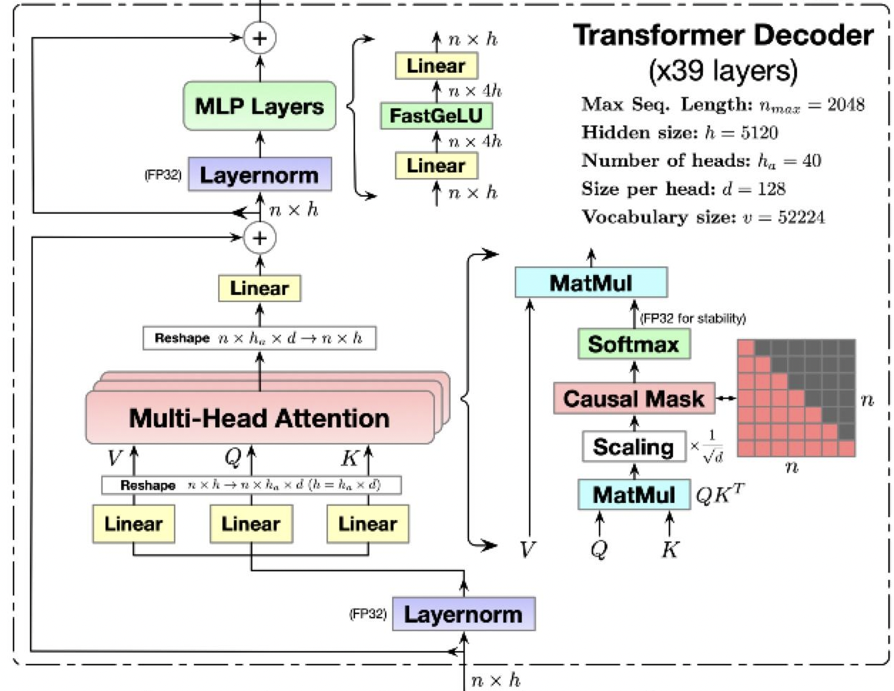
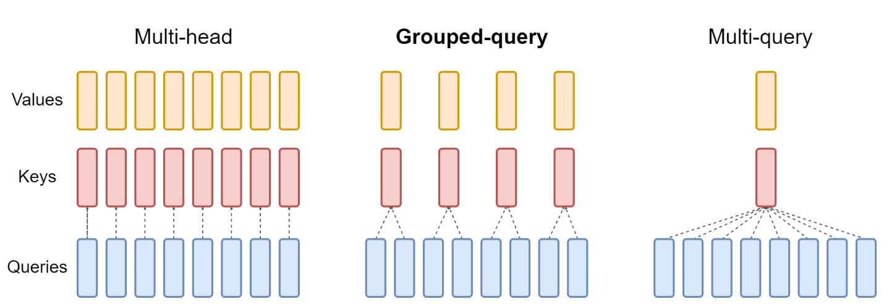
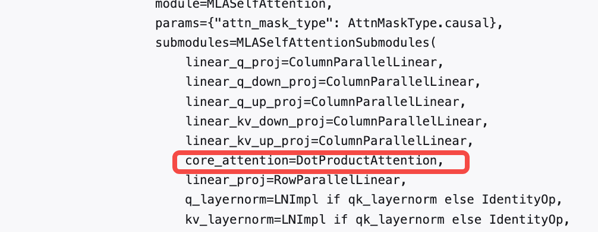

# DeepSeek MLA理解与Megatron-LM实现

**Author:** 想飞的石头

**Date:** 2025-04-23

**Link:** https://zhuanlan.zhihu.com/p/1896152940420510152

​

目录

收起

基本原理

LLM模型推理

减少KVcache

MLA

总结

Megatron MLA代码理解

MLA代码入口

核心逻辑：get\_query\_key\_value\_tensors

总结

参考文章：

本文原理讲解部分主要参考：

[姜富春：deepseek技术解读(1)-彻底理解MLA（Multi-Head Latent Attention）2582 赞同 · 141 评论](https://zhuanlan.zhihu.com/p/16730036197) 文章

[缓存与效果的极限拉扯：从MHA、MQA、GQA到MLA - 科学空间|Scientific Spaces​spaces.ac.cn/archives/10091](https://link.zhihu.com/?target=https%3A//spaces.ac.cn/archives/10091)

* * *

## 基本原理

MLA主要通过优化[KV-cache](https://zhida.zhihu.com/search?content_id=256517240&content_type=Article&match_order=1&q=KV-cache&zhida_source=entity)来减少显存占用，从而提升推理性能。

### LLM模型推理

LLM推理分为两个阶段：**prefill阶段**和 **decode阶段**

-   **prefill阶段**：是模型对全部的Prompt tokens一次性并行计算，最终会生成第一个输出token；
-   **decode阶段**：每次生成一个token，直到生成EOS（end-of-sequence）token，产出最终的response。

在LLM生成过程中，是一个基于前向序token列预测下一个token的过程，序列中的token（无论是prefill阶段，还是decode阶段）只与它前面的token交互来计算attention，我们也称这种Attention为[Causal Attention](https://zhida.zhihu.com/search?content_id=256517240&content_type=Article&match_order=1&q=Causal+Attention&zhida_source=entity)。矩阵计算上通过一个下三角的Causal Attention Mask来实现token交互只感知前向序列。

以某个序列的 $t$ 位置的token为例，计算某层Transformer的attention，如下公式：

$$[q_{t,1}; q_{t,2}; \ldots; q_{t,n_h}] = q_t, \tag{1}  $$

$$[k_{t,1}; k_{t,2}; \ldots; k_{t,n}] = k_t,  \tag{2} $$

$$[v_{t,1}; v_{t,2}; \ldots; v_{t,n}] = v_t, \tag{3}$$
 
$$o_{t,i} = \sum_{j=1}^{t} Softmax_{j}\left(\frac{q_{t,i}^{T} k_{j,i}}{\sqrt{d_h}}\right)v_{j,i} \tag{4} $$
 
$$u_{t} = W^{O} [o_{t,1}; o_{t,2}; \ldots; o_{t,n_h}] \tag{5}$$
 公式中的符号：$t$表示计算序列中第$t$个token；$q,k,v,o$中的两个下标，前一个表示token位置，后一个表示对应的Head下标。

从公式$（3）$可以看到，在计算Attention时，$t$位置的$q$只与$t$位置前的$k，v$做计算，所以我们有如下两个结论：

1.  计算前面的 $k,v$ 并不受后面token的影响;
2.  后面计算 $t+1， t+2，...., t+n$ 位置的Attention，要使用前序的 $1\to t$ 位置的 $k，v$ 的值，这是始终不变的，因此是可以缓存以减少计算;

为了加速训练和推理的效率，在token-by-token生成过程中，避免重复计算前序的$k,v$。研究者们提出把前序计算好的$k,v$缓存起来，这也就是目前主流的KV-cache的机制。

### 减少KVcache

通过修改模型结构减少kv数量， 主要有MQA和GQA，如下图：



MHA、MQA、GQA示意图

**MQA（Multi-Query Attention）**

MQA每一层的所有Head，共享同一个$k,v$来计算Attention。相对于MHA的单个Token需要保存的KV数（$2  *  l * n_h$）减少到了（$2 \times l$）个，即每一层共享使用一个$k$向量和一个$v$向量。

**GQA（Group-Query Attention）**

GQA是平衡了MQA和MHA的一种折中的方法，不是每个Head一个KV，也不是所有Head共享一个KV，而是对所有Head分组，比如分组数为$g$，那么每组：$n_h/g$个Head 共享一个KV。当$g=1$时，GQA就等价于MQA，当$g=n_h$时， GQA就等价于MHA。

**总结**

-   MHA共缓存 $2 \times l \times n_h$ 个 $k,v$；
-   MQA共缓存 $2 \times l $ 个 $k,v$；
-   GQA共缓存 $2 \times l \times g$ 个 $k,v$ ， $g$ 是分组数， $1 \le g \le n_h$， 一般取值能被 $n_h$ 整除。

### MLA

MLA计算Attention的完整公式:

$$c_t^Q = W^{DQ}h_{t}, \tag{6} $$

$$[q_{t,1}^C, q_{t,2}^C, \ldots, q_{t,n_h}^C] = q_t^C = W^{UQ}c_t^{Q} \tag{7} $$

$$[q_{t,1}^R, q_{t,2}^R, \ldots, q_{t,n_h}^R] = q_t^R = RoPE(W^{QR} c_t^{Q}) \tag{8}$$
 
$$q_{t,i} = [q_{t,i}^c; q_{t,i}^R] \tag{9} $$

$$\boxed{c_{t}^{KV}} = W^{DKV}h_t \tag{10}$$
 
$$[k_{t,1}^c, k_{t,2}^c, \ldots, k_{t,n_h}^c] = k_t^c = W^{UK} c_{t}^{KV} \tag{11}$$
 
$$\boxed{k_t^R} = RoPE(W^{K,R} h_t) \tag{12}$$
 
$$k_{t,i} = [k_{t,i}^C; k_t^R], \tag{13}$$
 
$$[v_{t,1}^c, v_{t,2}^c, \ldots, v_{t,n_h}^c] = v_t^c = W^{UV} c_{t}^{KV}, \tag{14}$$
 
$$o_{t,i} = \sum_{j=1}^{t} Softmax_{j}\left(\frac{q_{t,i}^T k_{j,i}}{\sqrt{d_h + d_h^R}}\right) v_{j,i}^c, \tag{15}$$
 
$$u_t = W^{O} [o_{t,1}; o_{t,2}; \ldots; o_{t,n_h}], \tag{16}$$
在DeepSeekV2的论文当中提到， 每个Transformer层，仅缓存上述带框的向量：$c_t^{KV}$和$k_t^R$，其大小分别为：

$c_t^{KV} $ 维度为 $d_c = 4 \times d_h =512$

$k_t^R$ 维度为 $d_h^R = d_h /2 = 64$

对比MQA，每层有k和v两个元素，相当于增加576/256=2.25倍存储。

**原理详细解读**

首先对图中公式的变量做如下解释说明：

-   $d_c$ ：MLA低秩压缩的维度，论文中取值： $d_c = 4 \times d_h$
-   $d_h$ ：是单个head的向量维度
-   $n_h$ ：是每层head的数量
-   $d$ ：隐层维度， $d = d_h \times n_h$
-   $W^{DKV} \in \mathbb{R}^{d_c \times d}$ 是低秩变换矩阵

1.  公式10对输入 $h_t$ 做一个低秩压缩，将 $d$维的输入经过 $W^{DKV}$ 变换后压缩成 $d_c$维的 $c_t^{KV}$ 。在DeepSeek-V3中 $d = 7168$ ， $d_c= 512$；
2.  通过公式11和15两个变换矩阵， 将kv的维度扩展为$d = d_h  n_h$，也就是每个Head有一个单独的$k,v$（跟MHA的KV数量一致）；
3.  公式6和7， 类似KV的逻辑，通过两个矩阵（$W^{DQ}, W^{UQ} \in \mathbb R^{d_hn_h \times d_q}$）也做了一层低秩变换，这一步Q的变换是为了减少模型的参数的数量。在Deepseek-V3里$d_q = 1536$。是KV压缩维度$d_c$的3倍。但相对于$d = 7168$还是压缩了不少；
4.  在增加RoPE位置编码并没有在上述计算出的$q_t^C,k_t^C$的基础上乘以Rope的对角矩阵。而是单独计算了两个带着位置编码的$q_t^R, k_t^R$如公式8和公式12，其中 $q_t^R, k_t^R$的向量维度$d_h^R$是个比较小的维度，DeepSeek设置为单Attention Head维度的一半：$d_h^R = d_h /2 = 64$， 这部分计算的 $k_t^R$ 实际是个MQA的计算方式，同一层中，所有的Head共享同一个 $k$；
5.  按如下公式9，13，跟已经计算的$q_t^C,k_t^C$拼接，构成完整的$q_t,k_t$向量，所以$q,k$包括两部分拼接而成：一部分是做了低秩压缩得到的$q,k$向量，一部分是增加了RoPE位置编码的$q,k$向量。（后面这部分向量是基于MQA方式计算得到的，所有Head共享1个$k$）。

为什么会单独对低秩和RoPE分别处理呢？

假设当前不增加RoPE，那么 $q,k$ 乘积计算如下，其中$(i)$ 表示变换矩阵第 $i$ 个Head的切片：

$$q_{t,i}^T \times k_{j,i}  = (W_{(i)}^{UQ} c_t^Q)^T \times W_{(i)}^{UK}c_j^{KV} = (c_t^Q)^T\times (W_{(i)}^{UQ})^TW_{(i)}^{UK}  \times c_j^{KV} \tag{17}$$

**不加RoPE，我们可以提前计算好** $ (W_{(i)}^{UQ})^TW_{(i)}^{UK}  $ **， 也就上面说的** $W^{UK}$ **吸收到** $W^{UQ}$ **中，**这样在做 $q$ 的变换的时候，也就同时计算了 $W^{UK}$ 矩阵的乘法**。**

**这样的好处是，我们只需要缓存** $c_j^{KV}$ **，而不是缓存** $W_{(i)}^{UK}  \times c_j^{KV}$ 的结果。 $c_j^{KV} $ 维度只有 $4d_h$的长度，而 $W_{(i)}^{UK}  \times c_j^{KV}$ 是个 $4d_h \to d$ 的变换，也就是完全恢复了隐层的维度 $d = d_h * n_h =64d_h$ (DeepSeek-v3 $n_h$ 配置为64)。**这也是MLA的压缩KV Cache的核心原理。**

加上Rope后，计算 $q,k$ 乘积，会在 $ (W_{(i)}^{UQ})^T$ 和 $W_{(i)}^{UK}  $ 之间，增加一个融合了相对位置的变量 $\mathcal R_{t-j}$ ：

$$q_{t,i}^T \times k_{j,i}  = (\mathcal R_tW_{(i)}^{UQ} c_t^Q )^T \times  \mathcal R_j W_{(i)}^{UK}c_j^{KV}= (c_t^Q)^T\times (W_{(i)}^{UQ})^T\mathcal R_t^T\mathcal R_j W_{(i)}^{UK}  \times c_j^{KV}  =  (c_t^Q)^T\times (W_{(i)}^{UQ})^T\mathcal R_{t-j} W_{(i)}^{UK}  \times c_j^{KV} \tag{18}$$

**中间这个分量** $(W_{(i)}^{UQ})^T\mathcal R_{t-j} W_{(i)}^{UK} $ **是随这相对位置变化而变化的，并不是个固定的矩阵，因此并不能提前计算好。所以论文中说RoPE与低秩变换不兼容。**

了引入位置编码，作者在一个很小维度下，用MQA方式计算了 $q,k$ ，也就是在每层网络中，所有Head只计算一个 $k$ （如论文中公式43所示）。引入位置编码的向量维度取的比较小为： $d_h /2 = 128/2 = 64$ 。

所以最终 $q,k$ 向量通过两部分拼接而成，计算权重时，由前后两部分分别相乘再相加得到，如下公式（8）所示：

$$q_{t,i}^T \times k_{j,i}  = [q_{t,i}^C; q_{t,i}^R]^T \times [k_{j,i}^C; k_t^R] =  q_{t,i}^Ck_{j,i}^C + q_{t,i}^R k_t^R \tag{19}$$

前一项 $q_{t,i}^Ck_{j,i}^C$ 按公式17计算，通过矩阵吸收处理，全Head只缓存一个 $c_t^{KV}$ ，后一项 $q_{t,i}^R k_t^R$ 按正常MQA的方式计算，全Head只缓存了一个共享 $k$ 。

故最终我们实际缓存的向量为：

-   $c_t^{KV} $ ：维度为 $4 \times d_h =512$
-   $k_t^R$：维度为 $d_h /2 = 64$

$c_t^{KV} $ 是低秩压缩的向量， $k_t^R$ 是引入位置编码的MQA范式计算的共享 $k$

### 总结

按上述公式以及详细解释，MLA核心逻辑即希望通过低秩矩阵吸收的逻辑，仅保存低秩矩阵以达到在推理时提高端到端效率，但是因为RoPE的引入，相对位置无法来符合低秩矩阵吸收逻辑。而在苏神的文章中详细提到与DeepSeek团队的沟通采用其他的位置向量方法时，性能会有较大衰减。所以，针对RoPE单独保存64维向量建模位置信息，并拼接到无RoPE的低秩矩阵，其核心差异在于Q、K、V差异。

## Megatron MLA代码理解

### MLA代码入口

DeepSeek相关实现在[Megatron-LM](https://zhida.zhihu.com/search?content_id=256517240&content_type=Article&match_order=1&q=Megatron-LM&zhida_source=entity)中由pretrain\_gpt以及相关配置构成，其中model部分如下：

```text
def model_provider(pre_process=True, post_process=True) -> Union[GPTModel, megatron.legacy.model.GPTModel]:
    """Builds the model.

    If you set the use_legacy_models to True, it will return the legacy GPT model and if not the mcore GPT model.

    Args:
        pre_process (bool, optional): Set to true if you need to compute embedings. Defaults to True.
        post_process (bool, optional): Set to true if you need to want to compute output logits/loss. Defaults to True.


    Returns:
        Union[GPTModel, megatron.legacy.model.GPTModel]: The returned model
    """
    args = get_args()
    use_te = args.transformer_impl == "transformer_engine"

    if args.record_memory_history:
        torch.cuda.memory._record_memory_history(True,
            # keep 100,000 alloc/free events from before the snapshot
            trace_alloc_max_entries=100000,

            # record stack information for the trace events
            trace_alloc_record_context=True)

        def oom_observer(device, alloc, device_alloc, device_free):
            # snapshot right after an OOM happened
            print('saving allocated state during OOM')
            snapshot = torch.cuda.memory._snapshot()
            from pickle import dump
            dump(snapshot, open(f"oom_rank-{torch.distributed.get_rank()}_{args.memory_snapshot_path}", 'wb'))

        torch._C._cuda_attach_out_of_memory_observer(oom_observer)

    print_rank_0('building GPT model ...')
    # Experimental loading arguments from yaml
    if args.yaml_cfg is not None:
        config = core_transformer_config_from_yaml(args, "language_model")
    else:
        config = core_transformer_config_from_args(args)

    if args.use_legacy_models:
        model = megatron.legacy.model.GPTModel(
            config,
            num_tokentypes=0,
            parallel_output=True,
            pre_process=pre_process,
            post_process=post_process,
        )
    else: # using core models
        if args.spec is not None:
            transformer_layer_spec = import_module(args.spec)
        else:
            if args.num_experts:
                # Define the decoder block spec
                transformer_layer_spec = get_gpt_decoder_block_spec(config, use_transformer_engine=use_te, normalization=args.normalization)
            else:
                # Define the decoder layer spec
                if use_te:
                    transformer_layer_spec = get_gpt_layer_with_transformer_engine_spec(
                        args.num_experts, args.moe_grouped_gemm,
                        args.qk_layernorm, args.multi_latent_attention, args.moe_use_legacy_grouped_gemm)
                else:
                    transformer_layer_spec = get_gpt_layer_local_spec(
                        args.num_experts, args.moe_grouped_gemm,
                        args.qk_layernorm, args.multi_latent_attention, args.moe_use_legacy_grouped_gemm,
                        normalization=args.normalization)
        mtp_block_spec = None
        if args.mtp_num_layers is not None:
            mtp_block_spec = get_gpt_mtp_block_spec(config, transformer_layer_spec, use_transformer_engine=use_te)

        model = GPTModel(
            config=config,
            transformer_layer_spec=transformer_layer_spec,
            vocab_size=args.padded_vocab_size,
            max_sequence_length=args.max_position_embeddings,
            pre_process=pre_process,
            post_process=post_process,
            fp16_lm_cross_entropy=args.fp16_lm_cross_entropy,
            parallel_output=True,
            share_embeddings_and_output_weights=not args.untie_embeddings_and_output_weights,
            position_embedding_type=args.position_embedding_type,
            rotary_percent=args.rotary_percent,
            rotary_base=args.rotary_base,
            rope_scaling=args.use_rope_scaling,
            mtp_block_spec=mtp_block_spec,
        )

    return model
```

相关DeepSeek 模型构成由GPTModel构成：

```python3
class GPTModel(LanguageModule):
    def __init__(
        self,
        config: TransformerConfig,
        transformer_layer_spec: ModuleSpec,
        vocab_size: int,
        max_sequence_length: int,
        pre_process: bool = True,
        post_process: bool = True,
        fp16_lm_cross_entropy: bool = False,
        parallel_output: bool = True,
        share_embeddings_and_output_weights: bool = False,
        position_embedding_type: Literal[
            'learned_absolute', 'rope', 'mrope', 'none'
        ] = 'learned_absolute',
        rotary_percent: float = 1.0,
        rotary_base: int = 10000,
        rope_scaling: bool = False,
        rope_scaling_factor: float = 8.0,
        scatter_embedding_sequence_parallel: bool = True,
        seq_len_interpolation_factor: Optional[float] = None,
        mtp_block_spec: Optional[ModuleSpec] = None,
    ) -> None:
        ...
        # Transformer.
        self.decoder = TransformerBlock(
            config=self.config,
            spec=transformer_layer_spec,
            pre_process=self.pre_process,
            post_process=self.post_process,
        )

        if self.mtp_process:
            self.mtp = MultiTokenPredictionBlock(config=self.config, spec=self.mtp_block_spec)

       ...
```

其中，spec=transformer\_layer\_spec， 有get\_gpt\_decoder\_block\_spec，

```text
def get_gpt_decoder_block_spec(
    config: TransformerConfig, use_transformer_engine: bool, normalization: Optional[str] = None
) -> TransformerBlockSubmodules:
    """GPT block spec."""
    if use_transformer_engine:
        layer_norm_impl = TENorm
    else:
        layer_norm_impl = LNImpl

    # Layer specs.
    dense_layer_spec = (
        get_gpt_layer_with_transformer_engine_spec(
            num_experts=None,
            moe_grouped_gemm=False,
            qk_layernorm=config.qk_layernorm,
            multi_latent_attention=config.multi_latent_attention,
            moe_use_legacy_grouped_gemm=config.moe_use_legacy_grouped_gemm,
        )
        if use_transformer_engine
        else get_gpt_layer_local_spec(
            num_experts=None,
            moe_grouped_gemm=False,
            qk_layernorm=config.qk_layernorm,
            multi_latent_attention=config.multi_latent_attention,
            moe_use_legacy_grouped_gemm=config.moe_use_legacy_grouped_gemm,
            normalization=normalization,
        )
    )
    moe_layer_spec = (
        get_gpt_layer_with_transformer_engine_spec(
            num_experts=config.num_moe_experts,
            moe_grouped_gemm=config.moe_grouped_gemm,
            qk_layernorm=config.qk_layernorm,
            multi_latent_attention=config.multi_latent_attention,
            moe_use_legacy_grouped_gemm=config.moe_use_legacy_grouped_gemm,
        )
        if use_transformer_engine
        else get_gpt_layer_local_spec(
            num_experts=config.num_moe_experts,
            moe_grouped_gemm=config.moe_grouped_gemm,
            qk_layernorm=config.qk_layernorm,
            multi_latent_attention=config.multi_latent_attention,
            moe_use_legacy_grouped_gemm=config.moe_use_legacy_grouped_gemm,
            normalization=normalization,
        )
    )

    # Parse config.moe_layer_freq to determine the pattern of expert/dense layers.
    # 0 stands for dense layers, 1 stands for expert layers.
    # For integer N: Creates a pattern with one expert layer every N layers.
    # For string pattern: Evaluates the str directly (e.g. "[1,0,1]" for alternating expert/dense).
    if isinstance(config.moe_layer_freq, int):
        moe_layer_pattern = [
            1 if (i % config.moe_layer_freq == 0) else 0 for i in range(config.num_layers)
        ]
    elif isinstance(config.moe_layer_freq, list):
        moe_layer_pattern = config.moe_layer_freq
        assert len(moe_layer_pattern) == config.num_layers, (
            f"Invalid length of moe_layer_pattern: {len(moe_layer_pattern)}, "
            f"expected {config.num_layers}, "
            f"current moe layer pattern: {config.moe_layer_freq}"
        )
    else:
        raise ValueError(
            f"Invalid moe_layer_freq: {type(config.moe_layer_freq)}, {config.moe_layer_freq}"
        )

    # Create the layer specs for the model.
    layer_specs = []
    for layer_number in range(config.num_layers):
        if moe_layer_pattern[layer_number] == 1:
            layer_specs.append(moe_layer_spec)
        elif moe_layer_pattern[layer_number] == 0:
            layer_specs.append(dense_layer_spec)
        else:
            raise ValueError(f"Invalid layer pattern: {moe_layer_pattern}")

    # Slice the layer specs to only include the layers that are built in this pipeline stage.
    # Note: MCore layer_number starts at 1
    offset = get_transformer_layer_offset(config)
    num_layers_to_build = get_num_layers_to_build(config)
    layer_specs = layer_specs[offset : offset + num_layers_to_build]

    # Block spec.
    block_spec = TransformerBlockSubmodules(layer_specs=layer_specs, layer_norm=layer_norm_impl)

    return block_spec
```

因为逻辑比较多，我们目前仅关注get\_gpt\_layer\_local\_spec即可，其他几乎一样，无非使用不同引擎来编写；

```python3
def get_gpt_layer_local_spec(
    num_experts: Optional[int] = None,
    moe_grouped_gemm: Optional[bool] = False,
    qk_layernorm: Optional[bool] = False,
    multi_latent_attention: Optional[bool] = False,
    fp8: Optional[str] = None,  # pylint: disable=unused-arguments
    moe_use_legacy_grouped_gemm: Optional[bool] = False,
    normalization: Optional[str] = None,
) -> ModuleSpec:
    """Use this spec for an implementation using only modules in Megatron-Core.


    Args:
        num_experts (int, optional): Number of experts. Defaults to None.
        moe_grouped_gemm (bool, optional): To use Grouped GEMM. Defaults to False.
        qk_layernorm (bool, optional): To use layernorm for queries/keys. Defaults to False.
        fp8 (str, optional): Deprecated. For temporary Nemo compatibility.
        moe_use_legacy_grouped_gemm (bool, optional): Force use the legacy GroupedMLP.
                                                      Defaults to False.

    Returns:
        ModuleSpec: Module specification with Megatron-Core modules
    """

    # Adjust for RMS norm.
    if normalization == "RMSNorm":
        global LNImpl
        LNImpl = WrappedTorchNorm

    if fp8 is not None:
        warnings.warn(
            'The fp8 argument in "get_gpt_layer_local_spec" has been deprecated'
            ' and will be removed soon. Please update your code accordingly.'
        )

    mlp = get_mlp_module_spec(
        use_te=False,
        num_experts=num_experts,
        moe_grouped_gemm=moe_grouped_gemm,
        moe_use_legacy_grouped_gemm=moe_use_legacy_grouped_gemm,
    )

    if multi_latent_attention:
        return ModuleSpec(
            module=TransformerLayer,
            submodules=TransformerLayerSubmodules(
                input_layernorm=LNImpl,
                self_attention=ModuleSpec(
                    module=MLASelfAttention,
                    params={"attn_mask_type": AttnMaskType.causal},
                    submodules=MLASelfAttentionSubmodules(
                        linear_q_proj=ColumnParallelLinear,
                        linear_q_down_proj=ColumnParallelLinear,
                        linear_q_up_proj=ColumnParallelLinear,
                        linear_kv_down_proj=ColumnParallelLinear,
                        linear_kv_up_proj=ColumnParallelLinear,
                        core_attention=DotProductAttention,
                        linear_proj=RowParallelLinear,
                        q_layernorm=LNImpl if qk_layernorm else IdentityOp,
                        kv_layernorm=LNImpl if qk_layernorm else IdentityOp,
                    ),
                ),
                self_attn_bda=get_bias_dropout_add,
                pre_mlp_layernorm=LNImpl,
                mlp=mlp,
                mlp_bda=get_bias_dropout_add,
            ),
        )
    else:
        return ModuleSpec(
            module=TransformerLayer,
            submodules=TransformerLayerSubmodules(
                input_layernorm=LNImpl,
                self_attention=ModuleSpec(
                    module=SelfAttention,
                    params={"attn_mask_type": AttnMaskType.causal},
                    submodules=SelfAttentionSubmodules(
                        linear_qkv=ColumnParallelLinear,
                        core_attention=DotProductAttention,
                        linear_proj=RowParallelLinear,
                        q_layernorm=LNImpl if qk_layernorm else IdentityOp,
                        k_layernorm=LNImpl if qk_layernorm else IdentityOp,
                    ),
                ),
                self_attn_bda=get_bias_dropout_add,
                pre_mlp_layernorm=LNImpl,
                mlp=mlp,
                mlp_bda=get_bias_dropout_add,
                sharded_state_dict_keys_map={
                    'input_layernorm.': 'self_attention.linear_qkv.layer_norm_',
                    'pre_mlp_layernorm.': 'mlp.linear_fc1.layer_norm_',
                },
            ),
        )
```

从上面代码， 很明显MLA由以下模块构造：

```text
 self_attention=ModuleSpec(
                    module=MLASelfAttention,
                    params={"attn_mask_type": AttnMaskType.causal},
                    submodules=MLASelfAttentionSubmodules(
                        linear_q_proj=ColumnParallelLinear,
                        linear_q_down_proj=ColumnParallelLinear,
                        linear_q_up_proj=ColumnParallelLinear,
                        linear_kv_down_proj=ColumnParallelLinear,
                        linear_kv_up_proj=ColumnParallelLinear,
                        core_attention=DotProductAttention,
                        linear_proj=RowParallelLinear,
                        q_layernorm=LNImpl if qk_layernorm else IdentityOp,
                        kv_layernorm=LNImpl if qk_layernorm else IdentityOp,
                    ),
                )
```

  

```text
@dataclass
class MLASelfAttentionSubmodules:
    """Submodules for the MLA self-attention layer."""
    linear_q_proj: Union[ModuleSpec, type] = None
    linear_q_down_proj: Union[ModuleSpec, type] = None
    linear_q_up_proj: Union[ModuleSpec, type] = None
    linear_kv_down_proj: Union[ModuleSpec, type] = None
    linear_kv_up_proj: Union[ModuleSpec, type] = None
    core_attention: Union[ModuleSpec, type] = None
    linear_proj: Union[ModuleSpec, type] = None
    q_layernorm: Union[ModuleSpec, type] = None
    kv_layernorm: Union[ModuleSpec, type] = None


class MultiLatentAttention(Attention):
    """Multi-Latent Attention layer abstract class.

    This layer only contains common modules required for the "self attn" and
    "cross attn" specializations.
    """

    def __init__(
        self,
        config: MLATransformerConfig,
        submodules: Union[MLASelfAttentionSubmodules],
        layer_number: int,
        attn_mask_type: AttnMaskType,
        attention_type: str,
        cp_comm_type: str = None,
    ) -> None:

        super().__init__(
            config=config,
            submodules=submodules,
            layer_number=layer_number,
            attention_type=attention_type,
            attn_mask_type=attn_mask_type,
        )

        self.query_projection_size = self.config.v_head_dim * self.config.num_attention_heads

        self.q_head_dim = self.config.qk_head_dim + self.config.qk_pos_emb_head_dim

        # Overwrite the base class kv shape to support MLA inference
        self.key_hidden_size = self.q_head_dim
        self.val_hidden_size = self.config.v_head_dim

        mscale = _yarn_get_mscale(self.config.rotary_scaling_factor, self.config.mscale)
        self.softmax_scale = mscale * mscale / math.sqrt(self.q_head_dim)

        if self.config.rope_type == "rope":
            self.rotary_pos_emb = RotaryEmbedding(
                self.config.qk_pos_emb_head_dim,
                rotary_percent=self.config.rotary_percent,
                rotary_base=self.config.rotary_base,
            )
        elif self.config.rope_type == "yarn":
            assert not self.config.apply_rope_fusion, "MLA Yarn RoPE does not support RoPE fusion"
            self.rotary_pos_emb = YarnRotaryEmbedding(
                self.config.qk_pos_emb_head_dim,
                rotary_base=self.config.rotary_base,
                scaling_factor=self.config.rotary_scaling_factor,
                original_max_position_embeddings=self.config.max_position_embeddings,
                beta_fast=self.config.beta_fast,
                beta_slow=self.config.beta_slow,
                mscale=self.config.mscale,
                mscale_all_dim=self.config.mscale_all_dim,
            )
        else:
            raise ValueError(
                f"Unsupported RoPE type: {self.config.rope_type}, supported types are "
                "'rope' and 'yarn'"
            )

        self.core_attention = build_module(
            submodules.core_attention,
            config=self.config,
            layer_number=self.layer_number,
            attn_mask_type=self.attn_mask_type,
            attention_type=self.attention_type,
            softmax_scale=self.softmax_scale,
            k_channels=self.q_head_dim,
            v_channels=self.config.v_head_dim,
            cp_comm_type=cp_comm_type,
        )

        # Output.
        self.linear_proj = build_module(
            submodules.linear_proj,
            self.query_projection_size,
            self.config.hidden_size,
            config=self.config,
            init_method=self.config.output_layer_init_method,
            bias=self.config.add_bias_linear,
            input_is_parallel=True,
            skip_bias_add=True,
            is_expert=False,
            tp_comm_buffer_name='proj',
        )

    def forward(
        self,
        hidden_states,
        attention_mask,
        key_value_states=None,
        inference_context=None,
        rotary_pos_emb=None,
        rotary_pos_cos=None,
        rotary_pos_sin=None,
        attention_bias=None,
        packed_seq_params=None,
        position_ids=None,
        sequence_len_offset=None,
        *,
        inference_params=None,
    ):
        """Forward pass for multi-latent attention"""
        assert rotary_pos_emb is None, "Rotary position embeddings should not be passed into MLA."
        assert attention_bias is None, "Attention bias should not be passed into MLA."
        assert (
            rotary_pos_cos is None and rotary_pos_sin is None
        ), "MLA does not support Flash Decoding"

        # hidden_states: [sq, b, h]

        inference_context = deprecate_inference_params(inference_context, inference_params)

        # =====================
        # Query, Key, and Value
        # =====================
        # Get the query, key and value tensors based on the type of attention -
        # self or cross attn.
        # query: [96, 1, 16, 128], key:[96, 1, 16, 128], value:[96, 1, 16, 128]
        query, key, value = self.get_query_key_value_tensors(
            hidden_states,
            key_value_states,
            position_ids,
            packed_seq_params,
            inference_context=inference_context,
        )

        # ===================================================
        # Adjust key, value for inference
        # ===================================================
        # rotary_pos_emb = None
        query, key, value, _, attn_mask_type = self._adjust_key_value_for_inference(
            inference_context, query, key, value, rotary_pos_emb=None
        )

        # TODO: Currently, TE can only accept contiguous tensors for MLA
        query = query.contiguous()
        key = key.contiguous()
        value = value.contiguous()

        # ==================================
        # core attention computation
        # ==================================
        # Need corresponding TE change
        if self.checkpoint_core_attention and self.training:
            core_attn_out = self._checkpointed_attention_forward(
                query, key, value, attention_mask, packed_seq_params=packed_seq_params
            )
        else:
            core_attn_out = self.core_attention(
                query,
                key,
                value,
                attention_mask,
                packed_seq_params=packed_seq_params,
                attn_mask_type=attn_mask_type,
            )

        if packed_seq_params is not None:
            # reshape to same output shape as unpacked case
            # (t, np, hn) -> (t, b=1, h=np*hn)
            # t is the pack size = sum (sq_i)
            # note that batch is a dummy dimension in the packed case
            core_attn_out = core_attn_out.reshape(core_attn_out.size(0), 1, -1)

        # =================
        # Output. [sq, b, h]
        # =================
        output, bias = self.linear_proj(core_attn_out)

        return output, bias


class MLASelfAttention(MultiLatentAttention):
    """MLA Self-attention layer class

    Self-attention layer takes input with size [s, b, h]
    and returns output of the same size.
    """

    def __init__(
        self,
        config: MLATransformerConfig,
        submodules: MLASelfAttentionSubmodules,
        layer_number: int,
        attn_mask_type=AttnMaskType.padding,
        cp_comm_type: Optional[str] = None,
        model_comm_pgs: ModelCommProcessGroups = None,
    ):
        super().__init__(
            config=config,
            submodules=submodules,
            layer_number=layer_number,
            attn_mask_type=attn_mask_type,
            attention_type="self",
            cp_comm_type=cp_comm_type,
            model_comm_pgs=model_comm_pgs,
        )

        if self.config.q_lora_rank is None:
            # Not projectiing query
            self.linear_q_proj = build_module(
                submodules.linear_q_proj,
                self.config.hidden_size,
                self.config.num_attention_heads * self.q_head_dim,
                config=self.config,
                init_method=self.config.init_method,
                gather_output=False,
                bias=False,
                skip_bias_add=False,
                is_expert=False,
            )

        else:

            self.linear_q_down_proj = build_module(
                submodules.linear_q_down_proj,
                self.config.hidden_size,
                self.config.q_lora_rank,
                config=self.config,
                init_method=self.config.init_method,
                bias=False,
                skip_bias_add=False,
                gather_output=False,
                is_expert=False,
            )

            self.linear_q_up_proj = build_module(
                submodules.linear_q_up_proj,
                self.config.q_lora_rank,
                self.config.num_attention_heads * self.q_head_dim,
                config=self.config,
                init_method=self.config.init_method,
                gather_output=False,
                bias=False,
                skip_bias_add=False,
                is_expert=False,
            )

        self.linear_kv_down_proj = build_module(
            submodules.linear_kv_down_proj,
            self.config.hidden_size,
            self.config.kv_lora_rank + self.config.qk_pos_emb_head_dim,
            config=self.config,
            init_method=self.config.init_method,
            bias=False,
            skip_bias_add=False,
            gather_output=False,
            is_expert=False,
        )

        self.linear_kv_up_proj = build_module(
            submodules.linear_kv_up_proj,
            self.config.kv_lora_rank,
            self.config.num_attention_heads * (self.config.qk_head_dim + self.config.v_head_dim),
            config=self.config,
            init_method=self.config.init_method,
            gather_output=False,
            bias=False,
            skip_bias_add=False,
            is_expert=False,
        )

        if self.config.q_lora_rank is not None:
            self.q_layernorm = build_module(
                submodules.q_layernorm,
                hidden_size=self.config.q_lora_rank,
                config=self.config,
                eps=self.config.layernorm_epsilon,
            )

        self.kv_layernorm = build_module(
            submodules.kv_layernorm,
            hidden_size=self.config.kv_lora_rank,
            config=self.config,
            eps=self.config.layernorm_epsilon,
        )

    def get_query_key_value_tensors(
        self,
        hidden_states,
        key_value_states=None,
        position_ids=None,
        packed_seq_params=None,
        inference_context=None,
        *,
        inference_params=None,
    ):
        """
        Derives `query`, `key` and `value` tensors from `hidden_states`.
        """
        # s = sequence length, b = batch size, h = hidden size, n = num attention heads
        # Attention heads [s, b, n*h]
        assert (
            hidden_states.ndim == 3
        ), f"hidden_states should be 3D, [s, b, n*h], got {hidden_states.ndim}D"

        inference_context = deprecate_inference_params(inference_context, inference_params)

        # =========================================
        # Prepare RoPE and seqlen related params
        # =========================================
        rotary_seq_len = self.rotary_pos_emb.get_rotary_seq_len(
            inference_context, None, hidden_states, self.config, packed_seq_params
        )

        # rotary_pos_emb:[s, b, 1, 64]
        mscale = 1.0
        if self.config.rope_type == "rope":
            packed_seq = packed_seq_params is not None and packed_seq_params.qkv_format == 'thd'
            rotary_pos_emb = self.rotary_pos_emb(rotary_seq_len, packed_seq=packed_seq)
        else:
            rotary_pos_emb, mscale = self.rotary_pos_emb(rotary_seq_len)

        if packed_seq_params is not None:
            cu_seqlens_q = packed_seq_params.cu_seqlens_q
            cu_seqlens_kv = packed_seq_params.cu_seqlens_kv
        else:
            cu_seqlens_q = cu_seqlens_kv = None

        # =========================================
        # QKV down projection and layernorm
        # =========================================
        if self.config.q_lora_rank is not None:
            # if linear_q_down_proj is ColumnParallelLinear:
            #     q_compressed: [s, b, q_lora_rank / TP]
            # elif linear_q_down_proj is Linear:
            #     q_compressed: [s / TP, b, q_lora_rank]
            q_compressed, _ = self.linear_q_down_proj(hidden_states)

            # When output is sharded (ColumnParallelLinear), two things are needed to be
            # identical to a normal Linear.
            #   1. Manually gather output to restore output dim q_lora_rank;
            #   2. Scatter sequence back to s / TP if sequence-parallel since it was
            #      gathered by ColumnParallelLinear.
            if q_compressed.size(-1) != self.config.q_lora_rank:
                q_compressed = gather_from_tensor_model_parallel_region(q_compressed)
                if self.config.sequence_parallel:
                    q_compressed = scatter_to_sequence_parallel_region(q_compressed)

            q_compressed = self.q_layernorm(q_compressed)
        else:
            q_compressed = hidden_states

        # if linear_kv_down_proj is ColumnParallelLinear:
        #     kv_combined: [s, b, (kv_lora_rank + qk_pos_emb_head_dim) / TP]
        # elif linear_kv_down_proj is Linear:
        #     kv_combined: [s / TP, b, (kv_lora_rank + qk_pos_emb_head_dim)]
        kv_combined, _ = self.linear_kv_down_proj(hidden_states)
        if kv_combined.size(-1) != self.config.kv_lora_rank + self.config.qk_pos_emb_head_dim:
            # kv_combined: [s, b, (kv_lora_rank + qk_pos_emb_head_dim)]
            kv_combined = gather_from_tensor_model_parallel_region(kv_combined)
            # kv_compressed:[s, b, kv_lora_rank], k_pos_emb: [s, b, qk_pos_emb_head_dim]
            kv_compressed, k_pos_emb = torch.split(
                kv_combined, [self.config.kv_lora_rank, self.config.qk_pos_emb_head_dim], dim=-1
            )
            if self.config.sequence_parallel:
                # kv_compressed:[s / TP, b, kv_lora_rank]
                kv_compressed = scatter_to_sequence_parallel_region(kv_compressed)
        else:
            # kv_compressed:[s / TP, b, kv_lora_rank], k_pos_emb: [s / TP, b, qk_pos_emb_head_dim]
            kv_compressed, k_pos_emb = torch.split(
                kv_combined, [self.config.kv_lora_rank, self.config.qk_pos_emb_head_dim], dim=-1
            )
            if parallel_state.get_tensor_model_parallel_world_size() > 1:
                # k_pos_emb: [s, b, qk_pos_emb_head_dim]
                k_pos_emb = gather_from_sequence_parallel_region(k_pos_emb)

        kv_compressed = self.kv_layernorm(kv_compressed)

        # =========================================
        # QKV up projection and RoPE apply
        # =========================================
        def qkv_up_proj_and_rope_apply(q_compressed, kv_compressed, k_pos_emb, rotary_pos_emb):
            """
            Apply the up projection and RoPE to the query and key.
            When sequence packing enabled, the input tensors adopt a packed shape of [t, ...];
            otherwise, they maintain the unpacked shape [s, b, ...]. In subsequent code comments,
            we uniformly use [num_tokens, ...] to denote [s, b, ...] or [t, ...] for two cases.
            """
            if self.config.q_lora_rank is not None:
                # q_compressed: [num_tokens, q_lora_rank]
                # q: [num_tokens, n * (qk_head_dim + qk_pos_emb_head_dim)]
                q, _ = self.linear_q_up_proj(q_compressed)
            else:
                # q_compressed: [num_tokens, hidden_size]
                # q: [num_tokens, n * (qk_head_dim + qk_pos_emb_head_dim)]
                q, _ = self.linear_q_proj(q_compressed)

            # q: [num_tokens, n, q_head_dim]
            q = q.view(*q.size()[:-1], self.num_attention_heads_per_partition, self.q_head_dim)

            # kv: [num_tokens, n * (qk_head_dim + v_head_dim)]
            kv, _ = self.linear_kv_up_proj(kv_compressed)

            # kv: [num_tokens, n, (qk_head_dim + v_head_dim)]
            kv = kv.view(
                *kv.size()[:-1],
                self.num_attention_heads_per_partition,
                self.config.qk_head_dim + self.config.v_head_dim,
            )

            q_len = q.size()[0]
            if inference_context is not None:
                # add offset to the sequence start for inference
                sequence_start = inference_context.sequence_len_offset
                sequence_end = sequence_start + q_len
                rotary_pos_emb = rotary_pos_emb[sequence_start:sequence_end]
            else:
                # Shorten rotary_pos_emb to the sequence length when inference_params
                # is not provided. This makes sure we can run forward directly with
                # any sequence length. During training, the sequence length is always
                # the full rotary_pos_emb length.
                rotary_pos_emb = rotary_pos_emb[0:q_len]

            # [num_tokens, qk_pos_emb_head_dim] -> [num_tokens, 1, qk_pos_emb_head_dim]
            k_pos_emb = torch.unsqueeze(k_pos_emb, -2)

            # q_no_pe: [num_tokens, n, qk_head_dim]
            # q_pos_emb: [num_tokens, n, qk_pos_emb_head_dim]
            q_no_pe, q_pos_emb = torch.split(
                q, [self.config.qk_head_dim, self.config.qk_pos_emb_head_dim], dim=-1
            )

            # k_no_pe: [num_tokens, n, qk_head_dim]
            # value: [num_tokens, n, v_head_dim]
            k_no_pe, value = torch.split(
                kv, [self.config.qk_head_dim, self.config.v_head_dim], dim=-1
            )

            # q_pos_emb: [num_tokens, n, qk_pos_emb_head_dim]
            q_pos_emb = apply_rotary_pos_emb(
                q_pos_emb,
                rotary_pos_emb,
                config=self.config,
                cu_seqlens=cu_seqlens_q,
                mscale=mscale,
                cp_group=self.model_comm_pgs.cp,
            )
            # k_pos_emb:[num_tokens, 1, qk_pos_emb_head_dim]
            k_pos_emb = apply_rotary_pos_emb(
                k_pos_emb,
                rotary_pos_emb,
                config=self.config,
                cu_seqlens=cu_seqlens_kv,
                mscale=mscale,
                cp_group=self.model_comm_pgs.cp,
            )

            # query: [num_tokens, n, (qk_head_dim + v_head_dim)]
            query = torch.cat([q_no_pe, q_pos_emb], dim=-1)

            # key: [num_tokens, n, (qk_head_dim + v_head_dim)]
            if k_pos_emb.ndim == 4:
                k_pos_emb = k_pos_emb.expand(-1, -1, self.num_attention_heads_per_partition, -1)
            else:
                assert k_pos_emb.ndim == 3
                k_pos_emb = k_pos_emb.expand(-1, self.num_attention_heads_per_partition, -1)
            key = torch.cat([k_no_pe, k_pos_emb], dim=-1)

            query = query.contiguous()
            key = key.contiguous()
            value = value.contiguous()
            return query, key, value

        if packed_seq_params is not None:
            # If sequence packing, TE expect [t, h, d] shaped qkv input.
            # In Megatron-Core, the qkv shape is [t, 1, h, d].
            # So we need to reshape qkv from [t, 1, h, d] to [t, h, d].
            q_compressed = q_compressed.squeeze(1)
            kv_compressed = kv_compressed.squeeze(1)
            k_pos_emb = k_pos_emb.squeeze(1)

        if self.recompute_up_proj:
            self.qkv_up_checkpoint = tensor_parallel.CheckpointWithoutOutput()
            query, key, value = self.qkv_up_checkpoint.checkpoint(
                qkv_up_proj_and_rope_apply, q_compressed, kv_compressed, k_pos_emb, rotary_pos_emb
            )
        else:
            query, key, value = qkv_up_proj_and_rope_apply(
                q_compressed, kv_compressed, k_pos_emb, rotary_pos_emb
            )

        return query, key, value
```

最重要的逻辑即在get\_query\_key\_value\_tensors中，即前面基本原理当中的公式；

### 核心逻辑：get\_query\_key\_value\_tensors

query向量处理， 即先降成低秩到q\_compressed，然后升秩到q，拆出q\_pos\_emb后，：

```text
q_compressed, _ = self.linear_q_down_proj(hidden_states)
            if q_compressed.size(-1) != self.config.q_lora_rank:
                q_compressed = gather_from_tensor_model_parallel_region(q_compressed)
                if self.config.sequence_parallel:
                    q_compressed = scatter_to_sequence_parallel_region(q_compressed)

            q_compressed = self.q_layernorm(q_compressed)
...
q, _ = self.linear_q_up_proj(q_compressed)
q = q.view(*q.size()[:-1], self.num_attention_heads_per_partition, self.q_head_dim)
q_no_pe, q_pos_emb = torch.split(
                q, [self.config.qk_head_dim, self.config.qk_pos_emb_head_dim], dim=-1
            )
q_pos_emb = apply_rotary_pos_emb(
                q_pos_emb,
                rotary_pos_emb,
                config=self.config,
                cu_seqlens=cu_seqlens_q,
                mscale=mscale,
                cp_group=self.model_comm_pgs.cp,
            )
query = torch.cat([q_no_pe, q_pos_emb], dim=-1)
```

kv 处理类似逻辑：

```text
kv_combined, _ = self.linear_kv_down_proj(hidden_states)
kv_combined = gather_from_tensor_model_parallel_region(kv_combined)
            # kv_compressed:[s, b, kv_lora_rank], k_pos_emb: [s, b, qk_pos_emb_head_dim]
            kv_compressed, k_pos_emb = torch.split(
                kv_combined, [self.config.kv_lora_rank, self.config.qk_pos_emb_head_dim], dim=-1
            )
kv_compressed = self.kv_layernorm(kv_compressed)
...
kv, _ = self.linear_kv_up_proj(kv_compressed)
kv = kv.view(
                *kv.size()[:-1],
                self.num_attention_heads_per_partition,
                self.config.qk_head_dim + self.config.v_head_dim,
            )
k_pos_emb = torch.unsqueeze(k_pos_emb, -2)
k_no_pe, value = torch.split(
                kv, [self.config.qk_head_dim, self.config.v_head_dim], dim=-1
            )
k_pos_emb = apply_rotary_pos_emb(
                k_pos_emb,
                rotary_pos_emb,
                config=self.config,
                cu_seqlens=cu_seqlens_kv,
                mscale=mscale,
                cp_group=self.model_comm_pgs.cp,
            )
key = torch.cat([k_no_pe, k_pos_emb], dim=-1)
```

综上，Query、Key、Value即被构造。

最终，调用attention计算即可：

```text
core_attn_out = self.core_attention(
                query,
                key,
                value,
                attention_mask,
                packed_seq_params=packed_seq_params,
                attn_mask_type=attn_mask_type,
            )
```



Attention计算代码如下，作者看时忽略其他配置， 主干比较容易理解，这里就不详细解释了：

```text
class DotProductAttention(MegatronModule):
    """
    Region where selective activation recomputation is applied.
    This region is memory intensive but less compute intensive which
    makes activation checkpointing more efficient for LLMs (20B+).
    See Reducing Activation Recomputation in Large Transformer Models:
    https://arxiv.org/abs/2205.05198 for more details.

    We use the following notation:
     h: hidden size
     n: number of attention heads
     p: number of tensor model parallel partitions
     b: batch size
     s: sequence length
    """

    def __init__(
        self,
        config: TransformerConfig,
        layer_number: int,
        attn_mask_type: AttnMaskType,
        attention_type: str,
        attention_dropout: float = None,
        softmax_scale: float = None,
        cp_comm_type: str = None,
        model_comm_pgs: ModelCommProcessGroups = None,
    ):
        super().__init__(config=config)

        self.config: TransformerConfig = config

        assert (
            self.config.context_parallel_size == 1
        ), "Context parallelism is only supported by TEDotProductAttention!"

        assert (
            self.config.window_size is None
        ), "Sliding Window Attention is only supported by TEDotProductAttention!"

        self.layer_number = max(1, layer_number)
        self.attn_mask_type = attn_mask_type
        self.attention_type = attention_type  # unused for now

        projection_size = self.config.kv_channels * self.config.num_attention_heads

        # Per attention head and per partition values.
        if model_comm_pgs is None:
            # For backward compatibility, remove in v0.14 and raise error
            # raise ValueError("DotProductAttention was called without ModelCommProcessGroups")
            model_comm_pgs = ModelCommProcessGroups.use_mpu_process_groups(required_pgs=['tp'])
        else:
            assert hasattr(
                model_comm_pgs, 'tp'
            ), "DotProductAttention model_comm_pgs must have tp process group"

        world_size = model_comm_pgs.tp.size()
        self.hidden_size_per_partition = divide(projection_size, world_size)
        self.hidden_size_per_attention_head = divide(projection_size, config.num_attention_heads)
        self.num_attention_heads_per_partition = divide(self.config.num_attention_heads, world_size)
        self.num_query_groups_per_partition = divide(self.config.num_query_groups, world_size)

        coeff = None
        if softmax_scale is None:
            self.softmax_scale = 1.0 / math.sqrt(self.hidden_size_per_attention_head)
        else:
            self.softmax_scale = softmax_scale

        if self.config.apply_query_key_layer_scaling:
            coeff = self.layer_number
            self.softmax_scale /= coeff

        self.scale_mask_softmax = FusedScaleMaskSoftmax(
            input_in_fp16=self.config.fp16,
            input_in_bf16=self.config.bf16,
            attn_mask_type=self.attn_mask_type,
            scaled_masked_softmax_fusion=self.config.masked_softmax_fusion,
            mask_func=attention_mask_func,
            softmax_in_fp32=self.config.attention_softmax_in_fp32,
            scale=coeff,
        )

        # Dropout. Note that for a single iteration, this layer will generate
        # different outputs on different number of parallel partitions but
        # on average it should not be partition dependent.
        self.attention_dropout = torch.nn.Dropout(
            self.config.attention_dropout if attention_dropout is None else attention_dropout
        )

    def forward(
        self,
        query: Tensor,
        key: Tensor,
        value: Tensor,
        attention_mask: Tensor,
        attn_mask_type: AttnMaskType = None,
        attention_bias: Tensor = None,
        packed_seq_params: Optional[PackedSeqParams] = None,
    ):
        """Forward."""
        assert packed_seq_params is None, (
            "Packed sequence is not supported by DotProductAttention."
            "Please use TEDotProductAttention instead."
        )
        assert attention_bias is None, "Attention bias is not supported for DotProductAttention."

        # ===================================
        # Raw attention scores. [b, n/p, s, s]
        # ===================================

        # expand the key and value [sk, b, ng, hn] -> [sk, b, np, hn]
        # This is a noop for normal attention where ng == np. When using group query attention this
        # creates a view that has the keys and values virtually repeated along their dimension to
        # match the number of queries.

        # attn_mask_type is not used.
        if self.num_attention_heads_per_partition // self.num_query_groups_per_partition > 1:
            key = key.repeat_interleave(
                self.num_attention_heads_per_partition // self.num_query_groups_per_partition, dim=2
            )
            value = value.repeat_interleave(
                self.num_attention_heads_per_partition // self.num_query_groups_per_partition, dim=2
            )

        # [b, np, sq, sk]
        output_size = (query.size(1), query.size(2), query.size(0), key.size(0))

        # [sq, b, np, hn] -> [sq, b * np, hn]
        # This will be a simple view when doing normal attention, but in group query attention
        # the key and value tensors are repeated to match the queries so you can't use
        # simple strides to extract the queries.
        query = query.reshape(output_size[2], output_size[0] * output_size[1], -1)
        # [sk, b, np, hn] -> [sk, b * np, hn]
        key = key.view(output_size[3], output_size[0] * output_size[1], -1)

        # preallocting input tensor: [b * np, sq, sk]
        matmul_input_buffer = parallel_state.get_global_memory_buffer().get_tensor(
            (output_size[0] * output_size[1], output_size[2], output_size[3]), query.dtype, "mpu"
        )

        # Raw attention scores. [b * np, sq, sk]
        matmul_result = torch.baddbmm(
            matmul_input_buffer,
            query.transpose(0, 1),  # [b * np, sq, hn]
            key.transpose(0, 1).transpose(1, 2),  # [b * np, hn, sk]
            beta=0.0,
            alpha=self.softmax_scale,
        )

        # change view to [b, np, sq, sk]
        attention_scores = matmul_result.view(*output_size)

        # ===========================
        # Attention probs and dropout
        # ===========================

        # attention scores and attention mask [b, np, sq, sk]
        attention_probs: Tensor = self.scale_mask_softmax(attention_scores, attention_mask)

        # This is actually dropping out entire tokens to attend to, which might
        # seem a bit unusual, but is taken from the original Transformer paper.

        if not self.config.sequence_parallel:
            with tensor_parallel.get_cuda_rng_tracker().fork():
                attention_probs = self.attention_dropout(attention_probs)
        else:
            attention_probs = self.attention_dropout(attention_probs)

        # =========================
        # Context layer. [sq, b, hp]
        # =========================

        # value -> context layer.
        # [sk, b, np, hn] --> [b, np, sq, hn]

        # context layer shape: [b, np, sq, hn]
        output_size = (value.size(1), value.size(2), query.size(0), value.size(3))

        # change view [sk, b * np, hn]
        value = value.view(value.size(0), output_size[0] * output_size[1], -1)

        # change view [b * np, sq, sk]
        attention_probs = attention_probs.view(output_size[0] * output_size[1], output_size[2], -1)

        # matmul: [b * np, sq, hn]
        context = torch.bmm(attention_probs, value.transpose(0, 1))

        # change view [b, np, sq, hn]
        context = context.view(*output_size)

        # [b, np, sq, hn] --> [sq, b, np, hn]
        context = context.permute(2, 0, 1, 3).contiguous()

        # [sq, b, np, hn] --> [sq, b, hp]
        new_context_shape = context.size()[:-2] + (self.hidden_size_per_partition,)
        context = context.view(*new_context_shape)

        return context
```

### 总结

Megatron-LM最近更新较快， 作者文章中贴的代码是此刻最新的，当我们沿DeepSeek跑通的入口文件去看到Megatron-LM/megatron/core/transformer/multi\_latent\_attention.py时，再加上看到基本原理部分，基本上就能理解清楚，其核心逻辑是构造Query、Key、Value，并且为了保证低秩有效，对RoPE单独构建64维度，并且与非RoPE拼接在一起。Megatron-LM这部分代码明显参考的DeepSeek开源的实现，如果Megatron-LM在看时，觉得各种config比较麻烦， 看原始DeepSeek的MLA部分代码[DeepSeek官方实现](https://link.zhihu.com/?target=https%3A//huggingface.co/deepseek-ai/DeepSeek-R1/blob/main/modeling_deepseek.py%23L627-L856)也较容易理解。

  

## 参考文章：

1.  [https://huggingface.co/deepseek\-ai/DeepSeek-R1/](https://link.zhihu.com/?target=https%3A//huggingface.co/deepseek-ai/DeepSeek-R1/);
2.  [姜富春：deepseek技术解读(1)-彻底理解MLA（Multi-Head Latent Attention）](https://zhuanlan.zhihu.com/p/16730036197);
3.  [缓存与效果的极限拉扯：从MHA、MQA、GQA到MLA - 科学空间|Scientific Spaces](https://link.zhihu.com/?target=https%3A//spaces.ac.cn/archives/10091);