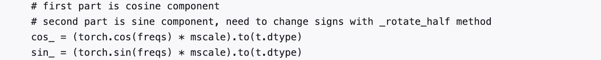

# ROPE 原理学习与Megatron-LM代码实现

**Author:** 想飞的石头

**Date:** 2025-04-23

**Link:** https://zhuanlan.zhihu.com/p/1895076081607889981

[ROPE](https://zhida.zhihu.com/search?content_id=256379964&content_type=Article&match_order=1&q=ROPE&zhida_source=entity)是LLM中关于Pos Embedding的一个关键工作，之前的学习中都是不明所以。最近稍微空闲，也加上深夜失眠，不想刷短视频，所以重现整理一波，学习过程中发现[十分钟读懂旋转编码（RoPE）](https://www.zhihu.com/tardis/zm/art/647109286)写得清晰易懂，遂在基础知识部分引用其数学原理，感谢作者分享；第二个部分是[Megatron-LM](https://zhida.zhihu.com/search?content_id=256379964&content_type=Article&match_order=1&q=Megatron-LM&zhida_source=entity)中关于RotaryEmbedding，通过解读相关代码来解释Megatron-LM中涉及到RotaryEmbedding部分的实现。

* * *

## 基础知识

### 基础概念

首先定义一个长度为 $N$ 的输入序列为：

$$\mathbb{S}_{N}=\{ w_i \}_{i=1}^{N} \\\tag1$$

其中 $w_i$ 表示输入序列中第 $i$ 个 token，而输入序列 $\mathbb{S}_N$ 对应的 embedding 表示为：

$$\mathbb{E}_{N}=\{ \bm{x}_i \}_{i=1}^N\\\tag2$$

其中 $\bm{x}_i$ 表示第 $i$ 个 token $w_i$ 对应的 $d$ 维词嵌入向量。

接着在做 self-attention 之前，会用词嵌入向量计算 $\bm{q,k,v}$ 向量同时加入位置信息，函数公式表达如下：

$$\bm{q}_m=f_q(\bm{x}_m,m) \\ \bm{k}_n=f_k(\bm{x}_n,n) \\ \bm{v}_n=f_v(\bm{x}_n,n) \\\tag3$$

其中 $\bm{q}_m$ 表示第 $m$ 个 token 对应的词向量 $\bm{x}_m$ 集成位置信息 $m$ 之后的 query 向量。而 $\bm{k}_n$ 和 $\bm{v}_n$ 则表示第 $n$ 个 token 对应的词向量 $\bm{x}_n$ 集成位置信息 $n$ 之后的 key 和 value 向量。

而基于 transformer 的位置编码方法都是着重于构造一个合适的 $f\left( \bm{q},\bm{k},\bm{v} \right)$ 函数形式。

而计算第 $m$ 个词嵌入向量 $\bm{x}_m$ 对应的 self-attention 输出结果，就是 $\bm{q}_m$ 和其他 $\bm{k}_n$ 都计算一个 attention score ，然后再将 attention score 乘以对应的 $\bm{v}_n$ 再求和得到输出向量 $\bm{o}_m$ ：

$$a_{m,n}=\frac{\text{exp}(\frac{\bm{q}_m^{\textbf{T}}\bm{k}_n}{\sqrt{d}})}{\sum_{j=1}^N\text{exp}(\frac{\bm{q}_m^{\textbf{T}}\bm{k}_j}{\sqrt{d}})} \\ \bm{o}_m=\sum_{n=1}^Na_{m,n}\bm{v}_n \\\tag4$$

### 绝对位置编码

对于位置编码，常规的做法是在计算 query, key 和 value 向量之前，会计算一个位置编码向量 $\bm{p}_i$ 加到词嵌入 $\bm{x}_i$ 上，位置编码向量 $\bm{p}_i$ 同样也是 $d$ 维向量，然后再乘以对应的变换矩阵 $\bm{W}$ ：

$$f_{t:t\in\{q,k,v\}}(\bm{x}_i,i):=\bm{W}_{t:t\in\{q,k,v\}}(\bm{x}_i+\bm{p}_i) \\\tag5$$

而经典的位置编码向量 $\bm{p}_i$ 的计算方式是使用 Sinusoidal 函数：

$$\bm{p}_{i,2t}=\text{sin}\left( k/10000^{2t/d} \right)\\ \bm{p}_{i,2t+1}=\text{cos}\left( k/10000^{2t/d} \right)\\\tag6$$

其中 $\bm{p}_{i,2t}$ 表示位置 $d$ 维度向量 $\bm{p}_i$ 中的第 $2t$ 位置分量也就是偶数索引位置的计算公式，而$\bm{p}_{i,2t+1}$就对应第 $2t+1$ 位置分量也就是奇数索引位置的计算公式。

### 二维旋转位置编码

假定 query 向量 $\bm{q}_m$ 和 key 向量 $\bm{k}_n$ 之间的内积操作可以被一个函数 $g$ 表示，该函数 $g$ 的输入是词嵌入向量 $\bm{x}_m$ ， $\bm{x}_n$ 和它们之间的相对位置 $m-n$ ：

$$\left<\bm{f}_q(\bm{x}_m,m),f_k(\bm{x}_n,n)\right>=g(\bm{x}_m,\bm{x}_n,m-n) \\\tag7$$

接下来的目标就是找到一个等价的位置编码方式，从而使得上述关系成立。

假定现在词嵌入向量的维度是两维 $d=2$ ，这样就可以利用上2维度平面上的向量的几何性质，然后论文中提出了一个满足上述关系的 $f$ 和 $g$ 的形式如下：

$$f_q(\bm{x}_m,m)=\left(\bm{W}_q\bm{x}_m\right)e^{im\theta} \\ f_k(\bm{x}_n,n)=(\bm{W}_k\bm{x}_n)e^{in\theta} \\ g(\bm{x}_m,\bm{x}_n,m-n)=\text{Re}\left[(\bm{W}_q\bm{x}_m)(\bm{W}_k\bm{x}_n)^{*}e^{i(m-n)\theta}\right] \\\tag8$$

这里面 Re 表示复数的实部。

进一步地， $f_q$ 可以表示成下面的式子：

$$\begin{align} f_q\left( \bm{x}_m,m \right)  &= \begin{pmatrix}  \cos m\theta & -\sin m\theta) \\  \sin m \theta &  \cos m \theta \end{pmatrix}   \begin{pmatrix}  W^{(1,1)}_{q} & W^{(1,2)}_{q}  \\  W^{(2,1)}_{q}  &  W^{(2,2)}_{q} \end{pmatrix} \begin{pmatrix}  x_m^{(1)}  \\  x_m^{(2)}    \end{pmatrix} \\ &= \begin{pmatrix}  \cos m\theta & -\sin m\theta) \\  \sin m \theta &  \cos m \theta \end{pmatrix}\begin{pmatrix}  q_m^{(1)}  \\  q_m^{(2)}    \end{pmatrix}  \end{align}\tag9$$

看到这里会发现，这不就是 query 向量乘以了一个旋转矩阵吗？这就是为什么叫做旋转位置编码的原因。

同理， $f_k$ 可以表示成下面的式子：

$$\begin{align} f_k\left( \bm{x}_m,m \right)  &= \begin{pmatrix}  \cos m\theta & -\sin m\theta) \\  \sin m \theta &  \cos m \theta \end{pmatrix}   \begin{pmatrix}  W^{(1,1)}_{k} & W^{(1,2)}_{k}  \\  W^{(2,1)}_{k}  &  W^{(2,2)}_{k} \end{pmatrix} \begin{pmatrix}  x_m^{(1)}  \\  x_m^{(2)}    \end{pmatrix} \\ &= \begin{pmatrix}  \cos m\theta & -\sin m\theta) \\  \sin m \theta &  \cos m \theta \end{pmatrix}\begin{pmatrix}  k_m^{(1)}  \\  k_m^{(2)}    \end{pmatrix}  \end{align}\tag{10}$$

最终 $g(\bm{x}_m,\bm{x}_n,m-n)$ 可以表示如下：

$$g(\bm{x}_m,\bm{x}_n,m-n)  =\begin{pmatrix}  \bm{q}_m^{(1)} &  \bm{q}_m^{(2)}  \\ \end{pmatrix}   \begin{pmatrix}  \cos((m-n)\theta) & -\sin((m-n)\theta) \\  \sin((m-n)\theta) &  \cos((m-n)\theta) \end{pmatrix}   \begin{pmatrix}  k_n^{(1)}  \\  k_n^{(2)}    \end{pmatrix} \\\tag{11}$$

关于上面公式（8）~（11）的具体推导，可以参见文章最后的**附录**，或者参考文章：[一文看懂 LLaMA 中的旋转式位置编码（Rotary Position Embedding）](https://zhuanlan.zhihu.com/p/642884818)。

### 扩展到多维

将2维推广到任意维度，可以表示如下：

$$f_{\left\{ q,k \right\}}\left( \bm{x}_m,m \right)=\bm{R}^d_{\Theta,m}\bm{W}_{\left\{ q,k \right\}}\bm{x}_m\\\tag{12}$$

内积满足线性叠加性，因此任意偶数维的RoPE，我们都可以表示为二维情形的拼接，即

$$\bm{R}^d_{\Theta,m}=\begin{equation}\scriptsize{\underbrace{\begin{pmatrix} \cos m\theta_0 & -\sin m\theta_0 & 0 & 0 & \cdots & 0 & 0 \\ \sin m\theta_0 & \cos m\theta_0 & 0 & 0 & \cdots & 0 & 0 \\ 0 & 0 & \cos m\theta_1 & -\sin m\theta_1 & \cdots & 0 & 0 \\ 0 & 0 & \sin m\theta_1 & \cos m\theta_1 & \cdots & 0 & 0 \\ \vdots & \vdots & \vdots & \vdots & \ddots & \vdots & \vdots \\ 0 & 0 & 0 & 0 & \cdots & \cos m\theta_{d/2-1} & -\sin m\theta_{d/2-1} \\ 0 & 0 & 0 & 0 & \cdots & \sin m\theta_{d/2-1} & \cos m\theta_{d/2-1} \\ \end{pmatrix}}_{\boldsymbol{W}_m}}\end{equation}\\\tag{13}$$

$\Theta=\left\{ \theta_i=10000^{-2(i-1)/d}, i \in [1,2,...,d/2] \right\} \\$

将 RoPE 应用到前面公式（4）的 Self-Attention 计算，可以得到**包含相对位置信息的Self-Attetion**：

$$\bm{q}^{\textbf{T}}_m\bm{k}_n=\left( \bm{R}^d_{\Theta,m}\bm{W}_q\bm{x}_m \right)^{\textbf{T}}\left( \bm{R}^d_{\Theta,n}\bm{W}_k\bm{x}_n \right)=\bm{x}_m^{\textbf{T}}\bm{W}_q\bm{R}^d_{\Theta,n-m}\bm{W}_k\bm{x}_n\tag{14}$$
 其中， $\bm{R}^d_{\Theta,n-m}=\left( \bm{R}^d_{\Theta,m} \right)^{\textbf{T}}\bm{R}^d_{\Theta,n}$ 。

值得指出的是，由于$\bm{R}^d_{\Theta}$是一个正交矩阵，它不会改变向量的模长，因此通常来说它不会改变原模型的稳定性。

### 高效计算

由于$\bm{R}^d_{\Theta,m}$的稀疏性，所以直接用矩阵乘法来实现会很浪费算力，**推荐通过下述方式来实现 RoPE**：

$$\bm{R}^d_{\Theta,m}\bm{x}=\begin{equation}\begin{pmatrix}x_0 \\ x_1 \\ x_2 \\ x_3 \\ \vdots \\ x_{d-2} \\ x_{d-1}  \end{pmatrix}\otimes\begin{pmatrix}\cos m\theta_0 \\ \cos m\theta_0 \\ \cos m\theta_1 \\ \cos m\theta_1 \\ \vdots \\ \cos m\theta_{d/2-1} \\ \cos m\theta_{d/2-1} \end{pmatrix} + \begin{pmatrix}-x_1 \\ x_0 \\ -x_3 \\ x_2 \\ \vdots \\ -x_{d-1} \\ x_{d-2}  \end{pmatrix}\otimes\begin{pmatrix}\sin m\theta_0 \\ \sin m\theta_0 \\ \sin m\theta_1 \\ \sin m\theta_1 \\ \vdots \\ \sin m\theta_{d/2-1} \\ \sin m\theta_{d/2-1} \end{pmatrix}\end{equation}\\\tag{15}$$

其中$\otimes$是逐位对应相乘，即计算框架中的$*$运算。从这个实现也可以看到，RoPE 可以视为是乘性位置编码的变体。

总结来说，RoPE 的 self-attention 操作的流程是：对于 token 序列中的每个词嵌入向量，首先计算其对应的 query 和 key 向量，然后对每个 token 位置都计算对应的旋转位置编码，接着对每个 token 位置的 query 和 key 向量的元素按照 **两两一组** 应用旋转变换，最后再计算 query 和 key 之间的内积得到 self-attention 的计算结果。

### 远程衰减

可以看到，RoPE 形式上和前面公式（6） [Sinusoidal 位置编码](https://zhida.zhihu.com/search?content_id=256379964&content_type=Article&match_order=1&q=Sinusoidal+%E4%BD%8D%E7%BD%AE%E7%BC%96%E7%A0%81&zhida_source=entity)有点相似，只不过 Sinusoidal 位置编码是加性的，而 RoPE 可以视为乘性的。在 $\theta_i$ 的选择上，RoPE 同样沿用了 Sinusoidal 位置编码的方案，即$\theta_i = 10000^{-2i/d}$，它可以带来一定的远程衰减性。

具体证明如下：将 $\boldsymbol{q},\boldsymbol{k}$ 两两分组后，它们加上 RoPE 后的内积可以用复数乘法表示为：

$$\begin{equation}  \left( \bm{R}^d_{\Theta,m}\bm{W}_q\bm{x}_m \right)^{\textbf{T}}\left( \bm{R}^d_{\Theta,n}\bm{W}_k\bm{x}_n \right)= \text{Re}\left[\sum_{i=0}^{d/2-1}\boldsymbol{q}_{[2i:2i+1]}\boldsymbol{k}_{[2i:2i+1]}^* e^{\text{i}(m-n)\theta_i}\right]\end{equation}\\\tag{16}$$

记 $h_i = \boldsymbol{q}_{[2i:2i+1]}\boldsymbol{k}_{[2i:2i+1]}^*, S_j = \sum\limits_{i=0}^{j-1} e^{\text{i}(m-n)\theta_i}$，并约定$h_{d/2}=0,S_0=0$，那么由**[Abel变换（分部求和法）](https://link.zhihu.com/?target=https%3A//zh.wikipedia.org/wiki/%25E5%2588%2586%25E9%2583%25A8%25E6%25B1%2582%25E5%2592%258C%25E6%25B3%2595)**可以得到：

$$\begin{equation}\sum_{i=0}^{d/2-1}\boldsymbol{q}_{[2i:2i+1]}\boldsymbol{k}_{[2i:2i+1]}^* e^{\text{i}(m-n)\theta_i} = \sum_{i=0}^{d/2-1} h_i (S_{i +1} - S_i)  = \sum_{i=0}^{d/2-1} S_{i+1}(h_{i+1} - h_i)\end{equation}\\\tag{17}$$

所以

$$\begin{equation}\begin{aligned} \left|\sum_{i=0}^{d/2-1}\boldsymbol{q}_{[2i:2i+1]}\boldsymbol{k}_{[2i:2i+1]}^* e^{\text{i}(m-n)\theta_i}\right| =&\, \left|\sum_{i=0}^{d/2-1} S_{i+1}(h_{i+1} - h_i)\right| \\ \leq&\, \sum_{i=0}^{d/2-1} |S_{i+1}| |h_{i+1} - h_i| \\ \leq&\, \left(\max_i |h_{i+1} - h_i|\right)\sum_{i=0}^{d/2-1} |S_{i+1}|  \end{aligned}\end{equation}\\\tag{18}$$

因此我们可以考察 $\frac{1}{d/2}\sum\limits_{i=1}^{d/2} |S_i|$ 随着相对距离的变化情况来作为衰减性的体现：

  

从图中我们可以看到**随着相对距离的变大，内积结果有衰减趋势**的出现。因此，选择$\theta_i = 10000^{-2i/d}$，确实能带来一定的远程衰减性。论文中还试过以$\theta_i = 10000^{-2i/d}$为初始化，将$\theta_i$视为可训练参数，然后训练一段时间后发现$\theta_i$并没有显著更新，因此干脆就直接固定$\theta_i = 10000^{-2i/d}$了。

### 关键公式推导

补充公式（8）~（11）是怎么推导出来的。

回到之前的公式（8），编码之后的 $\bm{q},\bm{v}$ 以及内积 $\left< \bm{q},\bm{v} \right>$ 的形式如下：

$f_q(\bm{x}_m,m)=(\bm{W}_q\bm{x}_m)e^{im\theta} \\ f_k(\bm{x}_n,n)=(\bm{W}_kx_n)e^{in\theta} \\ g(\bm{x}_m,x_n,m-n)=Re[(\bm{W}_\bm{q}x_m)(\bm{W}_k\bm{x}_n)^{*}e^{i(m-n)\theta}] \\$

上面的公式为什么满足： $\left<\bm{f}_q(\bm{x}_m,m),f_k(\bm{x}_n,n)\right>=g(\bm{x}_m,\bm{x}_n,m-n) $ 。

首先我们得先了解一下基本的复数相关知识。

首先看到上述 $f$ 和 $g$ 公式中有个指数函数： $$$e^{ix} $$$

这个其实是[欧拉公式](https://zhida.zhihu.com/search?content_id=256379964&content_type=Article&match_order=1&q=%E6%AC%A7%E6%8B%89%E5%85%AC%E5%BC%8F&zhida_source=entity)，其中 $x$ 表示任意实数， $e$ 是自然对数的底数， $i$ 是复数中的虚数单位，则根据欧拉公式有：

$e^{ix} = \cos x + i\sin x \\$

则是上述指数函数可以表示为实部为 $\cos x$ ，虚部为 $\sin x$ 的一个复数，欧拉公式建立了指数函数、三角函数和复数之间的桥梁。

则上述 $f$ 和 $g$ 公式的

$ e^{im\theta}=\cos (m\theta) + i\sin (m\theta) \\ e^{in\theta}=\cos (n\theta) + i\sin (n\theta) \\ e^{i(m-n)\theta}=\cos ((m-n)\theta) + i\sin ((m-n)\theta) \\$

然后我们看回公式：

$f_q(\bm{x}_m,m)=(\bm{W}_q\bm{x}_m)e^{im\theta} \\$

其中 $\bm{W}_q$ 是个二维矩阵， $\bm{x}_m$ 是个二维向量，相乘的结果也是一个二维向量，这里用 $\bm{q}_m$ 表示：

$ q_m= \begin{pmatrix}  q_m^{(1)}  \\  q_m^{(2)}    \end{pmatrix} = \bm{W}_q\bm{x}_m =\begin{pmatrix}  {W}_q^{(11)} & W_q^{(12)} \\  W_q^{(21)} & W_q^{(22)}    \end{pmatrix} \begin{pmatrix}  x_m^{(1)}  \\  x_m^{(2)}    \end{pmatrix} \\$

然后首先将 $\bm{q}_m$ 表示成复数形式：

$\bm{q}_m = [q_m^{(1)}, q_m^{(2)}] = [q_m^{(1)} + iq_m^{(2)}] \\$

接着

$\bm{f}_q(\bm{x}_m,m)=(\bm{W}_q\bm{x}_m)e^{im\theta}=\bm{q}_me^{im\theta} \\$

其实就是两个复数相乘：

$\bm{q}_me^{im\theta}=(q_m^{(1)} + iq_m^{(2)}) * (\cos (m\theta) + i\sin (m\theta)) \\$

然后就有：

$\bm{q}_me^{im\theta}=(q_m^{(1)} + iq_m^{(2)}) * (\cos (m\theta) + i\sin (m\theta)) \\ =(q_m^{(1)}cos (m\theta) -  q_m^{(2)} \sin (m\theta) ) + i(q_m^{(2)}\cos (m\theta) + q_m^{(1)}\sin (m\theta)) \\$

将结果重新表达成实数向量形式就是：

$ \bm{q}_me^{im\theta}=[q_m^{(1)} \cos (m\theta) -  q_m^{(2)} \sin (m\theta), q_m^{(2)}\cos (m\theta) + q_m^{(1)}\sin (m\theta)] \\$

**这里不难发现就是 query 向量乘以了一个旋转矩阵**。

$f_q(\bm{x}_m,m)=(\bm{W}_q\bm{x}_m)e^{im\theta}=\bm{q}_me^{im\theta}\\ =[q_m^{(1)} \cos (m\theta) -  q_m^{(2)} \sin (m\theta), q_m^{(2)}\cos (m\theta) + q_m^{(1)}\sin (m\theta)] \\ = \begin{pmatrix}  \cos (m\theta) & -\sin (m\theta) \\  \sin (m\theta) & \cos (m\theta)    \end{pmatrix} \begin{pmatrix}  q_m^{(1)}  \\  q_m^{(2)}    \end{pmatrix} \\$

**这就是为什么叫做旋转式位置编码的原因。**

同理可得 key 向量 $\bm{k}_n$ ：

$f_k(\bm{x}_n,n)=(\bm{W}_k\bm{x}_n)e^{in\theta}=\bm{k}_ne^{in\theta}\\ =[k_n^{(1)} \cos (n\theta) -  k_n^{(2)} \sin (n\theta), k_n^{(2)}\cos (n\theta) + k_n^{(1)}\sin (n\theta)] \\ = \begin{pmatrix}  \cos (n\theta) & -\sin (n\theta) \\  \sin (n\theta) & \cos (n\theta)    \end{pmatrix} \begin{pmatrix}  k_n^{(1)}  \\  k_n^{(2)}    \end{pmatrix} \\$

最后还有个函数 $g$ ：

$g(\bm{x}_m,\bm{x}_n,m-n)=Re[(\bm{W}_q\bm{x}_m)(\bm{W}_k\bm{x}_n)^{*}e^{i(m-n)\theta}] \\$

其中 $Re\left( x \right)$ 表示一个复数 $x$ 的实部部分，而 $ (\bm{W}_k\bm{x}_n)^{*} $ 则表示复数 $ \bm{W}_k\bm{x}_n $ 的共轭。

复习一下共轭复数的定义： $ z=a+ib\\ z^*=a-ib  \\$

所以可得：

$\bm{W}_q\bm{x}_m = \bm{q}_m = q_m^{(1)} + iq_m^{(2)} \\ \bm{W}_k\bm{x}_n=\bm{k}_n= k_n^{(1)} + ik_n^{(2)} \\ (\bm{W}_k\bm{x}_n)^*=\bm{k}_n^*= k_n^{(1)} - ik_n^{(2)} \\ e^{i(m-n)\theta}=\cos((m-n)\theta) + i \sin((m-n)\theta) \\$

继续可得：

$\begin{align} g(\bm{x}_m,\bm{x}_n,m-n) &=Re[(\bm{W}_q\bm{x}_m)(\bm{W}_k\bm{x}_n)^{*}e^{i(m n)\theta}] \\ & = Re[(q_m^{(1)} + iq_m^{(2)})(k_n^{(1)} - ik_n^{(2)})(\cos((m-n)\theta) + i \sin((m-n)\theta))] \\  &= Re[((q_m^{(1)}k_n^{(1)} + q_m^{(2)}k_n^{(2)}) + i(q_m^{(2)}k_n^{(1)} - q_m^{(1)}k_n^{(2)}))(\cos((m-n)\theta) + i \sin((m-n)\theta))] \\  &= (q_m^{(1)}k_n^{(1)} + q_m^{(2)}k_n^{(2)})\cos((m-n)\theta) - (q_m^{(2)}k_n^{(1)} - q_m^{(1)}k_n^{(2)})\sin((m-n)\theta)  \end{align}$

接下来我们就要证明函数 $g$ 的计算公式是成立的。

首先回顾一下 attention 操作， 位置 $m$ 的 query 和位置 $n$ 的 key 会做一个内积操作：

$\begin{align} f_q(x_m,m)&=[q_m^{(1)} \cos (m\theta) -  q_m^{(2)} \sin (m\theta), q_m^{(2)}\cos (m\theta) + q_m^{(1)}\sin (m\theta)] \\  f_k(x_n,n)& =[k_n^{(1)} \cos (n\theta) -  k_n^{(2)} \sin (n\theta), k_n^{(2)}\cos (n\theta) + k_n^{(1)}\sin (n\theta)] \\  <f_q(x_m,m),f_k(x_n,n)> &=  (q_m^{(1)} \cos (m\theta) -  q_m^{(2)} \sin (m\theta))(k_n^{(1)} \cos (n\theta) -  k_n^{(2)} \sin (n\theta)) \\ &+ (q_m^{(2)}\cos (m\theta) + q_m^{(1)}\sin (m\theta))(k_n^{(2)}\cos (n\theta) + k_n^{(1)}\sin (n\theta))\\ & =q_m^{(1)} \cos (m\theta) k_n^{(1)} \cos (n\theta) - q_m^{(1)} \cos (m\theta)k_n^{(2)} \sin (n\theta)\\ & - q_m^{(2)} \sin (m\theta)k_n^{(1)} \cos (n\theta) + q_m^{(2)} \sin (m\theta)k_n^{(2)} \sin (n\theta) \\ & + q_m^{(2)}\cos (m\theta)k_n^{(2)}\cos (n\theta) + q_m^{(2)}\cos (m\theta)k_n^{(1)}\sin (n\theta) \ + q_m^{(1)}\sin (m\theta)k_n^{(2)}\cos (n\theta) + q_m^{(1)}\sin (m\theta)k_n^{(1)}\sin (n\theta)  \end{align}$

接着进行推导，我们整理一下：

$\begin{align} <f_q(\bm{x}_m,m),f_k(\bm{x}_n,n)>  &=  {q}_m^{(1)}{k}_n^{(1)}(\cos(m\theta)\cos(n\theta) + \sin(m\theta)\sin(n\theta) ) \\  &+ {q}_m^{(1)}{k}_n^{(2)}(-\cos(m\theta)\sin(n\theta) + \sin(m\theta)\cos(n\theta) ) \\ & + {q}_m^{(2)}{k}_n^{(1)}(-\sin(m\theta)\cos(n\theta) + \cos(m\theta)\sin(n\theta) ) \\  &+ {q}_m^{(2)}{k}_n^{(2)}(\sin(m\theta)\sin(n\theta) + \cos(m\theta)\cos(n\theta) ) \\ & = q_m^{(1)}k_n^{(1)}\cos((m-n)\theta) \\  &+ q_m^{(1)}k_n^{(2)}\sin((m-n)\theta) \\  &- q_m^{(2)}k_n^{(1)}\sin((m-n)\theta) \\ & + q_m^{(2)}k_n^{(2)}\cos((m-n)\theta) \\  &= (q_m^{(1)}k_n^{(1)} + q_m^{(2)}k_n^{(2)})\cos((m-n)\theta) + (q_m^{(1)}k_n^{(2)}- q_m^{(2)}k_n^{(1)})\sin((m-n)\theta) \\ & = (q_m^{(1)}k_n^{(1)} + q_m^{(2)}k_n^{(2)})\cos((m-n)\theta) - (q_m^{(2)}k_n^{(1)} - q_m^{(1)}k_n^{(2)})\sin((m-n)\theta) \\ &=g(x_m,x_n,m-n)  \end{align}$

这就证明上述关系是成立的，位置 $m$ 的 query 和位置 $n$ 的 key 的内积就是函数 $g$ 。

把上面的式子用矩阵向量乘的形式来表达就是：

$<f_q(\bm{x}_m,m),f_k(\bm{x}_n,n)> \\ =\begin{pmatrix} \begin{pmatrix}  \cos (m\theta) & -\sin (m\theta) \\  \sin (m\theta) & \cos (m\theta)    \end{pmatrix} \begin{pmatrix}  q_m^{(1)}  \\  q_m^{(2)}    \end{pmatrix} \end{pmatrix}^T  \begin{pmatrix}  \begin{pmatrix}  \cos (n\theta) & -\sin (n\theta) \\  \sin (n\theta) & \cos (n\theta)    \end{pmatrix} \begin{pmatrix}  k_n^{(1)}  \\  k_n^{(2)}    \end{pmatrix} \end{pmatrix}  \\ = \begin{pmatrix}  q_m^{(1)} &  q_m^{(2)}  \\ \end{pmatrix}  \begin{pmatrix}  \cos (m\theta) & \sin (m\theta) \\  -\sin (m\theta) & \cos (m\theta)    \end{pmatrix}    \begin{pmatrix}  \cos (n\theta) & -\sin (n\theta) \\  \sin (n\theta) & \cos (n\theta)    \end{pmatrix} \begin{pmatrix}  k_n^{(1)}  \\  k_n^{(2)}    \end{pmatrix} \\ = \begin{pmatrix}  q_m^{(1)} &  q_m^{(2)}  \\ \end{pmatrix}   \begin{pmatrix}  \cos(m\theta)\cos(n\theta) + \sin(m\theta)\sin(n\theta) & -\cos(m\theta)\sin(n\theta) + \sin(m\theta)\cos(n\theta) \\  -\sin(m\theta)\cos(n\theta) + \cos(m\theta)\sin(n\theta) & \sin(m\theta)\sin(n\theta) + \cos(m\theta)\cos(n\theta) \end{pmatrix}   \begin{pmatrix}  k_n^{(1)}  \\  k_n^{(2)}    \end{pmatrix} \\ =\begin{pmatrix}  q_m^{(1)} &  q_m^{(2)}  \\ \end{pmatrix}   \begin{pmatrix}  \cos((m-n)\theta) & -\sin((m-n)\theta) \\  \sin((m-n)\theta) &  \cos((m-n)\theta) \end{pmatrix}   \begin{pmatrix}  k_n^{(1)}  \\  k_n^{(2)}    \end{pmatrix} \\$

## RotaryEmbedding实现

```python3
class RotaryEmbedding(nn.Module):
    """Rotary Embedding for language model.

    Args:
        kv_channels (int): Projection weights dimension in multi-head attention. Obtained
            from transformer config
        rotary_percent (float): Percent of rotary dimension to use for rotary position
            embeddings.
        rotary_interleaved (bool, optional): If True, interleaved rotary position embeddings.
            Defaults to False.
        seq_len_interpolation_factor (float, optional): scale of linearly interpolating RoPE
            for longer sequences. The value must be a float larger than 1.0. Defaults to None
        rotary_base (int, optional): Base period for rotary position embeddings. Defaults to
            10000.
        rope_scaling (bool, optional): Apply rope scaling as used in llama 3.x.
        rope_scaling_factor (float, optional): rope scaling factor in llama 3.x. Defaults to 8.
        use_cpu_initialization (bool, optional): If False, initialize the inv_freq directly
            on the GPU. Defaults to False
    """

    def __init__(
        self,
        kv_channels: int,
        rotary_percent: float,
        rotary_interleaved: bool = False,
        seq_len_interpolation_factor: float = None,
        rotary_base: int = 10000,
        rope_scaling: bool = False,
        rope_scaling_factor: float = 8.0,
        use_cpu_initialization: bool = False,
    ) -> None:...

    def _apply_scaling(
        self,
        freqs,
        factor=8,
        low_freq_factor=1,
        high_freq_factor=4,
        original_max_position_embeddings=8192,
    ):...

    def get_freqs_non_repeated(self, max_seq_len: int, offset: int = 0) -> Tensor:...

    def get_cos_sin(self, max_seq_len: int, offset: int = 0) -> (Tensor, Tensor):...

    @lru_cache(maxsize=32)
    def forward(self, max_seq_len: int, offset: int = 0, packed_seq: bool = False) -> Tensor:...

    def _load_from_state_dict(self, state_dict, prefix, *args, **kwargs):...

    def get_rotary_seq_len(
        self,
        inference_context: BaseInferenceContext,
        transformer: TransformerBlock,
        transformer_input: Tensor,
        transformer_config: TransformerConfig,
        packed_seq_params: PackedSeqParams,
        *,
        inference_params: Optional[BaseInferenceContext] = None,
    ) -> float:...
```

### Sinusoidal位置编码方案

```text
def __init__(
        self,
        kv_channels: int,
        rotary_percent: float,
        rotary_interleaved: bool = False,
        seq_len_interpolation_factor: float = None,
        rotary_base: int = 10000,
        rope_scaling: bool = False,
        rope_scaling_factor: float = 8.0,
        use_cpu_initialization: bool = False,
    ) -> None:
        super().__init__()

        dim = kv_channels
        if rotary_percent < 1.0:
            dim = int(dim * rotary_percent)
        self.rotary_interleaved = rotary_interleaved

        self.seq_len_interpolation_factor = seq_len_interpolation_factor
        device = 'cpu' if use_cpu_initialization else torch.cuda.current_device()
        self.inv_freq = 1.0 / (
            rotary_base ** (torch.arange(0, dim, 2, dtype=torch.float32, device=device) / dim)
        )

        if rope_scaling:
            self.inv_freq = self._apply_scaling(self.inv_freq, factor=rope_scaling_factor)
```

self.inv\_freq 即上述解释中 $10000^{-2(i-1)/d}$ ， llama3 中，会进行scaling操作， rope\_scaling 主要解决长序列时（超过预训练中约定的seqlen）， 从代码注释中看到，这里的rope\_scaling的实现是参考的transformers库里面的代码：

```python3
def _compute_llama3_parameters(
    config: PretrainedConfig, device: "torch.device", seq_len: Optional[int] = None, **rope_kwargs
) -> Tuple["torch.Tensor", float]:
    """
    Computes the inverse frequencies for llama 3.1.

    Args:
        config ([`~transformers.PretrainedConfig`]):
            The model configuration.
        device (`torch.device`):
            The device to use for initialization of the inverse frequencies.
        seq_len (`int`, *optional*):
            The current sequence length. Unused for this type of RoPE.
        rope_kwargs (`Dict`, *optional*):
            BC compatibility with the previous RoPE class instantiation, will be removed in v4.45.
    Returns:
        Tuple of (`torch.Tensor`, `float`), containing the inverse frequencies for the RoPE embeddings and the
        post-processing scaling factor applied to the computed cos/sin.
    """
    # Gets the default RoPE parameters
    inv_freq, attention_factor = _compute_default_rope_parameters(config, device, seq_len, **rope_kwargs)

    factor = config.rope_scaling["factor"]  # `8` in the original implementation
    low_freq_factor = config.rope_scaling["low_freq_factor"]  # `1` in the original implementation
    high_freq_factor = config.rope_scaling["high_freq_factor"]  # `4` in the original implementation
    old_context_len = config.rope_scaling["original_max_position_embeddings"]  # `8192` in the original implementation

    low_freq_wavelen = old_context_len / low_freq_factor
    high_freq_wavelen = old_context_len / high_freq_factor

    wavelen = 2 * math.pi / inv_freq
    # wavelen < high_freq_wavelen: do nothing
    # wavelen > low_freq_wavelen: divide by factor
    inv_freq_llama = torch.where(wavelen > low_freq_wavelen, inv_freq / factor, inv_freq)
    # otherwise: interpolate between the two, using a smooth factor
    smooth_factor = (old_context_len / wavelen - low_freq_factor) / (high_freq_factor - low_freq_factor)
    smoothed_inv_freq = (1 - smooth_factor) * inv_freq_llama / factor + smooth_factor * inv_freq_llama
    is_medium_freq = ~(wavelen < high_freq_wavelen) * ~(wavelen > low_freq_wavelen)
    inv_freq_llama = torch.where(is_medium_freq, smoothed_inv_freq, inv_freq_llama)

    return inv_freq_llama, attention_factor
```

Megatron-LM中的实现如下：

```text
def _apply_scaling(
        self,
        freqs,
        factor=8,
        low_freq_factor=1,
        high_freq_factor=4,
        original_max_position_embeddings=8192,
    ):
        # This implementation is adapted from:
        # https://github.com/huggingface/transformers/blob/2a5a6ad18aa22e98429bb5ecb880660328030ea0/src/transformers/modeling_rope_utils.py#L303-L343

        factor = factor  # `8` in the original implementation
        low_freq_factor = low_freq_factor  # `1` in the original implementation
        high_freq_factor = high_freq_factor  # `4` in the original implementation
        old_context_len = original_max_position_embeddings  # `8192` in the original implementation

        low_freq_wavelen = old_context_len / low_freq_factor
        high_freq_wavelen = old_context_len / high_freq_factor

        wavelen = 2 * math.pi / freqs
        # wavelen < high_freq_wavelen: do nothing
        # wavelen > low_freq_wavelen: divide by factor
        inv_freq_llama = torch.where(wavelen > low_freq_wavelen, freqs / factor, freqs)
        # otherwise: interpolate between the two, using a smooth factor
        smooth_factor = (old_context_len / wavelen - low_freq_factor) / (
            high_freq_factor - low_freq_factor
        )
        smoothed_inv_freq = (
            1 - smooth_factor
        ) * inv_freq_llama / factor + smooth_factor * inv_freq_llama
        is_medium_freq = ~(wavelen < high_freq_wavelen) * ~(wavelen > low_freq_wavelen)
        inv_freq_llama = torch.where(is_medium_freq, smoothed_inv_freq, inv_freq_llama)

        return inv_freq_llama
```

### get\_freqs\_non\_repeated

get\_freqs\_non\_repeated 方法，该方法的作用是依据序列中的位置生成频率矩阵，这个矩阵可用于创建位置编码。

```python3
def get_freqs_non_repeated(self, max_seq_len: int, offset: int = 0) -> 
Tensor:
    """Generates matrix of frequencies based on positions in the 
    sequence,
    used to create positional encodings"""

```

-   定义了一个名为 get\_freqs\_non\_repeated 的方法，接收两个参数：

-   max\_seq\_len：序列的最大长度，类型为整数。
-   offset：位置偏移量，默认为 0，类型为整数。

-   方法返回一个 torch.Tensor 类型的频率矩阵。
-   文档字符串说明了该方法的功能是根据序列位置生成频率矩阵，用于创建位置编码。

生成序列位置张量

```python3
seq = (
    torch.arange(max_seq_len, device=self.inv_freq.device, dtype=self.
    inv_freq.dtype)
    + offset
)
```

-   torch.arange(max\_seq\_len)：生成一个从 0 到 max\_seq\_len - 1 的一维张量。
-   device=self.inv\_freq.device：将生成的张量放置在与 self.inv\_freq 相同的设备（CPU 或 GPU）上。
-   dtype=self.inv\_freq.dtype：设置张量的数据类型与 self.inv\_freq 相同。
-   \+ offset：将偏移量 offset 加到序列的每个位置上。

序列长度插值处理

```python3
if self.seq_len_interpolation_factor is not None:
    seq *= 1 / self.seq_len_interpolation_factor
```

-   如果 self.seq\_len\_interpolation\_factor 不为 None，则对序列位置进行线性插值处理。通过将序列中的每个位置乘以 1 / self.seq\_len\_interpolation\_factor 来实现。

计算频率矩阵

```python3
freqs = torch.outer(seq, self.inv_freq)  # [seq len, dim]
```

-   torch.outer(seq, self.inv\_freq)：计算 seq 和 self.inv\_freq 的外积，得到一个形状为 \[seq len, dim\] 的二维张量。这里的 seq len 是序列的长度，dim 是旋转维度。

### rotary\_interleaved

```text
if not self.rotary_interleaved:
     emb = torch.cat((freqs, freqs), dim=-1)
else:
     emb = torch.stack((freqs.view(-1, 1), freqs.view(-1, 1)), dim=-1).view(
           freqs.shape[0], -1
       )
```

第一部分是偶数位置的向量分量，第二部分是奇数位置的向量分量，注意Sinusoidal位置编码中step为2：

```text
self.inv_freq = 1.0 / (
            rotary_base ** (torch.arange(0, dim, 2, dtype=torch.float32, device=device) / dim)
        )
```

### Context Parallel支持

在开启CP支持时， input会额外进行切分， Pos embedding也应该保证一致：

```python3
def get_pos_emb_on_this_cp_rank(pos_emb: Tensor, seq_dim: int) -> Tensor:
    """Get the position embedding on the current context parallel rank.

    Args:
        pos_emb (Tensor): Positional embedding tensor
        seq_dim (int): Sequence dimension
    """
    cp_size = parallel_state.get_context_parallel_world_size()
    cp_rank = parallel_state.get_context_parallel_rank()
    cp_idx = torch.tensor(
        [cp_rank, (2 * cp_size - cp_rank - 1)], device="cpu", pin_memory=True
    ).cuda(non_blocking=True)
    pos_emb = pos_emb.view(
        *pos_emb.shape[:seq_dim], 2 * cp_size, -1, *pos_emb.shape[(seq_dim + 1) :]
    )
    pos_emb = pos_emb.index_select(seq_dim, cp_idx)
    pos_emb = pos_emb.view(*pos_emb.shape[:seq_dim], -1, *pos_emb.shape[(seq_dim + 2) :])
    return pos_emb
```

### GPTModel如何使用

注意：此处未复数化（如基础知识中提到的转换成cos，sin）

```text
if self.position_embedding_type == 'rope' and not self.config.multi_latent_attention:
    if not self.training and self.config.flash_decode and inference_context:
        assert (
                    inference_context.is_static_batching()
                ), "GPTModel currently only supports static inference batching."
         # Flash decoding uses precomputed cos and sin for RoPE
        rotary_pos_cos, rotary_pos_sin = self.rotary_pos_emb_cache.setdefault(
                    inference_context.max_sequence_length,
                    self.rotary_pos_emb.get_cos_sin(inference_context.max_sequence_length),
                )
    else:
        rotary_seq_len = self.rotary_pos_emb.get_rotary_seq_len(
                    inference_context, self.decoder, decoder_input, self.config, packed_seq_params
                )
        rotary_pos_emb = self.rotary_pos_emb(
                    rotary_seq_len,
                    packed_seq=packed_seq_params is not None
                    and packed_seq_params.qkv_format == 'thd',
```

在attention forward时，完成相关操作，注意Megatron-LM因为也引入inference的操作，所以逻辑分支稍微有点复杂，我这里是0.11.0，其他版本可能逻辑也有点差别（其实不明白为什么Megatron-LM要做那么多关于inference的工作干嘛，整个代码揉杂在一起，可读性较差，这部分开始怎么也找不到，后来请教了团队同事才发现这里inference\_context is None， 我直接看成inference 模式了）：

```text
if q_pos_emb is not None:
     # TODO VIJAY: simplify
     if inference_context is None or inference_context.is_static_batching():
         query = apply_rotary_pos_emb(
                        query, q_pos_emb, config=self.config, cu_seqlens=cu_seqlens_q
         )
     else:
         query = inference_context.apply_rotary_emb_query(
               query, q_pos_emb, self.config, cu_seqlens_q
         )
if k_pos_emb is not None:
    key = apply_rotary_pos_emb(
        key, k_pos_emb, config=self.config, cu_seqlens=cu_seqlens_kv
        )
```

q\\k在训练模型下，调用apply\_rotary\_pos\_emb，这里两个逻辑，通过apply\_rope\_fusion来判断是否来选择fusion op操作：

```python3
def apply_rotary_pos_emb(
    t: Tensor,
    freqs: Tensor,
    config: TransformerConfig,
    cu_seqlens: Optional[Tensor] = None,
    mscale: float = 1.0,
):
    """
    Reroute to the appropriate apply_rotary_pos_emb function depending on
    fused/unfused kernels, or bshd (conventional) / thd (packed seq) format
    """

    if config.apply_rope_fusion:
        if cu_seqlens is None:
            # NOTE: TE backends do not support mRoPE in bshd format when bs > 1
            if config.mrope_section is not None and freqs.shape[1] > 1:
                return _apply_rotary_pos_emb_bshd(
                    t,
                    freqs,
                    rotary_interleaved=config.rotary_interleaved,
                    multi_latent_attention=config.multi_latent_attention,
                    mscale=mscale,
                )
            else:
                assert fused_apply_rotary_pos_emb is not None, "apply_rope_fusion is not available."
                return fused_apply_rotary_pos_emb(t, freqs, transpose_output_memory=True)
        else:
            assert fused_apply_rotary_pos_emb_thd is not None, "apply_rope_fusion is not available."
            cp_size = parallel_state.get_context_parallel_world_size()
            if cp_size > 1:
                if not is_te_min_version("1.11.0", check_equality=False):
                    raise ValueError("Only TE >= 1.12 supports RoPE fusion for THD format with CP.")
                return fused_apply_rotary_pos_emb_thd(
                    t,
                    cu_seqlens,
                    freqs,
                    cp_size=cp_size,
                    cp_rank=parallel_state.get_context_parallel_rank(),
                )
            else:
                return fused_apply_rotary_pos_emb_thd(t, cu_seqlens, freqs)
    else:
        if cu_seqlens is None:
            return _apply_rotary_pos_emb_bshd(
                t,
                freqs,
                rotary_interleaved=config.rotary_interleaved,
                multi_latent_attention=config.multi_latent_attention,
                mscale=mscale,
            )
        else:
            return _apply_rotary_pos_emb_thd(
                t,
                cu_seqlens,
                freqs,
                rotary_interleaved=config.rotary_interleaved,
                multi_latent_attention=config.multi_latent_attention,
                mscale=mscale,
            )
```

仅看散算子实现在此处开始复数化，如下调用\_apply\_rotary\_pos\_emb\_bshd源码，核心代码段：



```python3
def _apply_rotary_pos_emb_bshd(
    t: Tensor,
    freqs: Tensor,
    rotary_interleaved: bool = False,
    multi_latent_attention: bool = False,
    mscale: float = 1.0,
) -> Tensor:
    """Apply rotary positional embedding to input tensor T.

    check https://kexue.fm/archives/8265 for detailed formulas

    Args:
        t (Tensor): Input tensor T is of shape [seq_length, ... , dim]
        freqs (Tensor): Rotary Positional embedding tensor freq is of shape [seq_length, ..., dim]

    Returns:
        Tensor: The input tensor after applying RoPE
    """
    rot_dim = freqs.shape[-1]

    # ideally t_pass is empty so rotary pos embedding is applied to all tensor t
    t, t_pass = t[..., :rot_dim], t[..., rot_dim:]

    if multi_latent_attention:
        x1 = t[..., 0::2]
        x2 = t[..., 1::2]
        t = torch.cat((x1, x2), dim=-1)

    # first part is cosine component
    # second part is sine component, need to change signs with _rotate_half method
    cos_ = (torch.cos(freqs) * mscale).to(t.dtype)
    sin_ = (torch.sin(freqs) * mscale).to(t.dtype)

    t = (t * cos_) + (_rotate_half(t, rotary_interleaved) * sin_)
    return torch.cat((t, t_pass), dim=-1)
```

get\_rotary\_seq\_len, 针对开启sp与cp的额外操作，用于兼容sp和cp中对应rotary pos embedding的相关配置与更改；

```text
def get_rotary_seq_len(
        self,
        inference_context: BaseInferenceContext,
        transformer: TransformerBlock,
        transformer_input: Tensor,
        transformer_config: TransformerConfig,
        packed_seq_params: PackedSeqParams,
        *,
        inference_params: Optional[BaseInferenceContext] = None,
    ) -> float:
        """Function to get the rotary sequence length.

        Args:
            inference_context : Used during Inference time
            transformer (TransformerBlock): The transformer block (decoder/encoder) used
                by the model
            transformer_input (Tensor): Input tensor to the transformer
            transformer_config (TransformerConfig): Transformer config used by the model
            packed_seq_params (PackedSeqParams): Packed sequence params

        Returns:
            float: The rotary sequence length
        """

        inference_context = deprecate_inference_params(inference_context, inference_params)

        if packed_seq_params is not None:
            # max_seqlen are the max sequence length in the packed sequence before being divived
            # by the tp and cp size.
            return max(packed_seq_params.max_seqlen_q, packed_seq_params.max_seqlen_kv)
        elif inference_context is not None:
            rotary_seq_len = inference_context.max_sequence_length
        else:
            if transformer is not None and transformer.input_tensor is not None:
                rotary_seq_len = transformer.input_tensor.size(0)
            else:
                rotary_seq_len = transformer_input.size(0)

            if transformer_config.sequence_parallel:
                rotary_seq_len *= transformer_config.tensor_model_parallel_size

        rotary_seq_len *= transformer_config.context_parallel_size

        return rotary_seq_len
```

## 总结

本篇文章前半部分，拷贝[十分钟读懂旋转编码（RoPE）](https://www.zhihu.com/tardis/zm/art/647109286)内容，一步步学习ROPE的基础知识，后半部分展示了在Megatron-LM中如何实现ROPE，其中复数化这个操作，因为Megatron-LM在功能上添加了除分布式训练之外的比如inference的功能，其逻辑分支较多，花费较大时间理解，才明白在attention去完成。

## 参考文献

1.  [https://www.zhihu.com/tardis/zm/art/647109286](https://www.zhihu.com/tardis/zm/art/647109286)；
2.  [https://github.com/nvidia/megatron-lm](https://link.zhihu.com/?target=https%3A//github.com/nvidia/megatron-lm);
3.  [https://en.wikipedia.org/wiki/Rotation\_matrix](https://link.zhihu.com/?target=https%3A//en.wikipedia.org/wiki/Rotation_matrix)