# vLLM的prefix cache为何零开销

**Author:** kaiyuan

**Date:** 2025-04-24

**Link:** https://zhuanlan.zhihu.com/p/1896927732027335111

在vLLM的新版本中有个零开销的前置缓存(Zero-Overhead Prefix Caching)特性，其中零开销是指使用[prefix cache](https://zhida.zhihu.com/search?content_id=256606980&content_type=Article&match_order=1&q=prefix+cache&zhida_source=entity)和全量计算两种情况下，即使prefix命中率为0，它们的性能也近乎相等。为什么可以做到零开销？这需要分析该特性的具体实现，本文就这个问题展开讨论。

## 问题背景介绍

前置缓存(prefix caching)由于能够降低prefill阶段的计算量从而提升首token性能，被越来越多地使用。其原理是通过跨请求/对话的[kv cache](https://zhida.zhihu.com/search?content_id=256606980&content_type=Article&match_order=1&q=kv+cache&zhida_source=entity)复用来减少计算。看一个例子，推理三个不同的请求0,1,2。请求0计算完后可将计算的kv cache保存下来，在请求1计算时前面两个token块的cache就可以复用。同样，请求3可复用3个块，仅需计算tokens\_3的内容。

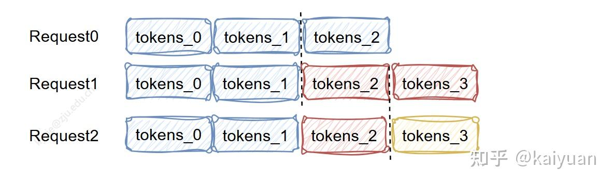

prefix示例

前置缓存设计要考虑的问题：

-   **搜索匹配**：如何快速匹配新请求的prompt与历史的prompt，找到可复用的kv cache；
-   **内存**：由于kv cache需要保存在内存中，所要用一定的淘汰策略定期清理；
-   **复用内容选择**：仅复用prefill阶段kv-cache，还是结合decode阶段内容（当前还不支持PD分离复用）；
-   **块的结构大小**：每个内存块里面能够容纳多少tokens？选择太长复用率低，太短管理操作成本高；

这些点的变化会影响prefix cache的命中率（hit rate）和推理性能。设计不当时会出现一种情况：当命中率低（复用的kv cache少）时，使用prefix cache特性计算速度比全量计算要低。在极端情况下，当完全没有匹配的kv cache（即hit rate=0%）时，由于搜索匹配本身需要耗时，这样肯定要比不开prefix cache速度慢。为了发挥prefix cache更大价值，于是就产生了一个问题：如何保证开启prefix cache始终对系统来说都是有正收益的？

尽管prefix cache功能已在vLLM V0中实现，由于存在一定可能导致性能损失，所以默认不开启prefix特性。而到V1版本优化后就可以直接开启，里面做了什么改进？

## 内容分析

在V1版本中主要降低了prefix cache的操作开销，在命中率低场景下prefix cache的**创建、查找匹配、管理、淘汰删除**等操作基本不影响推理的计算过程。主要进行了：**结构优化**、**操作优化**、**代码优化**。

### 1 vLLM的cache结构优化

在V1版本中对kv cache的管理结构进行了优化，管理对象由seqGroup变为了request id；管理内容得到简化：

-   关键模块：KVcacheManager、[BlockPool](https://zhida.zhihu.com/search?content_id=256606980&content_type=Article&match_order=1&q=BlockPool&zhida_source=entity)
-   基本元素：KVcacheBlock，[FreeKVCacheBlockQueue](https://zhida.zhihu.com/search?content_id=256606980&content_type=Article&match_order=1&q=FreeKVCacheBlockQueue&zhida_source=entity)。

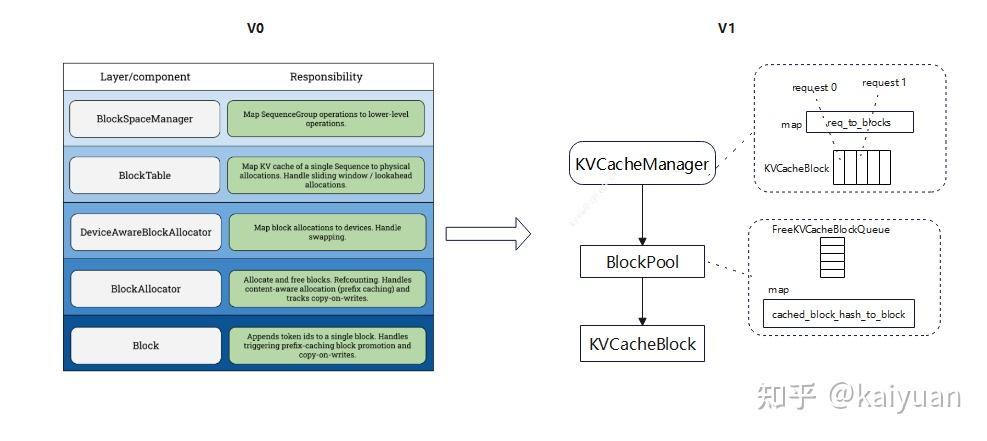

KVcacheBlock是基础单元，通过它可以构建一个双向链表，其存储信息仅包含block id值、ref\_cnt值、block hash值。这个结构有两个好处：

1.  链表中删除block复杂度为O(1)；
2.  不需要引入python的双端队列，简化了存储。

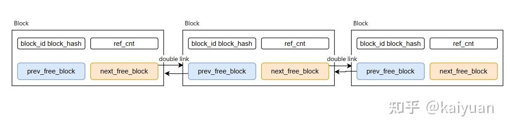

基于KVCacheBlock构建的kv cache架构包括几个关键模块：

-   块池（Block Pool）：存储KVCacheBlock，一般初始化时决定数量，避免多次的python操作。
-   空闲队列（Free Block Queue）：空闲的块的队列，仅存储头尾节点指针信息。
-   缓存块（Cache blocks）：一个map记录hash key 到block id的映射关系，其中的block有kv cache数据
-   请求块（Request blocks）：记录了请求id到block的映射关系。

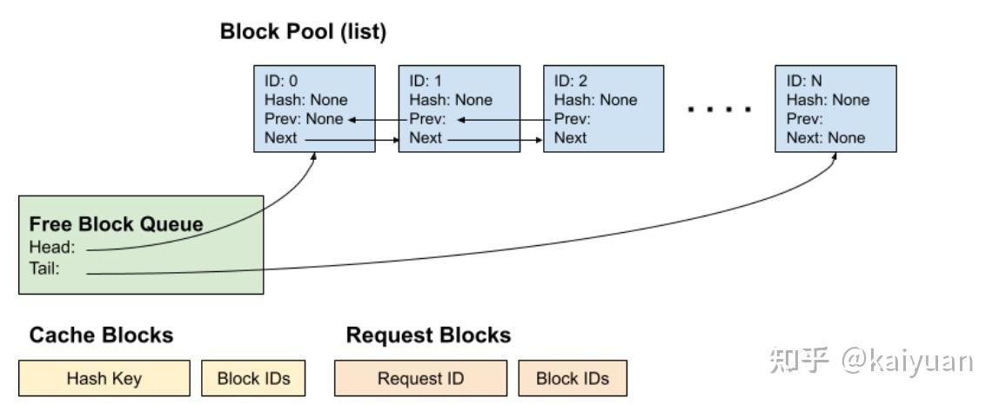

对比V0：

1.  在V0版本中通过LRUEvictor管理空闲队列，其内容相比Free Block Queue复杂；
2.  PrefixCachingBlockAllocator负责内存块的管理，内容比Block pool复杂；
3.  V1中cache blocks、request blocks的结构未变，但存储内容上V1更加简单。

### 2 基本操作优化

先分析V0版本的kv cache管理的过程：**开辟、释放、淘汰**；

-   开辟（allocate）步骤：根据prompt的内容长度计算是否有充足的block，没有返回；若有则到cache\_block中去匹配，如果匹配到了block的引用计数+1，没有就直接使用新的block；
-   释放（free操作）：引用计数-1，然后由LRUEvictor管理，
-   淘汰（evictor）主要是维护一个free\_table，通过LRU策略淘汰block。

V1的主要操作也是这些，但细节有所不同：

**内存开辟步骤**：

1.  检查是否有足够的空间为新请求来开辟block；
2.  从cache block检查是否可以复用，可以复用从free队列剔除，引用计数+1；
3.  若无复用数据从free队列中头中弹出一个block用于写数据
4.  如果block写满了数据，则被cached block标记

**内存释放**：request使用完后，将block送回free队列里面，如果是cached block，引用计数-1，最后的这个block 最先放入队列中，它可能未被cache；

**淘汰策略**：根据LRU策略淘汰队首的block cache，并从cached blocks字典中去除记录。

这里分析一下block的状态，如下图所示，所有的block存放在block pool里面，block在free block和cached block里面可能有记录（标记）

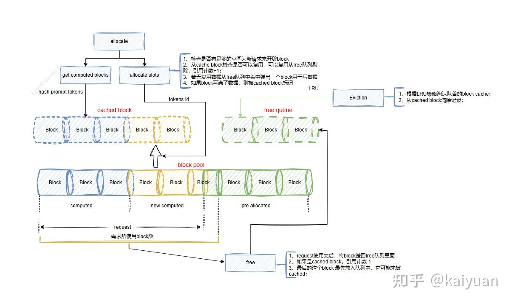

-   cached block 里面记录历史request请求的block id，这些块中所有的tokens位置都完成了计算。部分计算block不会记录到cached block里面。
-   free queue里面标记未被请求占用的block；
-   block还一种状态就是被request在使用但内容未完全占满，那么它即不在free queue中、也未被cached block记录。

下面例举一个例子来说明block的管理机制，每个block支持最多4个tokens使用，block pool里面有10个block。现在需要处理3个请求，抵达和释放时机如下：

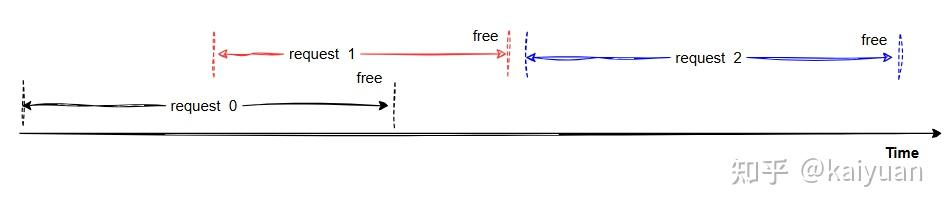

请求的时序

**请求0的处理：**

请求0的prompt：A-O，如下图，它需要使用block0~3，其中block0,1,2的存储都被使用完，所以其ID会被cache blocks字典记录；block3只使用3个tokens，不会被记录。

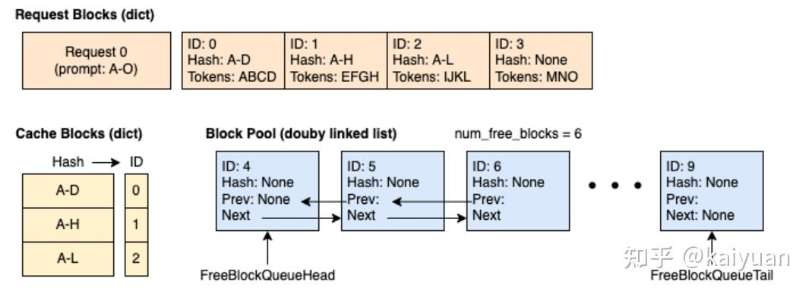

请求0 Prefill阶段

请求0的decode阶段时候会生成tokens（假设是两个）如下所示，此时block3也会被cache blocks记录。

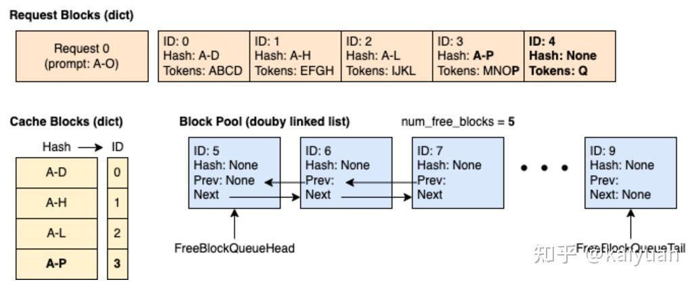

请求0的decode阶段

**请求1的处理：**

请求体1的prompt是14个tokens，有10个tokens与请求体0相同，能够复用block0和block1。block2中尽管有2个tokens相同但是不能够复用，因为必须block的tokens全部相同才能复用。

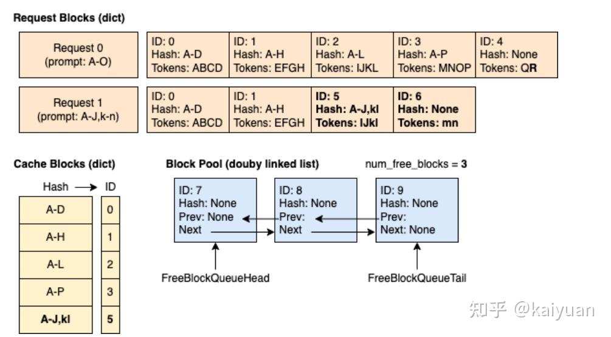

请求1的处理

cache blocks状态刷新：增加了一个hash值对应A-J,kl，字典记录ID值：0 1 2 3 5

**请求体0和请求体1的释放**

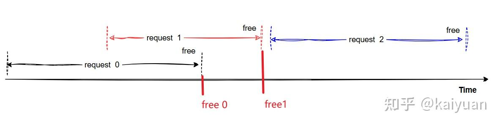

先释放请求体0资源，在释放请求体1资源

请求体0的释放：blocks 2,3,4按照相反顺序被加到了free queue的队尾。block2和3依然保留了cache block的hash值；block0,1由于被请求1继续使用，不能加入free queue中。

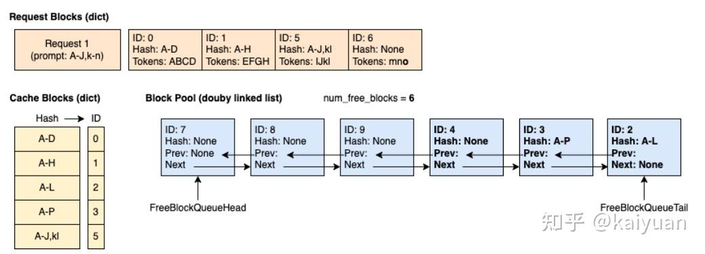

请求体1释放：block0,1,5,6 按照相反顺序加入free queue；cache block记录继续保留。

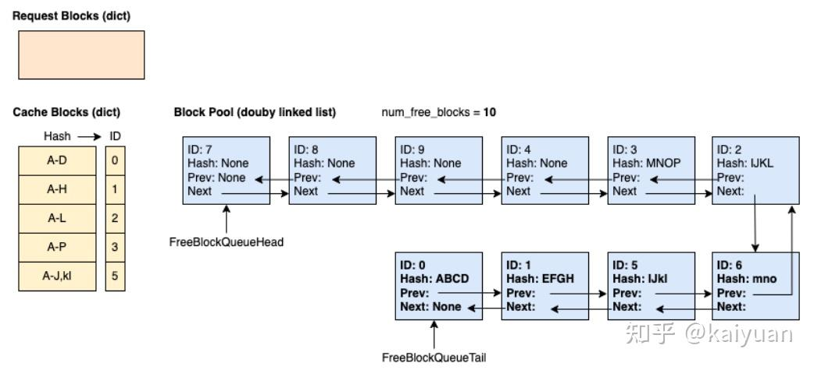

**请求2的处理：**

请求2一共有29个tokens：A-L,0-16，根据规则先会到cache blocks去匹配。由于A-L有历史记录，所以会复用blocks0,1,2。 这些block从自由队列中去除，队列ID变为了：7-8-9-4-3-6-5。

接着tokens 0-16需要完成计算，从队列里面弹出5个blocks依次是7,8,9,4,3承载新的计算输出。

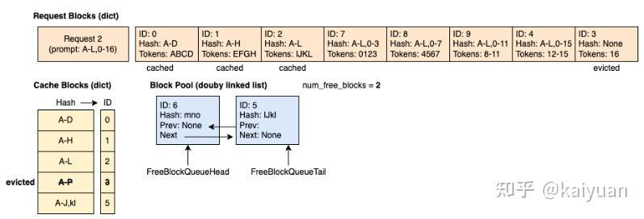

cache blocks状态： 由于blocks 3被请求2重新使用，所以它先从cache blocks里面删除(淘汰)。接着，blocks7,8,9,4的hash值会存入cache blocks字典中。

### 3 代码效率提升

**整体简化**：（代码实现位置vllm/v1/core/)主要功能实现在三个文件中，block和free queue作为独立元素定义在kv\_cache\_utils里面。block\_pool负责block的开辟、释放、cache等操作，还承载free queue；kv\_cache\_manager 则是对外的接口类（无继承关系），串联所有模块，同时兼容了非prefix的场景。

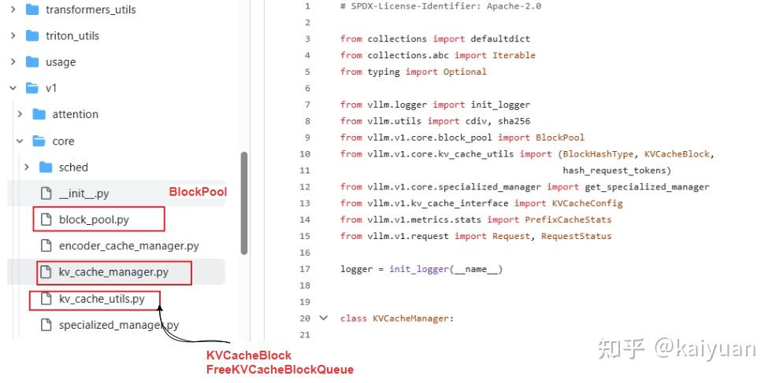

**减少了python对象(object)的使用。**比如在cached blocks构建中v1版本就简化存储对象用str和int代替。

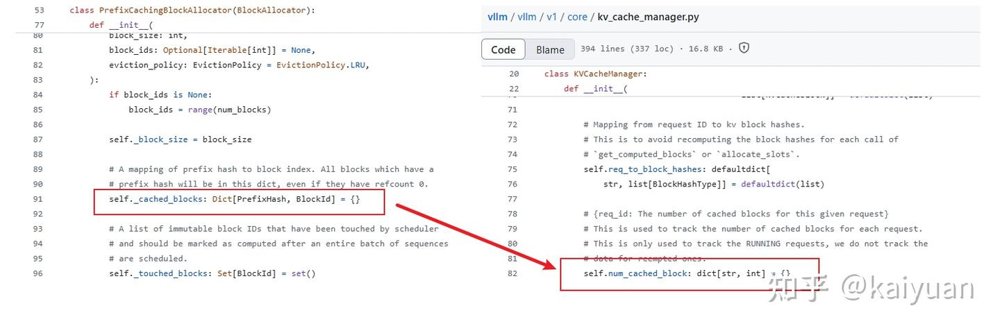

**KVCacheBlock定义简化**。内容仅包括：两个int数据、两个链表指针（python中的对象ID）、hash值。

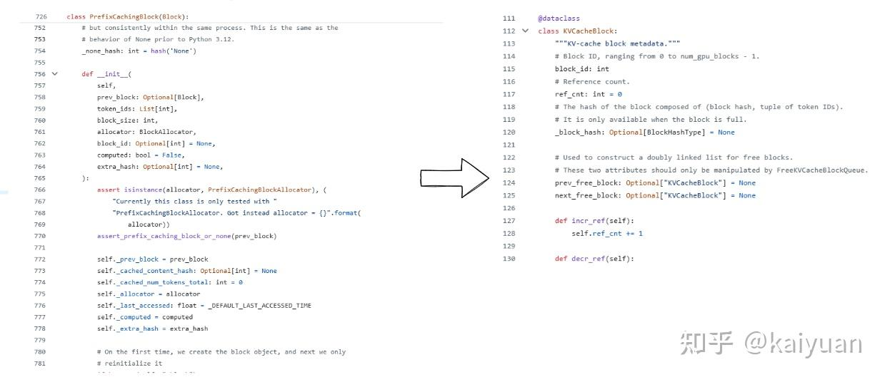

**结构类简化**：FreeKVCacheBlockQueue相比LRUEvictor需要操作的内容更少。LRUEvictor单独维护一个free table，且free table里面存储的是BlockMetaData。相比之下v1的管理仅需要维护一个简单双向链表，仅需要存储python id。

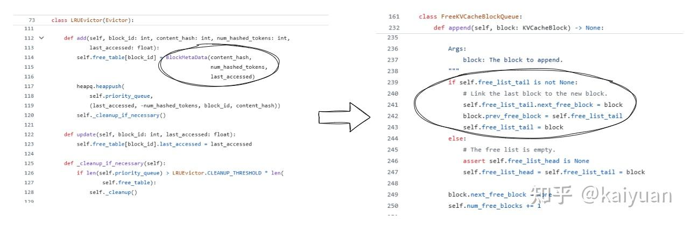

由于**结构优化、操作优化和代码优化**，使得cache命中率为0的场景下性能基本无影响，而只要命中率>0就能提速推理，整体呈现正收益。在vLLM V1版本中，prefix cache经过优化做到了在0命中率的情况下对性能无损，如下图所示是一个对比测试。

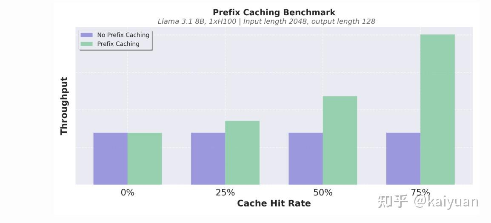

* * *

**参考：**

[vLLM V1: A Major Upgrade to vLLM’s Core Architecture](https://link.zhihu.com/?target=https%3A//blog.vllm.ai/2025/01/27/v1-alpha-release.html)

[https://github.com/vllm-project/vllm/tree/main](https://link.zhihu.com/?target=https%3A//github.com/vllm-project/vllm/tree/main)

[Automatic Prefix Caching](https://link.zhihu.com/?target=https%3A//docs.vllm.ai/en/latest/design/v1/prefix_caching.html)

[https://github.com/vllm-project/vllm/blob/main/vllm/v1/core/kv\_cache\_manager.py](https://link.zhihu.com/?target=https%3A//github.com/vllm-project/vllm/blob/main/vllm/v1/core/kv_cache_manager.py)