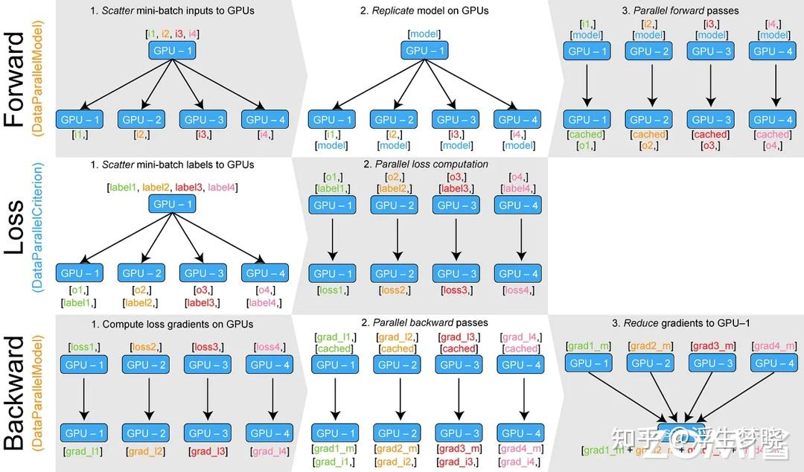
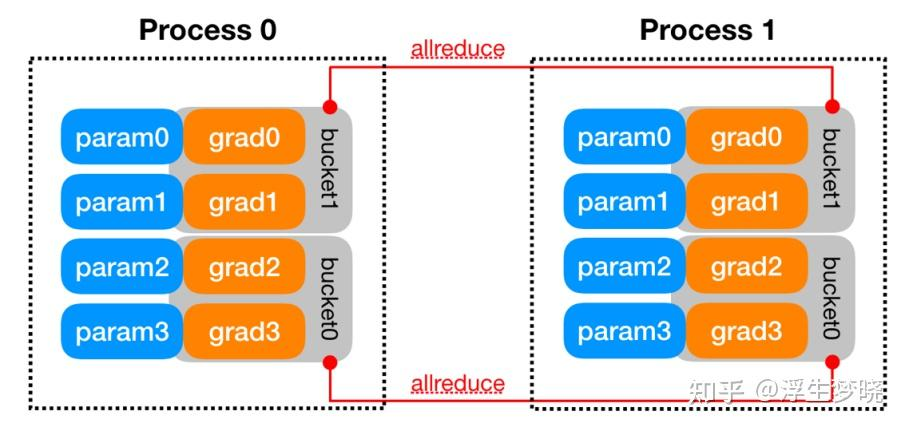
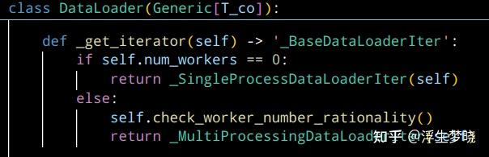
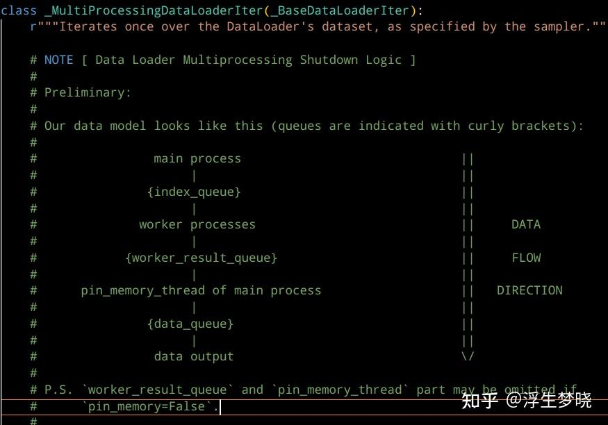
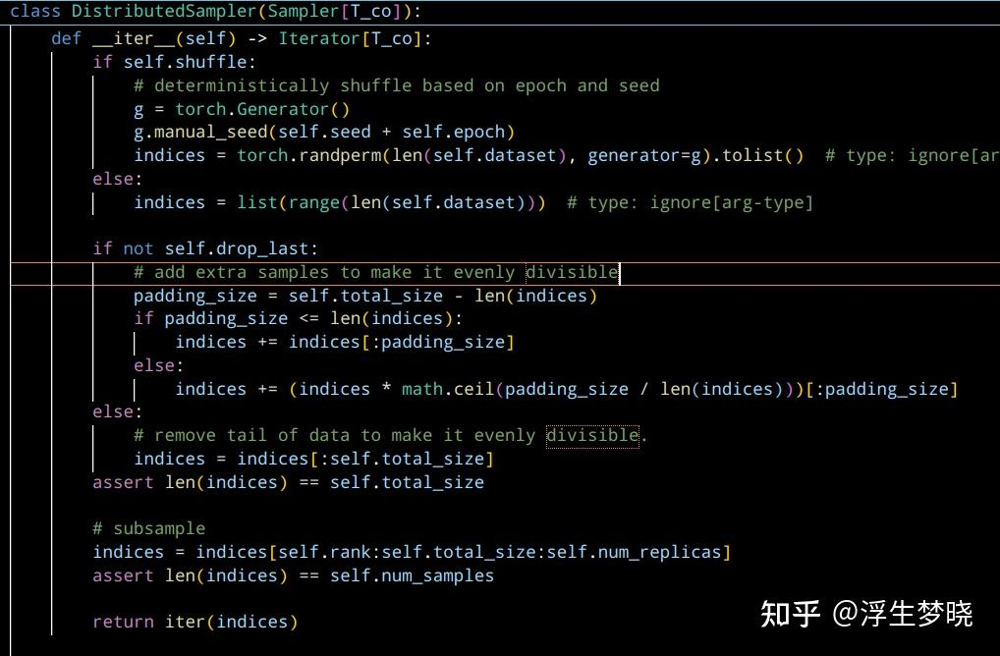

# 数据并行（DP、DDP）

**Author:** 浮生梦晓

**Date:** 2025-04-24

**Link:** https://zhuanlan.zhihu.com/p/1898824683173962973

以前整理的笔记，一直懒得发，趁致知计划发一波，一共三篇，都是模型训练或推理的加速并行方案，也都是一些比较经典的论文，不是最新的技术，毕竟都是去年的笔记了。

## DP([数据并行](https://zhida.zhihu.com/search?content_id=256922116&content_type=Article&match_order=1&q=%E6%95%B0%E6%8D%AE%E5%B9%B6%E8%A1%8C&zhida_source=entity)):单进程多线程



DP只能在单节点机器上运行，分为两个步骤：

-   [前向传播](https://zhida.zhihu.com/search?content_id=256922116&content_type=Article&match_order=1&q=%E5%89%8D%E5%90%91%E4%BC%A0%E6%92%AD&zhida_source=entity)：

-   切分数据
-   初始化分布式环境
-   将模型及优化器复制到每个GPU，保证各GPU模型及优化器完全相同，各GPU同时进行前向传播。

-   损失函数计算及[反向传播](https://zhida.zhihu.com/search?content_id=256922116&content_type=Article&match_order=1&q=%E5%8F%8D%E5%90%91%E4%BC%A0%E6%92%AD&zhida_source=entity)：

-   各GPU根据minibach数据独自进行loss计算，并行进行反向传播
-   对各GPU的梯度在一个GPU上进行汇总计算并将计算后梯度并更新参数后分发至各GPU进行next step。

> model = nn.DataParallel(model,device\_ids=\[0,1,2,3,...\])

## DDP([分布式数据并行](https://zhida.zhihu.com/search?content_id=256922116&content_type=Article&match_order=1&q=%E5%88%86%E5%B8%83%E5%BC%8F%E6%95%B0%E6%8D%AE%E5%B9%B6%E8%A1%8C&zhida_source=entity)): 多进程

DDP中，程序会启动GPU数量相同的进程，每个进程单独启动一个主训练脚本副本，开始时主进程将模型从rank0的GPU复制到其他所有GPU。

训练过程：

-   前向传递：每个GPU拿到不同的minibatch数据，并行的进行前向传播。
-   损失计算与反向传播：前向传递完成后，每个GPU独自计算损失值并反向传播与梯度更新，DDP中反向传播与梯度更新过程同时进行的（默认使用Ring-AllReduce做集合通信），使用全局梯度来更新模型参数及优化器状态。

代码实现：

```text
import argparse
from tqdm import tqdm
import torch
import torch.nn as nn
import torch.nn.functional as F
from torch.utils.data import DataLoader, Dataset

import torch.distributed as dist
from torch.nn.parallel import DistributedDataParallel as DDP

class SimpleModel(nn.Module):
    def __init__(self, input_dim):
        super(SimpleModel, self).__init__()
        self.fc = nn.Linear(input_dim, 1)
        cnt = torch.tensor(0)
        self.register_buffer('cnt', cnt)

    def forward(self, x):
        self.cnt += 1
        # print("In forward: ", self.cnt, "Rank: ", self.fc.weight.device)
        return torch.sigmoid(self.fc(x))

class SimpleDataset(Dataset):
    def __init__(self, data, target):
        self.data = data
        self.target = target

    def __len__(self):
        return len(self.data)

    def __getitem__(self, idx):
        return self.data[idx], self.target[idx]
    
parser = argparse.ArgumentParser()
parser.add_argument("--local_rank", "--local-rank", type=int)
FLAGS = parser.parse_args()
local_rank = FLAGS.local_rank

torch.cuda.set_device(local_rank)
dist.init_process_group(backend='nccl')

n_sample = 100
n_dim = 10
batch_size = 25
X = torch.randn(n_sample, n_dim)  # 100个样本，每个样本有10个特征
Y = torch.randint(0, 2, (n_sample, )).float()

dataset = SimpleDataset(X, Y)
sampler = torch.utils.data.distributed.DistributedSampler(dataset)
data_loader = DataLoader(dataset, batch_size=batch_size, sampler=sampler)

model = SimpleModel(n_dim).to(local_rank)
ckpt_path = None
if dist.get_rank() == 0 and ckpt_path is not None:
    model.load_state_dict(torch.load(ckpt_path))

model = DDP(model, device_ids=[local_rank], output_device=local_rank)

optimizer = torch.optim.SGD(model.parameters(), lr=0.001)
loss_func = nn.BCELoss().to(local_rank)

model.train()
num_epoch = 100
iterator = tqdm(range(100))
for epoch in iterator:
    data_loader.sampler.set_epoch(epoch)
    for data, label in data_loader:
        data, label = data.to(local_rank), label.to(local_rank)
        optimizer.zero_grad()
        prediction = model(data)
        loss = loss_func(prediction, label.unsqueeze(1))
        loss.backward()
        iterator.desc = "loss = %0.3f" % loss
        optimizer.step()
    if dist.get_rank() == 0 and epoch == num_epoch - 1:
        torch.save(model.module.state_dict(), "%d.ckpt" % epoch)
```

启动方式：

```text
CUDA_VISIBLE_DEVICES="0,1" python -m torch.distributed.launch --nproc_per_node 2 ddp.py
或 torchrun
```

另一种实现：

```text
def example(rank, world_size):
    # create default process group
    dist.init_process_group("nccl", rank=rank, world_size=world_size)
    # create local model
    model = nn.Linear(10, 10).to(rank)
    # construct DDP model
    ddp_model = DDP(model, device_ids=[rank])
    # define loss function and optimizer
    loss_fn = nn.MSELoss()
    optimizer = optim.SGD(ddp_model.parameters(), lr=0.001)

    # forward pass
    outputs = ddp_model(torch.randn(20, 10).to(rank))
    labels = torch.randn(20, 10).to(rank)
    # backward pass
    loss_fn(outputs, labels).backward()
    # update parameters
    optimizer.step()

def main():
    world_size = 2
    mp.spawn(example,
        args=(world_size,),
        nprocs=world_size,
        join=True)

if __name__=="__main__":
    # Environment variables which need to be
    # set when using c10d's default "env"
    # initialization mode.
    os.environ["MASTER_ADDR"] = "localhost"
    os.environ["MASTER_PORT"] = "29500"
    main()
```

启动方式：

```text
python ddp.py
```

核心代码：

```text
dist.init_process_group("nccl", rank=rank, world_size=world_size)
model = DDP(model, device_ids=[local_rank], output_device=local_rank)
sampler = torch.utils.data.distributed.DistributedSampler(dataset)
```

-   DDP前向传播模型一致性

-   模型一致性要求每次前向传递的每个进程的参数要相同，代码中通过torch.nn.Module类及DistributedDataParallel类（DistributedDataParallel是Module的子类）
-   DDP在构建及每次前向传递开始前会同步各进程之间的parameters及buffers（DistributedDataParallel类的\_\_init\_\_及forward方法中）

-   DDP计算通信重叠

-   DDP相对于DP一个重要优化是在反向传播过程中同时进行了参数更新（无需等全部梯度计算完成），这个过程称为计算与通信的重叠。




-   DDP数据加载

-   数据加载使用DataLoader迭代器，DataLoader会根据当前进程数量自动调用单进程或多进程的DataLoaderIter。



-   \_MultiProcessingDataLoaderIter中会加载多个进程，主进程负责维护一个索引队列，其他进程从队列中获取数据索引，再从数据集中加载数据并进行预处理，处理后数据放在结果队列中，供主进程使用。



-   torch.utils.data.distributed.DistributedSampler在分布式环境中根据GPU的索引来进行数据切分，使得每个GPU不同的minibatch数据 。

