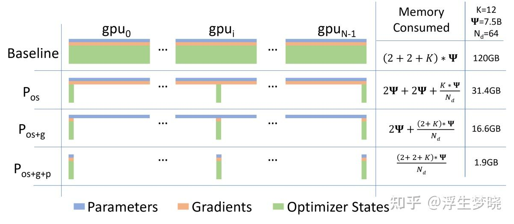
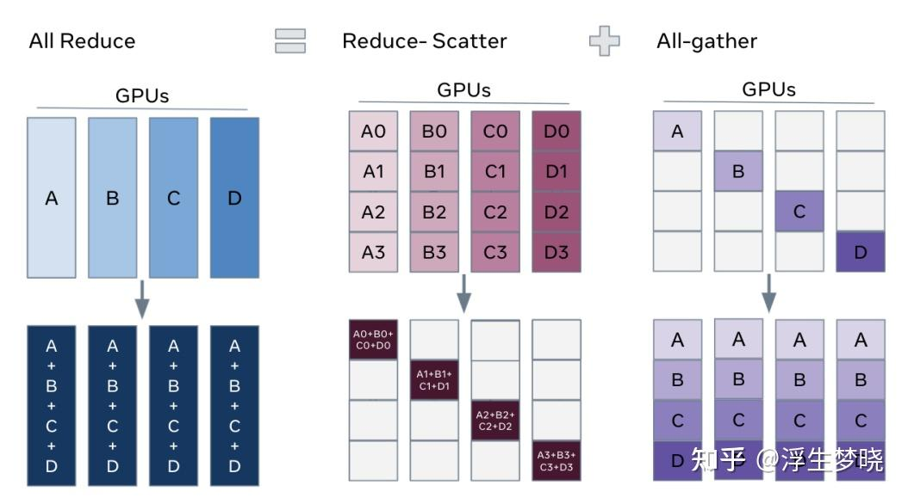
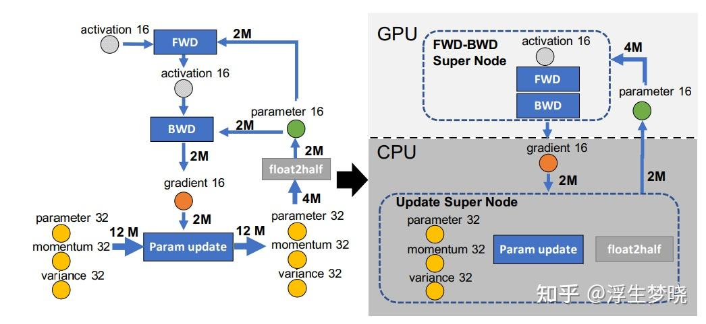
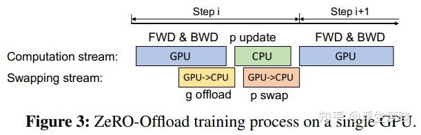
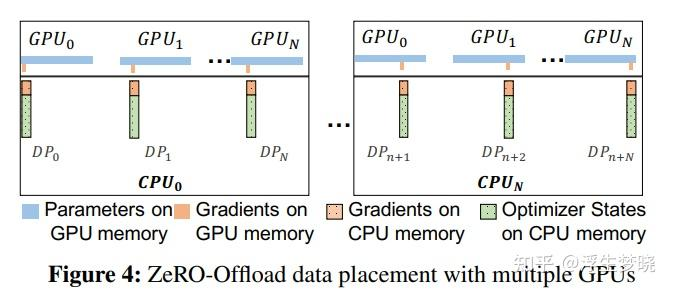
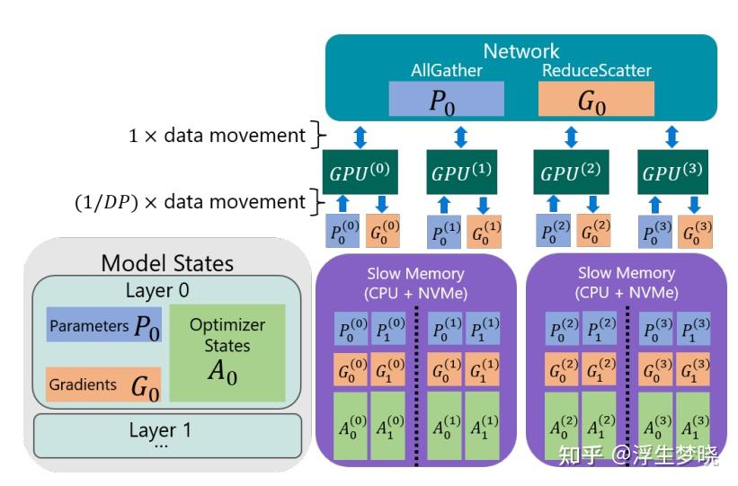
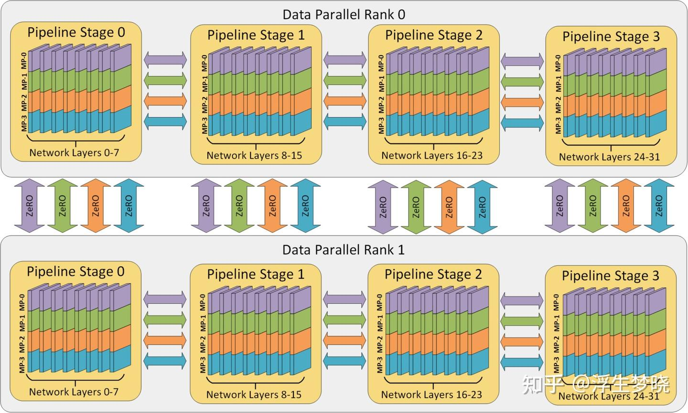
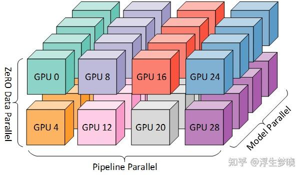

# 解析Zero系列(deepspeed技术栈)&FSDP

**Author:** 浮生梦晓

**Date:** 2025-04-24

**Link:** https://zhuanlan.zhihu.com/p/1898827067283441255

**v1: [ZeRO](https://zhida.zhihu.com/search?content_id=256922398&content_type=Article&match_order=1&q=ZeRO&zhida_source=entity): Memory Optimizations Toward Training Trillion Parameter Models**

**v2: ZeRO-Offload: Democratizing Billion-Scale Model Training**

**v3: ZeRO-Infinity: Breaking the GPU Memory Wall for Extreme Scale Deep Learning**

**这篇记录一些之前学习Zero并行的笔记，这几天整理了一下上传，不是最新方案，是经典的Zero原始的论文方案。**

### [混合精度训练](https://zhida.zhihu.com/search?content_id=256922398&content_type=Article&match_order=1&q=%E6%B7%B7%E5%90%88%E7%B2%BE%E5%BA%A6%E8%AE%AD%E7%BB%83&zhida_source=entity)

-   混合精度训练可以分为两个部分：半精度 和 权重备份，使用 FP16 和 [FP32](https://zhida.zhihu.com/search?content_id=256922398&content_type=Article&match_order=1&q=FP32&zhida_source=entity) 来举例。在训练开始时，准备两套模型状态，其中一套为 FP32 类型（优化器状态和模型参数），另一套为 FP16 类型（模型参数），在前向传播、反向传播时，都使用 FP16 类型的模型参数进行计算；而在参数更新时，将梯度成与学习率η相乘，更新到 FP32 类型的模型状态上，在新一轮的训练中，再次将 FP32 类型的模型拷贝为 FP16 类型的模型。这个过程就是混精度训练。
-   在计算密集的前向传播、反向传播中，使用了 FP16 进行计算，与单精度相比，训练的速度会大幅度提升。另外，由于激活值在训练过程中占用内存的很大部分，使用 FP16 储存激活值在大批量训练时也会节省内存。同时，在分布式环境下使用 FP16 梯度通信量也会降低。

### 内存消耗估计

-   模型训练过程中主要的内存占用分为两类：**模型状态（Model States）** 和**剩余状态（Residual States）**

-   模型状态（必须存储的部分）假设模型参数量为#：

-   优化器状态（8#）-fp32：Adam/Adamw 优化算法中的 一阶矩和二阶矩；
-   模型梯度(2#)-fp16；
-   模型参数(6#)-fp32-fp16；
-   total:16#

-   剩余状态（非必须存储）：

-   激活值：自动微分中间值，如果不存储反向传播时需重新计算。
-   临时存储：分布式通信的临时存储空间
-   内存碎片

## [FSDP](https://zhida.zhihu.com/search?content_id=256922398&content_type=Article&match_order=1&q=FSDP&zhida_source=entity)(Fully Sharded Data Parallel)——完全分片数据并行

-   全分片数据并行是基于零冗余优化器（ZeRO）的具体在 [Pytorch](https://zhida.zhihu.com/search?content_id=256922398&content_type=Article&match_order=1&q=Pytorch&zhida_source=entity)框架中的实现。
-   在数据并行过程中，每个GPU都需要保存一份完整的参数（模型状态和剩余状态），但只有在某一层前向或反向传播时会用到该层的参数，其余时刻并未使用，因此可以在不使用的时候转移至其他地方来节省内存空间。
-   ZeRO有两套优化方案：

-   ZeRO-DP：减少模型状态的内存占用。
-   ZeRO-R：减少剩余状态的内存占用。

### ZeRO-DP

-   对模型状态进行切分，每个GPU只会存储1/N的模型状态，需要时使用[ALL-Gather](https://zhida.zhihu.com/search?content_id=256922398&content_type=Article&match_order=1&q=ALL-Gather&zhida_source=entity)来获取参数，是模型并行与数据并行的混合实现。

-   ZeRO1：优化器切分（adamw 8# + 参数 4#），约4倍显存节约，通讯量与DP相同。
-   ZeRO2：优化器+梯度，约8倍显存节约，通讯量不增加
-   ZeRO3：优化器+梯度+参数，显存减少与GPU数量呈线性，通讯量增加50%。

ZeRO1通信及内存分析：

-   通信：

-   数据并行及模型加载：**优化器状态**分为N份，每个GPU1份，训练数据分为N份，每个GPU1份。
-   每个GPU独立进行前向与反向，算出每个GPU上局部梯度。
-   **梯度集合：对各GPU上局部梯度执行ALL-Reduce，执行后每个GPU具有完整梯度，ALL-Reduce的单个GPU通信量为2$。**
-   权重更新：使用更新后的梯度对权重进行更新。
-   总单卡2$通信量。

  

-   内存：

-   原：(4+K#) 大约 16#
-   ZeRO1后：4#+(K#)/N ：当N很大很大时，接近于4#
-   因此大约带来4倍显存节约。

ZeRO2通信及内存分析：

-   通信

-   数据并行及模型加载：**优化器状态和梯度**分为N份，每个GPU1份，训练数据分为N份，每个GPU1份。
-   每个GPU独立进行前向与反向，算出每个GPU上局部梯度。
-   **梯度分片与集合：对各GPU上的局部梯度执行[Reduce-Scatter](https://zhida.zhihu.com/search?content_id=256922398&content_type=Article&match_order=1&q=Reduce-Scatter&zhida_source=entity) 操作，每个GPU只维护一部分梯度（与优化器部分相同），执行完成后释放其他梯度内存，Reduce-Scatter单卡通信为1$**
-   权重更新：每个GPU更新自己部分权重（优化器及梯度相同的部分参数）。
-   **权重集合：对每个GPU上权重执行ALL-GAather操作，更新全部GPU上权重，ALL-GAather单卡通信为1$**
-   总单卡2$通信量。

  

-   内存

-   原：(4+K#) 大约 16#
-   ZeRO2后：2#+(2+K#)/N ：当N很大很大时，接近于2#
-   因此大约8倍显存节约

ZeRO3通信及内存分析：

-   通信：

-   数据并行及模型加载：**优化器状态和梯度和参数**分为N份，每个GPU1份，训练数据分为N份，每个GPU1份。
-   **前向计算：需要对每个GPU上权重执行All-Gather操作，更新完整W，不属于自己的W被抛弃，All-Gather单卡通信为1$。**
-   **反向：再次对权重W进行All-Gather，计算后抛弃不属于自己的W，All-Gather单卡通信为1$。**
-   **梯度集合：计算得到各种部分梯度后对梯度进行Reduce-Scatter 操作，聚合结束后，立刻抛弃不属于自己维护的梯度，Reduce-Scatter 单卡通信为1$。**
-   梯度更新：每块GPU有自己的优化器状态、梯度及参数，自己计算自己的。
-   总单卡3$通信量。

-   内存：

-   原：(4+K#) 大约 16#
-   ZeRO1后：(4+K#)/N
-   提升N倍内存节约

### ZeRO-R

针对剩余状态进行优化来减少内存开销，主要以下策略：

-   分区激活检查点：解决激活值占用内存问题。将激活值进行切分，每个GPU存储1/N的激活值，反向使用时使用All-Gather聚合，也可以将激活值卸载到CPU内存，再次降低显存，但会造成cpu-gpu通信开销。
-   恒定大小缓冲区：一些操作如All-reduce 需要将张量拼成连续的临时缓冲区，规划好缓冲区大小，防止oom
-   内存碎片整理：激活值、梯度等周期性数值会造成大量内存碎片，ZeRO-R 通过预分配和动态管理这些张量的内存，减少了内存碎片和内存分配器的开销，提高了内存利用率。

## **[Zero-Offload](https://zhida.zhihu.com/search?content_id=256922398&content_type=Article&match_order=1&q=Zero-Offload&zhida_source=entity)**

ZeRO-Offload主要解决内存墙问题，应用与Zero2策略上，避免将计算密集型任务卸载到 CPU，例如前向和后向传播。而将权重参数更新、正则化等用 CPU 计算。

Zero-offload主要分为Offload Strategy（主要解决GPU和CPU间划分模型的问题）和Offload Schedule（主要解决如何调度计算和通信的问题）

-   Offload strategy3点策略：

-   保证CPU的计算负担远小于GPU，防止CPU成为计算瓶颈。
-   保证CPU和GPU之间的通信量最小。
-   保证GPU的内存节省最大。

-   CPU负责优化器部分及16位梯度，复制更新参数。
-   GPU负责前向及反向传播，存储16位参数及激活值。

**Offload Schedule**

单卡：

-   橙色块写错：应为CPU →GPU [https://github.com/microsoft/DeepSpeed/issues/698](https://link.zhihu.com/?target=https%3A//github.com/microsoft/DeepSpeed/issues/698)
-   将 GPU 到 CPU 的梯度 offload 和 GPU 上反向传播时的梯度计算重叠，以及将 CPU 到 GPU 的参数 swap和 CPU 上的参数更新重叠。

多卡：

## ZeRO-Infinity

进一步实现了Zero3参数的offload，将参数、梯度、优化器全部切分放到CPU上，运行时调度到相应GPU上，这种方法实现了GPU，CPU，NVMe异构设备之间的数据迁移。

## Deepspeed中的3D Parallel

DeepSpeed中3D并行示意图

相关论文地址：

