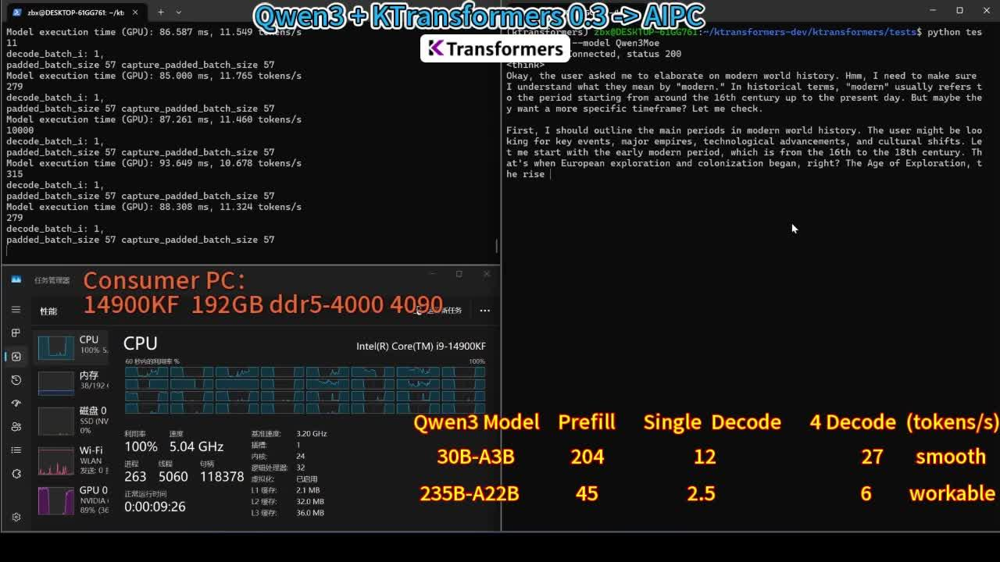
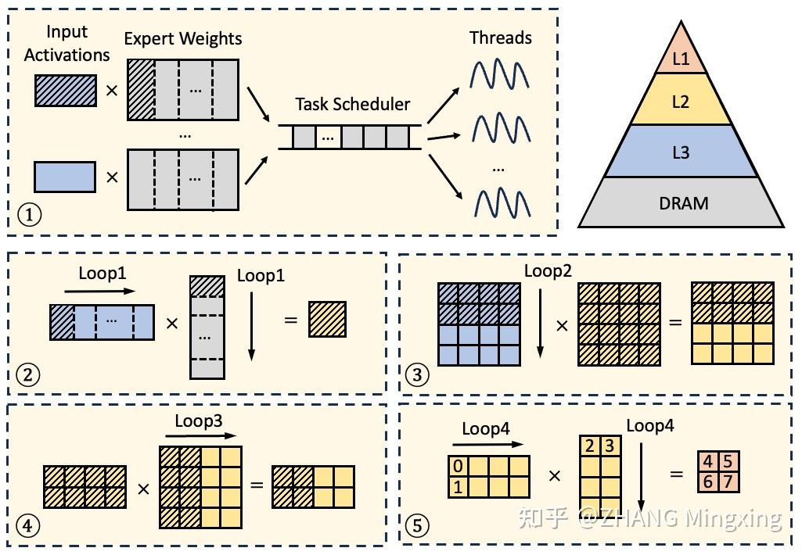

# Qwen 3 + KTransformers 0.3 (+AMX) = AI 工作站/PC

**Author:** ZHANG Mingxing

**Date:** 2025-04-28

**Link:** https://zhuanlan.zhihu.com/p/1900318746402329329

> 详情可见: [https://github.com/kvcache-ai/ktransformers/blob/main/doc/en/AMX.md](https://link.zhihu.com/?target=https%3A//github.com/kvcache-ai/ktransformers/blob/main/doc/en/AMX.md)

继 [DeepSeek-V3](https://zhida.zhihu.com/search?content_id=257122943&content_type=Article&match_order=1&q=DeepSeek-V3&zhida_source=entity)/R1，[LLaMa-4](https://zhida.zhihu.com/search?content_id=257122943&content_type=Article&match_order=1&q=LLaMa-4&zhida_source=entity)，[Kimi-VL](https://zhida.zhihu.com/search?content_id=257122943&content_type=Article&match_order=1&q=Kimi-VL&zhida_source=entity) 之后，Qwen 也发布了效果优秀的 [MoE 模型](https://zhida.zhihu.com/search?content_id=257122943&content_type=Article&match_order=1&q=MoE+%E6%A8%A1%E5%9E%8B&zhida_source=entity) ，毫无疑问今年已经是 MoE 的时代了。  
KTransformers 作为定位在本地异构环境下低门槛运行 MoE 模型的推理系统，自然也不会缺席。  
感谢 Qwen 团队的支持，我们**在 Day 0 就完成了对于 [Qwen 3](https://zhida.zhihu.com/search?content_id=257122943&content_type=Article&match_order=1&q=Qwen+3&zhida_source=entity) 系列 MoE 模型的支持**。  
同时，也借此机会我们**开源了大家期待已久的 AMX 高性能算子**的初步版本（BF16, Int8, 后续会更新 int4 版本)，正式推进到 0.3 版本~  
  
  
这次 Qwen3MoE 尤其令我感到兴奋的一点在于，相比于 671B 的巨无霸模型，Qwen3MoE 的两个不同大小 235B-A22 和 30B-A3B 分别**命中率本地工作站和消费级PC的甜点区域**。  
因此我们分别测试了（1）服务器CPU（Xeon4）+4090 和（2）消费级CPU（Core i9 14900KF + 2通道 4000MT）+ 4090D，这样两个典型场景，结果如下：



00:46

  


  
可以看到，得益于 AMX 指令的优化，我们在工作站场景上可以实现高达 347.7 tokens/s 的 Prefill 性能。而在消费级的 CPU 上，我们也做到了大模型（235B-A22）能跑，小模型（30B-A3B）流畅的性能。  
甚至从资源开销来看似乎高性能的游戏本也是可以流畅玩 30B-A3B 的。AIPC 这个概念说了这么久，可以说终于是看到可能性了。  
  
  
为了更好的方便大家理解我们本次开源的 AMX 的优化，我们也准备了一个简要的文档。也感谢 Intel 期间提供的帮助。

##   
[AMX 指令集](https://zhida.zhihu.com/search?content_id=257122943&content_type=Article&match_order=1&q=AMX+%E6%8C%87%E4%BB%A4%E9%9B%86&zhida_source=entity)介绍

  
Intel Advanced Matrix Extensions（AMX） 是 x86 架构在 [Sapphire Rapids](https://zhida.zhihu.com/search?content_id=257122943&content_type=Article&match_order=1&q=Sapphire+Rapids&zhida_source=entity)（第四代 Xeon Scalable）及后续处理器中引入的一组专用指令扩展，用于在硬件层面加速大规模矩阵运算，特别是深度学习推理和机器学习工作负载的计算密集型部分。它通过 Tile 寄存器的概念，将二维子矩阵加载到专用 Tile 寄存器中，并在寄存器级别执行矩阵乘加操作，显著提升吞吐量和能效。  
每个 CPU 核心有 8 个专用寄存器 tmm0–tmm7，每个专用寄存器最多可容纳 16 行×64 字节的数据，用于存放二维子矩阵 。另外还有一个 64 字节的配置寄存器 TILECFG 用来描述每个 tmm 寄存器的行数、列数和行跨度。  
AMX 的主要指令如下表所示

| 指令类别 | 指令名称 | 功能描述 |
| --- | --- | --- |
| 配置指令 | LDTILECFG, STTILECFG, TILERELEASE, TILEZERO | 配置／重置 Tile 寄存器及其元数据 |
| 加载／存储指令 | TILELOADD, TILELOADDT1, TILESTORED | 将内存和 Tile 寄存器互相拷贝 |
| INT8 计算指令 | TDPBSSD, TDPBUSD, TDPBUUD, TDPBSUD | 对 tile 中的 int8 子矩阵执行乘法并累加 |
| BF16 计算指令 | TDPBF16PS | 对 tile 中的 bfloat16 子矩阵执行乘法并累加 |

  
为了简化开发，Intel 提供了对应的 intrinsic，这样，C/C++ 程序员无需再写冗长的汇编，即可享受 AMX 带来的性能提升，例如

```cpp
#include <immintrin.h>

_tile_loadconfig(cfg_ptr);
_tile_loadd(tmm0, A_ptr, lda);
_tile_loadd(tmm1, B_ptr, ldb);
_tile_zero(tmm2)
_tile_dpbf16ps(tmm2, tmm0, tmm1);
_tile_stored(tmm2, C_ptr, ldc);
_tile_release();
```

  
完成了一个从内存的 A\_ptr，B\_ptr 拷贝子矩阵到 Tile 寄存器，调用 AMX BF16 计算指令计算两个子矩阵的乘法，再把乘法的结果拷贝到内存的 C\_ptr 的过程。  
以 INT8 为例， AMX 可以用单条指令完成两个 16x64 的子矩阵的乘法，即 32768 次乘/加操作，单条指令使用 16 个 CPU 时钟周期，因此每个核心每个时钟周期能完成 2048 次乘/加操作，是 AVX-512 指令集的8倍。在 Intel [Xeon4 CPU](https://zhida.zhihu.com/search?content_id=257122943&content_type=Article&match_order=1&q=Xeon4+CPU&zhida_source=entity)上，理论上单颗核心即可提供 4TOPS 的算力，非常适合执行 CPU 上的计算密集任务。


##   
KTransformers 中的 AMX kernel

  
在 v0.3 之前，KTransformers 在CPU上进行矩阵乘法是基于 llamafile 提供的算子。但遗憾的是，llamafile的实现目前还没有针对AMX指令集做优化，这就导致即使是在强劲的硬件环境（比如 Xeon 4th Gen + 4090）下，推理 DeepSeek-V3/Qwen3 这样的超大模型，在 prefill 阶段的速度也只有78 tokens/s，CPU 计算能力仍成为明显的性能瓶颈。对于文档处理等长 prompt 场景来说，这样的性能明显是无法令人满意的。为了充分发挥CPU的潜力，我们在v0.3版本中引入了全新的AMX优化路径，并辅以多项技术细节改进。

### AMX Tiling-aware 的内存布局

AMX提供了一种高吞吐量的 Tile 寄存器计算模型，这种粗粒度矩阵处理方式可以大幅减少指令数，提高理论吞吐量。但要真正发挥AMX性能，内存访问效率成为决定性因素：由于AMX一次搬运的是整个 Tile，如果 Tile 未对齐、内存访问模式杂乱，就会引起大量的cache miss，最终抵消掉指令吞吐带来的优势。

  
因此，在v0.3中，我们不再直接将GGUF格式文件映射到内存，而是在模型加载阶段引入了AMX Tiling-aware 的内存预处理。具体而言，对于MoE模型中的专家权重矩阵，我们将其事先重排成一组 Tile 友好的子矩阵，每个子矩阵的形状恰好与AMX Tile 寄存器匹配，避免推理时的动态转置开销。重排过程中，我们强制对齐每个子矩阵的起始地址到64字节，避免读取时的 cache line split。并且，子矩阵严格按照计算过程中的访问顺序排布，通过编译器和硬件的顺序预取能力，最大化L1/L2 cache命中率。

  
针对Int8量化格式，我们采用对称分组线性量化（Symmetric Group-wise Quantization）策略。权重矩阵每列为一组，组内共享一个缩放因子（scale factor），缩放因子单独存储以保持 Tile 数据本体的内存对齐。  
这种 AMX Tiling-aware 内存布局的设计，降低了内存访问延迟，同时为下游计算 kernel 提供了最佳的输入条件。

### 缓存友好的 AMX kernel

在推理执行过程中，我们围绕CPU多级缓存结构进行了设计，目的是通过合理的数据布局和任务划分，使得输入数据、权重参数以及中间结果尽可能在高速缓存中就地完成计算，最大限度减少对主内存（DRAM）的访问频率和开销。

  
如下图所示，专家权重矩阵首先按列划分为多个任务，这些任务通过动态调度机制分配给不同线程执行。（1）输入激活在各个任务间是共享的，由于任务分配的局部性，因此通常驻留在共享的L3缓存中；（2）在每个任务内部，专家权重矩阵进一步按行划分为若干块（blocks），每个 block 的大小被精确调整，以确保计算期间输入激活、权重以及中间结果都能驻留在L2缓存中，避免频繁访问主存；（3，4，5）每个块被视为一组与AMX Tile寄存器完全匹配的子矩阵，在Tile级别的运算过程中，计算逻辑会不断地加载成对的输入Tile（tmm0–tmm1）和专家权重Tile（tmm2–tmm3），随后通过四条AMX乘法指令直接在Tile寄存器（tmm4–tmm7）中完成乘积生成与累加，在此过程中，输出激活可以完全在Tile寄存器/L1缓存中完成累加，无需额外的数据移动。  
  



  
简而言之，我们充分利用了缓存层次结构，整个过程中，专家权重和输出激活的每一个数据元素只需访问DRAM一次，其余均在L2或更高级缓存命中；输入激活的每一个数据元素只需访问DRAM一次，其余均在L3或更高级缓存命中。通过这种设计，我们显著减少了主存访问，提升了整体执行效率。

### 低计算强度场景下的 AVX-512 kernel 适配


如上图所示，AMX虽然在大规模矩阵乘法上有极高效率，但在计算强度较低的场景，比如以向量-矩阵乘为主的 decode 阶段中，表现并不理想。因为每次调度 AMX Tile 需要固定的指令开销，在数据量不足以填满一个 Tile 时造成浪费，导致吞吐量下降。 针对这种情况，我们引入了轻量级 AVX-512 kernel 作为补充。这个内核遵循与 AMX kernel 相同的内存布局，主要区别在于将大块的 AMX 矩阵-矩阵乘法替换为细粒度的AVX-512 向量-矩阵乘法，降低了小规模矩阵计算的延迟。KTransformers 会在运行时基于当前任务的计算强度，自适应地选择 AMX/AVX-512 kernel，在长 prompt 的 prefill 阶段（平均每个专家处理超过4个token时）自动选择AMX kernel；而在短 prompt 的 prefill 阶段以及 decode 阶段，动态切换到AVX-512 kernel。这样可以在不同算术强度条件下，始终保持最佳执行效率。

### MoE 算子的融合与动态调度

MoE 模型每层包含大量的专家，每个专家的计算又包含三次矩阵乘法运算（Gate、Up、Down projection），因此涉及大量小型矩阵乘法任务。如果每个小任务独立调度，线程间同步开销巨大，严重拖慢整体推理速度。因此，我们通过算子融合，将同一层的所有专家的相同矩阵计算合并成一个大任务统一调度。进一步，由于 Gate 和 Up projection 之间没有数据依赖，所以它们的计算又可以再合并，最终一层的所有矩阵乘法被融合成两个任务，显著减轻了调度开销。

  
此外，为了解决负载不均衡问题，特别是在 Prefill 阶段（专家激活分布高度不均时）表现突出的负载倾斜现象，我们引入了动态任务调度策略。具体来说，我们将每个矩阵乘法任务进一步细粒度地划分成多个子任务，并在初始时给每个CPU线程分配相同数量的任务，每个线程完成自己的任务以后，通过原子操作“窃取”其他线程的任务，这种机制极大缓解了负载不均衡问题，实现了近乎最优的CPU资源利用率。  
  
  
经过以上优化，我们的 kernel 在 Xeon4 CPU 上可以达到 21 TFLOPS 的 BF16 吞吐和 35 TOPS 的 Int8 吞吐，比PyTorch 的通用 AMX kernel 快了4倍左右。对于 DeepSeek-V3/Qwen3，使用 Xeon4 CPU 搭配单张 [RTX 4090](https://zhida.zhihu.com/search?content_id=257122943&content_type=Article&match_order=1&q=RTX+4090&zhida_source=entity)，可以达到 418 tokens/s 的端到端吞吐。KTransformers 的 AMX kernel 是首个专为 MoE 推理场景设计的 AMX kernel，降低了大模型本地部署的硬件门槛，让更多开发者能以更低成本，享受接近 GPU 级别的推理体验。


  
以上就是我们对于 AMX 优化的一些总结。

  


很高兴这次能够加入 Qwen 的朋友圈，敬请期待我们后续的更新~