# vLLM V1 Scheduler的调度逻辑&优先级分析

**Author:** kaiyuan

**Date:** 2025-05-01

**Link:** https://zhuanlan.zhihu.com/p/1900957007575511876

​

目录

收起

1 调度器运行逻辑

1.1 调度器主要结构

1.2 调度的整体流程图

2 不同版本对比

3 优先级调度

3.1 当前情况

3.2 V1实现方式讨论

vLLM的调度器（[scheduler](https://zhida.zhihu.com/search?content_id=257202184&content_type=Article&match_order=1&q=scheduler&zhida_source=entity)）会根据系统资源和请求情况组织每次推理需要计算的数据。调度器的处理流程随着框架的升级出现了较大改动，本文以**V0.8.4版本**为基础分析一下调度器处理流程。其次，当前的scheduler里面没有指定优先级调度逻辑，该如何实现？本文也会就此进行讨论。

## 1 调度器运行逻辑

需要说明的是，scheduler的场景分为两大类：一个是混合式调度，需要同时处理[prefill](https://zhida.zhihu.com/search?content_id=257202184&content_type=Article&match_order=1&q=prefill&zhida_source=entity)和[decode](https://zhida.zhihu.com/search?content_id=257202184&content_type=Article&match_order=1&q=decode&zhida_source=entity)计算；另一个是PD分离式调度，scheduler仅需要处理prefill或者decode场景中的一种。 这里主要讨论混合式调度器。混合式的调度流程在vLLM中有三种版本：

-   [V0默认调度](https://zhida.zhihu.com/search?content_id=257202184&content_type=Article&match_order=1&q=V0%E9%BB%98%E8%AE%A4%E8%B0%83%E5%BA%A6&zhida_source=entity)
-   [V0 chunked prefill调度](https://zhida.zhihu.com/search?content_id=257202184&content_type=Article&match_order=1&q=V0+chunked+prefill%E8%B0%83%E5%BA%A6&zhida_source=entity)
-   [V1调度](https://zhida.zhihu.com/search?content_id=257202184&content_type=Article&match_order=1&q=V1%E8%B0%83%E5%BA%A6&zhida_source=entity)

### 1.1 调度器主要结构

调度器的数据处理流程主要是根据两个队列（waiting、running）的数据，按照资源和[FCFS](https://zhida.zhihu.com/search?content_id=257202184&content_type=Article&match_order=1&q=FCFS&zhida_source=entity)原则构建调度输出，主要结构模块如下图所示，为了便于理解流程逻辑，图中列出了几个辅助容器（list）：

-   被抢占请求(preempted\_reqs)：运行中由于资源不足被换出的请求；
-   新建请求(scheduled\_new\_reqs)：首次运算的请求存入该列表；
-   恢复请求(scheduled\_resumed\_reqs）: 在worker中有cache数据的请求；
-   被跳过请求(skipped\_reqs)：满足一定条件需要被跳过执行的请求；

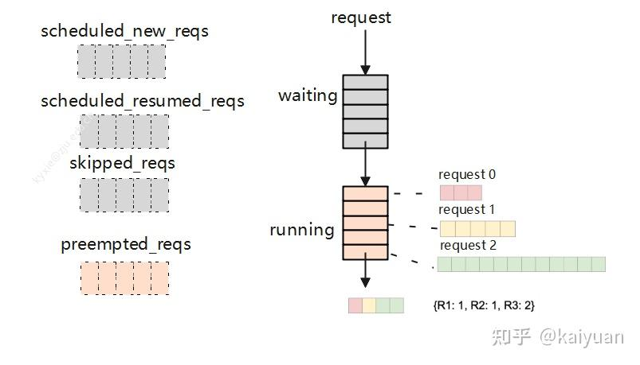

preempted\_reqs是在处理running队列时使用，当一个正在运行的请求所需blocks不足时，会尝试从running队列尾端释放一个请求的blocks，并把该请求转移到waiting队列重新计算；skipped\_reqs是在处理waiting队列时使用，当一个正在运行的请求满足特定条件（等待FSM编译、超过单个批次中允许使用的最大LoRA数量）时跳过处理，将请求存入skipped\_reqs，最后将skipped\_reqs接到waiting队列队尾。

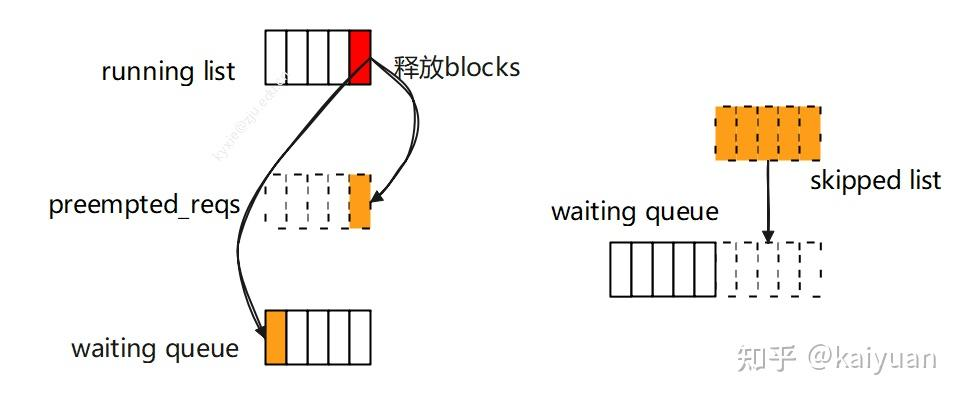

scheduled\_new\_reqs和scheduled\_resumed\_reqs是在running处理中区分请求的类别使用，当一个请求状态是等待（waiting）时说明它未被worker处理过，放入scheduled\_new\_reqs；当一个请求状态是抢占（preempted）时，它在worker中有过计算，放入scheduled\_resumed\_reqs列表中。 这个设计是为了让scheduler去状态管理。

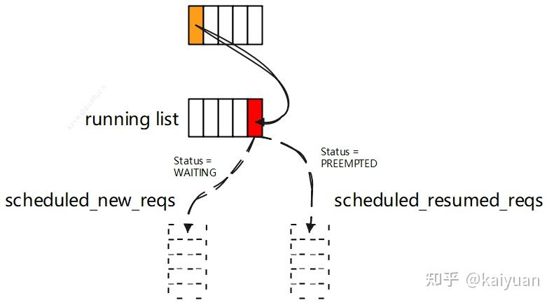

调度器里面还会使用KVCacheManager管理请求需要的block，这里不做展开。

### 1.2 调度的整体流程图

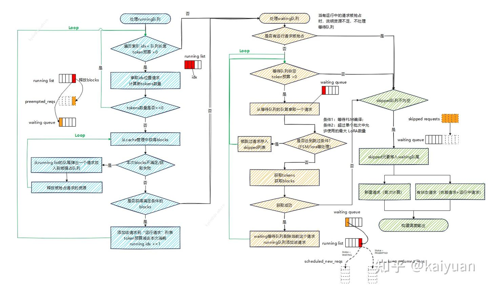

调度流程分为三个步骤：先处理running队列，然后处理waiting队列，最后构建调度输出。当前调度策略：

-   FCFS，先到先服务/计算；
-   资源不足时从运行队列尾部淘汰数据，被淘汰的数据返回等待队列；
-   不区分prefill和decode。

**running队列的处理**

这个步骤有两个处理循环，外层循环遍历running队列的元素，顺序是从队首到队尾，依次遍历元素；内层循环寻找资源，从running的队尾到队首。

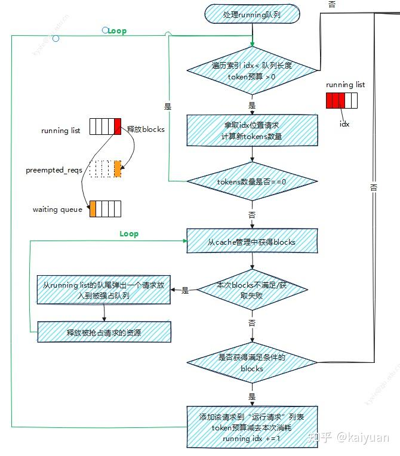

执行开始会从running的队首取一个请求，如果该请求有资源（tokens + blocks）则放入运行列表中，循环处理下一个数据；如果请求的资源不足时分两种情况处理，一种是tokens预算不足时，循环则直接结束；另一种是blocks不足时，通过内层循环寻找资源。内层循环执行是不断的从running的队尾抢占资源给当前请求直到满足要求，队尾被抢占的请求会放回waiting队列。

**waiting队列的处理**

首先会判断running队列中是否有请求别抢占，如果被抢占列表非空则跳过本阶段处理。这个原因很简单，因为已没有资源给运行中请求了，所以就不再将等待的请求进行运算处理。本段主要是一个循环遍历waiting队列，若有资源不足则跳出循环。执行开始，处理waiting队首的请求，若该请求未被跳过且资源满足要求，则加入运行列表中，若不满足则结束本阶段的处理。

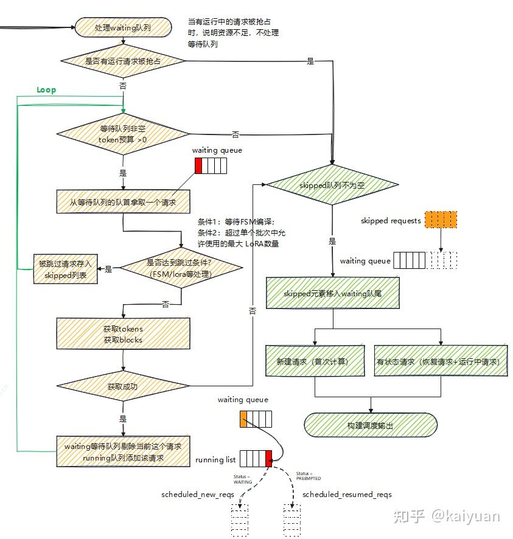

**输出结果构建**

本步骤主要是将前面跳过的请求重新加入等待队列，并且按照请求的类别进行输出构建。因为涉及数据传递不同，首次运算的请求与再次运算的请求分开，在worker中记录了运算过的请求的情况，所以scheduler下发的数据仅需要将有差异的带入即可。

## 2 不同版本对比

前面提到vLLM的混合调度有几种版本：V0默认调度、V0 chunked prefill调度、V1调度。其中"V0默认调度"是最早出现的，然后是V0 chunked prefill调度，最新的是V1调度，下面按照特点、策略、运行流程进行对比。

**V0默认的调度方式**

**特点**：Prefill和Decode是分开执行，有waiting、running、swapped三个队列。

**策略**：尽量多地凑整Prefill批量执行（prefill优先），FCFS原则。

**运行流程**：该调度方式目前的介绍已比较详细，这里仅总结一些关键点：

-   decode执行可以被抢占（当GPU资源不足或者用户设置），被抢占的请求下一轮优先处理。
-   waiting队列存放未执行的请求（仅包含prompt且未做prefill），running队列存放在运算的请求，swapped队列存放被换出的请求（处于decode阶段）；
-   当一个请求被抢占时，要么回waiting队列重计算，要么回swapped队列等待。

**V0 chunked prefill调度**

**特点**：Prefill和Decode可混合执行，有waiting、running、swapped三个队列。

**策略**：尽可能的调度更多decoding计算（decode优先），FCFS原则。

**运行流程**：先处理running队列，接着处理swapped队列、处理waiting队列，最后打包输出。其中running队列的处理的被抢占方式有两种，一种是重计算，请求资源完全释放并返回waiting队列；另一种是换出，请求资源从GPU换到CPU，请求进入swapped队列。

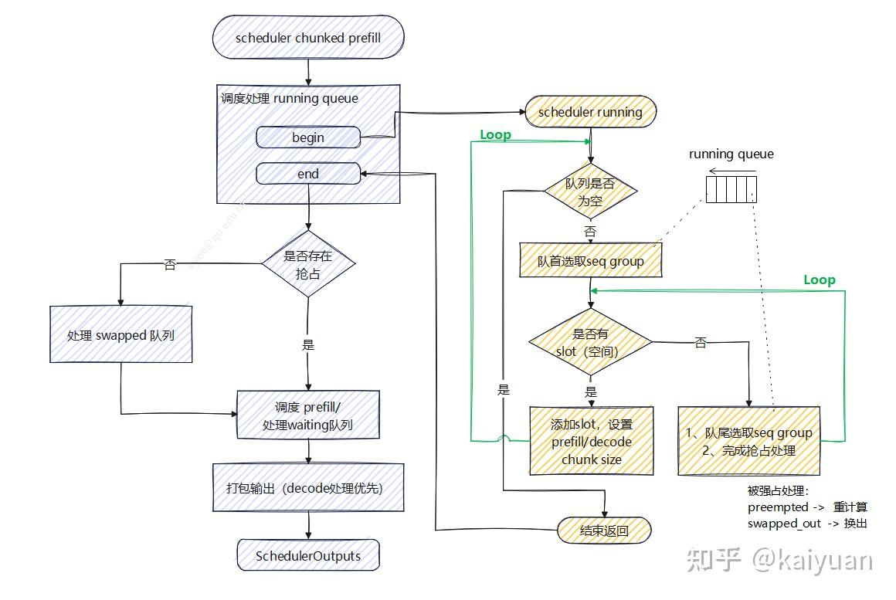

**V1默认调度**

**特点**：Prefill和Decode可混合执行，有waiting、running两个队列

**策略**：不区分Prefill和Decode调度，FCFS原则。

**运行流程**：见上一节。

三种调度方式在处理优先级上都会考虑资源的使用情况，一般按照FCFS原则处理，但仅V0默认调度支持请求优先级设置，即用户能够设置一个优先级让请求更快处理。如果要在V1上实现优先级调度该怎么处理？见下一节

讨论一个问题，在V1调度中为什么要取消swapped队列（GPU-CPU KV cache Swaping）？

Swaping这个功能是为了防止被换出的请求占用资源，而导致在运行请求资源不足，计算过的KV cache放入cpu内存中在需要的时候再置换回来，需要考虑的是GPU-CPU的交互，这不仅会占用通信通道，同时数据搬运也会产生一定的时间消耗。在V1中由于kv cache默认开启prefix功能，prefix cache能够保持历史的计算数据，所以换出的请求数据不一定会丢失，详见<[prefix cache零开销分析](https://zhuanlan.zhihu.com/p/1896927732027335111)\>。其次是，V1采用了chunked数据形态，其对资源的管理粒度相应地也变细，如下图，能够控制单个请求tokens的数量，请求的资源数据更容易凑整。

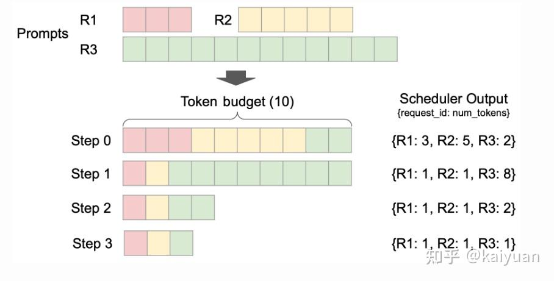

## 3 优先级调度

### 3.1 当前情况

在vLLM调度器的策略（SchedulerPolicy）目前有两种："FCFS", "[Priority](https://zhida.zhihu.com/search?content_id=257202184&content_type=Article&match_order=1&q=Priority&zhida_source=entity)"，默认是使用FCFS（先到先服务），使用Priority则是根据设置优先级来排序请求，这种方式当前仅在V0默认调度方式中才有，需要设置seqGroup的priority属性，值越小调度优先级越高。根据设置优先级调整请求顺序的逻辑是在decode阶段才进行，关键思路：用waiting队列的队首元素优先级为参照，逐个淘汰running队列的队尾元素。

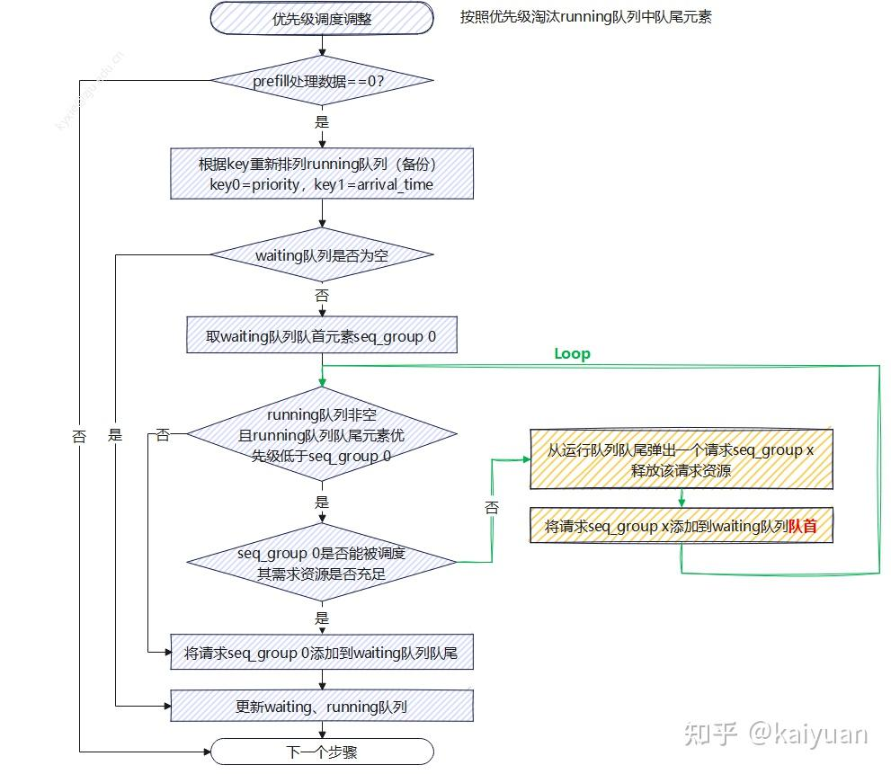

逻辑流程如上图所示，当不需要处理prefill数据时，才进行队列优先级调整。

1.  根据优先级调整running队列的元素，排序的逻辑是先参考优先级值（priority），其次是请求抵达时间（arrival time）。
2.  取出waiting队列队首元素（假设是seq\_group 0），请求seq\_group 0是为参考进行一个淘汰循环。
3.  判断running队尾元素（假设是seq\_group x）优先级计算是否小于seq\_group 0，是则进入步骤4，否则进入步骤5
4.  判断当前资源是否能够满足seq\_group 0，不能满足淘汰seq\_group x（清除资源，放回waiting队首），继续步骤3。
5.  seq\_group 0元素放会waiting队列队尾，更新整个scheduler的waiting和running队列。

当前这个优先级调整限制条件：

-   仅以waiting队列队首元素作为参考；
-   执行顺序是先对running队列排序，淘汰元素，最后对waiting队列排序；

带来的约束：首次执行时假设waiting队列里面还有其它优先级更高的元素不会用来淘汰running队列的元素。每次对waiting队列也有重排序，可能会导致某些运行了一半的请求中断后始终无法执行。

### 3.2 V1实现方式讨论

目前最新的scheduler中没有根据优先级重排序的逻辑（2025.4.30）要实现V0类似的功能，需要考虑的问题：

-   因为结构变化使scheduler不区分prefill/decode，排序需要针对全部请求；
-   增加的排序逻辑是否引入附带scheduler性能损耗？
-   处理优先级低的请求是直接淘汰请求，还是考虑**降低其tokens消耗量**？

处理时机的设计需要考虑当前的运行流程，处理是分段式的：先处理running队列，然后处理waiting队列。优先级特性可能需要调整处理流程，比如，根据前面分析可知当running队列中存在请求被抢占时，**waiting队列的处理会被跳过**， 若按照现有逻辑，高优先级的请求抵达waiting队列后，可能在一轮调度中不会进入running队列。

目前社区讨论的方案（参看：[issues/14002](https://link.zhihu.com/?target=https%3A//github.com/vllm-project/vllm/issues/14002)）都是考虑直接换出请求或者对请求队列重排序。即按照原来逻辑用优先级、抵达时间为排序的考虑因素去淘汰低优先级请求。

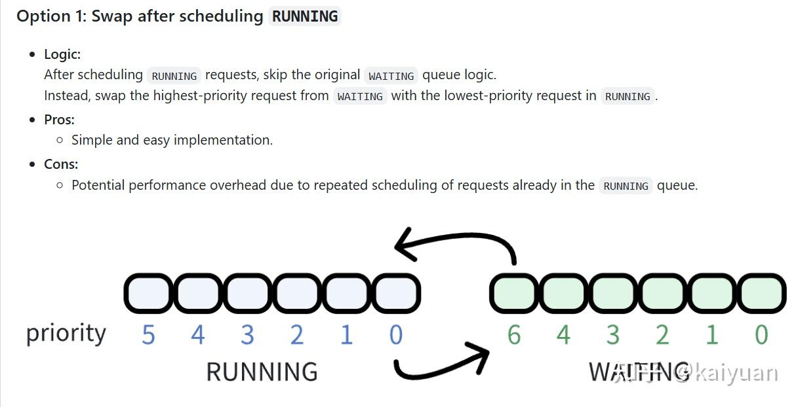

issue中讨论方案

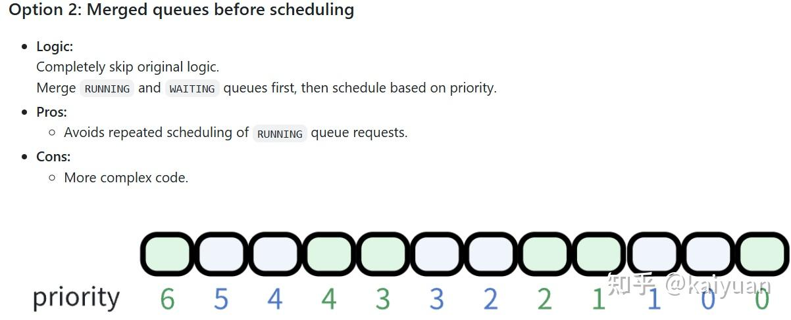

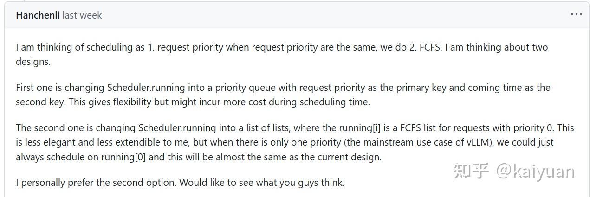

谈一下个人理解，优先级排序如果继续按照V0的逻辑（running、waiting都需要重新排序，用waiting队列队首元素淘汰running队列低优先级请求）实现的话。在running队列处理中进行调整，主要是修改资源不足的loop循环淘汰策略。想到方法是：

1.  排序running、waiting队列
2.  在running队列处理里面，计算队列里面每个请求元素的资源开销，然后用动态规划方式确认running队尾元素是否需要被淘汰；
3.  后续的waiting队列处理逻辑不变。

该方法的问题是，running队列里面每个元素的开销要计算一次。最好情况是计算量与之前相同，最坏情况是多了n-1次资源计算。

<方案代码待实现，留个坑>

调度器的调度策略还有PD分离场景本文中未做讨论，后续再展开讨论。

* * *

**参考**：

[vLLM V1: A Major Upgrade to vLLM's Core Architecture | vLLM Blog](https://link.zhihu.com/?target=https%3A//blog.vllm.ai/2025/01/27/v1-alpha-release.html)

[https://github.com/vllm-project/vllm/tree/v0.8.4](https://link.zhihu.com/?target=https%3A//github.com/vllm-project/vllm/tree/v0.8.4)

[https://github.com/vllm-project/vllm/issues/14002](https://link.zhihu.com/?target=https%3A//github.com/vllm-project/vllm/issues/14002)