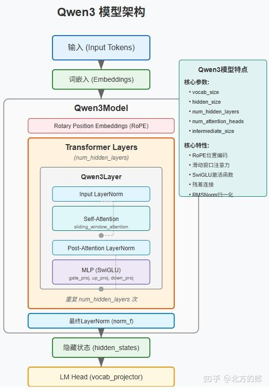
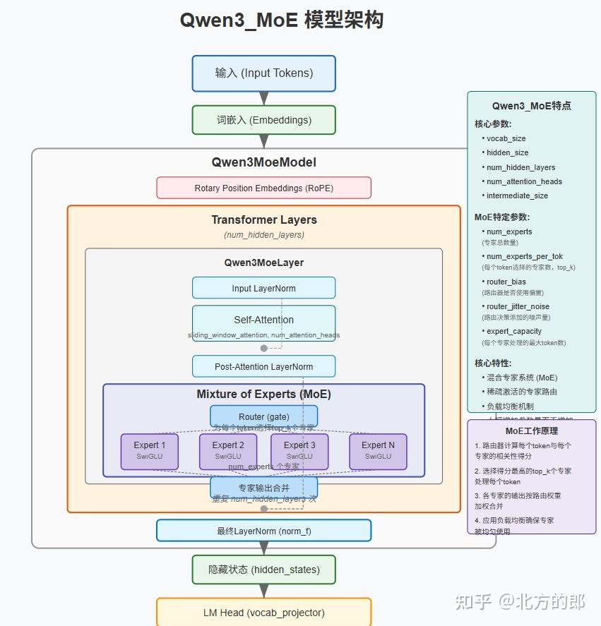
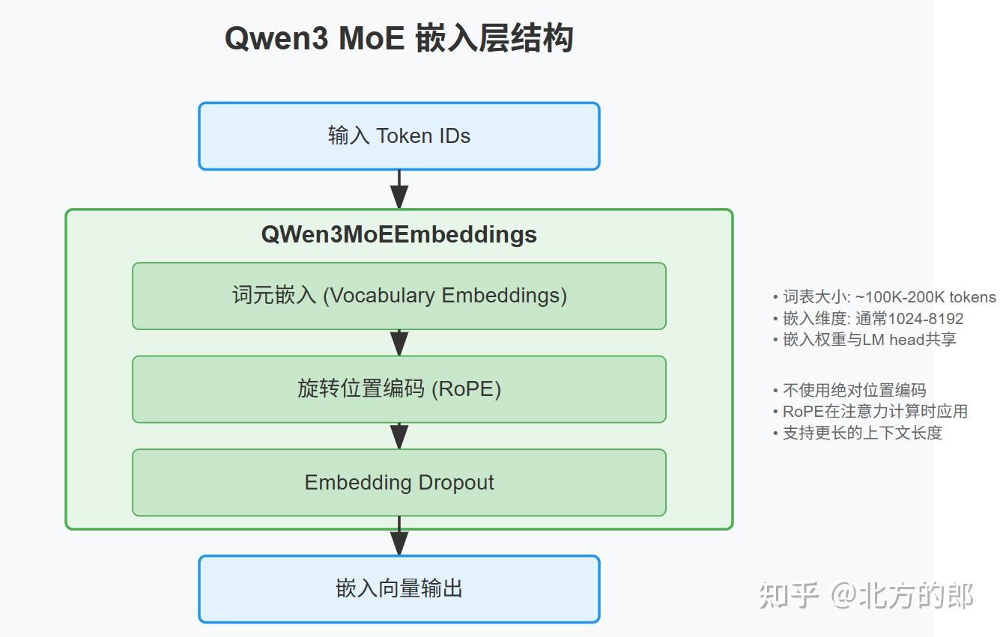
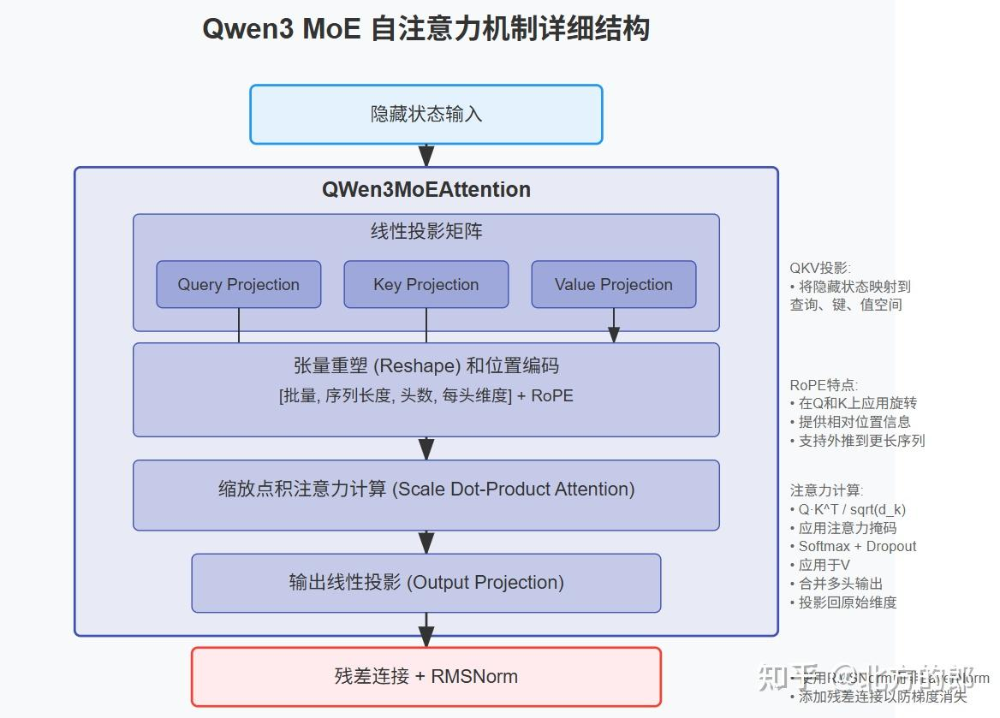
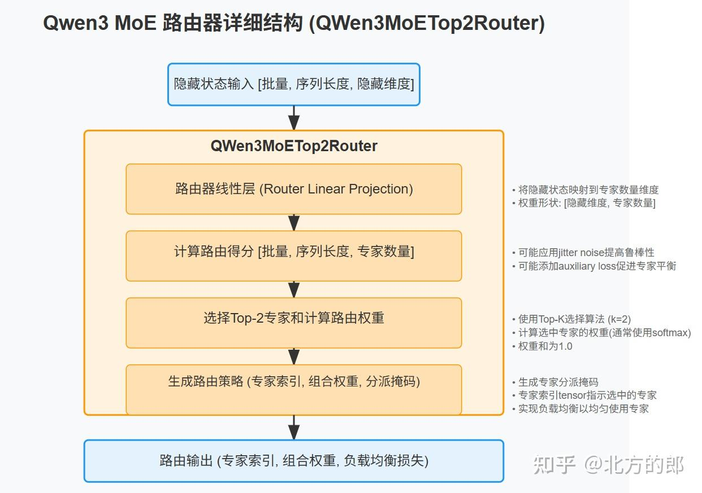
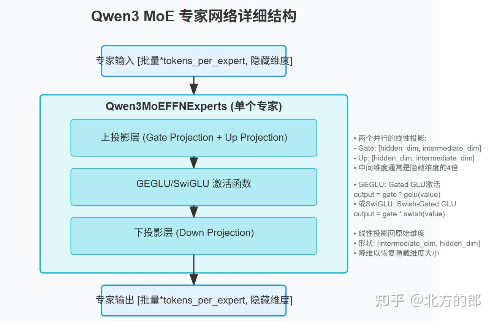

# QWen3&QWen3_moe架构示意图

**Author:** 北方的郎

**Date:** 2025-05-06

**Link:** https://zhuanlan.zhihu.com/p/1901176363198711291

​

目录

收起

Qwen3模型

Qwen3 MoE

Qwen3 MoE模型架构要点

Qwen3 MoE的优势

[QWen3](https://zhida.zhihu.com/search?content_id=257218115&content_type=Article&match_order=1&q=QWen3&zhida_source=entity)系列大模型发布后，引起广泛关注。具体参考：

[北方的郎：喜大普奔，阿里云发布Qwen3系列大型：思深，行速，迈向AGI与ASI新里程碑](https://zhuanlan.zhihu.com/p/1900457158849569252)

可是技术报告里面没有提供详细的模型架构图，为了方便大家理解，根据[Transformer](https://zhida.zhihu.com/search?content_id=257218115&content_type=Article&match_order=1&q=Transformer&zhida_source=entity)库的定义，我画出了QWen3架构示意图。

代码地址：

[https://github.com/huggingface/transformers/blob/main/src/transformers/models/qwen3\_moe](https://link.zhihu.com/?target=https%3A//github.com/huggingface/transformers/blob/main/src/transformers/models/qwen3_moe)

[https://github.com/huggingface/transformers/blob/main/src/transformers/models/qwen3](https://link.zhihu.com/?target=https%3A//github.com/huggingface/transformers/blob/main/src/transformers/models/qwen3)

## Qwen3模型



根据[Hugging Face Transformers](https://zhida.zhihu.com/search?content_id=257218115&content_type=Article&match_order=1&q=Hugging+Face+Transformers&zhida_source=entity)库中的Qwen3代码分析，上图展示了Qwen3的模型结构。下面我对该架构的主要组件进行详细说明：

**1 输入处理**：

输入的文本首先被转换为token ID序列，通过QWenModel的嵌入层(Embeddings)将token转换为向量表示

**2 核心Transformer块**：

Qwen3由N个相同的Transformer块堆叠而成，每个Transformer块包含以下组件：

**自注意力机制(Self-Attention)**：

-   包含Q(查询)、K(键)和V(值)三个投影矩阵
-   使用多头注意力机制(Multi-Head Attention)
-   采用旋转位置编码([RoPE](https://zhida.zhihu.com/search?content_id=257218115&content_type=Article&match_order=1&q=RoPE&zhida_source=entity))而不是传统的位置嵌入

**规一化层(Normalization)**：

使用[RMSNorm](https://zhida.zhihu.com/search?content_id=257218115&content_type=Article&match_order=1&q=RMSNorm&zhida_source=entity)(均方根归一化)，而非LayerNorm，在每个自注意力层和前馈网络之后都有Add & RMSNorm操作

**前馈网络(FFN)**：

采用GEGLU或SwiGLU激活函数，两个线性投影层之间使用该激活函数

**3 输出层**：

最终通过RMSNorm后，使用QWenLMHead生成下一个token的预测概率分布

Qwen3模型保留了现代大型语言模型的核心架构特点，同时在一些细节上做了优化，如使用RMSNorm替代LayerNorm，采用旋转位置编码(RoPE)，以及特定的激活函数，这些设计选择帮助提升了模型性能和训练效率。

## [Qwen3 MoE](https://zhida.zhihu.com/search?content_id=257218115&content_type=Article&match_order=1&q=Qwen3+MoE&zhida_source=entity)

### Qwen3 MoE模型架构要点

根据Hugging Face Transformers库中的Qwen3 MoE代码分析，我绘制了Qwen3 MoE的模型架构图。Qwen3 MoE是Qwen3的混合专家(Mixture of Experts)版本。



下面我对该架构的主要组件进行详细说明：

**1 基础结构**：

与标准Qwen3相似，但在前馈网络(FFN)部分使用了MoE结构，保留了基本的Transformer架构，包括自注意力机制和残差连接

**2 输入处理**：

输入文本被转换为token ID序列，通过[QWen3MoEModel](https://zhida.zhihu.com/search?content_id=257218115&content_type=Article&match_order=1&q=QWen3MoEModel&zhida_source=entity)的嵌入层将token转换为向量表示



**3 自注意力机制**：

与标准Qwen3相同，使用多头自注意力机制，同样采用旋转位置编码(RoPE)，注意力层后有Add & RMSNorm操作



**4 混合专家前馈网络(MoE FFN)**：

这是Qwen3 MoE区别于标准Qwen3的核心部分，包含以下关键组件：

a. **路由器(Router)**：

使用[QWen3MoETop2Router](https://zhida.zhihu.com/search?content_id=257218115&content_type=Article&match_order=1&q=QWen3MoETop2Router&zhida_source=entity)实现

为每个输入token决定应该使用哪些专家

采用Top-2路由策略，即为每个token选择2个最相关的专家



b. **专家网络(Experts)**：

多个并行的前馈网络(FFN)专家

每个专家是一个完整的FFN，包含上投影和下投影层

专家数量可配置



c. **输出组合(Combiner)**：

根据路由权重将选中专家的输出进行加权组合

生成最终的FFN层输出

**代码：**

```text
class Qwen3MoeSparseMoeBlock(nn.Module):
    def __init__(self, config):
        super().__init__()
        self.num_experts = config.num_experts
        self.top_k = config.num_experts_per_tok
        self.norm_topk_prob = config.norm_topk_prob

        # gating
        self.gate = nn.Linear(config.hidden_size, config.num_experts, bias=False)
        self.experts = nn.ModuleList(
            [Qwen3MoeMLP(config, intermediate_size=config.moe_intermediate_size) for _ in range(self.num_experts)]
        )

    def forward(self, hidden_states: torch.Tensor) -> torch.Tensor:
        """ """
        batch_size, sequence_length, hidden_dim = hidden_states.shape
        hidden_states = hidden_states.view(-1, hidden_dim)
        # router_logits: (batch * sequence_length, n_experts)
        router_logits = self.gate(hidden_states)

        routing_weights = F.softmax(router_logits, dim=1, dtype=torch.float)
        routing_weights, selected_experts = torch.topk(routing_weights, self.top_k, dim=-1)
        if self.norm_topk_prob:  # only diff with mixtral sparse moe block!
            routing_weights /= routing_weights.sum(dim=-1, keepdim=True)
        # we cast back to the input dtype
        routing_weights = routing_weights.to(hidden_states.dtype)

        final_hidden_states = torch.zeros(
            (batch_size * sequence_length, hidden_dim), dtype=hidden_states.dtype, device=hidden_states.device
        )

        # One hot encode the selected experts to create an expert mask
        # this will be used to easily index which expert is going to be sollicitated
        expert_mask = torch.nn.functional.one_hot(selected_experts, num_classes=self.num_experts).permute(2, 1, 0)

        # Loop over all available experts in the model and perform the computation on each expert
        for expert_idx in range(self.num_experts):
            expert_layer = self.experts[expert_idx]
            idx, top_x = torch.where(expert_mask[expert_idx])

            # Index the correct hidden states and compute the expert hidden state for
            # the current expert. We need to make sure to multiply the output hidden
            # states by `routing_weights` on the corresponding tokens (top-1 and top-2)
            current_state = hidden_states[None, top_x].reshape(-1, hidden_dim)
            current_hidden_states = expert_layer(current_state) * routing_weights[top_x, idx, None]

            # However `index_add_` only support torch tensors for indexing so we'll use
            # the `top_x` tensor here.
            final_hidden_states.index_add_(0, top_x, current_hidden_states.to(hidden_states.dtype))
        final_hidden_states = final_hidden_states.reshape(batch_size, sequence_length, hidden_dim)
        return final_hidden_states, router_logits
```

**5 规范化和残差连接**：

使用RMSNorm代替LayerNorm

在注意力层和MoE FFN层后都有Add & RMSNorm操作

**6 输出处理**：

最终通过RMSNorm处理

使用QWen3MoELMHead生成下一个token的预测概率

### Qwen3 MoE的优势

MoE结构允许模型在不显著增加推理计算量的情况下大幅增加参数量，因为对于每个输入只激活部分专家。这种设计带来了以下优势：

1.  **更大的模型容量**：通过多个专家网络增加了模型的总参数量
2.  **计算效率**：每次前向传播只使用一部分专家，提高了计算效率
3.  **专业化能力**：不同专家可以专注于不同类型的语言任务或模式
4.  **可扩展性**：MoE架构更容易扩展到更大规模

Qwen3 MoE的这种结构使其在保持高效推理的同时，能够达到比同等计算量的密集模型更强的性能。